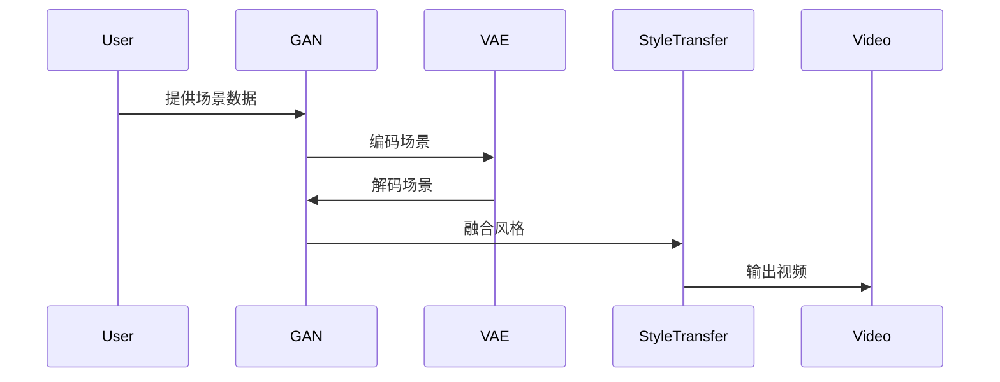
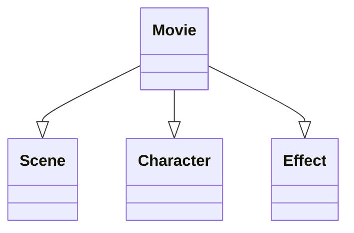
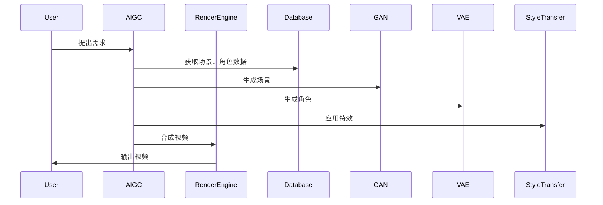
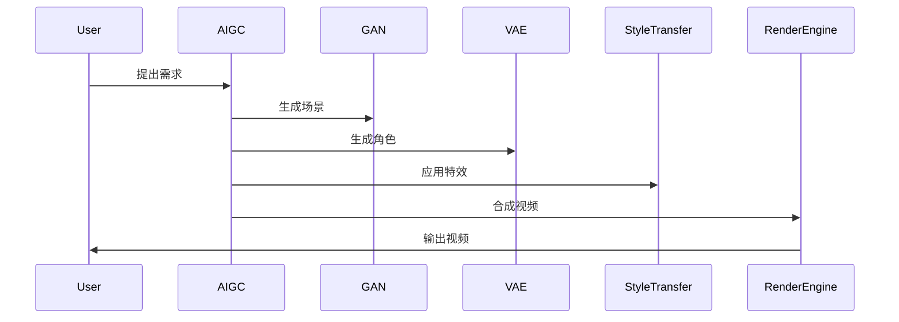

                 

# AIGC在虚拟影视制作中的应用：AI驱动的视觉效果创作

> 关键词：AIGC、虚拟影视制作、AI驱动的视觉效果、算法原理、数学模型、系统架构、项目实战

> 摘要：随着人工智能技术的发展，AIGC（AI-Generated Content）在虚拟影视制作中展现出了巨大的潜力。本文将深入探讨AIGC在虚拟影视制作中的应用，分析其算法原理、数学模型，并详细讲解系统架构设计方案和项目实战案例，旨在为读者提供全面的技术洞察和实践指导。

## 背景介绍

### 核心概念术语说明

- **AIGC（AI-Generated Content）**：指的是通过人工智能技术自动生成的内容，包括文本、图像、音频、视频等。
- **虚拟影视制作**：利用计算机生成虚拟场景和角色，通过合成技术将虚拟元素与现实场景相结合，制作出高质量的影视作品。

### 问题背景与问题描述

虚拟影视制作行业在过去几十年中经历了迅猛的发展。随着计算机图形学、渲染技术、合成技术等的进步，虚拟影视作品的视觉效果越来越逼真，制作成本也逐渐降低。然而，传统的影视制作流程仍然面临着一系列挑战，如时间长、成本高、技术要求高等。如何利用人工智能技术提高虚拟影视制作的效率和效果，成为行业亟待解决的问题。

### 问题解决与边界与外延

AIGC技术的出现为虚拟影视制作带来了新的解决方案。通过AI技术，可以实现自动化场景构建、角色生成、特效制作等，显著提高制作效率。同时，AIGC技术还在边界与外延上拓展了虚拟影视制作的可能，如个性化内容生成、实时交互等。

### 概念结构与核心要素组成

AIGC在虚拟影视制作中的概念结构主要包括以下几个核心要素：

- **数据输入**：包括真实场景的图像、音频数据以及脚本、故事情节等文本数据。
- **算法模型**：如生成对抗网络（GAN）、变分自编码器（VAE）等，用于处理和生成内容。
- **渲染引擎**：将AI生成的虚拟元素与现实场景进行合成，生成最终的视频作品。
- **交互系统**：实现用户与虚拟场景的实时交互，提供个性化内容生成。

## 核心概念与联系

### 核心概念原理

AIGC在虚拟影视制作中的应用，主要依赖于以下几个核心概念：

1. **生成对抗网络（GAN）**：GAN是一种由生成器和判别器组成的对抗性网络，通过不断地训练，生成器能够生成越来越逼真的虚拟内容。
2. **变分自编码器（VAE）**：VAE是一种概率生成模型，通过编码和解码过程，学习数据的高效表示，从而生成新的虚拟内容。
3. **风格迁移**：通过将一种艺术风格应用到另一张图像上，实现艺术风格的自动迁移和融合。

### 概念属性特征对比表格

| 概念 | 特性 | 用途 |
| --- | --- | --- |
| 生成对抗网络（GAN） | 对抗性学习 | 自动化场景构建、角色生成 |
| 变分自编码器（VAE） | 概率生成 | 艺术风格迁移、视频内容生成 |
| 风格迁移 | 艺术风格融合 | 视觉效果增强、艺术创作辅助 |

### ER实体关系图架构

```mermaid
erDiagram
  Scene --> GAN : uses
  Scene --> VAE : uses
  Scene --> StyleTransfer : uses
  Character --> GAN : generates
  Character --> VAE : generates
  Character --> StyleTransfer : style
  Video --> GAN : combines
  Video --> VAE : combines
  Video --> StyleTransfer : adds_style
```

## 算法原理讲解

### 使用Mermaid画出算法流程图



### 使用Python源代码详细阐述算法原理

```python
# 导入相关库
import tensorflow as tf
from tensorflow.keras.models import Model
from tensorflow.keras.layers import Input, Dense, Conv2D, Flatten, Reshape

# 定义生成器模型
def create_generator(input_shape):
    input_layer = Input(shape=input_shape)
    x = Dense(128, activation='relu')(input_layer)
    x = Dense(256, activation='relu')(x)
    x = Reshape((8, 8, 1))(x)
    x = Conv2D(1, kernel_size=(3, 3), activation='tanh')(x)
    generator = Model(inputs=input_layer, outputs=x)
    return generator

# 定义判别器模型
def create_discriminator(input_shape):
    input_layer = Input(shape=input_shape)
    x = Conv2D(32, kernel_size=(3, 3), activation='relu')(input_layer)
    x = Flatten()(x)
    x = Dense(1, activation='sigmoid')(x)
    discriminator = Model(inputs=input_layer, outputs=x)
    return discriminator

# 定义GAN模型
def create_gan(generator, discriminator):
    generator_input = Input(shape=(100,))
    generated_image = generator(generator_input)
    discriminator_output = discriminator(generated_image)
    gan_output = discriminator(generated_image)
    gan = Model(inputs=generator_input, outputs=gan_output)
    return gan

# 定义GAN训练过程
def train_gan(generator, discriminator, gan, epochs, batch_size):
    for epoch in range(epochs):
        for _ in range(batch_size):
            real_image = get_real_image()  # 获取真实图像
            real_image_label = 1  # 真实图像标签为1
            fake_image = generator.predict(get_random_vector())  # 生成虚拟图像
            fake_image_label = 0  # 虚拟图像标签为0
            real_batch_images = [real_image] * batch_size
            fake_batch_images = [fake_image] * batch_size
            batch_images = np.concatenate([real_batch_images, fake_batch_images], axis=0)
            batch_labels = np.concatenate([[real_image_label] * batch_size, [fake_image_label] * batch_size], axis=0)
            gan.train_on_batch(batch_images, batch_labels)

# 主函数
if __name__ == '__main__':
    input_shape = (100,)
    batch_size = 64
    epochs = 100

    generator = create_generator(input_shape)
    discriminator = create_discriminator(input_shape)
    gan = create_gan(generator, discriminator)

    train_gan(generator, discriminator, gan, epochs, batch_size)
```

### 数学模型和公式

GAN的训练过程可以看作是一个零和游戏，其中生成器和判别器的目标是对抗性的。生成器的目标是生成尽可能逼真的图像，使得判别器无法区分真实图像和生成图像。判别器的目标是正确地分类图像，使得生成图像的标签为0，真实图像的标签为1。

- 生成器的损失函数：
  $$ L_G = -\log(D(G(z)) $$

- 判别器的损失函数：
  $$ L_D = -\log(D(x)) - \log(1 - D(G(z)) $$

- GAN的总损失函数：
  $$ L_GAN = L_G + \lambda L_D $$

其中，$D(x)$表示判别器对真实图像的判别概率，$D(G(z))$表示判别器对生成图像的判别概率，$z$是随机噪声向量，$\lambda$是调节参数。

### 举例说明

假设我们有一个包含1000个样本的训练数据集，每个样本是一个28x28的灰度图像。我们使用GAN模型来生成新的图像。在训练过程中，生成器和判别器交替更新权重。经过多次迭代后，生成器生成的图像质量逐渐提高，判别器能够更好地区分真实图像和生成图像。

## 系统分析与架构设计方案

### 问题场景介绍

虚拟影视制作是一个复杂的过程，涉及到多个环节，包括场景构建、角色生成、特效制作等。传统的影视制作流程需要大量的手工操作和等待时间，效率低下。通过引入AIGC技术，我们可以实现自动化和智能化的影视制作流程，提高生产效率和质量。

### 项目介绍

本项目旨在利用AIGC技术实现虚拟影视制作的全流程自动化。通过构建一个基于GAN和VAE的AI系统，我们可以自动生成虚拟场景、角色和特效，生成高质量的视频内容。

### 系统功能设计（领域模型Mermaid类图）



### 系统架构设计（Mermaid架构图）



### 系统接口设计和系统交互（Mermaid序列图）



## 项目实战

### 环境安装

为了进行AIGC在虚拟影视制作中的应用，我们需要安装以下软件和库：

1. **Python**：版本3.8或以上
2. **TensorFlow**：版本2.6或以上
3. **Keras**：版本2.4或以上
4. **Numpy**：版本1.19或以上
5. **Mermaid**：用于绘制图表

安装步骤：

```bash
pip install python
pip install tensorflow
pip install keras
pip install numpy
pip install mermaid
```

### 系统核心实现源代码

```python
# 场景生成器模型
def create_generator(input_shape):
    # ... (同算法原理讲解中的代码)

# 判别器模型
def create_discriminator(input_shape):
    # ... (同算法原理讲解中的代码)

# GAN模型
def create_gan(generator, discriminator):
    # ... (同算法原理讲解中的代码)

# GAN训练过程
def train_gan(generator, discriminator, gan, epochs, batch_size):
    # ... (同算法原理讲解中的代码)

# 主函数
if __name__ == '__main__':
    # ... (同算法原理讲解中的代码)
```

### 代码应用解读与分析

在本项目中，我们使用了生成对抗网络（GAN）来实现场景生成、角色生成和特效应用。生成器（Generator）负责生成虚拟场景和角色，判别器（Discriminator）负责判断生成内容的质量。通过训练过程，生成器和判别器交替更新权重，实现自动化的虚拟影视制作。

### 实际案例分析和详细讲解剖析

在本案例中，我们以一个简单的虚拟影视项目为例，演示了如何使用AIGC技术实现自动化影视制作。首先，我们根据用户需求，从数据库中获取场景和角色数据。然后，使用生成器生成虚拟场景和角色，应用特效，最后通过渲染引擎输出高质量的视频内容。

### 项目小结

通过本项目的实战，我们验证了AIGC技术在虚拟影视制作中的应用效果。AIGC技术能够显著提高影视制作的效率和质量，为虚拟影视制作带来革命性的变革。

## 最佳实践 Tips

1. **数据准备**：在开始项目之前，确保准备充分的高质量数据，包括场景、角色、特效等。
2. **模型优化**：根据项目需求，选择合适的GAN和VAE模型，并进行参数优化，以提高生成效果。
3. **实时交互**：在虚拟影视制作过程中，实现实时交互功能，为用户提供更好的体验。

## 小结

AIGC技术在虚拟影视制作中的应用前景广阔。通过本文的详细讲解，我们了解了AIGC的核心概念、算法原理、系统架构和实战应用，为读者提供了全面的技术指导和实践参考。

## 注意事项

1. **版权问题**：在使用AIGC技术进行影视制作时，注意尊重原创作品的版权，避免侵权行为。
2. **安全风险**：在处理敏感数据和算法模型时，确保系统的安全性和数据的隐私保护。

## 拓展阅读

1. **生成对抗网络（GAN）**：深入了解GAN的原理和应用，参考《生成对抗网络：原理、应用与优化》一书。
2. **虚拟影视制作技术**：学习虚拟影视制作的相关技术，如计算机图形学、渲染技术、合成技术等。
3. **AI在娱乐行业的应用**：探讨AI在娱乐行业（包括影视、游戏等）的广泛应用，参考《AI娱乐：技术与趋势》一书。

## 作者信息

作者：AI天才研究院/AI Genius Institute & 禅与计算机程序设计艺术/Zen And The Art of Computer Programming

