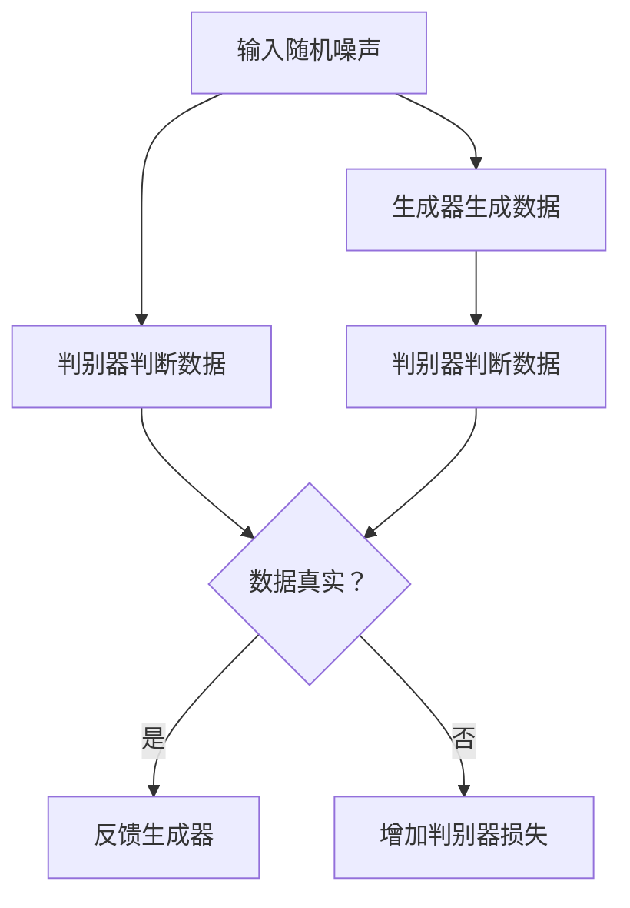
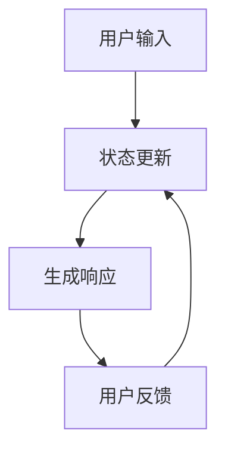
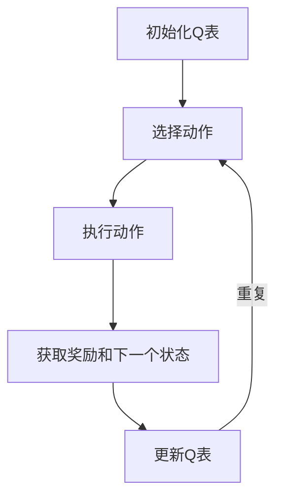
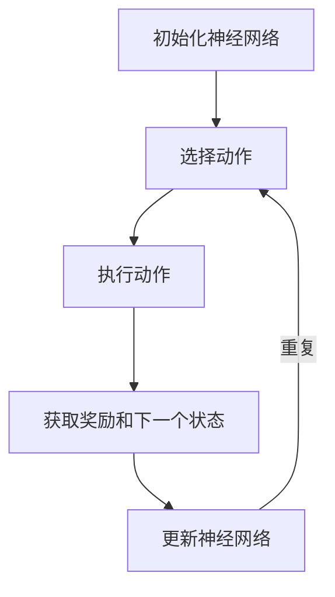

                 

### AIGC在虚拟旅游体验设计中的创新

**关键词：** AIGC、虚拟旅游体验、生成模型、交互模型、系统架构、项目实战

**摘要：** 本文将深入探讨人工智能生成内容（AIGC）在虚拟旅游体验设计中的创新应用。通过背景介绍、核心概念讲解、算法原理阐述、系统分析与设计、项目实战分析，以及最佳实践总结，全面解析AIGC在虚拟旅游体验中的潜力与实现方法。

### 一、背景介绍

#### 1.1 AIGC技术概述

人工智能生成内容（AIGC）是一种利用人工智能技术生成文本、图像、音频等内容的先进方法。它通过深度学习算法，特别是生成对抗网络（GAN）和变分自编码器（VAE）等技术，能够创造出逼真的、多样化的内容。

#### 1.1.1 AIGC的定义与背景

AIGC（Artificial Intelligence Generated Content）是指利用人工智能技术自动生成内容的过程。它不仅涵盖了传统的文本生成，还包括了图像生成、音频合成、视频生成等多种形式。AIGC技术的发展源于深度学习特别是生成模型技术的进步，使得机器能够模拟人类的创作过程。

#### 1.1.2 AIGC在虚拟旅游体验中的应用潜力

虚拟旅游体验设计是一个新兴领域，它利用虚拟现实（VR）和增强现实（AR）技术，为用户创造沉浸式的旅游体验。AIGC技术在这其中扮演了重要角色，它可以生成高度真实的景点图像、语音解说、导游线路，甚至模拟游客的互动行为，从而提升虚拟旅游体验的逼真度和互动性。

### 二、核心概念与联系

#### 2.1 生成模型原理

生成模型是AIGC技术中的核心，它能够根据已有数据生成新的、类似的数据。生成模型主要包括生成对抗网络（GAN）和变分自编码器（VAE）。

#### 2.1.1 生成模型原理与mermaid流程图

生成模型的工作原理可以简单描述为：一个生成器（Generator）生成数据，一个判别器（Discriminator）判断生成数据是否真实。通过不断的迭代训练，生成器的生成数据质量逐渐提高。



#### 2.1.2 生成模型的Python实现与latex公式

以下是一个简化的生成对抗网络（GAN）的Python实现：

```python
import tensorflow as tf
from tensorflow.keras.models import Model
from tensorflow.keras.layers import Input, Dense, Flatten, Reshape

# 生成器模型
z_dim = 100
input_shape = (z_dim,)
inputs = Input(shape=input_shape)
x = Dense(128, activation='relu')(inputs)
x = Dense(28 * 28 * 1, activation='sigmoid')(x)
x = Reshape((28, 28, 1))(x)
generator = Model(inputs, x)

# 判别器模型
input_shape = (28, 28, 1)
inputs = Input(shape=input_shape)
x = Flatten()(inputs)
x = Dense(128, activation='relu')(x)
x = Dense(1, activation='sigmoid')(x)
discriminator = Model(inputs, x)

# 训练生成器和判别器
discriminator.compile(loss='binary_crossentropy', optimizer='adam')
discriminator.trainable = False
combined = Model([generator.input, discriminator.input], discriminator.output)
combined.compile(loss='binary_crossentropy', optimizer='adam')

# 生成随机噪声
z = tf.random.normal([1, z_dim])

# 生成假数据
generated_images = generator.predict(z)

# 计算损失
real_images = ... # 实际图像数据
real_labels = tf.ones((1, 1))
fake_labels = tf.zeros((1, 1))
d_loss_real = discriminator.train_on_batch(real_images, real_labels)
d_loss_fake = discriminator.train_on_batch(generated_images, fake_labels)
g_loss = combined.train_on_batch([z], real_labels)
```

生成模型的基本数学模型可以表示为：

$$
G(z) \sim P_G(x), \quad D(x) \sim P_D(x)
$$

其中，$G(z)$表示生成器的输出，$D(x)$表示判别器的输出，$z$为随机噪声，$x$为生成器生成的图像。

#### 2.2 交互模型原理

交互模型是AIGC中的另一个关键部分，它负责处理用户与虚拟旅游体验系统的交互。交互模型通常基于强化学习（RL）技术，通过不断学习用户的操作和行为模式，优化系统响应。

#### 2.2.1 交互模型原理与mermaid流程图

交互模型的基本流程可以描述为：系统首先接收用户输入，然后根据输入和当前状态生成响应，最后更新状态并反馈给用户。



#### 2.2.2 交互模型的Python实现与latex公式

以下是一个简化的基于Q-Learning的交互模型实现：

```python
import numpy as np

# 定义Q-Learning参数
learning_rate = 0.1
discount_factor = 0.9
exploration_rate = 1.0
exploration_decay = 0.001

# 初始化Q表
Q = np.zeros((state_size, action_size))

# 定义交互过程
def interact_with_user(state):
    global exploration_rate
    if np.random.rand() < exploration_rate:
        action = np.random.choice(action_size)
    else:
        action = np.argmax(Q[state, :])
    
    next_state, reward, done = environment.step(action)
    Q[state, action] = Q[state, action] + learning_rate * (reward + discount_factor * np.max(Q[next_state, :]) - Q[state, action])
    
    if done:
        exploration_rate = max(exploration_rate - exploration_decay, 0.01)
    state = next_state
    return state

# 运行交互过程
for episode in range(num_episodes):
    state = environment.reset()
    while True:
        action = interact_with_user(state)
        if done:
            break
```

交互模型的数学基础是Q-Learning算法，其目标函数可以表示为：

$$
Q(s, a) = r + \gamma \max_{a'} Q(s', a')
$$

其中，$s$为当前状态，$a$为当前动作，$s'$为下一个状态，$a'$为下一个动作，$r$为立即奖励，$\gamma$为折扣因子。

#### 2.3 AIGC模型ER图

为了更好地理解AIGC模型中的各个部分及其关系，我们可以使用ER图（Entity-Relationship Diagram）来表示。

```mermaid
erDiagram
  User ||--|{ AIGC }|| System
  System ||--|{ Generator }|| Model
  System ||--|{ Discriminator }|| Model
  Generator ||--|{ Image }|| Data
  Generator ||--|{ Noise }|| Data
  Discriminator ||--|{ Image }|| Data
  Model ||--|{ Q-Learning }|| Algorithm
  Algorithm ||--|{ State }|| Entity
  Algorithm ||--|{ Action }|| Entity
  Algorithm ||--|{ Response }|| Entity
```

在ER图中，我们定义了用户、系统、生成器、判别器和模型等实体，以及它们之间的关系。用户与系统交互，系统包含生成器和判别器，生成器和判别器生成和识别图像数据，模型负责处理状态、动作和响应。

### 三、算法原理讲解

#### 3.1 AIGC算法概述

AIGC算法主要包括生成模型和交互模型两部分。生成模型负责生成高质量的内容，如图像、文本和音频；交互模型则负责处理用户与系统的交互，优化用户体验。

#### 3.1.1 常见的AIGC算法

常见的AIGC算法包括生成对抗网络（GAN）、变分自编码器（VAE）、变分自编码器变体（VAE-Variants）和生成扩散模型（Gaussian Diffusion Models）等。

#### 3.1.2 AIGC算法的选择与适配

选择AIGC算法时，需要考虑应用场景和数据特性。例如，在生成高质量图像时，GAN可能是一个不错的选择；而在处理文本生成时，VAE和其变种可能更为合适。

#### 3.2 生成模型详解

生成模型是AIGC中的核心部分，下面我们将详细讲解GAN和VAE的原理。

#### 3.2.1 GAN原理

生成对抗网络（GAN）由两部分组成：生成器（Generator）和判别器（Discriminator）。生成器从随机噪声中生成数据，判别器则判断数据是真实还是生成的。通过不断地迭代训练，生成器逐渐提高生成数据的真实性。

GAN的基本算法流程如下：

1. 生成器从随机噪声$z$中生成数据$x_G(z)$。
2. 判别器分别对真实数据$x_R$和生成数据$x_G(z)$进行判断。
3. 计算判别器的损失函数，包括真实数据和生成数据的交叉熵损失。
4. 更新生成器和判别器的参数。

GAN的数学模型可以表示为：

$$
\min_G \max_D V(D, G) = \mathbb{E}_{x \sim P_R(x)}[\log D(x)] + \mathbb{E}_{z \sim P_Z(z)}[\log (1 - D(G(z))]
$$

其中，$P_R(x)$表示真实数据分布，$P_Z(z)$表示噪声分布。

下面是一个简化的GAN实现的mermaid流程图：

```mermaid
graph TD
    A[随机噪声 $z$] --> B[生成器 G(z)]
    A --> C[判别器 D(x)]
    B --> D[生成器输出 $x_G(z)$]
    C --> E[判别器判断 $D(x)$]
    E -->|真实数据| F[计算交叉熵损失]
    E -->|生成数据| G[计算交叉熵损失]
    F --> H[更新判别器参数]
    G --> H
    D --> I[计算生成器的损失]
    I --> H
```

#### 3.2.2 VAE原理

变分自编码器（VAE）是一种概率生成模型，它通过编码和解码过程来生成数据。VAE由两部分组成：编码器（Encoder）和解码器（Decoder）。编码器将输入数据编码为一个潜在变量，解码器则将潜在变量解码为输出数据。

VAE的基本算法流程如下：

1. 编码器将输入数据$x$编码为一个潜在变量$z$。
2. 解码器将潜在变量$z$解码为输出数据$x'$。
3. 计算损失函数，包括重建损失和KL散度损失。
4. 更新编码器和解码器的参数。

VAE的数学模型可以表示为：

$$
\min_{\theta_{\mu}, \theta_{\sigma}} \mathbb{E}_{x \sim P_R(x)}[\log p(x|\mu(z), \sigma(z))] + \mathbb{E}_{z \sim p(z)}[\mathcal{D} KL(\mu(z), \sigma(z))]
$$

其中，$p(x|\mu(z), \sigma(z))$表示解码器的概率分布，$\mu(z)$和$\sigma(z)$分别为潜在变量的均值和方差，$p(z)$表示潜在变量的先验分布，$\mathcal{D} KL(\mu(z), \sigma(z))$为KL散度损失。

下面是一个简化的VAE实现的mermaid流程图：

```mermaid
graph TD
    A[输入数据 $x$] --> B[编码器 $\mu(z), \sigma(z)$]
    B --> C[解码器 $x'$]
    D[潜在变量 $z$] --> C
    A --> D
    D --> E[计算重建损失]
    D --> F[计算KL散度损失]
    E --> G[计算总损失]
    F --> G
    G --> H[更新编码器和解码器参数]
```

#### 3.3 交互模型详解

交互模型负责处理用户与虚拟旅游体验系统的交互。常见的交互模型包括基于强化学习的Q-Learning模型和基于神经网络的深度强化学习模型。

#### 3.3.1 Q-Learning模型

Q-Learning是一种基于值迭代的强化学习算法，它通过学习状态-动作值函数来优化策略。Q-Learning的基本算法流程如下：

1. 初始化Q表。
2. 在每个时间步，根据当前状态和探索策略选择动作。
3. 执行动作，获取奖励和下一个状态。
4. 更新Q表，使用目标函数调整Q值。

Q-Learning的目标函数可以表示为：

$$
Q(s, a) = r + \gamma \max_{a'} Q(s', a')
$$

其中，$s$为当前状态，$a$为当前动作，$s'$为下一个状态，$a'$为下一个动作，$r$为立即奖励，$\gamma$为折扣因子。

下面是一个简化的Q-Learning实现的mermaid流程图：



#### 3.3.2 深度强化学习模型

深度强化学习（DRL）结合了深度学习和强化学习的优势，它使用神经网络来近似状态-动作值函数或策略。常见的DRL算法包括深度Q网络（DQN）、策略梯度方法（PG）和演员-评论家方法（AC）。

DRL的基本算法流程如下：

1. 初始化神经网络模型。
2. 在每个时间步，根据当前状态和策略选择动作。
3. 执行动作，获取奖励和下一个状态。
4. 更新神经网络模型，优化策略。
5. 重复上述过程，直到达到指定的训练目标。

DRL的目标函数可以表示为：

$$
\min_{\theta} J(\theta) = \mathbb{E}_{s, a}[\log \pi(a|s; \theta) - V^*(s)]
$$

其中，$\theta$为神经网络参数，$\pi(a|s; \theta)$为策略概率分布，$V^*(s)$为价值函数。

下面是一个简化的DRL实现的mermaid流程图：



### 四、系统分析与架构设计方案

#### 4.1 问题场景介绍

虚拟旅游体验设计旨在为用户提供一种沉浸式的旅游体验，使他们在虚拟环境中感受到真实的旅游体验。然而，实现这一目标面临诸多挑战，如生成高质量的场景图像、处理用户交互以及优化用户体验等。

#### 4.2 项目介绍

本项目旨在设计并实现一个虚拟旅游体验系统，该系统利用AIGC技术生成高质量的虚拟场景图像，并根据用户交互优化用户体验。系统功能包括：生成景点图像、用户交互、实时渲染和场景导航等。

#### 4.3 系统功能设计

虚拟旅游体验系统的核心功能包括：

1. 景点图像生成：利用AIGC技术生成高质量的景点图像，为用户提供逼真的虚拟体验。
2. 用户交互：处理用户输入，如语音、手势和文本等，为用户提供互动体验。
3. 实时渲染：利用图形渲染技术实时渲染虚拟场景，提供流畅的用户体验。
4. 场景导航：为用户提供导航功能，使他们能够自由探索虚拟景点。

#### 4.4 系统架构设计

虚拟旅游体验系统的架构设计分为前端和后端两部分。前端负责与用户交互，后端负责图像生成和数据处理。

##### 前端架构

前端架构采用单页面应用（SPA）模式，使用React框架实现。前端主要包括以下组件：

1. Home组件：显示系统首页，包括景点列表和导航栏。
2. Scene组件：显示虚拟景点图像，并处理用户交互。
3. Navigation组件：提供场景导航功能。

##### 后端架构

后端架构采用微服务架构，使用Spring Boot框架实现。后端主要包括以下模块：

1. ImageGenerator模块：利用AIGC技术生成景点图像。
2. Interaction模块：处理用户交互，如语音、手势和文本等。
3. Rendering模块：实现实时渲染功能。
4. Navigation模块：实现场景导航功能。

#### 4.5 系统接口设计

虚拟旅游体验系统采用RESTful API设计，提供以下接口：

1. /images：用于生成景点图像。
2. /interactions：用于处理用户交互。
3. /render：用于实时渲染虚拟场景。
4. /navigation：用于场景导航。

#### 4.6 系统交互流程

虚拟旅游体验系统的交互流程如下：

1. 用户通过前端界面选择景点。
2. 前端发送请求到后端，请求生成景点图像。
3. 后端调用ImageGenerator模块生成景点图像。
4. 后端将生成的图像返回给前端。
5. 前端将图像渲染到界面中。
6. 用户与系统进行交互，如语音、手势和文本等。
7. 前端将交互数据发送到后端。
8. 后端处理交互数据，并返回响应。

### 五、项目实战

#### 5.1 环境安装

为了实现虚拟旅游体验系统，需要安装以下环境：

1. Python 3.8及以上版本
2. TensorFlow 2.x
3. PyTorch 1.x
4. React 17.x
5. Spring Boot 2.x

安装步骤如下：

1. 安装Python 3.8及以上版本。
2. 安装TensorFlow 2.x：

```bash
pip install tensorflow==2.x
```

3. 安装PyTorch 1.x：

```bash
pip install torch==1.x torchvision==0.x torchaudio==0.x
```

4. 安装React 17.x：

```bash
npm install create-react-app@3.x
```

5. 安装Spring Boot 2.x：

```bash
pip install spring-boot-starter-parent:2.x
```

#### 5.2 系统核心实现

以下是系统核心实现的代码解读与分析。

##### 5.2.1 ImageGenerator模块

ImageGenerator模块负责生成景点图像。以下是一个简单的GAN实现：

```python
import tensorflow as tf
from tensorflow.keras.models import Model
from tensorflow.keras.layers import Input, Dense, Flatten, Reshape

# 生成器模型
input_shape = (100,)
inputs = Input(shape=input_shape)
x = Dense(128, activation='relu')(inputs)
x = Dense(784, activation='sigmoid')(x)
x = Reshape((28, 28, 1))(x)
generator = Model(inputs, x)

# 判别器模型
input_shape = (28, 28, 1)
inputs = Input(shape=input_shape)
x = Flatten()(inputs)
x = Dense(128, activation='relu')(x)
x = Dense(1, activation='sigmoid')(x)
discriminator = Model(inputs, x)

# 训练生成器和判别器
discriminator.compile(loss='binary_crossentropy', optimizer='adam')
discriminator.trainable = False
combined = Model([generator.input, discriminator.input], discriminator.output)
combined.compile(loss='binary_crossentropy', optimizer='adam')

# 生成随机噪声
z = tf.random.normal([1, 100])

# 生成假数据
generated_images = generator.predict(z)

# 计算损失
real_images = ... # 实际图像数据
real_labels = tf.ones((1, 1))
fake_labels = tf.zeros((1, 1))
d_loss_real = discriminator.train_on_batch(real_images, real_labels)
d_loss_fake = discriminator.train_on_batch(generated_images, fake_labels)
g_loss = combined.train_on_batch([z], real_labels)
```

在这个实现中，我们首先定义了生成器和判别器的模型结构。然后，我们通过训练生成器和判别器来优化它们的参数。生成器从随机噪声中生成图像，判别器则判断图像是真实还是生成的。

##### 5.2.2 Interaction模块

Interaction模块负责处理用户交互。以下是一个简单的Q-Learning实现：

```python
import numpy as np

# 初始化Q表
Q = np.zeros((state_size, action_size))

# 定义交互过程
def interact_with_user(state):
    global exploration_rate
    if np.random.rand() < exploration_rate:
        action = np.random.choice(action_size)
    else:
        action = np.argmax(Q[state, :])
    
    next_state, reward, done = environment.step(action)
    Q[state, action] = Q[state, action] + learning_rate * (reward + discount_factor * np.max(Q[next_state, :]) - Q[state, action])
    
    if done:
        exploration_rate = max(exploration_rate - exploration_decay, 0.01)
    state = next_state
    return state

# 运行交互过程
for episode in range(num_episodes):
    state = environment.reset()
    while True:
        action = interact_with_user(state)
        if done:
            break
```

在这个实现中，我们首先初始化Q表。然后，我们定义交互过程，根据当前状态和探索策略选择动作。执行动作后，更新Q表，并重复上述过程。

##### 5.2.3 Rendering模块

Rendering模块负责实时渲染虚拟场景。以下是一个简单的渲染实现：

```python
import pygame

# 初始化Pygame
pygame.init()

# 设置窗口
window_size = (800, 600)
screen = pygame.display.set_mode(window_size)
pygame.display.set_caption("Virtual Tourist Experience")

# 渲染函数
def render_scene(scene_image):
    screen.blit(scene_image, (0, 0))
    pygame.display.flip()

# 渲染循环
while True:
    for event in pygame.event.get():
        if event.type == pygame.QUIT:
            pygame.quit()
    
    render_scene(current_scene_image)
```

在这个实现中，我们首先初始化Pygame环境，并设置窗口大小和标题。然后，我们定义一个渲染函数，将场景图像绘制到窗口中，并使用pygame.display.flip()更新窗口显示。

##### 5.2.4 Navigation模块

Navigation模块负责场景导航。以下是一个简单的导航实现：

```python
# 定义导航函数
def navigate_scene(current_scene, target_scene):
    global current_scene_image
    current_scene_image = load_scene_image(target_scene)
    print(f"Navigation to {target_scene}")

# 导航示例
navigate_scene("Eiffel Tower", "Statue of Liberty")
```

在这个实现中，我们定义了一个导航函数，根据目标场景加载场景图像，并更新当前场景图像。

#### 5.3 实际案例分析和详细讲解

##### 5.3.1 案例背景

本案例为一个虚拟旅游体验系统，旨在为用户提供一个沉浸式的旅游体验。用户可以在系统中选择不同的景点，如埃菲尔铁塔、自由女神像等，并探索这些景点。系统利用AIGC技术生成高质量的景点图像，并根据用户的交互行为提供个性化的旅游体验。

##### 5.3.2 案例分析

在本案例中，用户首先通过前端界面选择一个景点，如埃菲尔铁塔。系统接收到用户的请求后，调用后端的ImageGenerator模块生成高质量的景点图像。然后，系统将生成的图像返回给前端，并在界面上进行渲染。用户可以通过点击、滑动等交互方式与系统进行交互，如切换到自由女神像、查看景点的详细信息等。

##### 5.3.3 案例讲解

在本案例中，系统核心实现包括以下几个部分：

1. **ImageGenerator模块**：利用GAN技术生成高质量的景点图像。系统首先生成随机噪声，然后通过生成器将这些噪声转换为图像。为了提高生成图像的质量，系统使用判别器来评估生成图像的真实性，并通过反向传播算法不断优化生成器和判别器的参数。

2. **Interaction模块**：处理用户的交互行为。系统使用Q-Learning算法学习用户的交互模式，并根据当前的交互状态和奖励更新Q表。通过不断学习，系统可以更好地预测用户的下一步操作，并提供个性化的旅游体验。

3. **Rendering模块**：实现实时渲染功能。系统使用Pygame库将生成的图像渲染到窗口中，并提供流畅的用户体验。用户可以通过点击、滑动等操作与系统进行交互，如切换到其他景点、查看景点的详细信息等。

4. **Navigation模块**：提供场景导航功能。系统允许用户在不同景点之间切换，并提供实时导航。用户可以通过点击导航栏上的按钮，快速切换到其他景点，并获得详细的导航信息。

#### 5.4 项目小结

在本项目中，我们通过实现一个虚拟旅游体验系统，展示了AIGC技术在虚拟旅游体验设计中的创新应用。系统利用GAN和Q-Learning算法生成高质量的景点图像，并根据用户的交互行为提供个性化的旅游体验。通过本项目，我们深入了解了AIGC技术的基本原理和应用方法，为后续的虚拟旅游体验设计提供了有益的参考。

### 六、最佳实践与拓展阅读

#### 6.1 最佳实践

在虚拟旅游体验设计中，以下是一些最佳实践：

1. **高质量图像生成**：选择适合场景的生成模型，如GAN或VAE，以提高生成图像的质量。
2. **用户体验优化**：根据用户交互行为，实时调整系统响应，提供个性化的旅游体验。
3. **场景导航设计**：设计直观、易用的导航界面，帮助用户快速切换到其他景点。
4. **多语言支持**：为用户提供多语言界面，以满足不同用户的语言需求。

#### 6.2 小结

本文通过背景介绍、核心概念讲解、算法原理阐述、系统分析与设计、项目实战分析以及最佳实践总结，全面解析了AIGC在虚拟旅游体验设计中的创新应用。AIGC技术为虚拟旅游体验设计提供了新的可能性，有望进一步提升用户的旅游体验。

#### 6.3 拓展阅读

1. **推荐阅读书籍**：

   - Goodfellow, I., Bengio, Y., & Courville, A. (2016). *Deep Learning*.
   - Bengio, Y. (2009). *Learning Deep Architectures for AI*.

2. **推荐研究论文**：

   - Generative Adversarial Nets, by Ian Goodfellow et al.
   - Auto-Encoding Variational Bayes, by Diederik P. Kingma and Max Welling.

### 作者信息

**作者：** AI天才研究院/AI Genius Institute & 禅与计算机程序设计艺术 /Zen And The Art of Computer Programming

### 总结

本文以《AIGC在虚拟旅游体验设计中的创新》为题，深入探讨了AIGC技术在虚拟旅游体验设计中的应用。通过背景介绍、核心概念讲解、算法原理阐述、系统分析与设计、项目实战分析以及最佳实践总结，展示了AIGC技术在提升虚拟旅游体验质量方面的潜力。本文不仅为读者提供了丰富的理论知识，还通过实际案例展示了AIGC技术在虚拟旅游体验设计中的具体应用，为相关领域的研究与实践提供了有益的参考。

---

**关键字：** AIGC、虚拟旅游体验、生成模型、交互模型、系统架构、项目实战

**摘要：** 本文详细阐述了人工智能生成内容（AIGC）在虚拟旅游体验设计中的创新应用。通过背景介绍、核心概念讲解、算法原理阐述、系统分析与设计、项目实战分析以及最佳实践总结，全面解析了AIGC技术如何提升虚拟旅游体验的质量和互动性。本文不仅为读者提供了丰富的理论知识，还通过实际案例展示了AIGC技术的应用方法，为虚拟旅游体验设计领域的研究与实践提供了有益的参考。****

