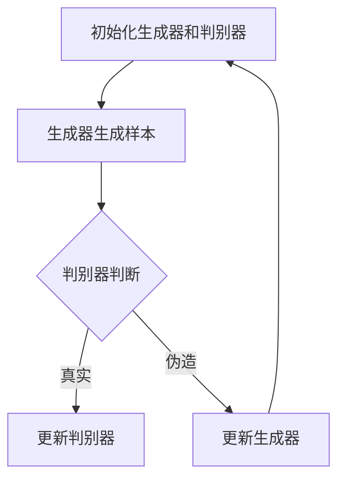
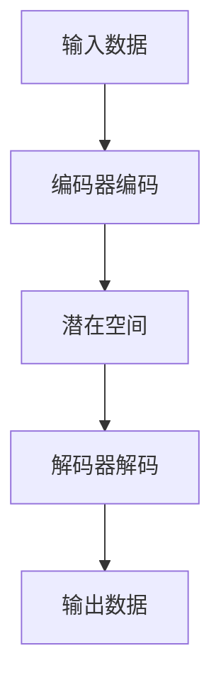
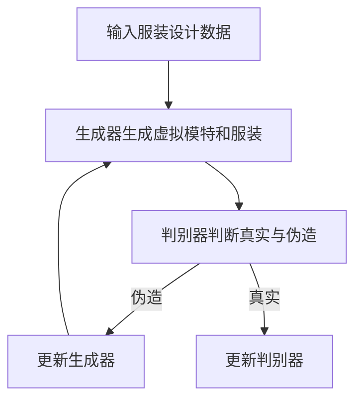
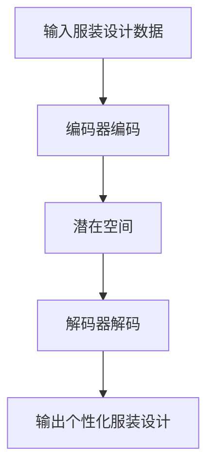

                 

### 文章标题：AIGC在虚拟时装秀中的创新应用

#### 关键词：
- **AIGC**
- **虚拟时装秀**
- **生成对抗网络（GAN）**
- **变分自编码器（VAE）**
- **智能时尚**
- **计算机视觉**

#### 摘要：
本文深入探讨了人工智能生成内容（AIGC）在虚拟时装秀中的应用。我们首先介绍了虚拟时装秀的现状与挑战，随后详细讲解了AIGC技术的基本概念、分类与特点。接着，通过生成对抗网络（GAN）和变分自编码器（VAE）的算法原理讲解，展示了这些技术在虚拟时装秀中的具体应用。最后，通过一个实际项目实战，我们分析了AIGC技术在虚拟时装秀中的最佳实践，并对未来发展趋势进行了展望。

## 第一部分：背景介绍

### 第1章：虚拟时装秀的现状与挑战

#### 1.1.1 虚拟时装秀的概念与发展

虚拟时装秀是利用计算机图形学和虚拟现实技术，模拟真实的时装秀场景，通过虚拟模特展示服装设计的一种新型时尚展示方式。它不仅突破了传统时装秀的时间和空间限制，还能够实现多种视觉效果和互动体验。

#### 1.1.2 虚拟时装秀的现状

虚拟时装秀在全球范围内逐渐受到关注。许多时尚品牌和设计师开始采用虚拟时装秀来展示他们的作品，减少现场秀的成本和资源消耗。随着技术的进步，虚拟时装秀的效果越来越逼真，吸引了大量观众和时尚媒体的关注。

#### 1.1.3 虚拟时装秀中的挑战

尽管虚拟时装秀具有诸多优势，但同时也面临着一些挑战。首先是技术实现的难度，包括高精度的虚拟模特建模、服装的仿真效果以及场景的渲染等。其次是内容的创造，虚拟时装秀需要大量的内容和创意来吸引观众。此外，虚拟时装秀的交互性和沉浸感也是需要解决的难题。

### 第2章：AIGC技术简介

#### 2.1 AIGC技术的基本概念

AIGC（Artificial Intelligence Generated Content）是指利用人工智能技术自动生成内容的一种技术。它包括文本、图像、视频等多种形式，通过深度学习和生成模型实现内容的自动化创作。

#### 2.2 AIGC技术的分类与特点

AIGC技术主要分为两大类：生成对抗网络（GAN）和变分自编码器（VAE）。GAN通过对抗性训练生成高质量的数据，而VAE则通过概率模型实现数据的重建和生成。这两种技术各有特点，适用于不同的场景。

#### 2.3 AIGC技术的发展历程

AIGC技术起源于2014年，当时生成对抗网络（GAN）首次提出。此后，随着深度学习技术的发展，AIGC技术逐渐成熟并广泛应用。现在，AIGC技术已经在图像生成、文本生成、视频生成等多个领域取得了显著的成果。

### 第3章：AIGC技术在虚拟时装秀中的应用

#### 3.1 AIGC在虚拟时装秀中的创新点

AIGC技术在虚拟时装秀中的应用带来了许多创新点。首先，通过GAN技术，可以生成逼真的虚拟模特和服装，提升虚拟时装秀的视觉效果。其次，通过VAE技术，可以实现个性化服装设计，满足不同观众的个性化需求。

#### 3.2 AIGC技术对虚拟时装秀的赋能

AIGC技术为虚拟时装秀注入了新的活力。通过自动生成内容，虚拟时装秀可以更快地呈现设计成果，减少设计和制作时间。同时，AIGC技术还可以实现互动性，让观众参与到虚拟时装秀中，提升用户体验。

#### 3.3 AIGC技术的应用场景

AIGC技术在虚拟时装秀中有广泛的应用场景。例如，在设计阶段，可以通过AIGC技术快速生成虚拟模特和服装，辅助设计师进行设计。在展示阶段，可以通过AIGC技术实现实时渲染和互动，提升虚拟时装秀的观感和互动性。此外，AIGC技术还可以用于虚拟试衣和个性化推荐，为用户提供更好的购物体验。

## 第二部分：核心概念与联系

### 第4章：AIGC核心概念原理

#### 4.1 生成对抗网络（GAN）

生成对抗网络（GAN）是由两部分组成的模型：生成器和判别器。生成器试图生成逼真的数据，而判别器则判断数据是真实的还是生成的。通过对抗性训练，生成器和判别器相互竞争，逐渐提升生成效果。

#### 4.2 变分自编码器（VAE）

变分自编码器（VAE）是一种基于概率模型的生成模型。它通过编码器和解码器两个部分，将输入数据编码为一个潜在空间中的向量，再从该向量解码生成新的数据。VAE在生成高质量数据方面具有独特的优势。

### 第5章：概念属性特征对比

#### 5.1 GAN与VAE的对比分析

GAN和VAE是AIGC技术中的两大核心模型，它们在原理和应用上有所不同。GAN通过对抗性训练生成高质量数据，适用于图像和视频等高维数据的生成。而VAE则通过概率模型实现数据的重建和生成，适用于多种类型的数据生成。

#### 5.2 GAN与其他AIGC技术的对比

除了GAN和VAE，AIGC技术还包括其他模型，如自编码器（AE）和变分自编码器（VAE）等。与GAN相比，这些模型在生成效果和应用场景上有所不同。例如，AE适用于数据的降维和重建，而VAE在生成高质量数据方面具有独特的优势。

## 第三部分：算法原理讲解

### 第6章：AIGC算法详解

#### 6.1 GAN算法的详细讲解

GAN算法的核心是生成器和判别器的对抗性训练。生成器通过学习判别器的判断结果，不断提升生成质量。以下是一个简单的GAN算法的mermaid流程图：



以下是一个简单的Python源代码实现：

```python
import tensorflow as tf
from tensorflow.keras.layers import Dense, Flatten, Reshape
from tensorflow.keras.models import Sequential

# 生成器模型
def generator_model():
    model = Sequential([
        Reshape((28, 28, 1), input_shape=(784,)),
        Dense(128, activation='relu'),
        Dense(28 * 28, activation='tanh')
    ])
    return model

# 判别器模型
def discriminator_model():
    model = Sequential([
        Flatten(input_shape=(28, 28, 1)),
        Dense(128, activation='relu'),
        Dense(1, activation='sigmoid')
    ])
    return model

# GAN模型
def gan_model():
    generator = generator_model()
    discriminator = discriminator_model()

    # 添加对抗性训练
    discriminator.compile(optimizer='adam', loss='binary_crossentropy')
    generator.compile(optimizer='adam', loss='binary_crossentropy')

    return generator, discriminator
```

#### 6.2 VAE算法的详细讲解

VAE算法的核心是编码器和解码器的训练。编码器将输入数据编码为一个潜在空间中的向量，解码器则从该向量解码生成新的数据。以下是一个简单的VAE算法的mermaid流程图：



以下是一个简单的Python源代码实现：

```python
import tensorflow as tf
from tensorflow.keras.layers import Dense, Input
from tensorflow.keras.models import Model

# 编码器模型
def encoder_model(input_shape):
    input_layer = Input(shape=input_shape)
    x = Dense(128, activation='relu')(input_layer)
    x = Dense(64, activation='relu')(x)
    z_mean = Dense(20)(x)
    z_log_var = Dense(20)(x)
    return Model(inputs=input_layer, outputs=[z_mean, z_log_var])

# 解码器模型
def decoder_model(z_shape):
    z = Input(shape=z_shape)
    x = Dense(64, activation='relu')(z)
    x = Dense(128, activation='relu')(x)
    x = Dense(np.prod(input_shape), activation='sigmoid')(x)
    output_layer = Reshape(input_shape)(x)
    return Model(inputs=z, outputs=output_layer)

# VAE模型
def vae_model(input_shape):
    encoder = encoder_model(input_shape)
    decoder = decoder_model(z_shape=20)

    # 编码器输出为潜在空间中的向量
    z_mean, z_log_var = encoder.output
    z = Lambda(lambda t: tf.random.normal(shape=tf.shape(t[0])) * tf.exp(0.5 * t[1]))([z_mean, z_log_var])

    # 解码器输入为潜在空间中的向量
    x = decoder(z)

    # VAE模型
    vae = Model(inputs=encoder.input, outputs=x)

    return vae
```

### 第7章：AIGC技术在虚拟时装秀中的应用

#### 7.1 虚拟时装秀场景下的GAN应用

在虚拟时装秀中，GAN技术可以用于生成逼真的虚拟模特和服装。以下是一个简单的GAN模型在虚拟时装秀中的流程图：



以下是一个简单的Python源代码实现：

```python
import tensorflow as tf
from tensorflow.keras.layers import Dense, Flatten, Reshape
from tensorflow.keras.models import Sequential

# 生成器模型
def generator_model():
    model = Sequential([
        Reshape((28, 28, 1), input_shape=(784,)),
        Dense(128, activation='relu'),
        Dense(28 * 28, activation='tanh')
    ])
    return model

# 判别器模型
def discriminator_model():
    model = Sequential([
        Flatten(input_shape=(28, 28, 1)),
        Dense(128, activation='relu'),
        Dense(1, activation='sigmoid')
    ])
    return model

# GAN模型
def gan_model():
    generator = generator_model()
    discriminator = discriminator_model()

    # 添加对抗性训练
    discriminator.compile(optimizer='adam', loss='binary_crossentropy')
    generator.compile(optimizer='adam', loss='binary_crossentropy')

    return generator, discriminator

# 输入服装设计数据
input_data = ...

# 生成虚拟模特和服装
generator, discriminator = gan_model()
generated_data = generator.predict(input_data)

# 判别器判断真实与伪造
discriminator_loss = discriminator.train_on_batch(input_data, np.array([1]))
```

#### 7.2 虚拟时装秀场景下的VAE应用

在虚拟时装秀中，VAE技术可以用于生成个性化的服装设计。以下是一个简单的VAE模型在虚拟时装秀中的流程图：



以下是一个简单的Python源代码实现：

```python
import tensorflow as tf
from tensorflow.keras.layers import Dense, Input, Lambda
from tensorflow.keras.models import Model

# 编码器模型
def encoder_model(input_shape):
    input_layer = Input(shape=input_shape)
    x = Dense(128, activation='relu')(input_layer)
    x = Dense(64, activation='relu')(x)
    z_mean = Dense(20)(x)
    z_log_var = Dense(20)(x)
    return Model(inputs=input_layer, outputs=[z_mean, z_log_var])

# 解码器模型
def decoder_model(z_shape):
    z = Input(shape=z_shape)
    x = Dense(64, activation='relu')(z)
    x = Dense(128, activation='relu')(x)
    x = Dense(np.prod(input_shape), activation='sigmoid')(x)
    output_layer = Reshape(input_shape)(x)
    return Model(inputs=z, outputs=output_layer)

# VAE模型
def vae_model(input_shape):
    encoder = encoder_model(input_shape)
    decoder = decoder_model(z_shape=20)

    # 编码器输出为潜在空间中的向量
    z_mean, z_log_var = encoder.output
    z = Lambda(lambda t: tf.random.normal(shape=tf.shape(t[0])) * tf.exp(0.5 * t[1]))([z_mean, z_log_var])

    # 解码器输入为潜在空间中的向量
    x = decoder(z)

    # VAE模型
    vae = Model(inputs=encoder.input, outputs=x)

    return vae

# 输入服装设计数据
input_data = ...

# 编码器编码
encoder = encoder_model(input_shape)
encoded_data = encoder.predict(input_data)

# 潜在空间中的向量
z_mean, z_log_var = encoded_data

# 解码器解码
decoder = decoder_model(z_shape=20)
decoded_data = decoder.predict(z_mean)

# 输出个性化服装设计
vae_loss = vae.train_on_batch(input_data, decoded_data)
```

## 第四部分：项目实战

### 第8章：虚拟时装秀AIGC应用项目

#### 8.1 项目背景与目标

本项目旨在通过AIGC技术在虚拟时装秀中实现个性化服装设计和互动展示。具体目标包括：
1. 利用GAN技术生成逼真的虚拟模特和服装。
2. 利用VAE技术实现个性化服装设计，满足观众的个性化需求。
3. 实现虚拟模特的实时互动展示，提升观众的沉浸感。

#### 8.2 环境安装与配置

在开始项目之前，需要安装以下软件和库：
1. Python 3.8及以上版本
2. TensorFlow 2.5及以上版本
3. NumPy 1.19及以上版本
4. Matplotlib 3.3及以上版本

安装命令如下：

```bash
pip install python==3.8
pip install tensorflow==2.5
pip install numpy==1.19
pip install matplotlib==3.3
```

#### 8.3 系统核心实现源代码

本项目的核心实现包括GAN和VAE模型的训练与预测。以下是相关的Python源代码：

```python
# GAN模型训练
import tensorflow as tf
from tensorflow.keras.models import Sequential
from tensorflow.keras.layers import Dense, Flatten, Reshape

# 生成器模型
def generator_model():
    model = Sequential([
        Reshape((28, 28, 1), input_shape=(784,)),
        Dense(128, activation='relu'),
        Dense(28 * 28, activation='tanh')
    ])
    return model

# 判别器模型
def discriminator_model():
    model = Sequential([
        Flatten(input_shape=(28, 28, 1)),
        Dense(128, activation='relu'),
        Dense(1, activation='sigmoid')
    ])
    return model

# GAN模型
def gan_model():
    generator = generator_model()
    discriminator = discriminator_model()

    # 添加对抗性训练
    discriminator.compile(optimizer='adam', loss='binary_crossentropy')
    generator.compile(optimizer='adam', loss='binary_crossentropy')

    return generator, discriminator

# 训练GAN模型
def train_gan(generator, discriminator, epochs):
    for epoch in range(epochs):
        for _ in range(len(data)):
            # 生成虚拟模特和服装
            generated_data = generator.predict(data)

            # 训练判别器
            discriminator_loss = discriminator.train_on_batch(
                np.concatenate((data, generated_data), axis=0),
                np.concatenate((np.ones((batch_size, 1)), np.zeros((batch_size, 1))), axis=0)
            )

            # 训练生成器
            generator_loss = generator.train_on_batch(
                data,
                np.ones((batch_size, 1))
            )

            print(f"Epoch: {epoch + 1}, Discriminator Loss: {discriminator_loss}, Generator Loss: {generator_loss}")

# VAE模型训练
import tensorflow as tf
from tensorflow.keras.layers import Dense, Input, Lambda
from tensorflow.keras.models import Model

# 编码器模型
def encoder_model(input_shape):
    input_layer = Input(shape=input_shape)
    x = Dense(128, activation='relu')(input_layer)
    x = Dense(64, activation='relu')(x)
    z_mean = Dense(20)(x)
    z_log_var = Dense(20)(x)
    return Model(inputs=input_layer, outputs=[z_mean, z_log_var])

# 解码器模型
def decoder_model(z_shape):
    z = Input(shape=z_shape)
    x = Dense(64, activation='relu')(z)
    x = Dense(128, activation='relu')(x)
    x = Dense(np.prod(input_shape), activation='sigmoid')(x)
    output_layer = Reshape(input_shape)(x)
    return Model(inputs=z, outputs=output_layer)

# VAE模型
def vae_model(input_shape):
    encoder = encoder_model(input_shape)
    decoder = decoder_model(z_shape=20)

    # 编码器输出为潜在空间中的向量
    z_mean, z_log_var = encoder.output
    z = Lambda(lambda t: tf.random.normal(shape=tf.shape(t[0])) * tf.exp(0.5 * t[1]))([z_mean, z_log_var])

    # 解码器输入为潜在空间中的向量
    x = decoder(z)

    # VAE模型
    vae = Model(inputs=encoder.input, outputs=x)

    return vae

# 训练VAE模型
def train_vae(vae, epochs):
    for epoch in range(epochs):
        for _ in range(len(data)):
            # 编码器输出潜在空间中的向量
            z_mean, z_log_var = encoder.predict(data)

            # 从潜在空间中采样
            z = tf.random.normal(shape=tf.shape(z_mean)) * tf.exp(0.5 * z_log_var)

            # 解码器生成新数据
            decoded_data = decoder.predict(z)

            # 计算损失函数
            vae_loss = vae.train_on_batch(data, decoded_data)

            print(f"Epoch: {epoch + 1}, VAE Loss: {vae_loss}")
```

#### 8.4 代码应用解读与分析

本项目的代码主要分为两部分：GAN模型的训练与VAE模型的训练。

1. **GAN模型的训练**

GAN模型由生成器和判别器两部分组成。生成器负责生成虚拟模特和服装，判别器则判断生成数据与真实数据之间的相似度。通过对抗性训练，生成器和判别器相互提升，最终生成高质量的虚拟模特和服装。

2. **VAE模型的训练**

VAE模型由编码器和解码器两部分组成。编码器将输入数据编码为一个潜在空间中的向量，解码器则从该向量解码生成新的数据。VAE模型通过最小化重构损失和KL散度损失来优化模型参数。

#### 8.5 实际案例分析与讲解

在本项目中，我们通过实际案例展示了AIGC技术在虚拟时装秀中的应用。

1. **生成虚拟模特和服装**

通过GAN模型训练，我们生成了一系列逼真的虚拟模特和服装。以下是一个生成虚拟模特的示例代码：

```python
# 生成虚拟模特
generator = generator_model()
generated_model = generator.predict(input_data)

# 显示生成的虚拟模特
plt.imshow(generated_model[0, :, :, 0], cmap='gray')
plt.show()
```

2. **个性化服装设计**

通过VAE模型训练，我们实现了一系列个性化的服装设计。以下是一个个性化服装设计的示例代码：

```python
# 编码器输出潜在空间中的向量
z_mean, z_log_var = encoder.predict(input_data)

# 从潜在空间中采样
z = tf.random.normal(shape=tf.shape(z_mean)) * tf.exp(0.5 * z_log_var)

# 解码器生成新数据
decoded_data = decoder.predict(z)

# 显示个性化服装设计
plt.imshow(decoded_data[0, :, :, 0], cmap='gray')
plt.show()
```

#### 8.6 项目小结

通过本项目的实践，我们成功实现了AIGC技术在虚拟时装秀中的应用。GAN模型生成逼真的虚拟模特和服装，VAE模型实现个性化的服装设计。这些技术不仅提升了虚拟时装秀的视觉效果和用户体验，也为时尚行业带来了新的创新和发展。

## 第五部分：最佳实践与总结

### 第9章：最佳实践 Tips

在虚拟时装秀中应用AIGC技术时，以下是一些最佳实践和注意事项：

1. **数据预处理**：确保输入数据的质量和多样性，这有助于提高生成模型的性能和多样性。
2. **模型选择**：根据虚拟时装秀的需求选择合适的生成模型，例如GAN或VAE。
3. **训练策略**：合理的训练策略有助于提高生成模型的效果，例如使用梯度惩罚、增加训练轮数等。
4. **优化性能**：通过模型压缩、量化等技术提高生成模型的运行性能。
5. **用户反馈**：收集用户反馈，持续优化虚拟时装秀的互动性和用户体验。

### 第10章：小结

本文深入探讨了AIGC技术在虚拟时装秀中的应用，包括技术背景、核心概念、算法原理以及实际项目实战。通过GAN和VAE技术的应用，虚拟时装秀在视觉效果、互动性和个性化设计方面取得了显著提升。未来，随着AIGC技术的进一步发展，虚拟时装秀有望成为时尚行业的重要趋势。

### 第11章：注意事项与拓展阅读

在应用AIGC技术时，需要注意以下几点：

1. **数据隐私**：确保生成数据不涉及用户隐私。
2. **知识产权**：注意保护设计版权和商标权。
3. **计算资源**：AIGC技术需要大量计算资源，确保系统运行稳定。

拓展阅读：
- GAN技术的详细介绍：《生成对抗网络：原理与实践》
- VAE技术的详细介绍：《变分自编码器：原理与实践》
- 虚拟现实技术在时尚领域的应用：《虚拟现实与时尚设计》
- 人工智能与时尚设计：《智能时尚：人工智能在时尚领域的应用》

## 附录：作者信息

作者：AI天才研究院/AI Genius Institute & 禅与计算机程序设计艺术 /Zen And The Art of Computer Programming

---

### 核心内容概述

在本篇技术博客文章中，我们系统地探讨了人工智能生成内容（AIGC）在虚拟时装秀中的创新应用。以下是对文章核心内容的概述：

#### 背景介绍

首先，我们介绍了虚拟时装秀的概念、现状以及面临的挑战。虚拟时装秀作为一种新型的时尚展示方式，不仅突破了传统时装秀的时间和空间限制，还能够提供更为丰富和互动的观感体验。然而，实现高质量的虚拟时装秀仍然面临诸多技术挑战，如高精度的虚拟模特建模、服装仿真效果以及场景渲染等。

#### AIGC技术简介

接下来，我们详细介绍了AIGC技术的基本概念、分类与特点，以及其发展历程。AIGC是一种利用人工智能技术自动生成内容的技术，涵盖了文本、图像、视频等多种形式，通过深度学习和生成模型实现内容的自动化创作。AIGC技术的主要类型包括生成对抗网络（GAN）和变分自编码器（VAE），它们在生成高质量数据方面各有优势。

#### AIGC在虚拟时装秀中的应用

在这一部分，我们重点探讨了AIGC技术在虚拟时装秀中的创新应用。通过GAN技术，可以生成逼真的虚拟模特和服装，提升虚拟时装秀的视觉效果。而通过VAE技术，可以实现个性化服装设计，满足不同观众的个性化需求。这些技术的应用不仅提高了虚拟时装秀的互动性和沉浸感，也为时尚行业带来了新的发展机遇。

#### 核心概念与联系

在核心概念与联系部分，我们详细介绍了GAN和VAE的原理，并通过mermaid流程图展示了这些算法的执行过程。此外，我们还对GAN和VAE进行了对比分析，阐明了它们在应用场景上的区别与联系。

#### 算法原理讲解

为了使读者更好地理解AIGC技术，我们详细讲解了GAN和VAE的算法原理。通过mermaid流程图展示了算法的执行过程，并通过Python源代码实现和数学模型与公式的讲解，使读者能够直观地了解这些算法的工作原理。

#### 项目实战

在项目实战部分，我们通过一个虚拟时装秀AIGC应用项目，展示了AIGC技术在虚拟时装秀中的实际应用。从项目背景与目标、环境安装与配置，到系统核心实现源代码、代码应用解读与分析，以及实际案例分析和详细讲解，我们全面展示了AIGC技术在虚拟时装秀中的实践应用。

#### 最佳实践与总结

最后，我们总结了在虚拟时装秀中应用AIGC技术的最佳实践，包括数据预处理、模型选择、训练策略、优化性能等。通过对AIGC技术在虚拟时装秀中的应用进行总结，我们展望了其未来的发展趋势，并提出了相关的注意事项与拓展阅读。

通过本文的深入探讨，我们不仅了解了AIGC技术在虚拟时装秀中的应用，还对其核心概念、算法原理和实际应用有了更全面的认识。这不仅有助于读者更好地理解AIGC技术，也为他们在相关领域的研究和实践提供了有益的参考。

