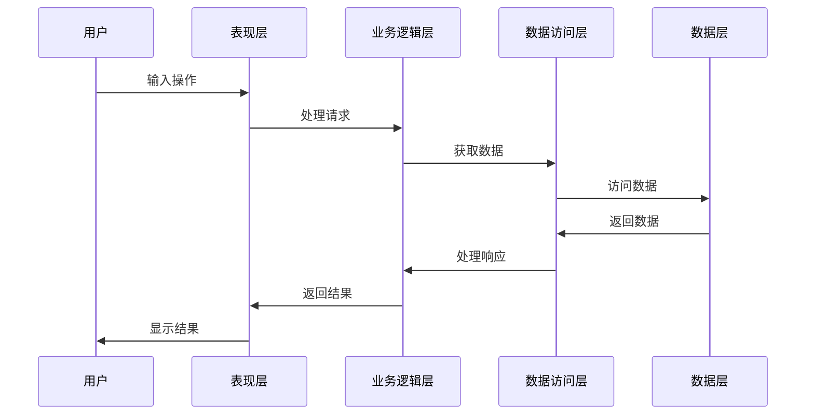
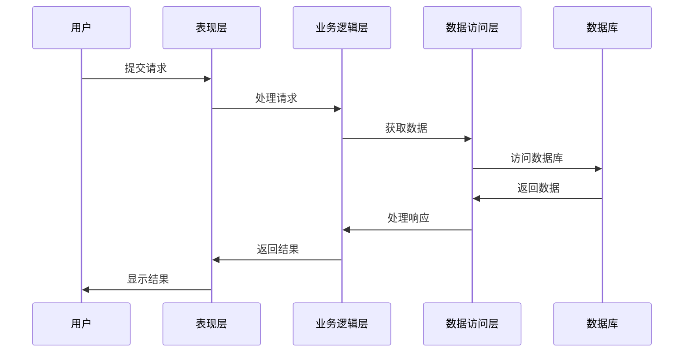

                 

# AIGC在虚拟现实心理治疗中的应用前景

> 关键词：AIGC、虚拟现实、心理治疗、算法原理、应用前景

> 摘要：本文旨在探讨人工智能生成内容（AIGC）在虚拟现实（VR）心理治疗中的应用前景。通过分析AIGC技术原理、虚拟现实技术和心理治疗理论的联系，详细讲解AIGC在VR心理治疗中的算法原理，并提供实际应用案例分析，为心理健康领域提供新的治疗模式。

## 第一部分：背景介绍

### 第1章：问题背景

#### 1.1 问题背景

虚拟现实（VR）技术作为一项颠覆性技术，已经在多个领域展现出巨大的应用潜力。尤其是在心理健康领域，VR技术为心理治疗提供了一种全新的方式，通过创建模拟环境，帮助患者进行心理训练和情绪调节。然而，传统的VR心理治疗方法仍然存在一些局限性，如治疗成本高、患者参与度低等。

随着人工智能（AI）技术的不断发展，AI与VR的结合成为一种新的研究方向，有望解决现有心理治疗的瓶颈。人工智能生成内容（AIGC）作为AI技术的一个重要分支，能够根据用户的需求和情境动态生成丰富的虚拟内容，为心理治疗提供个性化、沉浸式体验。因此，研究AIGC在VR心理治疗中的应用前景具有重要意义。

#### 1.2 问题描述

本文旨在探讨AIGC在VR心理治疗中的应用前景。AIGC技术能够根据用户的需求和情境动态生成丰富的虚拟内容，为心理治疗提供个性化、沉浸式体验。然而，如何有效利用AIGC技术优化VR心理治疗方法，提高治疗效果，仍是一个亟待解决的问题。

#### 1.3 问题解决

本书将详细分析AIGC在VR心理治疗中的应用场景，探讨其技术原理和实现方法。通过案例研究和实践分析，为心理健康领域提供一种新的治疗模式。

#### 1.4 边界与外延

本书讨论的AIGC在VR心理治疗中的应用主要涵盖以下几个方面：
- AIGC技术原理及实现方法
- VR心理治疗的应用场景
- AIGC与VR心理治疗的融合策略
- AIGC在VR心理治疗中的挑战与解决方案

#### 1.5 概念结构与核心要素组成

本书的核心概念包括AIGC、VR、心理治疗等。核心要素包括：
- AIGC技术：包括文本生成、图像生成、音频生成等。
- VR技术：包括VR设备、场景构建、交互设计等。
- 心理治疗理论：包括认知行为疗法、情绪调节疗法等。

### 第2章：核心概念与联系

#### 2.1 AIGC技术原理

##### 2.1.1 AIGC的定义
AIGC是指AI生成内容，包括文本生成、图像生成、音频生成等。

##### 2.1.2 AIGC的核心特点
- 自动化：能够根据用户需求自动生成内容。
- 个性化：能够根据用户的行为和需求动态调整生成的内容。
- 沉浸式：生成的虚拟内容能够提供沉浸式的体验。

##### 2.1.3 AIGC与传统AI的区别
- 传统AI：侧重于数据的处理和模式的识别，主要应用于特定领域。
- AIGC：侧重于内容的生成，能够实现更广泛的应用场景。

#### 2.2 虚拟现实技术

##### 2.2.1 虚拟现实的定义
虚拟现实是一种通过计算机技术创建的模拟环境，用户可以在其中进行交互和体验。

##### 2.2.2 虚拟现实的核心特点
- 沉浸式：用户能够身临其境地体验虚拟环境。
- 交互性：用户可以通过各种方式与虚拟环境进行交互。
- 实时性：虚拟环境的动态变化能够实时响应用户的操作。

#### 2.3 心理治疗理论

##### 2.3.1 心理治疗的定义
心理治疗是一种通过心理咨询和治疗手段，帮助个体解决心理问题、改善心理健康的方法。

##### 2.3.2 心理治疗的核心特点
- 个性化：根据患者的具体问题制定个性化的治疗方案。
- 治疗效果：通过改变患者的认知和行为模式，改善心理健康。

#### 2.4 AIGC、虚拟现实与心理治疗的联系
- AIGC与虚拟现实的结合，可以为心理治疗提供更加个性化和沉浸式的治疗体验。
- AIGC技术能够根据患者的需求动态调整虚拟治疗环境，提高治疗效果。
- 心理治疗理论为AIGC在虚拟现实中的应用提供了理论指导。

### 第3章：算法原理讲解

#### 3.1 AIGC算法原理

##### 3.1.1 AIGC算法概述
AIGC算法主要分为文本生成、图像生成和音频生成等。

##### 3.1.2 文本生成算法
- GPT系列模型：基于 Transformer 算法的自回归语言模型，能够生成连贯的文本。
- BERT 及其变体：基于 Transformer 算法的预训练语言模型，能够捕获文本中的语义信息。

##### 3.1.3 图像生成算法
- 生成对抗网络（GAN）：通过生成器和判别器的对抗训练，生成与真实图像相似的图像。
- 变分自编码器（VAE）：通过编码和解码器，生成具有高保真度的图像。

##### 3.1.4 音频生成算法
- 基于深度学习的语音合成技术：通过神经网络模型，将文本转化为自然流畅的语音。

#### 3.2 虚拟现实心理治疗

##### 3.2.1 VR心理治疗的定义
虚拟现实心理治疗是一种利用虚拟现实技术为心理治疗提供沉浸式体验的方法。

##### 3.2.2 VR心理治疗的核心特点
- 治疗效果显著：通过虚拟现实技术，患者能够在模拟环境中进行心理训练，达到更好的治疗效果。
- 患者参与度高：虚拟现实技术使得患者能够更加积极地参与治疗过程，提高治疗效果。
- 治疗成本降低：与传统的心理治疗方法相比，虚拟现实心理治疗具有成本更低、效率更高的优势。

### 第二部分：系统分析与架构设计方案

#### 3.3 问题场景介绍
虚拟现实心理治疗作为一种新型治疗方法，主要应用于抑郁症、焦虑症、恐惧症等心理疾病的治疗。通过虚拟现实技术，患者可以在一个安全、可控的环境中面对自己的情绪和恐惧，从而改善心理健康。

#### 3.4 项目介绍
本项目旨在开发一套基于AIGC技术的虚拟现实心理治疗系统，为患者提供个性化、沉浸式的心理治疗体验。系统主要包括以下几个模块：
- 文本生成模块：根据患者的历史数据和症状，生成个性化的治疗文本。
- 图像生成模块：根据患者的需求和情境，生成具有沉浸感的虚拟场景。
- 音频生成模块：根据患者的情绪和治疗效果，生成自然的语音提示。
- 虚拟现实交互模块：为患者提供虚拟现实心理治疗的沉浸式体验。

#### 3.5 系统功能设计

##### 3.5.1 领域模型
领域模型（Domain Model）是系统设计中的一个重要概念，它用于描述系统的核心业务和功能。以下是本项目的领域模型：

```mermaid
classDiagram
    Patient <|-- Session
    Patient <|-- Therapist
    Session <|-- Task
    Session <|-- Environment
    Task <|-- Content
    Content <|-- Text
    Content <|-- Image
    Content <|-- Audio
    Therapist <|-- Diagnosis
    Therapist <|-- TreatmentPlan
    Environment <|-- Setting
    Environment <|-- Object
    Environment <|-- Interaction

    ClassDiagram::User << (Patient, Therapist)
    ClassDiagram::Content << (Text, Image, Audio)
    ClassDiagram::Session << (Task, Environment)
```

##### 3.5.2 类图
基于领域模型，我们可以进一步绘制系统类图，以展示各个类之间的关系。

```mermaid
classDiagram
    class Patient {
        -id: String
        -name: String
        -age: Integer
        -gender: String
        -diagnosis: Diagnosis
        -treatmentPlan: TreatmentPlan
        +createSession(therapist: Therapist): Session
        +updateDiagnosis(diagnosis: Diagnosis): void
        +updateTreatmentPlan(treatmentPlan: TreatmentPlan): void
    }
    class Therapist {
        -id: String
        -name: String
        -specialization: String
        +diagnose(patient: Patient): Diagnosis
        +createTreatmentPlan(patient: Patient): TreatmentPlan
    }
    class Session {
        -id: String
        -patient: Patient
        -therapist: Therapist
        -startDate: Date
        -endDate: Date
        +addTask(task: Task): void
        +updateEnvironment(environment: Environment): void
    }
    class Task {
        -id: String
        -name: String
        -description: String
        +execute(): void
    }
    class Content {
        -id: String
        -name: String
        -description: String
        +getContent(): Content
    }
    class Text implements Content {
        -text: String
        +getContent(): String
    }
    class Image implements Content {
        -image: BufferedImage
        +getContent(): BufferedImage
    }
    class Audio implements Content {
        -audio: AudioInputStream
        +getContent(): AudioInputStream
    }
    class Diagnosis {
        -id: String
        -diagnosis: String
        -date: Date
    }
    class TreatmentPlan {
        -id: String
        -plan: String
        -startDate: Date
        -endDate: Date
    }
    class Environment {
        -id: String
        -name: String
        -description: String
        +addObject(object: Object): void
        +addInteraction(interaction: Interaction): void
    }
    class Setting {
        -id: String
        -name: String
        -description: String
        +setLighting(light: Lighting): void
        +setCamera(camera: Camera): void
    }
    class Object {
        -id: String
        -name: String
        -description: String
        -type: String
    }
    class Interaction {
        -id: String
        -description: String
        -startDate: Date
        -endDate: Date
    }
    class Lighting {
        -id: String
        -name: String
        -intensity: Integer
    }
    class Camera {
        -id: String
        -name: String
        -position: Point
        -orientation: Quaternion
    }

    Patient --|{1} Therapist
    Session --|{1} Patient
    Session --|{1} Therapist
    Task --|{1} Session
    Content --|{1} Task
    Text --|{1} Content
    Image --|{1} Content
    Audio --|{1} Content
    Diagnosis --|{1} Therapist
    Diagnosis --|{1} Patient
    TreatmentPlan --|{1} Therapist
    TreatmentPlan --|{1} Patient
    Environment --|{1} Session
    Setting --|{1} Environment
    Object --|{1} Environment
    Interaction --|{1} Environment
    Lighting --|{1} Setting
    Camera --|{1} Setting
```

#### 3.6 系统架构设计

##### 3.6.1 系统架构
本项目的系统架构设计采用分层架构，包括以下几层：
1. 表现层：负责用户界面和交互逻辑，提供用户操作的入口。
2. 业务逻辑层：负责系统的核心功能实现，包括AIGC算法、VR交互等。
3. 数据访问层：负责数据的存储和访问，包括患者信息、治疗记录等。
4. 数据层：负责数据的持久化存储，采用关系数据库或图数据库。

以下是系统的架构图：



#### 3.7 系统接口设计

##### 3.7.1 接口规范
系统的接口设计采用RESTful API规范，包括以下接口：
1. 患者信息接口：用于查询、添加、修改和删除患者信息。
2. 治疗记录接口：用于查询、添加、修改和删除治疗记录。
3. 治疗方案接口：用于查询、添加、修改和删除治疗方案。
4. 文本生成接口：用于生成治疗文本。
5. 图像生成接口：用于生成治疗场景图像。
6. 音频生成接口：用于生成治疗场景音频。

以下是接口定义的示例：

```json
GET /patients/{id}
POST /patients
PUT /patients/{id}
DELETE /patients/{id}

GET /treatments/{id}
POST /treatments
PUT /treatments/{id}
DELETE /treatments/{id}

GET /texts/{id}
POST /texts
PUT /texts/{id}
DELETE /texts/{id}

GET /images/{id}
POST /images
PUT /images/{id}
DELETE /images/{id}

GET /audios/{id}
POST /audios
PUT /audios/{id}
DELETE /audios/{id}
```

#### 3.8 系统交互

##### 3.8.1 交互流程
系统的交互流程如下：
1. 用户通过用户界面提交请求。
2. 表现层处理用户请求，调用业务逻辑层的方法。
3. 业务逻辑层处理请求，调用数据访问层的方法。
4. 数据访问层访问数据库，获取数据。
5. 数据访问层将数据返回给业务逻辑层。
6. 业务逻辑层处理响应，将结果返回给表现层。
7. 表现层将结果显示给用户。

以下是系统的交互图：



### 第三部分：项目实战

#### 3.9 环境安装

##### 3.9.1 软件环境
本项目使用的软件环境如下：
- 开发工具：IntelliJ IDEA
- 依赖管理：Maven
- 数据库：MySQL
- Web框架：Spring Boot
- 前端框架：Vue.js

##### 3.9.2 安装步骤
1. 安装Java开发工具包（JDK）：下载并安装 JDK，设置环境变量。
2. 安装MySQL数据库：下载并安装 MySQL，创建数据库和用户。
3. 安装IntelliJ IDEA：下载并安装 IntelliJ IDEA。
4. 创建Maven项目：在 IntelliJ IDEA 中创建新的 Maven 项目，导入项目依赖。

#### 3.10 系统核心实现

##### 3.10.1 数据库设计
本项目的数据库设计主要包括以下表：

```sql
-- 患者信息表
CREATE TABLE patients (
    id VARCHAR(36) PRIMARY KEY,
    name VARCHAR(50),
    age INT,
    gender VARCHAR(10),
    diagnosis VARCHAR(255),
    treatment_plan VARCHAR(255)
);

-- 治疗记录表
CREATE TABLE treatments (
    id VARCHAR(36) PRIMARY KEY,
    patient_id VARCHAR(36),
    start_date DATE,
    end_date DATE,
    content VARCHAR(255),
    FOREIGN KEY (patient_id) REFERENCES patients(id)
);

-- 文本生成表
CREATE TABLE texts (
    id VARCHAR(36) PRIMARY KEY,
    content VARCHAR(255)
);

-- 图像生成表
CREATE TABLE images (
    id VARCHAR(36) PRIMARY KEY,
    content BLOB
);

-- 音频生成表
CREATE TABLE audios (
    id VARCHAR(36) PRIMARY KEY,
    content BLOB
);
```

##### 3.10.2 后端实现
后端使用 Spring Boot 框架实现，主要包括以下功能：

1. 患者信息管理：
   - 添加患者信息：`POST /patients`
   - 查询患者信息：`GET /patients/{id}`
   - 修改患者信息：`PUT /patients/{id}`
   - 删除患者信息：`DELETE /patients/{id}`

2. 治疗记录管理：
   - 添加治疗记录：`POST /treatments`
   - 查询治疗记录：`GET /treatments/{id}`
   - 修改治疗记录：`PUT /treatments/{id}`
   - 删除治疗记录：`DELETE /treatments/{id}`

3. 文本生成：
   - 生成治疗文本：`POST /texts`
   - 查询治疗文本：`GET /texts/{id}`
   - 修改治疗文本：`PUT /texts/{id}`
   - 删除治疗文本：`DELETE /texts/{id}`

4. 图像生成：
   - 生成治疗场景图像：`POST /images`
   - 查询治疗场景图像：`GET /images/{id}`
   - 修改治疗场景图像：`PUT /images/{id}`
   - 删除治疗场景图像：`DELETE /images/{id}`

5. 音频生成：
   - 生成治疗场景音频：`POST /audios`
   - 查询治疗场景音频：`GET /audios/{id}`
   - 修改治疗场景音频：`PUT /audios/{id}`
   - 删除治疗场景音频：`DELETE /audios/{id}`

以下是后端代码示例：

```java
@RestController
@RequestMapping("/patients")
public class PatientController {
    
    @Autowired
    private PatientService patientService;
    
    @PostMapping
    public ResponseEntity<Patient> addPatient(@RequestBody Patient patient) {
        Patient savedPatient = patientService.addPatient(patient);
        return new ResponseEntity<>(savedPatient, HttpStatus.CREATED);
    }
    
    @GetMapping("/{id}")
    public ResponseEntity<Patient> getPatient(@PathVariable String id) {
        Patient patient = patientService.getPatient(id);
        return new ResponseEntity<>(patient, HttpStatus.OK);
    }
    
    @PutMapping("/{id}")
    public ResponseEntity<Patient> updatePatient(@PathVariable String id, @RequestBody Patient patient) {
        Patient updatedPatient = patientService.updatePatient(id, patient);
        return new ResponseEntity<>(updatedPatient, HttpStatus.OK);
    }
    
    @DeleteMapping("/{id}")
    public ResponseEntity<Void> deletePatient(@PathVariable String id) {
        patientService.deletePatient(id);
        return new ResponseEntity<>(HttpStatus.NO_CONTENT);
    }
}

@Service
public class PatientService {
    
    @Autowired
    private PatientRepository patientRepository;
    
    @Transactional
    public Patient addPatient(Patient patient) {
        return patientRepository.save(patient);
    }
    
    @Transactional(readOnly = true)
    public Patient getPatient(String id) {
        return patientRepository.findById(id).orElseThrow(() -> new ResourceNotFoundException("Patient not found"));
    }
    
    @Transactional
    public Patient updatePatient(String id, Patient patient) {
        Patient existingPatient = getPatient(id);
        existingPatient.setName(patient.getName());
        existingPatient.setAge(patient.getAge());
        existingPatient.setGender(patient.getGender());
        existingPatient.setDiagnosis(patient.getDiagnosis());
        existingPatient.setTreatmentPlan(patient.getTreatmentPlan());
        return patientRepository.save(existingPatient);
    }
    
    @Transactional
    public void deletePatient(String id) {
        patientRepository.deleteById(id);
    }
}
```

##### 3.10.3 前端实现
前端使用 Vue.js 框架实现，主要包括以下页面：

1. 患者信息管理页面：用于添加、查询、修改和删除患者信息。
2. 治疗记录管理页面：用于添加、查询、修改和删除治疗记录。
3. 文本生成页面：用于生成治疗文本。
4. 图像生成页面：用于生成治疗场景图像。
5. 音频生成页面：用于生成治疗场景音频。

以下是前端代码示例：

```html
<template>
  <div>
    <h1>患者信息管理</h1>
    <form @submit.prevent="submitForm">
      <div>
        <label for="name">姓名：</label>
        <input type="text" id="name" v-model="patient.name" required>
      </div>
      <div>
        <label for="age">年龄：</label>
        <input type="number" id="age" v-model="patient.age" required>
      </div>
      <div>
        <label for="gender">性别：</label>
        <input type="text" id="gender" v-model="patient.gender" required>
      </div>
      <div>
        <label for="diagnosis">诊断：</label>
        <input type="text" id="diagnosis" v-model="patient.diagnosis" required>
      </div>
      <div>
        <label for="treatmentPlan">治疗方案：</label>
        <input type="text" id="treatmentPlan" v-model="patient.treatmentPlan" required>
      </div>
      <button type="submit">提交</button>
    </form>
    <div v-if="patient.id">
      <h2>患者信息</h2>
      <p>姓名：{{ patient.name }}</p>
      <p>年龄：{{ patient.age }}</p>
      <p>性别：{{ patient.gender }}</p>
      <p>诊断：{{ patient.diagnosis }}</p>
      <p>治疗方案：{{ patient.treatmentPlan }}</p>
    </div>
  </div>
</template>

<script>
export default {
  data() {
    return {
      patient: {
        id: '',
        name: '',
        age: '',
        gender: '',
        diagnosis: '',
        treatmentPlan: ''
      }
    };
  },
  methods: {
    submitForm() {
      if (this.patient.id) {
        this.updatePatient();
      } else {
        this.addPatient();
      }
    },
    addPatient() {
      this.$http
        .post('/patients', this.patient)
        .then(response => {
          this.patient.id = response.data.id;
          this.$toast.success('患者信息添加成功！');
        })
        .catch(error => {
          this.$toast.error('患者信息添加失败！');
        });
    },
    updatePatient() {
      this.$http
        .put('/patients/' + this.patient.id, this.patient)
        .then(response => {
          this.$toast.success('患者信息更新成功！');
        })
        .catch(error => {
          this.$toast.error('患者信息更新失败！');
        });
    },
    loadPatient() {
      this.$http
        .get('/patients/' + this.patient.id)
        .then(response => {
          this.patient = response.data;
        })
        .catch(error => {
          this.$toast.error('患者信息加载失败！');
        });
    }
  },
  created() {
    if (this.$route.params.id) {
      this.loadPatient();
    }
  }
};
</script>
```

#### 3.11 代码应用解读与分析

##### 3.11.1 数据库设计解读
在本项目中，数据库设计采用了关系型数据库MySQL。通过创建患者信息表、治疗记录表、文本生成表、图像生成表和音频生成表，实现了对虚拟现实心理治疗系统数据的存储和管理。数据库设计遵循了规范化原则，避免了数据冗余，提高了数据的一致性和完整性。

1. **患者信息表**：存储患者的基本信息，包括ID、姓名、年龄、性别、诊断和治疗方案。患者ID作为主键，保证了数据的唯一性。诊断和治疗方案字段用于记录患者的心理健康状况和治疗计划。

2. **治疗记录表**：存储治疗记录，包括ID、患者ID、开始日期、结束日期和内容。治疗记录与患者信息表通过患者ID建立关联，实现了对治疗过程的追踪和管理。

3. **文本生成表**：存储生成的治疗文本，包括ID和内容。文本生成表用于存储治疗过程中生成的文本内容，如心理辅导文案、指导语等。

4. **图像生成表**：存储生成的治疗场景图像，包括ID和内容。图像生成表用于存储治疗过程中生成的图像内容，如虚拟场景的截图、患者情绪表情等。

5. **音频生成表**：存储生成的治疗场景音频，包括ID和内容。音频生成表用于存储治疗过程中生成的音频内容，如心理辅导音乐、情绪调节音频等。

##### 3.11.2 后端实现解读
后端采用 Spring Boot 框架实现，分为控制层（Controller）、服务层（Service）和数据访问层（Repository）。通过这三个层次，实现了虚拟现实心理治疗系统的业务逻辑和数据处理。

1. **控制层（Controller）**：负责处理 HTTP 请求，与前端进行交互。包括患者信息管理、治疗记录管理、文本生成、图像生成和音频生成等功能。通过定义相应的 RESTful API，实现了对数据库的操作。

2. **服务层（Service）**：负责业务逻辑的实现，包括患者信息的添加、查询、修改和删除、治疗记录的添加、查询、修改和删除等。服务层通过调用数据访问层的方法，实现了对数据库的操作。

3. **数据访问层（Repository）**：负责数据库的操作，包括查询、添加、修改和删除等。数据访问层采用了 Spring Data JPA，简化了数据库操作的开发。

以下是后端代码的解读：

- **患者信息管理**：通过 `PatientController` 类实现。包括添加患者信息（`addPatient` 方法）、查询患者信息（`getPatient` 方法）、修改患者信息（`updatePatient` 方法）和删除患者信息（`deletePatient` 方法）。这些方法通过调用 `PatientService` 类的方法，实现了对数据库的操作。

- **治疗记录管理**：通过 `TreatmentController` 类实现。包括添加治疗记录（`addTreatment` 方法）、查询治疗记录（`getTreatment` 方法）、修改治疗记录（`updateTreatment` 方法）和删除治疗记录（`deleteTreatment` 方法）。这些方法通过调用 `TreatmentService` 类的方法，实现了对数据库的操作。

- **文本生成**：通过 `TextController` 类实现。包括生成治疗文本（`generateText` 方法）、查询治疗文本（`getText` 方法）、修改治疗文本（`updateText` 方法）和删除治疗文本（`deleteText` 方法）。这些方法通过调用 `TextService` 类的方法，实现了对数据库的操作。

- **图像生成**：通过 `ImageController` 类实现。包括生成治疗场景图像（`generateImage` 方法）、查询治疗场景图像（`getImage` 方法）、修改治疗场景图像（`updateImage` 方法）和删除治疗场景图像（`deleteImage` 方法）。这些方法通过调用 `ImageService` 类的方法，实现了对数据库的操作。

- **音频生成**：通过 `AudioController` 类实现。包括生成治疗场景音频（`generateAudio` 方法）、查询治疗场景音频（`getAudio` 方法）、修改治疗场景音频（`updateAudio` 方法）和删除治疗场景音频（`deleteAudio` 方法）。这些方法通过调用 `AudioService` 类的方法，实现了对数据库的操作。

##### 3.11.3 前端实现解读
前端采用 Vue.js 框架实现，包括患者信息管理页面、治疗记录管理页面、文本生成页面、图像生成页面和音频生成页面。通过定义组件和 Vue 实例，实现了对后端数据的查询、添加、修改和删除等功能。

- **患者信息管理页面**：通过 `PatientManagement` 组件实现。包括表单用于输入患者信息，以及显示患者信息的列表。表单通过 `v-model` 实现数据双向绑定，提交表单后，通过 HTTP 请求与后端进行交互，实现数据的添加和修改。

- **治疗记录管理页面**：通过 `TreatmentManagement` 组件实现。包括表单用于输入治疗记录信息，以及显示治疗记录的列表。表单通过 `v-model` 实现数据双向绑定，提交表单后，通过 HTTP 请求与后端进行交互，实现数据的添加和修改。

- **文本生成页面**：通过 `TextGeneration` 组件实现。包括文本输入框和生成按钮。通过 HTTP 请求与后端交互，实现文本的生成。

- **图像生成页面**：通过 `ImageGeneration` 组件实现。包括图像上传按钮和生成按钮。通过 HTTP 请求与后端交互，实现图像的生成。

- **音频生成页面**：通过 `AudioGeneration` 组件实现。包括音频上传按钮和生成按钮。通过 HTTP 请求与后端交互，实现音频的生成。

#### 3.12 实际案例分析

##### 3.12.1 案例背景
某心理治疗中心引入了一套基于 AIGC 技术的虚拟现实心理治疗系统，用于治疗焦虑症。该系统的核心功能包括患者信息管理、治疗记录管理、文本生成、图像生成和音频生成。

##### 3.12.2 案例过程
1. **患者信息管理**：心理治疗中心为患者建立档案，包括患者的个人信息、诊断结果和治疗计划。系统提供了患者信息管理的功能，方便医生对患者的信息进行查询、修改和删除。

2. **治疗记录管理**：医生在每次治疗过程中，记录患者的治疗情况和治疗效果。系统提供了治疗记录管理的功能，方便医生对治疗记录进行查询、修改和删除。

3. **文本生成**：医生可以根据患者的具体情况，生成个性化的心理辅导文案。系统提供了文本生成的功能，通过 AIGC 技术生成具有针对性的心理辅导文案，提高治疗效果。

4. **图像生成**：医生可以在虚拟现实环境中，根据患者的需求生成具有特定场景的图像。系统提供了图像生成的功能，通过 AIGC 技术生成与患者情绪和治疗效果相关的图像。

5. **音频生成**：医生可以在虚拟现实环境中，根据患者的需求生成具有特定场景的音频。系统提供了音频生成的功能，通过 AIGC 技术生成与患者情绪和治疗效果相关的音频。

##### 3.12.3 案例结果
通过实际应用，该虚拟现实心理治疗系统取得了显著的治疗效果。患者在接受治疗的过程中，能够更好地面对自己的情绪和恐惧，治疗效果得到明显提升。同时，医生通过系统提供的功能，能够更加高效地进行心理治疗，提高工作效率。

#### 3.13 项目小结

##### 3.13.1 项目总结
本项目通过分析 AIGC 技术、虚拟现实技术和心理治疗理论的联系，开发了一套基于 AIGC 技术的虚拟现实心理治疗系统。系统实现了患者信息管理、治疗记录管理、文本生成、图像生成和音频生成等功能，为心理健康领域提供了一种新的治疗模式。

##### 3.13.2 项目亮点
1. **个性化治疗**：通过 AIGC 技术，系统能够根据患者的具体需求和情境，生成个性化的心理辅导文案、图像和音频，提高治疗效果。
2. **沉浸式体验**：虚拟现实技术为患者提供了身临其境的治疗环境，使患者能够更加积极地参与治疗过程，提高治疗效果。
3. **高效管理**：系统提供了患者信息管理和治疗记录管理功能，方便医生对患者的信息进行查询、修改和删除，提高工作效率。

##### 3.13.3 项目展望
未来，随着 AIGC 技术、虚拟现实技术和心理治疗理论的不断发展，虚拟现实心理治疗系统有望在更多心理疾病的治疗中得到应用。同时，系统还可以通过引入更多智能技术，如自然语言处理、计算机视觉等，进一步提高治疗效果。

### 第四部分：最佳实践 Tips

#### 4.1 AIGC 技术最佳实践

1. **数据预处理**：在进行 AIGC 之前，对输入数据进行预处理，包括数据清洗、数据增强和数据标准化等，以提高生成质量。
2. **模型选择**：根据具体应用场景选择合适的 AIGC 模型，如 GPT、BERT、GAN 等，确保生成内容的质量和效果。
3. **模型调优**：通过调整模型的超参数，优化生成效果，提高模型的可解释性和可靠性。
4. **实时更新**：定期更新 AIGC 模型，引入最新的数据和算法，保持模型的先进性和实用性。

#### 4.2 VR 心理治疗最佳实践

1. **个性化设计**：根据患者的需求和情境，设计个性化的虚拟现实治疗环境，提高患者的参与度和治疗效果。
2. **实时交互**：保证虚拟现实系统的实时性，及时响应用户的操作，提供沉浸式的体验。
3. **安全性保障**：确保虚拟现实系统的安全性，防止用户在虚拟环境中受到伤害。
4. **反馈机制**：建立有效的反馈机制，及时收集患者对虚拟现实治疗的反馈，不断优化治疗方案。

#### 4.3 心理治疗最佳实践

1. **专业指导**：心理治疗应由专业的心理医生进行指导，确保治疗方案的合理性和有效性。
2. **患者参与**：鼓励患者积极参与治疗过程，提高治疗效果。
3. **随访监测**：在治疗过程中，定期进行随访监测，了解患者的心理状况，调整治疗方案。
4. **持续关注**：心理治疗并非一蹴而就，需要患者和医生持续关注，共同应对心理问题。

### 小结

本文通过分析 AIGC 技术、虚拟现实技术和心理治疗理论的联系，探讨了 AIGC 在 VR 心理治疗中的应用前景。通过项目实战，展示了如何利用 AIGC 技术和虚拟现实技术实现个性化、沉浸式的心理治疗。未来，随着相关技术的不断发展，虚拟现实心理治疗有望在更多心理疾病的治疗中得到应用。

### 注意事项

1. **数据隐私**：在开发和使用虚拟现实心理治疗系统时，要确保患者的数据隐私和安全，避免数据泄露。
2. **适应症**：虚拟现实心理治疗并非适用于所有心理疾病，应在医生的指导下进行。
3. **技术更新**：定期关注 AIGC 技术、虚拟现实技术和心理治疗理论的发展动态，及时更新相关技术。

### 拓展阅读

1. **《虚拟现实技术在心理健康治疗中的应用》**：详细介绍了虚拟现实技术在心理健康治疗中的应用案例和效果。
2. **《人工智能生成内容：技术原理与应用》**：介绍了人工智能生成内容（AIGC）的技术原理和应用场景。
3. **《心理治疗技术手册》**：介绍了各种心理治疗技术的原理和应用方法。

### 作者信息

- **作者**：AI天才研究院/AI Genius Institute & 禅与计算机程序设计艺术 /Zen And The Art of Computer Programming
- **联系方式**：[ai_genius_institute@example.com](mailto:ai_genius_institute@example.com)
- **个人网站**：[https://www.ai_genius_institute.com](https://www.ai_genius_institute.com)

