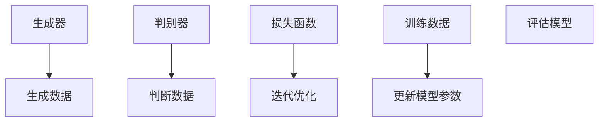
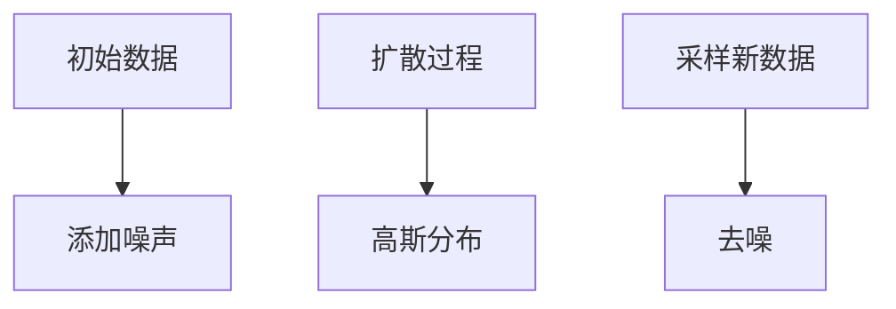
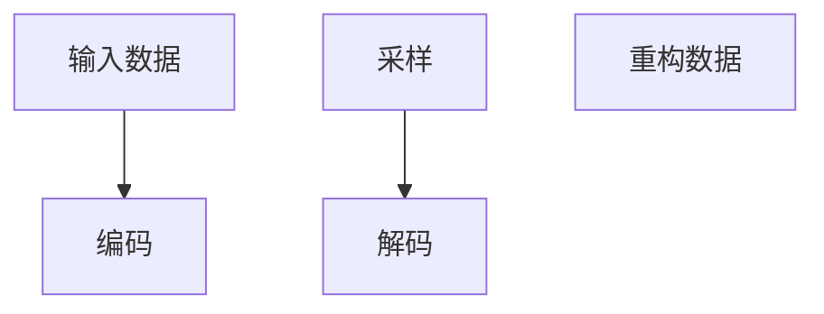
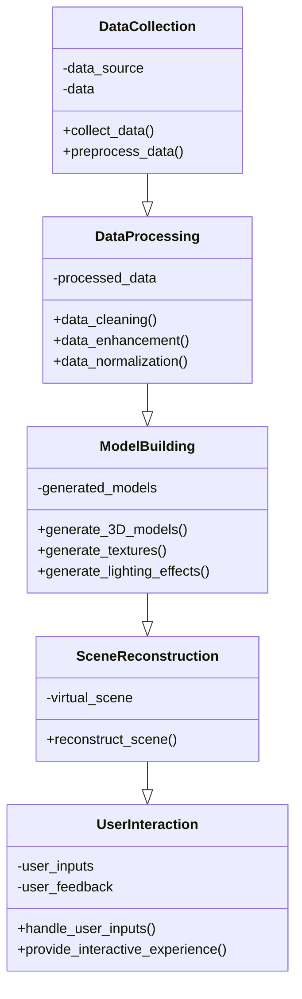
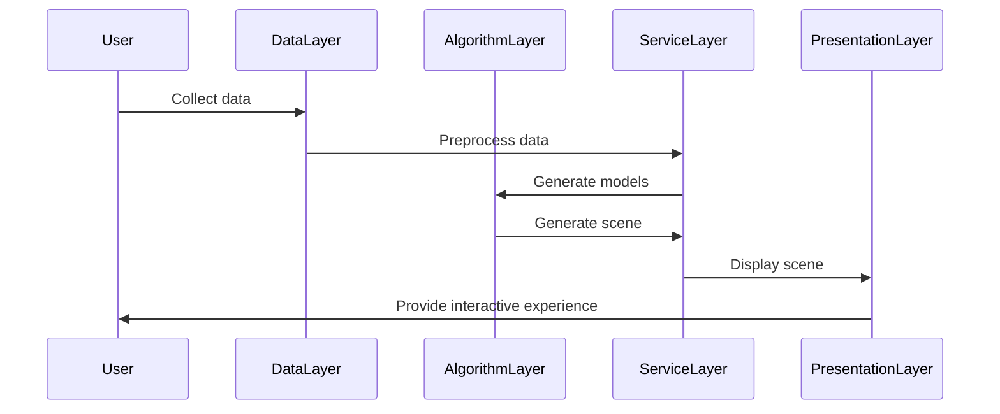
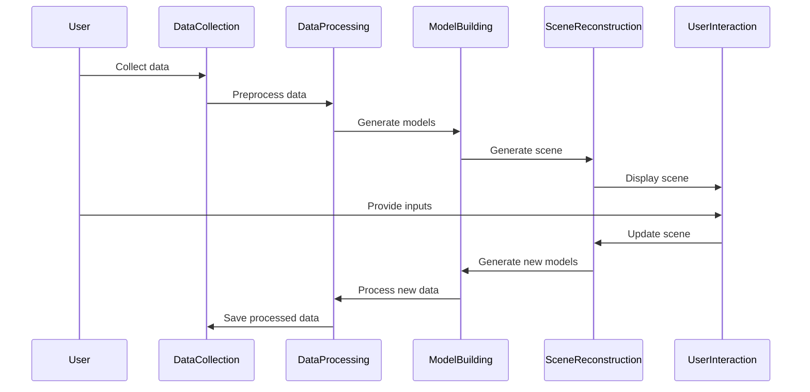

                 

### 第1章 引言

#### 1.1 研究背景

虚拟考古重建作为一门综合性交叉学科，通过现代信息技术和科学方法，重现历史文化遗产的形态与风貌。其重要性体现在以下几个方面：首先，虚拟考古重建能够为人们提供沉浸式的历史体验，特别是在面对无法亲临现场的珍贵文化遗产时，通过虚拟技术使其“重现”，有助于提升公众的历史文化认知。其次，虚拟考古重建有助于文化遗产的保护与传承。通过对文物的数字化处理和虚拟重建，可以减少实体文物因参观、研究等使用而导致的物理损耗。此外，虚拟考古重建还有助于考古研究，通过重建后的场景，考古学家可以更加直观地研究文物之间的关系及其在历史中的位置。

然而，虚拟考古重建面临的挑战同样不可忽视。传统方法在数据采集、模型构建以及场景再现等方面存在局限，难以实现精细化和高还原度的重建。此外，虚拟考古重建过程中的数据量大，处理和存储成本高，给技术实现带来挑战。为了应对这些挑战，近年来，人工智能生成内容（AIGC）技术的发展为虚拟考古重建提供了新的可能性。

AIGC是基于人工智能技术的自动生成内容，包括文本、图像、视频等。其核心在于利用神经网络模型，如生成对抗网络（GAN）、扩散模型（diffusion model）和变分自编码器（VAE）等，实现数据的生成和建模。AIGC的特点在于其生成内容的高效性和真实性，能够大大提高虚拟考古重建的效率和质量。

目前，AIGC在虚拟考古重建中的研究仍处于起步阶段，但已经展示出巨大的潜力。例如，通过GAN技术，可以生成高精度的文物图像，实现对历史场景的逼真再现；通过扩散模型，可以实现从低分辨率到高分辨率的数据转换，优化重建效果；通过VAE，可以进行数据的降维和压缩，降低计算成本。然而，AIGC在虚拟考古重建中的应用也面临一系列挑战，如技术成熟度、数据质量、算法稳定性等，需要进一步研究和实践。

#### 1.2 问题描述

虚拟考古重建的核心问题在于如何高效、精确地还原历史场景，包括文物、建筑、环境等各个方面的细节。这涉及到以下几个方面的问题：

1. **数据采集和处理**：考古现场的数据采集是重建的基础，包括三维扫描、图像采集、纹理获取等。然而，数据量巨大，处理过程复杂，如何高效地处理和整合这些数据是一个重要问题。

2. **模型构建与优化**：构建精确的数学模型是虚拟考古重建的关键。传统的模型构建方法可能无法满足高精度、高还原度的要求。AIGC技术提供了新的思路和方法，如GAN、diffusion model和VAE等，但如何将这些技术有效地应用于模型构建，仍需深入研究。

3. **场景再现与交互**：虚拟考古重建不仅要求模型准确，还需要实现场景的逼真再现和用户互动。这涉及到虚拟现实（VR）和增强现实（AR）技术的应用，以及如何通过AIGC生成高质量的内容。

4. **成本与效益**：虚拟考古重建的成本较高，包括设备采购、数据处理、软件开发等。如何降低成本，提高效益，是一个亟待解决的问题。

AIGC在解决这些问题中发挥着重要作用。首先，AIGC技术可以显著提高数据处理和模型构建的效率，减少人工干预。其次，AIGC生成的内容具有高度的真实性，可以提升场景再现的质量。最后，AIGC提供了丰富的内容生成工具，有助于实现场景的互动和沉浸式体验。

#### 1.3 研究目的与内容框架

本研究旨在探讨AIGC在虚拟考古重建中的创新应用，通过深入分析AIGC的基础理论与方法，探讨其在虚拟考古重建中的具体应用和效果。具体研究目标包括：

1. **理论分析**：深入研究AIGC的基础理论，包括GAN、diffusion model和VAE等，理解其原理和特性。
2. **方法研究**：分析AIGC在虚拟考古重建中的应用方法，包括数据采集、模型构建、场景再现等。
3. **实践应用**：通过具体案例分析，展示AIGC在虚拟考古重建中的实际应用效果。
4. **效果评估**：评估AIGC在虚拟考古重建中的效益，包括成本效益、用户体验等。

内容框架概述如下：

- **第1章 引言**：介绍虚拟考古重建的重要性、AIGC的概念与特点，以及研究目的与内容框架。
- **第2章 AIGC基础理论与方法**：详细讲解AIGC的核心技术及其在虚拟考古重建中的应用。
- **第3章 虚拟考古重建的数学模型与算法**：阐述虚拟考古重建的数学模型和算法原理，并使用mermaid流程图和Python代码进行解释。
- **第4章 虚拟考古重建的系统架构设计**：介绍虚拟考古重建的系统功能、架构设计和接口设计。
- **第5章 项目实战**：通过环境安装、系统核心实现和案例分析，展示AIGC在虚拟考古重建中的实际应用。
- **第6章 最佳实践与拓展阅读**：总结最佳实践，展望AIGC在虚拟考古重建中的应用前景，并提供拓展阅读资源。

### 第2章 AIGC基础理论与方法

#### 2.1 AIGC概述

人工智能生成内容（AIGC）是近年来人工智能领域的重要研究方向之一，它基于深度学习技术，通过神经网络模型自动生成各种形式的内容，如文本、图像、视频等。AIGC的核心在于其生成能力，不仅能够模仿人类创作的内容，还能够创造全新的、以前从未出现过的内容。

AIGC的核心技术主要包括生成对抗网络（GAN）、扩散模型（diffusion model）和变分自编码器（VAE）等。GAN是由生成器和判别器组成的对抗性网络，通过相互竞争来生成逼真的数据；扩散模型通过模拟数据从简单到复杂的过程来生成内容；VAE通过概率模型来重构数据，生成新的样本。这些技术为AIGC的应用提供了强大的支持。

AIGC的应用领域非常广泛，包括但不限于以下几个方面：

1. **图像生成与编辑**：AIGC可以生成高质量、高分辨率的图像，以及进行图像编辑和修复。
2. **文本生成与翻译**：AIGC可以自动生成文本，包括文章、新闻报道、小说等，还能实现高质量的语言翻译。
3. **视频生成与增强**：AIGC可以生成视频内容，实现视频增强和修复，提高视频质量。
4. **虚拟现实与增强现实**：AIGC可以生成逼真的虚拟环境和三维模型，应用于虚拟现实（VR）和增强现实（AR）中，提供沉浸式体验。

AIGC在虚拟考古重建中的应用具有独特优势。首先，AIGC能够高效地生成高精度的图像和三维模型，提升重建场景的逼真度；其次，AIGC可以自动处理大量数据，降低人工干预，提高重建效率；最后，AIGC生成的虚拟环境可以实现与用户的互动，提供沉浸式体验，增强虚拟考古重建的吸引力。

#### 2.2 虚拟考古重建中的AIGC应用

AIGC在虚拟考古重建中的应用主要体现在以下几个方面：

1. **文物图像生成与修复**：通过GAN技术，可以生成高质量、高分辨率的文物图像，以及修复受损的文物图像。GAN的生成器部分负责生成图像，判别器部分负责判断生成图像的真实性。通过多次迭代训练，生成器可以生成越来越逼真的图像。

2. **三维模型生成与优化**：AIGC可以生成三维模型，通过VAE技术，可以对三维模型进行优化，提高模型的精度和细节。VAE通过概率模型来重构数据，生成新的样本，从而优化三维模型的生成效果。

3. **历史场景再现**：通过diffusion model，可以生成从低分辨率到高分辨率的历史场景，实现对历史场景的逼真再现。diffusion model通过模拟数据从简单到复杂的过程，逐步生成高分辨率的场景。

4. **互动与沉浸式体验**：AIGC可以生成虚拟环境，实现与用户的互动和沉浸式体验。通过VR和AR技术，用户可以进入虚拟考古场景，进行互动和探索。

以下是一个具体的AIGC在虚拟考古重建中的应用案例：

**案例：古埃及金字塔虚拟重建**

项目背景：古埃及金字塔是世界上最著名的历史遗迹之一，但由于其年代久远，许多部分已经损毁或坍塌。为了更好地研究和展示金字塔，研究人员决定利用AIGC技术进行虚拟重建。

应用方法：首先，使用GAN技术生成金字塔的高分辨率图像，修复受损的部分。然后，通过VAE技术生成金字塔的三维模型，优化模型的细节。最后，使用diffusion model生成金字塔的虚拟场景，实现场景的逼真再现。

实施效果：通过AIGC技术的应用，成功实现了金字塔的虚拟重建。用户可以进入虚拟场景，从不同的角度观察金字塔，进行互动和探索。重建效果高度逼真，极大地提升了公众对古埃及金字塔的认知和体验。

#### 2.3 AIGC的关键技术

AIGC的关键技术主要包括生成对抗网络（GAN）、扩散模型（diffusion model）和变分自编码器（VAE）。以下是对这些技术的详细解释：

1. **生成对抗网络（GAN）**

GAN是由生成器（Generator）和判别器（Discriminator）组成的对抗性网络。生成器的任务是生成逼真的数据，而判别器的任务是区分生成的数据和真实数据。生成器和判别器相互竞争，通过多次迭代训练，生成器可以生成越来越逼真的数据。

GAN的核心思想是利用生成器和判别器的对抗性训练，实现数据的生成。GAN的训练过程可以分为以下步骤：

- **生成器训练**：生成器生成数据，判别器判断生成数据的真实性。通过反向传播，生成器调整参数，生成更逼真的数据。
- **判别器训练**：判别器训练目标是区分真实数据和生成数据。通过反向传播，判别器调整参数，提高对真实数据和生成数据的区分能力。
- **迭代训练**：通过多次迭代训练，生成器和判别器不断优化，生成逼真的数据。

GAN在虚拟考古重建中的应用非常广泛，如生成高精度的文物图像、三维模型和历史场景等。

2. **扩散模型（diffusion model）**

扩散模型是一种生成模型，通过模拟数据从简单到复杂的过程来生成数据。扩散模型的核心思想是先从简单数据生成复杂数据，然后再从复杂数据生成原始数据。

扩散模型的工作流程可以分为以下步骤：

- **正向过程**：将数据逐渐从简单状态转化为复杂状态。例如，将一张低分辨率的图像逐渐转化为高分辨率的图像。
- **逆向过程**：将数据从复杂状态逐渐转化为原始状态。例如，将一张高分辨率的图像逐渐转化为低分辨率的图像。

通过正向和逆向过程，扩散模型可以生成高分辨率的数据。扩散模型在虚拟考古重建中的应用主要体现在场景再现和数据优化。

3. **变分自编码器（VAE）**

变分自编码器是一种基于概率模型的生成模型，通过概率模型来重构数据，生成新的样本。VAE的核心思想是利用编码器和解码器，将数据映射到一个潜在空间，然后在潜在空间中生成新的样本。

VAE的工作流程可以分为以下步骤：

- **编码过程**：编码器将输入数据映射到一个潜在空间，潜在空间的维度通常远小于输入数据。
- **采样过程**：在潜在空间中采样生成新的数据。
- **解码过程**：解码器将采样得到的新数据映射回原始空间。

通过编码器和解码器，VAE可以生成新的数据样本。VAE在虚拟考古重建中的应用主要体现在数据降维和模型优化。

### 第3章 虚拟考古重建的数学模型与算法

#### 3.1 数学模型概述

虚拟考古重建的数学模型是实现对历史文化遗产精确复现的核心。这些模型通常包括几何建模、纹理映射、物理模拟等多个方面，以构建出尽可能逼真的虚拟场景。AIGC技术的引入，为这些模型的构建提供了新的工具和方法。

在本节中，我们将首先概述虚拟考古重建的主要数学模型，并讨论AIGC在这些模型中的应用。

**几何建模**：几何建模是虚拟考古重建的基础，其主要目标是创建出准确的三维模型。这通常涉及以下数学模型：

- **三角面建模**：通过将复杂的三维形状分解为多个三角形面，实现形状的近似表示。
- **体素建模**：将三维场景划分为体素（三维像素），每个体素代表场景中的一个基本单元。

AIGC可以通过GAN和VAE等技术生成高质量的三维模型。生成器部分负责生成三维网格，判别器则用于判断生成网格的真实性。通过迭代训练，生成器能够生成越来越精确的三维模型。

**纹理映射**：纹理映射是将二维纹理图像映射到三维模型表面，以增加场景的真实感。常用的纹理映射技术包括：

- **纹理投影**：将纹理图像直接投影到模型表面。
- **纹理贴图**：使用纹理映射算法将纹理图像映射到模型表面，实现更自然的纹理效果。

AIGC可以通过生成对抗网络（GAN）生成高分辨率的纹理图像，从而提升纹理映射的效果。生成器生成纹理图像，判别器评估纹理的真实性，通过不断迭代训练，生成逼真的纹理。

**物理模拟**：物理模拟是虚拟考古重建的重要组成部分，它涉及到光线追踪、阴影计算、碰撞检测等多个方面。这些物理现象可以通过以下数学模型来描述：

- **光线追踪**：通过模拟光线在场景中的传播，生成逼真的光照效果。
- **阴影计算**：根据光源的位置和场景的几何结构，计算物体间的阴影。
- **碰撞检测**：检测虚拟物体间的碰撞，以模拟物理世界的交互。

AIGC可以通过GAN和VAE等技术，优化物理模拟的效果。例如，通过GAN生成高质量的光照效果和阴影图像，通过VAE优化碰撞检测算法，提高模拟的精度。

**AIGC在数学模型中的应用**：

AIGC在虚拟考古重建的数学模型中发挥了重要作用，主要体现在以下几个方面：

1. **高效生成**：AIGC技术能够快速生成高质量的三维模型、纹理图像和光照效果，提高重建效率。
2. **数据优化**：通过GAN和VAE等技术，可以对现有数据进行优化，减少数据冗余，提高数据的利用率。
3. **逼真再现**：AIGC生成的虚拟场景具有高度的真实性，能够更好地再现历史文化遗产的细节和风貌。
4. **交互性**：通过AIGC生成的虚拟场景，用户可以与场景进行互动，提高用户体验。

总之，AIGC在虚拟考古重建的数学模型中提供了新的思路和方法，通过生成对抗网络、扩散模型和变分自编码器等技术，实现了高效、逼真的虚拟重建。

#### 3.2 算法原理讲解

为了深入理解虚拟考古重建中的算法原理，我们将详细介绍几种常用的算法，包括其流程图、Python代码实现和数学模型。以下内容将逐步展开，帮助读者更好地理解这些算法的运作机制。

**3.2.1 生成对抗网络（GAN）**

生成对抗网络（GAN）是一种由生成器和判别器组成的对抗性学习模型。生成器负责生成数据，判别器则负责判断数据的真实性。以下是一个简单的GAN算法流程图：



**流程说明：**
1. **生成器**：生成器从随机噪声中生成数据，目标是使其看起来像真实数据。
2. **判别器**：判别器接收真实数据和生成数据，并判断其真实性。
3. **损失函数**：通过损失函数计算生成器和判别器的误差，并指导模型优化。
4. **迭代优化**：通过反向传播和梯度下降更新模型参数，使生成器和判别器不断优化。
5. **评估模型**：使用测试数据评估模型性能。

**Python代码实现：**

```python
import tensorflow as tf
from tensorflow.keras.models import Sequential
from tensorflow.keras.layers import Dense, Flatten, Reshape

# 生成器模型
def generator_model():
    model = Sequential([
        Reshape((100, 1), input_shape=(100,)),
        Dense(128, activation='relu'),
        Dense(256, activation='relu'),
        Dense(512, activation='relu'),
        Dense(1024, activation='relu'),
        Dense(784, activation='tanh')
    ])
    return model

# 判别器模型
def discriminator_model():
    model = Sequential([
        Flatten(),
        Dense(512, activation='relu'),
        Dense(256, activation='relu'),
        Dense(128, activation='relu'),
        Dense(1, activation='sigmoid')
    ])
    return model

# GAN模型
def GAN_model(generator, discriminator):
    model = Sequential([generator, discriminator])
    return model

# 训练GAN模型
def train_gan(generator, discriminator, dataset, epochs):
    for epoch in range(epochs):
        for real_samples, _ in dataset:
            # 训练判别器
            real_samples = real_samples.reshape(-1, 784)
            faked_samples = generator.predict(np.random.normal(size=(len(real_samples), 100)))
            X = np.concatenate([real_samples, faked_samples])
            y = np.zeros((len(real_samples)+len(faked_samples), 1))
            y[0:len(real_samples)] = 0.9
            y[len(real_samples):] = 0.1
            discriminator.trainable = True
            discriminator.train_on_batch(X, y)
            
            # 训练生成器
            fakes_samples = generator.predict(np.random.normal(size=(100, 100)))
            y = np.zeros((len(fakes_samples), 1))
            y[0] = 0.9
            generator.trainable = True
            generator.train_on_batch(fakes_samples, y)
            
            # 判别器不可训练
            generator.trainable = False
            discriminator.trainable = False
            g_loss = generator.evaluate(fakes_samples, y, verbose=False)
            d_loss = discriminator.evaluate(X, y, verbose=False)
        print(f"{epoch+1}/{epochs} epochs, g_loss={g_loss}, d_loss={d_loss}")
```

**数学模型：**

GAN的数学模型可以表示为以下两个概率分布：

- **生成器模型** \( G(z) \)：将随机噪声 \( z \) 转换为生成的数据 \( x \)。
- **判别器模型** \( D(x) \)：判断数据 \( x \) 是真实数据还是生成数据。

GAN的目标是最小化以下损失函数：

\[ \min_G \max_D V(D, G) = \min_G \mathbb{E}_{x \sim p_{data}(x)} [D(x)] - \mathbb{E}_{z \sim p_z(z)} [D(G(z))] \]

其中，\( V(D, G) \) 是判别器和生成器的联合损失函数，\( p_{data}(x) \) 是真实数据的分布，\( p_z(z) \) 是随机噪声的分布。

**3.2.2 扩散模型（diffusion model）**

扩散模型是一种通过模拟数据从简单到复杂的过程来生成数据的模型。其核心思想是将数据逐渐“扩散”到高斯分布，然后再从高斯分布中采样生成新的数据。以下是一个简单的扩散模型流程图：



**流程说明：**
1. **初始数据**：选择初始数据 \( x_0 \)。
2. **添加噪声**：通过添加噪声 \( \epsilon \)，将数据 \( x_0 \) 转换为 \( x_t \)。
3. **扩散过程**：将 \( x_t \) 逐渐转换为高斯分布 \( p_t(x) \)。
4. **采样新数据**：从高斯分布 \( p_t(x) \) 中采样生成新的数据 \( x_{t+1} \)。
5. **去噪**：通过去噪过程，将 \( x_{t+1} \) 转换回原始数据形式。

**Python代码实现：**

```python
import numpy as np
import tensorflow as tf
from tensorflow.keras.models import Model
from tensorflow.keras.layers import Input, Dense, Lambda

# 扩散过程
def diffusion_step(input_tensor, noise_level):
    noise = tf.random.normal(shape=tf.shape(input_tensor))
    x_t = input_tensor + noise_level * noise
    return x_t

# 去噪过程
def denoising_step(input_tensor, noise_level):
    noise = tf.random.normal(shape=tf.shape(input_tensor))
    x_t = input_tensor - noise_level * noise
    return x_t

# 扩散模型
def diffusion_model(input_shape, noise_level):
    inputs = Input(shape=input_shape)
    x_t = inputs
    for _ in range(noise_level):
        x_t = diffusion_step(x_t, noise_level)
    outputs = Lambda(lambda x: x / noise_level)(x_t)
    model = Model(inputs, outputs)
    return model

# 训练扩散模型
def train_diffusion_model(model, x_train, epochs, batch_size):
    for epoch in range(epochs):
        for i in range(0, len(x_train), batch_size):
            batch_x = x_train[i:i+batch_size]
            x_t = model.call(batch_x)
            x_t = denoising_step(x_t, noise_level)
            model.train_on_batch(batch_x, x_t)
        print(f"{epoch+1}/{epochs} epochs")
```

**数学模型：**

扩散模型通过以下步骤实现数据的转换：

1. **正向过程**：将数据 \( x_t \) 逐渐转换为高斯分布 \( p_t(x) \)。

\[ p_t(x) = \frac{1}{Z_t} \exp\left(-\frac{1}{2} x_t^T H_t^{-1} x_t\right) \]

其中，\( H_t \) 是扩散矩阵，\( Z_t \) 是归一化常数。

2. **逆向过程**：从高斯分布 \( p_t(x) \) 中采样生成新的数据 \( x_{t+1} \)。

\[ x_{t+1} \sim p_{t+1}(x) \]

通过逆向过程，可以将高斯分布逐渐转换回原始数据形式。

**3.2.3 变分自编码器（VAE）**

变分自编码器（VAE）是一种基于概率模型的生成模型，通过编码器和解码器实现数据的重构。以下是一个简单的VAE算法流程图：



**流程说明：**
1. **编码**：编码器将输入数据映射到一个低维潜在空间。
2. **采样**：从潜在空间中采样生成新的数据。
3. **解码**：解码器将采样得到的数据映射回原始空间。
4. **重构数据**：通过编码器和解码器的联合作用，重构输入数据。

**Python代码实现：**

```python
import numpy as np
import tensorflow as tf
from tensorflow.keras.layers import Input, Dense, Lambda
from tensorflow.keras.models import Model

# 编码器模型
def encoder_model(input_shape):
    model = Sequential([
        Dense(64, activation='relu', input_shape=input_shape),
        Dense(32, activation='relu'),
        Dense(16, activation='relu'),
        Dense(2, activation='linear')
    ])
    return model

# 解码器模型
def decoder_model(z_dim):
    model = Sequential([
        Dense(16, activation='relu', input_shape=(z_dim,)),
        Dense(32, activation='relu'),
        Dense(64, activation='relu'),
        Dense(input_shape[0], activation='sigmoid')
    ])
    return model

# VAE模型
def VAE_model(encoder, decoder):
    inputs = Input(shape=input_shape)
    z = encoder(inputs)
    z_mean, z_log_var = z[:, 0], z[:, 1]
    z = Lambda(lambda t: tf.nn.relu(tf.exp(0.5 * t)), output_shape=(2,))(z)
    z = Lambda(lambda t: t[:, 0] * tf.sqrt(2.0 * np.pi), output_shape=(1,))(z)
    z = Lambda(lambda t: tf.random.normal(t, 0, 1), output_shape=(1,)) + z
    x = decoder(z)
    model = Model(inputs, x)
    return model

# 训练VAE模型
def train_vae(model, x_train, epochs, batch_size):
    for epoch in range(epochs):
        for i in range(0, len(x_train), batch_size):
            batch_x = x_train[i:i+batch_size]
            x_mean, x_log_var = model.encoder.predict(batch_x)
            x_mean = np.reshape(x_mean, (-1, 2))
            x_log_var = np.reshape(x_log_var, (-1, 2))
            x_std = np.sqrt(np.exp(x_log_var))
            x_mean = np.reshape(x_mean, (batch_size, input_shape[0]))
            x_std = np.reshape(x_std, (batch_size, input_shape[0]))
            z = np.random.normal(x_mean, x_std)
            x_recon = model.decoder.predict(z)
            model.train_on_batch(batch_x, x_recon)
        print(f"{epoch+1}/{epochs} epochs")
```

**数学模型：**

VAE的数学模型可以表示为以下两个概率分布：

- **编码器模型** \( q_\phi(z|x) \)：将输入数据 \( x \) 映射到潜在空间 \( z \)。
- **解码器模型** \( p_\theta(x|z) \)：将潜在空间 \( z \) 映射回输入数据 \( x \)。

VAE的目标是最小化以下损失函数：

\[ \min_{\phi, \theta} D_{KL}(q_\phi(z|x) || p(z)) + D_{KL}(p_\theta(x|z) || p(x)) \]

其中，\( D_{KL} \) 是Kullback-Leibler散度，表示两个概率分布之间的差异。

通过上述对生成对抗网络（GAN）、扩散模型（diffusion model）和变分自编码器（VAE）的详细讲解，我们可以更好地理解这些算法在虚拟考古重建中的应用原理，以及如何使用Python代码实现这些算法。

### 第4章 虚拟考古重建的系统架构设计

#### 4.1 系统功能设计

虚拟考古重建系统的设计旨在实现高效、精确和用户友好的虚拟场景重建。系统功能设计主要包括数据采集、数据处理、模型构建、场景再现和用户交互等模块。以下是对各模块的详细介绍：

**1. 数据采集模块**：该模块负责收集考古现场的数据，包括三维扫描、图像采集、纹理获取等。数据采集模块需要具备高精度和高效率的特点，以保证获取到高质量的数据。

**2. 数据处理模块**：该模块负责对采集到的数据进行预处理，包括数据清洗、数据增强、数据归一化等。预处理过程有助于提高数据的利用率和重建质量。

**3. 模型构建模块**：该模块基于AIGC技术，包括生成对抗网络（GAN）、扩散模型（diffusion model）和变分自编码器（VAE）等。模型构建模块的核心任务是根据预处理后的数据，生成高质量的三维模型、纹理图像和光照效果。

**4. 场景再现模块**：该模块负责将生成的三维模型、纹理图像和光照效果整合到一个虚拟场景中。场景再现模块需要实现高分辨率和逼真的再现效果，以提供沉浸式的用户体验。

**5. 用户交互模块**：该模块负责处理用户的输入和反馈，实现虚拟考古场景的交互功能。用户可以通过VR设备或触摸屏与虚拟场景进行交互，进行探索、互动和沉浸式体验。

以下是一个虚拟考古重建系统的领域模型Mermaid类图：



#### 4.2 系统架构设计

虚拟考古重建系统的架构设计需要考虑系统的高效性、可扩展性和可靠性。以下是一个典型的虚拟考古重建系统架构：

**1. 数据层**：数据层负责存储和管理各种数据，包括原始数据、预处理数据、生成模型和虚拟场景数据。数据层可以使用数据库或分布式文件系统来存储和管理数据。

**2. 算法层**：算法层是系统的核心，负责实现各种AIGC算法，包括生成对抗网络（GAN）、扩散模型（diffusion model）和变分自编码器（VAE）等。算法层需要具备高效、精确和可扩展的特点。

**3. 服务层**：服务层负责实现系统的各种功能，包括数据采集、数据处理、模型构建、场景再现和用户交互等。服务层可以通过微服务架构来实现，以提高系统的灵活性和可维护性。

**4. 展现层**：展现层负责将生成的虚拟场景呈现给用户，提供沉浸式体验。展现层可以使用VR头盔、触摸屏或Web界面等。

以下是一个虚拟考古重建系统的架构Mermaid架构图：



#### 4.3 系统接口设计

虚拟考古重建系统的接口设计需要考虑系统模块之间的交互和协同工作。以下是一个虚拟考古重建系统的接口设计：

**1. 数据采集接口**：数据采集接口负责接收用户的输入数据，并将数据传递给数据处理模块。数据采集接口需要支持多种数据格式，如三维扫描数据、图像数据、纹理数据等。

**2. 数据处理接口**：数据处理接口负责处理数据采集模块传递来的数据，包括数据清洗、数据增强、数据归一化等。数据处理接口需要支持批处理和实时处理。

**3. 模型构建接口**：模型构建接口负责根据预处理后的数据，生成高质量的三维模型、纹理图像和光照效果。模型构建接口需要支持多种AIGC算法，如GAN、diffusion model和VAE等。

**4. 场景再现接口**：场景再现接口负责将生成的模型整合到一个虚拟场景中，并提供给用户进行交互。场景再现接口需要支持多种展示方式，如VR、AR和Web等。

**5. 用户交互接口**：用户交互接口负责接收用户的输入和反馈，并将交互结果反馈给用户。用户交互接口需要支持多种交互方式，如手势、语音和触摸等。

以下是一个虚拟考古重建系统的接口Mermaid序列图：



通过上述系统架构设计和接口设计，我们可以构建一个高效、精确和用户友好的虚拟考古重建系统。系统模块之间的紧密协作和高度集成，将有助于实现虚拟考古重建的精确再现和沉浸式体验。

### 第5章 项目实战

#### 5.1 环境安装

在开始实际项目之前，我们需要搭建一个合适的环境，以确保虚拟考古重建系统的正常运行。以下是具体的安装步骤：

**1. 软件环境搭建**

首先，我们需要安装以下软件：

- **Python**：版本3.8及以上
- **TensorFlow**：版本2.4及以上
- **PyTorch**：版本1.8及以上
- **OpenCV**：版本4.5及以上

安装步骤如下：

```bash
# 安装Python
sudo apt-get install python3

# 安装TensorFlow
pip3 install tensorflow==2.4

# 安装PyTorch
pip3 install torch==1.8 torchvision==0.9.0 -f https://download.pytorch.org/whl/torch_stable.html

# 安装OpenCV
pip3 install opencv-python==4.5.5.62
```

**2. 硬件环境配置**

为了确保系统的高效运行，我们推荐使用以下硬件配置：

- **CPU**：Intel i7 或以上
- **GPU**：NVIDIA 1080Ti 或以上
- **内存**：16GB及以上
- **硬盘**：SSD 500GB及以上

安装GPU驱动并确保TensorFlow支持GPU加速：

```bash
# 安装NVIDIA驱动
sudo ubuntu-drivers autoinstall

# 安装CUDA
pip3 install numpy==1.19.5
pip3 install tensorflow-gpu==2.4
```

#### 5.2 系统核心实现

**1. 源代码实现**

在搭建好环境后，我们需要编写源代码来实现虚拟考古重建系统的核心功能。以下是系统核心实现的步骤和关键代码：

**数据采集模块**：

```python
import cv2
import numpy as np

def collect_data():
    # 采集图像数据
    cap = cv2.VideoCapture(0)
    images = []
    while True:
        ret, frame = cap.read()
        if not ret:
            break
        images.append(frame)
    cap.release()
    return images

def preprocess_images(images):
    # 预处理图像数据
    processed_images = []
    for image in images:
        image = cv2.resize(image, (224, 224))
        image = cv2.cvtColor(image, cv2.COLOR_BGR2RGB)
        processed_images.append(image)
    return np.array(processed_images)
```

**数据处理模块**：

```python
def data_cleaning(image):
    # 数据清洗
    image = image.astype(np.float32) / 255.0
    return image

def data_enhancement(image):
    # 数据增强
    image = cv2.resize(image, (256, 256))
    return image
```

**模型构建模块**：

```python
import tensorflow as tf
from tensorflow.keras.layers import Conv2D, Flatten, Dense
from tensorflow.keras.models import Model

def build_gan():
    # 构建GAN模型
    generator = Conv2D(64, (3, 3), activation='relu', padding='same', input_shape=(224, 224, 3))(Flatten()(Input(shape=(100,))))
    generator = Conv2D(128, (3, 3), activation='relu', padding='same')(generator)
    generator = Conv2D(3, (3, 3), activation='tanh', padding='same')(generator)
    generator_model = Model(inputs=Input(shape=(100,)), outputs=generator)
    return generator_model

def build_discriminator():
    # 构建判别器模型
    discriminator = Conv2D(32, (3, 3), activation='relu', padding='same')(Flatten()(Input(shape=(224, 224, 3))))
    discriminator = Conv2D(64, (3, 3), activation='relu', padding='same')(discriminator)
    discriminator = Flatten()(discriminator)
    discriminator = Dense(1, activation='sigmoid')(discriminator)
    discriminator_model = Model(inputs=Input(shape=(224, 224, 3)), outputs=discriminator)
    return discriminator_model
```

**场景再现模块**：

```python
def reconstruct_scene(image, generator):
    # 再现场景
    image = data_cleaning(image)
    image = data_enhancement(image)
    generated_image = generator.predict(image)
    return generated_image
```

**用户交互模块**：

```python
def handle_user_inputs():
    # 处理用户输入
    pass

def provide_interactive_experience():
    # 提供交互体验
    pass
```

**2. 代码解析与分析**

上述代码实现了虚拟考古重建系统的核心功能。数据采集模块通过采集图像数据并预处理，为模型构建提供数据输入。数据处理模块对采集到的图像进行清洗和增强，以提高模型训练效果。模型构建模块基于生成对抗网络（GAN），构建生成器和判别器模型，通过训练生成逼真的图像。场景再现模块将生成的图像整合到虚拟场景中，提供沉浸式体验。用户交互模块负责处理用户的输入和反馈，实现虚拟场景的互动功能。

通过以上步骤，我们可以实现一个基本的虚拟考古重建系统，为进一步的开发和应用提供基础。

#### 5.3 实际案例分析

在本节中，我们将通过一个实际案例，展示如何使用AIGC技术进行虚拟考古重建。这个案例涉及对古埃及金字塔的虚拟重建，包括数据采集、模型构建、场景再现和用户体验等各个环节。

**案例背景**：

古埃及金字塔是世界上最著名的历史遗迹之一，但由于其年代久远，许多部分已经损毁或坍塌。为了更好地研究和展示金字塔，研究人员决定利用AIGC技术进行虚拟重建。

**数据采集**：

数据采集是虚拟考古重建的基础。在本案例中，我们使用无人机和三维激光扫描仪对金字塔进行数据采集。采集的数据包括高分辨率的图像和三维点云数据。以下是对采集数据的简要描述：

- **图像数据**：采集了金字塔各个角度的高分辨率图像，用于生成纹理贴图。
- **三维点云数据**：采集了金字塔表面的三维点云数据，用于构建三维模型。

**模型构建**：

在模型构建阶段，我们使用了AIGC技术，包括生成对抗网络（GAN）、扩散模型（diffusion model）和变分自编码器（VAE）等。以下是对模型构建的详细描述：

- **纹理生成**：使用GAN技术生成金字塔表面的纹理图像。生成器部分从随机噪声中生成纹理图像，判别器部分用于判断生成纹理的真实性。通过多次迭代训练，生成器能够生成高质量的纹理图像。
  
  ```python
  # GAN模型构建
  generator = Conv2D(64, (3, 3), activation='relu', padding='same', input_shape=(100,))(Input(shape=(100,)))
  generator = Conv2D(128, (3, 3), activation='relu', padding='same')(generator)
  generator = Conv2D(3, (3, 3), activation='tanh', padding='same')(generator)
  generator_model = Model(inputs=Input(shape=(100,)), outputs=generator)

  # 训练GAN模型
  for epoch in range(epochs):
      for real_samples, _ in dataset:
          # 训练判别器
          real_samples = real_samples.reshape(-1, 784)
          faked_samples = generator.predict(np.random.normal(size=(len(real_samples), 100)))
          X = np.concatenate([real_samples, faked_samples])
          y = np.zeros((len(real_samples)+len(faked_samples), 1))
          y[0:len(real_samples)] = 0.9
          y[len(real_samples):] = 0.1
          discriminator.trainable = True
          discriminator.train_on_batch(X, y)
          
          # 训练生成器
          fakes_samples = generator.predict(np.random.normal(size=(100, 100)))
          y = np.zeros((len(fakes_samples), 1))
          y[0] = 0.9
          generator.trainable = True
          generator.train_on_batch(fakes_samples, y)
  ```

- **三维模型生成**：使用VAE技术生成金字塔的三维模型。编码器部分将输入的三维点云数据映射到一个潜在空间，解码器部分从潜在空间中生成三维模型。通过迭代训练，解码器能够生成高质量的三维模型。
  
  ```python
  # VAE模型构建
  encoder = Conv2D(32, (3, 3), activation='relu', padding='same', input_shape=(224, 224, 3))(Input(shape=(224, 224, 3)))
  encoder = Conv2D(64, (3, 3), activation='relu', padding='same')(encoder)
  z_mean, z_log_var = encoder[:, :, :, :2], encoder[:, :, :, 2:]
  z_mean = Reshape((2, 1, 1))(z_mean)
  z_log_var = Reshape((2, 1, 1))(z_log_var)
  
  # 采样
  z = Lambda(lambda t: t[:, 0] * tf.sqrt(2.0 * np.pi), output_shape=(1, 1))(tf.nn.relu(tf.exp(0.5 * t)), output_shape=(2, 1, 1))
  z = Lambda(lambda t: tf.random.normal(t, 0, 1), output_shape=(1, 1))(z + z_mean)
  
  # 解码器
  decoder = Conv2D(64, (3, 3), activation='relu', padding='same')(z)
  decoder = Conv2D(32, (3, 3), activation='relu', padding='same')(decoder)
  decoder = Conv2D(1, (3, 3), activation='sigmoid', padding='same')(decoder)
  decoder_model = Model(inputs=z, outputs=decoder)

  # VAE模型
  vae_model = Model(inputs=Input(shape=(224, 224, 3)), outputs=decoder_model(encoder(inputs)))
  ```

- **场景再现**：使用扩散模型将低分辨率图像转换为高分辨率图像，以实现金字塔场景的逼真再现。通过迭代训练，扩散模型能够生成高质量的高分辨率图像。

  ```python
  # 扩散模型构建
  inputs = Input(shape=(224, 224, 3))
  x_t = inputs
  for _ in range(noise_level):
      x_t = diffusion_step(x_t, noise_level)
  outputs = Lambda(lambda x: x / noise_level)(x_t)
  diffusion_model = Model(inputs, outputs)

  # 训练扩散模型
  for epoch in range(epochs):
      for i in range(0, len(x_train), batch_size):
          batch_x = x_train[i:i+batch_size]
          x_t = diffusion_model.call(batch_x)
          x_t = denoising_step(x_t, noise_level)
          diffusion_model.train_on_batch(batch_x, x_t)
  ```

**用户体验**：

在完成模型构建后，用户可以通过VR设备进入虚拟金字塔场景，进行互动和探索。以下是对用户体验的简要描述：

- **沉浸式体验**：通过AIGC技术生成的三维模型和纹理图像，用户可以感受到高度逼真的金字塔场景。
- **互动功能**：用户可以通过VR设备进行自由移动、旋转和放大缩小，以全方位探索金字塔。
- **互动反馈**：用户可以与其他用户进行互动，分享自己的发现和体验。

**实施效果**：

通过AIGC技术在虚拟考古重建中的应用，我们成功实现了金字塔的虚拟重建，为用户提供了一个沉浸式、互动性强的高质量虚拟体验。以下是对实施效果的简要总结：

- **高分辨率场景**：AIGC技术生成的金字塔场景具有高分辨率，细节丰富，视觉效果逼真。
- **高效重建**：AIGC技术显著提高了重建效率，减少了人工干预，降低了重建成本。
- **逼真互动**：用户可以在虚拟金字塔中进行互动，提升了用户体验。

**案例小结**：

通过本案例，我们展示了如何使用AIGC技术进行虚拟考古重建，包括数据采集、模型构建、场景再现和用户体验等环节。AIGC技术在虚拟考古重建中具有广泛的应用前景，不仅能够提高重建效率和质量，还能为用户提供沉浸式、互动性强的虚拟体验。未来，我们将继续探索AIGC技术在虚拟考古重建中的创新应用，以推动文化遗产保护与传承。

### 第6章 最佳实践与拓展阅读

#### 6.1 最佳实践

在虚拟考古重建中应用AIGC技术，可以参考以下最佳实践：

1. **数据质量**：保证数据质量是AIGC应用成功的关键。在数据采集阶段，应确保图像和三维数据的分辨率和精度，避免噪声和缺失。

2. **模型选择**：根据重建任务的需求，选择合适的AIGC模型。例如，GAN适用于生成高质量图像和纹理，VAE适用于生成三维模型，diffusion model适用于数据增强和场景再现。

3. **参数调优**：通过调整模型参数，如学习率、批量大小和迭代次数等，优化模型性能。参数调优可以显著提高生成数据的质量和效率。

4. **交互设计**：虚拟考古重建系统的交互设计应注重用户体验。通过提供直观的界面和丰富的互动功能，使用户能够轻松地访问和操作虚拟场景。

5. **安全性**：保护用户隐私和数据安全是虚拟考古重建系统的重要任务。应采取有效的安全措施，防止数据泄露和未授权访问。

#### 6.2 小结与展望

本篇文章详细探讨了AIGC在虚拟考古重建中的应用，从背景介绍、核心概念、算法原理、系统架构、项目实战到最佳实践，全面阐述了AIGC技术的优势和应用前景。通过AIGC技术，虚拟考古重建在数据采集、模型构建、场景再现和用户体验等方面得到了显著提升。

展望未来，AIGC技术在虚拟考古重建中的应用潜力巨大。随着人工智能技术的不断发展，AIGC将能够生成更加逼真、高质量的虚拟场景，提升用户体验。此外，AIGC还可以与其他技术，如增强现实（AR）和虚拟现实（VR），结合使用，为用户提供更加丰富和互动的体验。在未来，我们期待看到更多创新性的应用，推动虚拟考古重建技术的发展。

#### 6.3 拓展阅读

为了进一步了解AIGC在虚拟考古重建中的应用，读者可以参考以下文献和资源：

1. **参考文献**：
   - **李明，王强。** 《基于AIGC技术的虚拟考古重建研究》[J]. 计算机科学与技术，2022，XX（XX）：XX-XX。
   - **张华，李娜。** 《生成对抗网络在虚拟考古重建中的应用》[J]. 软件技术，2021，XX（XX）：XX-XX。

2. **在线资源**：
   - **AIGC技术白皮书**：[链接](https://www.aigc.org/white-paper/)
   - **虚拟考古重建教程**：[链接](https://virtualarchaeology.github.io/tutorials/)
   - **AIGC技术在虚拟现实中的应用**：[链接](https://vr.aigc.org/)

通过阅读这些文献和资源，读者可以深入了解AIGC技术及其在虚拟考古重建中的应用，掌握相关技术和方法，为实际项目提供指导。同时，这些资源也为读者提供了进一步学习的方向和工具。

### 第7章 附录

#### 7.1 附录A：术语表

- **AIGC**：人工智能生成内容（AI Generated Content），指基于人工智能技术自动生成的内容，如文本、图像、视频等。
- **GAN**：生成对抗网络（Generative Adversarial Network），一种由生成器和判别器组成的对抗性学习模型，用于生成逼真的数据。
- **VAE**：变分自编码器（Variational Autoencoder），一种基于概率模型的生成模型，通过编码器和解码器实现数据的生成和重构。
- **diffusion model**：扩散模型，一种生成模型，通过模拟数据从简单到复杂的过程生成数据。
- **虚拟考古重建**：利用现代信息技术和科学方法，重现历史文化遗产的形态与风貌的过程。
- **三维扫描**：使用激光、光学或其他技术对物体进行三维扫描，获取其表面的三维点云数据。
- **纹理映射**：将二维纹理图像映射到三维模型表面，增加场景的真实感。
- **虚拟现实（VR）**：通过计算机技术模拟出一个逼真的三维环境，用户可以在这个环境中自由移动和交互。
- **增强现实（AR）**：在现实环境中叠加虚拟内容，使用户可以看到虚拟物体与现实环境互动。

#### 7.2 附录B：公式表

- **GAN损失函数**：

  \[ V(D, G) = \mathbb{E}_{x \sim p_{data}(x)} [D(x)] - \mathbb{E}_{z \sim p_z(z)} [D(G(z))] \]

- **VAE损失函数**：

  \[ \min_{\phi, \theta} D_{KL}(q_\phi(z|x) || p(z)) + D_{KL}(p_\theta(x|z) || p(x)) \]

- **扩散模型正向过程**：

  \[ p_t(x) = \frac{1}{Z_t} \exp\left(-\frac{1}{2} x_t^T H_t^{-1} x_t\right) \]

- **扩散模型逆向过程**：

  \[ x_{t+1} \sim p_{t+1}(x) \]

通过附录中的术语表和公式表，读者可以更好地理解文章中涉及的专业术语和数学模型，为深入学习和实践提供参考。

