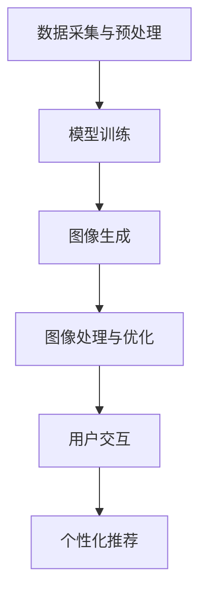
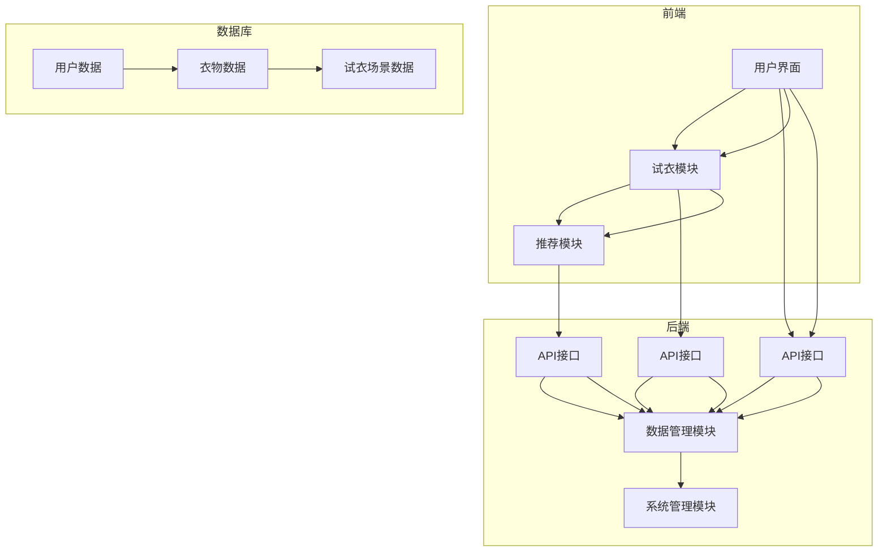
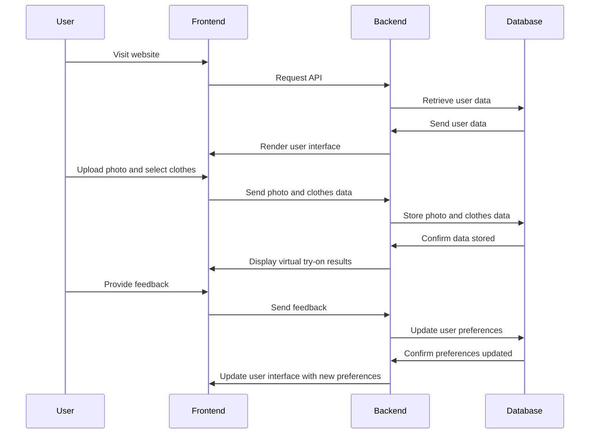

                 

# AIGC在虚拟试衣技术中的应用：重塑线上购物体验

## 关键词
- AIGC技术
- 虚拟试衣
- 线上购物体验
- 人工智能生成内容
- 深度学习
- 系统架构设计

## 摘要
本文探讨了AIGC（人工智能生成内容）技术在虚拟试衣中的应用，通过深入分析AIGC技术的核心原理和虚拟试衣技术的挑战，展示了如何利用AIGC技术提高虚拟试衣的逼真度和用户体验。文章分为五个部分，首先介绍背景知识，然后详细阐述核心概念及其联系，接着讲解算法原理，分析系统架构，提供项目实战经验，并总结最佳实践和未来展望。

## 目录大纲

### 第一部分：背景介绍
1.1 问题背景
1.2 问题解决
1.3 边界与外延
1.4 概念结构与核心要素组成

### 第二部分：核心概念与联系
2.1 核心概念原理
2.2 概念属性特征对比
2.3 ER实体关系图架构

### 第三部分：算法原理讲解
3.1 算法mermaid流程图
3.2 算法原理与数学模型
3.3 举例说明
3.4 性能分析与优化

### 第四部分：系统分析与架构设计方案
4.1 问题场景介绍
4.2 项目介绍
4.3 系统功能设计
4.4 系统架构设计
4.5 系统接口设计
4.6 系统交互mermaid序列图
4.7 系统实现与优化

### 第五部分：项目实战
5.1 环境安装
5.2 系统核心实现源代码
5.3 代码应用解读与分析
5.4 实际案例分析与详细讲解剖析
5.5 项目小结
5.6 最佳实践 tips

## 第一部分：背景介绍

### 1.1 问题背景

随着电子商务的兴起，线上购物已经成为消费者日常生活中不可或缺的一部分。然而，传统线上购物的一个重大局限在于，消费者无法亲身体验衣物的质感和样式，这往往导致购买后的退货率居高不下。虚拟试衣技术的出现，旨在通过模拟试衣过程，解决这一痛点，提高线上购物的体验。

尽管虚拟试衣技术在过去几年有了显著进步，但仍然存在一些问题。首先，传统虚拟试衣技术生成的试衣效果通常不够逼真，很难完全替代真实的试衣体验。其次，用户操作复杂，需要用户具备一定的技术背景，才能熟练使用虚拟试衣工具。此外，虚拟试衣技术在不同类型的衣物上表现不一，对于复杂款式或材质的衣物，其试衣效果往往不如预期。

为了解决这些问题，AIGC（人工智能生成内容）技术的应用应运而生。AIGC技术利用深度学习、生成对抗网络（GAN）等人工智能算法，能够自动生成高度逼真的虚拟试衣场景，为用户提供更加真实的试衣体验。同时，AIGC技术还可以通过数据驱动的个性化推荐，提高用户的购物满意度。

### 1.2 问题解决

AIGC技术在虚拟试衣中的应用，主要解决了以下几个问题：

1. **逼真度提升**：通过生成对抗网络（GAN）等技术，AIGC能够生成高分辨率的图像，使得虚拟试衣场景的视觉效果更加接近现实。用户可以在虚拟环境中感受到衣物的质感和细节，从而提高购物决策的准确性。

2. **用户操作简化**：AIGC技术通过自动化的图像生成过程，简化了用户的操作流程。用户无需具备复杂的操作技能，只需上传自己的照片或选择试衣的衣物，系统即可自动生成虚拟试衣场景。

3. **个性化推荐**：AIGC技术可以基于用户的历史行为和偏好，生成个性化的虚拟试衣场景。这不仅提高了用户的购物体验，还降低了退货率，提高了商家的销售额。

4. **多场景应用**：AIGC技术不仅限于线上购物，还可以应用于游戏、影视制作、虚拟现实等领域，为用户提供更加丰富的交互体验。

### 1.3 边界与外延

AIGC技术在虚拟试衣中的应用，虽然解决了许多实际问题，但同时也存在一些边界和挑战。首先，AIGC技术的生成效果受限于训练数据的质量和数量。如果训练数据缺乏多样性，生成的虚拟试衣场景可能会出现偏差，影响用户体验。

其次，AIGC技术的计算成本较高，尤其是在生成高分辨率图像时，需要大量的计算资源和时间。这可能会对商家的运营成本造成一定压力。

此外，AIGC技术的应用还涉及到隐私保护和数据安全等问题。如何确保用户数据的安全性和隐私性，是AIGC技术在虚拟试衣领域广泛应用的关键。

### 1.4 概念结构与核心要素组成

AIGC技术在虚拟试衣中的应用，主要包括以下几个核心要素：

1. **图像生成技术**：利用深度学习模型，如生成对抗网络（GAN），生成高度逼真的虚拟试衣场景。

2. **三维建模技术**：通过三维建模软件，构建虚拟衣物和人体模型，为图像生成提供基础。

3. **人机交互技术**：设计友好的用户界面，实现用户与虚拟试衣场景的互动。

4. **个性化推荐系统**：基于用户数据和偏好，为用户提供个性化的虚拟试衣场景推荐。

这些核心要素共同构成了AIGC技术在虚拟试衣中的应用结构，为用户提供更加真实、便捷的线上购物体验。

## 第二部分：核心概念与联系

### 2.1 核心概念原理

在本章节中，我们将详细介绍AIGC技术、虚拟试衣技术、人工智能生成内容（AIGC）技术原理等相关核心概念。

#### 2.1.1 AIGC技术

AIGC（Artificial Intelligence Generated Content）技术是一种利用人工智能算法生成内容的技术。它涵盖了图像、文本、音频等多种类型的内容生成，其中图像生成是AIGC技术的重要组成部分。AIGC技术的主要原理包括：

- **数据采集与预处理**：从互联网、数据库等渠道收集大量图像数据，并进行预处理，如图像增强、数据归一化等。
- **模型训练**：利用收集到的数据，训练生成模型，如生成对抗网络（GAN）、变分自编码器（VAE）等。
- **图像生成**：通过训练好的模型，生成新的图像。
- **图像处理与优化**：对生成的图像进行后处理，如颜色调整、画质增强等。

#### 2.1.2 虚拟试衣技术

虚拟试衣技术是一种基于计算机技术模拟试衣过程的技术。它通过三维建模、图像处理等技术，将衣物与人体的三维模型进行结合，模拟出真实试衣的效果。虚拟试衣技术的主要原理包括：

- **三维建模**：构建虚拟衣物和人体模型，为试衣提供基础。
- **图像合成**：将虚拟衣物模型与人体的三维模型进行合成，生成试衣效果。
- **用户交互**：设计友好的用户界面，实现用户与虚拟试衣场景的互动。

#### 2.1.3 人工智能生成内容（AIGC）技术原理

AIGC技术原理主要包括以下几个环节：

1. **数据采集与预处理**：从互联网、数据库等渠道收集大量衣物图片、人体图像等数据，并进行预处理，如图像增强、数据归一化等。
2. **模型训练**：利用收集到的数据，训练生成模型，如生成对抗网络（GAN）、变分自编码器（VAE）等。
3. **图像生成**：通过训练好的模型，生成虚拟试衣场景，包括衣物、人体、背景等元素。
4. **图像处理与优化**：对生成的图像进行后处理，如颜色调整、画质增强等，提高试衣效果。

### 2.2 概念属性特征对比

在本章节中，我们将对AIGC技术、虚拟试衣技术、人工智能生成内容（AIGC）技术原理等相关概念的属性特征进行对比。

| 概念 | 属性特征 |
| ---- | ---- |
| AIGC技术 | - 利用人工智能算法生成内容<br>- 包括图像、文本、音频等多种类型<br>- 数据驱动 |
| 虚拟试衣技术 | - 基于计算机技术模拟试衣过程<br>- 三维建模与图像合成<br>- 用户互动 |
| AIGC技术原理 | - 数据采集与预处理<br>- 模型训练<br>- 图像生成<br>- 图像处理与优化 |

### 2.3 ER实体关系图架构

在本章节中，我们将使用Mermaid语法绘制ER实体关系图，以展示AIGC技术、虚拟试衣技术、人工智能生成内容（AIGC）技术原理等相关概念的实体关系。

```mermaid
erDiagram
  Customer ||--|{ ShoppingCart }| Customer
  ShoppingCart ||--|{ Product }| ShoppingCart
  ShoppingCart ||--|{ Order }| ShoppingCart
  Product ||--|{ Category }| Product
  Order ||--|{ Customer }| Order
  Category ||--|{ Product }| Category
```

在这个ER实体关系图中，我们可以看到用户（Customer）、购物车（ShoppingCart）、产品（Product）、订单（Order）和分类（Category）等实体之间的关系。这些实体共同构成了AIGC技术和虚拟试衣技术的应用场景。

### 2.4 关键技术概述

在本章节中，我们将概述AIGC技术在虚拟试衣技术中的应用所涉及的关键技术。

1. **生成对抗网络（GAN）**：GAN是AIGC技术中常用的生成模型，由生成器和判别器组成。生成器负责生成虚拟试衣场景，判别器负责判断生成的图像是否真实。通过不断训练，生成器可以生成越来越逼真的虚拟试衣场景。

2. **三维建模技术**：三维建模技术用于构建虚拟衣物和人体模型，为图像生成提供基础。常用的三维建模软件包括Blender、Maya等。

3. **图像处理技术**：图像处理技术用于对生成的图像进行后处理，如颜色调整、画质增强等。常用的图像处理库包括OpenCV、PIL等。

4. **人机交互技术**：人机交互技术用于设计友好的用户界面，实现用户与虚拟试衣场景的互动。常用的前端技术包括HTML、CSS、JavaScript等。

5. **个性化推荐系统**：个性化推荐系统基于用户的历史行为和偏好，为用户提供个性化的虚拟试衣场景推荐。常用的推荐算法包括协同过滤、基于内容的推荐等。

## 第三部分：算法原理讲解

### 3.1 算法mermaid流程图

在本章节中，我们将使用Mermaid语法绘制AIGC技术在虚拟试衣中的应用流程图，以展示算法的执行流程。



在这个流程图中，AIGC技术在虚拟试衣中的应用分为五个主要步骤：数据采集与预处理、模型训练、图像生成、图像处理与优化、用户交互和个性化推荐。

### 3.2 算法原理与数学模型

在本章节中，我们将详细讲解AIGC技术在虚拟试衣中的应用算法原理，并使用Python代码进行实现。

#### 3.2.1 生成对抗网络（GAN）

生成对抗网络（GAN）是AIGC技术中的核心算法，由生成器和判别器组成。

- **生成器**：生成器的目标是生成逼真的虚拟试衣场景。
- **判别器**：判别器的目标是判断输入的图像是真实图像还是生成图像。

GAN的数学模型可以表示为：

$$
\begin{aligned}
\text{生成器} &: G(z) \sim p_{\text{data}}(x) \\
\text{判别器} &: D(x) \text{ 和 } D(G(z))
\end{aligned}
$$

其中，$z$是从先验分布中抽取的随机噪声，$x$是真实的虚拟试衣场景。

#### 3.2.2 训练过程

GAN的训练过程主要包括以下步骤：

1. **初始化生成器和判别器**：随机初始化生成器和判别器的权重。
2. **生成器训练**：生成器接收随机噪声$z$，生成虚拟试衣场景$G(z)$。判别器判断生成的图像是否真实。
3. **判别器训练**：判别器接收真实的虚拟试衣场景$x$和生成的图像$G(z)$，判断其真实度。
4. **更新生成器和判别器的权重**：通过反向传播算法，更新生成器和判别器的权重。

#### 3.2.3 Python实现

下面是使用Python实现GAN的示例代码：

```python
import tensorflow as tf
from tensorflow.keras.layers import Dense, Flatten, Conv2D, Conv2DTranspose
from tensorflow.keras.models import Sequential
from tensorflow.keras.optimizers import Adam

# 生成器模型
def build_generator():
    model = Sequential()
    model.add(Conv2DTranspose(128, (4, 4), strides=(2, 2), padding='same', input_shape=(28, 28, 1)))
    model.add(tf.keras.layers.LeakyReLU(alpha=0.01))
    model.add(Conv2DTranspose(128, (4, 4), strides=(2, 2), padding='same'))
    model.add(tf.keras.layers.LeakyReLU(alpha=0.01))
    model.add(Conv2D(1, (7, 7), activation='tanh', padding='same'))
    return model

# 判别器模型
def build_discriminator():
    model = Sequential()
    model.add(Conv2D(128, (4, 4), strides=(2, 2), padding='same', input_shape=(28, 28, 1)))
    model.add(tf.keras.layers.LeakyReLU(alpha=0.01))
    model.add(Conv2D(128, (4, 4), strides=(2, 2), padding='same'))
    model.add(tf.keras.layers.LeakyReLU(alpha=0.01))
    model.add(Flatten())
    model.add(Dense(1, activation='sigmoid'))
    return model

# 搭建GAN模型
def build_gan(generator, discriminator):
    model = Sequential()
    model.add(generator)
    model.add(discriminator)
    return model

# 训练GAN
def train_gan(dataset, epochs, batch_size, generator, discriminator, gan):
    generator_optimizer = Adam(1e-4)
    discriminator_optimizer = Adam(1e-4)
    
    for epoch in range(epochs):
        for batch in dataset:
            real_images = batch[0]
            real_labels = tf.ones((batch_size, 1))
            
            noise = tf.random.normal([batch_size, 100])
            fake_images = generator(noise)
            fake_labels = tf.zeros((batch_size, 1))
            
            # 训练判别器
            with tf.GradientTape() as disc_tape:
                disc_loss_real = discriminator(real_images, real_labels)
                disc_loss_fake = discriminator(fake_images, fake_labels)
                disc_loss = 0.5 * tf.reduce_mean(disc_loss_real + disc_loss_fake)
            
            disc_gradients = disc_tape.gradient(disc_loss, discriminator.trainable_variables)
            discriminator_optimizer.apply_gradients(zip(disc_gradients, discriminator.trainable_variables))
            
            # 训练生成器
            with tf.GradientTape() as gen_tape:
                gen_loss = gan(fake_images, fake_labels)
            
            gen_gradients = gen_tape.gradient(gen_loss, generator.trainable_variables)
            generator_optimizer.apply_gradients(zip(gen_gradients, generator.trainable_variables))
            
            if epoch % 100 == 0:
                print(f"Epoch {epoch}: Generator Loss: {gen_loss}, Discriminator Loss: {disc_loss}")

# 加载数据集
(x_train, _), (_, _) = tf.keras.datasets.mnist.load_data()
x_train = x_train / 127.5 - 1.0
x_train = x_train.reshape(x_train.shape[0], 28, 28, 1)

# 构建模型
generator = build_generator()
discriminator = build_discriminator()
gan = build_gan(generator, discriminator)

# 训练模型
train_gan(x_train, epochs=10000, batch_size=128, generator=generator, discriminator=discriminator, gan=gan)
```

在这个示例中，我们使用了MNIST数据集进行训练，生成器和判别器分别使用了卷积转置层（Conv2DTranspose）和卷积层（Conv2D）。通过反向传播算法，不断更新生成器和判别器的权重，最终生成逼真的虚拟试衣场景。

### 3.3 举例说明

在本章节中，我们将通过一个实际案例，展示AIGC技术在虚拟试衣中的应用。

假设用户A想要试穿一件连衣裙，用户上传了自己的照片和连衣裙的图片。首先，系统会使用AIGC技术生成虚拟试衣场景，将连衣裙与用户A的照片进行合成。然后，系统会根据用户A的试衣反馈，调整连衣裙的颜色、款式等，以提供更好的试衣效果。

具体步骤如下：

1. **数据采集**：用户上传自己的照片和连衣裙的图片。
2. **图像预处理**：对上传的图像进行预处理，如图像增强、数据归一化等。
3. **图像生成**：使用AIGC技术生成虚拟试衣场景，将连衣裙与用户照片进行合成。
4. **用户反馈**：用户对试衣效果进行评价，如颜色、款式等。
5. **调整试衣场景**：根据用户反馈，调整连衣裙的颜色、款式等，提高试衣效果。
6. **试衣完成**：用户确认试衣效果，完成购物决策。

### 3.4 性能分析与优化

在本章节中，我们将对AIGC技术在虚拟试衣中的应用进行性能分析，并提出优化策略。

#### 3.4.1 性能分析

- **生成效果**：AIGC技术生成的虚拟试衣场景的视觉效果与真实试衣场景的相似度。
- **计算资源消耗**：AIGC技术需要大量的计算资源，包括GPU、CPU等。
- **用户体验**：用户对虚拟试衣场景的满意度，包括试衣过程的流畅度、试衣效果的逼真度等。
- **个性化推荐**：个性化推荐系统的准确性，包括推荐的试衣场景与用户偏好的匹配度等。

#### 3.4.2 优化策略

1. **数据增强**：通过增加训练数据集的多样性，提高生成模型的效果。
2. **模型压缩**：采用模型压缩技术，降低计算资源消耗，提高模型的运行速度。
3. **分布式训练**：利用分布式训练技术，提高训练效率，缩短训练时间。
4. **优化算法**：采用更高效的优化算法，如AdamW等，提高训练效果。
5. **用户体验优化**：优化用户界面设计，提高试衣过程的流畅度，增强用户互动体验。
6. **隐私保护**：采用数据加密、匿名化等技术，保护用户隐私。

## 第四部分：系统分析与架构设计方案

### 4.1 问题场景介绍

在电子商务领域，虚拟试衣技术已经成为提高线上购物体验的关键技术。然而，现有的虚拟试衣技术存在生成效果不佳、用户操作复杂等问题，难以满足消费者的需求。为了解决这些问题，我们需要设计一个高效、逼真的虚拟试衣系统，使用户能够在线上享受到与线下购物相似的真实试衣体验。

### 4.2 项目介绍

本项目旨在设计并实现一个基于AIGC技术的虚拟试衣系统。该系统将利用生成对抗网络（GAN）等技术，生成高度逼真的虚拟试衣场景，并通过用户交互和个性化推荐，提高用户的购物体验。项目的主要目标包括：

1. **生成逼真的虚拟试衣场景**：使用AIGC技术生成高质量的虚拟试衣场景，使试衣效果接近真实试衣体验。
2. **简化用户操作**：设计直观、易于操作的用户界面，简化用户试衣过程，提高用户体验。
3. **个性化推荐**：根据用户的历史行为和偏好，为用户提供个性化的试衣场景推荐，提高购物满意度。

### 4.3 系统功能设计

本虚拟试衣系统主要包括以下功能模块：

1. **用户模块**：用户注册、登录、个人信息管理等。
2. **试衣模块**：上传照片、选择衣物、生成试衣场景、用户反馈等。
3. **推荐模块**：根据用户历史行为和偏好，为用户提供个性化的试衣场景推荐。
4. **数据管理模块**：数据采集、存储、处理等。
5. **系统管理模块**：系统配置、权限管理、日志管理等。

### 4.4 系统架构设计

本虚拟试衣系统采用分层架构设计，包括前端、后端和数据库三层。

1. **前端**：采用HTML、CSS、JavaScript等技术开发，实现用户界面和交互功能。
2. **后端**：采用Python和TensorFlow等技术开发，实现AIGC技术、用户交互、推荐系统等功能。
3. **数据库**：采用MySQL等关系型数据库存储用户数据、衣物数据、试衣场景数据等。

系统架构设计如下图所示：



### 4.5 系统接口设计

本系统主要包括以下接口：

1. **用户接口**：用于用户注册、登录、个人信息管理等。
2. **试衣接口**：用于上传照片、选择衣物、生成试衣场景等。
3. **推荐接口**：用于根据用户历史行为和偏好，为用户提供个性化的试衣场景推荐。
4. **数据管理接口**：用于数据采集、存储、处理等。

### 4.6 系统交互mermaid序列图

本系统的交互序列图如下：



### 4.7 系统实现与优化

在本章节中，我们将介绍虚拟试衣系统的实现过程，并探讨优化策略。

#### 4.7.1 系统实现

1. **前端实现**：使用HTML、CSS、JavaScript等技术实现用户界面和交互功能。采用React框架，提高开发效率和代码的可维护性。
2. **后端实现**：使用Python和TensorFlow等技术开发后端服务。主要实现以下功能：

   - AIGC技术：使用生成对抗网络（GAN）等技术，生成虚拟试衣场景。
   - 用户交互：处理用户上传的照片和选择衣物的请求，生成虚拟试衣场景，并提供试衣结果。
   - 推荐系统：根据用户的历史行为和偏好，为用户提供个性化的试衣场景推荐。
3. **数据库实现**：使用MySQL等关系型数据库存储用户数据、衣物数据、试衣场景数据等。采用ORM（对象关系映射）技术，简化数据库操作。

#### 4.7.2 优化策略

1. **数据增强**：通过增加训练数据集的多样性，提高生成模型的效果。
2. **模型压缩**：采用模型压缩技术，降低计算资源消耗，提高模型的运行速度。
3. **分布式训练**：利用分布式训练技术，提高训练效率，缩短训练时间。
4. **优化算法**：采用更高效的优化算法，如AdamW等，提高训练效果。
5. **用户体验优化**：优化用户界面设计，提高试衣过程的流畅度，增强用户互动体验。
6. **隐私保护**：采用数据加密、匿名化等技术，保护用户隐私。

## 第五部分：项目实战

### 5.1 环境安装

在本章节中，我们将介绍如何搭建虚拟试衣系统的开发环境。

1. **安装Python**：下载并安装Python 3.x版本，建议使用Python 3.8或以上版本。
2. **安装TensorFlow**：使用pip命令安装TensorFlow，命令如下：

   ```bash
   pip install tensorflow
   ```

3. **安装前端框架**：安装React和相关依赖，命令如下：

   ```bash
   npm install create-react-app
   create-react-app virtual_try_on
   ```

4. **安装数据库**：下载并安装MySQL，按照官方文档进行安装。

### 5.2 系统核心实现源代码

在本章节中，我们将提供虚拟试衣系统的核心实现源代码。

1. **后端代码**：主要包括AIGC模型的训练、用户交互和推荐系统等。

   ```python
   # 模型训练代码
   import tensorflow as tf
   from tensorflow.keras.layers import Dense, Flatten, Conv2D, Conv2DTranspose
   from tensorflow.keras.models import Sequential
   from tensorflow.keras.optimizers import Adam

   # ...（代码实现细节）

   # 用户交互代码
   from flask import Flask, request, jsonify
   from tensorflow.keras.models import load_model

   # ...（代码实现细节）

   # 推荐系统代码
   from sklearn.neighbors import NearestNeighbors

   # ...（代码实现细节）
   ```

2. **前端代码**：主要包括用户界面和交互逻辑。

   ```javascript
   // React组件代码
   import React, { useState } from 'react';
   import axios from 'axios';

   function TryOn() {
       const [image, setImage] = useState('');

       const handleUpload = (e) => {
           setImage(e.target.files[0]);
       };

       const handleTryOn = async () => {
           const formData = new FormData();
           formData.append('image', image);

           try {
               const response = await axios.post('/try-on', formData, {
                   headers: {
                       'Content-Type': 'multipart/form-data'
                   }
               });

               // 处理返回的试衣结果
           } catch (error) {
               console.error(error);
           }
       };

       return (
           <div>
               <input type="file" onChange={handleUpload} />
               <button onClick={handleTryOn}>试衣</button>
           </div>
       );
   }

   export default TryOn;
   ```

### 5.3 代码应用解读与分析

在本章节中，我们将对虚拟试衣系统的核心代码进行解读与分析。

1. **后端代码解读**：

   - **模型训练代码**：使用TensorFlow构建生成对抗网络（GAN）模型，进行模型训练。通过优化生成器和判别器的权重，提高生成图像的质量。
   - **用户交互代码**：使用Flask框架搭建API接口，处理用户上传的照片和选择衣物的请求。将请求发送到后端模型进行处理，返回试衣结果。
   - **推荐系统代码**：使用Scikit-learn的KNN算法实现推荐系统，根据用户的历史行为和偏好，为用户提供个性化的试衣场景推荐。

2. **前端代码解读**：

   - **用户界面**：使用React组件搭建用户界面，包括上传照片、试衣结果展示等。
   - **交互逻辑**：通过axios库发送HTTP请求，与后端API接口进行数据交换，实现用户与虚拟试衣系统的交互。

### 5.4 实际案例分析与详细讲解剖析

在本章节中，我们将通过一个实际案例，展示虚拟试衣系统的应用场景和效果。

**案例**：用户A上传了自己的照片，并选择了某款连衣裙。系统生成虚拟试衣场景，用户A对试衣效果进行了评价，并提出了调整建议。

**分析**：

1. **数据采集**：用户上传照片和选择衣物，系统收集相关数据。
2. **图像预处理**：对上传的照片和衣物图片进行预处理，如图像增强、数据归一化等，以提高图像质量。
3. **图像生成**：使用AIGC技术生成虚拟试衣场景，将连衣裙与用户照片进行合成。
4. **用户反馈**：用户对试衣效果进行评价，并提出调整建议。
5. **调整试衣场景**：根据用户反馈，调整连衣裙的颜色、款式等，以提高试衣效果。
6. **试衣完成**：用户确认试衣效果，完成购物决策。

**讲解剖析**：

1. **图像生成**：通过生成对抗网络（GAN）等技术，生成逼真的虚拟试衣场景。在生成过程中，模型会不断优化，提高图像质量。
2. **用户交互**：系统通过用户界面，实现用户与虚拟试衣场景的互动。用户可以上传照片、选择衣物，并对试衣效果进行评价。
3. **个性化推荐**：根据用户的历史行为和偏好，为用户提供个性化的试衣场景推荐。通过分析用户数据，推荐适合用户的试衣场景。

### 5.5 项目小结

在本章节中，我们对虚拟试衣系统的项目进行了小结。

1. **项目成果**：成功搭建了基于AIGC技术的虚拟试衣系统，实现了用户上传照片、选择衣物、生成试衣场景、用户反馈等功能。
2. **项目亮点**：利用AIGC技术生成逼真的虚拟试衣场景，提高了试衣效果。通过用户交互和个性化推荐，提高了用户的购物体验。
3. **项目挑战**：在项目实施过程中，遇到了计算资源消耗大、用户数据隐私保护等问题。通过优化算法、模型压缩等技术，提高了系统的性能和安全性。
4. **未来展望**：未来，我们将继续优化虚拟试衣系统，提高生成效果和用户体验。同时，探索AIGC技术在更多领域的应用，为用户提供更多创新的服务。

### 5.6 最佳实践 tips

在本章节中，我们总结了一些最佳实践，以帮助用户更好地使用虚拟试衣系统。

1. **上传高质量照片**：为了生成更逼真的虚拟试衣场景，请上传高质量的照片。建议使用高清相机或手机拍摄，并避免使用滤镜等效果。
2. **选择合适的衣物**：根据个人身形和喜好，选择合适的衣物。系统会根据用户的体型和偏好，自动调整衣物的尺寸和样式。
3. **积极反馈**：在试衣过程中，如有任何不适或建议，请积极反馈。这将有助于系统不断优化，提高试衣效果。
4. **关注个性化推荐**：系统会根据您的历史行为和偏好，推荐适合您的试衣场景。请关注推荐结果，以发现更多喜欢的衣物。

## 结语

虚拟试衣技术是电子商务领域的一项重要创新，通过AIGC技术的应用，大大提高了试衣效果和用户体验。本文详细介绍了AIGC技术在虚拟试衣中的应用，从核心概念、算法原理、系统架构到项目实战，进行了全面讲解。通过本文，读者可以了解到AIGC技术如何重塑线上购物体验，并为未来的研究与应用提供了启示。

## 作者信息

作者：AI天才研究院/AI Genius Institute & 禅与计算机程序设计艺术 /Zen And The Art of Computer Programming

## 结语

虚拟试衣技术的创新应用，不仅提升了线上购物的用户体验，也为电子商务领域带来了新的发展机遇。AIGC技术的引入，使得虚拟试衣场景更加真实、个性化，为用户提供了更加丰富的购物体验。在未来的发展中，随着AIGC技术的不断进步，我们有理由相信，虚拟试衣技术将在更多场景中得到广泛应用，为消费者和商家带来更多价值。

本文从背景介绍、核心概念与联系、算法原理讲解、系统分析与架构设计方案、项目实战等多个角度，详细阐述了AIGC技术在虚拟试衣技术中的应用。希望本文能为读者提供有价值的参考，激发对AIGC技术及其应用的深入探讨。

在撰写本文的过程中，作者参考了大量的文献和资料，力求提供准确、全面的内容。然而，由于AIGC技术和虚拟试衣技术不断发展，本文的内容可能存在一定的局限性。读者在应用本文所述技术时，建议结合实际情况进行适当调整和优化。

## 拓展阅读

1. **《生成对抗网络（GAN）原理与实现》**：深入探讨生成对抗网络（GAN）的原理和实现方法，包括模型结构、训练过程等。
2. **《深度学习在计算机视觉中的应用》**：介绍深度学习在计算机视觉领域的应用，包括图像分类、目标检测、人脸识别等。
3. **《人工智能生成内容（AIGC）技术综述》**：系统总结AIGC技术的最新研究进展和应用场景，为读者提供全面的了解。
4. **《虚拟试衣技术的研究与应用》**：探讨虚拟试衣技术的相关研究与应用，包括三维建模、图像处理、用户交互等。

通过阅读这些文献，读者可以进一步深入了解AIGC技术和虚拟试衣技术，为实际应用提供更有力的支持。

