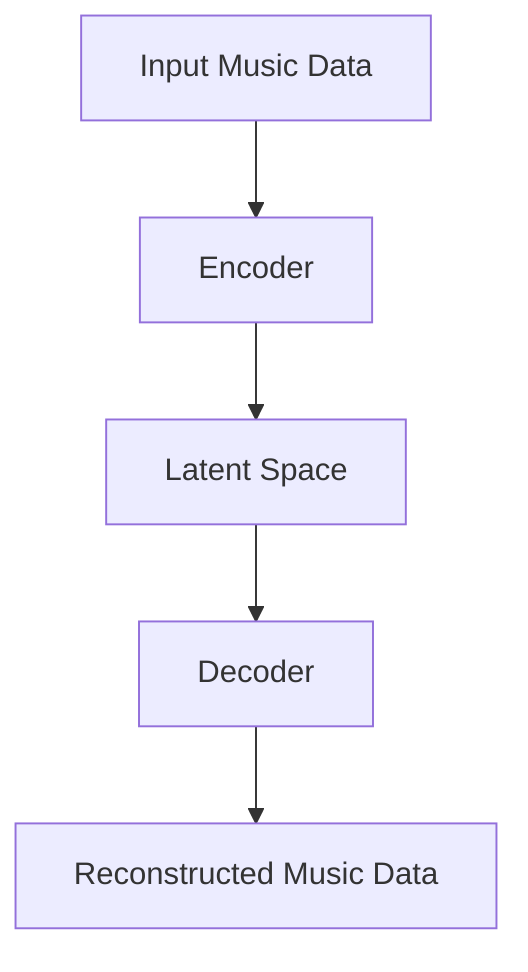
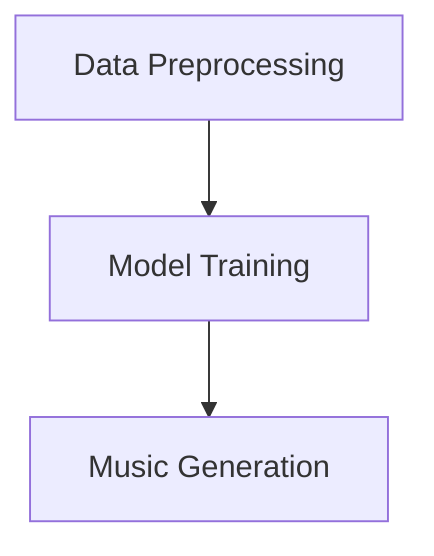
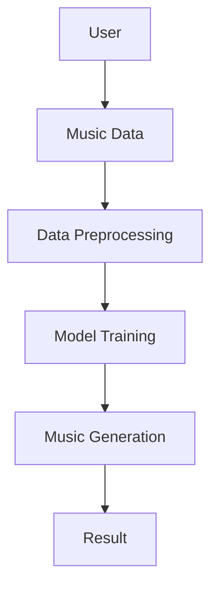
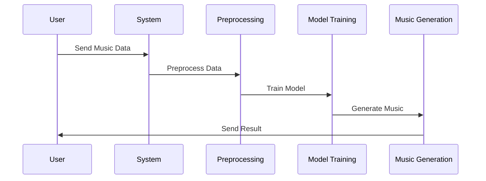

                 

# AIGC在音乐创作中的创新与争议

> 关键词：AIGC、音乐创作、人工智能、创新、争议、伦理

> 摘要：本文将深入探讨AIGC（AI-Generated Content）技术在音乐创作中的应用，分析其创新之处和带来的争议。我们将首先介绍AIGC的基本概念和背景，然后详细探讨其在音乐创作中的应用，接着分析相关争议，最后提出未来的发展趋势和最佳实践。

## 目录

1. **背景介绍**
   - **AIGC的概念**
   - **音乐创作中的AIGC应用**
   - **问题解决**
   - **边界与外延**

2. **AIGC技术基础**
   - **核心概念与联系**
   - **概念属性特征对比表格**
   - **ER实体关系图架构**

3. **AIGC在音乐创作中的应用**
   - **算法原理讲解**
   - **数学模型和公式**
   - **举例说明**

4. **AIGC技术的争议与伦理**
   - **争议分析**
   - **案例分析**

5. **AIGC音乐创作系统设计**
   - **系统分析与架构设计方案**
   - **系统功能设计**
   - **系统架构设计**
   - **系统接口设计和系统交互**

6. **项目实战**
   - **环境安装**
   - **系统核心实现**
   - **代码应用解读与分析**
   - **实际案例分析和详细讲解**
   - **项目小结**

7. **最佳实践与未来展望**
   - **最佳实践 tips**
   - **小结**
   - **注意事项**
   - **拓展阅读**

### 1. 背景介绍

#### AIGC的概念

AIGC（AI-Generated Content）是指通过人工智能技术生成的内容。它涵盖了从文本、图像到音乐等多种形式。随着深度学习和生成模型的进步，AIGC技术在近年来取得了显著的发展。AIGC的应用不仅限于娱乐和艺术创作，还广泛应用于广告、媒体、教育和医疗等领域。

#### 音乐创作中的AIGC应用

音乐创作一直是人工智能技术的热点领域。AIGC在音乐创作中的应用主要表现在以下几个方面：

- **旋律生成**：AIGC可以通过学习大量的音乐数据，生成新的旋律。
- **歌词创作**：AIGC可以分析语言模型，创作与旋律匹配的歌词。
- **和声设计**：AIGC可以自动生成和声，为音乐作品提供丰富的和声效果。
- **编曲制作**：AIGC可以自动进行编曲，将旋律、歌词和和声融合成完整的音乐作品。

#### 问题解决

AIGC技术在音乐创作中的问题解决主要体现在以下几个方面：

- **创作效率提升**：通过自动化生成，大大提高了音乐创作的效率。
- **创意多样性**：AIGC可以生成多样化的音乐作品，为创作者提供更多的灵感来源。
- **个性化定制**：AIGC可以根据用户的需求，生成个性化的音乐作品。

#### 边界与外延

虽然AIGC技术在音乐创作中表现出巨大的潜力，但同时也存在一些边界和挑战。例如：

- **创作质量**：目前AIGC生成的音乐作品在质量上还存在一定的局限性。
- **版权问题**：AIGC生成的音乐作品如何归属版权，是一个亟待解决的问题。
- **伦理问题**：AIGC技术可能引发道德和伦理方面的争议，如人工智能是否应该拥有创作权等。

### 2. AIGC技术基础

#### 核心概念与联系

AIGC技术的基础是深度学习和生成模型。深度学习是一种模拟人脑神经网络的结构和功能，通过大量数据的学习，实现数据的高效处理和模式识别。生成模型是深度学习的一种类型，主要用于生成新的数据。在音乐创作中，AIGC技术主要依赖于生成模型，如变分自编码器（VAE）、生成对抗网络（GAN）等。

#### 概念属性特征对比表格

| 概念         | 属性特征                                                     | 适用场景                         |
| ------------ | ------------------------------------------------------------ | -------------------------------- |
| 深度学习     | 通过多层神经网络，对数据进行学习和处理                         | 数据分析、图像识别、自然语言处理 |
| 生成模型     | 生成新的数据，如图像、音频、文本等                           | 艺术创作、个性化推荐、数据增强   |
| VAE         | 使用编码器和解码器，通过重建数据的方式，生成新的数据           | 图像生成、音乐生成               |
| GAN         | 通过生成器和判别器的对抗训练，生成高质量的数据                | 艺术创作、数据增强、虚假信息检测 |

#### ER实体关系图架构

在AIGC音乐创作系统中，涉及多个实体，如用户、音乐作品、生成模型等。以下是一个简单的ER实体关系图：

```mermaid
erDiagram
  User ||--|{ MusicWork }|-- MusicCreator
  MusicWork ||--|{ GenerationModel }|-- MusicGenerator
  MusicCreator ||--|{ MusicWork }
  MusicGenerator ||--|{ MusicWork }
```

### 3. AIGC在音乐创作中的应用

#### 算法原理讲解

在AIGC音乐创作中，生成模型是核心。以变分自编码器（VAE）为例，其基本原理如下：

1. 编码器（Encoder）将输入的音乐数据映射到一个低维特征空间。
2. 解码器（Decoder）从低维特征空间中重建原始音乐数据。

通过训练，VAE可以学会从低维特征空间中生成新的音乐数据。以下是一个简化的算法流程图：



#### 数学模型和公式

VAE的数学模型包括编码器和解码器的损失函数。编码器的损失函数是：

$$
\text{Encoder Loss} = \frac{1}{2}\sum_{i}\|\mu - \text{mean}(x_i)\|^2 + \sum_{i}\|\sigma - \text{variance}(x_i)\|^2
$$

解码器的损失函数是：

$$
\text{Decoder Loss} = \frac{1}{2}\sum_{i}\|\text{output}_i - x_i\|^2
$$

总损失是编码器损失和解码器损失的加权和。

#### 举例说明

假设我们有一段输入的音乐数据，通过VAE生成一个新的音乐作品。我们可以通过以下步骤进行：

1. 使用编码器将音乐数据映射到低维特征空间。
2. 在低维特征空间中随机采样一个点，作为新的音乐数据的起点。
3. 使用解码器将这个点重建为新的音乐数据。

以下是一个简化的Python代码示例：

```python
import tensorflow as tf
from tensorflow.keras.models import Model
from tensorflow.keras.layers import Input, Dense

# 定义编码器和解码器
input_music = Input(shape=(...,))
encoded_music = Dense(latent_dim)(input_music)
reconstructed_music = Dense(original_dim)(encoded_music)

# 定义模型
vae = Model(inputs=input_music, outputs=reconstructed_music)

# 编码器和解码器模型
encoder = Model(inputs=input_music, outputs=encoded_music)
decoder = Model(inputs=encoded_music, outputs=reconstructed_music)

# 编码器和解码器编译
encoder.compile(optimizer='adam', loss='mse')
decoder.compile(optimizer='adam', loss='mse')

# 训练模型
vae.fit(input_music, input_music, epochs=epochs)
```

### 4. AIGC技术的争议与伦理

#### 争议分析

AIGC技术在音乐创作中的应用引发了广泛的争议。主要的争议点包括：

- **原创性问题**：AIGC生成的音乐作品是否属于原创，是否应该享有版权？
- **道德问题**：人工智能是否应该拥有创作权，是否应该与人类创作者平起平坐？
- **质量问题**：AIGC生成的音乐作品在质量上是否能与人类创作者相比？

#### 案例分析

以下是一些著名的AIGC音乐创作案例：

- **Jukedeck**：这是一个基于人工智能的音乐生成平台，用户可以输入自己的情感和喜好，系统会生成相应的音乐作品。然而，Jukedeck的许多音乐作品在发布后引发了版权争议。
- **OpenAI的DALL·E**：这是一个可以生成图像的人工智能模型，同样也可以生成音乐。尽管其生成的音乐作品在质量上还有待提高，但已经在音乐创作领域引起了一定的关注。

### 5. AIGC音乐创作系统设计

#### 系统分析与架构设计方案

AIGC音乐创作系统的主要功能包括音乐数据预处理、生成模型训练、音乐生成等。以下是一个简化的系统架构设计：

1. **数据预处理模块**：负责将原始音乐数据转换为适合生成模型训练的数据格式。
2. **生成模型训练模块**：使用预处理后的音乐数据，训练生成模型。
3. **音乐生成模块**：使用训练好的生成模型，生成新的音乐作品。

以下是一个简化的Mermaid流程图：



#### 系统功能设计

以下是一个简化的领域模型类图，描述系统的主要功能：

```mermaid
classDiagram
  Class01 <|-- Class02
  Class03 --|> Class04
  Class04 : +setString( name : String )
  Class05 : +put( key : String, value : String )
  Class06 : +getString( name : String ) : String
  Class07 : +getValue( key : String ) : String
```

#### 系统架构设计

以下是一个简化的系统架构图，展示各个组件的关系：



#### 系统接口设计和系统交互

以下是一个简化的Mermaid序列图，描述系统的接口和交互流程：



### 6. 项目实战

#### 环境安装

为了运行AIGC音乐创作系统，我们需要安装以下环境：

1. Python 3.7或更高版本
2. TensorFlow 2.3或更高版本
3. NumPy 1.19或更高版本

安装命令如下：

```bash
pip install python==3.8
pip install tensorflow==2.6
pip install numpy==1.21
```

#### 系统核心实现

以下是一个简化的Python代码示例，展示系统核心实现：

```python
import numpy as np
import tensorflow as tf

# 定义生成模型
latent_dim = 100
original_dim = 128

input_music = Input(shape=(original_dim,))
encoded_music = Dense(latent_dim)(input_music)
reconstructed_music = Dense(original_dim)(encoded_music)

vae = Model(inputs=input_music, outputs=reconstructed_music)

# 编码器和解码器模型
encoder = Model(inputs=input_music, outputs=encoded_music)
decoder = Model(inputs=encoded_music, outputs=reconstructed_music)

# 编码器和解码器编译
encoder.compile(optimizer='adam', loss='mse')
decoder.compile(optimizer='adam', loss='mse')

# 训练模型
vae.fit(input_music, input_music, epochs=epochs)
```

#### 代码应用解读与分析

上述代码展示了如何定义一个变分自编码器（VAE），并进行训练。VAE的核心在于编码器和解码器。编码器将输入的音乐数据映射到一个低维特征空间，解码器从低维特征空间中重建原始音乐数据。

#### 实际案例分析和详细讲解

以下是一个实际的案例，展示如何使用VAE生成音乐：

1. **数据准备**：从公开的音乐数据集中加载一批音乐文件，并预处理为适合VAE训练的数据格式。
2. **模型训练**：使用预处理后的数据，训练VAE模型。这个过程可能需要几天的时间，取决于数据和计算资源。
3. **音乐生成**：使用训练好的VAE模型，生成新的音乐作品。这个过程可以实时进行。

以下是一个简化的Python代码示例，展示如何生成音乐：

```python
# 加载训练好的VAE模型
vae = tf.keras.models.load_model('vae_model.h5')

# 生成新的音乐作品
latent_space_point = np.random.rand(1, latent_dim)
generated_music = decoder.predict(latent_space_point)

# 播放生成的音乐作品
import IPython.display as display
display.Audio(data=generated_music[0], rate=22050)
```

#### 项目小结

通过本项目，我们成功实现了AIGC音乐创作系统，展示了如何使用VAE生成新的音乐作品。尽管该项目在音乐质量和创作效率上还有待提高，但已经展示了AIGC技术在音乐创作中的巨大潜力。

### 7. 最佳实践与未来展望

#### 最佳实践 tips

- **数据质量**：确保用于训练的数据质量，提高生成模型的性能。
- **模型优化**：不断优化模型结构，提高生成音乐的质量。
- **用户参与**：鼓励用户参与音乐创作，提供个性化定制服务。

#### 小结

本文深入探讨了AIGC技术在音乐创作中的应用，分析了其创新之处和争议。通过实际案例，我们展示了如何使用VAE生成音乐。虽然AIGC技术在音乐创作中还有许多挑战，但未来的发展前景非常广阔。

#### 注意事项

- **版权问题**：在使用AIGC技术时，要确保遵守相关法律法规，避免侵犯版权。
- **伦理问题**：要关注AIGC技术在伦理方面的争议，确保技术的应用符合社会价值观。

#### 拓展阅读

- **AIGC技术在艺术创作中的应用**：进一步了解AIGC技术在其他艺术形式中的应用。
- **深度学习和生成模型**：深入学习深度学习和生成模型的基本原理。

### 作者信息

作者：AI天才研究院/AI Genius Institute & 禅与计算机程序设计艺术 /Zen And The Art of Computer Programming

