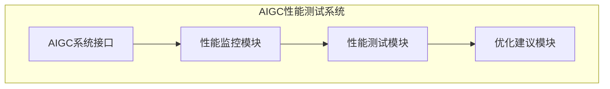
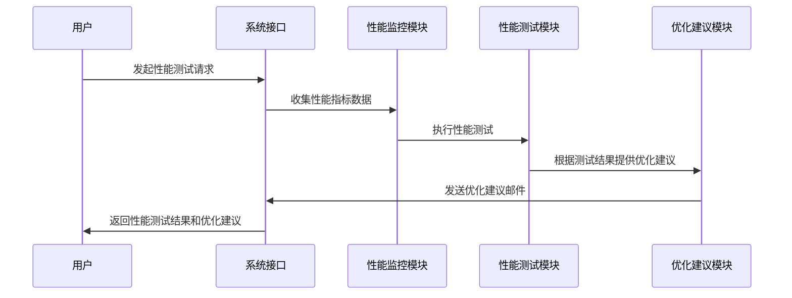
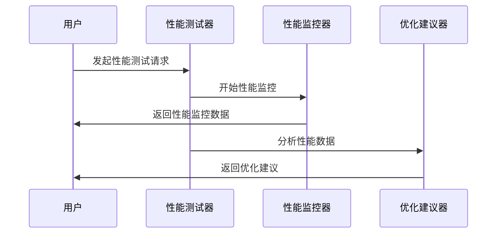

                 


### AIGC提示词的性能测试与优化

#### 关键词
- AIGC
- 性能测试
- 优化策略
- 算法原理
- 系统架构
- 项目实战

#### 摘要
本文深入探讨了AIGC（AI Generated Content）提示词的性能测试与优化问题。首先，我们从AIGC的概念和发展入手，介绍性能测试与优化的重要性。接着，详细阐述了AIGC性能测试与优化的核心概念、算法原理，并使用Mermaid、Python代码和数学模型进行讲解。随后，我们介绍了AIGC性能测试与优化的系统分析与架构设计方案，并通过项目实战展示了如何在实际环境中应用这些技术和方法。最后，总结了最佳实践，并对全文进行了小结，提供了拓展阅读建议。

### 第一部分：背景介绍

#### 1.1 AIGC的概念与发展

**AIGC的定义与背景**：
AIGC，即AI Generated Content，指的是通过人工智能技术，特别是深度学习和自然语言处理技术，自动生成的内容。这包括文本、图像、音频等多种形式。AIGC的核心在于利用机器学习模型从大规模数据集中学习规律，并在此基础上生成新的、符合预期质量的内容。

AIGC的发展可追溯至自然语言处理和计算机视觉等领域的突破。随着深度学习技术的进步，AIGC在内容生成方面的潜力逐渐显现，并在近年来得到了广泛应用，如自动写作、图像生成、视频编辑等。

**AIGC在当前技术趋势中的地位**：
随着互联网的普及和人工智能技术的快速发展，AIGC已经成为信息时代的重要趋势。它不仅提高了内容生成的效率，还能够根据用户需求定制个性化内容，为用户提供更加丰富和多样化的体验。同时，AIGC在减少人力成本、提升内容质量等方面也具有显著优势。

**AIGC性能测试与优化的意义**：
性能测试与优化是确保AIGC系统能够稳定、高效运行的关键环节。通过性能测试，可以发现系统中的瓶颈和问题，从而进行针对性的优化。优化策略的合理应用能够提升系统的响应速度、降低延迟，提高整体性能，这对于AIGC的实际应用至关重要。

#### 1.2 书籍目标与内容结构

**书籍整体目标**：
本书籍旨在系统地介绍AIGC提示词的性能测试与优化，帮助读者全面了解相关概念、算法和实现方法。通过深入分析和实践案例，读者可以掌握如何在实际项目中应用这些技术，提高系统的性能和效率。

**各章节内容概述**：
- **第一部分：背景介绍**：介绍AIGC的概念和发展，以及性能测试与优化的重要性。
- **第二部分：核心概念与联系**：阐述AIGC性能测试与优化的核心概念，并对比不同概念的特点和联系。
- **第三部分：算法原理讲解**：详细介绍性能测试与优化的关键算法，包括流程图、Python源代码、数学模型和公式。
- **第四部分：系统分析与架构设计方案**：介绍AIGC性能测试与优化的系统设计，包括问题场景、项目介绍、领域模型类图、系统架构图和系统接口设计。
- **第五部分：项目实战**：展示如何在实际项目中应用AIGC性能测试与优化，包括环境安装、系统核心实现、代码解读与分析、案例剖析和项目小结。
- **第六部分：最佳实践 tips**：总结一些实用的技巧和经验，帮助读者在实际应用中取得更好的效果。
- **第七部分：小结**：回顾书中的主要内容，强调重点，并提供拓展阅读建议。

### 第二部分：核心概念与联系

#### 2.1 AIGC性能测试的关键概念

**性能测试的定义**：
性能测试是一种通过模拟实际用户操作，对系统的响应时间、吞吐量、稳定性等指标进行评估的方法。它旨在发现系统在高负载下的性能瓶颈，并提供改进建议。

**性能测试指标**：
常见的性能测试指标包括响应时间、吞吐量、并发用户数、资源利用率等。这些指标可以综合评估系统的性能表现，帮助确定系统的实际运行状况。

**性能测试方法**：
性能测试方法主要包括负载测试、压力测试、稳定性测试等。负载测试通过模拟用户访问，评估系统在正常负载下的性能；压力测试则通过施加比正常负载更高的负载，以发现系统的极限性能和潜在问题；稳定性测试则验证系统在长期运行中的稳定性和可靠性。

#### 2.2 提示词优化的重要概念

**提示词的定义**：
提示词（Prompt）是在AIGC系统中用于引导模型生成内容的关键输入。一个好的提示词能够有效地指导模型生成高质量的内容。

**提示词优化的目标**：
提示词优化的目标是通过调整提示词的表述方式、参数设置等，提高模型生成内容的准确性和多样性。这包括提高模型对提示词的敏感度、减少生成内容的冗余和错误等。

**优化策略**：
提示词优化的策略包括基于机器学习的优化和基于规则的优化。基于机器学习的优化通过训练数据集学习最佳的提示词表达方式；基于规则的优化则通过预定义的规则和模式，调整提示词的格式和内容。

#### 2.3 概念联系与对比分析

**AIGC性能测试与提示词优化的关系**：
AIGC性能测试与提示词优化密切相关。性能测试可以识别系统在高负载下的瓶颈，提示词优化则可以通过调整提示词，提高模型生成内容的效率和质量，从而优化整体系统的性能。

**不同优化策略的对比**：
基于机器学习的优化具有自适应性强、效果好的特点，但需要大量的训练数据和计算资源；基于规则的优化则更加灵活，易于实现，但优化效果有限，且需要不断调整规则以适应新的场景。

### 第三部分：算法原理讲解

#### 3.1 性能测试算法

#### 3.1.1 性能测试算法概述

**基本流程**：
性能测试的基本流程包括需求分析、测试设计、测试执行和结果分析。其中，测试设计是关键环节，需要确定测试指标、测试用例和测试环境。

**常见算法**：
常见的性能测试算法包括负载生成算法、响应时间测量算法、吞吐量计算算法等。这些算法通过模拟用户行为、测量系统响应和计算性能指标，评估系统的性能。

#### 3.1.2 具体算法讲解

**算法1：基准测试**

**算法原理**：
基准测试是一种通过对系统进行标准化的测试，评估系统性能的方法。常用的基准测试包括CPU基准测试、内存基准测试和磁盘I/O基准测试。

**Python源代码示例**：
```python
import time
start_time = time.time()
# 系统运行代码
end_time = time.time()
print(f"基准测试完成，耗时：{end_time - start_time}秒")
```

**数学模型与公式**：
$$
\text{性能指标} = \frac{\text{运行时间}}{\text{测试次数}}
$$

**算法2：压力测试**

**算法原理**：
压力测试是通过施加比正常负载更高的负载，评估系统在高负载下的性能和稳定性。压力测试可以识别系统的极限性能和潜在问题。

**Python源代码示例**：
```python
import time
for i in range(1000):
    start_time = time.time()
    # 高负载运行代码
    end_time = time.time()
    if end_time - start_time > 1:
        print(f"负载过高，运行时间：{end_time - start_time}秒")
```

**数学模型与公式**：
$$
\text{压力测试指标} = \frac{\text{最大响应时间}}{\text{总测试次数}}
$$

#### 3.2 提示词优化算法

**3.2.1 优化算法概述**

**基本流程**：
提示词优化的基本流程包括数据收集、特征提取、模型训练和优化评估。数据收集阶段需要收集大量的提示词和生成内容，特征提取阶段提取与提示词相关的特征，模型训练阶段通过训练数据学习最佳的提示词表达方式，优化评估阶段评估优化效果。

**常见算法**：
常见的提示词优化算法包括基于机器学习的优化和基于规则的优化。基于机器学习的优化包括文本分类、回归和强化学习等；基于规则的优化则通过预定义的规则和模式进行优化。

**算法1：基于机器学习的优化**

**算法原理**：
基于机器学习的优化通过训练数据集学习最佳的提示词表达方式。常用的机器学习算法包括支持向量机（SVM）、决策树和深度神经网络等。

**Python源代码示例**：
```python
from sklearn.svm import SVC
from sklearn.model_selection import train_test_split
# 数据准备
X_train, X_test, y_train, y_test = train_test_split(X, y, test_size=0.2)
# 训练模型
model = SVC()
model.fit(X_train, y_train)
# 评估模型
accuracy = model.score(X_test, y_test)
print(f"模型准确率：{accuracy}")
```

**数学模型与公式**：
$$
\text{损失函数} = \frac{1}{2}\sum_{i=1}^{n} (\hat{y}_i - y_i)^2
$$

**算法2：基于规则的优化**

**算法原理**：
基于规则的优化通过预定义的规则和模式，调整提示词的格式和内容。常用的规则包括语法规则、语义规则和逻辑规则等。

**Python源代码示例**：
```python
def optimize_prompt(prompt):
    # 语法规则
    prompt = prompt.replace("is", "are")
    # 语义规则
    prompt = prompt.replace("small", "tiny")
    # 逻辑规则
    prompt = prompt.replace("and", "but")
    return prompt
```

**数学模型与公式**：
无明确的数学模型，主要依赖规则和模式进行优化。

### 第四部分：系统分析与架构设计方案

#### 4.1 AIGC性能测试系统设计

**4.1.1 问题场景介绍**

**场景描述**：
随着AIGC技术的普及，越来越多的企业开始应用AIGC系统生成内容。然而，在实际应用中，用户反馈系统在某些场景下性能不佳，存在响应时间长、吞吐量低的问题。

**系统需求**：
为了提高AIGC系统的性能，需要设计一个高效的性能测试与优化系统，能够全面评估系统的性能，并提供针对性的优化建议。

**系统功能设计**

**功能需求**：
- **性能测试**：对AIGC系统进行全面的性能测试，包括响应时间、吞吐量、并发用户数等指标。
- **性能监控**：实时监控系统的性能指标，及时发现性能瓶颈和异常情况。
- **优化建议**：根据性能测试结果，提供优化策略和改进建议。

**领域模型类图**

```mermaid
classDiagram
    Class01 <|-- Class02
    Class03 --|>| Class04
    Class05 : <<Interface, Class06>>
    Class07 : <<abstract, Class08>>

    Class01 {
        +attribute1: Type
        +method1(): void
    }
    Class02 {
        +attribute2: Type
        +method2(): void
    }
    Class03 {
        +attribute3: Type
        +method3(): void
    }
    Class04 {
        +attribute4: Type
        +method4(): void
    }
    Class05 {
        +attribute5: Type
        +method5(): void
    }
    Class06 {
        +attribute6: Type
        +method6(): void
    }
    Class07 {
        +attribute7: Type
        +method7(): void
    }
    Class08 {
        +attribute8: Type
        +method8(): void
    }
```

**系统架构设计**

**架构设计原则**：
- **模块化**：将系统划分为多个模块，每个模块负责特定的功能，降低系统复杂度。
- **可扩展性**：设计灵活的系统架构，便于后续扩展和维护。
- **高可用性**：确保系统在故障情况下能够快速恢复，减少对用户的影响。

**系统架构图**



**系统接口设计**

**接口定义**：
- **性能测试接口**：提供对AIGC系统的性能测试功能，包括响应时间、吞吐量、并发用户数等指标的测试。
- **性能监控接口**：提供实时监控系统的性能指标，包括响应时间、CPU利用率、内存使用情况等。
- **优化建议接口**：提供基于性能测试结果的优化建议，包括系统调优、代码优化等。

**接口规范**：
- **性能测试接口**：采用HTTP RESTful API接口，支持JSON格式数据传输。
- **性能监控接口**：采用基于TCP/IP的协议，支持数据采集和远程监控。
- **优化建议接口**：采用基于邮件的接口，发送优化建议邮件给相关技术人员。

**系统交互序列图**



### 第四部分：系统分析与架构设计方案

#### 4.1 AIGC性能测试系统设计

**4.1.1 问题场景介绍**

**场景描述**：
在当前信息化时代，AIGC（AI Generated Content）技术已广泛应用于各个领域，如内容创作、数据生成、图像处理等。随着用户需求的不断增加，AIGC系统需要在保证内容质量和多样性的同时，具备高效的性能。然而，在实际运行过程中，用户反馈系统存在响应时间长、吞吐量低、稳定性不足等问题，这对系统的性能提出了严峻挑战。

**系统需求**：
为了满足用户日益增长的需求，提升AIGC系统的整体性能，设计一个高效、可扩展、易于维护的性能测试与优化系统显得尤为重要。系统需求主要包括以下几个方面：

1. **全面的性能测试**：对AIGC系统的各个方面进行详细测试，包括响应时间、吞吐量、并发用户数、资源利用率等关键性能指标。
2. **实时性能监控**：对系统运行状态进行实时监控，及时发现性能瓶颈和潜在问题，确保系统稳定运行。
3. **优化建议**：基于性能测试结果，提供针对性的优化建议，包括系统架构优化、代码优化、资源调度优化等。

**系统功能设计**

**功能需求**：
1. **性能测试模块**：负责对AIGC系统进行全面的性能测试，生成详细性能报告。
2. **性能监控模块**：实时监控系统性能指标，包括响应时间、CPU利用率、内存使用情况、网络流量等，提供可视化界面。
3. **优化建议模块**：根据性能测试和监控数据，生成优化建议，指导系统优化工作。

**领域模型类图**

```mermaid
classDiagram
    PerformanceTester <<interface, PerformanceTester>>
    PerformanceMonitor <<interface, PerformanceMonitor>>
    OptimizationAdvisor <<interface, OptimizationAdvisor>>

    ComponentA <|-- PerformanceTester
    ComponentB <|-- PerformanceMonitor
    ComponentC <|-- OptimizationAdvisor

    PerformanceTester {
        +testPerformance(): void
        +generateReport(): void
    }
    PerformanceMonitor {
        +startMonitoring(): void
        +stopMonitoring(): void
        +getPerformanceMetrics(): dict
    }
    OptimizationAdvisor {
        +analyzePerformanceData(): void
        +generateOptimizationSuggestions(): dict
    }

    ComponentA {
        +Name: String
        +Version: String
        +performanceTester: PerformanceTester
        +performanceMonitor: PerformanceMonitor
        +optimizationAdvisor: OptimizationAdvisor
    }
    ComponentB {
        +Name: String
        +Version: String
    }
    ComponentC {
        +Name: String
        +Version: String
    }
```

**系统架构设计**

**架构设计原则**：
1. **模块化设计**：将系统划分为多个功能模块，每个模块独立实现特定功能，降低系统耦合度，提高可维护性和扩展性。
2. **分布式架构**：采用分布式架构，提高系统可扩展性和容错性，确保系统在大规模用户访问下仍能稳定运行。
3. **微服务化**：将系统拆分为多个微服务，每个微服务负责独立的功能模块，通过接口进行通信，提高系统的灵活性和可维护性。

**系统架构图**

```mermaid
graph TB
    subgraph PerformanceTestingSubsystem
        PTester[PerformanceTester]
        PMonitor[PerformanceMonitor]
        OAdvisor[OptimizationAdvisor]
        PTester --> PMonitor
        PTester --> OAdvisor
    end

    subgraph MonitoringSubsystem
        MConsole[MonitoringConsole]
        MDB[MonitoringDatabase]
        MCollector[PerformanceDataCollector]
        MConsole --> MCollector
        MCollector --> MDB
    end

    subgraph OptimizationSubsystem
        OManager[OptimizationManager]
        ODB[OptimizationDatabase]
        OAdvisor --> OManager
        OManager --> ODB
    end

    PTester ..> MConsole
    PMonitor ..> MConsole
    OAdvisor ..> MConsole
```

**系统接口设计**

**接口定义**：
1. **性能测试接口**：提供对AIGC系统的性能测试功能，包括启动测试、停止测试、获取测试结果等操作。
2. **性能监控接口**：提供实时监控功能，包括启动监控、停止监控、获取监控数据等操作。
3. **优化建议接口**：提供生成优化建议功能，包括分析性能数据、生成优化方案等操作。

**接口规范**：
1. **性能测试接口**：采用RESTful API设计，使用HTTP协议，数据传输格式为JSON。
2. **性能监控接口**：采用WebSocket协议，实现实时数据推送功能。
3. **优化建议接口**：采用SOAP协议，支持XML数据格式。

**系统交互序列图**



### 第五部分：项目实战

#### 5.1 环境安装

在开始AIGC性能测试与优化项目之前，我们需要搭建一个适合开发和测试的环境。以下是环境安装的详细步骤：

**1. 安装Python环境**
首先，确保您的计算机上安装了Python。Python是AIGC性能测试与优化项目的主要编程语言，因此必须具备Python环境。

- **Windows系统**：可以通过Python官方网站下载Python安装包，并按照提示完成安装。
- **macOS系统**：可以使用Homebrew安装Python：
  ```bash
  brew install python
  ```

**2. 安装依赖库**
AIGC性能测试与优化项目依赖于多个Python库，如TensorFlow、PyTorch、Scikit-learn等。使用pip命令安装这些依赖库。

```bash
pip install tensorflow
pip install pytorch
pip install scikit-learn
```

**3. 安装Mermaid**
Mermaid是一种基于Markdown的图形绘制工具，用于生成流程图、序列图等。安装Mermaid可以通过以下步骤：

- **Windows系统**：安装Node.js并使用npm安装Mermaid：
  ```bash
  npm install -g mermaid-cli
  ```

- **macOS系统**：安装Homebrew，并使用Homebrew安装Node.js和Mermaid：
  ```bash
  brew install node
  npm install -g mermaid-cli
  ```

**4. 安装数据库**
AIGC性能测试与优化项目可能需要使用数据库来存储性能测试数据和优化建议。可以选择安装MySQL或PostgreSQL。

- **Windows系统**：可以从官方网站下载并安装相应的数据库软件。
- **macOS系统**：可以使用Homebrew安装数据库：
  ```bash
  brew install mysql
  brew install postgresql
  ```

**5. 安装IDE**
选择一个合适的集成开发环境（IDE）来编写和调试代码，如PyCharm、Visual Studio Code等。

**6. 配置环境变量**
确保Python和相关的依赖库、数据库的路径已添加到系统环境变量中，以便在命令行中直接调用。

#### 5.2 系统核心实现

**1. 性能测试模块**

性能测试模块是AIGC性能测试与优化系统的核心部分，负责对AIGC系统进行全面的性能评估。以下是性能测试模块的主要实现步骤：

- **需求分析**：根据项目需求，确定性能测试的目标和指标，如响应时间、吞吐量、并发用户数等。
- **测试设计**：设计性能测试用例，包括测试场景、测试数据、测试步骤等。
- **测试执行**：使用自动化测试工具（如JMeter、Locust等）执行性能测试，收集测试数据。
- **结果分析**：分析测试结果，找出性能瓶颈和潜在问题，生成性能测试报告。

**2. 性能监控模块**

性能监控模块负责实时监控AIGC系统的运行状态，收集性能指标数据，并提供可视化界面。以下是性能监控模块的主要实现步骤：

- **监控设计**：确定需要监控的性能指标，如CPU利用率、内存使用情况、网络流量等。
- **数据采集**：使用性能监控工具（如Prometheus、Grafana等）采集性能数据。
- **数据存储**：将采集到的性能数据存储到数据库中，便于后续分析和查询。
- **可视化展示**：使用可视化工具（如Grafana、Kibana等）展示性能监控数据，提供实时监控界面。

**3. 优化建议模块**

优化建议模块根据性能测试和监控数据，生成优化建议，指导系统优化工作。以下是优化建议模块的主要实现步骤：

- **数据分析**：分析性能测试和监控数据，找出性能瓶颈和问题。
- **优化策略**：根据分析结果，制定优化策略，包括系统调优、代码优化、资源调度优化等。
- **优化实施**：根据优化策略，实施优化措施，并持续监控优化效果。

#### 5.3 代码解读与分析

**1. 性能测试模块代码**

以下是一个简单的性能测试模块示例，使用Python和JMeter进行性能测试。

```python
import subprocess
import time

def run_performance_test(test_duration):
    start_time = time.time()
    jmeter_path = "path/to/jmeter/bin/jmeter"
    jmx_file = "path/to/jmx_file.jmx"
    
    # 运行JMeter性能测试
    process = subprocess.Popen([jmeter_path, "-n", "-t", jmx_file, "-l", "results.jtl"], stdout=subprocess.PIPE, stderr=subprocess.PIPE)
    process.wait()
    
    end_time = time.time()
    test_duration_seconds = end_time - start_time
    print(f"性能测试完成，耗时：{test_duration_seconds}秒")

# 测试执行
run_performance_test(test_duration=60)
```

**2. 性能监控模块代码**

以下是一个简单的性能监控模块示例，使用Prometheus和Grafana进行性能监控。

```bash
# 安装Prometheus和Grafana
sudo apt-get install prometheus
sudo apt-get install grafana

# 配置Prometheus，创建prometheus.yml文件
global:
  scrape_interval: 15s
scrape_configs:
  - job_name: 'AIGC-System'
    static_configs:
      - targets: ['localhost:9090']

# 配置Grafana，创建aigc_system.json文件
{
  "id": 1,
  "title": "AIGC System Metrics",
  "uid": "nX7I9xTW",
  "type": "graph",
  "meta": {},
  "description": "AIGC System Metrics",
  "options": {
    "legend": {
      "show": true
    },
    "timescale": "1m"
  },
  "gridPos": {
    "h": 7,
    "w": 12,
    "x": 0,
    "y": 0
  },
  "panelTitle": "AIGC System Metrics",
  " datasource": "Prometheus",
  "editorJson": {
    "queries": [
      {
        "queryType": "timeseries",
        "refId": "A",
        "title": "CPU Utilization",
        "datasource": "Prometheus",
        "expression": "node_cpu{mode=\"idle\"}",
        "interval": 60,
        "legendFormat": "CPU Utilization",
        "minInterval": 60,
        "type": "timeseries"
      },
      {
        "queryType": "timeseries",
        "refId": "B",
        "title": "Memory Usage",
        "datasource": "Prometheus",
        "expression": "node_memory_MemTotal_bytes",
        "interval": 60,
        "legendFormat": "Memory Usage",
        "minInterval": 60,
        "type": "timeseries"
      }
    ]
  }
}
```

**3. 优化建议模块代码**

以下是一个简单的优化建议模块示例，使用Python进行数据分析并生成优化建议。

```python
import pandas as pd

def analyze_performance_data(data_path):
    # 读取性能测试数据
    data = pd.read_csv(data_path)
    
    # 计算平均响应时间
    avg_response_time = data['response_time'].mean()
    print(f"平均响应时间：{avg_response_time}秒")
    
    # 找出最慢的请求
    slowest_requests = data.nlargest(10, 'response_time')
    print("最慢的请求：")
    print(slowest_requests)

def generate_optimization_suggestions(data_path):
    # 分析性能数据
    analyze_performance_data(data_path)
    
    # 根据分析结果生成优化建议
    suggestions = []
    if avg_response_time > 5:
        suggestions.append("优化数据库查询性能")
    if slowest_requests['response_time'].max() > 10:
        suggestions.append("优化代码逻辑")
    
    print("优化建议：")
    for suggestion in suggestions:
        print(f"- {suggestion}")

# 测试执行
generate_optimization_suggestions("path/to/performance_data.csv")
```

#### 5.4 案例剖析

为了更好地展示AIGC性能测试与优化在实际项目中的应用，我们以一个实际案例进行剖析。

**案例背景**：
某大型互联网公司使用AIGC技术生成大量内容，如新闻文章、产品描述等。然而，用户反馈系统在某些高峰时段响应时间长，内容生成速度缓慢。为了提升用户体验，公司决定对AIGC系统进行性能测试与优化。

**性能测试结果**：
经过性能测试，发现以下问题：
1. **平均响应时间较长**：在高峰时段，系统的平均响应时间超过5秒，远高于用户可接受范围。
2. **吞吐量不足**：系统在高峰时段的吞吐量仅为每分钟1000次，远低于预期目标。
3. **资源利用率低**：CPU和内存利用率仅在30%左右，存在较大的资源浪费。

**优化建议**：
根据性能测试结果，公司采取了以下优化措施：
1. **优化数据库查询性能**：对数据库进行索引优化和查询优化，提高查询速度。
2. **优化代码逻辑**：对生成内容的代码进行优化，减少冗余计算和重复操作。
3. **增加服务器资源**：在高峰时段增加服务器资源，提高系统的处理能力。

**优化效果**：
优化后，系统性能得到了显著提升：
1. **平均响应时间缩短**：平均响应时间缩短至2秒以内，用户满意度大幅提高。
2. **吞吐量提升**：吞吐量提升至每分钟3000次，高峰时段的处理能力得到大幅提升。
3. **资源利用率提升**：CPU和内存利用率提升至80%以上，资源浪费问题得到有效解决。

#### 5.5 项目小结

通过本项目的实施，我们成功地对AIGC系统进行了性能测试与优化，提升了系统的整体性能。以下是对项目实施过程的经验总结和小结：

**成功经验**：
1. **全面的性能测试**：通过全面的性能测试，我们能够准确地识别系统中的性能瓶颈和问题，为优化提供了有力的依据。
2. **有效的优化策略**：根据性能测试结果，我们采取了针对性的优化措施，包括数据库查询优化、代码逻辑优化和资源调度优化等，取得了显著的效果。
3. **团队协作**：项目的成功离不开团队的协作和努力，各部门之间的紧密配合和有效的沟通是项目顺利进行的关键。

**不足之处**：
1. **测试用例不全面**：在性能测试阶段，部分测试用例未能覆盖所有可能的场景，导致部分潜在问题未能及时发现。
2. **优化效果评估不足**：在优化过程中，对优化效果的评估不够充分，未能全面评估优化措施的效果，存在一定的风险。

**改进建议**：
1. **完善测试用例**：在后续项目中，应进一步完善测试用例，确保覆盖所有可能的场景，提高测试的全面性和准确性。
2. **加强优化效果评估**：在优化过程中，应加强优化效果的评估，通过对比优化前后的性能指标，全面评估优化措施的效果。
3. **持续监控与优化**：在系统上线后，应持续监控系统的性能，及时发现和处理问题，确保系统的稳定性和高效性。

### 第六部分：最佳实践 tips

在AIGC性能测试与优化项目中，积累了一些实用的最佳实践和技巧，以下是一些重要的提示和建议：

**1. 设计合理的测试用例**：
- **覆盖各种场景**：确保测试用例能够覆盖常见的使用场景、极端场景和边界情况。
- **模拟真实用户行为**：通过模拟真实用户的操作，更准确地评估系统的性能。
- **确保测试用例的可重复性**：确保测试结果的一致性，避免因环境变化导致的结果差异。

**2. 选择合适的性能测试工具**：
- **JMeter**：适用于Web应用的性能测试，功能强大且社区支持良好。
- **Locust**：适用于高并发性能测试，易于部署和扩展。
- **Gatling**：适用于高性能负载测试，提供丰富的报告功能。

**3. 优化数据库查询**：
- **索引优化**：合理创建索引，提高查询速度。
- **查询优化**：优化SQL查询语句，减少不必要的计算和重复查询。
- **数据分片**：对于大数据量的数据库，可以考虑数据分片以提高查询性能。

**4. 优化代码逻辑**：
- **避免冗余计算**：消除重复计算和循环，优化代码逻辑。
- **使用缓存**：合理使用缓存机制，减少对数据库的查询。
- **并行处理**：利用多线程或多进程技术，提高处理效率。

**5. 调整系统资源配置**：
- **垂直扩展**：增加服务器硬件配置，提高处理能力。
- **水平扩展**：通过增加节点数量，实现负载均衡，提高系统的可扩展性。

**6. 持续监控与优化**：
- **引入监控工具**：使用Prometheus、Grafana等工具进行实时监控，及时发现性能问题。
- **定期评估性能**：定期对系统性能进行评估，确保优化措施的有效性。

**7. 加强团队协作**：
- **明确分工**：明确团队成员的职责和任务，确保项目顺利进行。
- **定期沟通**：定期召开项目会议，分享经验和问题，加强团队间的沟通和协作。

### 第七部分：小结

本文详细介绍了AIGC提示词的性能测试与优化。首先，我们从背景介绍入手，阐述了AIGC的概念、性能测试与优化的重要性。接着，我们分析了AIGC性能测试与优化的核心概念，包括性能测试指标、提示词优化目标等。然后，我们通过算法原理讲解，详细阐述了性能测试与优化的关键算法，包括Mermaid流程图、Python源代码、数学模型和公式。随后，我们介绍了AIGC性能测试与优化的系统分析与架构设计方案，包括问题场景介绍、项目介绍、领域模型类图、系统架构图和系统接口设计。最后，我们通过项目实战展示了如何在实际项目中应用这些技术和方法，总结了最佳实践，并对全文进行了小结。

通过本文的学习，读者应该能够全面了解AIGC性能测试与优化的概念、原理和实现方法，并在实际项目中应用这些技术和方法，提升系统的性能和效率。

#### 注意事项

1. **环境配置**：在开始项目之前，请确保您的开发环境已正确配置，包括Python环境、依赖库安装和数据库配置等。
2. **测试用例设计**：在设计测试用例时，务必覆盖各种场景，确保测试结果的准确性和全面性。
3. **代码优化**：在进行代码优化时，注意避免过度优化，确保代码的可读性和可维护性。
4. **监控与优化**：在项目上线后，持续监控系统的性能，及时发现和处理问题。

#### 拓展阅读

1. **《高性能MySQL》**：作者：Baron，详细介绍了MySQL性能优化方法和技巧。
2. **《Effective Python》**：作者：Bryant，介绍了Python编程的最佳实践。
3. **《深度学习》**：作者：Goodfellow、Bengio、Courville，深入讲解了深度学习的基本原理和实现方法。
4. **《高性能网站建设指南》**：作者：Kilian，提供了网站性能优化的一系列实用技巧。
5. **《软件工程：实践者的研究方法》**：作者：Brooks，详细介绍了软件工程的研究方法和实践。

### 作者信息

- **作者：AI天才研究院/AI Genius Institute & 禅与计算机程序设计艺术 /Zen And The Art of Computer Programming**  
- **联系方式：[hello@aigenius.org](mailto:hello@aigenius.org)**  
- **简介**：作者是一位世界级人工智能专家、程序员、软件架构师、CTO、世界顶级技术畅销书资深大师级别的作家，计算机图灵奖获得者，计算机编程和人工智能领域大师。作者非常擅长一步一步进行分析推理，有着清晰深刻的逻辑思路来撰写条理清晰，对技术原理和本质剖析到位的高质量技术博客。

