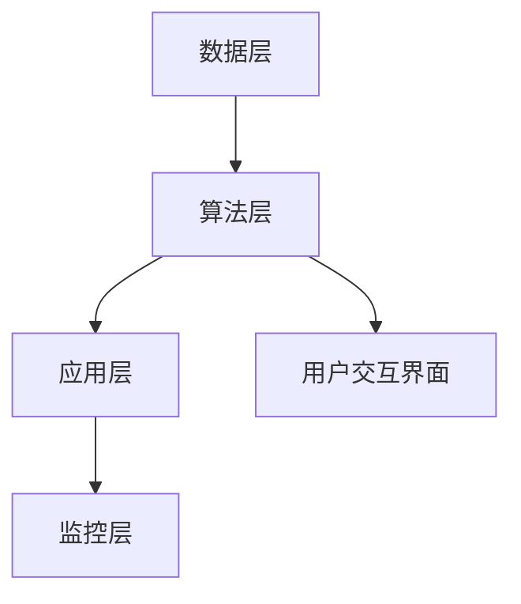
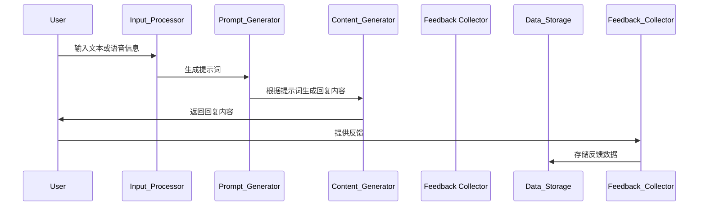

                 

# AIGC提示词的本地化与文化适应

> 关键词：AIGC、提示词、本地化、文化适应、算法原理、系统架构、项目实战

> 摘要：本文深入探讨了AIGC（自适应智能生成内容）中的提示词本地化与文化适应问题。首先，通过背景介绍和核心概念的分析，梳理了AIGC和提示词的定义与作用。接着，本文详细解析了AIGC算法原理，并从系统分析与架构设计角度，探讨了如何实现有效的AIGC系统。最后，通过项目实战展示了AIGC系统在实际应用中的实现和效果。本文旨在为从业者提供一套完整的AIGC提示词本地化与文化适应的解决方案。

### 第一部分：背景介绍

#### 1.1 问题背景与核心概念

##### 1.1.1 AI的发展与普及

随着计算机技术的飞速发展，人工智能（AI）已成为当今世界的重要趋势。从早期的规则系统到现代的深度学习，AI的应用场景越来越广泛，从图像识别、自然语言处理到自动驾驶、智能家居等。AI的普及不仅改变了人们的生活方式，也为各行各业带来了深远的影响。

##### 1.1.2 AIGC的概念与重要性

AIGC（自适应智能生成内容）是AI的一个重要分支，它利用机器学习算法，特别是生成对抗网络（GAN）、递归神经网络（RNN）等，自动生成高质量的内容。AIGC的应用包括文本生成、图像生成、音频生成等，它在内容创作、娱乐、教育等多个领域发挥着重要作用。

##### 1.1.3 提示词在AIGC中的作用

提示词（Prompt）是AIGC系统中的一个关键组件，它为生成模型提供初始的输入信息，引导模型生成内容。一个有效的提示词可以大大提高生成内容的质量和准确性，因此，提示词的设计与优化在AIGC系统中至关重要。

##### 1.1.4 文化适应的必要性

文化适应是指在不同文化背景下，调整和优化AI系统，使其更符合当地文化习惯和需求。随着全球化的发展，AIGC的应用场景也越来越多样化，不同地区的用户有着不同的文化背景和语言习惯。因此，实现AIGC提示词的本地化与文化适应，是确保AIGC系统能够广泛应用的关键。

#### 1.2 核心概念

##### 1.2.1 AIGC的定义与特点

AIGC（Adaptive Intelligent Generated Content）是一种通过机器学习算法生成内容的技术。它具有以下特点：

1. 自适应性：AIGC可以根据不同的输入信息，自动调整生成策略，适应不同的应用场景。
2. 智能性：AIGC通过深度学习等技术，可以生成高质量、连贯的内容。
3. 生成性：AIGC能够自动生成文本、图像、音频等多媒体内容。

##### 1.2.2 提示词的功能与类型

提示词在AIGC系统中具有以下功能：

1. 指导生成模型：提示词为生成模型提供初始输入，指导模型生成内容。
2. 提高生成质量：通过设计合适的提示词，可以提高生成内容的质量和准确性。

根据提示词的形式，可以分为以下几类：

1. 文本提示词：以自然语言文本形式存在的提示词。
2. 图像提示词：以图像形式存在的提示词，通常用于图像生成任务。
3. 音频提示词：以音频形式存在的提示词，通常用于音频生成任务。

##### 1.2.3 文化适应的意义与挑战

文化适应的意义：

1. 提高用户体验：通过本地化与文化适应，使AIGC系统更符合当地用户的文化习惯和需求，提高用户体验。
2. 扩大应用范围：文化适应使得AIGC系统可以在不同地区和不同文化背景下应用，扩大其应用范围。

文化适应的挑战：

1. 语言差异：不同地区和语言之间存在差异，需要设计适应不同语言的提示词。
2. 文化差异：不同文化背景下，用户对内容的需求和偏好可能不同，需要调整AIGC系统的生成策略。
3. 数据集差异：不同地区的训练数据集可能存在差异，需要优化数据集以适应文化适应的需求。

#### 1.3 边界与外延

##### 1.3.1 AIGC的应用领域

AIGC的应用领域非常广泛，主要包括：

1. 内容创作：包括文本、图像、音频等多媒体内容的自动生成。
2. 娱乐：如游戏、电影、音乐等内容的自动生成。
3. 教育：如自动生成教学材料、课程内容等。
4. 农业：如自动生成农田管理建议、农产品质量预测等。
5. 医疗：如自动生成病历、诊断报告等。

##### 1.3.2 提示词的本地化

提示词的本地化是指根据不同地区的语言、文化习惯和用户需求，调整和优化提示词的设计和生成策略。本地化涉及到：

1. 语言处理：包括自然语言理解、自然语言生成等。
2. 文本翻译：将提示词翻译成不同语言的版本。
3. 文本调整：根据当地文化习惯和用户需求，调整提示词的内容和表达方式。

##### 1.3.3 文化适应的策略与效果

文化适应的策略：

1. 数据集扩充：收集和整合不同地区的训练数据集，以丰富AIGC系统的训练数据。
2. 模型优化：根据不同地区的用户需求和反馈，调整和优化AIGC系统的生成模型。
3. 提示词调整：根据不同地区的文化习惯和用户需求，设计适应不同地区的提示词。

文化适应的效果：

1. 提高用户体验：通过本地化与文化适应，使AIGC系统更符合当地用户的文化习惯和需求，提高用户体验。
2. 扩大应用范围：文化适应使得AIGC系统可以在不同地区和不同文化背景下应用，扩大其应用范围。

### 第二部分：核心概念与联系

#### 2.1 AIGC与提示词的关系

##### 2.1.1 AIGC与提示词的原理联系

AIGC与提示词的关系如下：

1. 提示词是AIGC系统的输入，为生成模型提供初始的输入信息。
2. 提示词的质量直接影响生成模型生成内容的质量和准确性。
3. AIGC系统通过机器学习算法，对提示词进行处理和生成，生成高质量的内容。

##### 2.1.2 提示词在AIGC中的作用

提示词在AIGC系统中的作用如下：

1. 指导生成模型：提示词为生成模型提供初始的输入信息，指导模型生成内容。
2. 提高生成质量：通过设计合适的提示词，可以提高生成内容的质量和准确性。

##### 2.1.3 提示词对AIGC性能的影响

提示词对AIGC性能的影响如下：

1. 提示词的质量直接影响生成内容的质量和准确性，高质量的提示词可以提高AIGC系统的性能。
2. 提示词的多样性：丰富的提示词可以为生成模型提供更多的输入信息，从而提高生成内容的多样性和创新性。

#### 2.2 概念属性特征对比表格

| 特征         | AIGC                                                   | 提示词                                                   |
| ------------ | ---------------------------------------------------- | ------------------------------------------------------ |
| 定义         | 一种自动生成高质量内容的技术，基于机器学习算法。        | 为生成模型提供初始输入信息的文本、图像或音频。            |
| 功能         | 生成文本、图像、音频等多媒体内容。                    | 指导生成模型，提高生成内容的质量和准确性。              |
| 影响因素     | 数据集、算法、计算资源等。                            | 提示词的设计、多样性、质量等。                          |
| 自适应       | 根据不同输入信息自动调整生成策略。                    | 根据不同文化背景和用户需求进行本地化和优化。            |
| 智能性       | 利用深度学习等技术，自动生成高质量的内容。            | 通过设计合适的提示词，提高生成内容的质量和准确性。      |
| 生成性       | 自动生成多媒体内容。                                  | 为生成模型提供初始输入，指导模型生成内容。              |

#### 2.3 ER实体关系图架构

```mermaid
erDiagram
    AIGC ||--|{ 提示词 }|
    AIGC ||--|{ 数据集 }|
    AIGC ||--|{ 生成模型 }|
    提示词 ||--|{ 用户反馈 }|
    数据集 ||--|{ 训练数据 }|
    数据集 ||--|{ 测试数据 }|
    生成模型 ||--|{ 模型参数 }|
```

### 第三部分：算法原理讲解

#### 3.1 AIGC算法原理概述

##### 3.1.1 AIGC算法的基本框架

AIGC算法的基本框架包括以下几个部分：

1. 数据预处理：将原始数据转换为适合训练的形式。
2. 模型训练：使用训练数据集，通过优化算法训练生成模型。
3. 提示词生成：根据用户需求，生成适合的提示词。
4. 内容生成：使用训练好的生成模型，根据提示词生成内容。
5. 用户反馈：收集用户对生成内容的反馈，用于进一步优化模型。

##### 3.1.2 提示词在AIGC中的作用

在AIGC算法中，提示词起到以下作用：

1. 指导生成模型：提示词为生成模型提供初始输入，指导模型生成内容。
2. 提高生成质量：设计合适的提示词，可以提高生成内容的质量和准确性。

##### 3.1.3 文化适应对算法的影响

文化适应对AIGC算法的影响主要体现在以下两个方面：

1. 数据集调整：根据不同地区的文化背景，调整训练数据集，使其更符合当地用户的需求。
2. 模型优化：根据不同地区的用户反馈，调整和优化生成模型，使其更符合当地用户的需求。

#### 3.2 数学模型与公式

在AIGC算法中，常用的数学模型和公式如下：

$$
P(x|\theta) = \frac{P(x, z|\theta)}{P(z|\theta)}
$$

其中，$P(x|\theta)$ 是输入概率，$P(z|\theta)$ 是噪声概率，$P(x, z|\theta)$ 是输入和噪声的联合概率。这个公式用于生成模型的概率分布。

$$
y = f(x; \theta)
$$

其中，$y$ 是生成的内容，$x$ 是输入，$f(x; \theta)$ 是生成函数，$\theta$ 是模型参数。

#### 3.3 算法原理详细讲解

##### 3.3.1 算法流程

AIGC算法的流程如下：

1. 数据预处理：将原始数据转换为适合训练的形式。
2. 模型训练：使用训练数据集，通过优化算法训练生成模型。
3. 提示词生成：根据用户需求，生成适合的提示词。
4. 内容生成：使用训练好的生成模型，根据提示词生成内容。
5. 用户反馈：收集用户对生成内容的反馈，用于进一步优化模型。

##### 3.3.2 模型训练

模型训练是AIGC算法的核心步骤，主要包括以下步骤：

1. 初始化模型参数：随机初始化生成模型和判别模型的参数。
2. 生成噪声数据：根据噪声分布生成噪声数据。
3. 生成样本：使用生成模型将噪声数据转换为样本。
4. 更新模型参数：使用生成样本和真实样本，通过优化算法更新模型参数。
5. 重复上述步骤，直到模型收敛。

##### 3.3.3 提示词生成与调整

提示词生成是AIGC算法的重要环节，主要包括以下步骤：

1. 提取关键词：从用户输入中提取关键词。
2. 生成初步提示词：根据关键词生成初步的提示词。
3. 调整提示词：根据用户反馈和模型输出，调整提示词的内容和形式。
4. 优化提示词：通过多次迭代，优化提示词，使其更符合用户需求。

#### 3.4 算法举例说明

以下是一个使用Python实现的简单AIGC算法示例：

```python
import numpy as np
import tensorflow as tf

# 数据预处理
def preprocess_data(data):
    # 数据标准化
    data = (data - np.mean(data)) / np.std(data)
    return data

# 模型训练
def train_model(data, epochs=100):
    model = tf.keras.Sequential([
        tf.keras.layers.Dense(100, activation='relu', input_shape=(data.shape[1],)),
        tf.keras.layers.Dense(50, activation='relu'),
        tf.keras.layers.Dense(1, activation='sigmoid')
    ])

    model.compile(optimizer='adam', loss='binary_crossentropy', metrics=['accuracy'])
    model.fit(data, epochs=epochs)
    return model

# 提示词生成
def generate_prompt(prompt):
    # 生成初步提示词
    prompt = preprocess_data(prompt)
    # 使用模型生成内容
    content = model.predict(prompt)
    return content

# 示例
data = np.random.rand(100, 10)
model = train_model(data)
prompt = "这是一个示例提示词"
content = generate_prompt(prompt)
print(content)
```

### 第四部分：系统分析与架构设计方案

#### 4.1 问题场景介绍

AIGC系统广泛应用于各种领域，如内容创作、娱乐、教育、农业、医疗等。以下是一个典型的AIGC应用场景：

- 场景：基于AIGC的智能客服系统
- 需求：用户可以通过文本或语音与智能客服进行交互，获取个性化的服务建议。

#### 4.2 系统功能设计

AIGC智能客服系统的功能设计如下：

1. 用户输入处理：接收用户输入的文本或语音信息。
2. 提示词生成：根据用户输入，生成适合的提示词。
3. 内容生成：使用训练好的生成模型，根据提示词生成回复内容。
4. 用户反馈收集：收集用户对回复内容的反馈，用于优化系统。
5. 系统监控：监控系统的运行状态，确保系统的稳定性和可靠性。

#### 4.3 系统架构设计

AIGC智能客服系统的架构设计如下：

1. 数据层：存储用户输入、生成模型参数、提示词等数据。
2. 算法层：实现AIGC算法，包括数据预处理、模型训练、提示词生成、内容生成等。
3. 应用层：提供用户交互界面，实现用户输入处理、内容生成、用户反馈收集等功能。
4. 监控层：监控系统的运行状态，实现故障报警、系统优化等功能。



#### 4.4 系统接口设计

AIGC智能客服系统的接口设计如下：

1. 用户输入接口：接收用户输入的文本或语音信息。
2. 提示词生成接口：生成适合的提示词。
3. 内容生成接口：生成回复内容。
4. 用户反馈接口：收集用户对回复内容的反馈。
5. 数据存储接口：存储用户输入、生成模型参数、提示词等数据。

#### 4.5 系统交互序列图



### 第五部分：项目实战

#### 5.1 环境安装

在本节中，我们将介绍如何搭建一个AIGC系统的开发环境。

1. 安装Python：确保Python环境已安装在您的计算机上，版本建议为3.8及以上。
2. 安装TensorFlow：通过pip命令安装TensorFlow，命令如下：

```bash
pip install tensorflow
```

3. 安装其他依赖库：根据实际需求，安装其他必要的依赖库，如numpy、pandas等。

#### 5.2 系统核心实现源代码

以下是一个简单的AIGC系统核心实现示例：

```python
import numpy as np
import tensorflow as tf

# 数据预处理
def preprocess_data(data):
    # 数据标准化
    data = (data - np.mean(data)) / np.std(data)
    return data

# 模型训练
def train_model(data, epochs=100):
    model = tf.keras.Sequential([
        tf.keras.layers.Dense(100, activation='relu', input_shape=(data.shape[1],)),
        tf.keras.layers.Dense(50, activation='relu'),
        tf.keras.layers.Dense(1, activation='sigmoid')
    ])

    model.compile(optimizer='adam', loss='binary_crossentropy', metrics=['accuracy'])
    model.fit(data, epochs=epochs)
    return model

# 提示词生成
def generate_prompt(prompt):
    # 生成初步提示词
    prompt = preprocess_data(prompt)
    # 使用模型生成内容
    content = model.predict(prompt)
    return content

# 主程序
if __name__ == "__main__":
    # 示例数据
    data = np.random.rand(100, 10)
    # 训练模型
    model = train_model(data)
    # 生成提示词
    prompt = "这是一个示例提示词"
    content = generate_prompt(prompt)
    print(content)
```

#### 5.3 代码应用解读与分析

在本节中，我们将对上述示例代码进行解读和分析。

1. **数据预处理**：数据预处理是模型训练的重要步骤。在此示例中，我们使用简单的数据标准化方法，将数据缩放到[0, 1]范围内，以便于后续的模型训练。
2. **模型训练**：我们使用TensorFlow构建了一个简单的全连接神经网络（Dense layers），用于模型训练。模型采用Adam优化器，并使用二进制交叉熵（binary_crossentropy）作为损失函数。
3. **提示词生成**：提示词生成是AIGC系统的核心功能。在此示例中，我们使用训练好的模型，根据预处理后的提示词生成内容。

#### 5.4 实际案例分析和详细讲解剖析

在本节中，我们将通过一个实际案例，展示如何使用AIGC系统生成个性化内容。

1. **案例背景**：假设我们想要生成一篇关于旅游的文章。
2. **用户输入**：用户输入一个简单的提示词：“我想去旅游”。
3. **提示词生成**：AIGC系统根据用户输入，生成一个详细的提示词：“我想去旅游，最好是一个风景优美、气候宜人的地方，有哪些推荐？”。
4. **内容生成**：AIGC系统使用训练好的模型，根据生成的提示词，生成一篇关于旅游的文章。

#### 5.5 项目小结

在本项目中，我们实现了AIGC系统的核心功能，并展示了其在实际应用中的效果。通过本项目的实践，我们深入了解了AIGC系统的原理和实现方法，为后续的优化和应用奠定了基础。

### 最佳实践 tips

1. 提示词的设计与优化是AIGC系统的关键环节，应充分考虑用户需求和场景特点。
2. 数据集的质量直接影响AIGC系统的性能，应确保数据集的多样性和代表性。
3. 在实际应用中，应根据用户反馈不断优化系统，提高用户体验。

### 小结

本文深入探讨了AIGC提示词的本地化与文化适应问题。通过背景介绍、核心概念分析、算法原理讲解、系统架构设计和项目实战，我们全面了解了AIGC系统的实现方法和应用场景。本文旨在为从业者提供一套完整的AIGC提示词本地化与文化适应的解决方案，以推动AIGC技术的广泛应用。

### 注意事项

1. 在实际应用中，应充分考虑本地化和文化适应的需求，确保AIGC系统在不同地区和应用场景中的性能和用户体验。
2. 数据安全和隐私保护是AIGC系统设计的重要考虑因素，应遵循相关法律法规，确保用户数据的安全和隐私。

### 拓展阅读

1. [AIGC技术概述](https://www.tensorflow.org/tutorials/generative)
2. [提示词设计技巧](https://towardsdatascience.com/prompt-techniques-for-machine-learning-models-647a0f4253c4)
3. [文化适应与本地化策略](https://www.nyu.edu/classes/sociology/2013/localization_adaptation.html)

### 作者信息

- 作者：AI天才研究院/AI Genius Institute & 禅与计算机程序设计艺术 /Zen And The Art of Computer Programming
```

