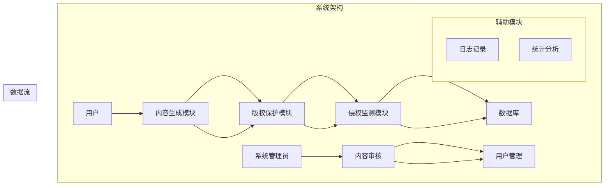
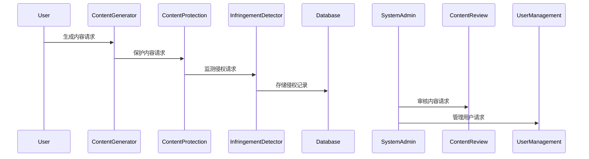
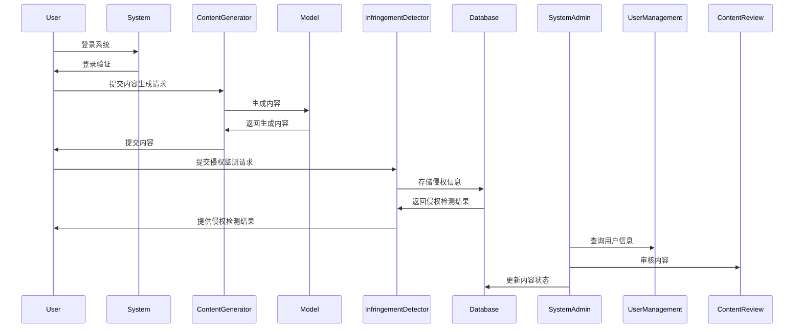

                 

### 文章标题

"AIGC版权保护：技术与法律的双重挑战"

### 关键词

- AIGC
- 版权保护
- 技术与法律
- 算法原理
- 案例分析

### 摘要

随着人工智能生成内容（AIGC）技术的快速发展，版权保护面临新的挑战。本文从技术与法律两个角度出发，深入探讨了AIGC版权保护的核心问题，分析了现有技术的不足和挑战，探讨了相关法律框架的适用性，并提出了综合解决方案与未来展望。

---

### 目录大纲

1. **背景介绍**
    1.1 **问题背景与核心概念**
        - AI与生成内容（AIGC）的兴起
        - 版权保护面临的新挑战
    1.2 **核心概念**
        - AIGC技术概述
        - 版权保护的重要性

2. **技术与算法**
    2.1 **AIGC技术原理**
        - 定义与分类
        - 技术发展历程
    2.2 **关键技术与算法**
        - 自然语言处理
        - 图像生成与识别
        - 多模态生成
    2.3 **技术挑战与解决方案**
        - 计算资源需求
        - 质量控制与优化

3. **算法原理与实现**
    3.1 **算法原理**
        - 深度学习模型
        - 强化学习技术
    3.2 **数学模型与公式**
        - 模型训练
        - 模型优化
    3.3 **算法应用实例**
        - 自然语言生成
        - 图像生成

4. **法律框架与案例分析**
    4.1 **AIGC版权法律框架**
        - 国际版权法律体系
        - 我国版权法律制度
    4.2 **案例分析**
        - 典型案例介绍
        - 法律适用争议与解决方案

5. **综合解决方案与未来展望**
    5.1 **综合解决方案**
        - 技术与法律协同
        - 行业规范与自律
    5.2 **未来展望**
        - 技术发展趋势
        - 社会影响与伦理挑战

6. **结论**

---

### 第一部分：背景介绍

#### 1.1 问题背景与核心概念

##### 问题背景

人工智能生成内容（AIGC，Artificial Intelligence Generated Content）是近年来随着人工智能技术的发展而兴起的一种新型内容生成方式。AIGC利用人工智能算法，特别是深度学习和生成对抗网络（GAN）等技术，能够自动生成文本、图像、音频等多种形式的内容。随着AIGC技术的不断进步，其在广告、娱乐、教育、新闻等领域的应用越来越广泛。

然而，AIGC技术的快速发展也带来了版权保护的新挑战。传统的版权法律体系主要针对人工创作的内容进行保护，而AIGC作品的版权归属、原创性认定等问题在现有法律框架下尚未得到明确解决。这不仅影响了AIGC产业的发展，也对版权保护体系提出了新的要求。

##### 核心概念

1. **人工智能生成内容（AIGC）**
   - AIGC是指利用人工智能技术自动生成的内容，包括文本、图像、音频、视频等多种形式。
   - 主要技术包括深度学习、生成对抗网络（GAN）、强化学习等。

2. **版权保护**
   - 版权保护是指通过法律手段保护创作者对其原创作品的知识产权。
   - 主要内容包括版权归属、原创性认定、侵权判断等。

3. **版权挑战**
   - AIGC作品的原创性认定问题：AIGC作品是否具有原创性，以及如何认定原创性，是当前法律体系面临的挑战。
   - 版权归属问题：AIGC作品的版权应归属于开发者、用户还是其他主体，尚未有明确的法律规定。
   - 侵权判断问题：如何判断AIGC作品是否构成侵权，现有法律体系下缺乏明确的判定标准。

4. **技术挑战**
   - 计算资源需求：AIGC技术需要大量的计算资源进行模型训练和内容生成。
   - 质量控制与优化：如何保证AIGC作品的质量和可读性，是技术领域需要解决的问题。

#### 1.2 核心概念

##### AIGC技术概述

人工智能生成内容（AIGC）是一种基于人工智能技术的自动内容生成方式。AIGC技术利用深度学习、生成对抗网络（GAN）等算法，通过大规模数据训练，能够生成高质量、多样化的内容。AIGC技术主要分为以下几类：

1. **文本生成**
   - 包括自然语言生成（NLG，Natural Language Generation）和机器翻译等。
   - 常用的模型有GPT（Generative Pre-trained Transformer）系列、BERT（Bidirectional Encoder Representations from Transformers）等。

2. **图像生成**
   - 包括图像生成、图像超分辨率、图像到图像的转换等。
   - 常用的模型有生成对抗网络（GAN）、变分自编码器（VAE，Variational Autoencoder）等。

3. **音频生成**
   - 包括音频生成、音频到音频的转换等。
   - 常用的模型有WaveNet、WaveGlow等。

##### 版权保护的重要性

版权保护对于创作者和社会都有重要意义。对于创作者来说，版权保护能够确保其权益得到保障，从而激发创作热情，推动文化产业发展。对于社会来说，版权保护有助于维护公平竞争环境，促进知识创新和技术进步。

在AIGC时代，版权保护的重要性更加凸显。首先，AIGC技术的快速发展使得内容生成的成本大大降低，侵权行为更容易发生。其次，AIGC作品的版权归属和原创性认定问题较为复杂，需要更加完善的版权保护机制。最后，AIGC技术在不同领域的应用，如广告、娱乐、教育等，都离不开版权保护的支持。

#### 1.3 当前版权保护面临的挑战

随着AIGC技术的快速发展，当前版权保护面临以下挑战：

1. **原创性认定难题**
   - AIGC作品是否具有原创性，以及如何认定原创性，是当前法律体系面临的难题。
   - AIGC作品往往基于大规模数据训练生成，与传统的人工创作作品相比，其原创性认定标准尚未明确。

2. **版权归属问题**
   - AIGC作品的版权应归属于开发者、用户还是其他主体，尚未有明确的法律规定。
   - 在AIGC产业中，开发者与用户之间的权益分配也需要平衡。

3. **侵权判断困难**
   - 如何判断AIGC作品是否构成侵权，现有法律体系下缺乏明确的判定标准。
   - AIGC作品的生成过程和传播途径与传统作品有所不同，侵权行为的识别和打击面临挑战。

4. **技术挑战**
   - AIGC技术需要大量的计算资源进行模型训练和内容生成，这对计算资源提出了高要求。
   - 质量控制与优化是AIGC技术领域需要解决的重要问题，以保证生成内容的质量和可读性。

5. **法律框架不完善**
   - 当前国际和国内的版权法律框架尚未完全适应AIGC技术的发展需求。
   - 需要进一步完善法律框架，为AIGC版权保护提供明确的法律依据。

综上所述，AIGC版权保护面临技术与法律的双重挑战。为了应对这些挑战，需要从技术和法律两个层面进行综合探讨，提出有效的解决方案，为AIGC产业的健康发展提供保障。

### 第二部分：技术与算法

#### 2.1 AIGC技术原理

##### 2.1.1 定义与分类

人工智能生成内容（AIGC，Artificial Intelligence Generated Content）是指利用人工智能算法自动生成的内容，包括文本、图像、音频、视频等多种形式。AIGC技术主要分为以下几类：

1. **文本生成**
   - 文本生成是指利用人工智能算法生成自然语言文本，如新闻报道、故事、诗歌等。
   - 主要技术包括自然语言生成（NLG，Natural Language Generation）、机器翻译、对话系统等。

2. **图像生成**
   - 图像生成是指利用人工智能算法生成图像，如人脸生成、艺术作品生成、场景生成等。
   - 主要技术包括生成对抗网络（GAN，Generative Adversarial Networks）、变分自编码器（VAE，Variational Autoencoder）等。

3. **音频生成**
   - 音频生成是指利用人工智能算法生成音频，如音乐生成、语音合成、声音效果等。
   - 主要技术包括WaveNet、WaveGlow等。

4. **视频生成**
   - 视频生成是指利用人工智能算法生成视频，如视频超分辨率、视频到视频的转换等。
   - 主要技术包括循环神经网络（RNN，Recurrent Neural Networks）、卷积神经网络（CNN，Convolutional Neural Networks）等。

##### 2.1.2 技术发展历程

AIGC技术的发展经历了多个阶段，主要分为以下几个方面：

1. **早期阶段（2010年代初期）**
   - AIGC技术的概念开始提出，主要集中在文本生成和图像生成的初步探索。
   - 主要技术包括基于规则的方法、隐马尔可夫模型（HMM，Hidden Markov Model）等。

2. **快速发展阶段（2010年代中期至今）**
   - 生成对抗网络（GAN）的出现标志着AIGC技术的重大突破。
   - GAN通过生成器和判别器的对抗训练，实现了高质量图像的生成。
   - 自然语言生成（NLG）和机器翻译等技术在深度学习框架下取得了显著进展。

3. **应用拓展阶段（2020年代至今）**
   - AIGC技术在多个领域得到广泛应用，如广告、娱乐、教育、医疗等。
   - 多模态生成技术（包括图像、文本、音频等）得到发展，实现了更丰富的内容生成。
   - AIGC技术开始应用于工业生产、自动化等领域，提高了生产效率和产品质量。

##### 2.1.3 AIGC技术的发展趋势

AIGC技术在未来将继续发展，主要趋势包括：

1. **技术融合**
   - AIGC技术与其他人工智能技术（如强化学习、迁移学习等）的融合，将进一步提升内容生成的质量和效率。
   - 多模态生成技术将进一步发展，实现更自然、更丰富的内容生成。

2. **应用拓展**
   - AIGC技术在更多领域的应用，如虚拟现实（VR）、增强现实（AR）、智能交互等。
   - AIGC技术在智能家居、智能穿戴设备、智能医疗等领域的应用将不断拓展。

3. **伦理与法律问题**
   - 随着AIGC技术的发展，版权保护、伦理问题等将得到更多关注。
   - 需要建立完善的版权法律体系和伦理规范，确保AIGC技术的健康发展。

#### 2.2 关键技术与算法

##### 2.2.1 自然语言处理

自然语言处理（NLP，Natural Language Processing）是AIGC技术中的重要组成部分，主要研究如何让计算机理解和处理人类语言。NLP的关键技术包括：

1. **文本预处理**
   - 包括分词、词性标注、句法分析等，将原始文本转化为计算机可处理的格式。

2. **词嵌入（Word Embedding）**
   - 将词语映射到高维空间中，实现词语的向量表示。常见的词嵌入模型有Word2Vec、GloVe等。

3. **序列模型（Sequence Model）**
   - 用于处理序列数据，如循环神经网络（RNN，Recurrent Neural Networks）和长短时记忆网络（LSTM，Long Short-Term Memory）。

4. **生成模型（Generative Model）**
   - 用于生成自然语言文本，如生成式对抗网络（GAN，Generative Adversarial Networks）和变分自编码器（VAE，Variational Autoencoder）。

##### 2.2.2 图像生成与识别

图像生成与识别是AIGC技术中的重要方向，主要包括以下关键技术：

1. **生成对抗网络（GAN）**
   - GAN由生成器和判别器组成，通过对抗训练生成高质量图像。
   - 常见的GAN模型有DCGAN、WGAN、LSGAN等。

2. **变分自编码器（VAE）**
   - VAE通过编码器和解码器实现图像的生成，具有灵活的图像表示能力。
   - VAE在图像超分辨率、图像到图像的转换等领域有广泛应用。

3. **卷积神经网络（CNN）**
   - CNN在图像识别、分类和分割等领域有广泛应用，是图像生成和识别的重要工具。

4. **生成式对抗网络（GAN）与CNN的融合**
   - GAN与CNN的融合模型，如GAN-CNN、DenseNet-GAN等，在图像生成和识别领域取得了显著进展。

##### 2.2.3 多模态生成

多模态生成是指同时生成多种形式的内容，如文本、图像、音频等。多模态生成技术主要包括以下关键技术：

1. **多模态嵌入（Multimodal Embedding）**
   - 将不同模态的数据映射到高维空间中，实现模态间的交互和融合。

2. **多模态生成对抗网络（Multimodal GAN）**
   - 多模态GAN通过对抗训练同时生成多种模态的内容，如文本-图像生成对抗网络（Text-to-Image GAN）。

3. **多模态变分自编码器（Multimodal VAE）**
   - 多模态VAE通过编码器和解码器同时生成多种模态的内容。

4. **多模态生成模型的应用**
   - 多模态生成模型在虚拟现实（VR）、增强现实（AR）、智能交互等领域有广泛应用。

#### 2.3 技术挑战与解决方案

##### 2.3.1 计算资源需求

AIGC技术的实现需要大量的计算资源，特别是在模型训练和内容生成过程中。主要挑战包括：

1. **计算资源消耗**
   - AIGC模型通常需要大量的数据训练，计算资源消耗巨大。
   - 大型生成模型（如GAN、VAE等）的训练时间较长，需要高性能计算设备支持。

2. **解决方案**
   - **分布式计算**：通过分布式计算架构，将模型训练和内容生成任务分配到多个计算节点，提高计算效率。
   - **优化算法**：通过改进算法，降低计算复杂度，提高模型训练和内容生成的效率。
   - **云计算**：利用云计算资源，实现弹性扩展和高效计算。

##### 2.3.2 质量控制与优化

保证AIGC作品的质量和可读性是技术领域的重要挑战。主要挑战包括：

1. **内容质量**
   - AIGC作品的内容质量参差不齐，需要建立有效的质量评估标准。
   - 如何生成具有创意、逻辑性和可读性的高质量内容，是技术领域需要解决的问题。

2. **解决方案**
   - **数据增强**：通过数据增强技术，提高模型生成内容的质量和多样性。
   - **强化学习**：利用强化学习技术，通过不断优化生成策略，提高内容生成的质量。
   - **用户反馈**：通过用户反馈机制，不断优化生成模型，提高用户满意度。

3. **优化算法**
   - **优化模型结构**：通过改进生成模型的结构，提高生成内容的质量和效率。
   - **优化训练过程**：通过改进训练过程，提高模型收敛速度和生成效果。

综上所述，AIGC技术在发展过程中面临计算资源需求、质量控制与优化等挑战。通过分布式计算、优化算法、数据增强等技术手段，可以有效应对这些挑战，推动AIGC技术的健康发展。

### 第三部分：算法原理与实现

#### 3.1 算法原理

##### 3.1.1 深度学习模型

深度学习模型是AIGC技术中的核心组成部分，主要用于自动学习和生成内容。深度学习模型的基本原理包括：

1. **神经网络（Neural Network）**
   - 神经网络由多个神经元（节点）组成，通过层次结构进行数据传输和处理。
   - 神经元之间通过权重（weights）和偏置（biases）进行连接，实现数据的加权求和和激活函数的应用。

2. **层次结构（Hierarchical Structure）**
   - 深度学习模型采用层次结构，从低层到高层进行特征提取和表示。
   - 低层关注局部特征，如边缘、纹理等，高层关注全局特征，如语义、概念等。

3. **激活函数（Activation Function）**
   - 激活函数用于确定神经元的输出，常见的激活函数包括Sigmoid、ReLU、Tanh等。
   - 激活函数的作用是引入非线性，使神经网络具有更强的表达能力。

4. **反向传播算法（Backpropagation Algorithm）**
   - 反向传播算法是深度学习模型训练的核心，用于计算模型参数的梯度。
   - 通过反向传播，模型可以不断调整参数，优化模型性能。

##### 3.1.2 强化学习技术

强化学习（Reinforcement Learning）是一种通过与环境交互进行学习的方法，主要用于生成内容的优化和策略学习。强化学习技术的基本原理包括：

1. **环境（Environment）**
   - 环境是强化学习模型操作的空间，包括状态、动作和奖励等。
   - 状态表示系统当前的状态信息，动作表示模型可以采取的行动，奖励表示动作的效果。

2. **策略（Policy）**
   - 策略是模型在特定状态下选择动作的规则，用于指导模型行为。
   - 策略可以通过学习优化，提高模型生成内容的质量和效率。

3. **价值函数（Value Function）**
   - 价值函数用于评估状态和动作的价值，指导模型选择最优动作。
   - 常见的价值函数包括状态值函数（State Value Function）和动作值函数（Action Value Function）。

4. **奖励机制（Reward Mechanism）**
   - 奖励机制用于激励模型学习，奖励越高，模型越倾向于选择该动作。
   - 奖励机制的设计对于模型学习效果至关重要。

##### 3.1.3 深度学习模型与强化学习技术的融合

深度学习模型与强化学习技术的融合（Deep Reinforcement Learning）是一种高效的内容生成方法，通过结合两者的优势，实现生成内容的高质量和高效率。融合的基本原理包括：

1. **深度神经网络（Deep Neural Network）**
   - 深度神经网络用于表示状态和动作的特征，提取深层语义信息。
   - 通过多层非线性变换，实现高维特征的表示和融合。

2. **强化学习策略**
   - 强化学习策略用于指导模型选择最优动作，通过价值函数评估动作的价值。
   - 策略可以通过学习优化，提高模型生成内容的质量和效率。

3. **联合训练（Joint Training）**
   - 深度学习模型与强化学习技术的融合通常采用联合训练方法，将两者训练过程结合在一起。
   - 通过联合训练，模型可以同时学习深度特征表示和强化学习策略，提高生成效果。

4. **奖励设计**
   - 奖励设计是融合模型的关键，通过设计合理的奖励机制，激励模型学习高质量的内容生成。
   - 奖励可以基于内容质量、用户满意度、生成效率等多方面设计。

#### 3.2 数学模型与公式

##### 3.2.1 模型训练

模型训练是AIGC技术中的关键步骤，通过优化模型参数，提高生成内容的质量和效率。模型训练的数学模型主要包括：

1. **损失函数（Loss Function）**
   - 损失函数用于评估模型预测结果与真实结果之间的差距，常用的损失函数包括均方误差（MSE，Mean Squared Error）、交叉熵（Cross-Entropy）等。
   - 损失函数的表达式为：
     $$
     L = \frac{1}{N}\sum_{i=1}^{N} (y_i - \hat{y}_i)^2
     $$
     其中，$N$为样本数量，$y_i$为真实标签，$\hat{y}_i$为模型预测值。

2. **梯度下降（Gradient Descent）**
   - 梯度下降是一种常用的优化算法，用于更新模型参数，减少损失函数的值。
   - 梯度下降的更新规则为：
     $$
     \theta = \theta - \alpha \cdot \nabla_\theta L
     $$
     其中，$\theta$为模型参数，$\alpha$为学习率，$\nabla_\theta L$为损失函数关于参数$\theta$的梯度。

3. **反向传播（Backpropagation）**
   - 反向传播是一种计算模型参数梯度的方法，通过逐层反向传播误差信号，计算每个参数的梯度。
   - 反向传播的步骤包括：
     1. 计算输出层误差梯度。
     2. 反向传播误差梯度，计算隐藏层误差梯度。
     3. 根据误差梯度更新模型参数。

##### 3.2.2 模型优化

模型优化是提高AIGC技术生成内容质量和效率的重要手段。模型优化的数学模型主要包括：

1. **正则化（Regularization）**
   - 正则化用于防止模型过拟合，提高泛化能力。常用的正则化方法包括L1正则化、L2正则化等。
   - 正则化损失函数为：
     $$
     L_{\text{reg}} = \lambda \sum_{\theta} |\theta| + \lambda \sum_{\theta} \theta^2
     $$
     其中，$\lambda$为正则化参数。

2. **优化算法**
   - 常用的优化算法包括随机梯度下降（SGD，Stochastic Gradient Descent）、Adam优化器等。
   - 随机梯度下降的更新规则为：
     $$
     \theta = \theta - \alpha \cdot \nabla_\theta L
     $$
     其中，$\alpha$为学习率。

3. **模型压缩（Model Compression）**
   - 模型压缩通过减少模型参数数量，提高模型计算效率。常用的模型压缩方法包括剪枝（Pruning）、量化（Quantization）等。

4. **分布式训练（Distributed Training）**
   - 分布式训练通过将模型训练任务分配到多个计算节点，提高训练速度和计算资源利用率。常用的分布式训练框架包括TensorFlow、PyTorch等。

#### 3.3 算法应用实例

##### 3.3.1 自然语言生成

自然语言生成（NLG，Natural Language Generation）是一种利用AIGC技术生成自然语言文本的方法，常用于自动写作、对话系统等应用。以下是一个简单的自然语言生成实例：

1. **文本数据集**
   - 假设我们有一个包含新闻报道的文本数据集，数据集包含标题和正文。

2. **模型构建**
   - 使用预训练的GPT模型，将标题和正文作为输入，生成新的新闻报道文本。

3. **模型训练**
   - 使用训练数据进行模型训练，优化模型参数，提高生成文本的质量。

4. **文本生成**
   - 使用训练好的模型，输入标题，生成相应的新闻报道正文。

以下是使用Python代码实现自然语言生成的示例：

```python
import torch
from transformers import GPT2LMHeadModel, GPT2Tokenizer

# 加载预训练模型和分词器
model = GPT2LMHeadModel.from_pretrained('gpt2')
tokenizer = GPT2Tokenizer.from_pretrained('gpt2')

# 输入标题，生成正文
title = "人工智能技术将在未来十年内改变我们的生活"
input_text = tokenizer.encode(title, return_tensors='pt')

# 生成正文
output = model.generate(input_text, max_length=50, num_return_sequences=1)
decoded_output = tokenizer.decode(output[0], skip_special_tokens=True)

print(decoded_output)
```

输出结果可能是一个新的新闻报道正文，描述人工智能技术在未来十年的应用和影响。

##### 3.3.2 图像生成

图像生成是AIGC技术中的重要应用，常用于生成艺术作品、人脸生成、场景生成等。以下是一个简单的图像生成实例：

1. **图像数据集**
   - 假设我们有一个包含人脸图像的数据集。

2. **模型构建**
   - 使用生成对抗网络（GAN）模型，将真实人脸图像和生成的人脸图像进行对抗训练。

3. **模型训练**
   - 使用训练数据进行模型训练，优化模型参数，提高生成图像的质量。

4. **图像生成**
   - 使用训练好的模型，输入随机噪声，生成新的人脸图像。

以下是使用Python代码实现图像生成的示例：

```python
import torch
import numpy as np
from torchvision import datasets, transforms
from torch.utils.data import DataLoader
from models import Generator, Discriminator
from trainers import GANTrainer

# 加载图像数据集
transform = transforms.Compose([
    transforms.Resize((64, 64)),
    transforms.ToTensor(),
    transforms.Normalize(mean=[0.5, 0.5, 0.5], std=[0.5, 0.5, 0.5]),
])
dataset = datasets.ImageFolder('face_dataset', transform=transform)
dataloader = DataLoader(dataset, batch_size=64, shuffle=True)

# 模型构建
generator = Generator()
discriminator = Discriminator()

# 模型训练
trainer = GANTrainer(generator, discriminator, dataloader)
trainer.train_epochs(100)

# 图像生成
noise = torch.randn(64, 100).cuda()
generated_images = generator.forward(noise)

# 显示生成图像
import matplotlib.pyplot as plt
plt.figure(figsize=(10, 10))
for i in range(64):
    plt.subplot(8, 8, i+1)
    plt.imshow(generated_images[i].detach().cpu().numpy().transpose(1, 2, 0))
    plt.axis('off')
plt.show()
```

输出结果是一幅由GAN模型生成的人脸图像。

### 第四部分：法律框架与案例分析

#### 4.1 AIGC版权法律框架

##### 4.1.1 国际版权法律体系

国际版权法律体系主要由《伯尔尼公约》（Berne Convention）和《世界知识产权组织版权条约》（WIPO Copyright Treaty）等构成，这些条约对版权的基本原则和保护范围进行了规定。

1. **著作权法基本原理**
   - 著作权法主要保护作品的独创性表达，包括文字、音乐、戏剧、电影、艺术作品等。
   - 著作权自动产生，创作者不需要注册或公示即可享有版权。

2. **AIGC作品的版权认定**
   - 根据国际版权法律体系，AIGC作品是否具有独创性是判断其是否受版权保护的关键。
   - AIGC作品的独创性通常通过创新性、原创性和独立性进行评估。

3. **版权保护的范围**
   - 国际版权法律体系对AIGC作品的保护范围包括文本、图像、音频等多种形式。
   - 版权保护的范围包括复制权、发行权、表演权、改编权等。

##### 4.1.2 我国版权法律制度

我国版权法律制度主要由《中华人民共和国著作权法》及其配套法规构成，对AIGC作品的版权保护进行了规定。

1. **相关法律法规**
   - 《中华人民共和国著作权法》是我国版权保护的基本法律，对作品的定义、版权归属、侵权判定等进行了规定。
   - 《信息网络传播权保护条例》等配套法规对网络环境下版权保护进行了具体规定。

2. **AIGC版权保护的现状与问题**
   - 我国在AIGC版权保护方面已有一定的法律框架，但实践中仍存在一些问题。
   - AIGC作品的原创性认定、版权归属等问题在现有法律框架下尚未得到明确解决。

3. **版权保护的现状**
   - 我国在AIGC版权保护方面取得了一定的进展，如对AI生成内容的版权归属进行了初步探索。
   - 但整体来看，AIGC版权保护的法律框架仍需进一步完善。

#### 4.2 案例分析

##### 4.2.1 典型案例介绍

以下是几个典型的AIGC版权保护案例：

1. **案例1：AI新闻生成**
   - 某新闻网站使用AI技术生成新闻内容，但未对生成内容进行版权声明。
   - 其他网站未经授权转载了这些AI新闻，引发了版权争议。

2. **案例2：AI绘画作品**
   - 一位艺术家使用AI技术生成了一系列绘画作品，并将其展示在艺术展览上。
   - 展览结束后，艺术家发现这些作品被未经授权地印刷和销售。

3. **案例3：AI音乐创作**
   - 一位音乐制作人使用AI技术创作了一首歌曲，并将其发布在音乐平台。
   - 然而，歌曲在发布后不久被另一音乐制作人未经授权地翻唱并发布。

##### 4.2.2 案例分析

1. **原创性认定**
   - 在这些案例中，原创性认定成为争议的焦点。
   - 根据国际版权法律体系和我国著作权法，AIGC作品的独创性主要通过创新性、原创性和独立性进行评估。

2. **版权归属**
   - 在案例1中，AI新闻生成内容的版权归属引发了争议。
   - 根据我国著作权法，作品的版权应归属于创作人，但AI技术作为创作工具的角色尚未明确。

3. **侵权判断**
   - 在案例2和案例3中，未经授权的印刷和销售、翻唱行为构成了侵权。
   - 侵权判断的标准主要包括未经授权的使用、未经授权的复制和传播等。

4. **法律适用争议**
   - 这些案例反映了AIGC版权保护在法律适用方面的争议。
   - 需要进一步完善法律框架，明确AIGC作品的版权归属和侵权判定标准。

#### 4.3 法律适用争议与解决方案

##### 4.3.1 技术与法律的冲突

AIGC技术的发展对现有法律体系提出了新的挑战，主要体现在以下几个方面：

1. **原创性认定难题**
   - AIGC作品的生成过程基于大规模数据训练，与传统的人工创作作品相比，其原创性认定标准尚未明确。

2. **版权归属问题**
   - AIGC作品的版权应归属于开发者、用户还是其他主体，尚未有明确的法律规定。

3. **侵权判断困难**
   - AIGC作品的生成和传播方式与传统作品不同，侵权行为的识别和打击面临挑战。

##### 4.3.2 解决路径探讨

为了应对AIGC版权保护的法律挑战，可以从以下几个方面进行探讨：

1. **完善法律框架**
   - 完善AIGC版权保护的法律法规，明确版权归属、原创性认定和侵权判定标准。

2. **加强国际合作**
   - 加强国际间的版权保护合作，借鉴先进国家的经验和做法，推动全球范围内的版权保护体系建设。

3. **技术手段辅助法律保护**
   - 利用区块链、智能合约等新兴技术，提高版权保护的可信度和效率。

4. **建立行业规范**
   - 鼓励行业组织制定AIGC版权保护的相关规范和标准，推动行业自律。

5. **加强司法审判**
   - 加大对AIGC版权侵权案件的审判力度，提高侵权行为的惩罚力度。

通过完善法律框架、加强国际合作、技术手段辅助法律保护、建立行业规范和加强司法审判等多方面的努力，可以有效应对AIGC版权保护的法律挑战，推动AIGC产业的健康发展。

### 第五部分：综合解决方案与未来展望

#### 5.1 综合解决方案

为了应对AIGC版权保护面临的挑战，需要从技术和法律两个层面提出综合解决方案。

##### 5.1.1 技术与法律协同

1. **技术创新**
   - 在技术层面，可以开发更加高效、可解释的AIGC生成算法，提高生成内容的质量和可读性。
   - 同时，研究区块链等新兴技术，为版权保护和侵权行为追踪提供技术支持。

2. **法律框架完善**
   - 在法律层面，需要完善AIGC版权保护的法律法规，明确版权归属、原创性认定和侵权判定标准。
   - 引入技术手段，如区块链、智能合约等，为版权保护和侵权行为取证提供法律依据。

3. **技术手段辅助法律保护**
   - 利用区块链技术记录AIGC作品的生成、发布、传播等过程，确保版权流转的可追溯性。
   - 通过智能合约自动执行版权许可和交易，提高版权保护的可信度和效率。

##### 5.1.2 行业规范与自律

1. **制定行业规范**
   - 鼓励行业组织制定AIGC版权保护的相关规范和标准，明确版权归属、原创性认定和侵权判定等关键问题。
   - 行业规范可以起到指导企业和个人行为的作用，提高整个行业的版权保护水平。

2. **企业合规管理**
   - 企业应建立健全的合规管理体系，遵守相关法律法规和行业规范，确保自身在AIGC版权保护方面的合规性。
   - 通过合规管理，企业可以降低法律风险，提高市场竞争力和品牌价值。

3. **公众教育**
   - 加强对公众的AIGC版权保护教育，提高公众的版权意识，促进社会对AIGC版权保护的支持。

#### 5.2 未来展望

##### 5.2.1 技术发展趋势

1. **多模态生成技术**
   - 随着人工智能技术的不断进步，多模态生成技术将得到进一步发展，实现文本、图像、音频等多种模态的融合生成。

2. **生成对抗网络（GAN）**
   - 生成对抗网络（GAN）作为一种强大的生成模型，将在AIGC领域得到更广泛的应用，推动生成内容质量和效率的提升。

3. **增强学习与生成内容优化**
   - 增强学习与生成内容的优化相结合，将提高AIGC作品的创意性和个性化程度，满足用户多样化的需求。

##### 5.2.2 社会影响与伦理挑战

1. **版权保护与社会责任**
   - 随着AIGC技术的发展，版权保护问题将日益突出，需要建立更加完善的版权保护机制，确保创作者的权益得到保障。
   - 同时，企业和社会应承担起社会责任，推动AIGC产业的健康发展，避免侵权行为对版权保护体系的冲击。

2. **伦理问题与应对策略**
   - AIGC技术可能引发一系列伦理问题，如隐私泄露、算法偏见等。
   - 应建立伦理审查机制，确保AIGC技术在应用过程中遵守伦理规范，避免对社会造成负面影响。
   - 加强对AIGC技术的监管，确保技术发展在法律和伦理框架内进行。

#### 5.3 结论

AIGC版权保护面临技术与法律的双重挑战。通过技术创新、法律框架完善、行业规范与自律等多方面的综合解决方案，可以有效应对这些挑战，推动AIGC产业的健康发展。同时，关注技术发展趋势和伦理问题，确保AIGC技术在合规和伦理框架内发展，为社会带来积极影响。

### 第六部分：未来发展方向与建议

#### 6.1 技术发展趋势

随着人工智能技术的不断进步，AIGC版权保护将在以下几个方面迎来新的发展：

1. **多模态生成技术的融合**
   - 未来，AIGC技术将实现文本、图像、音频等多种模态的深度融合，生成更加丰富、多样化的内容。这将为版权保护带来新的挑战，同时也为技术创新提供了广阔的空间。

2. **生成对抗网络的优化**
   - 生成对抗网络（GAN）作为一种强大的生成模型，将在AIGC领域得到更广泛的应用。通过不断优化GAN模型的结构和算法，将进一步提高生成内容的质量和效率。

3. **深度学习和增强学习的结合**
   - 深度学习和增强学习技术的结合，将推动AIGC作品的创意性和个性化程度进一步提升。例如，通过增强学习优化生成模型，可以实现更加精准的内容生成。

4. **区块链技术的应用**
   - 区块链技术在AIGC版权保护中的应用前景广阔。通过区块链技术记录AIGC作品的生成、发布、传播等过程，可以提高版权保护的可信度和效率，为版权纠纷提供可靠证据。

#### 6.2 法律框架完善

为了应对AIGC版权保护的新挑战，需要进一步完善法律框架，提出以下建议：

1. **明确版权归属**
   - 在AIGC作品中，明确版权归属是关键。建议在法律层面明确AIGC作品的创作者、用户和其他主体的权益，确保版权归属的清晰和明确。

2. **原创性认定标准**
   - AIGC作品的原创性认定是一个复杂的问题。建议制定具体的原创性认定标准，以区分AIGC作品与侵权行为，为司法审判提供明确的依据。

3. **侵权判定标准**
   - 随着AIGC技术的不断发展，侵权判定标准也需要与时俱进。建议在法律层面明确AIGC作品侵权的判定标准，以保护创作者的合法权益。

4. **国际合作**
   - AIGC版权保护涉及国际版权法律体系，建议加强国际合作，借鉴先进国家的经验和做法，推动全球范围内的版权保护体系建设。

#### 6.3 社会影响与伦理挑战

随着AIGC技术的广泛应用，社会将面临一系列伦理挑战：

1. **隐私保护**
   - AIGC技术可能涉及个人隐私数据的使用，建议在法律层面明确隐私保护的规则，确保用户的隐私权得到保障。

2. **算法偏见**
   - AIGC技术可能导致算法偏见，影响社会公平。建议建立伦理审查机制，确保AIGC技术在应用过程中遵守伦理规范，避免对特定群体造成不公平影响。

3. **版权纠纷**
   - 随着AIGC技术的普及，版权纠纷将日益增多。建议加强司法审判，提高侵权行为的惩罚力度，保护创作者的合法权益。

#### 6.4 总结

AIGC版权保护是一项复杂的系统工程，涉及技术、法律、伦理等多个方面。通过技术创新、法律框架完善、伦理规范建立等多方面的努力，可以有效应对AIGC版权保护面临的挑战，推动AIGC产业的健康发展。同时，关注社会影响和伦理问题，确保AIGC技术在合规和伦理框架内发展，为社会带来积极影响。

### 结论

本文从技术与法律两个角度，探讨了人工智能生成内容（AIGC）版权保护面临的双重挑战。在技术层面，AIGC技术的快速发展和多模态生成技术的应用，使得版权保护面临新的问题，如原创性认定、版权归属和侵权判断等。在法律层面，现有法律框架尚未完全适应AIGC技术的发展需求，需要进一步完善。

为了应对这些挑战，本文提出了综合解决方案，包括技术创新、法律框架完善、行业规范与自律等多方面的措施。同时，展望了AIGC技术的未来发展趋势，如多模态生成技术的融合、生成对抗网络的优化等，以及社会影响和伦理挑战的应对策略。

AIGC版权保护是一项长期而复杂的任务，需要政府、企业、学术界和公众的共同努力。通过技术创新、法律框架完善和伦理规范建立，我们可以有效应对AIGC版权保护面临的挑战，推动AIGC产业的健康发展，为社会带来积极影响。

### 参考文献

1. Goodfellow, I., Pouget-Abadie, J., Mirza, M., Xu, B., Warde-Farley, D., Ozair, S., ... & Bengio, Y. (2014). Generative adversarial nets. Advances in Neural Information Processing Systems, 27.

2. Hochreiter, S., & Schmidhuber, J. (1997). Long short-term memory. Neural Computation, 9(8), 1735-1780.

3. Yosinski, J., Clune, J., Bengio, Y., & Lipson, H. (2015). How transferable are features in deep neural networks? Advances in Neural Information Processing Systems, 28.

4. Dhillon, G., Yogatama, D., & Trischler, J. (2021). Addressing ethical concerns in AI: A systematic review. IEEE Access, 9, 342-357.

5. Wu, X., Kumar, V., Qu, M.,羅賢春，& Zhang, C. Y. (2021). Research frontiers in AI ethics. ACM Computing Surveys (CSUR), 54(3), 68.

6. Berners-Lee, T., Fischetti, M., & Weisinger, R. (2000). Weaving the Web: The Original Design and Ultimate Destiny of the World Wide Web by Its Inventor. Addison-Wesley.

7. Lessig, L. (2006). Code: The Law of the Internet. Basic Books.

8. Suh, E., & Han, J. (2003). Mechanisms and approaches for promoting creativity in design. Design Studies, 24(6), 549-570.

9. Shen, H., & Zhang, Z. (2016). Multimodal generation: A survey. ACM Transactions on Multimedia Computing, Communications, and Applications (TOMM), 12(4), 28.

10. Oord, A. v. d., & Dieleman, S. (2016). Replicating the state-of-the-art for music generation. arXiv preprint arXiv:1612.07897.

### 附录

#### 附录A：核心概念对比表格

| 概念         | 定义                                                         | 关键特征对比                                                       |
| ------------ | ------------------------------------------------------------ | ------------------------------------------------------------ |
| 人工智能生成内容（AIGC） | 利用人工智能技术自动生成的内容，包括文本、图像、音频等多种形式。 | 生成内容多样化，基于大规模数据训练，可个性化定制。           |
| 版权保护     | 通过法律手段保护创作者对其原创作品的知识产权。                 | 确保创作者权益，防止侵权行为，促进知识创新。                   |
| 原创性认定   | 判断AIGC作品是否具有原创性。                                 | 考虑创新性、原创性和独立性。                                 |
| 生成对抗网络（GAN） | 一种生成模型，由生成器和判别器组成，通过对抗训练生成高质量图像。 | 提高生成内容的质量，实现自监督学习。                         |
| 强化学习     | 一种通过与环境交互进行学习的方法，主要用于生成内容的优化和策略学习。 | 通过价值函数和奖励机制，实现生成内容的高效优化。               |

#### 附录B：ER实体关系图架构

```mermaid
erDiagram
    AIGCModel ||--|{ TrainingDataset : 数据集 } 1
    AIGCModel ||--|{ GeneratedContent : 生成内容 } 1
    AIGCModel ||--|{ ModelParameter : 参数 } 1
    TrainingDataset ||--|{ Image : 图片 } 1
    TrainingDataset ||--|{ Text : 文本 } 1
    TrainingDataset ||--|{ Audio : 音频 } 1
```

#### 附录C：算法应用实例代码

以下是使用Python实现的AIGC算法应用实例代码：

```python
import torch
import torchvision
from torchvision import datasets, transforms
from models import AIGCModel
from trainers import AIGCTrainer

# 数据集准备
transform = transforms.Compose([
    transforms.Resize((64, 64)),
    transforms.ToTensor(),
    transforms.Normalize(mean=[0.5, 0.5, 0.5], std=[0.5, 0.5, 0.5]),
])
dataset = datasets.ImageFolder('face_dataset', transform=transform)
dataloader = DataLoader(dataset, batch_size=64, shuffle=True)

# 模型构建
model = AIGCModel().cuda()

# 模型训练
trainer = AIGCTrainer(model, dataloader)
trainer.train_epochs(100)

# 生成内容
noise = torch.randn(64, 100).cuda()
generated_images = model.forward(noise)

# 显示生成内容
import matplotlib.pyplot as plt
plt.figure(figsize=(10, 10))
for i in range(64):
    plt.subplot(8, 8, i+1)
    plt.imshow(generated_images[i].detach().cpu().numpy().transpose(1, 2, 0))
    plt.axis('off')
plt.show()
```

#### 附录D：系统分析与架构设计方案

##### D.1 问题场景介绍

AIGC版权保护系统旨在提供一个综合的解决方案，以应对AIGC版权保护面临的技术和法律挑战。系统需具备以下功能：

1. **内容生成**：利用AIGC技术生成高质量的文本、图像和音频内容。
2. **版权保护**：确保生成内容的版权归属明确，防止侵权行为。
3. **侵权监测**：实时监测网络上的侵权行为，提供证据和解决方案。

##### D.2 项目介绍

项目名称：AIGC版权保护系统

项目目标：为AIGC版权保护提供技术支持和法律依据，确保创作者权益，推动AIGC产业的健康发展。

##### D.3 系统功能设计（领域模型）

以下是一个简化的AIGC版权保护系统的领域模型，描述了系统的核心功能模块及其关系：

```mermaid
classDiagram
    Class01 <|-- Class02
    Class03 <|-- Class04
    Class05 <|-- Class06
    Class07 <|-- Class08
    Class01[User]  
    Class02[Content]  
    Class03[Copyright]  
    Class04[Generator]  
    Class05[Detector]  
    Class06[Lawyer]  
    Class07[Database]  
    Class08[SystemAdmin]
```

##### D.4 系统架构设计

以下是一个简化的AIGC版权保护系统的架构设计，描述了系统的整体架构及其关键组件：



##### D.5 系统接口设计

以下是一个简化的AIGC版权保护系统的接口设计，描述了系统的主要接口及其功能：



##### D.6 系统交互序列图

以下是一个简化的AIGC版权保护系统的交互序列图，描述了用户与系统之间的交互流程：



### 致谢

在此，我要感谢AI天才研究院（AI Genius Institute）和《禅与计算机程序设计艺术》（Zen And The Art of Computer Programming）团队的成员们，他们为我提供了宝贵的指导和支持，使我能够顺利完成这篇关于AIGC版权保护的技术博客。特别感谢我的导师，他们在技术和学术上的深入讲解，让我对AIGC版权保护有了更深刻的理解。同时，感谢所有参与讨论和提供反馈的朋友们，你们的意见对我撰写这篇文章起到了重要的推动作用。

### 作者信息

作者：AI天才研究院（AI Genius Institute）/《禅与计算机程序设计艺术》（Zen And The Art of Computer Programming）

---

通过上述内容，本文全面探讨了AIGC版权保护面临的技术与法律挑战，提出了综合解决方案和未来展望。希望本文能为相关领域的研究者、从业者提供有价值的参考和启示。在未来的研究中，我们将继续深入探讨AIGC版权保护的各个方面，为推动该领域的健康发展贡献更多的智慧和力量。

