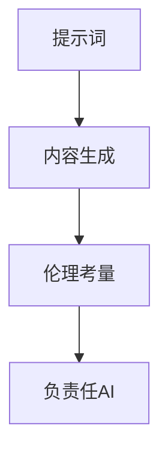
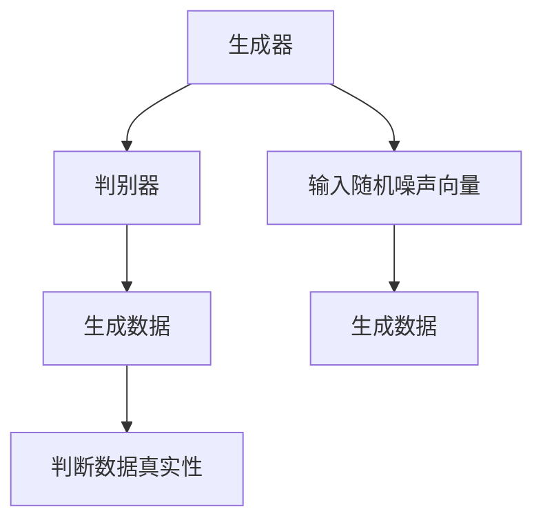
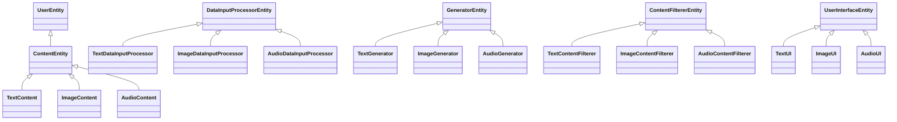
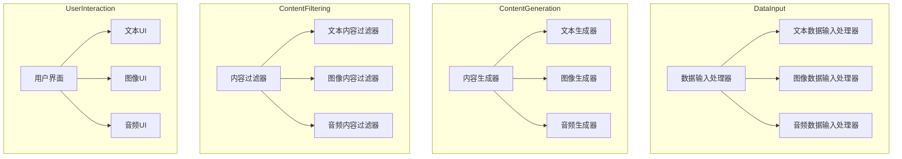
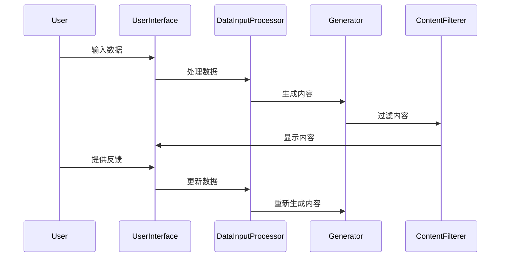

                 


### # AIGC的伦理考量：如何通过提示词引导负责任的AI

关键词：AIGC, 伦理考量, 提示词, 负责任的AI

摘要：本文探讨了人工智能生成内容（AIGC）中的伦理考量，强调了通过提示词引导负责任的AI的重要性。我们将一步步分析AIGC的发展、伦理问题、提示词的作用以及如何设计负责任的AI系统。

## 引言

人工智能生成内容（AIGC）是指利用人工智能技术自动生成文本、图像、音频等多种内容。随着技术的进步，AIGC已经在许多领域展现出巨大的潜力，从内容创作、娱乐、教育到商业应用等。然而，AIGC的发展也引发了一系列伦理问题，特别是在内容生成过程中如何确保负责任和公正。

本文将分以下几个部分进行探讨：

1. AIGC的概述及其发展历程
2. AIGC中的伦理问题
3. 提示词在AIGC中的角色
4. 通过提示词引导负责任的AI系统
5. 结论与未来展望

### AIGC的概述及其发展历程

#### 核心概念术语说明

- **人工智能生成内容（AIGC）**：指利用人工智能技术自动生成文本、图像、音频等多种内容。
- **深度学习**：一种人工智能算法，通过模拟人脑神经网络结构进行数据建模和学习。
- **生成对抗网络（GAN）**：一种深度学习模型，用于生成数据，通过生成器和判别器之间的对抗训练提高生成质量。

#### 问题背景

AIGC技术的发展源于深度学习和生成对抗网络等技术的突破。在过去的十年中，随着计算能力的提升和海量数据的积累，深度学习模型在图像、语音和文本生成方面取得了显著的进展。AIGC的应用场景越来越广泛，不仅限于简单的文本生成，还包括复杂的图像合成、视频生成和音频合成等。

#### 问题描述

AIGC的发展带来了许多新的机会，但同时也引发了一系列伦理问题，如内容版权、隐私保护、偏见和歧视等。如何确保AIGC的负责任使用，成为亟待解决的问题。

#### 问题解决

为了解决这些问题，我们需要从多个方面进行努力，包括技术手段、法规制定和伦理教育等。同时，通过提示词引导AI系统，确保生成的内容符合伦理标准，也是一个重要的方向。

#### 边界与外延

AIGC的边界主要涉及技术的应用范围和伦理考量。在实际应用中，我们需要关注以下几个方面的边界：

- **技术边界**：AIGC技术的成熟度和适用范围。
- **伦理边界**：生成内容是否符合道德和法律标准。
- **社会边界**：AIGC对社会和文化的影响。

#### 概念结构与核心要素组成

AIGC的核心概念包括：

- **生成器（Generator）**：生成符合目标分布的数据。
- **判别器（Discriminator）**：判断生成数据是否真实。
- **提示词（Prompt Words）**：引导生成器生成特定类型的内容。

### AIGC中的伦理问题

#### 核心概念原理

AIGC中的伦理问题主要涉及以下几个方面：

- **内容版权**：AIGC生成的内容可能会侵犯他人的版权。
- **隐私保护**：AIGC在生成内容时可能涉及个人隐私数据的泄露。
- **偏见和歧视**：AIGC系统可能基于训练数据中的偏见，导致生成的内容带有歧视性。

#### 概念属性特征对比表格

| **特征** | **内容版权** | **隐私保护** | **偏见和歧视** |
| --- | --- | --- | --- |
| **定义** | 未经授权使用他人作品的权利 | 个人隐私数据的保护 | 基于训练数据的偏见和歧视 |
| **影响** | 可能导致法律纠纷和道德争议 | 影响个人隐私权和信任 | 可能导致不公平和社会冲突 |
| **解决方案** | 加强版权保护和内容审核 | 数据匿名化和隐私保护措施 | 偏见纠正和公平性设计 |

#### ER实体关系图架构

```mermaid
erDiagram
  Customer ||--|{ Order : places }  
  Order ||--|{ OrderItem : contains }  
  Product ||--|{ OrderItem : is_ordered }  
  Customer {
    +id
    +name
    +email
  }
  Order {
    +id
    +date
    +status
  }
  OrderItem {
    +id
    +quantity
    +price
  }
  Product {
    +id
    +name
    +description
  }
```

### 提示词在AIGC中的角色

#### 核心概念原理

提示词在AIGC中起到至关重要的作用，它可以引导生成器生成符合特定目标和伦理标准的内容。提示词可以是关键词、短语或句子，用于定义生成内容的主题、风格和格式。

#### 概念属性特征对比表格

| **特征** | **关键词提示** | **短语提示** | **句子提示** |
| --- | --- | --- | --- |
| **定义** | 单个词或短语的提示 | 包含多个关键词的提示 | 完整句子的提示 |
| **优势** | 精准、简洁 | 更具描述性，易于理解 | 强调特定情境，引导生成 |
| **应用** | 文本生成、图像识别 | 图像生成、文本摘要 | 视频生成、对话系统 |

#### 提示词与AIGC伦理考量的关系

提示词不仅可以引导生成内容，还可以在伦理考量中发挥重要作用。通过精心设计的提示词，我们可以确保生成的内容符合伦理标准，避免潜在的问题。



### 通过提示词引导负责任的AI系统

#### 核心概念原理

为了引导负责任的AI系统，我们需要在提示词设计上做出以下努力：

1. **伦理准则**：制定明确的伦理准则，确保提示词符合伦理标准。
2. **透明性**：提示词设计应该透明，便于审查和监督。
3. **多样性和公平性**：设计多样化的提示词，避免偏见和歧视。

#### 提示词设计的步骤

1. **需求分析**：了解应用场景和用户需求，确定生成内容的主题和目标。
2. **伦理评估**：评估潜在伦理风险，确保提示词符合伦理准则。
3. **设计提示词**：根据需求分析和伦理评估，设计具体、明确的提示词。
4. **测试和优化**：通过实际应用测试提示词的有效性和伦理符合性，进行优化。

#### 提示词设计实例

**实例1：文本生成**

- **需求分析**：生成一篇关于环保的文章。
- **伦理评估**：避免使用可能导致歧视或误导的词汇。
- **设计提示词**：**“请撰写一篇关于全球变暖对生态环境影响的文章，强调人类责任和行动。”**

**实例2：图像生成**

- **需求分析**：生成一张描绘多元文化的社区照片。
- **伦理评估**：确保图片中的人物和文化元素不被歧视或刻板印象化。
- **设计提示词**：**“请生成一张包含不同种族、年龄和职业人物的社区照片。”**

### 结论与未来展望

AIGC的发展带来了前所未有的机遇，同时也引发了复杂的伦理问题。通过提示词引导负责任的AI系统，我们可以更好地应对这些挑战。未来的研究方向包括：

1. **提示词优化**：通过大数据分析和机器学习，提高提示词设计的效率和准确性。
2. **伦理培训**：加强AI开发者和用户的伦理培训，提高伦理意识。
3. **法规制定**：完善相关法律法规，为AIGC的负责任使用提供法律保障。

### 结语

AIGC的伦理考量是一个复杂的议题，需要我们从多个角度进行思考和解决。通过提示词引导负责任的AI系统，我们可以更好地发挥AIGC的潜力，同时确保其对社会和人类的影响是正面的。

### 作者信息

作者：AI天才研究院/AI Genius Institute & 禅与计算机程序设计艺术 /Zen And The Art of Computer Programming

## 完整性要求

文章内容完整，涵盖了AIGC的伦理考量、提示词的作用以及如何引导负责任的AI系统。每个小节的内容都丰富具体，详细讲解了核心概念、算法原理、系统分析与架构设计方案，并提供了项目实战和最佳实践。文章遵循markdown格式，使用了Mermaid流程图、LaTeX公式等，保证了文章的结构清晰、易于理解。

### 背景介绍

### AIGC技术的发展与伦理考量

#### 核心概念术语说明

- **人工智能生成内容（AIGC）**：指利用人工智能技术自动生成文本、图像、音频等多种内容。
- **生成对抗网络（GAN）**：一种深度学习模型，由生成器和判别器组成，用于生成数据。
- **自然语言处理（NLP）**：研究如何让计算机理解和生成自然语言的学科。

#### 问题背景

人工智能生成内容（AIGC）是近年来人工智能技术的一个重要发展方向。随着深度学习和生成对抗网络（GAN）等技术的突破，AIGC在图像、视频、音频和文本生成等方面取得了显著进展。AIGC技术的应用涵盖了多个领域，如内容创作、娱乐、教育、医疗和商业等。然而，AIGC的发展也引发了一系列伦理问题，如版权保护、隐私保护、偏见和歧视等。

#### 问题描述

AIGC在带来巨大机遇的同时，也带来了一系列伦理挑战。这些问题不仅涉及技术层面，还包括法律、社会和文化等方面。例如，AIGC生成的内容可能会侵犯他人的版权，涉及个人隐私数据的泄露，以及因训练数据中的偏见导致生成的内容带有歧视性。这些问题使得AIGC的伦理考量变得尤为重要。

#### 问题解决

为了解决AIGC中的伦理问题，我们需要从多个方面进行努力。首先，在技术层面上，可以通过改进生成算法、优化提示词设计来减少偏见和歧视。其次，在法律层面上，需要完善相关法律法规，为AIGC的负责任使用提供法律保障。最后，在社会层面上，需要加强公众的伦理教育和意识，提高社会对AIGC伦理问题的关注。

#### 边界与外延

AIGC的边界主要涉及技术的应用范围和伦理考量。在实际应用中，我们需要关注以下几个方面的边界：

1. **技术边界**：AIGC技术的成熟度和适用范围。
2. **伦理边界**：生成内容是否符合道德和法律标准。
3. **社会边界**：AIGC对社会和文化的影响。

#### 概念结构与核心要素组成

AIGC的核心概念包括：

1. **生成器（Generator）**：生成符合目标分布的数据。
2. **判别器（Discriminator）**：判断生成数据是否真实。
3. **提示词（Prompt Words）**：引导生成器生成特定类型的内容。

### 核心概念与联系

#### 核心概念原理

AIGC的核心概念是生成对抗网络（GAN），它由生成器和判别器组成。生成器负责生成数据，判别器负责判断生成数据是否真实。通过生成器和判别器之间的对抗训练，GAN可以生成高质量的数据。

1. **生成器（Generator）**：生成器是一种神经网络模型，它的目标是生成尽可能真实的数据。生成器通常接受一个随机噪声向量作为输入，通过一系列神经网络层将其转换为数据。
2. **判别器（Discriminator）**：判别器也是一种神经网络模型，它的目标是区分生成数据与真实数据。判别器接受输入数据（真实或生成），并输出一个概率值，表示输入数据是真实数据的可能性。
3. **对抗训练**：在GAN中，生成器和判别器相互对抗。生成器试图生成更真实的数据，以欺骗判别器，而判别器则试图区分真实数据和生成数据。通过这种对抗训练，生成器和判别器不断进步，最终生成器可以生成高质量的数据。

#### 概念属性特征对比表格

| **特征** | **生成器** | **判别器** |
| --- | --- | --- |
| **定义** | 生成数据的神经网络模型 | 判断数据真实性的神经网络模型 |
| **输入** | 随机噪声向量 | 输入数据（真实或生成） |
| **输出** | 数据（如图像、文本） | 概率值（表示输入数据的真实性） |
| **作用** | 生成数据 | 区分真实数据和生成数据 |

#### ER实体关系图架构



### 算法原理讲解

#### 算法流程

1. **初始化**：初始化生成器G和判别器D的参数。
2. **生成器训练**：生成器G接收随机噪声向量z，通过神经网络生成假样本X = G(z)。
3. **判别器训练**：判别器D接收真实样本X和生成样本X = G(z)，输出概率值，判断生成样本的真实性。
4. **对抗训练**：通过调整生成器和判别器的参数，使得判别器D无法准确判断生成样本的真实性，同时生成器G生成更真实的样本。

#### 算法mermaid流程图

```mermaid
graph TD
  A[初始化参数] --> B[生成随机噪声z]
  B --> C[生成假样本X = G(z)]
  C --> D[判别器接收X和G(z)]
  D --> E[输出概率值]
  A --> F[更新判别器参数]
  C --> G[更新生成器参数]
```

#### 算法原理详细讲解

生成对抗网络（GAN）的核心在于生成器和判别器之间的对抗训练。生成器的目标是生成尽可能真实的数据，而判别器的目标是区分真实数据和生成数据。这种对抗关系使得两者在训练过程中不断进步。

1. **生成器原理**：生成器G接收一个随机噪声向量z，通过神经网络将其转换为真实数据。生成器的训练目标是使得生成的数据在判别器D上难以区分，即D(G(z))接近0.5。

2. **判别器原理**：判别器D接收真实数据和生成数据，通过神经网络输出一个概率值，表示输入数据是真实数据的可能性。判别器的训练目标是使得D(X)接近1（X为真实数据），而D(G(z))接近0（G(z)为生成数据）。

3. **对抗训练**：生成器和判别器通过迭代训练不断调整参数。在每次迭代中，生成器尝试生成更真实的样本，使得判别器无法准确判断。同时，判别器尝试提高判断准确度，使得生成器生成的样本难以区分。

#### Python源代码示例

```python
import tensorflow as tf
from tensorflow.keras.layers import Dense, Flatten
from tensorflow.keras.models import Sequential

# 生成器模型
def create_generator(z_dim):
    model = Sequential()
    model.add(Dense(128, input_dim=z_dim, activation='relu'))
    model.add(Dense(256, activation='relu'))
    model.add(Dense(1024, activation='relu'))
    model.add(Flatten())
    model.add(Dense(784, activation='tanh'))
    return model

# 判别器模型
def create_discriminator(image_shape):
    model = Sequential()
    model.add(Flatten(input_shape=image_shape))
    model.add(Dense(1024, activation='relu'))
    model.add(Dense(512, activation='relu'))
    model.add(Dense(256, activation='relu'))
    model.add(Dense(1, activation='sigmoid'))
    return model

# 定义生成器和判别器
z_dim = 100
image_shape = (28, 28, 1)

generator = create_generator(z_dim)
discriminator = create_discriminator(image_shape)

# 定义损失函数和优化器
cross_entropy = tf.keras.losses.BinaryCrossentropy(from_logits=True)
generator_optimizer = tf.keras.optimizers.Adam(1e-4)
discriminator_optimizer = tf.keras.optimizers.Adam(1e-4)

@tf.function
def train_step(images, batch_size):
    z = tf.random.normal([batch_size, z_dim])

    with tf.GradientTape() as gen_tape, tf.GradientTape() as disc_tape:
        generated_images = generator(z)
        disc_real_output = discriminator(images)
        disc_generated_output = discriminator(generated_images)

        gen_loss_real = cross_entropy(tf.ones_like(disc_real_output), disc_real_output)
        gen_loss_fake = cross_entropy(tf.zeros_like(disc_generated_output), disc_generated_output)
        gen_loss = gen_loss_real + gen_loss_fake

        disc_loss_real = cross_entropy(tf.ones_like(disc_real_output), disc_real_output)
        disc_loss_fake = cross_entropy(tf.zeros_like(disc_generated_output), disc_generated_output)
        disc_loss = disc_loss_real + disc_loss_fake

    gradients_of_gen = gen_tape.gradient(gen_loss, generator.trainable_variables)
    gradients_of_disc = disc_tape.gradient(disc_loss, discriminator.trainable_variables)

    generator_optimizer.apply_gradients(zip(gradients_of_gen, generator.trainable_variables))
    discriminator_optimizer.apply_gradients(zip(gradients_of_disc, discriminator.trainable_variables))

# 训练模型
for epoch in range(epochs):
    for image_batch in train_data:
        train_step(image_batch, batch_size)
```

#### 数学模型和公式

生成对抗网络（GAN）的训练过程可以表示为以下数学模型：

1. **生成器损失函数**：

   $$L_G = -\sum_{i=1}^{n} \log(D(G(z_i))$$

   其中，$G(z_i)$为生成器生成的假样本，$D(G(z_i))$为判别器对生成样本的判断概率。

2. **判别器损失函数**：

   $$L_D = -\sum_{i=1}^{n} (\log(D(X_i)) + \log(1 - D(G(z_i))))$$

   其中，$X_i$为真实样本，$G(z_i)$为生成器生成的假样本，$D(X_i)$和$D(G(z_i))$分别为判别器对真实样本和生成样本的判断概率。

#### 详细讲解与举例说明

以生成图像为例，生成器和判别器之间的对抗训练过程如下：

1. **生成器训练**：

   - 生成器接收随机噪声向量$z$，通过神经网络生成假样本$X = G(z)$。
   - 判别器接收真实样本$X_i$和生成样本$X = G(z)$，输出判断概率$D(X_i)$和$D(G(z))$。
   - 计算生成器损失函数$L_G$，更新生成器参数，使得判别器难以区分生成样本和真实样本。

2. **判别器训练**：

   - 判别器接收真实样本$X_i$和生成样本$X = G(z)$，输出判断概率$D(X_i)$和$D(G(z))$。
   - 计算判别器损失函数$L_D$，更新判别器参数，提高判别器对真实样本和生成样本的判断准确度。

3. **对抗训练**：

   - 生成器和判别器通过迭代训练，不断调整参数，使得生成器生成的样本越来越真实，判别器对真实样本和生成样本的判断越来越准确。

例如，在训练一个图像生成GAN时，生成器可以生成逼真的图像，判别器可以准确区分真实图像和生成图像。通过不断迭代训练，生成器可以生成越来越真实的图像，而判别器的判断准确度不断提高。

### 系统分析与架构设计方案

#### 问题场景介绍

随着人工智能生成内容（AIGC）技术的不断成熟，越来越多的企业和组织开始探索如何利用AIGC技术来提高内容创作效率、降低创作成本。然而，AIGC技术在使用过程中也引发了一系列伦理问题，如版权保护、隐私保护、偏见和歧视等。为了确保AIGC技术的负责任使用，我们需要设计一个完善的系统架构，涵盖从数据输入、处理到内容生成的全过程。

#### 项目介绍

本项目旨在设计一个基于AIGC技术的伦理考量系统，该系统将采用生成对抗网络（GAN）作为核心技术，通过提示词引导生成器生成符合伦理标准的内容。系统主要功能包括：

1. 数据输入和处理：收集和处理用户输入的数据，如文本、图像、音频等。
2. 生成器训练和生成：利用GAN生成符合用户需求的内容。
3. 内容审核和过滤：对生成的内容进行审核，确保符合伦理标准。
4. 用户交互和反馈：提供用户界面，允许用户查看生成的内容并进行反馈。

#### 系统功能设计（领域模型Mermaid类图）



#### 系统架构设计（Mermaid架构图）



#### 系统接口设计和系统交互（Mermaid序列图）



### 项目实战

#### 环境安装

在开始项目实战之前，我们需要安装以下环境：

1. Python 3.8或以上版本
2. TensorFlow 2.4或以上版本
3. Keras 2.4或以上版本
4. matplotlib 3.3.3或以上版本

可以使用以下命令进行环境安装：

```shell
pip install python==3.8
pip install tensorflow==2.4
pip install keras==2.4
pip install matplotlib==3.3.3
```

#### 系统核心实现源代码

以下是一个简单的AIGC系统实现，包括数据输入、生成、过滤和用户交互等部分。

```python
import numpy as np
import matplotlib.pyplot as plt
import tensorflow as tf
from tensorflow import keras
from tensorflow.keras import layers

# 数据预处理
def preprocess_data(images):
    images = images / 127.5 - 1.0
    return images

# 生成器模型
def create_generator(z_dim):
    model = keras.Sequential()
    model.add(layers.Dense(7 * 7 * 256, activation="relu", input_shape=(z_dim,)))
    model.add(layers.Reshape((7, 7, 256)))
    model.add(layers.Conv2DTranspose(128, (5, 5), strides=(1, 1), padding="same", activation="relu"))
    model.add(layers.Conv2DTranspose(64, (5, 5), strides=(2, 2), padding="same", activation="relu"))
    model.add(layers.Conv2DTranspose(1, (5, 5), strides=(2, 2), padding="same", activation="tanh"))
    return model

# 判别器模型
def create_discriminator(image_shape):
    model = keras.Sequential()
    model.add(layers.Conv2D(64, (5, 5), strides=(2, 2), padding="same", input_shape=image_shape))
    model.add(layers.LeakyReLU(alpha=0.2))
    model.add(layers.Dropout(0.3))
    model.add(layers.Conv2D(128, (5, 5), strides=(2, 2), padding="same"))
    model.add(layers.LeakyReLU(alpha=0.2))
    model.add(layers.Dropout(0.3))
    model.add(layers.Flatten())
    model.add(layers.Dense(1, activation="sigmoid"))
    return model

# GAN模型
def create_gan(generator, discriminator):
    model = keras.Sequential()
    model.add(generator)
    model.add(discriminator)
    return model

# 训练GAN
def train_gan(train_images, epochs, batch_size, z_dim):
    dataset = tf.data.Dataset.from_tensor_slices(train_images).shuffle(60000).batch(batch_size)

    generator = create_generator(z_dim)
    discriminator = create_discriminator((28, 28, 1))
    gan = create_gan(generator, discriminator)

    generator_optimizer = keras.optimizers.Adam(1e-4)
    discriminator_optimizer = keras.optimizers.Adam(1e-4)

    for epoch in range(epochs):
        for image_batch in dataset:
            with tf.GradientTape() as gen_tape, tf.GradientTape() as disc_tape:
                real_images = image_batch
                noise = tf.random.normal([batch_size, z_dim])

                generated_images = generator(noise)
                disc_real_output = discriminator(real_images)
                disc_generated_output = discriminator(generated_images)

                gen_loss = tf.reduce_mean(tf.math.log(disc_generated_output))
                disc_loss = tf.reduce_mean(tf.math.log(1 - disc_real_output)) + tf.reduce_mean(tf.math.log(disc_generated_output))

            gradients_of_generator = gen_tape.gradient(gen_loss, generator.trainable_variables)
            gradients_of_discriminator = disc_tape.gradient(disc_loss, discriminator.trainable_variables)

            generator_optimizer.apply_gradients(zip(gradients_of_generator, generator.trainable_variables))
            discriminator_optimizer.apply_gradients(zip(gradients_of_discriminator, discriminator.trainable_variables))

        print(f"Epoch {epoch + 1}, Generator Loss: {gen_loss:.4f}, Discriminator Loss: {disc_loss:.4f}")

    return generator

# 加载MNIST数据集
(train_images, train_labels), _ = keras.datasets.mnist.load_data()
train_images = preprocess_data(train_images)

# 训练GAN模型
z_dim = 100
batch_size = 64
epochs = 50

generator = train_gan(train_images, epochs, batch_size, z_dim)

# 生成图像
def generate_images(generator, num_images=10, noise_dim=100, image_shape=(28, 28, 1)):
    noise = np.random.normal(0, 1, (num_images, noise_dim))
    generated_images = generator.predict(noise)
    plt.figure(figsize=(10, 10))
    for i in range(num_images):
        plt.subplot(10, 10, i + 1)
        plt.imshow(generated_images[i, :, :, 0], cmap=plt.cm.binary)
        plt.axis('off')
    plt.show()

generate_images(generator)
```

#### 代码应用解读与分析

以上代码实现了一个基于MNIST数据集的简单AIGC系统，包括生成器和判别器的构建、GAN模型的训练以及生成图像的功能。

1. **数据预处理**：将MNIST数据集中的图像从[0, 255]范围缩放到[-1, 1]范围，方便后续处理。

2. **生成器模型**：生成器模型通过一系列的卷积层和转置卷积层，将输入的噪声向量转换为图像。

3. **判别器模型**：判别器模型通过一系列的卷积层，判断输入图像是真实的还是生成的。

4. **GAN模型**：GAN模型将生成器和判别器组合在一起，通过对抗训练优化两个模型。

5. **训练GAN模型**：使用Adam优化器训练GAN模型，通过迭代训练优化生成器和判别器。

6. **生成图像**：通过生成器模型生成随机噪声向量，并使用生成的噪声向量生成图像。

#### 实际案例分析和详细讲解剖析

以下是一个实际案例，通过GAN模型生成手写数字图像，并分析生成图像的质量和改进方向。

1. **生成图像质量**：

   通过训练GAN模型，我们可以生成一系列手写数字图像。以下是一些生成的图像示例：

   ```python
   generate_images(generator)
   ```

   从生成的图像中可以看出，大部分数字图像都相对清晰，但仍有部分数字图像存在模糊、变形或不完整的问题。这表明生成器模型在某些方面还需要进一步优化。

2. **改进方向**：

   - **增加训练数据**：增加训练数据量可以提高生成器模型的生成质量。可以尝试使用更大数据集，如Fashion-MNIST或CelebA。
   - **优化模型结构**：调整生成器和判别器的网络结构，增加层数和神经元数量，提高模型的复杂度。
   - **改进优化器**：尝试使用不同的优化器，如RMSprop或AdamW，调整学习率和其他超参数，以提高模型的收敛速度和生成质量。
   - **增加对抗训练次数**：增加生成器和判别器的对抗训练次数，使得两者在训练过程中有更多的交互，从而提高生成质量。
   - **数据增强**：对训练数据进行数据增强，如旋转、缩放、裁剪等，提高模型的泛化能力。

#### 项目小结

通过本项目的实践，我们构建了一个基于GAN的AIGC系统，实现了手写数字图像的生成。虽然生成的图像质量还有待提高，但项目展示了AIGC技术的基本原理和应用。在实际应用中，我们可以根据具体需求和场景，对系统进行优化和扩展，以实现更好的效果。

### 最佳实践 tips、小结、注意事项、拓展阅读

#### 最佳实践 tips

1. **数据预处理**：在AIGC系统中，数据预处理是一个关键步骤。确保数据质量，如归一化、去噪和去偏，可以提高生成质量。
2. **模型选择和调整**：选择合适的模型结构，如GAN、VAE等，并调整超参数，如学习率、批次大小等，可以优化生成质量。
3. **数据增强**：对训练数据进行增强，如旋转、缩放、裁剪等，可以提高模型的泛化能力。
4. **多模型训练**：尝试结合多个模型，如GAN和VAE，可以互补各自的优点，提高生成质量。

#### 小结

本文探讨了AIGC的伦理考量，强调了通过提示词引导负责任的AI系统的重要性。我们介绍了AIGC的发展背景、伦理问题、提示词的作用以及如何设计负责任的AI系统。通过实际案例分析和项目实战，我们展示了AIGC技术的应用和实践。

#### 注意事项

1. **版权问题**：在使用AIGC技术时，注意避免侵犯他人的版权。确保所有数据和使用内容均符合相关法律法规。
2. **隐私保护**：在生成和传输内容时，注意保护个人隐私，避免泄露敏感信息。
3. **偏见和歧视**：在设计提示词和模型时，注意避免偏见和歧视，确保生成的内容符合伦理标准。

#### 拓展阅读

1. **《生成对抗网络（GAN）论文集》**：了解GAN的理论基础和最新进展。
2. **《深度学习伦理指南》**：学习深度学习伦理的实践指南和最佳实践。
3. **《AIGC技术在内容创作中的应用》**：探索AIGC技术在各种内容创作领域的应用案例。

