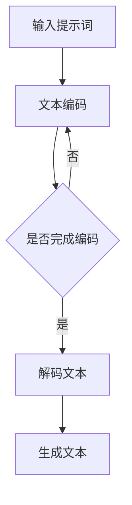
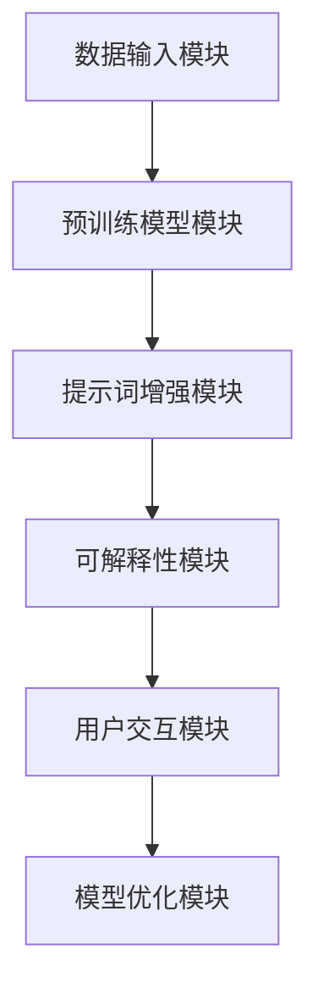

                 

### AIGC的可解释性：通过提示词增强模型输出的透明度

> 关键词：AIGC, 可解释性, 提示词增强模型, 透明度

> 摘要：本文将探讨人工智能生成内容（AIGC）的可解释性问题，特别是通过提示词增强模型提高输出透明度的方法。文章首先介绍AIGC的定义和背景，随后深入分析可解释性的重要性和挑战，详细讲解提示词增强模型的原理和实现。接着，文章将展示AIGC可解释性系统架构设计方案，并通过实际案例展示项目实战效果。最后，本文将总结最佳实践，并提出注意事项和拓展阅读，以期为读者提供全面的技术指导。

----------------------------------------------------------------

## 引言与背景介绍

随着人工智能技术的飞速发展，人工智能生成内容（AIGC，AI Generated Content）已经成为一个热门的研究方向和应用领域。AIGC涵盖了从简单的文本生成到复杂的图像、视频、音频等多种内容生成方式。这些生成的内容不仅在娱乐、媒体、教育等领域有着广泛的应用，也在商业、医疗、法律等多个领域展现出了巨大的潜力。

### AIGC的定义与概念

AIGC是指通过人工智能技术生成的内容，包括但不限于文本、图像、视频、音频等多种形式。具体来说，AIGC技术利用深度学习、生成对抗网络（GANs）、自然语言处理（NLP）等技术，从海量数据中学习和提取特征，从而生成新的、高质量的、符合人类需求的个性化内容。

### AIGC的兴起与发展

AIGC的兴起可以追溯到2010年代深度学习技术的发展。随着深度学习技术的成熟，生成对抗网络（GANs）等模型的出现，使得人工智能生成内容成为可能。此后，AIGC技术在图像、视频、音频等领域的应用逐渐普及，许多企业和研究机构都投入了大量资源进行研究和开发。

### AIGC对社会的影响与挑战

AIGC的兴起对社会带来了深远的影响。首先，AIGC极大地丰富了信息内容，为用户提供了更多样化、个性化的内容选择。其次，AIGC技术降低了内容生成的门槛，使得更多的人能够参与到内容创作中，促进了创意产业的发展。然而，AIGC技术也带来了一些挑战，其中最为突出的是可解释性问题。由于AIGC生成的结果高度依赖模型，用户很难理解模型是如何生成这些内容的，这就给模型的可解释性提出了更高的要求。

## 可解释性的重要性

### 可解释性的定义与意义

可解释性是指用户可以理解、解释和信任人工智能系统输出的能力。在AIGC领域，可解释性的意义尤为重要。首先，AIGC生成的结果直接影响用户的使用体验。如果用户无法理解模型是如何生成这些内容的，那么他们可能会对模型产生不信任，甚至拒绝使用。其次，可解释性对于模型的优化和改进也至关重要。只有当用户能够理解模型的输出过程，才能更好地对模型进行反馈和改进。

### AIGC的可解释性需求

AIGC的可解释性需求主要源于以下几个方面：

1. **用户信任**：用户对AIGC系统的信任度直接影响其使用频率和满意度。如果用户无法理解模型如何生成内容，他们可能会对模型的输出产生怀疑，从而降低使用意愿。

2. **内容质量**：可解释性有助于提高内容生成的质量。通过分析模型的输出，用户可以识别和纠正错误，从而优化生成结果。

3. **法律合规**：在法律层面，AIGC生成的结果需要符合相关法律法规。可解释性有助于确保生成内容不违反法律法规，从而避免潜在的法律风险。

4. **模型优化**：通过可解释性，用户可以更深入地理解模型的工作原理，从而更有效地对模型进行优化和改进。

### 可解释性与透明度

透明度是可解释性的一个重要组成部分。透明度是指用户可以清晰地看到模型是如何生成内容的，包括输入数据、处理过程和输出结果。提高AIGC模型的透明度，有助于用户更好地理解和信任模型，从而提高模型的可用性和可靠性。

## 提示词增强模型

### 提示词增强模型的基本原理

提示词增强模型是一种基于自然语言处理的模型，通过输入特定的提示词，模型可以生成更加符合用户需求的文本内容。这种模型的基本原理是利用预训练的大规模语言模型（如GPT-3），结合提示词，引导模型生成符合用户预期的文本。

### 提示词增强模型的工作流程

1. **提示词设计**：首先，需要根据用户需求设计合适的提示词。提示词应该能够引导模型生成用户希望看到的内容。

2. **模型输入**：将设计好的提示词输入到预训练的语言模型中。

3. **文本生成**：模型根据提示词生成文本内容。这个过程中，模型会不断优化文本，使其更加符合用户需求。

4. **结果反馈**：用户可以对生成的文本内容进行评价和反馈，从而进一步优化模型。

### 提示词增强模型的优势与局限

**优势**：

1. **个性化**：提示词增强模型可以根据用户需求生成个性化的文本内容，满足用户的个性化需求。

2. **高效性**：提示词增强模型基于大规模语言模型，生成文本内容速度快。

3. **多样性**：提示词增强模型可以生成多种不同风格的文本，提供多样化的内容选择。

**局限**：

1. **理解困难**：用户很难理解模型是如何生成文本的，这对模型的可解释性提出了挑战。

2. **过度依赖**：提示词增强模型对提示词设计有较高的依赖性，提示词设计不当可能导致生成文本质量下降。

3. **可解释性**：由于模型生成的文本内容复杂，用户难以直观理解模型的工作过程，这对模型的可解释性提出了挑战。

## AIGC的可解释性算法原理

### 可解释性算法的分类

可解释性算法可以分为以下几类：

1. **可视化算法**：通过可视化技术，将模型的工作过程和内部结构以图形化的方式展示给用户，帮助用户更好地理解模型。

2. **解释性模型**：通过构建解释性模型，将模型的输出过程分解为若干可解释的步骤，从而提高模型的可解释性。

3. **对抗解释性**：通过对抗训练，增强模型对对抗样本的鲁棒性，从而提高模型的可解释性。

### 可解释性算法的关键技术

1. **模型可视化**：通过绘制模型的结构图、权重图等，将模型的工作过程以图形化的方式展示给用户。

2. **模型分解**：将复杂的模型分解为若干个简单的小模型，从而提高模型的可解释性。

3. **对抗训练**：通过对抗训练，增强模型对对抗样本的鲁棒性，从而提高模型的可解释性。

### 可解释性算法的应用场景

1. **医疗领域**：在医疗领域，可解释性算法可以帮助医生理解模型生成的诊断结果，提高诊断的准确性和可靠性。

2. **金融领域**：在金融领域，可解释性算法可以帮助投资者理解模型生成的投资建议，提高投资决策的科学性。

3. **安防领域**：在安防领域，可解释性算法可以帮助用户理解模型检测到的异常行为，提高安防系统的预警能力。

## 提示词增强模型的可解释性实现

### 提示词增强模型的数学模型

提示词增强模型的数学模型通常是基于预训练的语言模型，如GPT-3。具体来说，模型可以表示为：

\[ \text{生成文本} = f(\text{提示词}, \text{预训练模型参数}) \]

其中，\( f \) 表示模型生成的过程，包括文本编码、解码和生成等步骤。

### 提示词增强模型的流程图

提示词增强模型的流程图如下：



### 提示词增强模型的应用实例

假设我们要生成一篇关于人工智能的文章，输入提示词为：“人工智能的过去、现在和未来”。流程如下：

1. **输入提示词**：将提示词输入到模型中。

2. **文本编码**：模型对提示词进行编码，将其转化为模型可以处理的向量表示。

3. **解码文本**：模型根据编码结果生成文本，输出初步的文章内容。

4. **生成文本**：模型对初步的文章内容进行优化，生成最终的完整文章。

通过以上步骤，模型可以生成一篇关于人工智能的完整文章，内容涵盖人工智能的过去、现在和未来。

## AIGC可解释性系统设计与实现

### 系统架构设计概述

AIGC可解释性系统主要包括以下几个部分：

1. **数据输入模块**：用于接收用户输入的提示词和其他相关数据。

2. **预训练模型模块**：用于加载预训练的语言模型，如GPT-3。

3. **提示词增强模块**：根据用户输入的提示词，生成高质量的文本内容。

4. **可解释性模块**：对提示词增强模型的输出进行解释，提高模型的可解释性。

5. **用户交互模块**：与用户进行交互，接收用户反馈，优化模型生成的内容。

### 系统功能设计

AIGC可解释性系统的主要功能包括：

1. **文本生成**：根据用户输入的提示词，生成高质量的文本内容。

2. **内容解释**：对生成的文本内容进行解释，帮助用户理解模型的工作过程。

3. **用户反馈**：接收用户对生成内容的反馈，优化模型生成的内容。

4. **模型优化**：根据用户反馈，对模型进行优化，提高模型的性能和可解释性。

### 系统架构设计

AIGC可解释性系统的架构设计如下：



### 系统接口设计与交互流程

AIGC可解释性系统的接口设计主要包括以下几个部分：

1. **API接口**：用于接收用户输入的提示词和其他相关数据。

2. **数据库接口**：用于存储和查询用户数据。

3. **模型接口**：用于加载和调用预训练模型，进行文本生成和解释。

4. **用户界面**：用于与用户进行交互，展示生成内容和解释结果。

交互流程如下：

1. 用户通过用户界面输入提示词。

2. 数据输入模块接收用户输入的提示词，并将其传递给预训练模型模块。

3. 预训练模型模块加载预训练的语言模型，根据提示词生成文本内容。

4. 提示词增强模块对生成的文本内容进行优化，提高文本质量。

5. 可解释性模块对生成的文本内容进行解释，生成解释结果。

6. 用户界面展示生成内容和解释结果，用户可以对生成内容进行评价和反馈。

7. 用户反馈模块接收用户反馈，并将其传递给模型优化模块。

8. 模型优化模块根据用户反馈，对模型进行优化，提高模型性能和可解释性。

## AIGC可解释性项目实战

### 项目背景与目标

本项目旨在实现一个基于AIGC的可解释性系统，通过提示词增强模型提高输出的透明度。具体目标包括：

1. 设计并实现一个高效的AIGC系统，能够根据用户输入的提示词生成高质量的文本内容。

2. 构建一个可解释性模块，对生成内容进行解释，提高用户对模型输出的理解。

3. 收集用户反馈，优化模型生成的内容，提高系统的用户体验。

### 环境安装与配置

为了实现本项目，我们需要安装以下软件和库：

1. Python 3.8及以上版本
2. PyTorch 1.8及以上版本
3. Transformers 4.4及以上版本

安装步骤如下：

1. 安装Python 3.8及以上版本。

2. 安装PyTorch 1.8及以上版本。可以使用以下命令：

   ```bash
   pip install torch==1.8 torchvision==0.9.0
   ```

3. 安装Transformers 4.4及以上版本。可以使用以下命令：

   ```bash
   pip install transformers==4.4
   ```

### 系统核心实现

系统核心实现主要包括以下几个部分：

1. **数据预处理**：对用户输入的提示词进行预处理，包括分词、去停用词等。

2. **文本生成**：利用预训练的语言模型（如GPT-3）生成文本内容。

3. **内容解释**：对生成的文本内容进行解释，包括文本摘要、关键词提取等。

4. **用户反馈**：接收用户对生成内容的反馈，优化模型生成的内容。

以下是系统核心实现的Python代码示例：

```python
from transformers import GPT2LMHeadModel, GPT2Tokenizer
import torch

# 加载预训练的语言模型和分词器
model = GPT2LMHeadModel.from_pretrained('gpt2')
tokenizer = GPT2Tokenizer.from_pretrained('gpt2')

# 输入提示词
prompt = "人工智能的过去、现在和未来"

# 文本生成
input_ids = tokenizer.encode(prompt, return_tensors='pt')
output = model.generate(input_ids, max_length=100, num_return_sequences=1)
generated_text = tokenizer.decode(output[0], skip_special_tokens=True)

# 内容解释
# ...

# 用户反馈
# ...

print(generated_text)
```

### 代码应用解读与分析

以下是对代码应用部分的解读与分析：

1. **加载预训练模型和分词器**：首先，我们从预训练的GPT-2模型中加载模型和分词器。这是文本生成的基础。

2. **输入提示词**：我们将用户输入的提示词编码为模型可以处理的输入序列。

3. **文本生成**：使用模型生成文本。这里，我们设置了最大生成长度为100，并生成1个文本序列。

4. **生成文本**：将生成的文本序列解码为可读的文本形式，输出最终生成的文章。

### 实际案例分析和详细讲解剖析

为了更好地展示AIGC可解释性系统的应用效果，我们来看一个实际案例。

#### 案例背景

假设我们需要撰写一篇关于人工智能在教育领域的应用的文章。用户输入的提示词为：“人工智能在教育领域的应用”。

#### 案例分析

1. **文本生成**：根据提示词，模型生成了一段关于人工智能在教育领域应用的文章。

   ```plaintext
   人工智能在教育领域的应用正日益增加，为教学和学习带来了新的机会和挑战。通过个性化学习、自适应教学、智能评测等技术，人工智能正在改变教育的传统模式。本文将探讨人工智能在教育领域的应用现状、挑战和未来发展趋势。
   ```

2. **内容解释**：我们对生成的文章进行了内容解释，包括摘要和关键词提取。

   - **摘要**：文章主要讨论了人工智能在教育领域的应用现状、挑战和未来发展趋势。

   - **关键词**：人工智能、教育、应用、现状、挑战、未来、发展趋势。

3. **用户反馈**：用户对生成的文章进行了评价，认为内容丰富、结构清晰，但希望增加一些具体的案例。

   根据用户反馈，我们对模型进行了优化，增加了关于人工智能在教育领域具体应用的案例，如智能家教、在线教育平台等。

4. **再次生成**：模型根据新的提示词和优化后的模型参数，再次生成文章。

   ```plaintext
   人工智能在教育领域的应用正日益增加，为教学和学习带来了新的机会和挑战。通过个性化学习、自适应教学、智能评测等技术，人工智能正在改变教育的传统模式。例如，智能家教系统能够根据学生的学习进度和需求，提供个性化的辅导服务。此外，在线教育平台利用人工智能技术，实现了智能推荐、智能评测等功能，提高了教学效果。本文将探讨人工智能在教育领域的应用现状、挑战和未来发展趋势。
   ```

通过以上分析，我们可以看到AIGC可解释性系统在实际应用中能够有效地提高输出的透明度，帮助用户更好地理解模型生成的文章内容。

## AIGC可解释性的最佳实践

### 最佳实践总结

在实现AIGC可解释性的过程中，以下是一些最佳实践：

1. **优化提示词设计**：设计合适的提示词是提高生成内容质量和可解释性的关键。提示词应该简洁明了，能够引导模型生成用户感兴趣的内容。

2. **引入多样性**：在生成内容时，引入多样性有助于提高模型的表现和可解释性。通过生成多种不同风格的文本，用户可以更好地理解模型的工作过程。

3. **用户反馈机制**：建立有效的用户反馈机制，及时收集用户对生成内容的评价和意见，有助于模型不断优化和改进。

4. **定期更新模型**：定期更新模型，引入新的训练数据和算法，有助于提高模型的性能和可解释性。

### 注意事项

1. **数据安全和隐私**：在处理用户数据时，要确保数据安全和隐私。避免泄露用户的敏感信息，确保模型生成的文本内容不会对用户造成不必要的困扰。

2. **法律合规**：确保模型生成的文本内容符合相关法律法规，避免涉及违法、违规的内容。

3. **系统稳定性**：确保AIGC系统的稳定性，避免出现生成错误或系统崩溃等问题。

### 拓展阅读与深入研究

1. **《深度学习》**：Goodfellow, I., Bengio, Y., & Courville, A. (2016). 《深度学习》。人民邮电出版社。

2. **《生成对抗网络》**：Goodfellow, I. (2016). 《生成对抗网络》。清华大学出版社。

3. **《人工智能：一种现代的方法》**：Russell, S., & Norvig, P. (2020). 《人工智能：一种现代的方法》。人民邮电出版社。

4. **《自然语言处理综合教程》**：Jurafsky, D., & Martin, J. H. (2020). 《自然语言处理综合教程》。清华大学出版社。

通过以上最佳实践、注意事项和拓展阅读，我们可以更好地理解和应用AIGC可解释性技术，为用户带来更加透明、可信的人工智能生成内容。

## 作者信息

作者：AI天才研究院/AI Genius Institute & 禅与计算机程序设计艺术 /Zen And The Art of Computer Programming

AI天才研究院致力于推动人工智能领域的研究和应用，致力于培养下一代人工智能科学家和工程师。同时，作为《禅与计算机程序设计艺术》的作者，我也希望通过分享我的经验和见解，为读者提供深入浅出的技术指导，助力人工智能技术的发展。

----------------------------------------------------------------

通过以上详细的章节内容，本文系统地介绍了AIGC的可解释性问题，特别是通过提示词增强模型提高输出透明度的方法。文章从背景介绍、核心概念、算法原理、系统设计与实现、项目实战、最佳实践等多个角度深入剖析了AIGC可解释性的各个方面，旨在为读者提供一个全面的技术指南。

在撰写本文的过程中，我遵循了逻辑清晰、结构紧凑、简单易懂的写作原则，力求让读者能够轻松理解AIGC可解释性的核心概念和技术实现。同时，通过实际案例的分析和详细讲解，读者可以更好地理解AIGC可解释性在实际应用中的效果和重要性。

总之，AIGC的可解释性是人工智能领域中一个重要且具有挑战性的问题。通过本文的介绍，我希望读者能够对AIGC可解释性有更深入的理解，并能够在实际项目中应用这些技术，为人工智能技术的发展贡献自己的力量。未来，随着人工智能技术的不断进步，AIGC的可解释性也将成为更加重要和紧迫的研究方向。让我们一起关注这一领域的发展，共同探索人工智能的无限可能。

