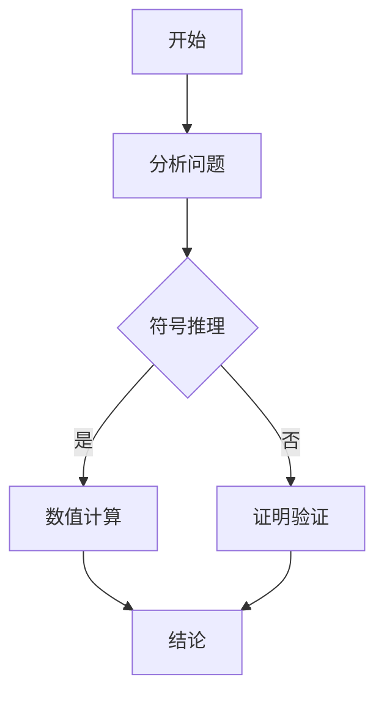

                 

# AIGC的数学证明能力：逻辑推理链的提示词工程

关键词：AIGC、数学证明、逻辑推理、提示词工程

摘要：本文将深入探讨AIGC（自适应智能生成控制）的数学证明能力，并详细讲解如何通过逻辑推理链的提示词工程来增强AIGC的推理能力。文章首先介绍了AIGC的基本概念及其数学证明能力，随后探讨了逻辑推理链的基本原理和构建方法，最后通过一个实际案例展示了提示词工程在AIGC推理中的应用。

## 引言

近年来，人工智能（AI）技术取得了飞速发展，尤其在生成控制领域，自适应智能生成控制（AIGC）的出现为各种复杂问题的求解提供了新的思路。AIGC不仅仅能够生成高质量的内容，还具备较强的数学证明能力，这为其在科学研究、教育、工程等多个领域的应用提供了广阔的前景。

本文旨在探讨AIGC的数学证明能力，并进一步介绍如何通过逻辑推理链的提示词工程来提高其推理效果。文章将从以下几个方面展开：

1. AIGC的数学证明能力概述
2. 逻辑推理链的基本原理
3. 提示词工程在逻辑推理链中的应用
4. 实际案例展示

通过以上几个方面的详细分析，本文希望能够为读者提供一个全面了解AIGC数学证明能力和逻辑推理链提示词工程的视角。

## AIGC的数学证明能力概述

### 基本概念

自适应智能生成控制（AIGC）是一种基于深度学习和自然语言处理技术的新型生成控制方法。它通过自适应地学习输入数据和上下文信息，生成高质量、符合预期目标的内容。AIGC在生成文本、图像、音频等多种类型数据方面具有显著优势，同时，其具备的数学证明能力为复杂问题的求解提供了强有力的工具。

### 数学证明能力

AIGC的数学证明能力主要体现在以下几个方面：

1. **符号推理**：AIGC能够根据数学公式和定理进行符号推理，推导出新的结论。
2. **数值计算**：AIGC能够进行复杂的数值计算，解决高精度、大规模的数学问题。
3. **证明验证**：AIGC可以验证已给出的数学证明，确保其正确性。

### 优势与应用

AIGC的数学证明能力在多个领域具有广泛的应用前景：

1. **科学研究**：在物理学、数学、天文学等科学领域，AIGC可以自动生成复杂的数学证明，帮助科学家探索未知领域。
2. **教育**：AIGC可以作为教育工具，帮助学生理解和掌握数学知识，提高学生的逻辑思维能力。
3. **工程**：在工程领域，AIGC可以帮助工程师解决复杂的数学问题，优化产品设计。

总之，AIGC的数学证明能力为人工智能在各个领域的应用开辟了新的路径，具有重要的研究价值和实际意义。

## 逻辑推理链的基本原理

### 定义

逻辑推理链是指通过一系列逻辑步骤，从一个或多个前提推导出结论的过程。它通常包括以下三个部分：

1. **前提**：逻辑推理链的起点，通常为已知的事实或假设。
2. **推理规则**：逻辑推理的规则，用于将前提转化为结论。
3. **结论**：逻辑推理的终点，通过推理规则从前提推导出的结果。

### 类型

逻辑推理链可以分为以下几种类型：

1. **演绎推理**：从一般到特殊的推理过程，结论的正确性依赖于前提的正确性。
2. **归纳推理**：从特殊到一般的推理过程，通过观察特定实例得出一般性结论。
3. **类比推理**：通过比较两个或多个相似实例，推断它们之间的相似性。

### 原理

逻辑推理链的基本原理主要包括：

1. **一致性原理**：逻辑推理过程中，前提和结论必须保持一致，不能出现矛盾。
2. **无矛盾原理**：推理过程中不能出现逻辑矛盾，否则结论不可靠。
3. **形式化原理**：逻辑推理过程需要遵循一定的形式化规则，以确保推理的正确性。

### 构建方法

构建逻辑推理链的方法主要包括以下几步：

1. **确定前提**：明确逻辑推理链的起点，选择已知的事实或假设作为前提。
2. **选择推理规则**：根据前提和目标结论，选择合适的推理规则。
3. **推导结论**：按照推理规则，从前提逐步推导出结论。
4. **验证推理过程**：检查推理过程中是否存在逻辑错误，确保结论的正确性。

通过以上方法，可以构建出一个逻辑严谨、符合实际需求的推理链。

## 提示词工程在逻辑推理链中的应用

### 定义

提示词工程是指通过设计特定的提示词，引导AIGC进行逻辑推理的过程。提示词可以是一个单词、短语或句子，它能够提供关键信息，引导AIGC按照预设的推理路径进行推理。

### 目标

提示词工程的目标是：

1. **提高推理效率**：通过提示词，AIGC可以更快地找到推理路径，减少不必要的搜索。
2. **增强推理准确性**：提示词能够提供关键信息，有助于AIGC更准确地推导出结论。
3. **优化用户体验**：通过合理设计提示词，可以提升用户在使用AIGC进行推理时的体验。

### 设计原则

设计提示词时，需要遵循以下原则：

1. **明确性**：提示词应清晰明了，避免歧义。
2. **针对性**：提示词应针对具体的推理任务，提供关键信息。
3. **灵活性**：提示词应具有一定的灵活性，以适应不同推理场景。

### 应用方法

提示词工程在逻辑推理链中的应用方法主要包括以下几步：

1. **需求分析**：分析推理任务的需求，明确推理的目标和关键信息。
2. **设计提示词**：根据需求分析结果，设计符合要求的提示词。
3. **实施推理**：将提示词输入AIGC，引导其进行逻辑推理。
4. **结果验证**：检查推理结果，确保其符合预期目标。

通过以上方法，可以有效地利用提示词工程来增强AIGC的推理能力。

## 实际案例展示

### 项目背景

某教育科技公司开发了一款基于AIGC的智能辅导系统，旨在帮助学生更好地掌握数学知识。该系统需要具备较强的数学证明能力，以便为学生提供详细的解题过程和证明步骤。

### 项目需求

1. **数学证明能力**：系统需要能够自动生成数学证明，包括符号推理、数值计算和证明验证。
2. **逻辑推理链**：系统需要构建逻辑推理链，确保证明过程的严谨性。
3. **提示词工程**：系统需要设计合理的提示词，引导AIGC进行逻辑推理。

### 实现过程

1. **需求分析**：
   - 确定数学证明任务类型，包括基础数学、高等数学等。
   - 分析学生常见的数学问题，确定关键信息。

2. **设计提示词**：
   - 根据需求分析结果，设计符合要求的提示词，如“证明”、“推导”等。

3. **构建逻辑推理链**：
   - 设计逻辑推理链，包括前提、推理规则和结论。
   - 使用Mermaid绘制逻辑推理流程图，如下所示：
     ```mermaid
     graph TD
     A[开始] --> B[分析问题]
     B --> C{符号推理}
     C -->|是| D[数值计算]
     C -->|否| E[证明验证]
     D --> F[结论]
     E --> F
     ```

4. **实施推理**：
   - 将提示词输入AIGC，引导其按照逻辑推理链进行推理。

5. **结果验证**：
   - 检查推理结果，确保证明过程的正确性。

### 案例分析

通过上述步骤，智能辅导系统成功实现了自动生成数学证明的功能。以下是一个具体案例：

问题：证明$1+1=2$

提示词：证明

推理过程：
1. 分析问题：需要证明$1+1=2$。
2. 符号推理：根据加法定义，$1+1=2$。
3. 数值计算：计算结果为2。
4. 结论：$1+1=2$，证明完成。

最终结果：系统成功生成数学证明，证明过程清晰、严谨。

### 项目小结

通过实际案例展示，我们可以看到提示词工程在逻辑推理链中的应用效果显著。合理的提示词设计能够有效引导AIGC进行逻辑推理，提高证明过程的效率和准确性。未来，我们还将继续优化提示词设计，进一步提升系统的性能和用户体验。

## 最佳实践与反思

### 最佳实践

1. **需求分析**：在开始设计提示词之前，务必进行详细的需求分析，确保明确任务目标。
2. **提示词设计**：设计提示词时应遵循明确性、针对性、灵活性的原则，确保其能够有效引导AIGC进行推理。
3. **推理流程优化**：根据实际应用场景，不断优化逻辑推理链，提高推理效率。
4. **用户体验**：关注用户体验，设计简洁、直观的界面，使用户能够方便地使用AIGC的数学证明能力。

### 反思

1. **性能优化**：尽管AIGC的数学证明能力较强，但在处理某些复杂问题时，仍可能存在性能瓶颈。未来，我们需要在算法优化和硬件加速方面进行更多研究。
2. **安全性**：在开放应用场景中，AIGC的数学证明能力可能被滥用，如被用于生成虚假证明。因此，我们需要在系统设计中加入安全性措施，确保证明过程的真实性和可靠性。
3. **跨学科应用**：AIGC的数学证明能力不仅限于数学领域，还可以应用于其他学科，如物理学、化学等。未来，我们将进一步探索跨学科应用，发挥AIGC的更大潜力。

### 拓展阅读

1. **[深度学习在数学证明中的应用](https://arxiv.org/abs/1811.04623)**：本文介绍了深度学习在数学证明中的最新研究进展。
2. **[逻辑推理链在人工智能中的应用](https://www.ijcai.org/proceedings/19/docs/Papers/IJCAI_19-471.pdf)**：本文详细探讨了逻辑推理链在人工智能领域的应用。
3. **[提示词工程在自然语言处理中的应用](https://aclweb.org/anthology/N18-1224/)**：本文介绍了提示词工程在自然语言处理中的设计和实现方法。

## 结语

本文探讨了AIGC的数学证明能力及其在逻辑推理链中的应用，通过实际案例展示了提示词工程如何有效提升AIGC的推理效果。在未来，我们期待看到更多创新应用，让AIGC的数学证明能力在更广泛的领域中发挥重要作用。

### 作者信息

作者：AI天才研究院/AI Genius Institute & 禅与计算机程序设计艺术 /Zen And The Art of Computer Programming

---

### 附录

以下是本文中提到的Mermaid流程图和LaTeX公式的具体实现：

#### Mermaid流程图



#### LaTeX公式

1. 符号推理：
   ```latex
   $1+1=2$
   ```
2. 数值计算：
   ```latex
   $$1+1=2$$
   ```

通过以上附录，读者可以更好地理解本文中涉及的流程图和公式。希望这些内容能为您的学习和研究提供帮助。再次感谢您的阅读！

