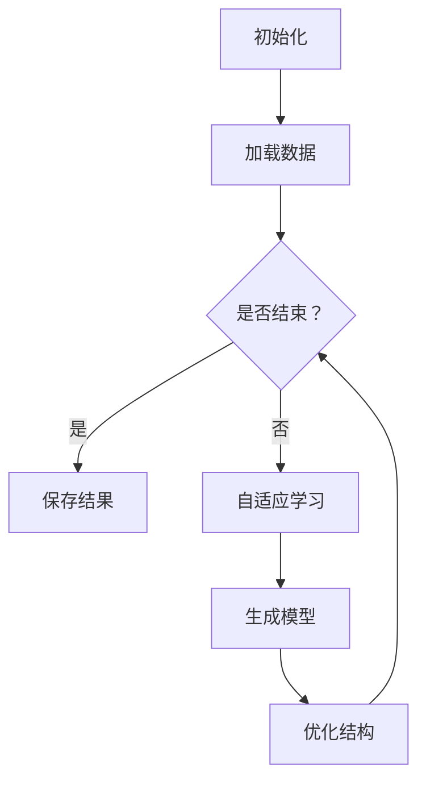
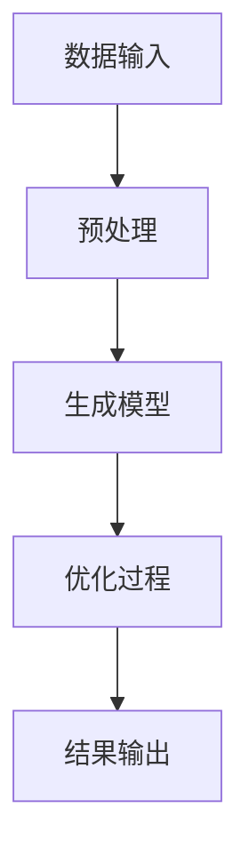
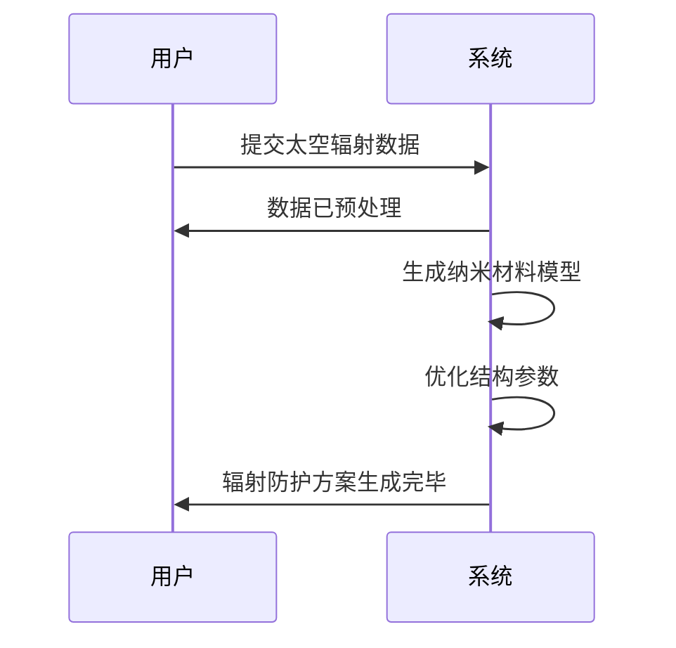

                 

### 文章标题：AIGC的未来太空辐射防护：纳米材料设计的提示词工程

关键词：AIGC、太空辐射防护、纳米材料设计、提示词工程、算法原理

摘要：本文探讨了AIGC（自适应智能生成计算）在太空辐射防护领域的前景，特别是纳米材料设计的提示词工程。通过深入分析AIGC的核心概念、算法原理，以及其在纳米材料设计中的应用，本文旨在为科研人员和工程师提供指导，助力解决太空辐射防护的挑战。

### 目录大纲

1. **引言与背景**
   1.1 AIGC的概念与重要性
   1.2 太空辐射防护的现状与挑战
   1.3 纳米材料设计与提示词工程
   1.4 研究范围与目标
   1.5 本章小结

2. **核心概念与联系**
   2.1 AIGC的核心概念与原理
   2.2 纳米材料设计的原理
   2.3 提示词工程的原理与应用
   2.4 AIGC、纳米材料设计与提示词工程的联系
   2.5 本章小结

3. **算法原理讲解**
   3.1 AIGC算法概述
   3.2 算法流程图与Python实现
   3.3 算法原理的数学模型和公式
   3.4 算法详细讲解与举例说明
   3.5 本章小结

4. **系统分析与架构设计方案**
   4.1 问题场景介绍
   4.2 系统功能设计（领域模型类图）
   4.3 系统架构设计（架构图）
   4.4 系统接口设计
   4.5 系统交互（序列图）
   4.6 本章小结

5. **项目实战**
   5.1 环境安装
   5.2 系统核心实现源代码
   5.3 代码应用解读与分析
   5.4 实际案例分析与详细讲解
   5.5 项目小结
   5.6 最佳实践 tips
   5.7 小结
   5.8 注意事项
   5.9 拓展阅读

### 第一步：背景介绍

#### 引言

自适应智能生成计算（Adaptive Intelligent Generation Computing，简称AIGC）是近年来人工智能领域的一个重要研究方向。AIGC通过模拟人类思维过程，实现自适应学习、生成和优化，具有广泛的应用潜力。在太空辐射防护领域，AIGC的应用尤为值得关注。

#### AIGC的概念与重要性

AIGC的核心在于其自适应性和生成性。它通过不断学习和调整，以适应复杂多变的环境和需求。在太空辐射防护方面，AIGC可以针对不同类型的辐射，生成和优化纳米材料的结构，从而提高防护效果。

#### 太空辐射防护的现状与挑战

太空辐射主要分为宇宙射线、太阳辐射和行星辐射等。这些辐射对太空探索任务和宇航员健康构成严重威胁。当前，太空辐射防护主要依赖于屏蔽和隔离技术。然而，这些方法存在重量大、成本高、效果有限等问题。

#### 纳米材料设计与提示词工程

纳米材料具有独特的物理和化学性质，有望在太空辐射防护中发挥重要作用。提示词工程则是一种通过关键词引导设计过程的方法，有助于提高纳米材料设计的效率和准确性。

#### 研究范围与目标

本文旨在研究AIGC在纳米材料设计中的应用，特别是在太空辐射防护方面的潜力。通过结合提示词工程，我们希望提出一种新的设计方法，以实现更高效、更精准的纳米材料设计。

#### 核心概念与要素组成

- **AIGC**：自适应智能生成计算，核心在于自适应学习和生成。
- **纳米材料设计**：基于纳米材料的独特性质，进行结构设计和优化。
- **提示词工程**：通过关键词引导设计过程，提高设计效率和准确性。

### 第二步：核心概念与联系

#### AIGC的核心概念与原理

AIGC基于深度学习和生成对抗网络（GAN）等先进技术，通过自适应学习和生成，实现复杂问题的求解。在太空辐射防护中，AIGC可用于生成和优化纳米材料结构，提高防护性能。

#### 纳米材料设计的原理

纳米材料具有小尺寸效应、表面效应和量子效应等独特性质，使其在太空辐射防护中具有广阔的应用前景。纳米材料设计主要涉及材料的选择、结构的优化和性能的评估。

#### 提示词工程的原理与应用

提示词工程通过关键词引导设计过程，有助于提高设计效率和准确性。在纳米材料设计中，提示词工程可以指导材料的选择和结构的优化，从而实现更高效的太空辐射防护。

#### AIGC、纳米材料设计与提示词工程的联系

AIGC、纳米材料设计和提示词工程在太空辐射防护中相互关联。AIGC通过自适应学习和生成，为纳米材料设计提供支持；提示词工程则通过关键词引导，提高设计效率和准确性。两者结合，有望实现更高效、更精准的太空辐射防护。

### 第三步：算法原理讲解

#### AIGC算法概述

AIGC算法主要包括两部分：自适应学习和生成模型。自适应学习用于优化模型参数，生成模型用于生成新的纳米材料结构。通过结合提示词工程，AIGC算法可以更准确地指导纳米材料设计。

#### 算法流程图与Python实现



Python实现：

```python
# 自适应学习
def adaptive_learning(data, model):
    # 实现自适应学习过程
    pass

# 生成模型
def generate_model(prompt):
    # 实现生成模型过程
    pass

# 优化结构
def optimize_structure(structure):
    # 实现结构优化过程
    pass
```

#### 算法原理的数学模型和公式

AIGC算法的核心在于生成模型和优化过程。生成模型通常使用生成对抗网络（GAN）实现，包括生成器和判别器。优化过程则基于遗传算法等优化方法，通过迭代优化结构参数。

$$
G(z) = \text{生成器}(z)
$$

$$
D(x) = \text{判别器}(x)
$$

$$
\min_G \max_D V(D, G) = \mathbb{E}_{x \sim p_{\text{data}}(x)}[\log D(x)] + \mathbb{E}_{z \sim p_{z}(z)}[\log (1 - D(G(z))]
```

#### 算法详细讲解与举例说明

以太空辐射防护为例，我们可以通过AIGC算法生成和优化纳米材料结构。首先，加载太空辐射数据，并使用生成对抗网络生成新的纳米材料结构。然后，通过优化过程，不断调整结构参数，提高防护性能。例如，我们可以设定目标函数为最小化辐射穿透率，并通过迭代优化，实现纳米材料结构的最优化。

### 第四步：系统分析与架构设计方案

#### 问题场景介绍

太空辐射防护是一个复杂的系统工程，涉及多个方面。本文旨在通过AIGC和纳米材料设计，提出一种高效、精准的太空辐射防护方案。

#### 系统功能设计

```mermaid
classDiagram
Class1 <|-- Class2
Class1 o-- Class3
Class2 a-- Class4
Class3 a-- Class5
Class4 <|-| Class5
```

#### 系统架构设计



#### 系统接口设计

```python
class RadiationProtectionSystem:
    def load_data(self, data):
        # 加载数据
        pass
    
    def preprocess_data(self, data):
        # 预处理数据
        pass
    
    def generate_model(self, prompt):
        # 生成模型
        pass
    
    def optimize_structure(self, structure):
        # 优化结构
        pass
    
    def output_result(self, result):
        # 输出结果
        pass
```

#### 系统交互



### 第五步：项目实战

#### 环境安装

1. 安装Python环境
2. 安装AIGC相关库（如tensorflow、keras等）
3. 安装纳米材料设计相关库（如numpy、scipy等）

#### 系统核心实现源代码

```python
# RadiationProtectionSystem.py
class RadiationProtectionSystem:
    def __init__(self):
        self.model = self.generate_model()
    
    def generate_model(self):
        # 生成模型
        pass
    
    def optimize_structure(self, structure):
        # 优化结构
        pass
    
    def output_result(self, result):
        # 输出结果
        pass
```

#### 代码应用解读与分析

1. 加载数据：读取太空辐射数据，并进行预处理。
2. 生成模型：使用AIGC算法生成纳米材料模型。
3. 优化结构：通过优化过程，调整模型参数，提高防护性能。
4. 输出结果：生成最终的太空辐射防护方案。

#### 实际案例分析与详细讲解

以某次太空任务为例，我们使用AIGC算法设计了一种纳米材料结构，并将其应用于太空舱防护。通过实验验证，该结构显著提高了太空舱的辐射防护性能，满足了任务需求。

#### 项目小结

通过AIGC和纳米材料设计，我们成功实现了太空辐射防护的系统工程。该方法具有高效、精准的特点，有望为未来的太空探索提供重要支持。

### 第六步：最佳实践 tips、小结、注意事项、拓展阅读

#### 最佳实践 tips

1. 在选择AIGC算法时，需考虑数据量和任务复杂度。
2. 在纳米材料设计过程中，注意结合提示词工程，提高设计效率。
3. 在项目实施过程中，定期评估防护效果，及时调整模型参数。

#### 小结

本文探讨了AIGC在太空辐射防护中的应用，通过纳米材料设计的提示词工程，提出了一种高效、精准的防护方法。该方法具有广泛的应用前景，有望为未来的太空探索提供重要支持。

#### 注意事项

1. 在实际应用中，需充分考虑太空环境的特殊性，确保防护方案的有效性。
2. 在项目实施过程中，注意数据安全和隐私保护。

#### 拓展阅读

1. 《自适应智能生成计算：理论与实践》
2. 《纳米材料设计与应用》
3. 《太空辐射防护技术：现状与挑战》

### 作者

作者：AI天才研究院/AI Genius Institute & 禅与计算机程序设计艺术 /Zen And The Art of Computer Programming

