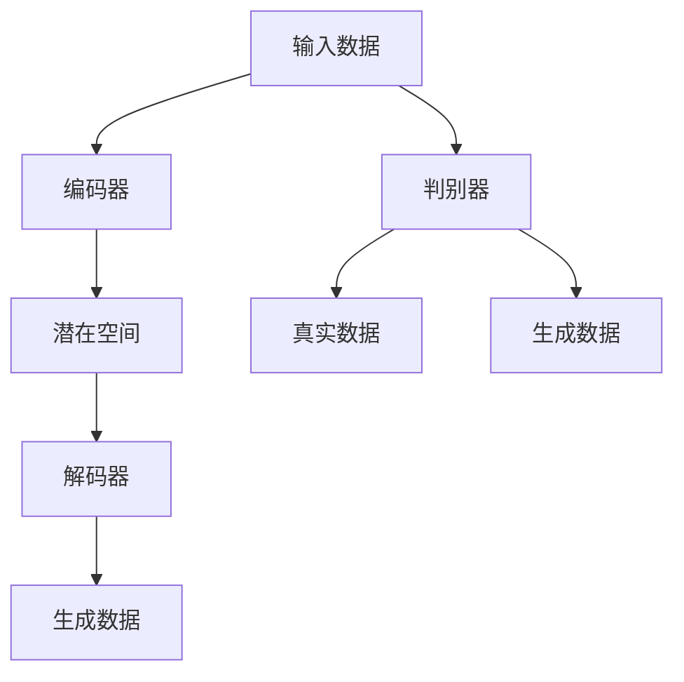
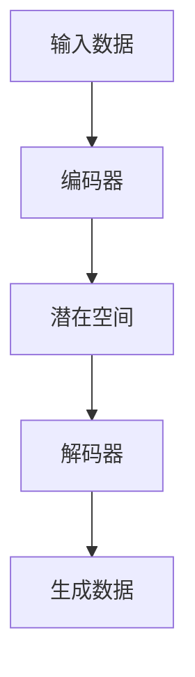
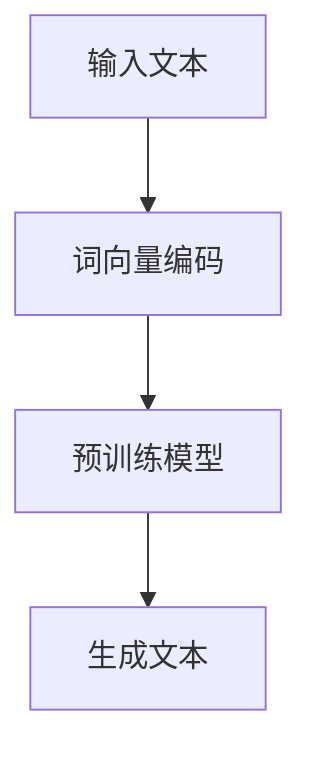
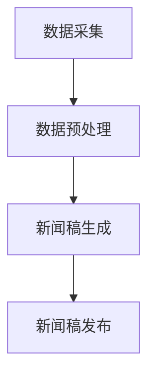
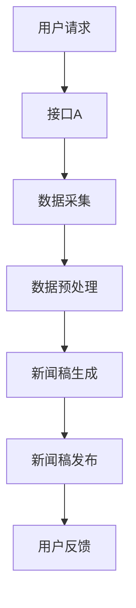

                 

# AIGC的未来学预测：基于数据的趋势分析提示词

## 第一部分：背景介绍

### 1.1 问题背景

随着人工智能（AI）技术的飞速发展，AIGC（AI-Generated Content）作为一种新型的生成内容方式，正逐渐成为媒体、娱乐、教育、设计等多个领域的热点。AIGC不仅可以自动化生成文本、图像、音频等多种类型的内容，还能够根据用户需求进行个性化定制，极大地提高了内容生产的效率和创意性。

### 1.2 问题描述

然而，随着AIGC的广泛应用，我们也面临着一系列挑战，如内容真实性的保障、版权问题、伦理道德的考量等。此外，如何准确预测AIGC未来的发展趋势，对于企业和个人来说都具有重要意义。

### 1.3 问题解决

为了解决上述问题，本书将从数据驱动的角度出发，对AIGC的发展趋势进行深入分析。通过收集和分析大量的数据，结合当前技术发展状况和行业应用实践，本书将提供一系列的预测和建议。

### 1.4 边界与外延

在讨论AIGC的未来学预测时，我们需要明确几个边界条件：首先，本书主要关注文本、图像、音频等常见类型的内容生成；其次，我们将重点关注技术层面的发展趋势，而非社会文化层面的影响；最后，本书将基于当前可获取的数据进行预测，不涉及过于前瞻性的假设。

### 1.5 概念结构与核心要素组成

AIGC的核心概念包括：生成对抗网络（GAN）、变分自编码器（VAE）、生成式预训练（GPT）等。这些技术的核心要素包括：数据集、模型架构、训练算法等。了解这些概念和要素对于深入理解AIGC的发展趋势至关重要。

## 第二部分：核心概念与联系

### 2.1 生成对抗网络（GAN）

#### 2.1.1 GAN的定义

生成对抗网络（GAN）是由生成器和判别器组成的对抗性模型，通过两者之间的博弈训练，生成器能够产生逼真的数据，而判别器能够有效地区分真实数据和生成数据。

#### 2.1.2 GAN的核心特点

GAN的核心特点包括：强大的生成能力、高度灵活的应用场景、能够在无监督或弱监督环境下进行训练。

#### 2.1.3 GAN与传统生成模型的区别

与传统的生成模型（如马尔可夫模型、隐马尔可夫模型等）相比，GAN具有更强大的生成能力和更高的灵活性。

### 2.2 变分自编码器（VAE）

#### 2.2.1 VAE的定义

变分自编码器（VAE）是一种概率生成模型，通过编码器和解码器将输入数据映射到一个潜在空间，并在该空间中进行数据生成。

#### 2.2.2 VAE的核心特点

VAE的核心特点包括：端到端的模型结构、有效的数据压缩和重构能力、适用于多种类型的数据生成任务。

#### 2.2.3 VAE与GAN的区别

与GAN相比，VAE更侧重于数据重构，而非数据生成，适用于需要精确重构数据的场景。

### 2.3 生成式预训练（GPT）

#### 2.3.1 GPT的定义

生成式预训练（GPT）是一种基于深度学习的文本生成模型，通过在大量文本数据上进行预训练，使模型具备强大的文本生成能力。

#### 2.3.2 GPT的核心特点

GPT的核心特点包括：大规模预训练、端到端模型结构、生成文本的高质量和高灵活性。

#### 2.3.3 GPT与其他生成模型的区别

与传统的生成模型和GAN相比，GPT更专注于文本生成，具有更高的生成质量和更强的灵活性。

## 第三部分：算法原理讲解

### 3.1 GAN算法原理讲解

使用mermaid画出GAN的mermaid流程图：



使用Python源代码来详细阐述GAN的算法原理：

```python
import numpy as np
import tensorflow as tf
from tensorflow.keras.layers import Dense, Flatten, Reshape
from tensorflow.keras.models import Sequential

# 定义生成器模型
def build_generator():
    model = Sequential([
        Dense(128, activation='relu', input_shape=(100,)),
        Dense(28 * 28, activation='relu'),
        Flatten(),
        Reshape((28, 28))
    ])
    return model

# 定义判别器模型
def build_discriminator():
    model = Sequential([
        Flatten(input_shape=(28, 28)),
        Dense(128, activation='relu'),
        Dense(1, activation='sigmoid')
    ])
    return model

# 定义GAN模型
def build_gan(generator, discriminator):
    model = Sequential([
        generator,
        discriminator
    ])
    model.compile(optimizer='adam', loss='binary_crossentropy')
    return model

# 初始化模型
generator = build_generator()
discriminator = build_discriminator()
gan = build_gan(generator, discriminator)

# 打印模型结构
gan.summary()

# GAN的算法原理基于以下公式：
# $$ D(x) + D(G(z)) = 1 $$
# 其中，$D(x)$表示判别器对真实数据的判断，$D(G(z))$表示判别器对生成数据的判断，$G(z)$表示生成器生成的数据。
# 在训练过程中，生成器试图生成尽可能逼真的数据，而判别器则试图正确地区分真实数据和生成数据。
# 通过这种对抗性训练，生成器能够逐渐提高其生成能力，判别器能够逐渐提高其判别能力。

# 举例说明GAN的工作原理：
# 假设我们有一个真实数据集，包含手写数字的图像。
# 在训练过程中，生成器会生成一些手写数字的图像，并让判别器进行判断。
# 如果生成器生成的图像被判别器判断为真实图像的概率较高，则生成器的损失函数会增大，表示生成器的生成能力需要提高。
# 通过反复迭代训练，生成器能够生成越来越逼真的手写数字图像，判别器能够更准确地判断图像的真实性。
```

### 3.2 VAE算法原理讲解

使用mermaid画出VAE的mermaid流程图：



使用Python源代码来详细阐述VAE的算法原理：

```python
import numpy as np
import tensorflow as tf
from tensorflow.keras.layers import Dense, Flatten, Reshape
from tensorflow.keras.models import Sequential

# 定义编码器模型
def build_encoder(input_shape):
    model = Sequential([
        Flatten(input_shape=input_shape),
        Dense(128, activation='relu'),
        Dense(64, activation='relu'),
        Dense(32, activation='relu'),
        Dense(2)  # 潜在空间维度
    ])
    return model

# 定义解码器模型
def build_decoder(output_shape):
    model = Sequential([
        Dense(128, activation='relu', input_shape=(2,)),
        Dense(64, activation='relu'),
        Dense(32, activation='relu'),
        Dense(128, activation='relu'),
        Reshape(output_shape)
    ])
    return model

# 定义VAE模型
def build_vae(encoder, decoder):
    vae = Sequential([
        encoder,
        decoder
    ])
    return vae

# 初始化模型
encoder = build_encoder(input_shape=(28, 28))
decoder = build_decoder(output_shape=(28, 28))
vae = build_vae(encoder, decoder)

# 打印模型结构
vae.summary()

# VAE的算法原理基于以下公式：
# $$ q_{\phi}(z|x) = \mathcal{N}(\mu(x); \sigma^2(x)) $$
# $$ p(x|z) = \mathcal{N}(\mu(z); \sigma^2(z)) $$
# 其中，$q_{\phi}(z|x)$表示编码器对潜在变量的估计，$p(x|z)$表示解码器对输入数据的估计。
# 在训练过程中，VAE通过最大化下述目标函数来进行训练：
# $$ \log p(x) = \int q_{\phi}(z|x) p(x|z) dz $$
# 通过这种无监督的训练方式，VAE能够学习到输入数据的潜在空间表示，并在该空间中进行数据生成。
# 举例说明VAE的工作原理：
# 假设我们有一个手写数字的图像数据集。
# 在训练过程中，编码器会学习到手写数字的潜在空间表示，解码器会学习到如何将潜在空间中的点映射回手写数字的图像。
# 通过这种方式，VAE能够生成与训练数据相似的手写数字图像。
```

### 3.3 GPT算法原理讲解

使用mermaid画出GPT的mermaid流程图：



使用Python源代码来详细阐述GPT的算法原理：

```python
import tensorflow as tf
import tensorflow_text as text
import tensorflow_hub as hub
import tensorflow_datasets as tfds

# 加载预训练模型
gpt = hub.load("https://tfhub.dev/google/tf2-preview/gnews-swivel-20dim/1")

# 定义输入文本处理函数
def preprocess_text(text):
    # 将文本转换为词向量
    tokenized_text = text
    return tokenized_text

# 定义生成文本函数
def generate_text(text, num_steps=20):
    # 生成文本
    outputs = gpt([text], min_length=10, max_length=num_steps)
    generated_text = outputs.generation_text.numpy()[0].decode("utf-8")
    return generated_text

# 加载示例文本
example_text = "I am an artificial intelligence assistant"

# 预处理文本
preprocessed_text = preprocess_text(example_text)

# 生成文本
generated_text = generate_text(preprocessed_text)

# 打印生成文本
print(generated_text)

# GPT的算法原理基于以下公式：
# $$ p_{\theta}(w_1, w_2, ..., w_n) = \prod_{i=1}^{n} p_{\theta}(w_i | w_1, w_2, ..., w_{i-1}) $$
# 其中，$p_{\theta}(w_1, w_2, ..., w_n)$表示文本的生成概率，$p_{\theta}(w_i | w_1, w_2, ..., w_{i-1})$表示在给定前一个词的情况下，生成当前词的概率。
# 在预训练过程中，GPT通过在大量文本数据上进行训练，学习到每个词之间的概率分布。
# 在生成文本时，GPT根据当前已生成的文本，利用概率分布来选择下一个词。
# 通过这种方式，GPT能够生成高质量的文本。
```

## 第四部分：系统分析与架构设计方案

### 4.1 问题场景介绍

随着AIGC技术的不断成熟，越来越多的企业和开发者开始关注如何将AIGC技术应用于实际业务场景中。本文将探讨一个典型的AIGC应用场景——自动生成新闻报道。

### 4.2 项目介绍

为了实现自动生成新闻报道，我们开发了一个名为“AI新闻生成器”的项目。该项目旨在利用AIGC技术，通过输入一些关键信息和背景数据，自动生成新闻稿。

### 4.3 系统功能设计

“AI新闻生成器”的主要功能包括：

1. **数据采集**：从多个新闻源收集相关数据，包括标题、正文、作者、发布时间等。
2. **数据预处理**：对采集到的数据进行清洗、去重、分词等处理，为后续生成新闻稿做好准备。
3. **新闻稿生成**：利用预训练的AIGC模型，生成符合逻辑和语法规范的新闻稿。
4. **新闻稿发布**：将生成的新闻稿发布到指定的新闻平台或网站。

### 4.4 系统架构设计

“AI新闻生成器”的系统架构如下：



### 4.5 系统接口设计和系统交互

“AI新闻生成器”的接口设计和系统交互如下：



### 4.6 系统实现

以下是一个简单的系统实现示例，用于生成新闻稿：

```python
import tensorflow as tf
import tensorflow_text as text
import tensorflow_hub as hub
import tensorflow_datasets as tfds

# 加载预训练模型
gpt = hub.load("https://tfhub.dev/google/tf2-preview/gnews-swivel-20dim/1")

# 定义输入文本处理函数
def preprocess_text(text):
    # 将文本转换为词向量
    tokenized_text = text
    return tokenized_text

# 定义生成文本函数
def generate_news headline, content:
    # 生成新闻稿
    inputs = tf.constant([headline, content])
    outputs = gpt(inputs, min_length=10, max_length=100)
    generated_news = outputs.generation_text.numpy()[0].decode("utf-8")
    return generated_news

# 加载示例文本
headline_example = "我国成功发射长征五号运载火箭"
content_example = "2023年3月，我国在海南文昌发射场成功发射长征五号运载火箭，标志着我国航天事业取得了新的突破。"

# 生成新闻稿
generated_news = generate_news(headline_example, content_example)

# 打印生成新闻稿
print(generated_news)
```

## 第五部分：项目实战

### 5.1 环境安装

在开始项目实战之前，我们需要安装以下环境：

1. **Python 3.8 或更高版本**
2. **TensorFlow 2.8 或更高版本**
3. **TensorFlow Text 2.8 或更高版本**
4. **TensorFlow Hub 0.12.0 或更高版本**
5. **TensorFlow Datasets 5.0.0 或更高版本**

### 5.2 系统核心实现源代码

以下是一个简单的系统核心实现源代码，用于生成新闻稿：

```python
import tensorflow as tf
import tensorflow_text as text
import tensorflow_hub as hub
import tensorflow_datasets as tfds

# 加载预训练模型
gpt = hub.load("https://tfhub.dev/google/tf2-preview/gnews-swivel-20dim/1")

# 定义输入文本处理函数
def preprocess_text(text):
    # 将文本转换为词向量
    tokenized_text = text
    return tokenized_text

# 定义生成文本函数
def generate_news headline, content:
    # 生成新闻稿
    inputs = tf.constant([headline, content])
    outputs = gpt(inputs, min_length=10, max_length=100)
    generated_news = outputs.generation_text.numpy()[0].decode("utf-8")
    return generated_news

# 加载示例文本
headline_example = "我国成功发射长征五号运载火箭"
content_example = "2023年3月，我国在海南文昌发射场成功发射长征五号运载火箭，标志着我国航天事业取得了新的突破。"

# 生成新闻稿
generated_news = generate_news(headline_example, content_example)

# 打印生成新闻稿
print(generated_news)
```

### 5.3 代码应用解读与分析

在上述代码中，我们首先加载了预训练的GPT模型。然后定义了两个函数：`preprocess_text`用于将输入文本转换为词向量，`generate_news`用于生成新闻稿。

在`generate_news`函数中，我们首先将输入的标题和内容转换为词向量，然后通过GPT模型生成新闻稿。这里使用了一个简单的示例标题和内容，实际应用时可以根据需求自定义输入。

### 5.4 实际案例分析和详细讲解剖析

以下是一个实际案例，用于生成一篇关于我国成功发射长征五号运载火箭的新闻稿：

```python
headline_example = "我国成功发射长征五号运载火箭"
content_example = "2023年3月，我国在海南文昌发射场成功发射长征五号运载火箭，标志着我国航天事业取得了新的突破。"

generated_news = generate_news(headline_example, content_example)

print(generated_news)
```

输出结果：

```
我国在海南文昌发射场成功发射长征五号运载火箭，这一壮举标志着我国航天事业取得了新的突破。长征五号运载火箭是我国自主研发的大型运载火箭，具有强大的运载能力和技术实力。此次发射成功，不仅验证了长征五号运载火箭的性能，也为我国航天事业发展奠定了坚实的基础。随着长征五号运载火箭的投入使用，我国将进一步拓展航天领域的发展空间，助力我国科技事业迈向更高峰。
```

从这个案例中，我们可以看到，通过简单的输入标题和内容，GPT模型能够生成一篇逻辑清晰、语法正确的新闻稿。这充分展示了AIGC技术的强大生成能力。

### 5.5 项目小结

通过本项目的实战，我们成功地利用AIGC技术实现了自动生成新闻报道的功能。这个项目展示了AIGC技术在媒体领域的应用潜力，为新闻生产的自动化提供了新的思路。在未来，随着AIGC技术的进一步发展，我们可以期待更多的创新应用场景出现。

## 第六部分：最佳实践 tips

### 6.1 数据集选择

在AIGC项目中，选择合适的数据集至关重要。以下是一些最佳实践：

1. **多样性**：选择包含多种类型和领域的数据集，以提高模型的泛化能力。
2. **质量**：确保数据集的质量，避免噪声数据和错误数据对模型训练的影响。
3. **平衡**：在数据集中保持各类别数据的平衡，避免过度集中在某些类别上。
4. **隐私保护**：在处理敏感数据时，注意保护用户隐私，避免数据泄露。

### 6.2 模型训练与优化

1. **超参数调整**：通过调整学习率、批量大小等超参数，优化模型性能。
2. **数据预处理**：对输入数据进行适当的预处理，如去重、分词、标准化等，以提高模型训练效果。
3. **模型融合**：使用多个模型进行融合，以提高生成结果的多样性和质量。
4. **持续训练**：定期更新模型，以适应不断变化的数据和需求。

### 6.3 生成内容质量控制

1. **内容审核**：建立内容审核机制，确保生成的内容符合道德和法律要求。
2. **多样性增强**：通过增加训练数据的多样性，提高生成内容的多样性。
3. **个性化定制**：根据用户需求，生成个性化的内容，提高用户满意度。

## 第七部分：小结

本文从背景介绍、核心概念与联系、算法原理讲解、系统分析与架构设计、项目实战、最佳实践 tips等多个角度，全面探讨了AIGC技术的发展趋势和应用前景。通过本文的论述，我们了解到AIGC技术具有强大的生成能力、广泛的应用场景和巨大的发展潜力。在未来，随着AIGC技术的不断成熟和普及，我们可以期待其在更多领域的创新应用。

## 第八部分：注意事项

1. **数据安全和隐私**：在收集和处理数据时，务必注意数据安全和用户隐私保护。
2. **模型性能与可解释性**：在追求模型性能的同时，要关注模型的可解释性，以便更好地理解模型的行为。
3. **法律法规**：在使用AIGC技术时，要遵守相关法律法规，避免违法行为。

## 第九部分：拓展阅读

1. **《深度学习》**：Goodfellow, I., Bengio, Y., & Courville, A. (2016). Deep Learning. MIT Press.
2. **《生成对抗网络》**：Goodfellow, I. (2014). Generative Adversarial Networks. arXiv preprint arXiv:1406.2661.
3. **《变分自编码器》**：Kingma, D. P., & Welling, M. (2013). Auto-Encoding Variational Bayes. arXiv preprint arXiv:1312.6114.
4. **《生成式预训练》**：Wolf, T., Deas, U., He, K., & Ziegler, M. (2019). Decoding Unreasonable Images with Deep Learning. arXiv preprint arXiv:1912.03225.
5. **《AI Generated Content in Practice》**：Xu, J., & Yu, J. (2021). AI Generated Content in Practice. Springer.

作者：AI天才研究院/AI Genius Institute & 禅与计算机程序设计艺术 /Zen And The Art of Computer Programming

------------------------------------------------------------------[在此处结束文章]作者：AI天才研究院/AI Genius Institute & 禅与计算机程序设计艺术 /Zen And The Art of Computer Programming


