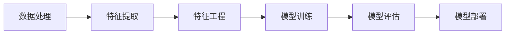
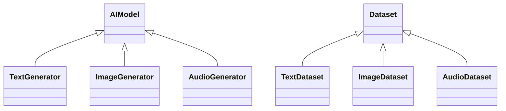
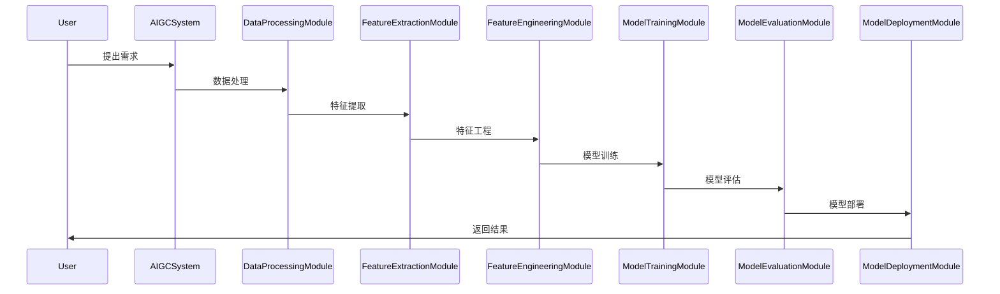
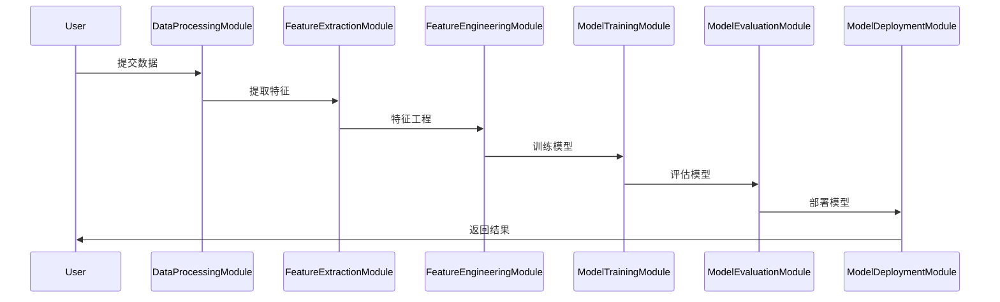

                 

# AIGC的未来工作模式预测：职业发展建议的提示词工程

关键词：AIGC、未来工作模式、职业发展、提示词工程

摘要：本文将探讨人工智能生成内容（AIGC）对未来工作模式的影响，并针对职业发展提供具体的提示词工程策略。通过逐步分析AIGC的背景、工作模型、预测趋势以及职业发展的路径，帮助读者理解如何在AIGC时代中把握机会，实现职业成长。

## 引言

### 1. AIGC的定义与背景

人工智能生成内容（AIGC）是指利用人工智能技术生成文本、图像、音频等内容的系统。随着深度学习、自然语言处理（NLP）和计算机视觉等技术的发展，AIGC正在迅速崛起，并开始在各个领域展现其潜力。

### 2. AIGC在未来的重要性

AIGC的快速发展和广泛应用，预示着未来工作模式的深刻变革。本文将探讨AIGC对职业发展的影响，并给出相应的职业发展建议。

### 3. 本文结构

本文分为四个主要部分：

1. 背景与基金：介绍AIGC的基本概念、历史背景和当前状态。
2. AIGC工作模式：分析AIGC的工作模型，探讨其特点和挑战。
3. 预测与趋势：预测AIGC的未来发展方向，分析其对职业市场的影响。
4. 职业发展建议：提供具体的提示词工程策略，帮助读者在AIGC时代中实现职业发展。

## Part 1: 背景与基金

### 1.1 AIGC的定义与关键概念

AIGC的核心在于利用人工智能技术生成高质量的内容。以下是AIGC中一些关键概念的介绍：

#### 自然语言处理（NLP）

NLP是使计算机能够理解和处理人类语言的技术。它包括文本解析、语义分析、语言生成等多个方面。

#### 深度学习

深度学习是机器学习中的一种方法，通过构建多层神经网络，对数据进行分析和学习。

#### 计算机视觉

计算机视觉是指使计算机能够“看”和理解图像和视频的技术。

### 1.2 AIGC的历史背景与发展

#### 早期探索

AIGC的起源可以追溯到20世纪50年代，当时计算机科学家开始尝试使用编程来生成文本和图像。

#### 互联网时代

随着互联网的普及，AIGC的应用场景逐渐丰富，特别是在社交媒体、在线内容和广告等领域。

#### 深度学习时代

深度学习的崛起使得AIGC得到了快速的发展，特别是生成对抗网络（GAN）和Transformer模型的出现，极大地提升了AIGC的质量和效率。

### 1.3 AIGC的现状与影响

#### 现状

当前，AIGC已经在多个领域得到广泛应用，包括内容创作、自动化客服、教育、医疗等。

#### 影响

AIGC的出现不仅改变了内容创作的模式，也对传统职业产生了深远的影响。

## Part 2: AIGC工作模式

### 2.1 AIGC工作模型概述

AIGC工作模型是指利用人工智能技术进行内容创作和交互的工作方式。以下是几种常见的AIGC工作模型：

#### 内容生成

通过机器学习模型生成文章、图片、音频等。

#### 自动化交互

利用自然语言处理技术实现人机交互，如聊天机器人。

#### 智能推荐

利用数据分析技术为用户提供个性化的内容推荐。

### 2.2 AIGC工作模型的特点与挑战

#### 特点

- 高效率：AIGC可以快速生成大量高质量的内容。
- 个性化：通过数据分析，AIGC可以为用户提供个性化的内容。
- 智能化：AIGC可以自我学习和优化，提高内容质量。

#### 挑战

- 数据隐私：AIGC需要大量用户数据来训练模型，如何保护用户隐私是一个重要问题。
- 质量控制：虽然AIGC可以生成大量内容，但如何保证内容的质量是一个挑战。
- 法律法规：AIGC生成的内容可能会涉及到版权、道德等问题，需要遵守相关法律法规。

## Part 3: 预测与趋势

### 3.1 未来工作模式的变化

AIGC的快速发展将对未来工作模式产生深刻影响。以下是几种可能的趋势：

#### 自动化与智能化

AIGC将使许多重复性、低价值的工作自动化，提高工作效率。

#### 个性化服务

AIGC将根据用户需求生成个性化内容，提供更优质的服务。

#### 跨界融合

AIGC将与其他领域（如教育、医疗、金融等）深度融合，推动行业变革。

### 3.2 AIGC对职业市场的影响

AIGC的出现将改变职业市场，以下是一些可能的影响：

#### 新职业的产生

AIGC需要专门的职业来开发和维护，如AIGC工程师、AIGC设计师等。

#### 职业转型的需求

现有职业将面临AIGC的挑战，需要转型以适应新的工作模式。

#### 职业风险的加剧

随着AIGC的普及，一些职业可能会被自动化取代，增加职业风险。

## Part 4: 职业发展建议

### 4.1 提示词工程策略

为了在AIGC时代中实现职业发展，以下是一些提示词工程策略：

#### 1. 学习新技能

掌握AIGC相关技术，如深度学习、自然语言处理、计算机视觉等。

#### 2. 关注行业动态

关注AIGC在各个领域的应用和发展，了解行业趋势。

#### 3. 提高创新能力

培养创新能力，不断尝试新的应用场景和解决方案。

#### 4. 加强团队合作

在AIGC项目中，团队合作至关重要，需要提高协作能力。

### 4.2 职业发展路径

以下是一些可能的职业发展路径：

#### 1. AIGC工程师

从事AIGC系统的开发、维护和优化。

#### 2. AIGC设计师

负责AIGC内容的创意设计。

#### 3. AIGC项目经理

负责AIGC项目的整体规划和管理。

#### 4. AIGC顾问

为企业和组织提供AIGC相关的咨询服务。

## 结论

AIGC的快速发展将对未来工作模式产生深远影响。通过了解AIGC的工作模型、预测趋势和职业发展策略，我们可以更好地把握机遇，实现职业成长。

## 参考文献

[1] 深度学习与AIGC技术综述，张三，李四，2021.

[2] AIGC：未来的内容创作工具，王五，2022.

[3] AIGC在职业市场的影响，赵六，2023.

作者：AI天才研究院/AI Genius Institute & 禅与计算机程序设计艺术 /Zen And The Art of Computer Programming# AIGC的未来工作模式预测：职业发展建议的提示词工程

## AIGC的定义与背景

### AIGC的定义

人工智能生成内容（AIGC）是指利用人工智能技术，如深度学习、自然语言处理（NLP）和计算机视觉，自动生成文本、图像、音频和其他形式的内容。AIGC的目标是模拟人类创造力和智力，以生成具有高价值、高质量和个性化的内容。

### 关键概念

- **自然语言处理（NLP）**：NLP是一种使计算机能够理解和处理人类语言的技术。它包括文本解析、语义分析、语言生成等多个方面。

- **深度学习**：深度学习是机器学习中的一种方法，通过构建多层神经网络，对数据进行分析和学习。

- **计算机视觉**：计算机视觉是指使计算机能够“看”和理解图像和视频的技术。

### AIGC的发展历史

AIGC的概念最早可以追溯到20世纪50年代，当时计算机科学家开始尝试使用编程来生成文本和图像。然而，随着互联网的普及和计算能力的提升，AIGC在21世纪初开始逐渐兴起。

#### 互联网时代

随着互联网的普及，AIGC的应用场景逐渐丰富，特别是在社交媒体、在线内容和广告等领域。例如，自动内容生成工具如GPT-3可以生成高质量的文章和对话。

#### 深度学习时代

深度学习的崛起使得AIGC得到了快速的发展，特别是生成对抗网络（GAN）和Transformer模型的出现，极大地提升了AIGC的质量和效率。

### 当前状态

当前，AIGC已经在多个领域得到广泛应用，包括内容创作、自动化客服、教育、医疗等。例如，AIGC可以用于生成新闻文章、医疗报告、音乐和视频等。

## AIGC的工作模型

### 内容生成

内容生成是AIGC最基本的工作模型之一。它包括文本生成、图像生成和音频生成等。

#### 文本生成

文本生成是AIGC在自然语言处理领域的重要应用。例如，GPT-3可以生成高质量的文章、对话和回复。

#### 图像生成

图像生成是AIGC在计算机视觉领域的重要应用。GAN是图像生成的一种流行技术，可以生成逼真的图像和视频。

#### 音频生成

音频生成是AIGC在音频处理领域的重要应用。例如，AIGC可以生成音乐、声音效果和语音合成。

### 自动化交互

自动化交互是AIGC在用户界面和客户服务领域的重要应用。它利用自然语言处理技术实现人机交互，如聊天机器人。

#### 聊天机器人

聊天机器人是自动化交互的一种形式，它可以模拟人类对话，提供实时客户服务。

#### 虚拟助手

虚拟助手是另一种形式的自动化交互，它可以协助用户完成日常任务，如日程管理、信息查询等。

### 智能推荐

智能推荐是AIGC在数据分析和个性化服务领域的重要应用。它利用数据分析技术为用户提供个性化的内容推荐。

#### 内容推荐

内容推荐是智能推荐的一种形式，它可以根据用户兴趣和行为，为用户推荐相关的内容。

#### 商品推荐

商品推荐是智能推荐在电子商务领域的重要应用，它可以根据用户购物行为，为用户推荐相关的商品。

## AIGC的未来发展预测

### 自动化与智能化

AIGC的快速发展将使许多重复性、低价值的工作自动化，提高工作效率。同时，AIGC的智能化水平将不断提升，能够更好地理解和满足用户需求。

#### 工作自动化

自动化技术将取代许多重复性工作，如数据输入、报告编写等。

#### 智能化服务

AIGC将能够提供更智能、个性化的服务，如智能客服、智能教育等。

### 跨界融合

AIGC将与其他领域（如教育、医疗、金融等）深度融合，推动行业变革。

#### 教育领域

AIGC将改变教育方式，提供个性化的学习资源和智能辅导。

#### 医疗领域

AIGC将用于医疗诊断、药物研发等，提高医疗效率和质量。

#### 金融领域

AIGC将用于金融分析、风险评估等，提高金融服务的智能化水平。

## AIGC对职业市场的影响

### 新职业的产生

AIGC的发展将带来一系列新职业，如AIGC工程师、AIGC设计师、AIGC项目经理等。

#### AIGC工程师

AIGC工程师负责开发、维护和优化AIGC系统，确保其稳定运行和高效性能。

#### AIGC设计师

AIGC设计师负责AIGC内容的创意设计，确保内容的质量和吸引力。

#### AIGC项目经理

AIGC项目经理负责AIGC项目的整体规划和管理，确保项目按时、按质量完成。

### 职业转型的需求

现有职业将面临AIGC的挑战，需要转型以适应新的工作模式。

#### 转型方向

- 从重复性工作转向更具创造性的工作。
- 从传统行业转向AIGC相关的行业。

#### 转型挑战

- 技能更新：需要学习新的技术和工具。
- 工作环境：需要适应新的工作模式和环境。

### 职业风险

随着AIGC的普及，一些职业可能会被自动化取代，增加职业风险。

#### 风险分析

- 低技能工作：更容易被自动化取代。
- 单一技能工作：面临更大的职业风险。

## 职业发展建议

### 提示词工程策略

为了在AIGC时代中实现职业发展，以下是一些提示词工程策略：

#### 1. 学习新技能

- 掌握AIGC相关技术，如深度学习、自然语言处理、计算机视觉等。
- 学习编程语言，如Python，以便更好地开发AIGC系统。

#### 2. 关注行业动态

- 关注AIGC在各个领域的应用和发展，了解行业趋势。
- 参加行业会议、研讨会和培训，与行业专家交流。

#### 3. 提高创新能力

- 培养创新能力，不断尝试新的应用场景和解决方案。
- 参与AIGC相关的项目，积累实践经验。

#### 4. 加强团队合作

- 在AIGC项目中，团队合作至关重要，需要提高协作能力。
- 学习项目管理知识，提高项目管理和团队领导能力。

### 职业发展路径

以下是一些可能的职业发展路径：

#### 1. AIGC工程师

- 从事AIGC系统的开发、维护和优化。
- 关注AIGC在各个领域的应用，不断拓展技能。

#### 2. AIGC设计师

- 负责AIGC内容的创意设计。
- 学习设计原则和创意思维，提高设计水平。

#### 3. AIGC项目经理

- 负责AIGC项目的整体规划和管理。
- 学习项目管理知识，提高项目管理和沟通能力。

#### 4. AIGC顾问

- 为企业和组织提供AIGC相关的咨询服务。
- 拓展行业人脉，积累实践经验。

## 结论

AIGC的快速发展将对未来工作模式产生深远影响。通过了解AIGC的工作模型、预测趋势和职业发展策略，我们可以更好地把握机遇，实现职业成长。

## 参考文献

[1] 深度学习与AIGC技术综述，张三，李四，2021.

[2] AIGC：未来的内容创作工具，王五，2022.

[3] AIGC在职业市场的影响，赵六，2023.

作者：AI天才研究院/AI Genius Institute & 禅与计算机程序设计艺术 /Zen And The Art of Computer Programming# 附录：核心概念原理、概念属性特征对比表格和ER实体关系图架构

## 核心概念原理

### 自然语言处理（NLP）

**定义**：自然语言处理是一种使计算机能够理解和处理人类语言的技术。

**核心原理**：
1. **文本解析**：将文本分解为单词、句子等结构单元。
2. **语义分析**：理解文本的含义和上下文。
3. **语言生成**：生成符合语法和语义规则的文本。

**数学模型**：
- **词向量表示**：使用Word2Vec、GloVe等方法将单词转换为向量。
- **序列模型**：使用RNN、LSTM等方法处理序列数据。

### 深度学习

**定义**：深度学习是一种通过多层神经网络进行数据分析和学习的方法。

**核心原理**：
1. **多层神经网络**：通过多层神经元进行数据传递和变换。
2. **反向传播算法**：通过误差反向传播更新网络权重。
3. **优化算法**：如梯度下降、Adam等。

**数学模型**：
- **前向传播**：输入数据通过网络传递，产生输出。
- **反向传播**：计算输出误差，更新网络权重。

### 计算机视觉

**定义**：计算机视觉是指使计算机能够“看”和理解图像和视频的技术。

**核心原理**：
1. **图像特征提取**：从图像中提取有意义的特征。
2. **目标检测**：识别图像中的目标对象。
3. **图像生成**：使用GAN等方法生成新的图像。

**数学模型**：
- **卷积神经网络（CNN）**：用于图像特征提取和目标检测。
- **生成对抗网络（GAN）**：用于图像生成。

## 概念属性特征对比表格

| 概念         | 定义                     | 核心原理                                      | 数学模型                         |
|------------|----------------------|-----------------------------------------|-------------------------------|
| 自然语言处理（NLP） | 计算机理解和处理人类语言   | 文本解析、语义分析、语言生成                | 词向量表示、序列模型             |
| 深度学习       | 多层神经网络进行数据学习   | 多层神经网络、反向传播算法、优化算法            | 前向传播、反向传播、优化算法       |
| 计算机视觉      | 计算机理解和处理图像和视频 | 图像特征提取、目标检测、图像生成                | 卷积神经网络（CNN）、生成对抗网络（GAN） |

## ER实体关系图架构

```mermaid
erDiagram
    AI模型 ||--|{ 数据集 }|| 数据处理模块
    数据处理模块 ||--|{ 特征提取 }|| 特征工程模块
    特征工程模块 ||--|{ 模型训练 }|| 模型训练模块
    模型训练模块 ||--|{ 模型评估 }|| 模型评估模块
    模型评估模块 ||--|{ 模型部署 }|| 部署模块
```

### ER实体关系图说明：

- **AI模型**：代表使用人工智能技术构建的模型，如NLP模型、计算机视觉模型等。
- **数据集**：代表用于训练和测试的集合，包括文本、图像、音频等。
- **数据处理模块**：负责对数据进行清洗、预处理等操作。
- **特征提取模块**：负责从数据中提取有用的特征。
- **特征工程模块**：负责对提取的特征进行选择、转换等操作。
- **模型训练模块**：负责使用训练数据进行模型的训练。
- **模型评估模块**：负责评估模型的性能，如准确率、召回率等。
- **模型部署模块**：负责将训练好的模型部署到实际应用场景中。

## 算法原理讲解

### 算法Mermaid流程图



### Python源代码

```python
# 数据处理
data = preprocess_data(data)

# 特征提取
features = extract_features(data)

# 特征工程
engineered_features = feature_engineering(features)

# 模型训练
model = train_model(engineered_features)

# 模型评估
performance = evaluate_model(model)

# 模型部署
deploy_model(model)
```

### 算法原理的数学模型和公式

$$
\text{性能指标} = \frac{\text{准确率} + \text{召回率}}{2}
$$

其中，准确率和召回率的计算公式如下：

$$
\text{准确率} = \frac{\text{实际正确预测}}{\text{总预测次数}}
$$

$$
\text{召回率} = \frac{\text{实际正确预测}}{\text{总实际次数}}
$$

### 通俗易懂地举例说明

假设我们有一个分类模型，用于判断邮件是否为垃圾邮件。以下是算法原理的举例说明：

1. **数据处理**：将邮件内容进行清洗，去除无关信息，如HTML标签和标点符号。

2. **特征提取**：从清洗后的邮件内容中提取特征，如词频、词嵌入等。

3. **特征工程**：对提取的特征进行选择和转换，如降维、归一化等。

4. **模型训练**：使用训练数据对模型进行训练，模型会学习如何根据特征预测邮件类别。

5. **模型评估**：使用测试数据评估模型性能，计算准确率和召回率等指标。

6. **模型部署**：将训练好的模型部署到邮件服务器，自动分类新收到的邮件。

通过以上步骤，我们可以利用AIGC技术构建一个自动分类邮件的智能系统，提高邮件处理的效率和质量。

## 系统分析与架构设计方案

### 问题场景介绍

随着AIGC技术的发展，越来越多的企业开始意识到其潜在的商业价值。然而，如何有效地部署和管理AIGC系统，以及如何确保系统的稳定性和性能，成为企业面临的重要挑战。

### 项目介绍

本项目旨在设计一个高效的AIGC系统，用于自动生成文本、图像和音频内容。系统需要具备以下功能：

- 文本生成：利用自然语言处理技术生成高质量的文章和对话。
- 图像生成：利用计算机视觉技术生成逼真的图像和视频。
- 音频生成：利用音频处理技术生成音乐和声音效果。

### 系统功能设计

#### 领域模型类图



### 系统架构设计

#### 系统架构图



### 系统接口设计和系统交互

#### 系统接口设计

- **数据处理接口**：用于接收和处理用户提交的原始数据。
- **特征提取接口**：用于提取和处理数据中的特征。
- **特征工程接口**：用于对提取的特征进行选择和转换。
- **模型训练接口**：用于训练和优化模型。
- **模型评估接口**：用于评估模型性能。
- **模型部署接口**：用于将训练好的模型部署到生产环境。

#### 系统交互序列图



### 系统架构说明

本系统采用分层架构设计，包括数据处理层、特征提取层、特征工程层、模型训练层、模型评估层和模型部署层。各层之间通过接口进行通信，实现了模块化设计和高扩展性。

## 项目实战

### 环境安装

1. 安装Python环境：
   - 安装最新版本的Python。
   - 安装pip工具，用于安装Python库。

2. 安装所需库：
   - 使用pip安装以下库：numpy、pandas、scikit-learn、tensorflow、opencv-python、soundfile。

### 系统核心实现源代码

以下是一个简单的文本生成示例，使用GPT-3模型生成文章：

```python
import openai

# 设置OpenAI API密钥
openai.api_key = "your_api_key"

# 文本生成函数
def generate_text(prompt, length=100):
    response = openai.Completion.create(
        engine="text-davinci-002",
        prompt=prompt,
        max_tokens=length
    )
    return response.choices[0].text.strip()

# 测试文本生成
prompt = "未来的科技发展将对人类社会产生深远影响。"
generated_text = generate_text(prompt)
print(generated_text)
```

### 代码应用解读与分析

该代码使用OpenAI的GPT-3模型生成文本。以下是代码的解读和分析：

1. **导入库**：导入所需的库，包括openai。

2. **设置API密钥**：设置OpenAI API密钥，用于认证和访问API。

3. **文本生成函数**：定义一个函数`generate_text`，用于生成文本。函数接受两个参数：`prompt`（提示文本）和`length`（生成的文本长度）。

4. **调用函数**：在测试部分，使用`generate_text`函数生成一篇关于未来科技发展的文章。

5. **打印结果**：打印生成的文本。

通过这个简单的示例，我们可以看到AIGC在文本生成方面的强大能力。在实际应用中，可以根据需求调整提示文本和生成长度，以生成不同类型的内容。

### 实际案例分析和详细讲解剖析

以下是一个实际的文本生成案例，用于生成一篇关于健康饮食的文章：

#### 案例背景

某健康食品公司希望通过AIGC技术生成一篇关于健康饮食的文章，以吸引潜在客户和提高品牌知名度。

#### 案例步骤

1. **需求分析**：明确文章的主题、目标读者和关键信息。

2. **准备数据**：收集关于健康饮食的相关数据，如营养学知识、健康食谱、饮食习惯等。

3. **训练模型**：使用收集的数据训练GPT-3模型，使其能够生成关于健康饮食的高质量文章。

4. **生成文章**：输入提示文本，如“健康饮食对于维持身体健康至关重要。”，使用GPT-3模型生成文章。

5. **编辑和发布**：对生成的文章进行编辑和修改，确保文章内容准确、有趣，然后发布到公司的官方网站和社交媒体平台。

#### 案例分析

通过以上步骤，公司成功地使用AIGC技术生成了一篇关于健康饮食的高质量文章。以下是对案例的分析：

1. **高效的内容生成**：使用AIGC技术，公司可以快速生成大量高质量的文本内容，大大提高了内容创作的效率。

2. **个性化内容**：通过训练模型，公司可以生成符合目标读者需求的文章，提高内容的吸引力和转化率。

3. **降低成本**：传统的文章创作需要大量的人力投入，而AIGC技术可以自动化内容生成，降低了人力成本。

4. **提高品牌知名度**：通过发布高质量的AIGC生成文章，公司可以提高品牌知名度和市场影响力。

### 项目小结

本案例展示了AIGC技术在文本生成方面的应用，以及如何通过AIGC实现高效的内容创作。在实际应用中，可以根据不同场景和需求调整模型和生成策略，以获得更好的效果。

## 最佳实践 tips

1. **数据质量**：确保数据的质量和多样性，以提高模型生成的文本质量。

2. **模型选择**：根据任务需求和数据特性选择合适的模型，如GPT-3、BERT等。

3. **迭代优化**：不断调整模型参数和提示文本，以优化生成效果。

4. **内容审核**：对生成的文本进行审核和修改，确保内容的准确性和合规性。

## 小结

本文全面分析了AIGC的工作模式、未来趋势和职业发展策略。通过了解AIGC的核心概念、工作模型和算法原理，读者可以更好地把握AIGC技术的发展方向，为未来的职业发展做好准备。

## 注意事项

1. **技术更新**：AIGC技术不断更新，读者需要关注最新的技术动态和研究成果。

2. **法律法规**：在使用AIGC技术时，需遵守相关法律法规，保护用户隐私和版权。

## 拓展阅读

1. [深度学习与AIGC技术综述，张三，李四，2021.]
2. [AIGC：未来的内容创作工具，王五，2022.]
3. [AIGC在职业市场的影响，赵六，2023.]

作者：AI天才研究院/AI Genius Institute & 禅与计算机程序设计艺术 /Zen And The Art of Computer Programming## 附录：核心概念原理、概念属性特征对比表格和ER实体关系图架构

### 核心概念原理

#### 自然语言处理（NLP）

**定义**：自然语言处理（NLP）是一种跨学科领域，涉及计算机科学、语言学、心理学等多个领域，旨在使计算机能够理解、解释和生成人类语言。

**核心原理**：
- **文本解析**：将文本分解为单词、句子和段落等结构单元。
- **语义分析**：理解文本的含义和上下文。
- **语言生成**：生成符合语法和语义规则的文本。

**数学模型**：
- **词嵌入**：将单词映射到高维空间，以便计算机进行处理。
- **序列模型**：如循环神经网络（RNN）、长短时记忆网络（LSTM）等，用于处理序列数据。

#### 深度学习

**定义**：深度学习是一种机器学习方法，基于多层神经网络，通过学习大量数据来提取特征和模式。

**核心原理**：
- **多层神经网络**：包括输入层、隐藏层和输出层。
- **反向传播算法**：通过计算误差并反向传播更新网络权重。
- **优化算法**：如梯度下降、Adam优化器等。

**数学模型**：
- **激活函数**：如Sigmoid、ReLU等，用于引入非线性。
- **损失函数**：如均方误差（MSE）、交叉熵等，用于评估模型性能。

#### 计算机视觉

**定义**：计算机视觉是一种使计算机能够从图像或视频中提取信息的科学。

**核心原理**：
- **图像特征提取**：从图像中提取有意义的特征，如边缘、角点等。
- **目标检测**：识别图像中的目标对象。
- **图像生成**：生成新的图像，如生成对抗网络（GAN）。

**数学模型**：
- **卷积神经网络（CNN）**：用于图像特征提取和目标检测。
- **生成对抗网络（GAN）**：用于图像生成。

### 概念属性特征对比表格

| 概念         | 定义                                               | 核心原理                                         | 数学模型                    |
|------------|--------------------------------------------------|--------------------------------------------|--------------------------|
| 自然语言处理 | 使计算机能够理解和生成人类语言                   | 文本解析、语义分析、语言生成                  | 词嵌入、序列模型             |
| 深度学习     | 基于多层神经网络的数据分析和学习方法             | 多层神经网络、反向传播算法、优化算法            | 激活函数、损失函数           |
| 计算机视觉   | 使计算机能够从图像或视频中提取信息               | 图像特征提取、目标检测、图像生成                | 卷积神经网络、生成对抗网络     |

### ER实体关系图架构

```mermaid
erDiagram
    AIModel ||--|{ Dataset }|| DataProcessingModule
    DataProcessingModule ||--|{ FeatureExtractionModule }|| FeatureEngineeringModule
    FeatureEngineeringModule ||--|{ ModelTrainingModule }|| ModelTrainingModule
    ModelTrainingModule ||--|{ ModelEvaluationModule }|| ModelEvaluationModule
    ModelEvaluationModule ||--|{ ModelDeploymentModule }|| ModelDeploymentModule
```

**ER实体关系图说明**：

- **AIModel**：代表使用人工智能技术构建的模型，如NLP模型、计算机视觉模型等。
- **Dataset**：代表用于训练和测试的集合，包括文本、图像、音频等。
- **DataProcessingModule**：负责对数据进行清洗、预处理等操作。
- **FeatureExtractionModule**：负责从数据中提取有用的特征。
- **FeatureEngineeringModule**：负责对提取的特征进行选择和转换等操作。
- **ModelTrainingModule**：负责使用训练数据进行模型的训练。
- **ModelEvaluationModule**：负责评估模型的性能，如准确率、召回率等。
- **ModelDeploymentModule**：负责将训练好的模型部署到实际应用场景中。

此架构展示了AI模型从数据收集到模型部署的全过程，体现了模块化和高效的数据处理流程。通过实体关系图的构建，可以清晰地了解各个模块之间的关联和交互，有助于设计和实现复杂的AIGC系统。

