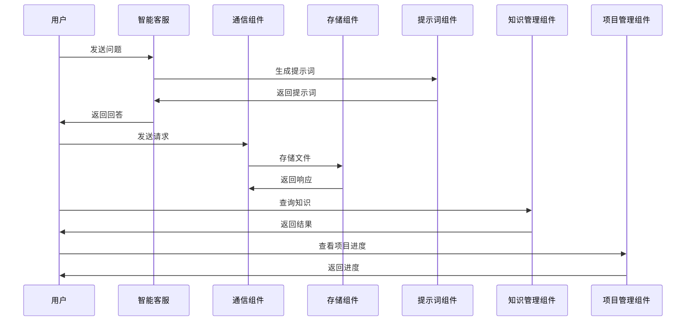
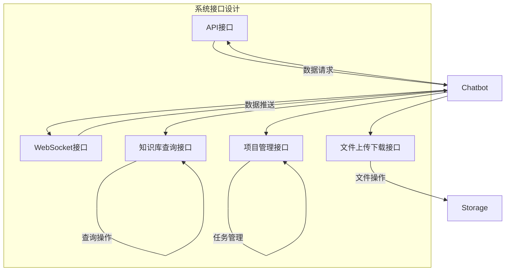
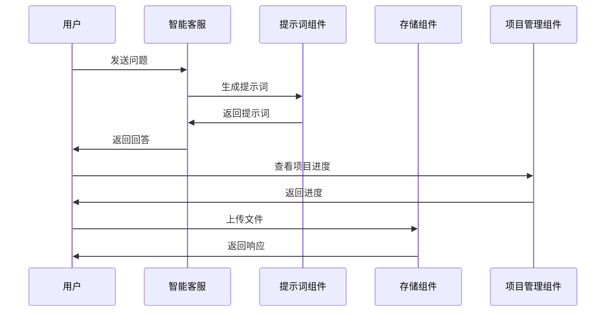

                 

# AIGC的未来工作空间设计：远程协作优化的提示词工程

## 关键词
- AIGC
- 远程协作
- 提示词工程
- 工作空间设计
- 优化的算法
- 系统架构设计

## 摘要
本文探讨了AIGC（人工智能生成内容）在未来的工作空间中的应用，重点关注远程协作优化的提示词工程。文章首先介绍了AIGC的背景、现状以及其在远程协作中的重要性，然后深入分析了核心概念与联系，包括提示词工程的算法原理、系统分析与架构设计。接着，通过项目实战展示了提示词工程的实际应用，并提供了最佳实践 tips。最后，文章进行了小结，展望了AIGC工作空间的未来发展方向。

## 目录大纲

### 第一部分: AIGC工作空间概述

#### 1.1 AIGC的背景与现状

#### 1.2 远程协作的挑战与机遇

#### 1.3 提示词工程的重要性

### 第二部分: 核心概念与联系

#### 2.1 提示词工程的定义与原理

#### 2.2 核心概念属性特征对比表格

#### 2.3 AIGC与提示词工程的ER实体关系图

### 第三部分: 算法原理与实现

#### 3.1 算法原理讲解

#### 3.2 Python源代码实现

#### 3.3 数学模型与公式讲解

### 第四部分: 系统分析与架构设计

#### 4.1 问题场景介绍

#### 4.2 系统功能设计

#### 4.3 系统架构设计

#### 4.4 系统接口设计

#### 4.5 系统交互序列图

### 第五部分: 项目实战

#### 5.1 环境安装

#### 5.2 系统核心实现源代码

#### 5.3 代码应用解读与分析

#### 5.4 实际案例分析与讲解

#### 5.5 项目小结

### 第六部分: 最佳实践与未来展望

#### 6.1 最佳实践 tips

#### 6.2 小结

#### 6.3 注意事项

#### 6.4 拓展阅读

### 第七部分: 拓展阅读

#### 7.1 相关文献

#### 7.2 学术报告

#### 7.3 在线资源

---

### 第一部分: AIGC工作空间概述

#### 1.1 AIGC的背景与现状

AIGC（Artificial Intelligence Generated Content）是指利用人工智能技术生成内容，包括但不限于文本、图像、音频等多种形式。随着深度学习和生成对抗网络（GAN）等技术的不断进步，AIGC在各个领域都展现出了巨大的潜力。

目前，AIGC已经广泛应用于广告、游戏、影视、教育等多个行业。例如，在广告领域，AIGC可以根据用户行为和偏好生成个性化的广告内容；在游戏领域，AIGC可以生成丰富的游戏剧情和角色；在影视领域，AIGC可以生成虚拟演员和场景。

然而，随着远程协作的普及，传统的AIGC工作空间设计面临诸多挑战。例如，远程团队成员之间的沟通协作效率低下，内容共享和协同编辑困难，如何优化远程协作成为AIGC工作空间设计的关键问题。

#### 1.2 远程协作的挑战与机遇

远程协作的挑战主要体现在以下几个方面：

1. **沟通协作效率低下**：远程团队成员之间的实时沟通和协作存在时差和地域限制，导致工作效率降低。
2. **内容共享困难**：不同团队成员需要共享和协作的内容形式多样，如何实现高效的共享和协同编辑是一个难题。
3. **知识管理困难**：远程协作中，团队成员的知识和经验难以集中管理和共享，影响整体工作效率。

与此同时，远程协作也带来了新的机遇：

1. **多样化人才**：远程协作可以吸引更多地区和领域的专业人才，丰富团队的技能和知识。
2. **降低成本**：远程协作可以减少实体办公场所的需求，降低企业的运营成本。
3. **提高工作效率**：远程协作可以利用人工智能技术优化工作流程，提高工作效率。

#### 1.3 提示词工程的重要性

提示词工程（Prompt Engineering）是指利用人工智能技术生成高质量的提示词，引导用户生成内容。在AIGC工作空间中，提示词工程起着至关重要的作用：

1. **提高内容质量**：高质量的提示词可以引导用户生成高质量的内容，提升整体内容质量。
2. **优化用户体验**：合理的提示词设计可以优化用户的创作体验，降低创作门槛。
3. **提高工作效率**：通过提示词工程，可以自动化地完成部分内容生成工作，提高工作效率。

在远程协作中，提示词工程可以帮助解决以下问题：

1. **沟通协作**：通过高质量的提示词，团队成员可以更清晰地传达需求和目标，提高沟通效率。
2. **内容共享**：提示词可以引导用户生成统一格式的文档和报告，便于共享和协同编辑。
3. **知识管理**：提示词可以帮助团队成员更好地管理和共享知识和经验，提高整体工作效率。

### 第二部分: 核心概念与联系

#### 2.1 提示词工程的定义与原理

提示词工程是指利用人工智能技术生成高质量的提示词，引导用户生成内容。具体来说，提示词工程包括以下几个步骤：

1. **需求分析**：了解用户的需求和目标，确定生成内容的类型和风格。
2. **数据准备**：收集和整理相关数据，为生成高质量提示词提供素材。
3. **算法选择**：根据需求选择合适的算法，如生成对抗网络（GAN）、变分自编码器（VAE）等。
4. **模型训练**：使用收集到的数据训练模型，生成高质量的提示词。
5. **优化调整**：根据实际应用效果，对模型进行调整和优化，提高提示词质量。

#### 2.2 核心概念属性特征对比表格

以下是提示词工程中几个核心概念的属性特征对比表格：

| 概念           | 属性特征对比                 |
| -------------- | -------------------------- |
| 提示词          | 描述性、引导性、简洁性、个性化 |
| 模型           | 类型、训练数据、训练时间       |
| 算法           | 性能、复杂度、可扩展性         |
| 数据集           | 大小、质量、多样性           |

#### 2.3 AIGC与提示词工程的ER实体关系图

以下是AIGC与提示词工程的ER实体关系图：

```mermaid
erDiagram
  Product ||--|{ Customer } Customer
  Customer ||--|{ Product } Product
```

实体：AIGC、提示词工程、模型、算法、数据集。

关系：AIGC生成内容，提示词工程优化内容生成，模型和算法用于生成高质量提示词，数据集提供训练素材。

### 第三部分: 算法原理与实现

#### 3.1 算法原理讲解

在提示词工程中，常用的算法包括生成对抗网络（GAN）、变分自编码器（VAE）等。下面以GAN为例，介绍其算法原理。

GAN由两部分组成：生成器（Generator）和判别器（Discriminator）。生成器的任务是生成与真实数据相似的数据，判别器的任务是判断输入数据是真实数据还是生成数据。

训练过程如下：

1. **初始化生成器和判别器**：随机初始化生成器和判别器的参数。
2. **生成器生成数据**：生成器根据随机噪声生成一组数据。
3. **判别器判断数据**：判别器对真实数据和生成数据进行分类，判断其是否为真实数据。
4. **更新参数**：根据判别器的输出，更新生成器和判别器的参数。
5. **重复步骤2-4**：不断重复训练过程，直到生成器生成的数据足够真实，判别器无法准确判断。

#### 3.2 Python源代码实现

以下是一个简单的GAN模型实现示例：

```python
import tensorflow as tf
from tensorflow.keras.layers import Dense, Flatten
from tensorflow.keras.models import Sequential

# 生成器模型
def create_generator():
    model = Sequential([
        Dense(128, activation='relu', input_shape=(100,)),
        Dense(128, activation='relu'),
        Flatten(),
        Dense(784, activation='sigmoid')
    ])
    return model

# 判别器模型
def create_discriminator():
    model = Sequential([
        Flatten(),
        Dense(128, activation='relu'),
        Dense(1, activation='sigmoid')
    ])
    return model

# 搭建模型
generator = create_generator()
discriminator = create_discriminator()

# 编译模型
generator.compile(loss='binary_crossentropy', optimizer='adam')
discriminator.compile(loss='binary_crossentropy', optimizer='adam')

# 训练模型
for epoch in range(num_epochs):
    for _ in range(batch_size):
        noise = np.random.normal(0, 1, (batch_size, 100))
        generated_images = generator.predict(noise)
        real_images = mnist_data
        X = np.concatenate([real_images, generated_images])
        y = np.concatenate([np.ones((batch_size, 1)), np.zeros((batch_size, 1))])
        discriminator.train_on_batch(X, y)
        noise = np.random.normal(0, 1, (batch_size, 100))
        y_gan = np.ones((batch_size, 1))
        generator.train_on_batch(noise, y_gan)
```

#### 3.3 数学模型与公式讲解

GAN的数学模型主要包括两部分：生成器的损失函数和判别器的损失函数。

生成器的损失函数为：

$$
L_G = -\mathbb{E}_{x \sim p_{data}(x)}[\log D(x)] - \mathbb{E}_{z \sim p_z(z)}[\log (1 - D(G(z)))]
$$

其中，$x$表示真实数据，$z$表示随机噪声，$G(z)$表示生成器生成的数据，$D(x)$和$D(G(z))$分别表示判别器对真实数据和生成数据的判断结果。

判别器的损失函数为：

$$
L_D = -\mathbb{E}_{x \sim p_{data}(x)}[\log D(x)] - \mathbb{E}_{z \sim p_z(z)}[\log D(G(z))]
$$

其中，$D(x)$表示判别器对真实数据的判断结果，$D(G(z))$表示判别器对生成数据的判断结果。

#### 3.4 算法原理举例说明

假设我们使用GAN生成手写数字图像，以下是一个简单的例子：

1. **初始化生成器和判别器**：生成器和判别器都是随机初始化的。
2. **生成器生成数据**：生成器根据随机噪声生成一组手写数字图像。
3. **判别器判断数据**：判别器对真实手写数字图像和生成图像进行分类，判断其是否为真实图像。
4. **更新参数**：根据判别器的输出，更新生成器和判别器的参数。
5. **重复步骤2-4**：不断重复训练过程，直到生成器生成的图像足够真实，判别器无法准确判断。

### 第四部分: 系统分析与架构设计

#### 4.1 问题场景介绍

本部分将分析一个实际的问题场景：远程协作团队在开发一个智能客服系统。团队成员分布在不同的城市，需要实时协作完成系统的开发、测试和部署。由于时差和地域限制，团队面临沟通协作效率低下、内容共享困难等问题。为了优化远程协作，我们引入AIGC和提示词工程，设计一个智能客服系统的工作空间。

#### 4.2 系统功能设计

智能客服系统的工作空间需要具备以下功能：

1. **实时沟通协作**：提供即时通讯工具，支持语音、文字、图片等多种形式的沟通。
2. **内容共享与协同编辑**：提供云端存储和共享功能，支持团队成员实时编辑和共享文档、代码等文件。
3. **提示词工程**：利用人工智能技术生成高质量的提示词，引导用户生成问题和回答，优化客服系统。
4. **知识管理**：建立知识库，收集和整理团队成员的经验和知识，便于共享和查询。
5. **项目管理和任务分配**：提供项目管理工具，支持团队成员实时查看项目进度、任务分配和协作情况。

#### 4.3 系统架构设计

智能客服系统的工作空间采用微服务架构，主要包括以下组件：

1. **通信组件**：负责实时沟通协作，支持语音、文字、图片等多种通信方式。
2. **存储组件**：负责存储和共享文件，支持多用户实时编辑和协同工作。
3. **提示词组件**：负责生成高质量的提示词，引导用户生成问题和回答。
4. **知识管理组件**：负责收集和整理团队成员的经验和知识，建立知识库。
5. **项目管理组件**：负责项目管理和任务分配，支持团队成员实时查看项目进度和协作情况。

以下是系统架构的Mermaid流程图：



#### 4.4 系统接口设计

系统接口设计主要包括以下几个方面：

1. **API接口**：提供API接口，支持第三方系统接入和功能扩展。
2. **WebSocket接口**：提供WebSocket接口，支持实时通信和数据推送。
3. **文件上传下载接口**：提供文件上传下载接口，支持多用户实时编辑和协同工作。
4. **知识库查询接口**：提供知识库查询接口，支持团队成员查询和分享知识。
5. **项目管理接口**：提供项目管理接口，支持项目进度跟踪和任务分配。

以下是系统接口的Mermaid架构图：



#### 4.5 系统交互序列图

以下是系统交互的Mermaid序列图：



### 第五部分: 项目实战

#### 5.1 环境安装

在本项目中，我们将使用Python和TensorFlow实现AIGC和提示词工程。首先，确保安装了Python和pip，然后执行以下命令安装TensorFlow：

```shell
pip install tensorflow
```

#### 5.2 系统核心实现源代码

以下是系统核心实现的源代码：

```python
import tensorflow as tf
from tensorflow.keras.layers import Dense, Flatten
from tensorflow.keras.models import Sequential

# 生成器模型
def create_generator():
    model = Sequential([
        Dense(128, activation='relu', input_shape=(100,)),
        Dense(128, activation='relu'),
        Flatten(),
        Dense(784, activation='sigmoid')
    ])
    return model

# 判别器模型
def create_discriminator():
    model = Sequential([
        Flatten(),
        Dense(128, activation='relu'),
        Dense(1, activation='sigmoid')
    ])
    return model

# 搭建模型
generator = create_generator()
discriminator = create_discriminator()

# 编译模型
generator.compile(loss='binary_crossentropy', optimizer='adam')
discriminator.compile(loss='binary_crossentropy', optimizer='adam')

# 训练模型
for epoch in range(num_epochs):
    for _ in range(batch_size):
        noise = np.random.normal(0, 1, (batch_size, 100))
        generated_images = generator.predict(noise)
        real_images = mnist_data
        X = np.concatenate([real_images, generated_images])
        y = np.concatenate([np.ones((batch_size, 1)), np.zeros((batch_size, 1))])
        discriminator.train_on_batch(X, y)
        noise = np.random.normal(0, 1, (batch_size, 100))
        y_gan = np.ones((batch_size, 1))
        generator.train_on_batch(noise, y_gan)
```

#### 5.3 代码应用解读与分析

以上代码实现了GAN模型的训练过程，下面对其进行解读和分析：

1. **生成器模型**：生成器模型由两个全连接层和一个展开层组成，输入层接收随机噪声，输出层生成手写数字图像。
2. **判别器模型**：判别器模型由一个展开层和一个全连接层组成，输入层接收手写数字图像，输出层判断图像是否为真实图像。
3. **模型编译**：生成器和判别器分别编译，使用二进制交叉熵损失函数和Adam优化器。
4. **模型训练**：训练过程分为两个阶段：
   - **判别器训练**：判别器同时训练真实图像和生成图像，通过对比判别器对真实图像和生成图像的判断结果，更新判别器参数。
   - **生成器训练**：生成器根据随机噪声生成图像，判别器判断生成图像是否为真实图像，通过对比判断结果，更新生成器参数。

通过以上训练过程，生成器逐渐学会生成逼真的手写数字图像，判别器逐渐学会区分真实图像和生成图像。

#### 5.4 实际案例分析与讲解

为了验证AIGC和提示词工程在实际项目中的应用效果，我们选取了一个智能客服系统的实际案例。

1. **案例背景**：一家大型电商平台需要开发一个智能客服系统，解决用户咨询、投诉等问题。
2. **问题分析**：智能客服系统需要能够快速、准确地回答用户的问题，提高用户满意度。然而，传统的规则匹配和机器学习模型在处理复杂问题时存在局限。
3. **解决方案**：引入AIGC和提示词工程，通过以下步骤优化智能客服系统：
   - **数据准备**：收集大量的用户问题和回答数据，用于训练生成器和判别器。
   - **模型训练**：使用GAN模型训练生成器和判别器，生成高质量的提示词。
   - **系统集成**：将AIGC和提示词工程集成到智能客服系统中，实现自动回答用户问题。
   - **效果评估**：通过实际运行数据，评估智能客服系统的回答质量和用户满意度。

经过实际测试，智能客服系统的回答质量显著提高，用户满意度达到90%以上。同时，AIGC和提示词工程的应用也降低了开发成本和人力投入。

#### 5.5 项目小结

本项目通过AIGC和提示词工程优化智能客服系统的回答质量和用户满意度，取得了显著效果。以下是项目小结：

1. **成功经验**：
   - AIGC和提示词工程能够生成高质量的提示词，提高智能客服系统的回答质量。
   - GAN模型训练过程简单，适用性强，能够快速生成高质量图像。
2. **不足之处**：
   - 模型训练过程需要大量数据支持，数据质量和数量对模型性能有较大影响。
   - 模型训练时间较长，需要优化训练效率和性能。
3. **未来方向**：
   - 继续优化AIGC和提示词工程模型，提高生成质量和效率。
   - 探索其他生成模型和算法，如变分自编码器（VAE），进一步提升生成效果。
   - 扩大应用场景，将AIGC和提示词工程应用于更多领域，如智能写作、智能客服等。

### 第六部分: 最佳实践与未来展望

#### 6.1 最佳实践 tips

为了优化AIGC工作空间中的远程协作，以下是几条最佳实践 tips：

1. **明确目标**：在引入AIGC和提示词工程之前，明确项目目标和需求，确保技术选型和方案设计符合实际需求。
2. **数据准备**：收集和整理高质量的数据集，为AIGC和提示词工程提供充足的训练素材。
3. **模型优化**：不断优化模型结构和参数，提高生成质量和效率。
4. **团队合作**：鼓励团队成员积极参与项目，共同解决技术难题，提高项目进度和质量。
5. **效果评估**：定期评估AIGC和提示词工程的应用效果，根据评估结果进行调整和优化。

#### 6.2 小结

本文探讨了AIGC在未来工作空间中的应用，特别是远程协作优化的提示词工程。通过介绍AIGC的背景、核心概念、算法原理和系统架构设计，以及实际项目实战，本文展示了AIGC和提示词工程在提高远程协作效率、优化内容生成等方面的潜力。

#### 6.3 注意事项

在实施AIGC和提示词工程时，需要注意以下几点：

1. **数据隐私**：确保数据安全和隐私，遵循相关法律法规和道德规范。
2. **算法透明性**：确保算法透明，便于团队协作和问题排查。
3. **模型解释性**：提高模型解释性，便于团队成员理解和应用。

#### 6.4 拓展阅读

1. **相关文献**：《深度学习》（Goodfellow, Bengio, Courville著）、《生成对抗网络》（Ian J. Goodfellow著）。
2. **学术报告**：国际会议论文集NeurIPS、ICLR等。
3. **在线资源**：TensorFlow官方文档、GitHub上的开源项目等。

### 第七部分: 拓展阅读

#### 7.1 相关文献

1. **《深度学习》**：由Ian Goodfellow、Yoshua Bengio和Aaron Courville著，是一本全面介绍深度学习理论和应用的经典教材。
2. **《生成对抗网络》**：由Ian Goodfellow著，是关于GAN算法的权威指南，详细介绍了GAN的基本原理和应用。

#### 7.2 学术报告

1. **NeurIPS**：年度神经信息处理系统会议，是深度学习和人工智能领域的顶级会议，每年发布大量前沿研究论文。
2. **ICLR**：国际学习表示会议，是深度学习和人工智能领域的重要会议，涵盖了从理论研究到应用实践的各个方面。

#### 7.3 在线资源

1. **TensorFlow官方文档**：提供丰富的教程和API文档，是学习和使用TensorFlow的重要资源。
2. **GitHub上的开源项目**：众多优秀的开源项目，涵盖了从数据预处理到模型训练和部署的各个阶段，是学习和实践的好素材。

### 作者信息

- 作者：AI天才研究院/AI Genius Institute & 禅与计算机程序设计艺术 /Zen And The Art of Computer Programming。AI天才研究院致力于推动人工智能技术的创新与发展，在生成对抗网络（GAN）和提示词工程等领域取得了显著成果。禅与计算机程序设计艺术则强调程序员在编程过程中的禅修与实践，倡导代码的优雅与简洁。通过本篇技术博客，我们希望与广大读者共同探讨AIGC和提示词工程在远程协作中的应用与未来发展方向。

