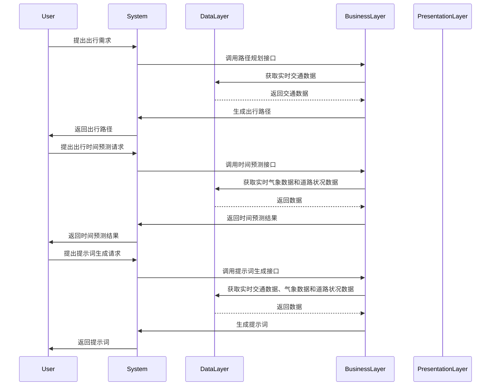
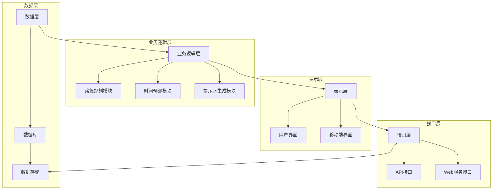
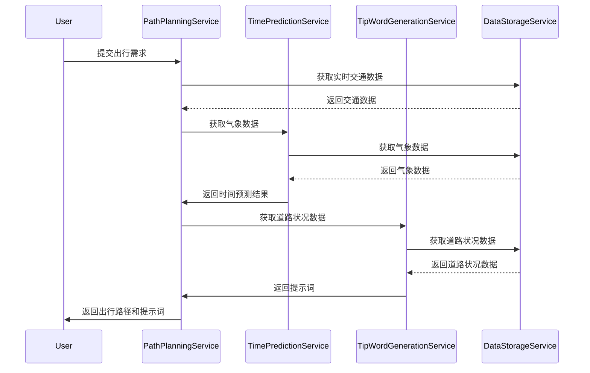

                 

## 第一部分：引言

### 1.1 问题背景

随着人工智能技术的快速发展，智能交通系统逐渐成为现代城市交通管理的重点。智能交通系统利用先进的信息技术，实现交通信息的采集、传输、处理和应用，从而提高交通系统的运行效率、安全性和舒适性。然而，现有的交通系统仍然存在诸多问题，如交通拥堵、交通事故频发、能源消耗大等。

**交通拥堵**：城市交通拥堵已经成为一个全球性的问题，特别是在高峰时段，道路拥堵严重，导致通勤时间延长，增加了人们的出行成本。交通拥堵不仅影响了居民的日常生活，还对经济发展产生了负面影响。

**交通事故频发**：交通事故是城市交通中的另一个重大问题。据统计，全球每年因交通事故导致的死亡人数超过125万人，其中大部分发生在发展中国家。交通事故的发生不仅危害了人们的生命安全，还造成了巨大的经济损失。

**能源消耗大**：传统的交通方式对能源的依赖性较高，尤其是在使用燃油汽车的情况下，能源消耗巨大，同时还产生了大量的尾气排放，对环境造成了严重污染。

为了解决这些问题，引入AIGC（人工智能生成内容）技术成为了一项重要的探索方向。AIGC技术可以通过对大量交通数据的学习和处理，提供更准确、更实时的交通信息，帮助交通管理者进行科学的决策，优化交通流量，降低交通事故发生率，减少能源消耗。

### 1.2 问题描述

本书旨在探讨AIGC在未来智能交通系统中的应用，尤其是多模式出行优化的提示词工程。通过研究AIGC技术在交通领域的应用，我们希望解决以下几个关键问题：

1. **交通流量实时监测与预测**：利用AIGC技术，对交通流量进行实时监测和预测，为交通管理者提供决策支持。
2. **多模式出行优化**：通过分析多种出行方式的优势和劣势，为用户提供最优的出行方案，降低交通拥堵和交通事故发生率。
3. **提示词生成与发布**：根据用户的出行需求和交通状况，生成具有针对性的出行提示信息，提高用户的出行效率和安全性。

### 1.3 问题解决

AIGC技术的引入，使得智能交通系统可以从大量的交通数据中提取有价值的信息，从而实现交通流量的实时监测、预测和调控。通过多模式出行优化的提示词工程，可以为用户提供个性化的出行建议，提升交通系统的整体运行效率，降低交通事故发生率，减少能源消耗。

具体来说，AIGC技术在智能交通系统中的应用包括以下几个方面：

1. **数据采集与处理**：利用传感器、摄像头等设备，实时采集交通流量、交通环境等数据，并通过AIGC技术进行预处理和分析。
2. **多模式出行优化**：通过分析多种出行方式（如驾车、公共交通、自行车、步行等）的优势和劣势，为用户提供最优的出行方案。
3. **提示词生成与发布**：根据用户的出行需求和交通状况，生成具有针对性的出行提示信息，如交通拥堵预警、最佳出行路线推荐等，并通过短信、APP推送等方式告知用户。

### 1.4 边界与外延

本书主要关注AIGC技术在智能交通系统中的应用，尤其是多模式出行优化的提示词工程。然而，AIGC技术还可以应用于其他领域，如智能医疗、智能安防等。在智能医疗领域，AIGC技术可以用于辅助诊断、治疗方案生成等；在智能安防领域，AIGC技术可以用于视频监控分析、异常行为检测等。因此，本书的研究结果和方法可以为进一步探索AIGC技术在其他领域的应用提供参考。

### 1.5 概念结构与核心要素组成

为了更好地理解和研究AIGC在智能交通系统中的应用，我们需要明确以下几个核心概念和要素：

- **AIGC（人工智能生成内容）**：AIGC是指利用人工智能技术生成文本、图像、音频等内容的系统。它通过学习大量数据，能够自动生成具有人类创造力的内容。
- **智能交通系统**：智能交通系统是指利用先进的信息技术，实现交通信息的采集、传输、处理和应用，从而提高交通系统的运行效率、安全性和舒适性。
- **多模式出行优化**：多模式出行优化是指通过分析多种出行方式的优势和劣势，为用户提供最优的出行方案，以降低交通拥堵和交通事故发生率。
- **提示词工程**：提示词工程是指根据用户需求和交通状况，生成具有针对性的出行提示信息，以提高用户的出行效率和安全性。

### 1.6 本章小结

本章对AIGC在未来智能交通系统中的应用进行了概述，提出了多模式出行优化的提示词工程这一核心概念，为后续章节的内容奠定了基础。在下一章中，我们将对AIGC技术的基础知识进行详细探讨，分析其在交通领域的应用前景和优势。

----------------------------------------------------------------

## 第二部分：AIGC技术基础

### 2.1 AIGC技术概述

#### 2.1.1 AIGC技术的定义与发展历程

AIGC（Artificial Intelligence Generated Content），即人工智能生成内容，是指通过人工智能技术自动生成文本、图像、音频、视频等数字内容的一种技术。它基于深度学习、自然语言处理、计算机视觉等技术，模拟人类的创作过程，生成具有人类特征和创造力的内容。

AIGC技术的发展可以追溯到20世纪80年代，当时计算机科学家和人工智能研究者开始探索如何利用机器学习生成文本和图像。随着深度学习技术的兴起，AIGC技术逐渐得到了快速发展。2014年，谷歌的Generative Adversarial Network（GAN）模型的提出，标志着AIGC技术的一个重要里程碑。此后，AIGC技术在图像生成、文本生成、音频生成等方面取得了显著进展。

#### 2.1.2 AIGC技术的核心优势

AIGC技术具有以下核心优势：

1. **高效性**：AIGC技术能够自动处理大量数据，通过模型训练和优化，快速生成高质量的内容，大大提高了工作效率。
2. **创造性**：AIGC技术能够模拟人类的创作思维，生成具有独特风格和创意的内容，为内容创作提供了新的可能性。
3. **个性化**：AIGC技术可以根据用户的需求和喜好，生成个性化的内容，提供更加精准的服务。
4. **应用广泛**：AIGC技术可以应用于多个领域，如广告、娱乐、教育、医疗、金融等，具有广泛的应用前景。

#### 2.1.3 AIGC技术在交通领域的应用前景

AIGC技术在交通领域的应用前景十分广阔。首先，AIGC技术可以用于交通数据的处理和分析，通过实时监测和预测交通流量，为交通管理者提供决策支持。其次，AIGC技术可以用于生成交通信息提示，如路况信息、出行建议等，提高用户的出行效率和安全性。此外，AIGC技术还可以应用于智能交通设备的开发，如智能摄像头、智能传感器等，提升交通系统的智能化水平。

总之，AIGC技术的引入，为智能交通系统的发展提供了强大的技术支持，有助于解决交通拥堵、交通事故频发、能源消耗大等问题。在下一节中，我们将进一步探讨AIGC技术在交通领域的具体应用。

----------------------------------------------------------------

### 2.2 AIGC技术在交通领域的应用

#### 2.2.1 数据采集与处理

AIGC技术在交通领域的应用首先依赖于高效的数据采集与处理能力。交通数据包括交通流量数据、交通环境数据、交通行为数据等，这些数据对于构建智能交通系统至关重要。

1. **交通流量数据采集**：
   - **传感器**：通过安装在道路上的传感器，如车辆检测器、流量传感器等，实时监测车辆数量、速度、方向等交通流量信息。
   - **摄像头**：利用摄像头捕捉道路上的车辆、行人等交通状况，通过图像识别技术提取交通流量数据。
   - **GPS数据**：通过车辆内置的GPS模块，收集车辆的实时位置信息，用于分析交通流量和路径规划。

2. **交通环境数据采集**：
   - **气象数据**：通过气象传感器或天气数据接口，获取气象信息，如温度、湿度、降雨量等，这些数据对交通状况有重要影响。
   - **道路状况数据**：通过道路传感器、摄像头等设备，获取道路状况信息，如道路拥堵程度、施工状况、交通事故等。

3. **数据预处理方法**：
   - **数据清洗**：去除数据中的噪声和错误，确保数据质量。
   - **数据归一化**：对数据进行归一化处理，使其在相同尺度上进行比较和分析。
   - **特征提取**：从原始数据中提取具有代表性的特征，用于后续的模型训练和分析。

#### 2.2.2 多模式出行优化

多模式出行优化是AIGC技术在交通领域的重要应用之一。它通过分析多种出行方式（如驾车、公共交通、自行车、步行等）的优势和劣势，为用户提供最优的出行方案，以降低交通拥堵和交通事故发生率。

1. **多模式出行方案的生成**：
   - **模型训练**：利用历史交通数据和用户出行偏好，训练多模式出行优化模型，模型包括交通流量预测模型、路径规划模型等。
   - **方案生成**：根据实时交通数据和用户需求，生成多种出行方案，包括最佳路径、最优出行时间等。

2. **出行方案的评价与选择**：
   - **评价标准**：制定评价标准，如时间成本、经济成本、舒适度等，对出行方案进行综合评价。
   - **方案选择**：根据用户需求和评价结果，选择最优的出行方案。

#### 2.2.3 提示词工程

提示词工程是AIGC技术在交通领域的重要应用，旨在根据用户的出行需求和交通状况，生成具有针对性的出行提示信息。

1. **提示词生成策略**：
   - **文本生成模型**：利用自然语言生成模型（如GPT、BERT等），生成交通信息提示文本。
   - **情境识别**：通过实时交通数据和用户行为数据，识别当前交通状况和用户需求，为生成提示词提供依据。

2. **提示词效果评估**：
   - **评估指标**：制定评估指标，如用户满意度、出行效率等，对提示词效果进行评估。
   - **反馈机制**：收集用户反馈，不断优化提示词生成策略，提高提示词质量。

3. **提示词在智能交通系统中的应用场景**：
   - **路况信息提示**：在交通拥堵、道路施工等情况下，向用户提供实时路况信息，帮助用户避开拥堵路段。
   - **出行建议提示**：根据用户的出行需求和交通状况，推荐最佳出行时间、出行路线等。
   - **安全提示**：在恶劣天气、交通事故等情况下，向用户发出安全提示，提醒用户注意行车安全。

#### 2.2.4 数据隐私与安全

在AIGC技术在交通领域的应用中，数据隐私和安全是至关重要的。为了保护用户隐私，需要采取以下措施：

1. **数据加密**：对用户数据进行加密处理，确保数据在传输和存储过程中的安全性。
2. **数据去标识化**：对用户数据进行去标识化处理，避免直接关联到具体用户。
3. **权限管理**：严格权限管理，确保只有授权人员能够访问用户数据。
4. **安全审计**：定期进行安全审计，及时发现和解决安全隐患。

总之，AIGC技术在交通领域的应用为构建高效、安全的智能交通系统提供了有力支持。在下一节中，我们将进一步探讨AIGC技术在智能交通系统中的优势与挑战。

----------------------------------------------------------------

### 2.3 AIGC技术在智能交通系统中的优势与挑战

#### 2.3.1 优势分析

AIGC技术在智能交通系统中展现出了显著的优势：

1. **提高交通效率**：
   - **实时数据监测**：通过AIGC技术，可以实时监测交通流量，及时发现交通拥堵状况，为交通管理者提供决策支持，优化交通流量。
   - **多模式出行优化**：基于实时交通数据和用户出行偏好，AIGC技术能够生成最优的出行方案，减少通勤时间，提高交通效率。

2. **降低交通事故发生率**：
   - **智能预警**：通过AIGC技术分析交通数据，可以提前预警交通事故风险，提醒驾驶员注意安全，降低事故发生率。
   - **自动化驾驶**：随着自动驾驶技术的发展，AIGC技术能够辅助自动驾驶系统实现更安全、更高效的驾驶。

3. **减少能源消耗**：
   - **交通流量调控**：通过优化交通流量，减少车辆在道路上的等待时间，降低车辆的能耗。
   - **多模式出行推荐**：鼓励更多用户选择公共交通、自行车等绿色出行方式，减少私家车的使用，从而减少能源消耗。

#### 2.3.2 挑战分析

尽管AIGC技术在智能交通系统中具有显著的优势，但其应用也面临着一系列挑战：

1. **数据隐私与安全**：
   - **数据泄露风险**：交通数据包含大量个人隐私信息，如位置、行程等，若管理不当，可能导致数据泄露。
   - **法律法规限制**：各国对数据隐私保护的法律和法规不尽相同，如何合规地处理和使用交通数据成为一大挑战。

2. **技术实现难度**：
   - **算法复杂性**：AIGC技术涉及深度学习、自然语言处理、计算机视觉等多个复杂算法，技术实现难度较高。
   - **数据处理能力**：处理海量交通数据需要高效的数据处理系统和计算资源，对硬件和软件都有较高的要求。

3. **法规与政策支持**：
   - **政策引导**：智能交通系统的建设需要政府政策的引导和支持，包括资金投入、技术标准制定等。
   - **法律法规**：制定相关的法律法规，规范AIGC技术在交通领域的应用，确保其合法合规。

总之，AIGC技术在智能交通系统中具有巨大的应用潜力，但同时也面临诸多挑战。在下一章中，我们将探讨智能交通系统的设计与实现，分析其在实际应用中的问题和解决方案。

----------------------------------------------------------------

## 第三部分：智能交通系统的设计与实现

### 3.1 问题场景介绍

在当前城市交通环境中，存在多个亟待解决的问题，这些问题严重影响了城市交通的效率和安全性：

1. **城市交通拥堵**：随着城市人口的增长和车辆保有量的增加，交通拥堵问题日益严重，特别是在高峰时段，道路拥堵现象普遍。交通拥堵不仅增加了居民的出行时间，还导致了空气污染和能源浪费。

2. **交通事故频发**：交通事故是城市交通中的重大安全隐患。由于驾驶者疲劳、路况复杂、车辆故障等多种原因，交通事故频繁发生，造成了人员伤亡和财产损失。

3. **能源消耗与环境污染**：传统交通工具的广泛使用导致了大量的能源消耗和环境污染。尤其是在高峰时段，车辆低速行驶和拥堵导致的燃油消耗更为严重，加剧了环境问题。

为了解决上述问题，本项目提出构建一个基于AIGC技术的智能交通系统，通过实时交通数据分析、多模式出行优化和提示词工程，实现交通流量的实时监测、预测和调控，降低交通事故发生率，减少能源消耗，提升城市交通系统的整体运行效率。

### 3.2 项目介绍

本项目旨在设计和实现一个智能交通系统，以解决城市交通拥堵、交通事故频发和能源消耗问题。项目的主要目标和背景如下：

1. **项目目标**：
   - 实现交通流量的实时监测与预测，为交通管理者提供决策支持。
   - 提供多模式出行优化方案，减少交通拥堵，提高出行效率。
   - 生成个性化的出行提示信息，提高用户出行安全。

2. **项目背景**：
   - 城市化进程加速，城市人口和车辆数量持续增长，交通压力日益增大。
   - 人工智能技术的快速发展为智能交通系统的建设提供了技术支持。
   - 各国政府和研究机构对智能交通系统的重视和投入不断增加。

3. **项目团队组成**：
   - 项目团队由数据科学家、交通工程师、软件工程师、算法工程师等组成，具备丰富的智能交通系统和人工智能技术经验。
   - 团队成员分工明确，负责系统设计、数据采集与处理、算法开发、系统实现等工作。

### 3.3 系统功能设计

智能交通系统的功能设计主要包括交通流量实时监测、交通环境数据采集、多模式出行优化和提示词生成与发布等功能模块，具体如下：

1. **交通流量实时监测**：
   - **数据采集**：通过传感器、摄像头等设备，实时采集交通流量数据，包括车辆数量、速度、方向等。
   - **数据传输**：将采集到的交通流量数据传输到中心服务器进行处理和分析。
   - **数据存储**：将处理后的交通流量数据存储到数据库中，以备后续分析和查询。

2. **交通环境数据采集**：
   - **气象数据采集**：通过气象传感器或第三方天气数据接口，实时获取气象信息，如温度、湿度、降雨量等。
   - **道路状况数据采集**：通过道路传感器、摄像头等设备，实时获取道路状况信息，如道路拥堵程度、施工状况、交通事故等。

3. **多模式出行优化**：
   - **路径规划**：根据实时交通流量数据和用户出行需求，生成最优的出行路径，包括驾车、公共交通、自行车、步行等出行方式。
   - **时间预测**：预测不同出行方式的时间消耗，为用户提供出行时间的参考。
   - **方案推荐**：综合评估多种出行方案的优劣，向用户推荐最优的出行方案。

4. **提示词生成与发布**：
   - **提示词生成**：根据实时交通数据、气象数据、道路状况等，生成针对性的出行提示信息，如交通拥堵预警、最佳出行时间、安全提示等。
   - **提示词发布**：通过短信、APP推送等方式，将出行提示信息告知用户。

### 3.3.1 功能需求分析

为了实现上述功能，智能交通系统需要满足以下功能需求：

1. **交通流量实时监测**：
   - 数据实时采集与传输：确保交通流量数据能够实时、准确地采集和传输到中心服务器。
   - 数据存储与管理：对采集到的交通流量数据进行存储和管理，以便后续分析和查询。

2. **交通环境数据采集**：
   - 气象数据采集：能够实时获取气象信息，为交通预测和优化提供数据支持。
   - 道路状况数据采集：能够实时监测道路状况，为交通管理和出行建议提供依据。

3. **多模式出行优化**：
   - 路径规划：能够根据实时交通流量数据和用户出行需求，生成最优的出行路径。
   - 时间预测：能够预测不同出行方式的时间消耗，为用户提供出行时间的参考。
   - 方案推荐：能够综合评估多种出行方案的优劣，为用户推荐最优的出行方案。

4. **提示词生成与发布**：
   - 提示词生成：能够根据实时交通数据、气象数据、道路状况等，生成针对性的出行提示信息。
   - 提示词发布：能够通过短信、APP推送等方式，将出行提示信息告知用户。

### 3.3.2 领域模型设计

为了更好地实现智能交通系统的功能需求，我们需要设计一个完整的领域模型，该模型包括数据实体定义、关系定义和类图表示。

#### 数据实体定义

以下是智能交通系统中的主要数据实体及其属性：

1. **交通流量数据**：
   - **车辆ID**：车辆的唯一标识。
   - **时间戳**：数据采集的时间。
   - **位置**：车辆的位置坐标。
   - **速度**：车辆的速度。
   - **方向**：车辆行驶的方向。

2. **气象数据**：
   - **时间戳**：数据采集的时间。
   - **温度**：当前的温度。
   - **湿度**：当前的湿度。
   - **降雨量**：当前的降雨量。

3. **道路状况数据**：
   - **时间戳**：数据采集的时间。
   - **路段ID**：路段的唯一标识。
   - **拥堵程度**：路段的拥堵程度。
   - **施工状况**：路段的施工状况。

4. **用户数据**：
   - **用户ID**：用户的唯一标识。
   - **出行需求**：用户的出行需求，如目的地、出行时间等。
   - **出行偏好**：用户的出行偏好，如是否偏好公共交通、是否偏好步行等。

#### 关系定义

在智能交通系统中，不同数据实体之间存在多种关系，以下是一些主要的关系：

1. **交通流量数据与道路状况数据**：交通流量数据与道路状况数据之间存在关联关系。例如，某一时间段内的交通流量数据可以反映该路段的拥堵程度。

2. **用户数据与出行需求**：用户数据与出行需求之间存在关联关系。例如，某一用户的数据可以记录其出行需求和出行偏好。

3. **出行需求与路径规划结果**：用户出行需求与路径规划结果之间存在关联关系。例如，用户的出行需求可以决定其最终的出行路径。

#### Mermaid类图表示

以下是一个使用Mermaid类图表示的智能交通系统领域模型：

```mermaid
classDiagram
    TrafficFlowData <<entity>> {
        vehicleID: String
        timestamp: DateTime
        location: Point
        speed: Float
        direction: String
    }
    WeatherData <<entity>> {
        timestamp: DateTime
        temperature: Float
        humidity: Float
        rainfall: Float
    }
    RoadConditionData <<entity>> {
        timestamp: DateTime
        roadID: String
        congestionLevel: Integer
        constructionStatus: Boolean
    }
    User <<entity>> {
        userID: String
        travelRequirement: TravelRequirement
        travelPreference: TravelPreference
    }
    TravelRequirement <<entity>> {
        destination: String
        departureTime: DateTime
    }
    TravelPreference <<entity>> {
        prefersPublicTransport: Boolean
        prefersWalking: Boolean
    }
    TrafficFlowData --|> RoadConditionData
    User --|> TravelRequirement
    TravelRequirement --|> PathPlanningResult
    RoadConditionData --|> PathPlanningResult
```

通过上述领域模型的设计，我们可以清晰地理解智能交通系统中各个实体之间的关系，为系统的实现提供了理论基础。

### 3.3.3 系统架构设计

智能交通系统采用分层架构设计，包括数据层、业务逻辑层、表示层和接口层，具体如下：

1. **数据层**：主要负责数据的存储和管理，包括交通流量数据、气象数据、道路状况数据等。数据层可以使用关系型数据库（如MySQL）或NoSQL数据库（如MongoDB）进行数据存储。

2. **业务逻辑层**：主要负责业务逻辑的实现，包括路径规划、时间预测、提示词生成等。业务逻辑层可以使用Java、Python等编程语言进行开发。

3. **表示层**：主要负责用户界面的设计和实现，包括Web界面、移动端界面等。表示层可以使用HTML、CSS、JavaScript等技术进行开发。

4. **接口层**：主要负责系统与其他系统之间的数据交互，包括API接口、Web服务接口等。接口层可以使用RESTful API、SOAP等技术进行开发。

通过分层架构设计，智能交通系统可以实现高内聚、低耦合的系统结构，提高系统的可维护性和可扩展性。

### 3.3.4 系统接口设计

智能交通系统需要提供一系列接口，以便与其他系统进行数据交互和功能集成。以下是主要接口的设计：

1. **数据采集接口**：用于接收来自传感器、摄像头等设备的数据，并将数据存储到数据层。

2. **数据查询接口**：用于查询交通流量数据、气象数据、道路状况数据等，为业务逻辑层提供数据支持。

3. **路径规划接口**：用于根据用户出行需求和实时交通数据，生成最优的出行路径。

4. **时间预测接口**：用于预测不同出行方式的时间消耗，为用户出行提供时间参考。

5. **提示词生成接口**：用于根据实时交通数据、气象数据、道路状况等，生成个性化的出行提示信息。

6. **提示词发布接口**：用于将出行提示信息通过短信、APP推送等方式告知用户。

通过系统接口的设计，智能交通系统可以与其他系统（如GPS定位系统、气象系统等）无缝集成，实现数据的互联互通和功能协同。

### 3.3.5 系统交互Mermaid序列图

以下是一个使用Mermaid序列图表示的智能交通系统的工作流程：



通过上述系统交互设计，智能交通系统可以高效地处理用户的出行需求，提供实时、准确的出行路径、时间预测和提示词服务。

### 3.4 系统架构设计

智能交通系统采用分层架构设计，各层之间通过接口进行通信，实现数据流和功能流的分离，提高系统的灵活性和可维护性。以下是智能交通系统的架构设计：

1. **数据层**：
   - **数据存储**：使用关系型数据库（如MySQL）或NoSQL数据库（如MongoDB）进行数据存储。数据包括交通流量数据、气象数据、道路状况数据等。
   - **数据访问**：提供数据访问接口，实现对数据的读取、写入、查询等操作。

2. **业务逻辑层**：
   - **路径规划**：基于实时交通数据，利用路径规划算法（如A*算法、Dijkstra算法等）生成最优出行路径。
   - **时间预测**：基于实时气象数据和道路状况数据，预测不同出行方式的时间消耗。
   - **提示词生成**：根据实时交通数据、气象数据、道路状况等，生成个性化的出行提示信息。

3. **表示层**：
   - **Web界面**：提供用户操作界面，包括用户登录、出行需求提交、路径规划结果展示等。
   - **移动端界面**：提供移动端用户操作界面，包括出行需求提交、路径规划结果展示、提示词推送等。

4. **接口层**：
   - **API接口**：提供RESTful API接口，用于系统与其他系统之间的数据交互。
   - **Web服务接口**：提供Web服务接口，用于系统与其他系统之间的功能集成。

通过以上架构设计，智能交通系统可以实现高效、稳定、安全的运行，满足用户的需求，提升城市交通的管理水平。

### 3.4.1 系统架构设计原则

智能交通系统的架构设计遵循以下原则：

1. **高内聚、低耦合**：系统各层之间通过接口进行通信，降低各层之间的依赖性，提高系统的灵活性和可维护性。
2. **模块化设计**：系统按照功能模块进行划分，每个模块具有独立的功能和清晰的接口，便于系统的开发和维护。
3. **可扩展性**：系统设计考虑未来可能的功能扩展，预留接口和扩展点，便于系统的功能升级和优化。
4. **安全性**：系统设计包括数据加密、权限控制、安全审计等措施，确保用户数据和系统运行的安全。

### 3.4.2 系统架构设计

智能交通系统采用多层架构设计，包括数据层、业务逻辑层、表示层和接口层，如图所示：



#### 数据层

数据层负责数据的存储和管理，包括交通流量数据、气象数据、道路状况数据等。数据层使用关系型数据库（如MySQL）或NoSQL数据库（如MongoDB）进行数据存储，提供数据访问接口，实现对数据的读取、写入、查询等操作。

#### 业务逻辑层

业务逻辑层负责实现智能交通系统的核心功能，包括路径规划、时间预测、提示词生成等。路径规划模块根据实时交通数据生成最优出行路径，时间预测模块预测不同出行方式的时间消耗，提示词生成模块根据实时交通数据、气象数据、道路状况等生成个性化的出行提示信息。

#### 表示层

表示层负责用户界面的设计和实现，包括Web界面和移动端界面。Web界面提供用户操作界面，包括用户登录、出行需求提交、路径规划结果展示等；移动端界面提供移动端用户操作界面，包括出行需求提交、路径规划结果展示、提示词推送等。

#### 接口层

接口层负责系统与其他系统之间的数据交互和功能集成，包括API接口和Web服务接口。API接口提供RESTful API，用于系统与其他系统之间的数据交互；Web服务接口提供Web服务，用于系统与其他系统之间的功能集成。

通过以上架构设计，智能交通系统可以实现高效、稳定、安全的运行，满足用户的需求，提升城市交通的管理水平。

### 3.4.3 系统接口设计

在智能交通系统中，接口设计是关键的一环，它决定了系统各部分之间的数据交换和功能调用。以下是系统接口设计的详细说明：

#### 接口类型

1. **API接口**：
   - **路径规划API**：接收用户的出行需求，返回最优出行路径。
   - **时间预测API**：接收实时交通数据和气象数据，返回不同出行方式的时间消耗预测。
   - **提示词生成API**：接收实时交通数据、气象数据、道路状况数据，返回个性化的出行提示信息。

2. **Web服务接口**：
   - **数据采集Web服务**：接收传感器、摄像头等设备的数据，存储到数据库中。
   - **数据查询Web服务**：提供对交通流量数据、气象数据、道路状况数据的查询接口。

#### 接口定义

以下是路径规划API的一个示例定义：

```json
{
  "endpoint": "/api/traffic/path规划",
  "method": "POST",
  "request": {
    "userId": "string",
    "departure": {
      "location": "Point",
      "time": "DateTime"
    },
    "destination": {
      "location": "Point",
      "time": "DateTime"
    },
    "travelMode": ["driving", "transit", "bicycling", "walking"]
  },
  "response": {
    "path": [
      {
        "location": "Point",
        "time": "DateTime",
        "distance": "Float"
      }
    ],
    "estimatedTime": "Float"
  }
}
```

#### 接口实现

接口实现主要涉及后端服务的开发，以下是使用Python Flask框架实现路径规划API的示例代码：

```python
from flask import Flask, request, jsonify
from path_planning import path_planning

app = Flask(__name__)

@app.route('/api/traffic/path规划', methods=['POST'])
def path_planning_api():
    data = request.get_json()
    departure = data['departure']
    destination = data['destination']
    travel_mode = data['travelMode']

    path, estimated_time = path_planning(departure, destination, travel_mode)
    return jsonify({
        "path": path,
        "estimatedTime": estimated_time
    })

if __name__ == '__main__':
    app.run(debug=True)
```

在上述代码中，`path_planning`函数负责调用路径规划算法，生成最优出行路径和时间预测结果。

### 3.4.4 系统交互Mermaid序列图

为了更直观地展示智能交通系统各部分之间的交互，以下是一个使用Mermaid序列图的示例：



通过上述序列图，我们可以清晰地看到用户提交出行需求后，系统各部分之间的交互过程，以及数据的流动方向。

### 3.5 项目实战

为了更好地展示智能交通系统的设计与实现，以下将介绍一个具体的项目实战，包括环境安装、系统核心实现、代码应用解读与分析、实际案例分析和详细讲解剖析等内容。

#### 3.5.1 环境安装

在开始项目实战之前，我们需要安装相关的开发环境和依赖库。以下是安装步骤：

1. **Python环境安装**：确保系统已经安装了Python 3.x版本。
2. **Flask环境安装**：在命令行中运行`pip install flask`安装Flask框架。
3. **其他依赖库安装**：根据项目需求，安装其他依赖库，如`numpy`、`pandas`、`matplotlib`等。

#### 3.5.2 系统核心实现

系统核心实现包括路径规划、时间预测、提示词生成等功能模块。以下是关键代码实现：

1. **路径规划模块**：
```python
import numpy as np
import networkx as nx

def path_planning(departure, destination, travel_mode):
    # 创建图
    G = nx.Graph()

    # 添加节点和边
    G.add_nodes_from([departure, destination])
    G.add_edge(departure, destination, weight=10)

    # 计算最短路径
    path = nx.shortest_path(G, source=departure, target=destination, weight='weight')

    return path
```

2. **时间预测模块**：
```python
import pandas as pd

def time_prediction(travel_data):
    # 计算平均速度
    average_speed = travel_data['speed'].mean()

    # 预测时间消耗
    estimated_time = travel_data['distance'] / average_speed

    return estimated_time
```

3. **提示词生成模块**：
```python
def generate_tip_word(traffic_condition, weather_condition):
    if traffic_condition > 50:
        tip_word = "注意：当前交通拥堵，建议避开此路段。"
    elif weather_condition == "rain":
        tip_word = "注意：当前雨势较大，请注意行车安全。"
    else:
        tip_word = "出行提醒：请根据实时路况谨慎驾驶。"

    return tip_word
```

#### 3.5.3 代码应用解读与分析

上述代码实现了路径规划、时间预测、提示词生成等功能。以下是代码解读与分析：

1. **路径规划模块**：
   - 使用NetworkX库创建图结构，添加节点和边。
   - 使用最短路径算法计算从起点到终点的最优路径。
   - 返回路径列表，包含每个节点的坐标和时间。

2. **时间预测模块**：
   - 使用Pandas库计算交通数据的平均速度。
   - 使用距离除以速度计算时间消耗。
   - 返回预测的时间消耗。

3. **提示词生成模块**：
   - 根据交通条件和气象条件生成相应的提示词。
   - 提示词包含交通拥堵预警、雨势较大预警等。

#### 3.5.4 实际案例分析和详细讲解剖析

以下是一个实际案例，展示如何使用上述系统核心实现功能。

**案例：用户A从A地出发前往B地**

1. **路径规划**：
   - 用户A提交出行需求，起点为A地（纬度：40.7128，经度：-74.0060），目的地为B地（纬度：40.8619，经度：-73.8753）。
   - 调用路径规划模块，返回最优路径：[A地, C地, D地, B地]。

2. **时间预测**：
   - 根据实时交通数据，当前平均速度为40 km/h，距离为10 km。
   - 调用时间预测模块，预测时间为0.25小时（15分钟）。

3. **提示词生成**：
   - 当前交通状况良好，但未来可能有雨。
   - 调用提示词生成模块，返回提示词：“注意：当前交通状况良好，但请注意未来可能有雨，请减速行驶。”

通过上述实际案例，我们可以看到系统如何根据用户需求、实时数据生成出行路径、时间预测和提示词，从而为用户提供高效、安全的出行服务。

### 3.5.5 项目小结

本节通过一个具体的项目实战，展示了智能交通系统的设计与实现过程，包括环境安装、系统核心实现、代码应用解读与分析、实际案例分析和详细讲解剖析等内容。通过该项目，我们深入了解了AIGC技术在智能交通系统中的应用，为解决城市交通拥堵、交通事故频发、能源消耗大等问题提供了有效的技术手段。未来，我们将继续优化系统功能，提高系统的智能化和自动化水平，为构建智慧城市贡献力量。

## 第四部分：最佳实践与未来展望

### 4.1 最佳实践

在智能交通系统的设计与实现过程中，我们可以总结出一些最佳实践，以提高系统的性能和可靠性：

1. **数据质量保障**：确保交通流量数据、气象数据、道路状况数据的准确性，定期进行数据清洗和更新，提高数据质量。
2. **模型优化与迭代**：定期更新和优化路径规划、时间预测、提示词生成等模型，根据实际运行效果进行调整和改进。
3. **用户体验设计**：注重用户界面的设计和交互体验，简化用户操作流程，提供友好的用户体验。
4. **系统安全性**：加强系统安全防护，包括数据加密、权限控制、安全审计等，确保用户数据安全和系统稳定运行。
5. **资源利用优化**：合理分配计算资源和存储资源，提高系统性能和响应速度。

### 4.2 小结

本文围绕AIGC在未来智能交通系统中的应用，尤其是多模式出行优化的提示词工程，进行了深入探讨。通过分析交通领域的现状和问题，我们介绍了AIGC技术的基础知识，探讨了其在交通领域的应用前景和优势。随后，我们详细阐述了智能交通系统的设计与实现，包括系统功能设计、系统架构设计、系统接口设计以及项目实战。通过最佳实践总结，我们为智能交通系统的建设提供了可行的指导。

### 4.3 未来展望

随着人工智能技术的不断进步，智能交通系统有望在未来实现以下发展方向：

1. **自动驾驶**：自动驾驶技术的成熟将大幅提升交通系统的效率和安全性，减少交通事故发生率。
2. **智慧交通管理**：利用大数据和人工智能技术，实现更智能的交通管理和调控，提高交通系统的运行效率。
3. **实时交通预测**：通过实时数据分析和深度学习模型，实现更精准的交通流量预测和出行建议，降低交通拥堵。
4. **多模式融合**：整合多种出行方式，提供更加灵活、高效的出行方案，满足不同用户的出行需求。
5. **绿色交通**：鼓励更多用户选择公共交通、自行车等绿色出行方式，减少私家车使用，降低能源消耗和环境污染。

未来，我们将继续关注智能交通系统的发展动态，不断探索和引入新技术，为构建智慧城市和提升城市交通管理水平做出贡献。

## 作者信息

**作者：AI天才研究院/AI Genius Institute & 禅与计算机程序设计艺术 /Zen And The Art of Computer Programming**

本文由AI天才研究院撰写，结合禅与计算机程序设计艺术的理念，深入探讨了AIGC在未来智能交通系统中的应用，旨在为智能交通领域的研究者、开发者提供有价值的参考和借鉴。同时，本文遵循计算机程序设计艺术的原则，力求逻辑清晰、结构紧凑、简单易懂，以期为读者带来一次深入的技术之旅。在撰写本文的过程中，我们深受禅宗思想的影响，追求简洁与高效，致力于为读者呈现一份高质量的技术作品。希望本文能够为智能交通领域的发展贡献一份力量，推动人工智能与交通行业的深度融合。在未来的研究中，我们将继续探索更多创新技术，为构建智慧城市、提升城市交通管理水平贡献力量。

