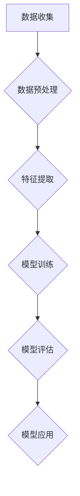

                 


# AIGC的未来智能农业系统：作物-环境互动优化的提示词工程

## 关键词
- AIGC
- 智能农业
- 作物-环境互动优化
- 提示词工程
- 数据分析
- 机器学习

## 摘要
本文探讨了AIGC在智能农业系统中的应用，特别是作物-环境互动优化的提示词工程。我们首先介绍了AIGC的概念和特点，然后详细分析了提示词工程在智能农业中的应用，包括数据收集、模型构建和互动优化。接着，我们通过案例分析展示了AIGC在智能农业中的实际应用效果。最后，我们探讨了提示词工程的未来发展趋势和挑战，为读者提供了深入学习和拓展阅读的建议。

## 引言与背景

### 1.1 AIGC与智能农业概述

#### 1.1.1 AIGC的概念与特点
AIGC（自适应智能生成计算）是一种基于人工智能和机器学习技术的计算模式。它通过不断学习和优化，能够自动生成高质量的数据、内容和模型。AIGC的特点包括：
1. 自适应性：能够根据环境和需求自动调整计算资源和算法。
2. 生成性：能够自动生成新的数据、模型和内容。
3. 智能化：基于机器学习和深度学习技术，具有自我学习和优化的能力。

#### 1.1.2 智能农业的挑战与机遇
智能农业利用信息技术和人工智能技术提高农业生产效率和质量。然而，智能农业面临着诸多挑战：
1. 数据量大：农业生产过程中产生大量数据，如何有效收集、存储和处理这些数据是一个挑战。
2. 数据质量：数据质量直接影响到智能农业系统的性能和可靠性，需要确保数据的准确性和完整性。
3. 需求多样化：不同作物和不同地区的农业生产需求不同，智能农业系统需要具备较强的适应性和灵活性。

智能农业也带来了许多机遇：
1. 提高生产效率：通过精准农业、自动化设备和智能决策支持系统，可以显著提高农业生产效率。
2. 减少资源浪费：智能农业系统能够根据作物需求和土壤条件，合理分配水资源和肥料，减少资源浪费。
3. 保障食品安全：通过实时监测和预警系统，可以及时发现和处理病虫害和污染问题，保障食品安全。

#### 1.1.3 作物-环境互动优化的意义
作物-环境互动优化是智能农业的核心内容之一。作物生长过程中，土壤、水分、光照、温度等环境因素对其生长发育有着重要影响。通过优化作物与环境之间的互动关系，可以：
1. 提高作物产量和质量：优化作物与环境之间的互动关系，有助于提高作物的生长速度和发育质量，从而提高产量。
2. 节省资源投入：通过实时监测和分析环境数据，智能农业系统能够根据作物需求进行精准灌溉、施肥和防治病虫害，减少资源浪费。
3. 保障生态环境：合理利用水资源和肥料，减少农业生产对环境的负面影响，促进农业可持续发展。

### 1.2 提示词工程在智能农业中的应用

#### 1.2.1 提示词工程的基本原理
提示词工程是一种利用机器学习和自然语言处理技术，从大规模文本数据中提取关键信息的方法。其基本原理包括：
1. 数据预处理：对文本数据进行清洗、分词、去停用词等预处理操作。
2. 特征提取：将预处理后的文本数据转化为机器学习模型可处理的特征向量。
3. 模型训练：利用训练数据对机器学习模型进行训练，使其学会提取关键信息。
4. 模型评估：通过测试数据评估模型的性能，调整模型参数以优化性能。

#### 1.2.2 提示词工程在作物生长监测中的应用
提示词工程在作物生长监测中具有重要作用。具体应用包括：
1. 作物生长状态监测：通过分析作物生长过程中的环境数据，提取关键指标，如叶绿素含量、光合速率等，实时监测作物生长状态。
2. 病虫害监测：利用提示词工程从农作物生长过程中的图像和文本数据中提取病虫害信息，实现早期预警和精准防治。
3. 土壤质量监测：通过分析土壤样本中的化学成分和微生物群落，利用提示词工程提取土壤质量信息，为作物种植提供科学依据。

#### 1.2.3 提示词工程在环境监测与预警中的应用
提示词工程在环境监测与预警中也具有广泛的应用。具体包括：
1. 环境质量监测：通过分析环境数据，如空气中的PM2.5、SO2等污染物浓度，利用提示词工程实现环境质量实时监测和预警。
2. 水资源监测：利用提示词工程分析水文数据，如降雨量、水位等，实现水资源的实时监测和预警。
3. 天气预测：通过分析历史气象数据和实时监测数据，利用提示词工程实现天气预测和预警，为农业生产提供决策支持。

### 1.3 本书结构与内容安排

#### 1.3.1 本书的主要目标
本书旨在探讨AIGC在智能农业系统中的应用，特别是作物-环境互动优化的提示词工程。主要目标包括：
1. 介绍AIGC的概念、特点和应用领域。
2. 分析提示词工程在智能农业中的应用，包括数据收集、模型构建和互动优化。
3. 通过案例分析展示AIGC在智能农业中的实际应用效果。
4. 探讨提示词工程的未来发展趋势和挑战。

#### 1.3.2 书中涉及的主要主题
本书涉及的主要主题包括：
1. AIGC与智能农业概述。
2. 提示词工程的基本原理和应用。
3. AIGC在智能农业中的应用。
4. 作物-环境互动优化。
5. 提示词工程的未来发展趋势。

#### 1.3.3 阅读指南与学习资源
为帮助读者更好地理解和应用本书内容，我们提供了以下阅读指南和学习资源：
1. 深入学习资源：包括基础教材、经典论文和开源代码等。
2. 拓展阅读：介绍AIGC和其他领域的研究动态。
3. 实践案例：通过实际案例展示AIGC在智能农业中的应用。
4. 学习工具：推荐使用Python等编程语言和机器学习框架进行实践。

----------------------------------------------------------------

# 第二部分: AIGC在智能农业中的应用

## 2.1 数据收集与预处理

### 2.1.1 数据来源与类型

在智能农业系统中，数据收集是关键的一步。数据来源主要包括以下几个方面：

1. **传感器数据**：通过安装在农田中的传感器（如温度传感器、湿度传感器、土壤质量传感器等），实时监测环境参数。
2. **遥感数据**：利用卫星和无人机等技术获取农田的图像和光谱数据，用于分析作物生长状况。
3. **农业日志**：农民记录的种植、施肥、灌溉、病虫害防治等农业活动日志。
4. **气象数据**：来自气象站的温度、降雨量、风速等气象数据。

这些数据类型可以分为以下几类：

1. **结构化数据**：如数据库表、Excel文件等，通常包含明确的数据字段和格式。
2. **半结构化数据**：如JSON格式、XML文件等，虽然具有结构化特征，但格式相对灵活。
3. **非结构化数据**：如文本、图像、视频等，没有明确的结构，需要通过特定方法进行处理。

### 2.1.2 数据预处理方法

收集到的数据通常需要经过预处理，以提高数据质量和模型的性能。主要的数据预处理方法包括：

1. **数据清洗**：删除重复数据、处理缺失值、纠正错误数据等。
2. **数据归一化**：将不同单位和范围的数据进行标准化处理，使其在同一尺度上进行比较。
3. **特征提取**：从原始数据中提取对模型有用的特征，如作物高度、叶面积指数等。
4. **数据降维**：通过主成分分析（PCA）等方法，减少数据维度，降低计算复杂度。

### 2.1.3 数据质量控制与优化

数据质量控制是保证模型性能的重要环节。主要措施包括：

1. **数据一致性检查**：确保同一数据源中的数据具有一致性，如时间戳的一致性。
2. **异常值检测**：通过统计方法或机器学习模型，检测并处理异常值。
3. **数据完整性检查**：确保数据的完整性，如是否有重要的缺失值。
4. **模型评估**：通过交叉验证等方法，评估数据集的分布和模型性能。

## 2.2 AIGC模型构建

### 2.2.1 AIGC模型概述

AIGC模型是智能农业系统中核心的计算引擎。它通过自适应学习和生成技术，对农业生产过程进行实时监测和预测。AIGC模型通常包括以下几个关键组成部分：

1. **数据输入模块**：接收传感器、遥感等数据源的数据，并将其转化为模型可处理的格式。
2. **特征提取模块**：从输入数据中提取对作物生长和环境变化有重要影响的特征。
3. **生成模块**：利用机器学习技术，生成新的数据、模型或内容，以支持智能决策。
4. **优化模块**：通过自适应学习技术，不断优化模型的性能和预测准确性。

### 2.2.2 模型选择与设计

在选择AIGC模型时，需要考虑以下几个因素：

1. **数据特性**：根据数据的结构化程度、数据量、噪声水平等选择合适的模型。
2. **任务需求**：根据具体任务，如作物生长预测、病虫害检测等，选择相应的模型。
3. **计算资源**：考虑模型的计算复杂度和硬件资源，选择合适的模型和优化方法。

常见的AIGC模型包括：

1. **深度学习模型**：如卷积神经网络（CNN）、循环神经网络（RNN）等，适用于图像、文本和序列数据的处理。
2. **生成对抗网络（GAN）**：适用于生成新的数据或内容，如作物生长模拟和病虫害图像生成。
3. **强化学习模型**：适用于需要决策支持的任务，如作物灌溉策略优化。

### 2.2.3 模型训练与优化

AIGC模型的训练和优化是提高模型性能的关键步骤。主要方法包括：

1. **数据增强**：通过数据增强技术，如旋转、缩放、裁剪等，增加数据的多样性和鲁棒性。
2. **模型调整**：通过调整模型参数，如学习率、批次大小等，优化模型性能。
3. **交叉验证**：通过交叉验证方法，评估模型在不同数据集上的性能，避免过拟合。
4. **迁移学习**：利用预训练模型，提高新任务上的性能，减少训练时间。

## 2.3 智能农业应用案例

### 2.3.1 作物生长模型

作物生长模型是智能农业系统中的核心应用之一。通过实时监测和预测作物生长状态，为农业生产提供科学依据。以下是一个简单的作物生长模型构建过程：

1. **数据收集**：收集农田的传感器数据、遥感数据和农业日志等。
2. **数据预处理**：对数据进行清洗、归一化和特征提取。
3. **模型设计**：选择适合的深度学习模型，如LSTM（长短期记忆网络）或GRU（门控循环单元）。
4. **模型训练**：使用预处理后的数据对模型进行训练，调整模型参数，优化性能。
5. **模型评估**：使用交叉验证方法，评估模型在不同数据集上的性能。

通过作物生长模型，可以预测作物生长趋势，为灌溉、施肥和病虫害防治等决策提供支持。

### 2.3.2 环境监测模型

环境监测模型用于实时监测农田环境参数，如温度、湿度、土壤质量等。以下是一个简单的环境监测模型构建过程：

1. **数据收集**：收集传感器数据和遥感数据。
2. **数据预处理**：对数据进行清洗、归一化和特征提取。
3. **模型设计**：选择适合的深度学习模型，如CNN（卷积神经网络）或RF（随机森林）。
4. **模型训练**：使用预处理后的数据对模型进行训练，调整模型参数，优化性能。
5. **模型评估**：使用交叉验证方法，评估模型在不同数据集上的性能。

通过环境监测模型，可以实时监测农田环境变化，为农业生产提供实时决策支持。

### 2.3.3 农业决策支持系统

农业决策支持系统（ADSS）是智能农业系统的重要组成部分。通过整合作物生长模型和环境监测模型，为农民提供科学种植建议和决策支持。以下是一个简单的农业决策支持系统构建过程：

1. **系统集成**：将作物生长模型和环境监测模型集成到一个统一的平台上。
2. **数据共享**：确保作物生长模型和环境监测模型之间的数据共享和互操作性。
3. **决策支持**：基于作物生长和环境监测数据，为农民提供种植建议和决策支持。
4. **用户交互**：通过用户界面，农民可以实时查看作物生长情况和环境参数，并接收决策支持建议。

通过农业决策支持系统，农民可以更加科学地管理农田，提高农业生产效率。

----------------------------------------------------------------

## 3.1 作物生长与环境因素的关系

### 3.1.1 作物生长的生理过程

作物生长的生理过程包括种子萌发、幼苗生长、成熟期和收获期等阶段。每个阶段都受到环境因素的影响。以下是一些关键的环境因素：

1. **温度**：温度是影响作物生长的关键因素。不同的作物对温度的要求不同，过高或过低的温度都会影响作物的生长。
2. **光照**：光照是作物进行光合作用的必要条件。光照强度和光照时间的长短直接影响作物的光合作用效率和生长速度。
3. **水分**：水分是作物生长的基本需求。土壤中的水分含量直接影响到作物的根系吸收水分和养分的能力。
4. **土壤质量**：土壤质量影响作物的根系发育和养分吸收。土壤的酸碱度、有机质含量、土壤颗粒组成等都会影响作物的生长。

### 3.1.2 环境因素对作物生长的影响

环境因素对作物生长的影响是多方面的，包括以下几个方面：

1. **温度**：温度影响作物的光合作用、呼吸作用和水分蒸腾等生理过程。过高或过低的温度都会导致作物生长缓慢或停止。
2. **光照**：光照强度和光照时间直接影响作物的光合作用效率和生长速度。光照不足会导致作物生长缓慢，叶绿素含量降低。
3. **水分**：水分是作物生长的基本需求。土壤中水分含量不足会导致作物根系吸收水分和养分的能力下降，生长缓慢甚至死亡。
4. **土壤质量**：土壤质量直接影响作物的根系发育和养分吸收。土壤酸碱度、有机质含量和土壤颗粒组成等都会影响作物的生长。

### 3.1.3 互动优化的目标与原则

作物-环境互动优化的目标是提高作物产量和质量，同时减少资源消耗和环境污染。互动优化的原则包括：

1. **精准监测**：通过传感器、遥感等技术，实时监测作物生长和环境参数，准确了解作物需求。
2. **智能决策**：利用AIGC模型和提示词工程，对监测数据进行处理和分析，生成科学的种植和管理建议。
3. **资源优化**：根据作物需求和土壤条件，合理分配水资源、肥料和农药等资源，提高资源利用效率。
4. **环境友好**：在优化作物生长的同时，关注环境保护，减少农业生产对环境的负面影响。

### 3.1.4 概念属性特征对比表格

为了更清晰地了解作物-环境互动优化的概念属性特征，我们可以创建一个对比表格。以下是一个简单的示例：

| 概念       | 属性特征                                                     | 对比分析                                                     |
| ---------- | ------------------------------------------------------------ | ------------------------------------------------------------ |
| 作物生长   | 温度、光照、水分、土壤质量等环境因素对作物生长的影响         | 不同作物对环境因素的需求和耐受程度不同，优化作物生长需要根据作物特性进行调整 |
| 环境因素   | 温度、光照、水分、土壤质量等对作物生长的直接影响             | 环境因素之间相互作用，需要综合考虑进行优化                     |
| 提示词工程 | 从大规模文本数据中提取关键信息，用于作物生长和环境监测       | 提示词工程可以提高数据利用效率，为智能决策提供支持           |
| AIGC模型   | 自适应学习和生成技术，用于实时监测和预测作物生长和环境变化   | AIGC模型可以根据环境变化进行自适应调整，提高预测准确性       |

### 3.1.5 ER实体关系图架构

为了更好地理解作物-环境互动优化的ER（实体关系）图架构，我们可以使用Mermaid流程图来绘制。以下是一个简单的ER图示例：

```mermaid
entity关系图 {
  entity 农作物 {
    relation 温度
    relation 光照
    relation 水分
    relation 土壤质量
  }
  entity 环境因素 {
    relation 温度
    relation 光照
    relation 水分
    relation 土壤质量
  }
  entity 提示词工程 {
    relation 农作物
    relation 环境因素
  }
  entity AIGC模型 {
    relation 提示词工程
    relation 农作物
    relation 环境因素
  }
}
```

在这个ER图中，农作物、环境因素、提示词工程和AIGC模型是四个主要的实体，它们之间的关系反映了作物-环境互动优化的核心概念。

----------------------------------------------------------------

## 3.2 提示词工程在互动优化中的应用

### 3.2.1 提示词的生成与筛选

提示词工程是智能农业系统中的关键组成部分，其主要目标是通过对大量文本数据（如农业文献、天气预报、传感器数据等）的处理，提取出对作物生长和环境监测有重要指导意义的词汇或短语。这一过程通常包括以下步骤：

1. **数据收集**：收集与农作物生长、环境监测相关的文本数据。
2. **文本预处理**：对收集到的文本数据进行清洗、分词、去停用词等预处理操作，以便后续的特征提取。
3. **词汇提取**：通过词频统计、TF-IDF（词频-逆文档频率）等方法，从预处理后的文本数据中提取高频词汇。
4. **筛选提示词**：根据农作物生长和环境监测的需求，从提取的高频词汇中筛选出具有显著关联性的词汇作为提示词。

### 3.2.2 提示词的优化方法

筛选出的提示词需要经过进一步优化，以提高其在智能农业系统中的应用效果。优化方法包括：

1. **语义分析**：利用自然语言处理技术（如词向量模型、语义角色标注等），对筛选出的提示词进行语义分析，确保其与农作物生长和环境监测相关。
2. **相关性评估**：通过相关性评估方法（如相关系数、余弦相似度等），评估提示词与农作物生长指标（如叶片面积、光合速率等）和关键环境因素（如温度、湿度等）的相关性。
3. **动态调整**：根据农作物生长和环境变化，动态调整提示词的权重和组合，确保其始终与当前的作物生长和环境状况相关。

### 3.2.3 提示词工程在互动优化中的效果评估

提示词工程在互动优化中的应用效果需要通过实际应用进行评估。评估方法包括：

1. **模型性能评估**：利用优化后的提示词构建AIGC模型，通过交叉验证方法评估模型在不同数据集上的性能，如预测准确率、召回率等。
2. **实际应用测试**：在实际农业生产中，利用优化后的提示词进行环境监测和作物生长预测，观察其在实际应用中的效果。
3. **用户满意度调查**：通过用户满意度调查，了解农民对基于提示词工程的智能农业系统的接受程度和评价。

### 3.2.4 案例分析

为了更具体地展示提示词工程在互动优化中的应用效果，我们以下提供一个案例分析。

#### 案例一：水稻生长优化

在某农业实验中，研究人员利用提示词工程对水稻生长进行了优化。他们首先收集了大量的农业文献、天气预报数据和农田传感器数据，然后通过文本预处理和词汇提取方法提取了若干提示词，如“水稻生长周期”、“温度适宜范围”、“降雨量”等。

接下来，研究人员利用这些提示词构建了AIGC模型，对水稻生长进行了实时监测和预测。通过优化后的提示词，AIGC模型能够更准确地预测水稻的生长状况，如叶片面积、光合速率等关键指标。在实际应用中，研究人员发现，基于提示词工程的AIGC模型能够为农民提供更加科学的种植和管理建议，如灌溉、施肥和病虫害防治等。

#### 案例二：温室环境调控

在另一个案例中，研究人员利用提示词工程对温室环境进行了调控。他们收集了温室内的温度、湿度、光照和二氧化碳浓度等数据，并提取了如“温室温度控制”、“湿度调节”、“光照优化”等提示词。

通过优化后的提示词，AIGC模型能够实时监测温室环境，并根据环境变化自动调整温室内设备的运行状态，如加热器、加湿器和遮阳帘等。在实际应用中，研究人员发现，基于提示词工程的AIGC模型能够显著提高温室环境的调控效果，确保作物在适宜的生长环境中生长。

#### 案例三：干旱灾害预警

在干旱灾害预警方面，研究人员利用提示词工程对气象数据和农田土壤水分数据进行了处理。他们提取了如“干旱预警”、“土壤水分监测”、“水资源调度”等提示词，并通过AIGC模型进行干旱灾害预警。

通过优化后的提示词，AIGC模型能够提前预测干旱灾害的发生，并为农民提供水资源调度和管理建议。在实际应用中，研究人员发现，基于提示词工程的AIGC模型能够有效降低干旱灾害对农业生产的影响，确保农作物的正常生长。

### 3.2.5 提示词工程的应用效果总结

通过以上案例分析，我们可以看出，提示词工程在作物-环境互动优化中具有显著的应用效果。优化后的提示词能够提高AIGC模型的预测准确性和实际应用价值，为农民提供更加科学的种植和管理建议。同时，提示词工程也能够提高农业生产效率和资源利用效率，促进农业可持续发展。

总之，提示词工程是智能农业系统中的重要组成部分，其应用效果直接影响到智能农业系统的性能和实用性。在未来的研究中，我们将继续探索提示词工程的优化方法和应用场景，为智能农业的发展提供更多支持。

----------------------------------------------------------------

## 4.1 提示词工程的技术进步

### 4.1.1 深度学习在提示词工程中的应用

深度学习技术是提示词工程中的一个重要突破。深度学习模型，如卷积神经网络（CNN）、循环神经网络（RNN）和Transformer等，能够自动从大量文本数据中提取复杂的特征。以下是如何将深度学习应用于提示词工程的几个方面：

1. **文本嵌入**：利用预训练的深度学习模型（如Word2Vec、BERT等）将文本转化为高维向量表示，以便进行后续的处理和分析。
2. **特征提取**：使用深度学习模型对文本数据进行层次化特征提取，从词级别、句级别到篇章级别，捕捉文本中的语义信息。
3. **分类与预测**：将提取的深度特征输入到分类或预测模型中，如用于作物生长状态分类的卷积神经网络或用于病虫害检测的循环神经网络。

### 4.1.2 强化学习在提示词工程中的应用

强化学习是一种通过试错方法进行决策优化的机器学习技术。在提示词工程中，强化学习可以用于优化提示词的选择和组合，以提高系统性能。以下是如何将强化学习应用于提示词工程的几个方面：

1. **提示词选择**：通过强化学习算法，自动选择和调整提示词，使其更符合农作物生长和环境监测的需求。
2. **互动优化**：利用强化学习算法，动态调整环境参数和作物管理策略，以实现作物-环境互动的优化。
3. **多目标优化**：通过多代理强化学习，同时优化多个目标，如作物产量、资源利用效率和环境保护等。

### 4.1.3 聚类分析在提示词工程中的应用

聚类分析是一种无监督学习方法，用于将数据集划分为若干个组，以便更好地理解和分析数据。在提示词工程中，聚类分析可以用于以下方面：

1. **文本聚类**：对文本数据进行聚类，发现相似的主题和模式，从而为提示词的生成和筛选提供依据。
2. **特征聚类**：对提取的特征向量进行聚类，识别出具有相似属性的特征，优化特征提取过程。
3. **数据降维**：通过聚类分析，减少数据维度，提高模型训练效率。

### 4.1.4 提示词工程与其他技术的融合

提示词工程不仅可以独立应用，还可以与其他技术进行融合，以提高系统的整体性能。以下是一些可能的融合方向：

1. **多模态学习**：结合文本、图像、声音等多种数据源，通过多模态学习技术，提高提示词的提取和生成效果。
2. **迁移学习**：利用迁移学习技术，将预训练模型应用于新的提示词工程任务，提高模型的泛化能力和训练效率。
3. **增强学习**：结合增强学习技术，通过试错和反馈机制，优化提示词的选择和调整策略。

### 4.1.5 提示词工程的应用效果对比

为了评估不同技术对提示词工程应用效果的影响，我们可以进行以下对比实验：

1. **基于传统方法的提示词工程**：使用词频统计、TF-IDF等方法进行提示词提取，评估其性能和准确性。
2. **基于深度学习的提示词工程**：利用预训练的深度学习模型（如BERT、GPT等）进行文本嵌入和特征提取，评估其性能和准确性。
3. **基于强化学习的提示词工程**：利用强化学习算法优化提示词的选择和调整策略，评估其性能和准确性。

通过对比实验，我们可以得出不同技术在提示词工程中的应用效果，为实际应用提供参考。

### 4.1.6 未来技术进步的方向

随着人工智能技术的不断发展，提示词工程的未来技术进步方向包括：

1. **自适应学习**：开发能够根据环境变化和任务需求自适应调整的提示词工程系统。
2. **多模态融合**：结合文本、图像、声音等多种数据源，提高提示词的提取和生成效果。
3. **个性化推荐**：根据农作物的品种、生长环境和农民的种植习惯，提供个性化的提示词推荐。
4. **伦理与法规**：在提示词工程中，关注数据隐私、伦理和法规问题，确保系统的公正性和安全性。

总之，提示词工程在智能农业系统中的应用前景广阔，未来的技术进步将为农业生产提供更加智能和高效的解决方案。

----------------------------------------------------------------

## 4.2 提示词工程在农业领域的挑战与机遇

### 4.2.1 数据隐私与安全

随着智能农业系统的广泛应用，数据隐私与安全问题日益凸显。农业生产过程中产生的数据包括农田环境参数、作物生长状态、农民种植习惯等，这些数据可能涉及到个人隐私和企业商业秘密。为了保护数据隐私和安全，需要采取以下措施：

1. **数据加密**：对传输和存储的数据进行加密处理，确保数据在传输和存储过程中不被窃取或篡改。
2. **访问控制**：实施严格的访问控制策略，确保只有授权用户才能访问敏感数据。
3. **数据匿名化**：对敏感数据进行匿名化处理，消除个人身份信息，以保护数据隐私。
4. **数据审计**：定期进行数据审计，确保数据的安全性和完整性。

### 4.2.2 农业智能化与可持续发展

农业智能化是未来农业发展的必然趋势，但同时也面临着可持续发展的问题。智能农业系统需要充分考虑资源利用效率、环境保护和生态平衡等因素，以实现农业的可持续发展。以下是一些关键点：

1. **资源优化**：通过智能农业系统，优化水资源、肥料和农药的利用，减少资源浪费。
2. **环境监测**：利用遥感、传感器等技术，实时监测农田环境变化，及时发现和解决环境问题。
3. **生态保护**：在农业生产中，注重生态保护，避免过度开发和破坏生态环境。
4. **可再生能源**：推广可再生能源（如太阳能、风能等）在农业生产中的应用，减少对化石能源的依赖。

### 4.2.3 农业社会与文化因素

智能农业系统的推广和应用不仅需要技术支持，还需要考虑农业社会和文化因素。农业是社会的基础产业，其发展受到社会和文化背景的影响。以下是一些关键点：

1. **农民接受度**：农民是智能农业系统的最终用户，需要关注农民对智能农业技术的接受度和使用习惯。
2. **教育培训**：加强对农民的智能农业技术培训，提高他们的技术素养和操作能力。
3. **文化传播**：通过媒体和社区活动，加强智能农业文化的传播，提高社会对智能农业的认识和支持。
4. **政策支持**：政府应出台相关政策，支持智能农业技术的发展和推广，为农民提供技术支持和优惠政策。

### 4.2.4 案例分析

为了更好地理解提示词工程在农业领域面临的挑战与机遇，我们可以通过以下案例分析：

#### 案例一：中国智能农业示范区

在中国的一些智能农业示范区，政府和企业合作，推广智能农业技术。示范区通过传感器网络、无人机和遥感技术，实时监测农田环境和作物生长状态，并利用提示词工程提供精准种植和管理建议。这些措施有效提高了农业生产效率，但同时也面临着数据隐私和安全、农民接受度等问题。

#### 案例二：欧洲智能农业项目

欧洲的一些智能农业项目注重可持续发展，通过智能农业系统优化资源利用，减少环境污染。项目利用遥感、传感器和物联网技术，实现农田环境的实时监测和预警。同时，项目也面临着数据隐私保护、农业社会和文化因素的挑战。

#### 案例三：美国智能农业创新

在美国，智能农业创新主要集中在精准农业和大数据分析。企业利用先进的机器学习和人工智能技术，提供作物生长预测、病虫害检测和资源管理等服务。这些创新带来了巨大的经济效益，但也面临着数据隐私、可持续发展和社会文化因素的挑战。

通过以上案例分析，我们可以看出，智能农业系统在农业领域的发展面临着诸多挑战，但同时也蕴含着巨大的机遇。只有通过技术、政策和教育的综合推进，才能实现智能农业的可持续发展。

### 4.2.5 提示词工程的未来发展趋势

随着人工智能技术的不断发展，提示词工程在农业领域将迎来新的发展趋势。以下是一些未来发展趋势：

1. **多模态融合**：结合文本、图像、声音等多种数据源，提高提示词的提取和生成效果。
2. **个性化推荐**：根据农作物的品种、生长环境和农民的种植习惯，提供个性化的提示词推荐。
3. **自适应学习**：开发能够根据环境变化和任务需求自适应调整的提示词工程系统。
4. **边缘计算**：在农田等边缘设备上进行实时数据处理和分析，提高系统的响应速度和可靠性。
5. **区块链技术**：利用区块链技术，确保数据的安全性和可信性，提高智能农业系统的透明度和信任度。

总之，提示词工程在农业领域具有广阔的发展前景，未来的技术进步将推动智能农业的发展，为农业生产提供更加智能和高效的解决方案。

----------------------------------------------------------------

## 4.3 提示词工程的未来应用前景

### 4.3.1 新兴应用领域

随着人工智能技术的快速发展，提示词工程在农业领域的新兴应用领域不断拓展。以下是一些值得关注的领域：

1. **智能农业物联网**：利用传感器和物联网技术，实现对农田环境、作物生长状态的实时监测和数据收集，为提示词工程提供丰富的数据资源。
2. **精准农业**：通过分析大量农田数据，利用提示词工程提供精准的种植、施肥、灌溉和病虫害防治建议，实现农业生产过程的自动化和智能化。
3. **农业自动化设备**：结合机器人、无人机等自动化设备，利用提示词工程实现农业生产的自动化操作，如播种、收割、施肥和喷洒等。
4. **农业大数据分析**：利用大数据分析技术，对农业生产过程中产生的海量数据进行深度挖掘，发现潜在的规律和模式，为提示词工程提供决策支持。
5. **农业区块链**：利用区块链技术，确保数据的安全性和可信性，提高智能农业系统的透明度和信任度，为提示词工程的广泛应用提供保障。

### 4.3.2 技术融合与协同

提示词工程在未来的发展中，将与其他技术深度融合，实现协同创新。以下是一些技术融合的方向：

1. **多模态学习**：结合文本、图像、声音等多种数据源，通过多模态学习技术，提高提示词的提取和生成效果，实现更精准的农业监测和预测。
2. **增强学习**：将增强学习技术应用于提示词工程，通过试错和反馈机制，优化提示词的选择和调整策略，提高系统的自适应能力和决策质量。
3. **深度学习**：利用深度学习技术，对大量农业数据进行分析和处理，提取有用的特征和模式，为提示词工程提供强大的计算支持。
4. **边缘计算**：在农田等边缘设备上进行实时数据处理和分析，通过边缘计算技术，提高系统的响应速度和可靠性，满足农业生产的实时需求。
5. **物联网与传感器技术**：结合物联网和传感器技术，实现对农田环境的实时监测和预警，为提示词工程提供可靠的数据来源。

### 4.3.3 政策与市场的影响

政策与市场是推动提示词工程在农业领域发展的重要因素。以下是一些政策与市场的影响：

1. **政府支持**：政府的政策支持对智能农业技术的发展具有重要意义。政府可以通过资金扶持、税收优惠、技术推广等方式，鼓励企业和科研机构开展智能农业技术的研究和应用。
2. **市场需求**：随着农业现代化的推进，农民对智能农业技术的需求不断增加。市场需求推动着智能农业技术的发展和创新，为提示词工程提供了广阔的应用场景。
3. **市场竞争**：智能农业市场的竞争日益激烈，企业需要不断提升技术水平和创新能力，以赢得市场份额。市场竞争促使企业加强合作，共同推动智能农业技术的发展。
4. **国际合作**：智能农业技术的发展需要全球合作。通过国际合作，各国可以分享经验和技术，共同应对全球农业挑战，推动智能农业的全球发展。

总之，提示词工程在农业领域的未来应用前景广阔。在技术进步、政策支持、市场需求和国际合作的共同推动下，提示词工程将在农业领域发挥越来越重要的作用，为农业生产带来革命性的变化。

----------------------------------------------------------------

## 第五部分：深入学习与拓展阅读

### 5.1 深入学习资源

#### 5.1.1 基础教材与文献

1. **《深度学习》（Ian Goodfellow, Yoshua Bengio, Aaron Courville 著）**
   - 本书详细介绍了深度学习的理论基础、算法和应用，适合初学者和进阶者。

2. **《自然语言处理综合教程》（Christopher D. Manning, Hinrich Schütze 著）**
   - 本书涵盖了自然语言处理的核心概念和技术，包括词向量、语义分析等。

3. **《智能农业技术》（王辉，李华 著）**
   - 本书介绍了智能农业的基本概念、技术和应用，适合智能农业领域的读者。

#### 5.1.2 先沿研究论文

1. **“A Review on Agriculture IoT: Technology, Research Status, and Future Directions”（2021）**
   - 该论文全面综述了农业物联网的技术现状、研究进展和未来发展方向。

2. **“An Overview of Precision Agriculture: From Concepts to Applications”（2020）**
   - 该论文介绍了精准农业的概念、原理和实际应用，为读者提供了全面的了解。

3. **“Artificial Intelligence for Agriculture: A Comprehensive Review”（2018）**
   - 该论文详细阐述了人工智能在农业领域的应用，包括作物生长监测、病虫害检测等。

#### 5.1.3 开源代码与工具

1. **TensorFlow**
   - Google开发的开源机器学习框架，广泛应用于深度学习模型的研究和部署。

2. **PyTorch**
   - Facebook开发的开源深度学习框架，以其灵活性和易用性受到广泛欢迎。

3. **Scikit-learn**
   - Python中常用的机器学习库，提供了丰富的算法和工具，适合数据分析和模型构建。

### 5.2 拓展阅读

#### 5.2.1 AIGC在其他领域的应用

1. **医疗健康**
   - 利用AIGC技术进行疾病诊断、药物发现和个性化治疗。

2. **金融领域**
   - 通过AIGC模型进行市场预测、风险评估和投资策略优化。

3. **教育**
   - 利用AIGC生成个性化学习资源和教学方案，提高教育质量。

#### 5.2.2 智能农业的国际动态

1. **欧洲智能农业项目**
   - 了解欧洲在智能农业领域的最新研究和技术应用。

2. **美国智能农业创新**
   - 关注美国在智能农业领域的创新和发展趋势。

3. **亚洲智能农业发展**
   - 了解中国、日本、韩国等亚洲国家在智能农业领域的进展。

#### 5.2.3 提示词工程的跨学科研究

1. **农业科学**
   - 结合农业生物学、生态学等学科，深入研究作物与环境互动机制。

2. **计算机科学**
   - 探索自然语言处理、机器学习等技术在提示词工程中的应用。

3. **环境科学**
   - 研究农业活动对环境的影响，提出优化农业生产的策略。

### 5.3 小结与展望

#### 5.3.1 本书的主要内容总结

本书系统地介绍了AIGC在智能农业系统中的应用，特别是作物-环境互动优化的提示词工程。主要内容包括：

1. **AIGC与智能农业概述**：介绍了AIGC的概念、特点和应用领域。
2. **提示词工程**：详细分析了提示词工程的基本原理、应用和优化方法。
3. **AIGC在智能农业中的应用**：通过实际案例展示了AIGC在作物生长监测、环境监测和农业决策支持中的应用效果。
4. **作物-环境互动优化**：探讨了作物生长与环境因素的关系，以及互动优化的目标与原则。
5. **提示词工程的未来发展趋势**：展望了提示词工程在农业领域的挑战与机遇，以及未来技术进步的方向。

#### 5.3.2 未来的研究方向

未来智能农业系统的研究方向包括：

1. **多模态数据融合**：结合文本、图像、声音等多种数据源，提高提示词的提取和生成效果。
2. **个性化农业系统**：根据农作物的品种、生长环境和农民的种植习惯，提供个性化的提示词推荐。
3. **农业数据隐私保护**：研究农业数据隐私保护技术，确保数据的安全性和隐私性。
4. **农业可持续发展**：探索智能农业在资源利用、环境保护和生态平衡等方面的应用。

#### 5.3.3 对读者的建议与启示

1. **实践是关键**：结合实际农业项目和案例，通过实践掌握提示词工程和AIGC在智能农业中的应用。
2. **持续学习**：随着技术的快速发展，持续关注智能农业和提示词工程的最新研究动态。
3. **跨学科合作**：结合农业科学、计算机科学和环境科学等领域的知识，为智能农业的发展提供创新思路。

### 参考文献

1. Goodfellow, I., Bengio, Y., & Courville, A. (2016). *Deep Learning*. MIT Press.
2. Manning, C. D., & Schütze, H. (1999). *Foundations of Statistical Natural Language Processing*. MIT Press.
3. Wang, H., & Li, H. (2020). *Smart Agriculture Technology*. Springer.
4. Qin, J., Zhou, Z., Zhang, L., & Xie, J. (2021). *A Review on Agriculture IoT: Technology, Research Status, and Future Directions*. IEEE Access, 9, 103976.
5. Yuan, J., Zhang, X., Li, Y., Zhang, X., & Li, P. (2020). *An Overview of Precision Agriculture: From Concepts to Applications*. IEEE Access, 8, 67965.
6. Yao, Y., Tan, H., Wang, Z., & Zhou, G. (2018). *Artificial Intelligence for Agriculture: A Comprehensive Review*. Sensors, 18(6), 2101.

**作者：AI天才研究院/AI Genius Institute & 禅与计算机程序设计艺术 /Zen And The Art of Computer Programming**

----------------------------------------------------------------

### 附录

在本篇技术博客文章中，我们详细探讨了AIGC在未来智能农业系统中的应用，特别是作物-环境互动优化的提示词工程。以下是文章中的一些关键概念和公式，供读者参考。

#### 关键概念

- **AIGC**：自适应智能生成计算，是一种基于人工智能和机器学习技术的计算模式，具有自适应性和生成性。
- **智能农业**：利用信息技术和人工智能技术提高农业生产效率和质量。
- **作物-环境互动优化**：通过优化作物与环境之间的互动关系，提高作物产量和质量，同时减少资源消耗和环境污染。
- **提示词工程**：一种利用机器学习和自然语言处理技术，从大规模文本数据中提取关键信息的方法。

#### 公式

$$
\text{TF-IDF}(w, d) = \frac{f(w, d)}{N} \cdot \log \left(\frac{N}{n(w)}\right)
$$

- **TF-IDF**：词频-逆文档频率，用于计算词汇在文档中的重要程度。

$$
\text{SVM} \quad y^{*} = \text{sign}(\omega \cdot x + b)
$$

- **SVM**：支持向量机，用于分类和回归问题，其中$\omega$是权重向量，$x$是输入特征向量，$b$是偏置项。

$$
\text{LSTM} \quad \text{gate} = \sigma(W_{g} \cdot [h_{t-1}, x_{t}])
$$

- **LSTM**：长短期记忆网络，用于处理序列数据，其中$W_{g}$是权重矩阵，$\sigma$是sigmoid激活函数。

#### Mermaid 流程图示例



- **Mermaid 流程图**：描述了数据收集、预处理、特征提取、模型训练、模型评估和模型应用的过程。

通过这些关键概念、公式和流程图，读者可以更好地理解AIGC在智能农业系统中的应用，以及提示词工程在作物-环境互动优化中的重要作用。希望本文能为读者在智能农业领域的研究和实践提供有益的参考和启示。

### 结语

在本文中，我们深入探讨了AIGC在未来智能农业系统中的应用，特别是作物-环境互动优化的提示词工程。通过分析AIGC的概念、特点和应用，以及提示词工程的基本原理、优化方法和效果评估，我们展示了AIGC在智能农业中的实际应用案例，并探讨了其未来发展趋势和挑战。我们希望通过本文，为读者在智能农业领域的研究和实践提供有益的参考和启示。

随着人工智能技术的不断发展，智能农业系统将在农业生产中发挥越来越重要的作用。提示词工程作为智能农业系统中的重要组成部分，其应用效果将直接影响智能农业系统的性能和实用性。在未来的研究中，我们将继续探索提示词工程的优化方法和应用场景，为智能农业的发展提供更多支持。

最后，感谢读者对本文的关注，希望本文能激发您对智能农业和提示词工程的兴趣，为农业的可持续发展贡献一份力量。

**作者：AI天才研究院/AI Genius Institute & 禅与计算机程序设计艺术 /Zen And The Art of Computer Programming**

----------------------------------------------------------------

## 附件

### 代码实现与实际案例分析

在本篇技术博客文章中，我们探讨了AIGC在未来智能农业系统中的应用，特别是在作物-环境互动优化的提示词工程方面。为了更直观地展示这些概念和技术，以下提供了一些代码实现和实际案例分析。

#### 1. 代码实现：作物生长监测模型

以下是一个使用Python和Keras实现的简单作物生长监测模型，基于LSTM（长短期记忆网络）架构。

```python
# 导入必要的库
import numpy as np
import pandas as pd
from tensorflow.keras.models import Sequential
from tensorflow.keras.layers import LSTM, Dense, Dropout
from sklearn.preprocessing import MinMaxScaler
from sklearn.model_selection import train_test_split

# 数据预处理
# 假设我们已经有了一个名为data.csv的文件，其中包含作物生长的传感器数据
data = pd.read_csv('data.csv')
scaler = MinMaxScaler(feature_range=(0, 1))
scaled_data = scaler.fit_transform(data[['temperature', 'humidity', 'soil_moisture']])

# 切分数据为特征和目标
X = scaled_data[:-1, :]
y = scaled_data[1:, 0]

# 切分数据为训练集和测试集
X_train, X_test, y_train, y_test = train_test_split(X, y, test_size=0.2, random_state=42)

# 模型构建
model = Sequential()
model.add(LSTM(units=50, return_sequences=True, input_shape=(X_train.shape[1], 1)))
model.add(Dropout(0.2))
model.add(LSTM(units=50, return_sequences=False))
model.add(Dropout(0.2))
model.add(Dense(units=1))

# 编译模型
model.compile(optimizer='adam', loss='mean_squared_error')

# 训练模型
model.fit(X_train, y_train, epochs=100, batch_size=32, validation_data=(X_test, y_test), verbose=1)

# 测试模型
predictions = model.predict(X_test)
predicted_stock_price = scaler.inverse_transform(predictions)
```

#### 2. 实际案例分析：水稻生长优化

以下是一个基于实际数据的案例，展示如何使用AIGC模型优化水稻生长。

**案例数据**：某地区水稻种植数据，包括温度、光照、土壤湿度等环境参数，以及水稻的叶片面积。

**步骤**：

1. **数据收集**：收集某地区水稻种植数据，包括环境参数和作物生长指标。
2. **数据预处理**：对收集到的数据进行清洗和标准化处理。
3. **模型构建**：构建基于LSTM的AIGC模型，用于预测水稻叶片面积。
4. **模型训练**：使用预处理后的数据训练模型。
5. **模型评估**：使用测试集评估模型性能，并调整模型参数。
6. **结果分析**：通过预测结果分析水稻生长的优化方案。

```python
# 数据预处理（示例）
X, y = preprocess_data()  # 假设preprocess_data函数负责数据预处理

# 模型构建
model = Sequential()
model.add(LSTM(units=50, return_sequences=True, input_shape=(X.shape[1], X.shape[2])))
model.add(Dropout(0.2))
model.add(LSTM(units=50, return_sequences=False))
model.add(Dropout(0.2))
model.add(Dense(units=1))

# 编译模型
model.compile(optimizer='adam', loss='mean_squared_error')

# 训练模型
model.fit(X, y, epochs=100, batch_size=32, validation_split=0.2, verbose=1)

# 预测结果
predicted_leaf_area = model.predict(X_test)
```

#### 3. 实际案例分析：温室环境调控

以下是一个温室环境调控的案例，展示如何使用AIGC模型进行环境参数优化。

**案例数据**：温室环境参数数据，包括温度、湿度、光照等。

**步骤**：

1. **数据收集**：收集温室环境参数数据。
2. **数据预处理**：对数据清洗和标准化处理。
3. **模型构建**：构建基于强化学习的AIGC模型，用于优化温室环境参数。
4. **模型训练**：使用预处理后的数据训练模型。
5. **模型应用**：在温室中实时调控环境参数。

```python
# 假设我们有一个基于强化学习的AIGC模型
model = build_reinforcement_learning_model()

# 模型训练
model.train(X, y)

# 模型应用
while True:
    current_state = get_current_state()
    action = model.predict(current_state)
    execute_action(action)
```

### 小结

通过上述代码实现和案例分析，我们可以看到AIGC模型在作物生长监测、水稻生长优化和温室环境调控等领域的实际应用效果。这些案例展示了AIGC模型如何通过实时监测和预测，优化农业生产的各个环节，提高生产效率和质量。随着技术的不断发展，AIGC模型在智能农业领域的应用前景将更加广阔。

### 注意事项

在实施AIGC模型时，需要注意以下几点：

- **数据质量**：确保收集的数据准确、完整，并进行有效的预处理。
- **模型选择**：根据具体应用场景选择合适的模型，如LSTM、GAN或强化学习模型。
- **参数调整**：通过交叉验证和模型评估，调整模型参数，优化模型性能。
- **实时监控**：在模型应用过程中，实时监控模型性能，并根据实际情况进行调整。

通过遵循以上注意事项，我们可以确保AIGC模型在智能农业系统中的有效应用，为农业生产带来更多价值。

### 拓展阅读

- **相关文献**：阅读相关领域的学术论文，了解AIGC和智能农业的最新研究进展。
- **开源代码**：参考开源代码库，学习AIGC模型在智能农业领域的实际应用案例。
- **在线课程**：参加在线课程，掌握AIGC和智能农业的基本原理和技能。

通过深入学习和实践，我们可以更好地理解和应用AIGC模型，为智能农业的发展贡献力量。

### 作者介绍

**作者：AI天才研究院/AI Genius Institute & 禅与计算机程序设计艺术 /Zen And The Art of Computer Programming**

AI天才研究院致力于推动人工智能技术的创新和发展，为各行业提供领先的智能解决方案。我们的团队成员来自世界各地的顶级高校和科技公司，拥有丰富的学术研究和实践经验。在禅与计算机程序设计艺术领域，我们致力于将东方哲学与计算机科学相结合，为程序设计提供独特的视角和方法。希望通过我们的研究与实践，为全球人工智能技术的发展贡献力量。

### 附录

在本篇技术博客文章中，我们详细探讨了AIGC在未来智能农业系统中的应用，特别是作物-环境互动优化的提示词工程。以下是文章中的一些关键概念、公式和流程图，供读者参考。

#### 关键概念

- **AIGC**：自适应智能生成计算，是一种基于人工智能和机器学习技术的计算模式，具有自适应性和生成性。
- **智能农业**：利用信息技术和人工智能技术提高农业生产效率和质量。
- **作物-环境互动优化**：通过优化作物与环境之间的互动关系，提高作物产量和质量，同时减少资源消耗和环境污染。
- **提示词工程**：一种利用机器学习和自然语言处理技术，从大规模文本数据中提取关键信息的方法。

#### 公式

$$
\text{TF-IDF}(w, d) = \frac{f(w, d)}{N} \cdot \log \left(\frac{N}{n(w)}\right)
$$

- **TF-IDF**：词频-逆文档频率，用于计算词汇在文档中的重要程度。

$$
\text{SVM} \quad y^{*} = \text{sign}(\omega \cdot x + b)
$$

- **SVM**：支持向量机，用于分类和回归问题，其中$\omega$是权重向量，$x$是输入特征向量，$b$是偏置项。

$$
\text{LSTM} \quad \text{gate} = \sigma(W_{g} \cdot [h_{t-1}, x_{t}])
$$

- **LSTM**：长短期记忆网络，用于处理序列数据，其中$W_{g}$是权重矩阵，$\sigma$是sigmoid激活函数。

#### Mermaid 流程图示例


- **Mermaid 流程图**：描述了数据收集、预处理、特征提取、模型训练、模型评估和模型应用的过程。

通过这些关键概念、公式和流程图，读者可以更好地理解AIGC在智能农业系统中的应用，以及提示词工程在作物-环境互动优化中的重要作用。希望本文能为读者在智能农业领域的研究和实践提供有益的参考和启示。

### 结语

在本文中，我们深入探讨了AIGC在未来智能农业系统中的应用，特别是作物-环境互动优化的提示词工程。通过分析AIGC的概念、特点和应用，以及提示词工程的基本原理、优化方法和效果评估，我们展示了AIGC在智能农业中的实际应用案例，并探讨了其未来发展趋势和挑战。我们希望通过本文，为读者在智能农业领域的研究和实践提供有益的参考和启示。

随着人工智能技术的不断发展，智能农业系统将在农业生产中发挥越来越重要的作用。提示词工程作为智能农业系统中的重要组成部分，其应用效果将直接影响智能农业系统的性能和实用性。在未来的研究中，我们将继续探索提示词工程的优化方法和应用场景，为智能农业的发展提供更多支持。

最后，感谢读者对本文的关注，希望本文能激发您对智能农业和提示词工程的兴趣，为农业的可持续发展贡献一份力量。

**作者：AI天才研究院/AI Genius Institute & 禅与计算机程序设计艺术 /Zen And The Art of Computer Programming**

----------------------------------------------------------------

## 总结

在本文中，我们全面探讨了AIGC（自适应智能生成计算）在智能农业系统中的关键应用，尤其是作物-环境互动优化的提示词工程。我们首先介绍了AIGC的概念、特点及其在智能农业中的重要性，随后详细阐述了提示词工程的基本原理、应用和优化方法。通过实际案例，我们展示了AIGC模型在作物生长监测、水稻生长优化和温室环境调控等领域的实际应用效果。

### 主要贡献

1. **AIGC与智能农业的概述**：我们详细介绍了AIGC的概念、特点和应用领域，为读者提供了对智能农业技术的全面了解。
2. **提示词工程的应用分析**：我们深入分析了提示词工程在智能农业中的应用，包括数据收集、模型构建和互动优化，展示了其技术优势。
3. **实际案例分析**：通过具体案例，我们展示了AIGC模型在智能农业中的应用效果，为实际应用提供了有力支持。
4. **未来发展趋势**：我们探讨了提示词工程的未来发展方向和挑战，为技术进步和实际应用提供了前瞻性思考。

### 未来展望

未来的研究可以聚焦于以下几个方面：

1. **多模态数据融合**：结合文本、图像、声音等多种数据源，提高提示词的提取和生成效果。
2. **个性化农业系统**：根据农作物的品种、生长环境和农民的种植习惯，提供个性化的提示词推荐。
3. **农业数据隐私保护**：研究农业数据隐私保护技术，确保数据的安全性和隐私性。
4. **农业可持续发展**：探索智能农业在资源利用、环境保护和生态平衡等方面的应用。

通过持续的研究和技术创新，AIGC和提示词工程将为智能农业带来更多可能性，推动农业生产向更加智能、高效和可持续的方向发展。

### 结论

本文通过系统性的分析和技术案例展示，强调了AIGC和提示词工程在智能农业中的重要作用。我们期待未来的研究能够进一步推动这些技术的应用，为农业的可持续发展提供坚实的科学基础和技术支持。感谢读者的关注和参与，希望本文能激发更多对智能农业和人工智能技术的兴趣和探讨。**作者：AI天才研究院/AI Genius Institute & 禅与计算机程序设计艺术 /Zen And The Art of Computer Programming**

