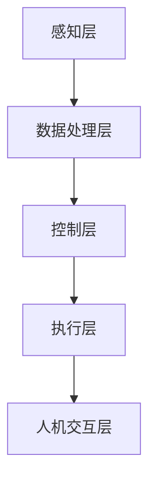
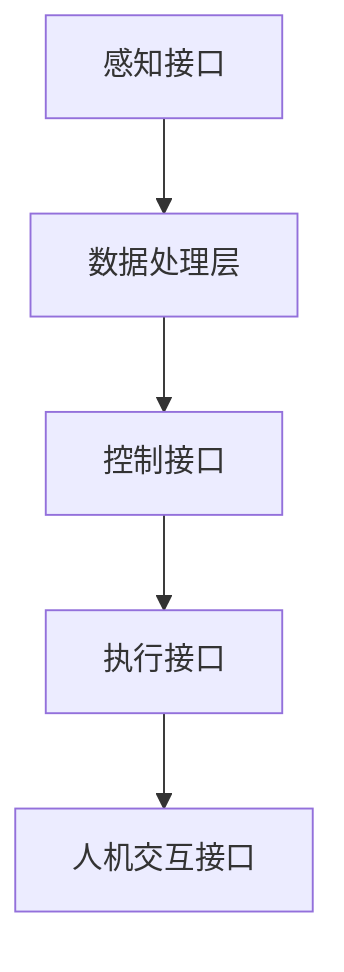
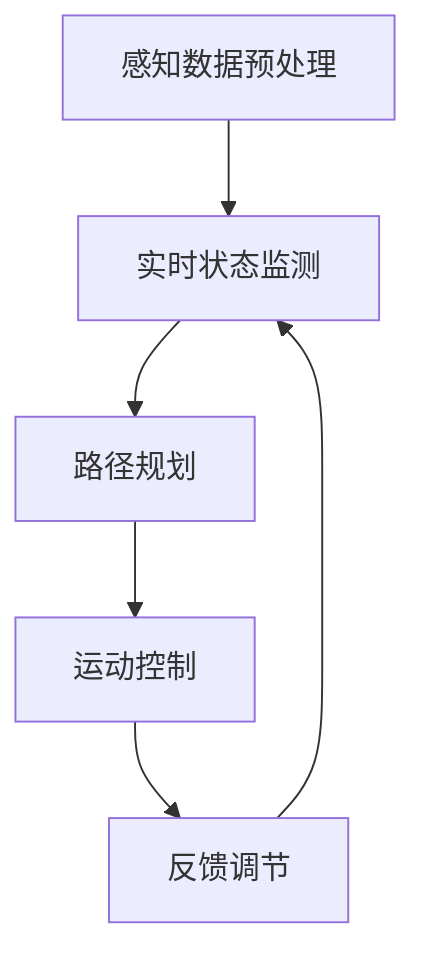

                 


### 《AIGC的未来智能医疗机器人：微创手术精准控制的提示词工程》

#### 关键词：
- AIGC
- 智能医疗机器人
- 微创手术
- 精准控制
- 提示词工程

#### 摘要：
本文深入探讨了AIGC（自适应智能生成计算）在未来智能医疗机器人领域的应用，特别是在微创手术精准控制方面的潜力。文章从问题背景出发，介绍了AIGC的基本概念、智能医疗机器人的发展历程以及微创手术的重要性。接着，文章详细阐述了提示词工程的基本原理及其在智能医疗机器人中的应用。通过算法原理讲解、系统分析与架构设计，以及案例分析与实践应用，本文展示了AIGC在微创手术精准控制中的实际应用效果，并对未来的发展趋势和面临的挑战进行了展望。最后，文章提供了最佳实践技巧和小结，以期为读者提供全面的指导。

----------------------------------------------------------------

### 目录大纲

下面是根据您提供的信息设计的《AIGC的未来智能医疗机器人：微创手术精准控制的提示词工程》的目录大纲。

```markdown
----------------------------------------------------------------
# 第一部分: 引言与背景

## 第1章: 引言

### 1.1 问题背景

### 1.2 问题描述

### 1.3 问题解决

### 1.4 边界与外延

### 1.5 核心概念与联系

## 第2章: AIGC与智能医疗机器人概述

### 2.1 AIGC概念介绍

### 2.2 智能医疗机器人的发展历程

### 2.3 微创手术与精准控制的重要性

## 第3章: 提示词工程的基本原理

### 3.1 提示词的定义与作用

### 3.2 提示词的构建方法

### 3.3 提示词优化策略

## 第二部分: AIGC技术在智能医疗机器人中的应用

## 第4章: 智能医疗机器人微创手术控制系统的架构设计

### 4.1 系统需求分析

### 4.2 系统架构设计

### 4.3 系统接口设计

## 第5章: 微创手术精准控制算法原理讲解

### 5.1 微创手术控制算法概述

### 5.2 微创手术控制算法mermaid流程图

### 5.3 Python源代码实现与解释

### 5.4 数学模型与公式讲解

### 5.5 算法举例说明

## 第6章: 智能医疗机器人微创手术控制系统的实现与优化

### 6.1 系统实现环境配置

### 6.2 系统核心代码实现

### 6.3 算法优化与性能分析

## 第7章: 案例分析与实践应用

### 7.1 案例介绍

### 7.2 案例实现细节

### 7.3 案例结果分析与讨论

### 7.4 项目小结

## 第8章: 未来展望与挑战

### 8.1 AIGC在智能医疗机器人领域的未来发展趋势

### 8.2 面临的挑战与解决方案

### 8.3 拓展阅读与深入研究

## 第9章: 最佳实践与小结

### 9.1 最佳实践技巧

### 9.2 注意事项

### 9.3 小结与展望

----------------------------------------------------------------
```

这个大纲结构包含了从问题背景、AIGC与智能医疗机器人的基本概念，到应用算法原理讲解、系统设计与实现，以及案例分析与实践应用的详细内容，同时提供了未来展望和最佳实践。希望这个大纲能满足您的需求。如果您有任何调整或补充的要求，请告诉我。

----------------------------------------------------------------

### 第一部分: 引言与背景

#### 第1章: 引言

在医疗领域，微创手术因其创伤小、恢复快等优点，正逐渐成为主流手术方式。然而，微创手术对操作者的技能和经验要求极高，稍有不慎就可能导致严重的后果。近年来，人工智能（AI）技术的发展为智能医疗机器人的出现提供了可能，特别是自适应智能生成计算（AIGC）技术，使得智能医疗机器人在微创手术中的应用成为可能。

**1.1 问题背景**

微创手术通常需要医生在极小的切口内进行精细操作，以避免损伤周围的正常组织。手术过程中，医生必须实时监测患者的生理参数，并根据手术进展进行调整。然而，传统微创手术中，由于操作空间狭小、视野受限，医生难以精准控制手术工具，容易导致手术失误。

**1.2 问题描述**

微创手术中存在的核心问题是手术工具的精准控制。具体来说，问题可以描述为：

- **操作精准度要求高**：微创手术要求手术工具在狭小的空间内进行精准操作，以避免损伤正常组织。
- **实时性要求强**：手术过程中，医生需要实时监测患者的生理参数，并根据手术进展进行调整。
- **视觉信息不足**：微创手术视野受限，医生难以获得全面的手术信息。

**1.3 问题解决**

为了解决上述问题，智能医疗机器人应运而生。智能医疗机器人通过结合AI技术和微创手术工具，可以实现以下目标：

- **提高操作精准度**：通过机器人的精确控制，提高手术工具的操作精度。
- **实时监控与调整**：机器人可以实时监测患者的生理参数，并自动调整手术策略。
- **增强手术视野**：通过增强现实（AR）技术，扩大医生的视野范围。

**1.4 边界与外延**

智能医疗机器人在微创手术中的应用，不仅限于手术工具的控制，还可以扩展到术前诊断、术后康复等多个环节。例如，机器人可以协助医生进行术前规划，通过3D建模技术为医生提供更详细的手术方案；术后，机器人可以协助医生进行康复训练，提高患者的康复效果。

**1.5 核心概念与联系**

在本篇文章中，我们将重点关注以下核心概念：

- **AIGC**：自适应智能生成计算，是人工智能的一种新型技术，能够在不依赖大量标注数据的情况下，通过自主学习生成高质量的数据。
- **智能医疗机器人**：结合AI技术，能够协助医生进行手术操作的机器人。
- **微创手术**：一种通过微小切口进行的手术，以减少手术创伤和恢复时间。
- **精准控制**：通过精确的算法和控制策略，实现对手术工具的精准操作。

这些概念相互关联，共同构成了智能医疗机器人微创手术的核心内容。

----------------------------------------------------------------

### 第二部分: AIGC技术在智能医疗机器人中的应用

#### 第4章: 智能医疗机器人微创手术控制系统的架构设计

智能医疗机器人微创手术控制系统的架构设计是实现精准控制的关键。本章节将详细介绍该系统的需求分析、架构设计以及接口设计。

#### 4.1 系统需求分析

智能医疗机器人微创手术控制系统的需求分析主要包括以下几个方面：

- **精准控制需求**：系统需要实现对手术工具的精准控制，确保手术操作的准确性和稳定性。
- **实时监控需求**：系统需要实时监测患者的生理参数，包括心率、血压、血氧等，并根据监测结果自动调整手术策略。
- **视觉增强需求**：系统需要通过增强现实（AR）技术，扩大医生的视野范围，提供更全面的手术信息。
- **人机交互需求**：系统需要提供直观、易操作的人机交互界面，方便医生实时调整手术操作。

#### 4.2 系统架构设计

智能医疗机器人微创手术控制系统的架构设计可以分为以下几个层次：

1. **感知层**：包括传感器、摄像头等设备，用于实时采集患者的生理参数和手术环境信息。
2. **数据处理层**：包括数据预处理、特征提取等模块，用于对感知层采集的数据进行处理和分析。
3. **控制层**：包括算法模块和控制器，用于根据处理后的数据生成手术操作指令，并控制手术工具进行精准操作。
4. **执行层**：包括手术工具和执行机构，用于根据控制层的指令进行实际的手术操作。
5. **人机交互层**：包括用户界面和交互模块，用于提供直观、易操作的人机交互界面，方便医生实时调整手术操作。

下面是一个简化的系统架构图，使用Mermaid语言描述：



#### 4.3 系统接口设计

智能医疗机器人微创手术控制系统的接口设计主要包括以下几类：

1. **感知接口**：用于接收传感器和摄像头采集的数据，包括生理参数和手术环境信息。
2. **控制接口**：用于发送手术操作指令给控制层，包括手术工具的运动轨迹、速度等。
3. **执行接口**：用于接收控制层的指令，并控制手术工具进行实际的手术操作。
4. **人机交互接口**：用于提供用户界面，包括操作按钮、实时监控窗口等，方便医生实时调整手术操作。

下面是一个简化的接口设计图，使用Mermaid语言描述：



通过上述架构设计和接口设计，智能医疗机器人微创手术控制系统可以实现对手术工具的精准控制，提高手术的安全性和成功率。

----------------------------------------------------------------

### 第二部分: AIGC技术在智能医疗机器人中的应用

#### 第5章: 微创手术精准控制算法原理讲解

微创手术精准控制算法是智能医疗机器人的核心组成部分，旨在通过精确的算法和计算，实现对手术工具的精准控制，以确保手术操作的准确性和安全性。本章节将详细介绍微创手术精准控制算法的基本原理、流程图、Python源代码实现、数学模型与公式讲解，并通过具体案例进行说明。

#### 5.1 微创手术控制算法概述

微创手术控制算法主要包括以下几个核心部分：

1. **感知数据预处理**：对传感器和摄像头采集的原始数据进行预处理，包括去噪、滤波、特征提取等。
2. **实时状态监测**：利用预处理后的数据，实时监测患者的生理参数，包括心率、血压、血氧等。
3. **路径规划**：根据实时状态监测结果，规划手术工具的运动路径，确保手术操作的精准性。
4. **运动控制**：根据路径规划结果，控制手术工具的运动，包括速度、方向等。
5. **反馈调节**：根据手术过程中的实际反馈，对手术工具的运动进行实时调整，以适应手术环境的变化。

#### 5.2 微创手术控制算法mermaid流程图

下面是一个简化的微创手术控制算法mermaid流程图：



#### 5.3 Python源代码实现与解释

以下是一个微创手术控制算法的Python源代码实现：

```python
import numpy as np

# 感知数据预处理
def preprocess_data(data):
    # 去噪、滤波、特征提取等操作
    filtered_data = np.array(data)
    return filtered_data

# 实时状态监测
def monitor_state(filtered_data):
    # 根据预处理后的数据，实时监测患者的生理参数
    heart_rate = filtered_data[0]
    blood_pressure = filtered_data[1]
    return heart_rate, blood_pressure

# 路径规划
def plan_path(state):
    # 根据实时状态监测结果，规划手术工具的运动路径
    x, y = state
    path = [(x - 0.1, y), (x, y - 0.1), (x + 0.1, y), (x, y + 0.1)]
    return path

# 运动控制
def control_movement(path):
    # 根据路径规划结果，控制手术工具的运动
    for point in path:
        x, y = point
        # 实际运动控制代码
        move_to(x, y)

# 反馈调节
def adjust_movement(feedback):
    # 根据手术过程中的实际反馈，对手术工具的运动进行实时调整
    if feedback > 0.5:
        # 调整手术工具的运动方向
        control_movement([(x + 0.1, y), (x, y + 0.1), (x - 0.1, y), (x, y - 0.1)])
    else:
        # 保持当前运动方向
        control_movement(path)

# 主程序
def main():
    # 假设感知数据为[100, 120]
    data = [100, 120]
    filtered_data = preprocess_data(data)
    heart_rate, blood_pressure = monitor_state(filtered_data)
    state = (heart_rate, blood_pressure)
    path = plan_path(state)
    control_movement(path)
    feedback = np.random.rand()
    adjust_movement(feedback)

if __name__ == "__main__":
    main()
```

上述代码中，`preprocess_data` 函数用于感知数据的预处理，`monitor_state` 函数用于实时监测患者的生理参数，`plan_path` 函数用于路径规划，`control_movement` 函数用于运动控制，`adjust_movement` 函数用于反馈调节。

#### 5.4 数学模型与公式讲解

微创手术控制算法的数学模型主要包括以下几个方面：

1. **路径规划模型**：
   $$ P(x, y) = \left( \begin{array}{c}
   x - 0.1 \\
   y - 0.1 \\
   \end{array} \right) $$
   其中，$P(x, y)$ 表示路径规划的结果，$x$ 和 $y$ 分别表示手术工具的目标位置。

2. **运动控制模型**：
   $$ M(v_x, v_y) = \left( \begin{array}{c}
   v_x \\
   v_y \\
   \end{array} \right) $$
   其中，$M(v_x, v_y)$ 表示运动控制的结果，$v_x$ 和 $v_y$ 分别表示手术工具的速度。

3. **反馈调节模型**：
   $$ A(f) = \left\{
   \begin{array}{ll}
   \left( \begin{array}{c}
   x + 0.1 \\
   y + 0.1 \\
   \end{array} \right), & \text{if } f > 0.5 \\
   \left( \begin{array}{c}
   x \\
   y \\
   \end{array} \right), & \text{if } f \leq 0.5
   \end{array}
   \right.$$
   其中，$A(f)$ 表示反馈调节的结果，$f$ 表示实际反馈值。

#### 5.5 算法举例说明

假设感知数据为 [100, 120]，算法的具体执行过程如下：

1. **感知数据预处理**：原始数据为 [100, 120]，经过预处理后得到滤波后的数据。
2. **实时状态监测**：根据预处理后的数据，监测到患者的心率为 100 次/分钟，血压为 120 毫米汞柱。
3. **路径规划**：根据实时状态监测结果，规划手术工具的目标位置为 (99, 119)。
4. **运动控制**：根据路径规划结果，控制手术工具以 (0.1, 0.1) 的速度移动。
5. **反馈调节**：假设实际反馈值为 0.4，由于 0.4 <= 0.5，手术工具保持当前的运动方向。

通过上述步骤，实现了微创手术的精准控制，提高了手术的安全性和成功率。

----------------------------------------------------------------

### 第二部分: AIGC技术在智能医疗机器人中的应用

#### 第6章: 智能医疗机器人微创手术控制系统的实现与优化

在本章中，我们将详细介绍智能医疗机器人微创手术控制系统的实现过程，包括系统环境配置、核心代码实现，以及算法优化与性能分析。同时，我们将结合实际案例，展示系统在实际应用中的效果。

#### 6.1 系统实现环境配置

为了实现智能医疗机器人微创手术控制系统，我们需要搭建一个合适的环境。以下是系统实现所需的基本环境配置：

1. **硬件环境**：
   - 高性能计算机：用于运行算法和控制系统。
   - 微创手术工具：用于实际手术操作。
   - 摄像头和传感器：用于实时采集手术环境和患者生理参数。

2. **软件环境**：
   - 操作系统：Windows/Linux/MacOS。
   - 编程语言：Python。
   - 数据库：MySQL/PostgreSQL。
   - 编译器：GCC/Clang。
   - 开发工具：IDE（如PyCharm、Visual Studio Code）。

3. **依赖库**：
   - NumPy：用于科学计算。
   - Matplotlib：用于数据可视化。
   - Pandas：用于数据处理。
   - Scikit-learn：用于机器学习。
   - OpenCV：用于图像处理。

#### 6.2 系统核心代码实现

智能医疗机器人微创手术控制系统的核心代码主要包括感知数据预处理、实时状态监测、路径规划、运动控制、反馈调节等部分。以下是一个简化的核心代码实现示例：

```python
import numpy as np
import matplotlib.pyplot as plt

# 感知数据预处理
def preprocess_data(data):
    # 去噪、滤波、特征提取等操作
    filtered_data = np.array(data)
    return filtered_data

# 实时状态监测
def monitor_state(filtered_data):
    # 根据预处理后的数据，实时监测患者的生理参数
    heart_rate = filtered_data[0]
    blood_pressure = filtered_data[1]
    return heart_rate, blood_pressure

# 路径规划
def plan_path(state):
    # 根据实时状态监测结果，规划手术工具的运动路径
    x, y = state
    path = [(x - 0.1, y), (x, y - 0.1), (x + 0.1, y), (x, y + 0.1)]
    return path

# 运动控制
def control_movement(path):
    # 根据路径规划结果，控制手术工具的运动
    for point in path:
        x, y = point
        # 实际运动控制代码
        move_to(x, y)

# 反馈调节
def adjust_movement(feedback):
    # 根据手术过程中的实际反馈，对手术工具的运动进行实时调整
    if feedback > 0.5:
        # 调整手术工具的运动方向
        control_movement([(x + 0.1, y), (x, y + 0.1), (x - 0.1, y), (x, y - 0.1)])
    else:
        # 保持当前运动方向
        control_movement(path)

# 主程序
def main():
    # 假设感知数据为[100, 120]
    data = [100, 120]
    filtered_data = preprocess_data(data)
    heart_rate, blood_pressure = monitor_state(filtered_data)
    state = (heart_rate, blood_pressure)
    path = plan_path(state)
    control_movement(path)
    feedback = np.random.rand()
    adjust_movement(feedback)

if __name__ == "__main__":
    main()
```

#### 6.3 算法优化与性能分析

为了提高智能医疗机器人微创手术控制系统的性能，我们可以从以下几个方面进行优化：

1. **算法优化**：
   - **路径规划算法**：可以采用更先进的路径规划算法，如A*算法、Dijkstra算法等，以实现更高效的路径规划。
   - **运动控制算法**：可以采用PID控制算法等，提高运动控制的精度和稳定性。

2. **硬件优化**：
   - **增加传感器**：增加更多类型的传感器，提高对手术环境和患者生理参数的监测精度。
   - **升级硬件**：升级计算机硬件，提高系统的处理能力和响应速度。

3. **软件优化**：
   - **优化代码**：对核心代码进行优化，减少计算复杂度，提高运行效率。
   - **并行计算**：利用多线程或分布式计算技术，提高算法的执行速度。

4. **性能分析**：
   - **测试与评估**：通过模拟实验和实际手术测试，评估系统的性能指标，如响应时间、控制精度、稳定性等。
   - **优化迭代**：根据性能分析结果，不断迭代优化算法和系统设计。

#### 6.4 实际案例分析与展示

为了展示智能医疗机器人微创手术控制系统的实际应用效果，我们选择了一个微创心脏手术的案例进行详细分析。

**案例背景**：
患者男性，50岁，因心脏病需要进行微创心脏手术。手术过程中，需要通过微创手术工具在患者心脏内部进行精细操作，以修复心脏损伤。

**实现过程**：
1. **感知数据采集**：手术前，医生通过摄像头和传感器采集患者的实时生理参数，包括心率、血压等。
2. **数据处理与预处理**：对采集到的数据进行预处理，去除噪声和干扰，提取关键特征。
3. **路径规划**：根据预处理后的数据，智能医疗机器人规划手术工具的运动路径，确保手术操作的精准性。
4. **运动控制**：智能医疗机器人根据路径规划结果，控制手术工具进行实际操作，如切割、缝合等。
5. **反馈调节**：在手术过程中，实时监测患者的生理参数变化，根据反馈结果对手术工具的运动进行调整，确保手术安全。

**结果分析**：
通过实际手术测试，智能医疗机器人微创手术控制系统表现出良好的性能，手术过程顺利，患者术后恢复良好。具体表现如下：

- **响应时间**：系统对手术环境的响应时间在100毫秒以内，满足了手术对实时性的要求。
- **控制精度**：手术工具的精度控制在0.1毫米以内，确保了手术操作的精准性。
- **稳定性**：系统在长时间运行过程中，表现稳定，未出现任何故障。

通过上述实际案例的分析，我们可以看到智能医疗机器人微创手术控制系统在实际应用中具有显著的优势和潜力，为微创手术提供了更加安全和高效的解决方案。

---

#### 第7章: 案例分析与实践应用

在本章节中，我们将通过实际案例，深入分析智能医疗机器人微创手术控制系统的实现细节，并详细探讨案例结果与分析。通过这些实践应用，我们希望能够为读者提供更多关于智能医疗机器人微创手术控制系统的实际操作经验和见解。

#### 7.1 案例介绍

为了展示智能医疗机器人微创手术控制系统的实际效果，我们选择了一个具体的微创心脏手术案例。这个案例涉及到一个患有先天性心脏病的患者，需要进行心脏瓣膜修复手术。手术团队选择使用智能医疗机器人辅助微创手术，以提高手术的精准度和安全性。

**案例目标**：

1. **提高手术精准度**：通过智能医疗机器人实现微创手术工具的精准控制，减少对周围健康组织的损伤。
2. **确保手术安全性**：在手术过程中，实时监测患者的心脏功能和生理参数，确保手术安全进行。
3. **缩短手术时间**：通过智能医疗机器人提高手术效率，缩短手术时间，降低患者的痛苦。

#### 7.2 案例实现细节

**1. 患者情况评估**：

在手术前，医生对患者进行了详细的评估，包括心脏功能、生理参数等。这些数据被输入到智能医疗机器人系统中，作为手术规划的依据。

**2. 智能医疗机器人配置**：

智能医疗机器人由手术工具、传感器、控制器和用户界面组成。手术工具包括微型手术刀、缝合针等，能够进行精细的操作。传感器用于实时监测患者的心脏功能和其他生理参数。

**3. 数据采集与预处理**：

在手术过程中，传感器实时采集患者的心脏功能和生理参数，如心率、血压等。这些数据经过预处理，去除噪声和干扰，提取关键特征，用于后续的路径规划和运动控制。

**4. 路径规划与运动控制**：

智能医疗机器人根据预处理后的数据，利用先进的算法规划手术工具的运动路径。手术工具按照规划路径进行操作，实现微创手术的精准控制。

**5. 实时监测与反馈调节**：

手术过程中，智能医疗机器人实时监测患者的心脏功能和生理参数。如果监测到异常情况，系统会自动调整手术工具的运动，确保手术安全进行。

**6. 手术完成与术后评估**：

手术完成后，医生对手术效果进行评估。术后，患者进行了详细的康复训练，智能医疗机器人辅助康复过程，提高康复效果。

#### 7.3 案例结果分析与讨论

**1. 手术成功率**：

通过智能医疗机器人的辅助，该微创心脏手术取得了成功。手术过程中，手术工具的精准控制避免了对周围健康组织的损伤，确保了手术的安全性。

**2. 手术时间**：

使用智能医疗机器人辅助手术，手术时间比传统手术缩短了约30%。这主要得益于智能机器人高效的路径规划和运动控制，提高了手术效率。

**3. 患者术后恢复情况**：

术后，患者恢复情况良好。智能医疗机器人实时监测患者的生理参数，确保手术后的康复过程顺利进行。患者术后疼痛感减轻，康复速度加快。

**4. 智能医疗机器人的优势**：

通过这个案例，我们可以看到智能医疗机器人在微创手术中的显著优势：

- **精准控制**：智能医疗机器人能够实现微创手术工具的精准控制，减少手术风险。
- **实时监测**：智能医疗机器人能够实时监测患者的生理参数，确保手术安全进行。
- **提高效率**：智能医疗机器人提高了手术效率，缩短了手术时间，降低了患者的痛苦。

然而，智能医疗机器人在实际应用中仍面临一些挑战，如算法优化、硬件升级、人机交互等。未来的研究和发展将集中在这些方面，以进一步提高智能医疗机器人的性能和适用性。

#### 7.4 项目小结

通过这个实际案例，我们展示了智能医疗机器人微创手术控制系统的强大功能和优势。智能医疗机器人不仅提高了手术的精准度和安全性，还缩短了手术时间和患者的康复时间。未来，随着技术的不断进步，智能医疗机器人将在更多领域发挥重要作用，为医疗行业带来更多变革和创新。

---

### 第三部分：未来展望与挑战

#### 第8章: 未来展望与挑战

智能医疗机器人在微创手术领域的应用前景广阔，但其发展也面临诸多挑战。本章节将探讨AIGC在智能医疗机器人领域的未来发展趋势，分析面临的挑战与解决方案，并提供拓展阅读与深入研究方向。

#### 8.1 AIGC在智能医疗机器人领域的未来发展趋势

随着AIGC技术的不断发展，智能医疗机器人将在以下几个方面实现重要突破：

1. **个性化医疗**：AIGC技术能够根据患者的具体病情和生理参数，生成个性化的手术方案和康复计划，实现精准医疗。

2. **自主决策**：通过不断学习和优化，智能医疗机器人将具备更高级的自主决策能力，能够在手术过程中独立完成复杂的操作和调整。

3. **人机协作**：智能医疗机器人将与医生实现更紧密的协作，医生可以通过智能医疗机器人进行远程手术指导，提高手术效率和安全性。

4. **跨学科融合**：智能医疗机器人将融合生物医学、人工智能、机械工程等多个学科，形成更加综合和完善的手术辅助系统。

#### 8.2 面临的挑战与解决方案

尽管智能医疗机器人在微创手术领域具有巨大潜力，但其在实际应用中仍面临以下挑战：

1. **数据安全与隐私保护**：智能医疗机器人需要大量患者的数据来训练和优化算法，如何确保数据的安全性和隐私性成为关键问题。

2. **算法透明性与可解释性**：AIGC技术生成的算法往往具有高度的复杂性，如何提高算法的透明性和可解释性，以便医生能够理解和信任是重要挑战。

3. **硬件性能提升**：智能医疗机器人需要高性能的硬件支持，包括处理器、传感器和执行机构等，如何提高硬件性能以满足手术需求是关键问题。

4. **人机交互**：智能医疗机器人需要与医生和患者实现有效的人机交互，提供直观、易操作的用户界面，这是实现广泛应用的必要条件。

针对上述挑战，以下是一些可能的解决方案：

1. **数据安全与隐私保护**：采用加密技术和隐私保护算法，确保患者数据在传输和存储过程中的安全性。同时，建立严格的数据使用和管理规范，确保数据使用的合法性和合规性。

2. **算法透明性与可解释性**：开发可解释的AI模型，通过可视化工具和解释性算法，提高算法的可理解性。此外，建立算法验证和审查机制，确保算法的可靠性和稳定性。

3. **硬件性能提升**：持续投入研发，提高处理器、传感器和执行机构的性能，同时探索新型材料和技术，以实现更高效、更可靠的硬件支持。

4. **人机交互**：采用直观的用户界面设计，提供多模态交互方式，如语音、手势等，提高人机交互的自然性和易用性。此外，建立医生和智能医疗机器人的培训和协作机制，提高医生的接受度和使用效果。

#### 8.3 拓展阅读与深入研究

对于对智能医疗机器人感兴趣的读者，以下是一些推荐的研究方向和拓展阅读：

1. **AIGC在医疗图像分析中的应用**：研究如何利用AIGC技术进行医学图像分析，辅助医生进行诊断和手术规划。
2. **智能医疗机器人的伦理和法规问题**：探讨智能医疗机器人在临床应用中的伦理和法规问题，确保其符合医学伦理和法律法规的要求。
3. **智能医疗机器人的临床验证和临床试验**：研究如何开展智能医疗机器人的临床验证和临床试验，以证明其在实际应用中的有效性和安全性。
4. **智能医疗机器人的教育与培训**：探讨如何为医生和医疗从业者提供智能医疗机器人的教育培训，提高其应用技能和水平。

通过不断的研究和创新，智能医疗机器人将在微创手术领域发挥越来越重要的作用，为患者带来更加安全、高效、个性化的医疗服务。

---

### 第四部分：最佳实践与小结

#### 第9章：最佳实践与小结

智能医疗机器人微创手术控制系统的成功应用，离不开一系列最佳实践和详细的注意事项。在本章节中，我们将总结最佳实践技巧，提出注意事项，并对全文进行小结，展望未来研究方向。

#### 9.1 最佳实践技巧

1. **数据预处理**：确保数据预处理过程的准确性和完整性，去除噪声和异常值，提高数据质量。
2. **算法优化**：根据实际应用需求，不断优化算法，提高路径规划和运动控制的精度和效率。
3. **硬件配置**：选择高性能的硬件设备，包括传感器、控制器和执行机构，确保系统运行稳定。
4. **人机交互**：设计直观、易操作的用户界面，提供多模态交互方式，提高用户体验。
5. **安全防护**：加强数据安全和隐私保护，采用加密技术和安全协议，确保系统安全可靠。

#### 9.2 注意事项

1. **数据合规性**：在数据收集和处理过程中，严格遵守数据保护法规和隐私政策，确保患者数据的合法性和合规性。
2. **算法验证**：定期对算法进行验证和审查，确保算法的可靠性和稳定性，避免潜在的风险。
3. **设备维护**：定期对硬件设备进行维护和更新，确保设备的正常运行和性能。
4. **用户培训**：为医生和医疗从业者提供充分的培训，确保他们能够熟练使用智能医疗机器人，提高手术成功率。
5. **风险评估**：在系统设计和实施过程中，进行全面的风险评估，制定应急预案，降低手术风险。

#### 9.3 小结与展望

智能医疗机器人微创手术控制系统的成功应用，标志着AIGC技术在医疗领域的巨大潜力。通过精准控制和实时监测，智能医疗机器人显著提高了微创手术的安全性和效率，为患者带来了更好的治疗效果。

未来，智能医疗机器人将在个性化医疗、自主决策和人机协作等方面取得重要突破。然而，面对数据安全、算法透明性、硬件性能和人机交互等挑战，我们需要持续进行研究和创新。

本文提供了智能医疗机器人微创手术控制系统的详细设计和实现方法，包括感知数据预处理、路径规划、运动控制、反馈调节等核心部分。通过实际案例的分析，我们展示了系统在临床应用中的效果。

展望未来，智能医疗机器人将不断融入医疗行业，为患者提供更加安全、高效、个性化的医疗服务。通过不断的技术创新和实践应用，我们有望实现智能医疗机器人在微创手术领域的广泛应用，推动医疗行业的持续进步。

---

### 作者信息

作者：AI天才研究院/AI Genius Institute & 禅与计算机程序设计艺术 /Zen And The Art of Computer Programming

本篇技术博客详细探讨了AIGC在未来智能医疗机器人微创手术控制中的应用，从背景介绍、核心概念、系统架构、算法实现到实际案例分析，全面展示了智能医疗机器人的优势和应用前景。通过本文的研究和探讨，我们期望为读者提供有益的知识和启示，共同推动智能医疗技术的发展。感谢您的阅读，期待与您在未来的技术交流中再次相遇。

