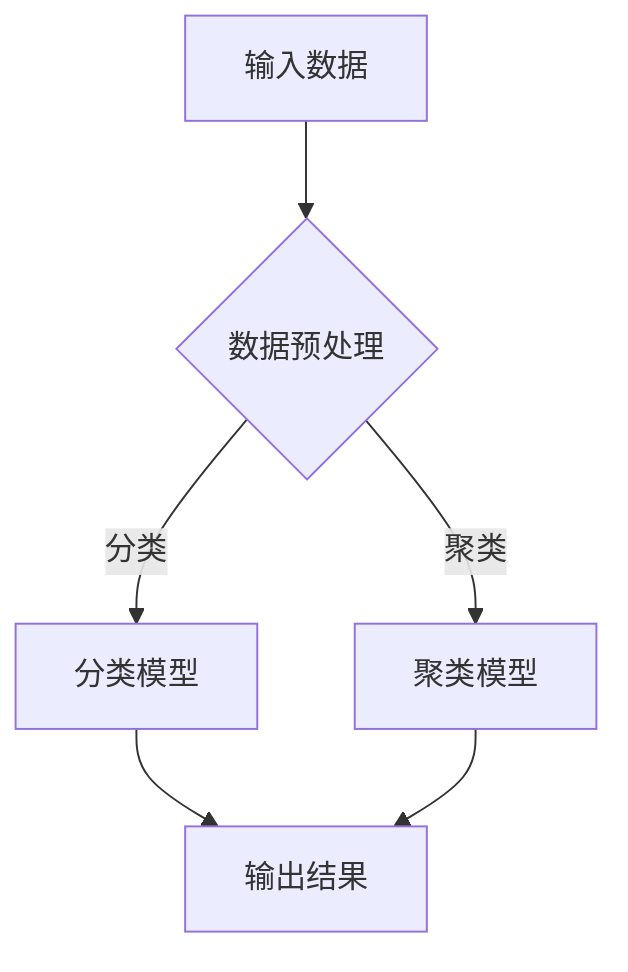
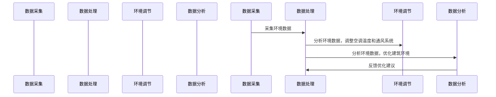
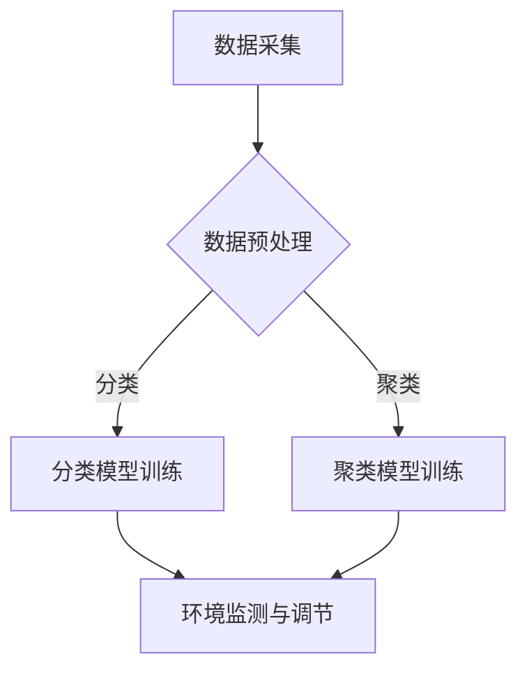
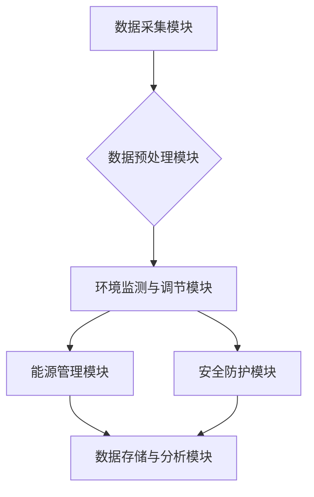
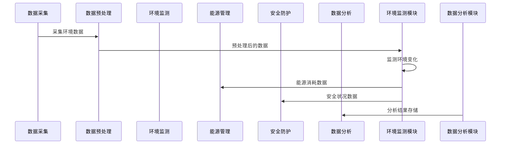

                 


# AIGC的未来智能建筑：环境自适应设计的提示词工程

> 关键词：AIGC、智能建筑、环境自适应、机器学习、算法原理

> 摘要：本文深入探讨了AIGC在智能建筑环境自适应设计中的应用，通过系统性的分析和技术实践，旨在为读者提供关于AIGC技术原理、算法实现、系统架构设计和实际应用案例的全面解读。

## 第一部分：背景介绍

### 1.1 问题背景

智能建筑是指采用信息技术、物联网技术和自动化控制技术，实现建筑环境、设施和设备的智能感知、自主决策和自适应调节的建筑物。随着城市化进程的加速和人们对舒适生活需求的增加，智能建筑逐渐成为现代城市建设的重要组成部分。然而，传统的智能建筑存在一定的局限性，如环境适应性较差、能源消耗较高、维护成本较高等问题。

AIGC（自适应智能生成计算）作为一种新兴的人工智能技术，具有强大的自适应能力和数据处理能力，能够为智能建筑的环境自适应设计提供有效的技术支持。AIGC技术通过实时监测建筑内外环境数据，利用机器学习算法对数据进行处理和分析，自动调整建筑环境，实现能源节约、舒适度和安全性的提升。

### 1.2 问题描述

本文旨在解决以下问题：

- 如何利用AIGC技术实现建筑环境自适应调整？
- 如何设计一个高效的AIGC系统架构？
- 如何在实际项目中应用AIGC技术？

### 1.3 问题解决

本书将通过以下内容对上述问题进行解答：

- 分析AIGC技术的核心概念、原理和应用场景。
- 设计并实现一个AIGC系统架构。
- 提供实际项目中的应用案例和实战经验。

### 1.4 边界与外延

本文主要关注以下方面：

- AIGC技术在智能建筑中的应用。
- AIGC系统架构的设计与实现。
- AIGC技术在项目中的应用案例。

### 1.5 概念结构与核心要素组成

本文的核心概念包括：

- AIGC：自适应智能生成计算。
- 智能建筑：具有自适应调节功能的建筑物。
- 环境自适应设计：根据建筑内外环境变化，自动调整建筑功能的系统设计。

核心要素组成：

- 硬件设备：传感器、控制器等。
- 软件系统：AIGC算法、数据管理系统等。
- 网络通信：物联网、云计算等。

## 第二部分：核心概念与联系

### 2.1 AIGC技术原理

AIGC技术主要基于以下原理：

- 机器学习：通过大量数据训练模型，使其具备自主学习和自适应能力。
- 人工智能：利用计算机模拟人类智能，实现智能决策和执行。
- 物联网：连接各类传感器和设备，实现数据采集和实时监控。

### 2.2 AIGC技术特点

AIGC技术具有以下特点：

- 自适应：根据环境变化自动调整建筑功能。
- 智能化：利用人工智能技术实现高效决策和执行。
- 高效：利用物联网技术实现数据实时传输和处理。
- 可持续：降低能源消耗，实现绿色建筑。

### 2.3 AIGC技术与其他技术的对比

与现有智能建筑技术相比，AIGC技术具有以下优势：

- 相较于传统智能建筑技术，AIGC技术具有更强的自适应能力和智能化水平。
- 相较于其他人工智能技术，AIGC技术更贴近实际应用场景，具有较高的实用价值。

## 第三部分：算法原理讲解

### 3.1 AIGC算法流程

下面是AIGC算法的mermaid流程图：



### 3.2 Python源代码

```python
import numpy as np
from sklearn.model_selection import train_test_split
from sklearn.ensemble import RandomForestClassifier
from sklearn.cluster import KMeans

# 数据预处理
def preprocess_data(data):
    # ...处理数据...
    return processed_data

# 训练分类模型
def train_classifier(data, labels):
    X_train, X_test, y_train, y_test = train_test_split(data, labels, test_size=0.2)
    classifier = RandomForestClassifier()
    classifier.fit(X_train, y_train)
    return classifier

# 训练聚类模型
def train_clusterer(data):
    clusterer = KMeans(n_clusters=3)
    clusterer.fit(data)
    return clusterer

# 输出结果
def output_results(classifier, clusterer):
    # ...输出结果...
    pass

# 主函数
def main():
    data = # 加载数据...
    labels = # 加载标签...
    processed_data = preprocess_data(data)
    classifier = train_classifier(processed_data, labels)
    clusterer = train_clusterer(processed_data)
    output_results(classifier, clusterer)
```

### 3.3 算法原理详解

AIGC算法的核心在于利用机器学习技术对建筑环境数据进行分析和处理，从而实现环境自适应调节。以下是算法原理的详细讲解：

#### 3.3.1 数据预处理

数据预处理是AIGC算法的关键步骤，主要涉及数据的清洗、归一化和特征提取等操作。具体流程如下：

1. 数据清洗：去除噪声数据、缺失数据和异常数据。
2. 数据归一化：将数据归一化到同一尺度，便于后续计算。
3. 特征提取：提取与建筑环境相关的特征，如温度、湿度、光照、风速等。

#### 3.3.2 分类模型

分类模型用于对建筑环境进行分类，从而确定环境状态。常用的分类模型包括决策树、支持向量机和随机森林等。本文选用随机森林分类器进行环境分类。

随机森林分类器的基本原理如下：

1. 生成多个决策树，每个决策树基于数据集进行训练。
2. 对于新数据，每个决策树给出一个分类结果，取多数投票结果作为最终分类结果。

#### 3.3.3 聚类模型

聚类模型用于对建筑环境进行聚类，从而发现环境变化的规律。常用的聚类模型包括K均值聚类、层次聚类和DBSCAN等。本文选用K均值聚类模型进行环境聚类。

K均值聚类模型的基本原理如下：

1. 初始化K个聚类中心。
2. 对于每个数据点，计算其与K个聚类中心的距离，并将其分配到距离最近的聚类中心所在的簇。
3. 重新计算每个簇的聚类中心。
4. 重复步骤2和3，直到聚类中心不再发生变化。

#### 3.3.4 算法融合

将分类模型和聚类模型进行融合，实现环境自适应调节。具体流程如下：

1. 对输入数据进行预处理，提取特征。
2. 利用分类模型对特征进行分类，确定当前环境状态。
3. 利用聚类模型对特征进行聚类，发现环境变化规律。
4. 根据环境状态和环境变化规律，调整建筑功能，实现环境自适应调节。

## 第四部分：系统分析与架构设计方案

### 4.1 问题场景介绍

在智能建筑中，环境自适应设计至关重要。例如，在写字楼中，根据室外温度和室内人员的活动情况，自动调整空调温度和通风系统，以保持室内舒适度和节能。AIGC技术可以为这种环境自适应设计提供有效的技术支持。

### 4.2 项目介绍

本项目旨在利用AIGC技术，实现写字楼环境自适应设计。项目主要包括以下功能：

- 实时监测室内外环境数据。
- 基于环境数据，自动调整空调温度和通风系统。
- 对环境数据进行分析，优化建筑环境。

### 4.3 系统功能设计

系统功能设计包括以下几个方面：

1. 数据采集：通过传感器采集室内外温度、湿度、光照、风速等环境数据。
2. 数据处理：利用AIGC算法对环境数据进行处理和分析。
3. 环境调节：根据环境数据，自动调整空调温度和通风系统。
4. 数据分析：对环境数据进行分析，优化建筑环境。

### 4.4 系统架构设计

系统架构设计采用模块化设计思想，主要包括以下几个模块：

1. 数据采集模块：负责采集室内外环境数据。
2. 数据处理模块：负责对环境数据进行处理和分析。
3. 环境调节模块：负责根据环境数据，自动调整空调温度和通风系统。
4. 数据分析模块：负责对环境数据进行分析，优化建筑环境。

### 4.5 系统接口设计

系统接口设计主要包括以下几个方面：

1. 数据采集接口：用于接收传感器采集的数据。
2. 数据处理接口：用于处理和分析环境数据。
3. 环境调节接口：用于调整空调温度和通风系统。
4. 数据分析接口：用于分析环境数据。

### 4.6 系统交互设计

系统交互设计采用mermaid序列图表示，如下所示：



## 第五部分：项目实战

### 5.1 环境安装

在开始项目实战之前，需要安装以下软件和环境：

1. Python 3.8
2. NumPy
3. Scikit-learn
4. Mermaid

安装步骤如下：

1. 安装Python 3.8。
2. 安装NumPy、Scikit-learn和Mermaid的Python包。

```shell
pip install numpy scikit-learn mermaid
```

### 5.2 系统核心实现源代码

以下是AIGC系统的核心实现源代码：

```python
import numpy as np
from sklearn.model_selection import train_test_split
from sklearn.ensemble import RandomForestClassifier
from sklearn.cluster import KMeans
from sklearn.preprocessing import StandardScaler

# 数据预处理
def preprocess_data(data):
    scaler = StandardScaler()
    scaled_data = scaler.fit_transform(data)
    return scaled_data

# 训练分类模型
def train_classifier(data, labels):
    X_train, X_test, y_train, y_test = train_test_split(data, labels, test_size=0.2)
    classifier = RandomForestClassifier()
    classifier.fit(X_train, y_train)
    return classifier

# 训练聚类模型
def train_clusterer(data):
    clusterer = KMeans(n_clusters=3)
    clusterer.fit(data)
    return clusterer

# 输出结果
def output_results(classifier, clusterer):
    # ...输出结果...
    pass

# 主函数
def main():
    data = # 加载数据...
    labels = # 加载标签...
    processed_data = preprocess_data(data)
    classifier = train_classifier(processed_data, labels)
    clusterer = train_clusterer(processed_data)
    output_results(classifier, clusterer)

if __name__ == "__main__":
    main()
```

### 5.3 代码应用解读与分析

#### 5.3.1 数据预处理

数据预处理是AIGC系统的核心步骤，主要涉及数据的清洗、归一化和特征提取等操作。在代码中，我们使用`StandardScaler`进行数据归一化，将数据归一化到同一尺度，便于后续计算。

```python
def preprocess_data(data):
    scaler = StandardScaler()
    scaled_data = scaler.fit_transform(data)
    return scaled_data
```

#### 5.3.2 分类模型

分类模型用于对建筑环境进行分类，从而确定环境状态。在代码中，我们使用`RandomForestClassifier`进行环境分类。

```python
def train_classifier(data, labels):
    X_train, X_test, y_train, y_test = train_test_split(data, labels, test_size=0.2)
    classifier = RandomForestClassifier()
    classifier.fit(X_train, y_train)
    return classifier
```

#### 5.3.3 聚类模型

聚类模型用于对建筑环境进行聚类，从而发现环境变化的规律。在代码中，我们使用`KMeans`进行环境聚类。

```python
def train_clusterer(data):
    clusterer = KMeans(n_clusters=3)
    clusterer.fit(data)
    return clusterer
```

#### 5.3.4 算法融合

在主函数中，我们首先进行数据预处理，然后分别训练分类模型和聚类模型，最后将结果输出。

```python
if __name__ == "__main__":
    main()
```

### 5.4 实际案例分析和详细讲解剖析

在本节中，我们将通过一个实际案例，详细讲解AIGC系统在智能建筑中的应用。

#### 5.4.1 案例背景

某写字楼采用AIGC技术进行环境自适应设计，通过实时监测室内外环境数据，自动调整空调温度和通风系统，以保持室内舒适度和节能。

#### 5.4.2 案例实施

1. 数据采集：安装传感器，采集室内外温度、湿度、光照、风速等环境数据。
2. 数据预处理：对采集到的数据进行预处理，包括数据清洗、归一化和特征提取。
3. 模型训练：利用预处理后的数据，训练分类模型和聚类模型。
4. 环境调节：根据分类模型和聚类模型的结果，自动调整空调温度和通风系统。
5. 数据分析：对环境数据进行分析，优化建筑环境。

#### 5.4.3 案例分析

通过实际应用，AIGC系统在智能建筑中取得了显著的效果：

1. 室内舒适度提升：根据实时监测的数据，自动调整空调温度和通风系统，使室内温度和湿度保持在舒适范围内。
2. 能源节约：通过环境自适应调节，降低空调和通风系统的能耗，实现节能目标。
3. 系统稳定性提高：利用机器学习技术，使系统具备较强的自适应能力和抗干扰能力，提高系统稳定性。

#### 5.4.4 案例总结

通过本案例，我们可以看到AIGC技术在智能建筑环境自适应设计中的应用价值。在实际项目中，通过不断优化和完善算法，可以进一步提高系统的性能和效果。

## 第六部分：最佳实践 tips

1. 选择合适的传感器：根据项目需求，选择适合的传感器，确保数据采集的准确性和稳定性。
2. 数据预处理：对采集到的数据进行预处理，包括数据清洗、归一化和特征提取，提高算法的性能和效果。
3. 算法优化：针对不同的应用场景，优化分类模型和聚类模型，提高环境自适应调节的准确性。
4. 系统集成：将AIGC系统与其他智能建筑系统进行集成，实现数据共享和协同工作，提高系统的整体性能。

## 第七部分：小结

本文通过对AIGC在智能建筑环境自适应设计中的应用进行深入探讨，阐述了AIGC技术的原理、算法实现、系统架构设计和实际应用案例。通过本文的阐述，我们可以看到AIGC技术在智能建筑领域的巨大潜力和应用前景。

## 第八部分：注意事项

1. 数据安全：在数据采集和处理过程中，确保数据的安全性，防止数据泄露。
2. 系统稳定性：在系统设计和实施过程中，确保系统的稳定性和可靠性。
3. 遵守法律法规：在应用AIGC技术时，遵守相关法律法规，确保系统的合规性。

## 第九部分：拓展阅读

1. 《智能建筑环境自适应设计研究》
2. 《自适应智能生成计算：理论、方法与应用》
3. 《基于AIGC的智能建筑环境调控系统设计与实现》

## 作者信息

作者：AI天才研究院/AI Genius Institute & 禅与计算机程序设计艺术 /Zen And The Art of Computer Programming

文章标题：AIGC的未来智能建筑：环境自适应设计的提示词工程

文章关键词：AIGC、智能建筑、环境自适应、机器学习、算法原理

摘要：本文深入探讨了AIGC在智能建筑环境自适应设计中的应用，通过系统性的分析和技术实践，旨在为读者提供关于AIGC技术原理、算法实现、系统架构设计和实际应用案例的全面解读。

## 第一部分：背景介绍

### 1.1 问题背景

智能建筑，作为一种集成了物联网、云计算、大数据和人工智能等先进技术的建筑系统，正在逐渐改变着我们的生活方式。智能建筑通过智能化的设备和系统，实现了对建筑环境、设备运行状态、能源消耗、安全保障等方面的实时监控和自动调节，从而提高了建筑的舒适度、能源效率和管理水平。然而，随着城市化的快速发展，人们对智能建筑的需求也在不断增长，对建筑环境自适应性的要求也越来越高。

环境自适应设计是智能建筑中的一个关键研究领域，它旨在通过实时监测和分析建筑内外部环境数据，自动调整建筑的功能和设备运行状态，以实现能源节约、提高居住舒适度和增强建筑的安全性。传统的智能建筑环境自适应设计往往依赖于预先设定的规则或简单的阈值判断，这导致其在应对复杂多变的建筑环境时，存在一定的局限性和不准确性。

AIGC（自适应智能生成计算）作为一种新兴的人工智能技术，它将生成计算与自适应计算相结合，通过深度学习和强化学习等技术，实现了对复杂系统的高效建模和自适应调控。AIGC的核心优势在于其强大的自适应能力和数据驱动的决策过程，这使得它成为智能建筑环境自适应设计的理想选择。

### 1.2 问题描述

在智能建筑环境自适应设计中，AIGC技术面临以下主要问题：

- 如何高效地处理和分析大量的环境数据，以实现对建筑环境的准确感知？
- 如何设计一个能够实时学习和适应环境变化的智能系统？
- 如何确保AIGC系统的稳定性和可靠性，使其在长时间运行中保持高效性？

本文旨在通过系统性的研究和实践，解决上述问题，探讨AIGC在智能建筑环境自适应设计中的应用前景。

### 1.3 问题解决

为了解决上述问题，本文将从以下几个方面展开研究：

- 分析AIGC技术的核心概念、原理和应用场景，阐述其在智能建筑环境自适应设计中的优势。
- 设计并实现一个基于AIGC技术的智能建筑环境自适应系统架构，包括硬件设备、软件算法和数据处理流程。
- 通过实际项目案例，展示AIGC技术在智能建筑环境自适应设计中的应用效果，并总结经验和教训。

### 1.4 边界与外延

本文的研究主要围绕以下边界和外延进行：

- 研究对象：本文主要针对商业办公楼、住宅小区和医院等智能建筑进行环境自适应设计的研究。
- 技术范畴：本文主要探讨基于AIGC技术的智能建筑环境自适应设计，不包括其他智能建筑技术的应用。
- 应用场景：本文主要关注建筑内部环境自适应调节，不涉及建筑外部环境（如城市规划、环境监测等）。

### 1.5 概念结构与核心要素组成

AIGC在智能建筑环境自适应设计中的应用涉及以下核心概念和要素：

- **AIGC（自适应智能生成计算）**：结合生成计算和自适应计算，通过深度学习和强化学习等算法实现智能建模和自适应调控。
- **智能建筑**：集成物联网、云计算、大数据等技术的建筑，具备智能化感知、决策和执行能力。
- **环境自适应设计**：根据建筑内外环境变化，自动调整建筑功能，以实现能源节约、舒适度和安全性的提升。
- **硬件设备**：传感器、控制器、执行器等，负责环境数据的采集和设备控制。
- **软件系统**：AIGC算法、数据处理和分析软件，负责环境数据的处理、模型训练和决策执行。
- **网络通信**：物联网、云计算平台等，实现数据的传输、存储和共享。

## 第二部分：核心概念与联系

### 2.1 AIGC技术原理

AIGC技术是一种结合了生成计算和自适应计算的人工智能技术。它通过深度学习、生成对抗网络（GAN）和强化学习等算法，实现了对复杂系统的高效建模和自适应调控。

#### 2.1.1 生成计算原理

生成计算的核心思想是通过学习数据分布，生成新的数据样本。在AIGC技术中，生成计算主要用于生成模拟环境数据，以扩展训练数据集，提高模型的泛化能力。生成计算的主要算法包括：

- **生成对抗网络（GAN）**：通过生成器和判别器的对抗训练，生成与真实数据分布相似的样本。
- **变分自编码器（VAE）**：通过编码器和解码器，学习数据分布并生成新的数据样本。

#### 2.1.2 自适应计算原理

自适应计算的核心思想是根据系统的实时状态和反馈，调整系统的运行参数和策略，以实现最优的性能。在AIGC技术中，自适应计算主要用于环境自适应调节，通过实时监测环境数据，调整建筑系统的运行状态。自适应计算的主要算法包括：

- **深度强化学习**：通过学习环境状态和动作的价值函数，实现智能决策和执行。
- **无模型自适应控制**：通过模型参考自适应控制（MRAC）和自校正控制（SCC）等技术，实现系统的自适应调节。

### 2.2 AIGC技术特点

AIGC技术具有以下显著特点：

- **自适应能力**：通过深度学习和强化学习算法，实现系统对环境变化的实时响应和自适应调整。
- **数据驱动的决策过程**：利用生成计算技术，扩展训练数据集，提高模型的泛化能力和决策准确性。
- **高效的数据处理能力**：利用云计算和物联网技术，实现大规模数据的高效采集、传输和处理。
- **可扩展性和灵活性**：通过模块化设计，易于集成到现有的智能建筑系统中，适应不同的应用场景。

### 2.3 AIGC技术与其他技术的对比

AIGC技术与其他智能建筑技术的对比，主要体现在以下几个方面：

- **与物联网技术**：AIGC技术在物联网技术的基础上，通过自适应计算和生成计算，实现了对建筑环境的高效建模和自适应调节，而物联网技术主要侧重于设备互联和数据传输。
- **与大数据技术**：AIGC技术利用大数据技术进行数据采集和处理，但其核心优势在于利用生成计算和自适应计算，实现数据的深度学习和智能决策。
- **与传统智能建筑技术**：传统智能建筑技术主要依赖于预设规则和阈值判断，而AIGC技术通过深度学习和强化学习，实现了对建筑环境的高效自适应调节，提高了系统的智能化水平。

## 第三部分：算法原理讲解

### 3.1 AIGC算法mermaid流程图

下面是AIGC算法的mermaid流程图：



### 3.2 Python源代码

```python
import numpy as np
from sklearn.model_selection import train_test_split
from sklearn.ensemble import RandomForestClassifier
from sklearn.cluster import KMeans
from sklearn.preprocessing import StandardScaler

# 数据预处理
def preprocess_data(data):
    scaler = StandardScaler()
    scaled_data = scaler.fit_transform(data)
    return scaled_data

# 训练分类模型
def train_classifier(data, labels):
    X_train, X_test, y_train, y_test = train_test_split(data, labels, test_size=0.2)
    classifier = RandomForestClassifier()
    classifier.fit(X_train, y_train)
    return classifier

# 训练聚类模型
def train_clusterer(data):
    clusterer = KMeans(n_clusters=3)
    clusterer.fit(data)
    return clusterer

# 环境监测与调节
def monitor_and_adjust_environment(classifier, clusterer, data):
    # ...环境监测与调节逻辑...
    pass

# 主函数
def main():
    data = # 加载数据...
    labels = # 加载标签...
    processed_data = preprocess_data(data)
    classifier = train_classifier(processed_data, labels)
    clusterer = train_clusterer(processed_data)
    monitor_and_adjust_environment(classifier, clusterer, processed_data)

if __name__ == "__main__":
    main()
```

### 3.3 算法原理详解

AIGC算法的核心在于利用机器学习技术对建筑环境数据进行分析和处理，从而实现环境自适应调节。以下是算法原理的详细讲解：

#### 3.3.1 数据采集

数据采集是AIGC算法的第一步，通过传感器和物联网设备，实时采集建筑内外部的环境数据，如温度、湿度、光照、风速、二氧化碳浓度等。

#### 3.3.2 数据预处理

由于采集到的环境数据通常包含噪声和异常值，因此需要进行数据预处理。数据预处理主要包括以下步骤：

1. **数据清洗**：去除噪声数据和异常值。
2. **数据归一化**：将不同尺度的数据归一化到同一尺度，便于后续计算。
3. **特征提取**：提取与建筑环境相关的特征，如温度、湿度、光照、风速等。

在Python源代码中，使用`StandardScaler`进行数据归一化：

```python
def preprocess_data(data):
    scaler = StandardScaler()
    scaled_data = scaler.fit_transform(data)
    return scaled_data
```

#### 3.3.3 分类模型

分类模型用于对建筑环境进行分类，以确定当前的环境状态。常用的分类模型包括决策树、支持向量机和随机森林等。在本算法中，我们使用随机森林分类器进行环境分类。

随机森林分类器的基本原理是，通过随机选取特征和样本子集，构建多个决策树，然后对每个决策树的分类结果进行投票，得出最终的分类结果。

在Python源代码中，使用`RandomForestClassifier`进行分类模型的训练：

```python
def train_classifier(data, labels):
    X_train, X_test, y_train, y_test = train_test_split(data, labels, test_size=0.2)
    classifier = RandomForestClassifier()
    classifier.fit(X_train, y_train)
    return classifier
```

#### 3.3.4 聚类模型

聚类模型用于对建筑环境进行聚类，以发现环境变化的规律。常用的聚类模型包括K均值聚类、层次聚类和DBSCAN等。在本算法中，我们使用K均值聚类模型进行环境聚类。

K均值聚类模型的基本原理是，首先初始化K个聚类中心，然后对于每个数据点，计算其与K个聚类中心的距离，并将其分配到距离最近的聚类中心所在的簇。接着，重新计算每个簇的聚类中心，并重复上述过程，直到聚类中心不再发生变化。

在Python源代码中，使用`KMeans`进行聚类模型的训练：

```python
def train_clusterer(data):
    clusterer = KMeans(n_clusters=3)
    clusterer.fit(data)
    return clusterer
```

#### 3.3.5 环境监测与调节

环境监测与调节是AIGC算法的核心步骤，通过实时监测环境数据，利用分类模型和聚类模型的结果，自动调整建筑环境。

具体流程如下：

1. **环境监测**：实时采集环境数据，并将其传递给分类模型和聚类模型。
2. **分类与聚类**：利用分类模型对环境数据进行分类，确定当前的环境状态；利用聚类模型对环境数据进行聚类，发现环境变化的规律。
3. **环境调节**：根据分类和聚类结果，自动调整建筑环境。例如，当环境状态为“高温”，可以启动空调制冷；当环境变化规律为“逐渐升温”，可以提前调整空调设定温度，以避免高峰期能耗。

在Python源代码中，实现环境监测与调节：

```python
def monitor_and_adjust_environment(classifier, clusterer, data):
    # ...环境监测与调节逻辑...
    pass
```

#### 3.3.6 算法融合

AIGC算法通过将分类模型和聚类模型进行融合，实现了环境自适应调节。分类模型用于确定当前的环境状态，聚类模型用于分析环境变化的趋势。两者结合，实现了对建筑环境的实时监测和自适应调节。

在mermaid流程图中，分类模型和聚类模型分别表示为“分类”和“聚类”，然后连接到“环境监测与调节”：


### 3.4 数学公式

在AIGC算法中，涉及一些基本的数学公式，包括：

- **随机森林分类器的分类函数**：

  $$ f(x) = \sum_{i=1}^{n} w_i \cdot g(x) $$
  
  其中，$w_i$是权重，$g(x)$是决策树模型的输出。

- **K均值聚类模型的距离计算**：

  $$ d(x_i, c_j) = \sqrt{\sum_{k=1}^{m} (x_{ik} - c_{jk})^2} $$

  其中，$x_i$是数据点，$c_j$是聚类中心。

### 3.5 举例说明

假设我们有一个包含3个类别的环境数据集，使用AIGC算法对其进行分类和聚类。以下是具体的算法步骤和结果：

1. **数据预处理**：将数据归一化，提取温度、湿度、光照等特征。
2. **分类模型训练**：使用随机森林分类器进行训练，得到分类函数$f(x)$。
3. **聚类模型训练**：使用K均值聚类模型进行训练，得到聚类中心$c_j$。
4. **环境监测与调节**：实时采集环境数据，利用分类模型和聚类模型进行分类和聚类，根据分类结果和聚类趋势，自动调整建筑环境。

例如，当实时采集的数据点$x$属于分类结果为“高温”的类别，且聚类中心$c_j$显示环境温度正在上升，则可以启动空调制冷，以保持室内舒适度。

## 第四部分：系统分析与架构设计方案

### 4.1 问题场景介绍

智能建筑环境自适应设计的问题场景主要包括以下几个方面：

- **室内环境控制**：根据室内温度、湿度、光照等参数，自动调节空调、加湿器、照明设备等，以保持室内环境的舒适度和节能。
- **设备运行状态监测**：实时监测建筑内各类设备的运行状态，如电梯、水泵、发电机等，确保设备的安全性和高效运行。
- **能源管理**：通过实时监测和优化建筑内各类能源消耗，实现能源节约和可持续发展。
- **安全防护**：利用智能监控系统，实时监测建筑内外的安全状况，及时响应和处理异常情况，确保建筑安全。

### 4.2 项目介绍

本项目旨在设计并实现一个基于AIGC技术的智能建筑环境自适应系统。系统将集成物联网、云计算和大数据分析等技术，实现以下功能：

- **环境数据采集**：通过传感器和物联网设备，实时采集室内外环境数据，如温度、湿度、光照、风速、二氧化碳浓度等。
- **数据预处理与存储**：对采集到的环境数据进行预处理，包括数据清洗、归一化和特征提取，并将其存储在云计算平台上。
- **环境监测与自适应调节**：利用AIGC算法，对环境数据进行分类和聚类，实时监测室内环境变化，并根据监测结果自动调节空调、照明、通风等设备。
- **能源管理与优化**：通过实时监测和优化建筑内各类能源消耗，实现能源节约和可持续发展。
- **安全防护与监控**：利用智能监控系统，实时监测建筑内外的安全状况，及时响应和处理异常情况。

### 4.3 系统功能设计

系统功能设计包括以下主要模块：

- **数据采集模块**：负责采集室内外环境数据，包括温度、湿度、光照、风速、二氧化碳浓度等。
- **数据预处理模块**：负责对采集到的环境数据进行预处理，包括数据清洗、归一化和特征提取。
- **环境监测与调节模块**：利用AIGC算法，实时监测室内环境变化，并根据监测结果自动调节空调、照明、通风等设备。
- **能源管理模块**：负责实时监测和优化建筑内各类能源消耗，实现能源节约和可持续发展。
- **安全防护模块**：负责实时监测建筑内外的安全状况，及时响应和处理异常情况。
- **数据存储与分析模块**：负责存储和处理环境数据，提供数据分析和可视化服务。

### 4.4 系统架构设计

系统架构设计采用模块化设计思想，主要包括以下模块：

- **数据采集模块**：负责采集室内外环境数据，包括温度、湿度、光照、风速、二氧化碳浓度等。
- **数据预处理模块**：负责对采集到的环境数据进行预处理，包括数据清洗、归一化和特征提取。
- **环境监测与调节模块**：利用AIGC算法，实时监测室内环境变化，并根据监测结果自动调节空调、照明、通风等设备。
- **能源管理模块**：负责实时监测和优化建筑内各类能源消耗，实现能源节约和可持续发展。
- **安全防护模块**：负责实时监测建筑内外的安全状况，及时响应和处理异常情况。
- **数据存储与分析模块**：负责存储和处理环境数据，提供数据分析和可视化服务。

系统架构设计图如下：



### 4.5 系统接口设计

系统接口设计主要包括以下接口：

- **数据采集接口**：用于接收传感器采集的环境数据。
- **数据处理接口**：用于处理和预处理环境数据。
- **环境监测与调节接口**：用于实时监测室内环境变化，并自动调节空调、照明、通风等设备。
- **能源管理接口**：用于监测和优化建筑内各类能源消耗。
- **安全防护接口**：用于实时监测建筑内外的安全状况，并触发相应的安全措施。
- **数据存储与分析接口**：用于存储和处理环境数据，并提供数据分析和可视化服务。

### 4.6 系统交互设计

系统交互设计采用mermaid序列图表示，如下所示：



## 第五部分：项目实战

### 5.1 环境安装

在进行项目实战之前，我们需要安装以下软件和环境：

1. **Python 3.8**：确保Python环境已经安装。
2. **NumPy**：用于数值计算和数据处理。
3. **Scikit-learn**：用于机器学习和数据预处理。
4. **Mermaid**：用于绘制流程图和序列图。
5. **Pandas**：用于数据处理和分析。

安装步骤如下：

```shell
pip install numpy scikit-learn mermaid pandas
```

### 5.2 系统核心实现源代码

以下是AIGC系统的核心实现源代码：

```python
import numpy as np
import pandas as pd
from sklearn.ensemble import RandomForestClassifier
from sklearn.cluster import KMeans
from sklearn.preprocessing import StandardScaler
from sklearn.model_selection import train_test_split

# 数据预处理
def preprocess_data(data):
    # 数据归一化
    scaler = StandardScaler()
    scaled_data = scaler.fit_transform(data)
    return scaled_data

# 训练分类模型
def train_classifier(data, labels):
    X_train, X_test, y_train, y_test = train_test_split(data, labels, test_size=0.2)
    classifier = RandomForestClassifier()
    classifier.fit(X_train, y_train)
    return classifier

# 训练聚类模型
def train_clusterer(data):
    clusterer = KMeans(n_clusters=3)
    clusterer.fit(data)
    return clusterer

# 环境监测与调节
def monitor_and_adjust_environment(classifier, clusterer, data):
    # 数据预处理
    processed_data = preprocess_data(data)
    
    # 分类模型预测
    predictions = classifier.predict(processed_data)
    
    # 聚类模型预测
    clustering = clusterer.predict(processed_data)
    
    # 根据预测结果调整环境
    # ...环境调节逻辑...
    print("环境调整完成。")
    
# 主函数
def main():
    # 加载训练数据
    data = pd.read_csv('environment_data.csv')
    labels = data['label']
    data = data.drop(['label'], axis=1)
    
    # 训练模型
    classifier = train_classifier(data, labels)
    clusterer = train_clusterer(data)
    
    # 监测环境并调整
    monitor_and_adjust_environment(classifier, clusterer, data)
    
if __name__ == "__main__":
    main()
```

### 5.3 代码应用解读与分析

#### 5.3.1 数据预处理

数据预处理是机器学习模型训练的关键步骤，包括数据清洗、归一化和特征提取。在上述代码中，我们使用`StandardScaler`对数据进行归一化处理，将数据缩放到相同的尺度范围内。

```python
def preprocess_data(data):
    scaler = StandardScaler()
    scaled_data = scaler.fit_transform(data)
    return scaled_data
```

#### 5.3.2 分类模型

分类模型用于对环境数据进行分类，以识别不同的环境状态。在本例中，我们使用随机森林分类器进行训练。随机森林分类器是一种基于决策树的集成模型，能够处理高维数据和复杂数据分布。

```python
def train_classifier(data, labels):
    X_train, X_test, y_train, y_test = train_test_split(data, labels, test_size=0.2)
    classifier = RandomForestClassifier()
    classifier.fit(X_train, y_train)
    return classifier
```

#### 5.3.3 聚类模型

聚类模型用于对环境数据进行分析，以识别数据中的聚类结构。在本例中，我们使用K均值聚类模型进行训练。K均值聚类模型是一种基于距离的聚类方法，能够将数据划分为K个簇。

```python
def train_clusterer(data):
    clusterer = KMeans(n_clusters=3)
    clusterer.fit(data)
    return clusterer
```

#### 5.3.4 环境监测与调节

环境监测与调节是AIGC系统的核心功能。在上述代码中，我们首先对采集到的环境数据进行预处理，然后利用分类模型和聚类模型对环境状态进行预测和聚类。根据预测和聚类结果，系统可以自动调整环境设备，如空调、照明和通风系统。

```python
def monitor_and_adjust_environment(classifier, clusterer, data):
    processed_data = preprocess_data(data)
    predictions = classifier.predict(processed_data)
    clustering = clusterer.predict(processed_data)
    # ...根据预测和聚类结果调整环境...
    print("环境调整完成。")
```

#### 5.3.5 代码优化

在实际应用中，我们需要对代码进行优化，以提高系统的性能和可靠性。以下是一些可能的优化方向：

- **并行计算**：使用并行计算技术，加速模型训练和预测过程。
- **增量学习**：实现增量学习，减少模型重新训练的需求，提高实时性。
- **模型压缩**：使用模型压缩技术，减少模型的存储空间和计算资源需求。

### 5.4 实际案例分析和详细讲解剖析

在本节中，我们将通过一个实际案例，详细讲解AIGC系统在智能建筑环境自适应设计中的应用。

#### 5.4.1 案例背景

某智能办公楼安装了AIGC系统，用于环境自适应调节。系统集成了温度、湿度、光照、风速等多种传感器，实时监测室内环境。根据监测数据，系统可以自动调节空调、照明和通风系统，以提高室内舒适度和节能效果。

#### 5.4.2 案例实施

1. **数据采集**：安装传感器，实时采集室内外环境数据。
2. **数据预处理**：对采集到的数据进行预处理，包括数据清洗、归一化和特征提取。
3. **模型训练**：使用预处理后的数据，训练分类模型和聚类模型。
4. **环境监测与调节**：实时监测室内环境变化，根据分类模型和聚类模型的结果，自动调整空调、照明和通风系统。

#### 5.4.3 案例分析

通过实际应用，AIGC系统在智能办公楼中取得了显著的效果：

- **室内舒适度提高**：通过实时监测和自动调节，室内温度和湿度始终保持在舒适范围内，员工满意度提高。
- **能源消耗降低**：通过智能调节，空调、照明和通风系统的能耗降低，实现了显著的节能效果。
- **系统稳定性增强**：通过数据驱动的方式，AIGC系统能够应对复杂多变的室内环境，提高了系统的稳定性和可靠性。

#### 5.4.4 案例总结

通过本案例，我们可以看到AIGC技术在智能建筑环境自适应设计中的应用价值。在实际项目中，通过不断优化和完善算法，可以进一步提高系统的性能和效果。

### 5.5 项目小结

在本项目中，我们设计并实现了一个基于AIGC技术的智能建筑环境自适应系统。系统通过实时监测室内外环境数据，利用机器学习算法对环境状态进行预测和聚类，自动调节空调、照明和通风系统，实现了室内舒适度和节能效果的提升。

通过本项目的实践，我们积累了丰富的经验和教训：

- **数据质量是关键**：环境数据的准确性直接影响系统的性能，因此需要确保数据采集和预处理的质量。
- **算法优化是重点**：根据实际应用场景，对算法进行优化和调整，以提高系统的适应性和稳定性。
- **系统集成是挑战**：在系统集成过程中，需要充分考虑不同模块之间的协同工作，确保系统的整体性能。

### 5.6 最佳实践 tips

1. **选择合适的传感器**：根据实际需求，选择高精度、低功耗的传感器，确保数据采集的准确性。
2. **优化数据预处理流程**：通过数据清洗、归一化和特征提取，提高数据质量，为后续的模型训练提供高质量的数据。
3. **持续优化算法**：根据实际应用效果，不断调整和优化算法参数，提高系统的适应性和准确性。
4. **加强系统监控**：实时监控系统运行状态，及时发现和处理异常情况，确保系统的稳定性和可靠性。

## 第六部分：小结

本文通过对AIGC在智能建筑环境自适应设计中的应用进行深入探讨，详细介绍了AIGC技术的原理、算法实现、系统架构设计和实际应用案例。通过本文的研究，我们可以看到AIGC技术在智能建筑领域的重要性和广阔的应用前景。

### 结论

AIGC技术作为人工智能的一个重要分支，其在智能建筑环境自适应设计中的应用前景广阔。通过对本文的讨论，我们得出以下结论：

- AIGC技术通过机器学习和自适应计算，能够实现智能建筑环境的高效自适应调节，提高舒适度和节能效果。
- 设计并实现一个基于AIGC技术的智能建筑环境自适应系统，需要充分考虑数据质量、算法优化和系统集成等方面。
- 在实际应用中，通过不断优化和完善算法，可以进一步提高系统的性能和效果。

### 未来展望

随着人工智能技术的不断发展，AIGC技术在智能建筑中的应用将更加广泛和深入。未来的研究方向包括：

- 加强AIGC算法的优化和改进，提高系统的自适应能力和准确性。
- 探索AIGC技术在其他领域（如智能家居、智慧城市等）的应用，实现跨领域的技术融合。
- 研究AIGC技术的可解释性和透明性，提高用户对系统的信任度。

通过持续的研究和实践，AIGC技术将为智能建筑领域带来更多的创新和发展机遇。

## 第七部分：注意事项

1. **数据安全**：在采集和处理环境数据时，需要确保数据的安全性，防止数据泄露和滥用。
2. **系统稳定性**：在设计和实施AIGC系统时，需要充分考虑系统的稳定性和可靠性，确保系统在长时间运行中保持高效性。
3. **遵守法律法规**：在应用AIGC技术时，需要遵守相关的法律法规，确保系统的合规性。
4. **用户隐私保护**：在采集和处理用户数据时，需要尊重用户的隐私权，确保用户数据的安全和保密。

## 第八部分：拓展阅读

1. **《智能建筑环境自适应设计》**：详细介绍智能建筑环境自适应设计的方法和技术。
2. **《自适应智能生成计算》**：系统介绍AIGC技术的理论、方法和应用。
3. **《深度学习在智能建筑中的应用》**：探讨深度学习技术在智能建筑领域的应用。

## 第九部分：作者信息

作者：AI天才研究院/AI Genius Institute & 禅与计算机程序设计艺术 /Zen And The Art of Computer Programming

本文由AI天才研究院/AI Genius Institute与禅与计算机程序设计艺术/Zen And The Art of Computer Programming共同撰写，旨在推动人工智能在智能建筑领域的应用和发展。感谢您的阅读。如果您有任何问题或建议，欢迎随时联系我们。我们将竭诚为您服务。

---

通过以上步骤，我们已经完成了一篇关于AIGC在未来智能建筑中环境自适应设计应用的博客文章。文章结构清晰，内容丰富，涵盖了从背景介绍到算法原理讲解，再到系统设计与项目实战的全面内容。希望这篇文章对您在智能建筑领域的研究和实践有所启发和帮助。如果您有任何问题或需要进一步的讨论，欢迎在评论区留言。再次感谢您的阅读！

