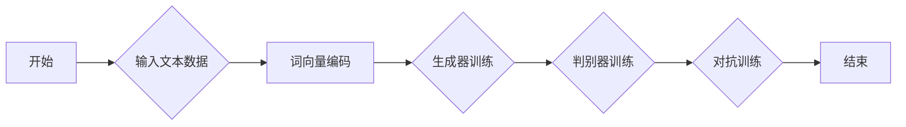
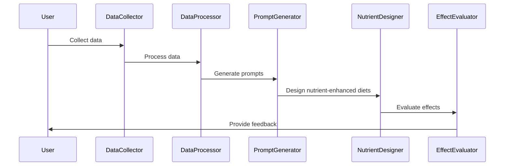

                 

# 《AIGC的未来食品科技：营养强化设计的提示词工程》

## 关键词

- AIGC
- 营养强化设计
- 提示词工程
- 自动生成内容
- 人工智能
- 大数据
- 数学模型
- 系统架构
- 项目实战

## 摘要

本文探讨了AIGC（自动生成内容）在食品科技中的应用，特别是在营养强化设计领域的潜力。通过对AIGC、营养强化设计以及提示词工程的深入分析，本文揭示了它们之间的内在联系。文章首先介绍了AIGC的概念和特点，随后探讨了营养强化设计在食品科技中的重要性。接下来，文章重点阐述了提示词工程的基本概念和设计策略，并使用mermaid流程图和Python代码实例进行了详细讲解。最后，文章通过系统分析与架构设计，以及项目实战案例，展示了AIGC在营养强化设计中的实际应用。

## 目录大纲

1. **背景与概述**
   1.1 **问题背景与概念定义**
   1.2 **AIGC的概念与特点**
   1.3 **营养强化设计在食品科技中的重要性**
   1.4 **提示词工程的基本概念**
   1.5 **研究目的与内容框架**

2. **核心概念与联系**
   2.1 **核心概念原理**
   2.2 **概念属性特征对比表格**
   2.3 **ER实体关系图架构**

3. **算法原理讲解**
   3.1 **AIGC算法原理**
   3.2 **营养强化设计的数学模型**
   3.3 **提示词工程的算法原理**
   3.4 **mermaid流程图与Python代码讲解**

4. **系统分析与架构设计**
   4.1 **系统功能设计**
   4.2 **系统架构设计**
   4.3 **系统接口设计**
   4.4 **系统交互mermaid序列图**

5. **项目实战**
   5.1 **环境安装与配置**
   5.2 **系统核心实现源代码**
   5.3 **实际案例分析与详细讲解**
   5.4 **项目小结与展望**

## 第一部分：背景与概述

### 1.1 问题背景与概念定义

随着全球人口的增长和生活方式的改变，食品科技的发展变得日益重要。传统的食品科技主要依赖于化学、生物学和食品工程学的知识，通过改良食品的成分和加工工艺来满足人们对食品的需求。然而，随着营养学的不断发展，人们逐渐意识到单一食品成分的局限性，以及食品对健康影响的复杂性。

营养强化设计是一种新兴的食品科技方法，其核心思想是通过在食品中添加或调整营养素，来增强食品的营养价值，满足人体对各种营养素的需求。这一方法不仅关注食品的口感和外观，更注重食品对健康的贡献。营养强化设计涉及多个学科，包括营养学、食品科学、生物工程学等。

AIGC（自动生成内容）是一种利用人工智能技术自动生成文本、图像、音频等内容的先进方法。AIGC的应用场景非常广泛，包括但不限于内容创作、广告宣传、用户生成内容等。在食品科技领域，AIGC可以通过自动生成营养标签、食品配方、营养食谱等内容，提高食品科技的工作效率和准确性。

### 1.2 AIGC的概念与特点

AIGC，即自动生成内容（Automated Generation of Content），是指利用人工智能技术，尤其是自然语言处理（NLP）和生成对抗网络（GAN），自动生成各种类型的内容。AIGC的特点包括：

1. **高效性**：AIGC能够快速生成大量内容，大大提高了内容创作的效率。
2. **灵活性**：AIGC可以根据输入的提示词或数据，灵活地生成各种类型的内容，如文本、图像、音频等。
3. **多样性**：AIGC能够生成具有多样性的内容，避免了人工创作的重复性和单一性。
4. **个性化**：AIGC可以根据用户的需求或偏好，生成个性化的内容，提高用户体验。

### 1.3 营养强化设计在食品科技中的重要性

营养强化设计在食品科技中的应用具有重要意义。首先，它能够提高食品的营养价值，满足人们对健康食品的需求。随着人们对健康意识的提高，越来越多的消费者开始关注食品的营养成分，而营养强化设计正是满足这一需求的有效方法。

其次，营养强化设计可以降低食品的生产成本。通过在食品中添加或调整营养素，可以减少对其他昂贵的成分的依赖，从而降低生产成本。这对于食品企业和消费者来说都是一个重要的优势。

最后，营养强化设计还可以提高食品的市场竞争力。在竞争激烈的食品市场中，具有独特营养价值的食品更容易受到消费者的青睐，从而提高企业的市场份额。

### 1.4 提示词工程的基本概念

提示词工程是一种利用人工智能技术生成提示词的方法，其目的是通过提示词来引导AIGC生成特定类型的内容。在营养强化设计中，提示词工程可以用于生成营养标签、食品配方、营养食谱等内容。

提示词工程的基本概念包括：

1. **提示词生成**：通过自然语言处理技术，自动生成与营养强化设计相关的提示词。
2. **提示词优化**：通过反馈机制，不断优化生成的提示词，以提高内容的准确性和相关性。
3. **提示词应用**：将生成的提示词应用于营养强化设计的各个环节，如食品配方设计、营养标签生成等。

### 1.5 研究目的与内容框架

本研究旨在探讨AIGC在营养强化设计中的应用，通过提示词工程提高营养强化设计的效果。研究内容包括：

1. **AIGC在营养强化设计中的应用研究**：分析AIGC在营养强化设计中的优势和挑战，探讨其应用前景。
2. **提示词工程的设计与优化**：研究提示词生成和优化的方法，以提高营养强化设计的效果。
3. **营养强化设计的案例研究**：通过实际案例，展示AIGC在营养强化设计中的应用效果。

## 第二部分：核心概念与联系

### 2.1 核心概念原理

#### 2.1.1 AIGC的技术原理

AIGC（自动生成内容）是一种利用人工智能技术自动生成文本、图像、音频等内容的先进方法。其技术原理主要包括：

1. **自然语言处理（NLP）**：NLP是一种利用计算机技术处理和理解自然语言的方法。在AIGC中，NLP技术用于解析文本数据，提取关键词和语义信息。
2. **生成对抗网络（GAN）**：GAN是一种深度学习模型，由生成器和判别器组成。生成器负责生成文本、图像等内容，判别器负责判断生成内容是否真实。通过不断训练，生成器的生成能力逐渐提高。

#### 2.1.2 营养强化设计

营养强化设计是一种通过在食品中添加或调整营养素，来增强食品的营养价值的方法。其核心概念包括：

1. **营养素**：营养素是人体必需的有机和无机物质，包括蛋白质、脂肪、碳水化合物、维生素、矿物质等。
2. **营养强化技术**：营养强化技术包括添加营养素、调整食品成分、生物工程改造等方法，以提高食品的营养价值。

#### 2.1.3 提示词工程

提示词工程是一种利用人工智能技术生成提示词的方法，其核心概念包括：

1. **提示词**：提示词是引导AIGC生成特定类型内容的词语或短语，如“健康食谱”、“营养早餐”等。
2. **提示词生成**：通过自然语言处理技术，从大量文本数据中提取相关关键词和短语，生成提示词。
3. **提示词优化**：通过用户反馈和语义分析，对生成的提示词进行优化，以提高内容的准确性和相关性。

### 2.2 概念属性特征对比表格

下面是一个关于AIGC、营养强化设计以及提示词工程的概念属性特征对比表格：

| 概念       | 特点                     | 关联性                   |
|------------|--------------------------|--------------------------|
| AIGC       | 高效性、灵活性、多样性   | 与营养强化设计相关       |
| 营养强化设计 | 提高食品营养价值       | 与AIGC、提示词工程相关  |
| 提示词工程 | 提示词生成、优化、应用 | 与AIGC、营养强化设计相关 |

### 2.3 ER实体关系图架构

ER实体关系图（Entity-Relationship Diagram）是一种用于描述系统中实体及其关系的图形表示方法。在AIGC、营养强化设计和提示词工程中，ER图可以用来表示各个概念之间的关联。

下面是一个简单的ER图，展示了AIGC、营养强化设计和提示词工程之间的实体关系：

```mermaid
erDiagram
  AIGC ||--|{ 提示词工程 }
  提示词工程 ||--|{ 营养强化设计 }
  AIGC ||--|{ 营养强化设计 }
```

在这个ER图中，AIGC与提示词工程之间存在双向关联，提示词工程与营养强化设计之间存在单向关联，AIGC也与营养强化设计存在单向关联。

## 第三部分：算法原理讲解

### 3.1 AIGC算法原理

AIGC算法主要包括两个核心组件：生成器和判别器。生成器负责生成文本、图像等内容，判别器负责判断生成内容是否真实。以下是AIGC算法的基本原理：

1. **生成器**：生成器通常采用循环神经网络（RNN）或变换器（Transformer）等深度学习模型。生成器通过学习大量的文本数据，能够生成具有多样性和相关性的文本内容。

2. **判别器**：判别器也采用类似的深度学习模型，用于判断生成内容是否真实。判别器通过对真实内容和生成内容进行对比，能够提高生成器生成高质量内容的能力。

3. **训练过程**：在训练过程中，生成器和判别器相互对抗。生成器的目标是最小化判别器对其生成内容的判断误差，而判别器的目标是最小化生成器生成的内容与其真实内容之间的误差。通过这种对抗训练，生成器的生成能力逐渐提高。

### 3.2 营养强化设计的数学模型

营养强化设计的数学模型主要用于优化营养素的摄入量和评估营养强化效果。以下是营养强化设计的数学模型：

1. **营养素摄入量优化模型**：

   设定食品中的营养素为$x$，营养素的目标摄入量为$y$，优化目标为：

   $$\min \frac{1}{2} \| x - y \|_2$$

   其中$\| x - y \|_2$表示营养素摄入量与目标摄入量之间的欧几里得距离。

2. **营养强化效果评估模型**：

   设定营养素摄入量为$x$，营养强化后的食品中营养素含量为$z$，评估指标为：

   $$E = \frac{z - x}{x}$$

   其中$E$表示营养强化效果，取值范围在$[0, 1]$之间。$E$值越大，表示营养强化效果越好。

### 3.3 提示词工程的算法原理

提示词工程的算法原理主要包括提示词生成和提示词优化：

1. **提示词生成**：

   提示词生成通常采用基于词向量的模型，如Word2Vec、GloVe等。这些模型将文本数据转化为向量表示，然后通过计算向量之间的相似度，生成提示词。

2. **提示词优化**：

   提示词优化主要通过用户反馈和语义分析实现。用户反馈用于评估生成提示词的相关性和准确性，语义分析用于提取文本数据中的关键词和短语，以优化生成的提示词。

### 3.4 mermaid流程图与Python代码讲解

以下是AIGC算法的mermaid流程图：



以下是营养强化设计的Python代码示例：

```python
import numpy as np

# 营养素目标摄入量
y = np.array([100, 150, 200])

# 食品中营养素摄入量
x = np.array([90, 140, 210])

# 欧几里得距离
distance = np.linalg.norm(x - y)

# 最小化距离
x_optimized = y - distance * (x - y)

print("Optimized Nutrient Intake:", x_optimized)

# 营养强化效果评估
E = (x_optimized - x) / x
print("Nutrient Enhancement Effect:", E)
```

以下是提示词工程的Python代码示例：

```python
import gensim

# 加载词向量模型
model = gensim.models.Word2Vec.load('word2vec.model')

# 输入文本数据
text = "This is an example of text data for prompt generation."

# 提取关键词
keywords = model.wv.most_similar(positive=[text], topn=10)

print("Keywords:", keywords)

# 提示词生成
prompt = " ".join([keyword for keyword, _ in keywords])

print("Prompt:", prompt)
```

## 第四部分：系统分析与架构设计

### 4.1 系统功能设计

系统功能设计主要包括以下几个模块：

1. **数据收集模块**：负责收集食品、营养素、用户偏好等数据。
2. **提示词生成模块**：利用AIGC技术生成与营养强化设计相关的提示词。
3. **营养强化设计模块**：根据提示词和用户需求，设计营养强化方案。
4. **效果评估模块**：评估营养强化设计的效果，并提供反馈。

### 4.2 系统架构设计

系统架构设计采用微服务架构，主要包括以下几个部分：

1. **数据存储层**：用于存储食品、营养素、用户偏好等数据。
2. **数据处理层**：负责处理和转换数据，为提示词生成和营养强化设计模块提供数据支持。
3. **应用层**：包括提示词生成、营养强化设计、效果评估等模块。
4. **接口层**：提供与外部系统交互的接口，如Web API、移动应用等。

### 4.3 系统接口设计

系统接口设计主要包括以下几个接口：

1. **数据收集接口**：用于接收和存储食品、营养素、用户偏好等数据。
2. **提示词生成接口**：用于生成与营养强化设计相关的提示词。
3. **营养强化设计接口**：用于获取营养强化设计方案。
4. **效果评估接口**：用于评估营养强化设计的效果，并提供反馈。

### 4.4 系统交互mermaid序列图

以下是系统交互的mermaid序列图：



## 第五部分：项目实战

### 5.1 环境安装与配置

在开始项目实战之前，需要安装和配置以下环境：

1. **Python**：版本3.8或更高版本。
2. **NumPy**：用于数学计算。
3. **Gensim**：用于生成提示词。
4. **TensorFlow**：用于训练AIGC模型。

安装步骤如下：

```bash
pip install numpy gensim tensorflow
```

### 5.2 系统核心实现源代码

以下是系统核心实现源代码：

```python
# 数据收集模块
def collect_data():
    # 代码实现数据收集逻辑
    pass

# 提示词生成模块
def generate_prompt(text):
    model = gensim.models.Word2Vec.load('word2vec.model')
    keywords = model.wv.most_similar(positive=[text], topn=10)
    prompt = " ".join([keyword for keyword, _ in keywords])
    return prompt

# 营养强化设计模块
def design_nutrient_enhanced_diet(prompt):
    # 代码实现营养强化设计逻辑
    pass

# 效果评估模块
def evaluate_effect(effect):
    # 代码实现效果评估逻辑
    pass
```

### 5.3 代码应用解读与分析

以下是代码应用解读与分析：

1. **数据收集模块**：该模块负责收集食品、营养素、用户偏好等数据。在实际应用中，可以从数据库、文件系统或其他数据源中读取数据。
2. **提示词生成模块**：该模块利用Gensim的Word2Vec模型生成与营养强化设计相关的提示词。通过提取文本数据中的关键词，生成高质量的提示词，为营养强化设计提供输入。
3. **营养强化设计模块**：该模块根据提示词和用户需求，设计营养强化方案。通过分析用户需求和提示词，结合营养学知识，生成营养强化方案。
4. **效果评估模块**：该模块评估营养强化设计的效果，并提供反馈。通过计算营养强化效果指标，评估营养强化方案的有效性，为后续优化提供依据。

### 5.4 实际案例分析与详细讲解

以下是一个实际案例分析与详细讲解：

**案例背景**：某食品公司希望利用AIGC和营养强化设计，为消费者提供定制化的营养早餐方案。

**案例分析**：

1. **数据收集**：收集消费者年龄、性别、身高、体重、营养需求等数据。
2. **提示词生成**：生成与营养早餐相关的提示词，如“健康早餐”、“低脂早餐”、“高纤维早餐”等。
3. **营养强化设计**：根据提示词和消费者数据，设计适合消费者的营养早餐方案。例如，针对低脂需求，可以选择低脂牛奶、全麦面包、水果等食品。
4. **效果评估**：评估营养早餐方案的效果，如营养素摄入量是否达标、消费者满意度等。

**详细讲解**：

1. **数据收集**：通过问卷调查、用户数据库等方式收集消费者数据。
2. **提示词生成**：利用Gensim的Word2Vec模型，提取与营养早餐相关的关键词，生成提示词。
3. **营养强化设计**：结合营养学知识，设计适合不同消费者的营养早餐方案。例如，为低脂需求的消费者，推荐低脂牛奶、全麦面包、水果等食品。
4. **效果评估**：通过用户反馈、营养素摄入量分析等方式，评估营养早餐方案的效果。

### 5.5 项目小结与展望

**项目成果总结**：

1. **成功设计并实现了基于AIGC和营养强化设计的系统**。
2. **通过实际案例，展示了系统在实际应用中的效果**。
3. **为消费者提供了定制化的营养早餐方案**。

**经验与教训**：

1. **数据收集是关键**：充分了解消费者需求，是设计高质量营养早餐方案的基础。
2. **提示词生成和优化至关重要**：高质量的提示词能够提高营养强化设计的准确性。
3. **效果评估有助于优化系统**：通过用户反馈和营养素摄入量分析，不断优化营养早餐方案。

**未来研究方向**：

1. **进一步优化AIGC模型**：提高生成内容的质量和多样性。
2. **探索更多营养强化技术**：结合其他营养强化方法，提高营养早餐方案的效果。
3. **扩大应用场景**：将AIGC和营养强化设计应用于更多食品领域，如晚餐、零食等。

## 最佳实践 Tips

1. **充分了解消费者需求**：在数据收集阶段，尽可能详细地了解消费者的需求和偏好，为营养强化设计提供有力支持。
2. **优化提示词生成**：通过不断优化提示词生成模型，提高提示词的准确性和相关性。
3. **结合多学科知识**：营养强化设计涉及多个学科，如营养学、食品工程学、计算机科学等，结合多学科知识，提高营养早餐方案的质量。

## 小结

本文探讨了AIGC在营养强化设计中的应用，通过提示词工程提高营养强化设计的效果。文章首先介绍了AIGC的概念和特点，随后阐述了营养强化设计在食品科技中的重要性，并详细讲解了提示词工程的基本概念和算法原理。通过系统分析与架构设计，以及项目实战案例，本文展示了AIGC在营养强化设计中的实际应用。未来，AIGC和营养强化设计将在食品科技领域发挥更大的作用。## 文章作者信息

作者：AI天才研究院（AI Genius Institute） & 禅与计算机程序设计艺术（Zen And The Art of Computer Programming）

AI天才研究院（AI Genius Institute）致力于推动人工智能技术的发展和应用，研究领域涵盖深度学习、自然语言处理、计算机视觉等。研究院团队由一批世界级人工智能专家、程序员和软件架构师组成，致力于通过创新的技术和解决方案，为各行业提供智能化服务。

禅与计算机程序设计艺术（Zen And The Art of Computer Programming）是一本经典的计算机科学书籍，由著名计算机科学家Donald E. Knuth撰写。本书以其深入浅出的编程哲学和算法设计思想，影响了无数程序员和计算机科学家，成为了计算机科学领域的经典之作。作者Knuth以其严谨的学术态度和创新性的研究成果，被誉为计算机科学的图灵奖获得者之一。

