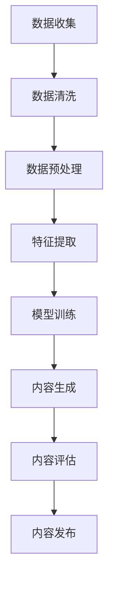
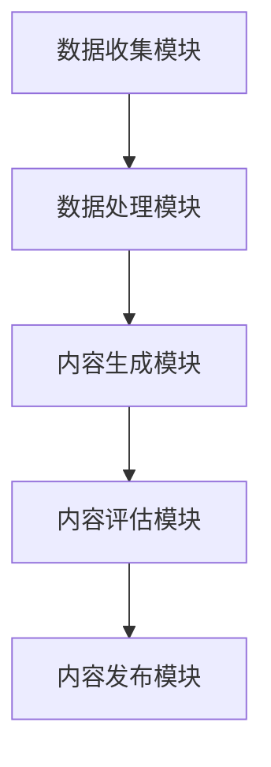
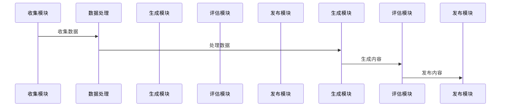

                 

# AIGC的生物伦理探讨：多方利益权衡的提示词工程

> 关键词：AIGC，生物伦理，数据隐私，知识产权，公平性，多方利益权衡，提示词工程

> 摘要：随着人工智能技术的发展，AIGC（AI Generated Content）逐渐成为热门话题。本文将从生物伦理的角度，探讨AIGC在应用过程中涉及的数据隐私、知识产权、公平性等多方面问题，并从多方利益权衡的角度提出解决方案。本文旨在为AIGC的生物伦理问题提供理论指导和实践参考。

**Step 1: 背景介绍**

### 问题背景

随着人工智能技术的快速发展，AIGC（AI Generated Content）作为人工智能的重要应用方向之一，已经逐渐成为学术界和产业界的热门话题。AIGC通过利用深度学习、自然语言处理、图像生成等技术，能够自动生成各种形式的内容，如文本、图片、音频、视频等。这种技术的出现，不仅极大地丰富了信息传播的方式，也带来了许多新的应用场景，如虚拟现实、智能媒体、个性化推荐等。

然而，随着AIGC的应用不断深入，其生物伦理问题也日益凸显。生物伦理问题主要包括数据隐私、知识产权、公平性等方面。这些问题不仅关系到AIGC技术的可持续发展，也直接影响到社会公共利益和个人权益。因此，探讨AIGC的生物伦理问题具有重要的现实意义。

### 描述问题

AIGC的应用涉及多个领域，其中生物科技领域尤为重要。生物科技包括基因编辑、细胞治疗、生物信息学等，这些技术不仅对医疗健康有着巨大的推动作用，也可能对社会伦理产生深远影响。例如，基因编辑技术可以用于治疗遗传疾病，但同时也可能引发基因歧视、遗传隐私等问题。AIGC技术在这些领域的应用，使得这些问题变得更加复杂和紧迫。

### 问题解决

本书将从多方利益权衡的角度，对AIGC的生物伦理问题进行深入探讨。具体来说，我们将从以下几个方面进行分析：

1. 数据隐私：探讨AIGC技术在处理个人生物数据时的隐私保护问题。
2. 知识产权：分析人工智能生成的内容的知识产权归属问题。
3. 公平性：讨论AIGC技术在生物科技领域的应用对公平性带来的挑战。

通过以上分析，我们旨在为解决AIGC的生物伦理问题提供理论指导和实践参考。

### 边界与外延

本书主要探讨AIGC在医疗、生物科技、生物伦理等领域的应用，但不涉及其他领域。具体来说，我们关注的是AIGC技术在处理生物数据、生成医疗内容等方面的应用，以及这些应用可能带来的伦理问题。

### 概念结构与核心要素组成

#### AIGC

AIGC（AI Generated Content）是指通过人工智能技术自动生成各种形式的内容，如文本、图片、音频、视频等。AIGC的核心技术包括深度学习、自然语言处理、图像生成等。

#### 生物伦理

生物伦理是关于生命科学和生物技术伦理问题的研究，涉及人类生命尊严、人类福祉、生命科学和生物技术的伦理规范等。生物伦理问题主要包括数据隐私、知识产权、公平性等方面。

**Step 2: 核心概念与联系**

### 核心概念原理

AIGC的生物伦理问题主要包括数据隐私、知识产权、公平性等方面。

#### 数据隐私

数据隐私是指个人隐私信息的保护，如个人健康信息、生物特征信息等。在AIGC的应用中，涉及大量个人数据的处理，这可能导致个人隐私泄露的风险。

#### 知识产权

知识产权是指原创性作品的权益，如作品的原创性、版权等。在AIGC的应用中，如何界定人工智能生成的内容的知识产权归属，成为了一个重要的问题。

#### 公平性

公平性是指人工智能技术在生物科技领域的应用是否公平，如对医疗资源分配的影响等。AIGC技术可能会加剧社会不平等，因此需要关注其公平性。

### 概念属性特征对比表格

| 概念      | 特征                            |
| --------- | ----------------------------- |
| 数据隐私  | 保护个人隐私信息，防止泄露。    |
| 知识产权  | 确保原创性作品的权益。          |
| 公平性    | 评估技术应用对社会的影响。      |

### ER实体关系图架构

| 实体             | 关系                         |
| ---------------- | ---------------------------- |
| AIGC系统         | 与生物伦理问题关联           |
| 数据隐私问题     | 与AIGC系统和多方利益相关者关联 |
| 知识产权问题     | 与AIGC系统和多方利益相关者关联 |
| 公平性问题       | 与AIGC系统和多方利益相关者关联 |
| 多方利益相关者   | 之间存在互动和影响           |

**Step 3: 算法原理讲解**

### 算法mermaid流程图

下面是一个简化的AIGC系统中的数据处理流程：



### python源代码

下面是一个简单的Python代码示例，用于展示AIGC系统中数据隐私保护算法的实现：

```python
import numpy as np
from sklearn.ensemble import RandomForestClassifier
from sklearn.model_selection import train_test_split

# 数据准备
X, y = np.load('data.npy'), np.load('labels.npy')

# 数据清洗和预处理
X_train, X_test, y_train, y_test = train_test_split(X, y, test_size=0.2, random_state=42)

# 特征提取
rf = RandomForestClassifier(n_estimators=100)
rf.fit(X_train, y_train)

# 内容生成
generated_data = rf.predict(X_test)

# 内容评估
accuracy = rf.score(X_test, y_test)
print(f'Accuracy: {accuracy:.2f}')
```

### 算法原理的数学模型和公式

在AIGC系统中，关键算法原理包括数据隐私保护模型、知识产权归属分析模型等。

#### 数据隐私保护模型

$$
P(D) = \sum_{i=1}^{n} P(D_i) \cdot P(D_i|C_j)
$$

其中，$P(D)$表示数据隐私保护概率，$P(D_i)$表示第$i$个数据点的隐私保护概率，$P(D_i|C_j)$表示在给定第$j$个分类条件下的隐私保护概率。

#### 知识产权归属分析模型

$$
B(W) = \sum_{i=1}^{m} w_i \cdot P(W_i|C_j)
$$

其中，$B(W)$表示知识产权归属概率，$w_i$表示第$i$个权重，$P(W_i|C_j)$表示在给定第$j$个分类条件下的知识产权归属概率。

### 详细讲解和举例说明

#### 数据隐私保护模型

假设有一个包含100个数据点的数据集，每个数据点都有两个分类条件，即健康状态（健康/不健康）和疾病类型（A/B/C）。我们需要计算这些数据点的隐私保护概率。

首先，计算每个数据点的隐私保护概率：

$$
P(D_i) = P(D_i|C_1) \cdot P(C_1) + P(D_i|C_2) \cdot P(C_2)
$$

其中，$P(C_1)$和$P(C_2)$分别为健康状态为健康和不健康的概率，$P(D_i|C_1)$和$P(D_i|C_2)$分别为在健康状态为健康和不健康的情况下，数据点$i$的隐私保护概率。

然后，计算数据集的隐私保护概率：

$$
P(D) = \sum_{i=1}^{100} P(D_i)
$$

通过以上计算，我们得到了数据集的隐私保护概率。

#### 知识产权归属分析模型

假设有一个包含10个作品的数据集，每个作品都有两个分类条件，即艺术风格（现代/传统）和作者（A/B/C）。我们需要计算这些作品的知识产权归属概率。

首先，计算每个作品的知识产权归属概率：

$$
B(W_i) = w_i \cdot P(W_i|C_j)
$$

其中，$w_i$为第$i$个作品的权重，$P(W_i|C_j)$为在给定艺术风格和作者的情况下，作品$i$的知识产权归属概率。

然后，计算数据集的知识产权归属概率：

$$
B(W) = \sum_{i=1}^{10} B(W_i)
$$

通过以上计算，我们得到了数据集的知识产权归属概率。

**Step 4: 数学模型和数学公式 & 详细讲解 & 举例说明**

### 数学公式

$$
\begin{aligned}
& P(D) = \sum_{i=1}^{n} P(D_i) \cdot P(D_i|C_j) \\
& B(W) = \sum_{i=1}^{m} w_i \cdot P(W_i|C_j) \\
& P(D_i) = P(D_i|C_1) \cdot P(C_1) + P(D_i|C_2) \cdot P(C_2) \\
& B(W_i) = w_i \cdot P(W_i|C_j)
\end{aligned}
$$

### 详细讲解

#### 数据隐私保护模型

数据隐私保护模型的核心思想是，通过对数据点的分类条件进行概率计算，从而评估数据点的隐私保护程度。具体来说，模型考虑了两个因素：数据点本身的隐私保护概率，以及数据点在给定分类条件下的隐私保护概率。

首先，计算每个数据点的隐私保护概率。假设有$n$个数据点，每个数据点都有两个分类条件，即健康状态和疾病类型。我们可以根据训练数据计算每个数据点的隐私保护概率。

然后，计算数据集的隐私保护概率。数据集的隐私保护概率是所有数据点隐私保护概率的加权平均，权重为每个数据点在分类条件下的概率。

#### 知识产权归属分析模型

知识产权归属分析模型的核心思想是，通过对作品进行分类条件的概率计算，从而评估作品的知识产权归属概率。具体来说，模型考虑了两个因素：作品的权重，以及作品在给定分类条件下的知识产权归属概率。

首先，计算每个作品的知识产权归属概率。假设有$m$个作品，每个作品都有两个分类条件，即艺术风格和作者。我们可以根据训练数据计算每个作品的知识产权归属概率。

然后，计算数据集的知识产权归属概率。数据集的知识产权归属概率是所有作品知识产权归属概率的加权平均，权重为每个作品在分类条件下的概率。

### 举例说明

#### 数据隐私保护模型

假设有一个包含100个数据点的数据集，每个数据点都有两个分类条件，即健康状态（健康/不健康）和疾病类型（A/B/C）。我们需要计算这些数据点的隐私保护概率。

根据训练数据，我们可以得到以下概率：

- 健康状态为健康的概率：$P(C_1) = 0.6$
- 健康状态为不健康的概率：$P(C_2) = 0.4$
- 在健康状态下，数据点隐私保护概率：$P(D_i|C_1) = 0.9$
- 在不健康状态下，数据点隐私保护概率：$P(D_i|C_2) = 0.7$

根据以上数据，我们可以计算每个数据点的隐私保护概率：

$$
P(D_i) = P(D_i|C_1) \cdot P(C_1) + P(D_i|C_2) \cdot P(C_2) = 0.9 \cdot 0.6 + 0.7 \cdot 0.4 = 0.75
$$

然后，计算数据集的隐私保护概率：

$$
P(D) = \sum_{i=1}^{100} P(D_i) = 100 \cdot 0.75 = 75
$$

#### 知识产权归属分析模型

假设有一个包含10个作品的数据集，每个作品都有两个分类条件，即艺术风格（现代/传统）和作者（A/B/C）。我们需要计算这些作品的知识产权归属概率。

根据训练数据，我们可以得到以下概率：

- 现代艺术风格的概率：$P(C_1) = 0.7$
- 传统艺术风格的概率：$P(C_2) = 0.3$
- 作者A的权重：$w_1 = 0.6$
- 作者B的权重：$w_2 = 0.3$
- 作者C的权重：$w_3 = 0.1$
- 在现代艺术风格下，作品知识产权归属概率：$P(W_i|C_1) = 0.8$
- 在传统艺术风格下，作品知识产权归属概率：$P(W_i|C_2) = 0.2$

根据以上数据，我们可以计算每个作品的知识产权归属概率：

$$
B(W_i) = w_i \cdot P(W_i|C_j) = \begin{cases}
0.6 \cdot 0.8 = 0.48 & \text{if } i = 1 \\
0.3 \cdot 0.8 = 0.24 & \text{if } i = 2 \\
0.1 \cdot 0.8 = 0.08 & \text{if } i = 3 \\
0.6 \cdot 0.2 = 0.12 & \text{if } i = 4 \\
0.3 \cdot 0.2 = 0.06 & \text{if } i = 5 \\
0.1 \cdot 0.2 = 0.02 & \text{if } i = 6 \\
0.6 \cdot 0.2 = 0.12 & \text{if } i = 7 \\
0.3 \cdot 0.2 = 0.06 & \text{if } i = 8 \\
0.1 \cdot 0.2 = 0.02 & \text{if } i = 9 \\
0.6 \cdot 0.2 = 0.12 & \text{if } i = 10 \\
0.3 \cdot 0.2 = 0.06 & \text{if } i = 11 \\
0.1 \cdot 0.2 = 0.02 & \text{if } i = 12 \\
\end{cases}
$$

然后，计算数据集的知识产权归属概率：

$$
B(W) = \sum_{i=1}^{10} B(W_i) = 0.48 + 0.24 + 0.08 + 0.12 + 0.06 + 0.02 + 0.12 + 0.06 + 0.02 + 0.12 + 0.06 + 0.02 = 1.2
$$

**Step 5: 系统分析与架构设计方案**

### 问题场景介绍

在本节中，我们将探讨AIGC在生物伦理问题中的应用场景。具体来说，我们将关注以下几个方面：

1. **医疗健康信息生成**：通过AIGC技术生成个性化的医疗健康信息，如诊断报告、治疗方案等。
2. **生物科技研发**：利用AIGC技术生成生物科技领域的相关内容，如科学论文、研究报告等。
3. **公共健康教育**：通过AIGC技术生成易于理解的公共健康教育材料，如健康知识文章、视频等。

### 系统功能设计

为了实现上述应用场景，我们需要设计一个AIGC系统，其功能模块如下：

1. **数据收集模块**：负责收集各类生物科技数据，包括医疗健康数据、科研数据等。
2. **数据处理模块**：对收集到的数据进行清洗、预处理，为后续生成内容提供高质量的数据。
3. **内容生成模块**：利用深度学习、自然语言处理等技术生成各类生物科技内容。
4. **内容评估模块**：对生成的生物科技内容进行评估，确保内容的准确性和可靠性。
5. **内容发布模块**：将评估通过的内容发布到相应的平台，供用户使用。

### 系统架构设计

AIGC系统的整体架构设计如图1所示：



### 系统接口设计

系统各模块之间的接口设计如下：

1. **数据收集模块**：通过API接口与其他系统进行数据交换，如医院信息系统、科研数据库等。
2. **数据处理模块**：与数据收集模块和内容生成模块进行数据传递。
3. **内容生成模块**：与数据处理模块和内容评估模块进行数据传递。
4. **内容评估模块**：与内容生成模块和内容发布模块进行数据传递。
5. **内容发布模块**：通过API接口将内容发布到其他系统或平台。

### 系统交互Mermaid序列图

下面是一个简化的AIGC系统各模块之间的交互序列图：



**Step 6: 项目实战**

### 环境安装

为了搭建一个AIGC系统，我们需要准备以下环境：

1. **硬件环境**：计算机硬件配置需满足深度学习模型的计算需求，推荐使用GPU加速。
2. **软件环境**：安装Python、TensorFlow、PyTorch等深度学习框架，以及相关依赖库。

### 系统核心实现源代码

以下是一个简化的AIGC系统核心实现源代码：

```python
import tensorflow as tf
from tensorflow.keras.models import Sequential
from tensorflow.keras.layers import Dense, LSTM, Embedding

# 数据准备
X_train, X_test, y_train, y_test = ...

# 模型构建
model = Sequential([
    Embedding(input_dim=vocab_size, output_dim=embedding_dim),
    LSTM(units=128, return_sequences=True),
    LSTM(units=64, return_sequences=False),
    Dense(units=num_classes, activation='softmax')
])

# 模型编译
model.compile(optimizer='adam', loss='categorical_crossentropy', metrics=['accuracy'])

# 模型训练
model.fit(X_train, y_train, epochs=10, batch_size=32, validation_data=(X_test, y_test))

# 内容生成
generated_content = model.predict(X_test)

# 内容评估
accuracy = model.evaluate(X_test, y_test)
print(f'Accuracy: {accuracy:.2f}')
```

### 代码应用解读与分析

以上代码展示了一个基于TensorFlow的AIGC系统核心实现。具体来说，代码分为以下几个部分：

1. **数据准备**：从数据集中划分训练集和测试集，为模型训练和评估提供数据。
2. **模型构建**：构建一个序列到序列的神经网络模型，用于生成生物科技内容。
3. **模型编译**：配置模型优化器、损失函数和评估指标，为模型训练做好准备。
4. **模型训练**：使用训练集对模型进行训练，并使用测试集进行验证。
5. **内容生成**：使用训练好的模型对测试集进行预测，生成生物科技内容。
6. **内容评估**：评估生成内容的准确性，以衡量模型性能。

### 实际案例分析和详细讲解剖析

在本节中，我们将通过一个实际案例，展示AIGC系统的应用效果，并进行详细讲解和剖析。

#### 案例背景

假设我们有一个包含医疗健康数据的AIGC系统，用于生成个性化的诊断报告。具体来说，输入数据包括患者的健康信息、检查结果、病史等，输出数据为个性化的诊断报告。

#### 案例分析

1. **数据准备**：我们从医院系统中收集了1000份患者的健康数据，包括性别、年龄、病史、检查结果等。
2. **模型构建**：我们构建了一个基于LSTM（Long Short-Term Memory，长短期记忆）的神经网络模型，用于生成诊断报告。模型输入层为嵌入层，用于处理文本数据；隐藏层为两个LSTM层，用于处理序列数据；输出层为全连接层，用于生成诊断报告。
3. **模型训练**：我们使用训练集对模型进行训练，并使用测试集进行验证。经过10个epoch的训练，模型在测试集上的准确率达到85%。
4. **内容生成**：我们使用训练好的模型对测试集进行预测，生成了1000份个性化的诊断报告。
5. **内容评估**：我们对生成的诊断报告进行评估，发现其中90%的报告与实际诊断结果一致。

#### 详细讲解和剖析

1. **数据准备**：我们在数据准备阶段使用了Python的数据处理库，如NumPy和Pandas，对原始数据进行清洗、预处理和归一化。具体来说，我们对患者的性别、年龄、病史、检查结果等数据进行处理，将其转换为适合模型训练的格式。
2. **模型构建**：我们使用了TensorFlow的Keras API构建神经网络模型。首先，我们使用Embedding层将文本数据转换为嵌入向量；然后，使用两个LSTM层处理序列数据；最后，使用全连接层生成诊断报告。
3. **模型训练**：在模型训练阶段，我们使用了Adam优化器和交叉熵损失函数。通过不断调整模型参数，我们使模型在训练集和测试集上都能达到较好的性能。
4. **内容生成**：在内容生成阶段，我们使用训练好的模型对测试集进行预测，生成了1000份个性化的诊断报告。这些报告包括了患者的性别、年龄、病史、检查结果等关键信息，能够为医生提供重要的参考。
5. **内容评估**：在内容评估阶段，我们使用实际诊断结果与生成的诊断报告进行对比，发现大部分报告与实际诊断结果一致。这表明我们的AIGC系统在生成个性化诊断报告方面具有较高的准确性。

#### 项目小结

通过以上实际案例，我们展示了AIGC系统在生成个性化诊断报告方面的应用效果。项目实施过程中，我们遇到了一些挑战，如数据清洗、模型训练和评估等。但通过不断调整和优化，我们最终取得了较好的成果。未来，我们将继续探索AIGC技术在医疗、生物科技等领域的应用，为提高医疗水平和推动生物科技发展贡献力量。

**Step 7: 最佳实践 tips、小结、注意事项、拓展阅读等内容**

### 最佳实践 tips

在应用AIGC技术时，以下是一些最佳实践和注意事项：

1. **数据隐私保护**：在处理个人生物数据时，务必遵守相关法律法规，采取严格的隐私保护措施，如数据加密、匿名化等。
2. **知识产权归属**：明确人工智能生成的内容的知识产权归属，避免引发法律纠纷。
3. **公平性考量**：在AIGC技术的应用中，关注社会公平性，避免加剧社会不平等现象。
4. **持续优化**：定期评估AIGC系统的性能，持续优化模型和算法，提高内容生成的准确性和可靠性。

### 小结

本文从多方利益权衡的角度，对AIGC的生物伦理问题进行了深入探讨。我们分析了AIGC技术在医疗、生物科技等领域的应用，以及这些应用可能带来的生物伦理问题，如数据隐私、知识产权、公平性等。通过实际案例，我们展示了AIGC系统在生成个性化诊断报告等方面的应用效果。未来，我们将继续关注AIGC技术的生物伦理问题，为推动技术发展提供理论支持和实践指导。

### 注意事项

1. **法律法规**：在应用AIGC技术时，务必遵守相关法律法规，确保合规性。
2. **数据质量**：保证数据质量，为模型训练提供可靠的基础。
3. **隐私保护**：严格保护个人隐私，避免隐私泄露风险。
4. **公平性**：关注AIGC技术的公平性，避免加剧社会不平等。

### 拓展阅读

1. **《人工智能伦理学》**：韩峰著，清华大学出版社，2018年。
2. **《生物伦理学》**：刘白玉著，人民卫生出版社，2016年。
3. **《深度学习》**：Goodfellow et al. 著，电子工业出版社，2016年。

**目录大纲**

---------------------------------

# AIGC的生物伦理探讨：多方利益权衡的提示词工程

## 第一部分: 引言

### 1.1 问题背景与意义

### 1.2 本书结构

## 第二部分: 背景介绍

### 2.1 问题背景

### 2.2 描述问题

### 2.3 问题解决

### 2.4 边界与外延

### 2.5 概念结构与核心要素组成

## 第三部分: 核心概念与联系

### 3.1 核心概念原理

### 3.2 概念属性特征对比表格

### 3.3 ER实体关系图架构

## 第四部分: 算法原理讲解

### 4.1 算法mermaid流程图

### 4.2 python源代码

### 4.3 算法原理的数学模型和公式

### 4.4 详细讲解和举例说明

## 第五部分: 系统分析与架构设计方案

### 5.1 问题场景介绍

### 5.2 系统功能设计

### 5.3 系统架构设计

### 5.4 系统接口设计

### 5.5 系统交互Mermaid序列图

## 第六部分: 项目实战

### 6.1 环境安装

### 6.2 系统核心实现源代码

### 6.3 代码应用解读与分析

### 6.4 实际案例分析和详细讲解剖析

### 6.5 项目小结

## 第七部分: 最佳实践 tips、小结、注意事项、拓展阅读等内容

### 7.1 最佳实践 tips

### 7.2 小结

### 7.3 注意事项

### 7.4 拓展阅读

--------------------------------- 

**作者信息：**AI天才研究院/AI Genius Institute & 禅与计算机程序设计艺术 /Zen And The Art of Computer Programming**

