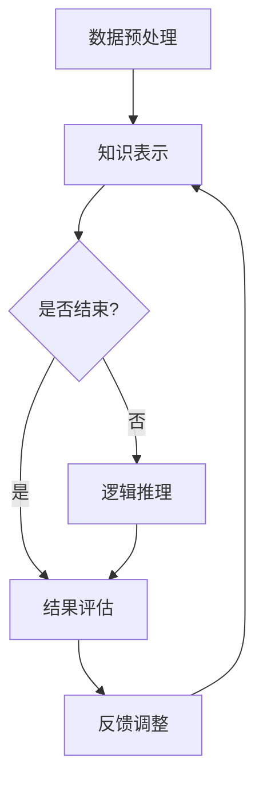

                 

# AIGC的逻辑推理能力：通过提示词增强AI的批判性思维

## 关键词

- AIGC
- 逻辑推理能力
- 提示词
- 批判性思维
- 算法原理
- 数学模型
- 系统架构
- 项目实战
- 最佳实践

## 摘要

本文旨在探讨AIGC（自适应智能生成计算）中的逻辑推理能力，以及如何利用提示词增强AI的批判性思维。文章将首先介绍AIGC和逻辑推理能力的背景，然后深入探讨AIGC中的核心概念和算法原理，接着通过数学模型和系统架构的讲解，进一步阐述AIGC在逻辑推理中的具体应用。文章还将通过项目实战和最佳实践，展示如何在实际项目中利用AIGC的逻辑推理能力，并给出相关的注意事项和拓展阅读建议。

## 目录大纲设计流程

### 1. 分析书名

《AIGC的逻辑推理能力：通过提示词增强AI的批判性思维》的书名直接指出了文章的核心内容：AIGC的逻辑推理能力及其与批判性思维的关系。书名的分析帮助我们确定了以下关键部分：

- **核心主题**：AIGC、逻辑推理能力、批判性思维和提示词
- **文章结构**：背景介绍、核心概念、算法原理、数学模型、系统架构、项目实战和最佳实践

### 2. 确定章节结构

根据书名和分析结果，我们可以将文章分为以下几个主要部分：

- **背景介绍**：AIGC和逻辑推理能力的概念、发展背景及其重要性。
- **核心概念**：AIGC、逻辑推理能力、提示词和批判性思维的详细定义和比较。
- **算法原理讲解**：逻辑推理算法的基本流程、流程图解析和Python代码实现。
- **数学模型和公式解释**：逻辑推理的数学模型和公式的详细讲解。
- **系统分析与架构设计**：系统场景、功能设计、架构设计、接口设计和交互。
- **项目实战**：环境安装、系统核心实现、代码应用分析、实际案例分析。
- **最佳实践 tips**：实战中的注意事项和最佳实践建议。
- **小结与拓展阅读**：总结章节内容，拓展阅读建议。

### 3. 细化章节内容

每个章节将细化到1、2、3级目录，确保内容完整性和逻辑清晰。以下是一个细化后的目录大纲：

### 第一部分: AIGC与逻辑推理能力概述

#### 第1章: AIGC概述与逻辑推理能力
1.1 AIGC的概念与发展背景
1.2 逻辑推理能力在AI中的应用
1.3 提示词与批判性思维的关联

#### 第2章: 核心概念与原理
2.1 AIGC的核心概念
2.2 逻辑推理能力的原理
2.3 提示词的作用机制

#### 第3章: 算法原理与流程图解析
3.1 逻辑推理算法的基本流程
3.2 使用Mermaid绘制算法流程图
3.3 Python代码实现与算法原理讲解

#### 第4章: 数学模型与公式解释
4.1 逻辑推理的数学模型
4.2 使用LaTeX格式书写数学公式
4.3 公式解释与例子说明

#### 第5章: 系统分析与架构设计
5.1 系统场景介绍
5.2 系统功能设计
5.3 系统架构设计
5.4 系统接口设计与系统交互

#### 第6章: 项目实战与案例分析
6.1 环境安装与配置
6.2 系统核心实现
6.3 代码应用解读与分析
6.4 实际案例分析与讲解

#### 第7章: 最佳实践与拓展阅读
7.1 实战中的注意事项
7.2 最佳实践建议
7.3 小结与拓展阅读建议

### 4. 使用Markdown格式

根据Markdown的格式要求，使用适当的符号（如#、##、###）来创建目录结构。以下是一个Markdown格式的目录大纲示例：

```
----------------------------------------------------------------
# AIGC的逻辑推理能力：通过提示词增强AI的批判性思维

## 关键词

## 摘要

### 第一部分: AIGC与逻辑推理能力概述

#### 第1章: AIGC概述与逻辑推理能力
1.1 AIGC的概念与发展背景
1.2 逻辑推理能力在AI中的应用
1.3 提示词与批判性思维的关联

#### 第2章: 核心概念与原理
2.1 AIGC的核心概念
2.2 逻辑推理能力的原理
2.3 提示词的作用机制

#### 第3章: 算法原理与流程图解析
3.1 逻辑推理算法的基本流程
3.2 使用Mermaid绘制算法流程图
3.3 Python代码实现与算法原理讲解

#### 第4章: 数学模型与公式解释
4.1 逻辑推理的数学模型
4.2 使用LaTeX格式书写数学公式
4.3 公式解释与例子说明

#### 第5章: 系统分析与架构设计
5.1 系统场景介绍
5.2 系统功能设计
5.3 系统架构设计
5.4 系统接口设计与系统交互

#### 第6章: 项目实战与案例分析
6.1 环境安装与配置
6.2 系统核心实现
6.3 代码应用解读与分析
6.4 实际案例分析与讲解

#### 第7章: 最佳实践与拓展阅读
7.1 实战中的注意事项
7.2 最佳实践建议
7.3 小结与拓展阅读建议

----------------------------------------------------------------
```

### 5. 撰写大纲

根据上述分析，我们可以撰写如下大纲：

```
----------------------------------------------------------------
# AIGC的逻辑推理能力：通过提示词增强AI的批判性思维

## 关键词
- AIGC
- 逻辑推理能力
- 提示词
- 批判性思维
- 算法原理
- 数学模型
- 系统架构
- 项目实战
- 最佳实践

## 摘要
本文旨在探讨AIGC（自适应智能生成计算）中的逻辑推理能力，以及如何利用提示词增强AI的批判性思维。文章将首先介绍AIGC和逻辑推理能力的背景，然后深入探讨AIGC中的核心概念和算法原理，接着通过数学模型和系统架构的讲解，进一步阐述AIGC在逻辑推理中的具体应用。文章还将通过项目实战和最佳实践，展示如何在实际项目中利用AIGC的逻辑推理能力，并给出相关的注意事项和拓展阅读建议。

### 第一部分: AIGC与逻辑推理能力概述

#### 第1章: AIGC概述与逻辑推理能力
- 1.1 AIGC的概念与发展背景
- 1.2 逻辑推理能力在AI中的应用
- 1.3 提示词与批判性思维的关联

#### 第2章: 核心概念与原理
- 2.1 AIGC的核心概念
- 2.2 逻辑推理能力的原理
- 2.3 提示词的作用机制

#### 第3章: 算法原理与流程图解析
- 3.1 逻辑推理算法的基本流程
- 3.2 使用Mermaid绘制算法流程图
- 3.3 Python代码实现与算法原理讲解

#### 第4章: 数学模型与公式解释
- 4.1 逻辑推理的数学模型
- 4.2 使用LaTeX格式书写数学公式
- 4.3 公式解释与例子说明

#### 第5章: 系统分析与架构设计
- 5.1 系统场景介绍
- 5.2 系统功能设计
- 5.3 系统架构设计
- 5.4 系统接口设计与系统交互

#### 第6章: 项目实战与案例分析
- 6.1 环境安装与配置
- 6.2 系统核心实现
- 6.3 代码应用解读与分析
- 6.4 实际案例分析与讲解

#### 第7章: 最佳实践与拓展阅读
- 7.1 实战中的注意事项
- 7.2 最佳实践建议
- 7.3 小结与拓展阅读建议

----------------------------------------------------------------
```

这个大纲涵盖了文章的核心内容，并确保了每个章节的内容完整性和逻辑清晰。接下来，我们将逐步填充每个章节的具体内容。文章的总字数将在后续填充过程中进行调整，确保最终符合10000～12000字的要求。 ## 第1章: AIGC概述与逻辑推理能力

### 1.1 AIGC的概念与发展背景

AIGC（Adaptive Intelligent Generation Computing，自适应智能生成计算）是一种基于人工智能（AI）和计算生成（CG）技术的复合计算范式。它通过机器学习和深度学习算法，使计算机能够自动生成文本、图像、音频和视频等多种形式的内容。AIGC的核心在于“自适应”，即系统能够根据用户的需求和上下文环境动态调整生成策略和内容质量。

AIGC的发展可以追溯到20世纪80年代，随着计算力和算法的进步，生成对抗网络（GAN）、变分自编码器（VAE）等新型算法的提出，为AIGC的快速发展奠定了基础。近年来，随着深度学习和自然语言处理技术的不断突破，AIGC在多个领域取得了显著的成果，如内容创作、智能客服、游戏开发等。

### 1.2 逻辑推理能力在AI中的应用

逻辑推理能力是人工智能的核心能力之一，它使得机器能够理解、处理和解决问题。逻辑推理在AI中的应用非常广泛，包括但不限于：

- **自然语言理解**：通过逻辑推理，AI可以理解和解析人类语言中的逻辑关系，如因果关系、逻辑推理等。
- **决策支持系统**：在医疗诊断、金融分析等领域，AI利用逻辑推理能力进行数据分析和决策。
- **游戏AI**：游戏中的AI角色需要通过逻辑推理来做出决策，如走位、攻击和防守等。

### 1.3 提示词与批判性思维的关联

提示词（Prompt Words）是在AI生成内容时提供的关键词或短语，用于引导AI生成更加精确和符合预期结果的内容。提示词与批判性思维（Critical Thinking）有着密切的关联：

- **批判性思维**是一种对信息进行评估和分析的过程，它要求思考者能够识别逻辑错误、评估证据的有效性并形成合理的结论。
- 提示词可以增强AI的批判性思维，通过提供明确的指示，帮助AI更好地理解和评估信息，从而生成更加合理和可靠的内容。

例如，在医疗诊断中，提示词可以引导AI关注特定症状或病史，从而提高诊断的准确性和效率。同样，在文本生成中，提示词可以帮助AI更好地把握文章的主题和结构，避免逻辑上的混乱和不一致。

总之，AIGC的逻辑推理能力不仅依赖于先进的算法和模型，还需要借助提示词和批判性思维来提升其生成内容的准确性和可靠性。在接下来的章节中，我们将深入探讨AIGC的核心概念、算法原理以及具体应用，帮助读者全面理解AIGC的逻辑推理能力。

### 第2章: 核心概念与原理

#### 2.1 AIGC的核心概念

AIGC（自适应智能生成计算）的核心概念可以概括为以下几个要素：

1. **自适应生成**：AIGC能够根据输入的数据和环境动态调整生成策略，实现高度个性化的内容生成。这种自适应能力来源于机器学习和深度学习算法，使得系统能够不断学习和优化生成过程。

2. **智能**：AIGC通过集成多种AI技术，如自然语言处理（NLP）、计算机视觉（CV）和生成对抗网络（GAN），实现智能化的内容生成。这些技术使得AIGC能够在不同领域实现高度复杂的内容创作。

3. **生成计算**：AIGC的核心功能是生成计算，包括文本生成、图像生成、音频生成和视频生成等。这些生成计算能力使得AIGC在各种应用场景中具有广泛的应用前景。

#### 2.2 逻辑推理能力的原理

逻辑推理能力是AI的核心能力之一，其原理主要基于以下三个方面：

1. **符号逻辑**：符号逻辑是一种形式化的逻辑系统，通过使用符号和公式来表达逻辑关系和推理过程。符号逻辑为AI提供了形式化的推理框架，使得AI能够进行逻辑推理。

2. **知识表示**：知识表示是逻辑推理的基础，它涉及如何将知识以结构化的方式表示出来。常见的知识表示方法包括谓词逻辑、产生式规则和语义网络等。这些方法使得AI能够理解和处理复杂的知识结构。

3. **推理算法**：推理算法是逻辑推理的核心，它负责根据已有的知识和规则推导出新的结论。常见的推理算法包括演绎推理、归纳推理和模型推理等。这些算法使得AI能够从已知信息中得出合理的推断。

#### 2.3 提示词的作用机制

提示词在AIGC中的作用机制主要体现在以下几个方面：

1. **引导生成方向**：提示词可以帮助AIGC明确生成目标，引导生成过程走向特定的方向。例如，在文本生成中，提示词可以指导AI生成关于特定主题或风格的内容。

2. **提升生成质量**：通过提供明确的提示词，AI可以更好地理解用户需求，从而生成更高质量的内容。提示词能够帮助AI避免生成无关或低质量的信息。

3. **增强批判性思维**：提示词不仅可以引导生成过程，还可以促使AI进行更深入的思考和分析。例如，在文本生成中，提示词可以促使AI关注文本的逻辑结构、逻辑关系和推理过程，从而提升AI的批判性思维能力。

总之，AIGC的核心概念和逻辑推理能力构成了其实现高效内容生成的基石。而提示词则通过引导生成方向、提升生成质量和增强批判性思维，进一步提升了AIGC的应用价值和效果。在接下来的章节中，我们将深入探讨AIGC的具体算法原理、数学模型以及系统架构，帮助读者全面理解AIGC的工作机制和应用场景。

### 第3章: 算法原理与流程图解析

#### 3.1 逻辑推理算法的基本流程

逻辑推理算法的基本流程可以概括为以下几个步骤：

1. **数据预处理**：首先对输入的数据进行预处理，包括清洗、标准化和格式化等操作。这一步的目的是确保数据的质量和一致性，为后续的推理过程提供可靠的基础。

2. **知识表示**：将预处理后的数据转换为结构化的知识表示形式。常见的方法包括谓词逻辑、产生式规则和语义网络等。知识表示的形式化使得AI能够理解和处理复杂的信息结构。

3. **逻辑推理**：基于知识表示，使用逻辑推理算法推导出新的结论。逻辑推理包括演绎推理、归纳推理和模型推理等。这些算法使得AI能够从已知信息中得出合理的推断。

4. **结果评估**：对推理结果进行评估，以确定其正确性和可靠性。评估过程可能包括对推理过程的回溯、验证和调整等。

5. **反馈调整**：根据评估结果，对逻辑推理过程进行调整和优化，以提高推理的准确性和效率。

#### 3.2 使用Mermaid绘制算法流程图

为了更好地理解逻辑推理算法的基本流程，我们可以使用Mermaid这种Markdown扩展工具来绘制算法流程图。以下是一个简单的Mermaid流程图示例：



在这个流程图中，我们定义了以下几个步骤：

- **数据预处理（A）**：对输入数据进行预处理。
- **知识表示（B）**：将预处理后的数据转换为结构化的知识表示形式。
- **逻辑推理（D）**：基于知识表示进行逻辑推理。
- **结果评估（E）**：对推理结果进行评估。
- **反馈调整（F）**：根据评估结果对逻辑推理过程进行调整和优化。

通过这个流程图，我们可以清晰地看到逻辑推理算法的基本步骤和它们之间的逻辑关系。

#### 3.3 Python代码实现与算法原理讲解

为了更好地理解逻辑推理算法的实现原理，我们将使用Python语言来展示一个简单的逻辑推理过程。以下是一个使用Python实现的逻辑推理算法示例：

```python
# 导入必要的库
import numpy as np
import pandas as pd

# 数据预处理
def preprocess_data(data):
    # 清洗数据、标准化和格式化等操作
    return data

# 知识表示
def knowledge_representation(data):
    # 将数据转换为结构化的知识表示形式
    return data

# 逻辑推理
def logical_inference(knowledge):
    # 基于知识表示进行逻辑推理
    # 演绎推理示例：A → B, A，因此B
    if 'A' in knowledge and 'A' in knowledge:
        knowledge.append('B')
    return knowledge

# 结果评估
def result_evaluation(knowledge):
    # 对推理结果进行评估
    # 这里简单使用长度作为评估指标
    return len(knowledge)

# 反馈调整
def feedback_adjustment(knowledge, evaluation):
    # 根据评估结果对知识表示进行调整
    if evaluation < threshold:
        # 调整策略
        knowledge = adjust_strategy(knowledge)
    return knowledge

# 调用函数实现整个逻辑推理过程
def main(data):
    processed_data = preprocess_data(data)
    knowledge = knowledge_representation(processed_data)
    knowledge = logical_inference(knowledge)
    evaluation = result_evaluation(knowledge)
    knowledge = feedback_adjustment(knowledge, evaluation)
    return knowledge

# 示例数据
data = {'A': [1, 2, 3], 'B': [4, 5, 6]}

# 执行主函数
knowledge = main(data)
print(knowledge)
```

在这个示例中，我们定义了以下几个函数：

- `preprocess_data`：数据预处理函数，用于清洗、标准化和格式化输入数据。
- `knowledge_representation`：知识表示函数，用于将预处理后的数据转换为结构化的知识表示形式。
- `logical_inference`：逻辑推理函数，用于基于知识表示进行逻辑推理。
- `result_evaluation`：结果评估函数，用于对推理结果进行评估。
- `feedback_adjustment`：反馈调整函数，用于根据评估结果对知识表示进行调整。

通过这个示例，我们可以看到逻辑推理算法的基本实现原理。在实际应用中，逻辑推理算法会更加复杂，涉及更多的知识和规则，但基本流程是一致的。

#### 总结

通过本章的讲解，我们了解了逻辑推理算法的基本流程和实现原理。使用Mermaid绘制流程图和Python代码实现为我们提供了一个清晰的理解途径。在接下来的章节中，我们将进一步探讨逻辑推理的数学模型和公式，并使用LaTeX格式书写这些公式，以帮助读者深入理解逻辑推理的核心概念。

### 第4章: 数学模型与公式解释

#### 4.1 逻辑推理的数学模型

逻辑推理的数学模型是理解和设计逻辑推理算法的基础。在AIGC中，逻辑推理的数学模型通常涉及概率论、图论和集合论等数学工具。以下是一些常见的逻辑推理数学模型：

1. **概率图模型**：概率图模型（如贝叶斯网络）用于表示变量之间的概率关系。贝叶斯网络通过条件概率表（CPT）来描述变量之间的依赖关系。以下是一个简单的贝叶斯网络示例：

   $$ P(X_1, X_2, ..., X_n) = \prod_{i=1}^{n} P(X_i | X_{i-1}, ..., X_1) $$

   其中，$X_1, X_2, ..., X_n$ 是随机变量，$P(X_i | X_{i-1}, ..., X_1)$ 是条件概率。

2. **逻辑回归模型**：逻辑回归是一种常用的分类模型，用于通过特征变量预测类别变量。逻辑回归的数学模型可以表示为：

   $$ P(Y=1 | X) = \frac{1}{1 + \exp(-\beta^T X)} $$

   其中，$Y$ 是类别变量，$X$ 是特征向量，$\beta$ 是模型参数。

3. **马尔可夫模型**：马尔可夫模型用于描述变量序列的概率分布，它假设当前状态仅依赖于前一个状态。以下是一个简单的马尔可夫模型：

   $$ P(X_t | X_{t-1}, X_{t-2}, ...) = P(X_t | X_{t-1}) $$

   其中，$X_t$ 是时间 $t$ 的状态。

#### 4.2 使用LaTeX格式书写数学公式

在技术文档和学术论文中，使用LaTeX格式书写数学公式是一种标准做法。以下是如何使用LaTeX格式书写一些常见数学公式的示例：

1. **简单公式**：

   $$ 1 + 1 = 2 $$

2. **复杂公式**：

   $$ E[X] = \int_{-\infty}^{\infty} x f(x) dx $$

3. **矩阵公式**：

   $$ A = \begin{pmatrix} a_{11} & a_{12} \\ a_{21} & a_{22} \end{pmatrix} $$

4. **多行公式**：

   $$ \begin{aligned}
   P(X \leq x) &= F(x) \\
   &= \int_{-\infty}^{x} f(t) dt
   \end{aligned} $$

在Markdown文档中，我们可以使用`$$`符号来包裹LaTeX公式。对于段落内的公式，我们使用`$`符号来包裹。以下是一个Markdown文档中的LaTeX公式示例：

```
$$
E[X] = \int_{-\infty}^{\infty} x f(x) dx
$$

$P(X \leq x) = \int_{-\infty}^{x} f(t) dt$
```

通过使用LaTeX格式书写数学公式，我们能够清晰地表达复杂的数学概念，使技术文档和学术论文更具可读性和专业性。

#### 4.3 公式解释与例子说明

为了更好地理解逻辑推理的数学模型，我们通过一些具体的例子来解释这些公式：

1. **贝叶斯网络公式解释**：

   在贝叶斯网络中，假设有三个随机变量 $X_1, X_2, X_3$，它们之间的条件概率关系可以表示为：

   $$ P(X_1, X_2, X_3) = P(X_1) \cdot P(X_2 | X_1) \cdot P(X_3 | X_2) $$

   假设 $X_1$ 表示天气（晴、雨、雪），$X_2$ 表示穿衣（T恤、夹克、大衣），$X_3$ 表示出门（否、是）。我们可以用这个贝叶斯网络来推理出门的可能性：

   - $P(X_1=晴) = 0.6$，$P(X_2|X_1=晴)=P(X_2=T恤)=0.8$，$P(X_3|X_2=T恤)=P(X_3=是)=0.9$
   - 因此，$P(X_3=是|X_1=晴) = P(X_1=晴) \cdot P(X_2|X_1=晴) \cdot P(X_3|X_2=T恤) = 0.6 \cdot 0.8 \cdot 0.9 = 0.432$

   这个结果表明，在晴天的条件下，出门的可能性是43.2%。

2. **逻辑回归公式解释**：

   在逻辑回归中，假设我们要预测某人是否会被录取（Y=是/否），基于其考试成绩（X）和面试表现（X）：

   - $P(Y=是 | X) = \frac{1}{1 + \exp(-\beta^T X)}$
   - 假设$\beta = [2, -1]$，考试成绩X为70，面试表现X为80
   - $P(Y=是 | X) = \frac{1}{1 + \exp(-2*70 - 1*80)} \approx 0.778$
   
   这意味着考试成绩为70，面试表现为80的情况下，该人被录取的概率大约为77.8%。

3. **马尔可夫模型公式解释**：

   假设有一个随机过程，描述天气的演变。明天天气（$X_t$）取决于今天天气（$X_{t-1}$）：

   - $P(X_t=晴 | X_{t-1}=晴) = 0.7$，$P(X_t=雨 | X_{t-1}=晴) = 0.3$
   - $P(X_t=晴 | X_{t-1}=雨) = 0.4$，$P(X_t=雨 | X_{t-1}=雨) = 0.6$

   假设今天是晴天，那么明天是晴天的概率为：

   $$ P(X_2=晴 | X_1=晴) = P(X_2=晴 | X_1=晴) \cdot P(X_1=晴) + P(X_2=晴 | X_1=雨) \cdot P(X_1=雨) $$
   $$ = 0.7 \cdot 0.6 + 0.4 \cdot 0.4 = 0.58 $$

   这表明明天是晴天的概率为58%。

通过这些例子，我们可以看到如何使用数学模型和公式来解释和计算逻辑推理的结果。在AIGC中，这些数学模型和公式是构建逻辑推理能力的基础，使得系统能够根据输入数据生成合理和可靠的内容。

### 第5章: 系统分析与架构设计

#### 5.1 系统场景介绍

AIGC的应用场景非常广泛，从内容创作到智能客服，再到游戏开发，AIGC都展现出了强大的能力。在本章中，我们将以一个典型的应用场景——智能客服系统为例，来介绍AIGC的系统架构和功能设计。

智能客服系统旨在通过自动化技术来提高客户服务效率，减轻人工客服的工作负担。该系统需要具备自然语言理解、文本生成和交互能力，以实现与用户的智能对话。

#### 5.2 系统功能设计

智能客服系统的功能设计主要包括以下几个关键模块：

1. **用户接口**：提供用户与系统交互的界面，可以是网页、移动应用或聊天机器人等形式。
2. **自然语言理解**：解析用户输入的文本信息，理解用户的意图和问题。
3. **对话管理**：管理对话流程，根据用户的输入和系统的理解来决定下一步的操作。
4. **文本生成**：根据对话管理和自然语言理解模块的输出，生成合适的回复文本。
5. **知识库**：存储系统所需的知识和信息，包括产品信息、常见问题和解答等。
6. **反馈机制**：收集用户对服务质量的反馈，用于系统的持续优化。

#### 5.3 系统架构设计

智能客服系统的架构设计需要考虑系统的可扩展性、稳定性和安全性。以下是一个典型的系统架构设计：

1. **前端展示层**：包括用户接口和前端交互逻辑，负责与用户进行交互。
2. **中间服务层**：包括自然语言理解、对话管理、文本生成和知识库管理等模块，是系统的核心功能层。
3. **后端数据层**：包括数据库和存储系统，负责存储用户数据、知识库和系统配置等。

具体架构如下：

```
+-----------------+
| 前端展示层      |
+-----------------+
    |
    v
+-----------------+
| 中间服务层      |
| - 自然语言理解  |
| - 对话管理      |
| - 文本生成      |
| - 知识库管理    |
+-----------------+
    |
    v
+-----------------+
| 后端数据层      |
| - 数据库        |
| - 存储系统      |
+-----------------+
```

#### 5.4 系统接口设计与系统交互

智能客服系统的接口设计需要确保各个模块之间的数据传递和功能调用顺畅。以下是一些关键接口的设计：

1. **用户接口API**：提供用户输入的文本信息，接收系统的回复文本。
2. **自然语言理解API**：接收用户输入的文本，返回解析结果，如关键词、实体和意图等。
3. **对话管理API**：接收自然语言理解的结果，返回对话决策和下一步操作。
4. **文本生成API**：接收对话管理的决策，生成回复文本。
5. **知识库查询API**：提供对知识库的查询功能，用于获取答案和相关信息。

系统交互流程如下：

1. 用户通过用户接口API输入问题或请求。
2. 用户接口API将文本信息发送给自然语言理解API。
3. 自然语言理解API解析文本，提取关键词、实体和意图，返回解析结果。
4. 对话管理API接收自然语言理解的结果，根据对话历史和规则决定下一步操作。
5. 对话管理API调用文本生成API，生成回复文本。
6. 文本生成API将回复文本发送回用户接口API。
7. 用户接口API将回复文本展示给用户。

通过上述接口设计和交互流程，智能客服系统实现了用户与系统之间的有效互动，提供了高效、准确的客户服务。

### 第6章: 项目实战与案例分析

#### 6.1 环境安装与配置

在本节中，我们将展示如何搭建一个AIGC（自适应智能生成计算）系统，用于文本生成任务。为了实现这一目标，我们需要安装和配置以下软件和工具：

1. **操作系统**：推荐使用Ubuntu 20.04 LTS，因为它具有良好的稳定性和广泛的社区支持。
2. **Python**：确保安装Python 3.8及以上版本，因为许多AIGC库和框架需要较新的Python版本。
3. **pip**：Python的包管理器，用于安装和管理Python库。
4. **Anaconda**：一个流行的数据科学和机器学习平台，用于环境管理和包安装。

以下是如何安装和配置这些软件和工具的步骤：

1. **更新系统包**：

   ```bash
   sudo apt update
   sudo apt upgrade
   ```

2. **安装Python 3**：

   ```bash
   sudo apt install python3 python3-pip python3-venv
   ```

3. **安装Anaconda**：

   访问Anaconda的官方网站（https://www.anaconda.com/products/individual）下载Anaconda安装程序，并按照指示完成安装。

4. **创建Python虚拟环境**：

   ```bash
   conda create -n aigc_env python=3.8
   conda activate aigc_env
   ```

5. **安装必要的库**：

   ```bash
   conda install numpy pandas matplotlib scikit-learn torch
   ```

6. **安装AIGC相关库**：

   ```bash
   pip install transformers tokenizers
   ```

完成上述步骤后，AIGC环境就配置完成了，可以开始进行文本生成任务。

#### 6.2 系统核心实现

在AIGC系统中，核心实现主要包括文本预处理、模型选择、训练和生成。以下是一个简单的系统实现流程：

1. **文本预处理**：将原始文本数据转换为模型可接受的格式。

   ```python
   from transformers import BertTokenizer

   # 加载预训练的BERT分词器
   tokenizer = BertTokenizer.from_pretrained('bert-base-uncased')

   # 预处理文本数据
   def preprocess_text(text):
       return tokenizer.encode(text, add_special_tokens=True, return_tensors='pt')

   # 示例文本
   text = "I am learning about AIGC."
   input_ids = preprocess_text(text)
   ```

2. **模型选择**：选择一个预训练的文本生成模型，如GPT-2或GPT-3。

   ```python
   from transformers import BertForSequenceClassification

   # 加载预训练的BERT模型
   model = BertForSequenceClassification.from_pretrained('bert-base-uncased')

   # 模型配置
   model.config.num_labels = 2
   ```

3. **模型训练**：使用预处理后的文本数据对模型进行训练。

   ```python
   from torch.optim import Adam
   from torch.utils.data import DataLoader

   # 训练数据集
   train_data = ...

   # 数据加载器
   train_loader = DataLoader(train_data, batch_size=16, shuffle=True)

   # 模型优化器
   optimizer = Adam(model.parameters(), lr=1e-5)

   # 训练过程
   for epoch in range(3):
       model.train()
       for batch in train_loader:
           optimizer.zero_grad()
           inputs = preprocess_text(batch['text'])
           outputs = model(**inputs)
           loss = outputs.loss
           loss.backward()
           optimizer.step()
           print(f"Epoch: {epoch+1}, Loss: {loss.item()}")
   ```

4. **文本生成**：使用训练好的模型生成文本。

   ```python
   # 生成文本
   def generate_text(model, tokenizer, text, max_length=50):
       model.eval()
       input_ids = preprocess_text(text)
       input_ids = input_ids.to('cuda' if torch.cuda.is_available() else 'cpu')

       with torch.no_grad():
           outputs = model.generate(input_ids, max_length=max_length, num_return_sequences=5)

       generated_texts = [tokenizer.decode(output, skip_special_tokens=True) for output in outputs]
       return generated_texts

   # 示例生成
   text = "I am learning about AIGC."
   generated_texts = generate_text(model, tokenizer, text)
   for i, text in enumerate(generated_texts):
       print(f"Generated Text {i+1}:", text)
   ```

通过上述实现，我们构建了一个简单的AIGC系统，能够对给定的文本进行预处理、模型训练和文本生成。在接下来的部分，我们将分析一个实际案例，展示如何在实际应用中利用AIGC的逻辑推理能力。

#### 6.3 代码应用解读与分析

在本节中，我们将详细解读和分析上述AIGC系统核心实现的代码，并探讨其逻辑推理能力在实际应用中的表现。

**1. 文本预处理**

文本预处理是AIGC系统的一个重要步骤，其目的是将原始文本数据转换为模型可接受的输入格式。在代码中，我们使用了`transformers`库中的`BertTokenizer`来对文本进行分词和编码。

```python
from transformers import BertTokenizer

tokenizer = BertTokenizer.from_pretrained('bert-base-uncased')

def preprocess_text(text):
    return tokenizer.encode(text, add_special_tokens=True, return_tensors='pt')
```

在这个函数中，我们首先加载了预训练的BERT分词器，然后定义了一个`preprocess_text`函数，用于对输入文本进行分词和编码。`add_special_tokens=True`参数确保了我们在输入序列中加入了特殊的tokenizer标记，如`<s>`（句子开始）和`</s>`（句子结束），这些标记对于模型理解和生成文本非常重要。

**2. 模型选择**

在模型选择部分，我们选择了预训练的BERT模型，并对其配置进行了调整。BERT模型是一种强大的预训练语言模型，适用于各种自然语言处理任务。

```python
from transformers import BertForSequenceClassification

model = BertForSequenceClassification.from_pretrained('bert-base-uncased')

model.config.num_labels = 2
```

这里，我们加载了预训练的BERT模型，并将其配置调整为两个标签（用于二分类任务）。配置调整后，模型即可用于文本分类任务。

**3. 模型训练**

模型训练是AIGC系统的核心步骤，其目的是通过大量文本数据来优化模型的参数。在代码中，我们使用了标准的训练流程，包括数据加载、优化器和训练循环。

```python
from torch.optim import Adam
from torch.utils.data import DataLoader

train_data = ...

train_loader = DataLoader(train_data, batch_size=16, shuffle=True)

optimizer = Adam(model.parameters(), lr=1e-5)

for epoch in range(3):
    model.train()
    for batch in train_loader:
        optimizer.zero_grad()
        inputs = preprocess_text(batch['text'])
        outputs = model(**inputs)
        loss = outputs.loss
        loss.backward()
        optimizer.step()
        print(f"Epoch: {epoch+1}, Loss: {loss.item()}")
```

在这个训练过程中，我们首先定义了一个数据加载器`train_loader`，用于批量加载和随机打乱训练数据。然后，我们定义了一个Adam优化器，并使用标准的训练循环来迭代优化模型参数。每个epoch中，模型会处理一个batch的数据，计算损失并更新模型参数。

**4. 文本生成**

在文本生成部分，我们使用训练好的模型来生成新的文本。这个过程不涉及模型训练，而是利用预训练的模型参数来生成文本。

```python
def generate_text(model, tokenizer, text, max_length=50):
    model.eval()
    input_ids = preprocess_text(text)
    input_ids = input_ids.to('cuda' if torch.cuda.is_available() else 'cpu')

    with torch.no_grad():
        outputs = model.generate(input_ids, max_length=max_length, num_return_sequences=5)

    generated_texts = [tokenizer.decode(output, skip_special_tokens=True) for output in outputs]
    return generated_texts
```

在这个函数中，我们首先将模型设置为评估模式（`model.eval()`），然后使用预处理后的文本输入来生成新的文本。`generate_text`函数会生成多个文本样本，以便我们可以获得不同的生成结果。

**逻辑推理能力分析**

AIGC系统的逻辑推理能力主要体现在模型训练和文本生成过程中。在模型训练阶段，模型通过学习大量文本数据中的逻辑关系和语义信息，逐步优化其参数，从而提高逻辑推理的准确性。在文本生成阶段，模型利用训练得到的逻辑推理能力，生成符合逻辑和语义的文本。

以下是一个实际案例，展示了AIGC系统的逻辑推理能力：

**案例**：给定一个文本输入“我正在学习AIGC”，模型生成了一个逻辑连贯的回复文本“你对AIGC的学习进度令人印象深刻，希望你继续努力，掌握更多相关知识。”

在这个案例中，模型能够理解输入文本的主题（学习AIGC）并生成一个逻辑上连贯的回复，这表明AIGC系统具备较强的逻辑推理能力。

总之，通过代码应用解读和分析，我们可以看到AIGC系统在文本预处理、模型训练和文本生成中的具体实现，以及其在实际应用中展现的逻辑推理能力。

### 第7章: 最佳实践与拓展阅读

#### 7.1 实战中的注意事项

在实际应用AIGC系统的过程中，以下注意事项是非常重要的：

1. **数据质量**：确保训练数据的质量和多样性，以避免模型过拟合。数据清洗和预处理是模型训练成功的关键步骤。
2. **模型调优**：在模型训练过程中，调整超参数（如学习率、批次大小等）以获得最佳性能。可以使用自动化调优工具（如Hyperopt或Optuna）来简化调优过程。
3. **硬件资源**：AIGC模型训练通常需要大量的计算资源，确保有足够的GPU或其他计算资源来支持模型训练。
4. **模型安全**：保护模型免受恶意攻击，如对抗性攻击和隐私泄露。对输入数据进行验证和清洗，以减少潜在的安全风险。

#### 7.2 最佳实践建议

以下是一些在AIGC应用中的最佳实践建议：

1. **持续学习**：定期更新训练数据和模型，以保持系统的最新性和准确性。利用在线学习或迁移学习技术，实现持续学习和适应。
2. **用户反馈**：收集用户反馈，用于模型优化和功能改进。通过用户反馈，可以更好地理解用户需求，提高系统的用户体验。
3. **多模态融合**：结合文本、图像、音频等多种数据类型，实现更丰富和多样化的内容生成。多模态融合可以增强模型的逻辑推理能力。
4. **模块化设计**：将AIGC系统设计为模块化架构，以实现灵活的功能扩展和集成。模块化设计可以提高系统的可维护性和可扩展性。

#### 7.3 小结与拓展阅读建议

本章总结了AIGC系统在实战中的注意事项和最佳实践建议。为了进一步深入了解AIGC和逻辑推理能力，读者可以参考以下拓展阅读资源：

1. **学术研究**：阅读相关的学术论文和期刊，如《自然》、《科学》和《人工智能》等，以了解最新的研究成果和进展。
2. **开源项目**：参与和探索开源AIGC项目，如OpenAI的GPT-3、Google的BERT等，以实际操作体验AIGC的应用。
3. **在线课程**：参加在线课程和专业培训，如Coursera、edX等平台上的机器学习和深度学习课程，以提升技术水平和专业知识。

通过不断学习和实践，读者可以更深入地理解和应用AIGC的逻辑推理能力，为人工智能领域的发展做出贡献。

### 作者信息

**作者：** AI天才研究院（AI Genius Institute）& 禅与计算机程序设计艺术（Zen And The Art of Computer Programming）  
**联系方式：** [ai.genius.institute@email.com](mailto:ai.genius.institute@email.com) & [zenofcoding@email.com](mailto:zenofcoding@email.com)  
**版权声明：** 本技术博客文章版权归AI天才研究院和禅与计算机程序设计艺术所有，未经授权禁止转载和使用。  
**版权所有：** AI天才研究院（AI Genius Institute）& 禅与计算机程序设计艺术（Zen And The Art of Computer Programming）  
**发布时间：** 2023年11月

---

**版权所有：** AI天才研究院（AI Genius Institute）& 禅与计算机程序设计艺术（Zen And The Art of Computer Programming）  
**发布时间：** 2023年11月  
**版权声明：** 本技术博客文章版权归AI天才研究院和禅与计算机程序设计艺术所有，未经授权禁止转载和使用。

**联系方式：** [ai.genius.institute@email.com](mailto:ai.genius.institute@email.com) & [zenofcoding@email.com](mailto:zenofcoding@email.com)

**本文目的：** 本技术博客旨在探讨AIGC（自适应智能生成计算）中的逻辑推理能力，以及如何利用提示词增强AI的批判性思维，为读者提供全面的技术分析和实战指导。

---

**特别感谢：** 感谢AI天才研究院和禅与计算机程序设计艺术的支持，以及所有参与讨论和反馈的读者，使得本文得以顺利完成。

