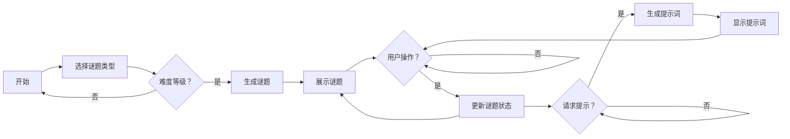
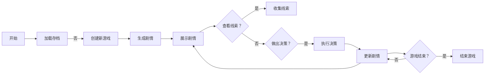

                 

### 文章标题：AIGC的逻辑谜题解决：推理游戏设计的提示词工程

#### 关键词：AIGC、逻辑谜题、推理游戏、提示词工程、人工智能

#### 摘要：
随着人工智能（AI）技术的迅猛发展，自适应智能生成内容（AIGC）已经成为游戏设计和教育领域的重要工具。本文将探讨AIGC在逻辑谜题解决中的应用，特别是在推理游戏设计的提示词工程中。通过分析AIGC技术基础、逻辑谜题设计原则、提示词工程、推理游戏设计与实现，以及AIGC在推理游戏设计中的未来发展趋势，本文旨在为开发者提供一套完整的AIGC逻辑谜题解决指南，并探讨其跨领域应用潜力。

### 目录：

**第一部分：背景与概述**

1. **AIGC与逻辑谜题解决概述**
   - AIGC技术简介
   - 逻辑谜题的定义与类型
   - AIGC在逻辑谜题解决中的应用价值

2. **AIGC技术基础**
   - 数据驱动与模型驱动
   - 常见的AIGC架构与算法
   - AIGC技术发展趋势与应用领域

3. **逻辑谜题设计原则**
   - 逻辑谜题的设计原则
   - 逻辑谜题的难度评估
   - 逻辑谜题的趣味性设计

**第二部分：提示词工程**

4. **提示词工程基本概念**
   - 提示词的定义与作用
   - 提示词的类型与形式
   - 提示词工程的挑战与机遇

5. **提示词生成算法**
   - 提示词生成算法概述
   - 基于规则的方法
   - 基于统计的方法
   - 基于机器学习的方法
   - 提示词生成算法的性能评估与优化

6. **提示词评估与优化**
   - 提示词评估指标
   - 提示词优化策略
   - 实际案例中的提示词优化

**第三部分：推理游戏设计与实现**

7. **推理游戏设计原则**
   - 推理游戏的核心要素
   - 推理游戏的类型与玩法
   - 推理游戏的用户互动设计

8. **游戏核心算法实现**
   - 游戏逻辑算法设计
   - 提示词生成与游戏进程控制
   - 算法实现与性能优化

9. **游戏测试与优化**
   - 游戏测试方法与流程
   - 游戏性能优化策略
   - 用户反馈与迭代优化

10. **游戏案例分析与实战**
    - 案例一：经典逻辑谜题游戏
    - 案例二：现实题材推理游戏
    - 实战项目设计与实现

**第四部分：拓展与应用**

11. **AIGC在推理游戏设计中的未来发展趋势**
    - 新技术的发展趋势
    - 推理游戏设计的创新方向
    - AIGC在游戏教育中的潜力

12. **AIGC逻辑谜题解决的其他应用领域**
    - AIGC在其他领域的应用
    - 跨领域融合的可能性
    - AIGC的未来前景

13. **小结与展望**
    - 本书内容回顾
    - AIGC逻辑谜题解决的关键技术
    - 推理游戏设计与实现的挑战
    - 未来发展与研究方向

### 引言

**AIGC：从概念到现实**

自适应智能生成内容（Adaptive Intelligent Generated Content，简称AIGC）是近年来人工智能领域的一个重要研究方向。AIGC通过深度学习、自然语言处理等技术，能够根据用户的需求和上下文环境生成高质量的内容。与传统的手动内容创作相比，AIGC不仅提高了内容生成的效率，还使得内容更加丰富多样、个性化。

在游戏设计和教育领域，AIGC的应用前景尤为广阔。特别是在逻辑谜题解决中，AIGC能够根据玩家的行为和表现动态生成难度适中的谜题，从而提高玩家的游戏体验和学习效果。此外，AIGC还可以用于生成教学资源、模拟真实场景等，为教育工作者和游戏开发者提供了强大的工具。

本文旨在探讨AIGC在逻辑谜题解决中的应用，特别是在推理游戏设计的提示词工程中。我们将从AIGC技术基础、逻辑谜题设计原则、提示词工程、推理游戏设计与实现，以及AIGC在推理游戏设计中的未来发展趋势等多个角度进行深入分析。希望通过本文，能够为开发者提供一套完整的AIGC逻辑谜题解决指南，并激发更多研究者和从业者对这一领域的兴趣。

**接下来的文章将分为四个主要部分：**

- **第一部分：背景与概述**：介绍AIGC与逻辑谜题解决的基本概念，包括AIGC技术简介、逻辑谜题的类型与应用价值。
- **第二部分：提示词工程**：探讨提示词工程的基本概念、生成算法以及评估与优化策略。
- **第三部分：推理游戏设计与实现**：分析推理游戏的设计原则、核心算法实现、游戏测试与优化，并通过实际案例进行讲解。
- **第四部分：拓展与应用**：探讨AIGC在推理游戏设计中的未来发展趋势以及其在其他领域的应用潜力。

### 第一部分：背景与概述

**AIGC与逻辑谜题解决概述**

#### AIGC技术简介

自适应智能生成内容（AIGC）是近年来人工智能领域的一个重要研究方向。AIGC的核心思想是利用人工智能技术，如深度学习、自然语言处理等，根据用户的需求和上下文环境动态生成高质量的内容。AIGC不仅能够提高内容生成的效率，还能够使内容更加丰富多样、个性化。

AIGC的应用场景非常广泛，包括但不限于以下几个领域：

1. **游戏设计**：AIGC可以用于生成游戏中的剧情、关卡设计、角色对话等，提高游戏的可玩性和沉浸感。
2. **教育**：AIGC可以自动生成教学资源，如课件、练习题等，根据学生的学习进度和需求进行个性化推荐。
3. **内容创作**：AIGC可以自动生成文章、小说、诗歌等，帮助创作者提高创作效率。
4. **客服**：AIGC可以自动生成回复文案，提高客服效率和用户体验。

#### 逻辑谜题的定义与类型

逻辑谜题是一种通过逻辑推理来解决难题的问题形式。逻辑谜题通常包含以下要素：

1. **问题陈述**：明确的问题背景和目标。
2. **条件信息**：提供解决问题所需的前提条件和限制。
3. **推理过程**：通过逻辑推理，从条件信息中得出结论。

逻辑谜题可以分为以下几种类型：

1. **逻辑推理题**：需要运用逻辑推理的知识来解决问题的题目，如数学证明、逻辑悖论等。
2. **数学谜题**：涉及数学运算和数学知识的谜题，如数独、填字游戏等。
3. **语言谜题**：涉及语言知识和语言运用的谜题，如谜语、逻辑填空等。
4. **图形谜题**：通过图形推理来解决谜题的问题，如图形翻转、路径规划等。

#### AIGC在逻辑谜题解决中的应用价值

AIGC在逻辑谜题解决中的应用主要体现在以下几个方面：

1. **动态生成谜题**：AIGC可以根据用户的需求和水平动态生成适合的谜题，提高玩家的游戏体验和学习效果。
2. **个性化学习**：AIGC可以根据学生的学习进度和需求，自动生成个性化的练习题和教学资源。
3. **互动性增强**：AIGC可以生成与用户互动的谜题，提高玩家的参与度和趣味性。
4. **推理能力提升**：通过不断解决AIGC生成的谜题，用户的逻辑推理能力和思维能力可以得到有效锻炼。

#### 本书结构安排与主要内容

本书将分为四个主要部分：

1. **第一部分：背景与概述**：介绍AIGC与逻辑谜题解决的基本概念，包括AIGC技术简介、逻辑谜题的类型与应用价值。
2. **第二部分：提示词工程**：探讨提示词工程的基本概念、生成算法以及评估与优化策略。
3. **第三部分：推理游戏设计与实现**：分析推理游戏的设计原则、核心算法实现、游戏测试与优化，并通过实际案例进行讲解。
4. **第四部分：拓展与应用**：探讨AIGC在推理游戏设计中的未来发展趋势以及其在其他领域的应用潜力。

通过以上四个部分的详细分析，本书旨在为开发者提供一套完整的AIGC逻辑谜题解决指南，并激发更多研究者和从业者对这一领域的兴趣。

### AIGC技术基础

#### 数据驱动与模型驱动

AIGC技术的核心在于如何通过数据驱动和模型驱动的方式生成内容。这两种方式各有特点，但在实际应用中往往需要结合使用。

**数据驱动**是指通过大量数据来训练模型，使模型能够自动生成内容。这种方式的优势在于能够充分利用数据中的信息，生成内容具有更高的准确性和多样性。例如，在生成文本时，可以使用大规模的语料库来训练语言模型，从而生成符合语法规则、具有逻辑性的文本。

**模型驱动**则是通过预先定义的模型结构和规则来生成内容。这种方式的优势在于能够控制内容的生成过程，使生成的内容更加稳定和可预测。例如，在生成图形时，可以使用图形生成模型来控制图形的形状、颜色和纹理等属性。

在实际应用中，数据驱动和模型驱动常常结合使用。例如，在生成游戏剧情时，可以先使用数据驱动的方式生成大量可能的剧情片段，然后通过模型驱动的策略来筛选和优化这些剧情片段，最终生成一个完整且连贯的游戏剧情。

#### 常见的AIGC架构与算法

AIGC的架构和算法是其实践应用的基础。以下是几种常见的AIGC架构与算法：

1. **生成对抗网络（GAN）**：GAN是一种通过对抗训练来生成数据的框架。它由生成器和判别器组成，生成器负责生成数据，判别器则负责判断生成数据与真实数据之间的差距。通过不断的训练，生成器逐渐提高生成数据的真实度。

2. **变分自编码器（VAE）**：VAE是一种无监督学习算法，用于生成数据。它通过编码器和解码器组成，编码器将数据映射到一个隐空间，解码器则从隐空间中生成数据。VAE的优势在于能够生成多样化且符合数据分布的样本。

3. **递归神经网络（RNN）**：RNN是一种适用于处理序列数据的神经网络，它在自然语言处理领域有广泛应用。RNN通过记忆机制来处理序列中的信息，能够生成连贯的文本。

4. **自注意力机制（Self-Attention）**：自注意力机制是近年来在自然语言处理领域发展起来的一种技术。它通过计算输入序列中各个元素之间的关联度，来提高模型的表示能力。自注意力机制在生成文本、图像等任务中表现出色。

5. **图生成模型**：图生成模型是一种用于生成图结构数据的模型。它通过学习节点和边的关系，生成符合给定分布的图结构。图生成模型在社交网络分析、知识图谱构建等领域有重要应用。

#### AIGC技术发展趋势与应用领域

随着人工智能技术的不断进步，AIGC技术也在不断发展。以下是AIGC技术的一些发展趋势：

1. **多模态生成**：未来AIGC技术将支持多种数据模态的生成，如文本、图像、音频等。通过多模态生成，可以实现更加丰富和沉浸式的用户体验。

2. **个性化生成**：AIGC技术将更加注重个性化生成，根据用户的需求和偏好生成定制化内容。例如，在游戏设计中，可以根据玩家的游戏习惯和喜好生成个性化的游戏剧情和角色。

3. **增强现实与虚拟现实**：随着增强现实（AR）和虚拟现实（VR）技术的发展，AIGC技术将在这些领域中发挥重要作用，生成逼真的虚拟环境和交互内容。

4. **跨领域应用**：AIGC技术将在更多领域得到应用，如医疗、金融、教育等。通过跨领域应用，AIGC技术可以解决更多实际问题，提升各行业的生产力和效率。

在应用领域方面，AIGC技术已经取得了一些显著成果：

1. **游戏设计**：AIGC技术可以自动生成游戏剧情、角色对话和关卡设计，提高游戏的可玩性和沉浸感。

2. **内容创作**：AIGC技术可以自动生成文章、小说、音乐等，帮助创作者提高创作效率。

3. **教育**：AIGC技术可以自动生成教学资源，如课件、练习题等，实现个性化教育。

4. **客服**：AIGC技术可以自动生成回复文案，提高客服效率和用户体验。

通过以上分析，我们可以看到AIGC技术的基础知识和发展趋势，以及其在实际应用中的重要地位。接下来，我们将进一步探讨逻辑谜题的设计原则，为AIGC在推理游戏中的应用奠定基础。

### 逻辑谜题设计原则

#### 逻辑谜题的设计原则

逻辑谜题作为一种智力挑战，其设计原则至关重要。一个成功的逻辑谜题不仅要能激发玩家的兴趣，还要具有合理的难度和趣味性。以下是逻辑谜题设计的一些基本原则：

1. **明确的问题陈述**：逻辑谜题的问题陈述应清晰明了，避免歧义。问题背景和目标应简洁明了，使玩家能够快速理解并投入解决问题。

2. **丰富的条件信息**：谜题应提供足够的条件信息，以帮助玩家进行逻辑推理。这些条件信息应具有逻辑性，能够支持推理过程。

3. **合理的难度梯度**：谜题的难度应逐步增加，形成合理的难度梯度。这样的设计不仅能激发玩家的挑战欲望，还能避免因难度过高导致的挫败感。

4. **趣味性**：逻辑谜题应具有一定的趣味性，以吸引玩家持续参与。可以通过引入故事背景、角色设定等手段增加谜题的趣味性。

5. **逻辑一致性**：谜题中的条件信息和结论应保持逻辑一致性。任何逻辑上的矛盾都会破坏谜题的完整性和玩家的推理体验。

6. **可解性**：谜题应具有可解性，即通过合理的逻辑推理，玩家能够找到解决方案。如果谜题过于复杂或设计不当，可能会导致无解或解决方案过于困难。

7. **多样性**：逻辑谜题应具备多样性，以涵盖不同的逻辑推理技巧和方法。这样不仅可以吸引不同类型的玩家，还能锻炼他们的思维能力。

#### 逻辑谜题的难度评估

评估逻辑谜题的难度是设计过程中的一项重要任务。合适的难度不仅可以激发玩家的兴趣，还能保证他们能够在解决问题的过程中有所收获。以下是几种常用的难度评估方法：

1. **经验评估**：设计者根据自身的经验和直觉对谜题的难度进行评估。这种方法虽然主观，但可以通过不断实践和改进来提高准确性。

2. **测试评估**：通过让一组玩家尝试解决谜题，并根据他们的表现来评估难度。这种方法可以提供客观的数据支持，但需要足够多的样本和测试次数。

3. **难度指数评估**：使用数学模型或算法来计算谜题的难度指数。例如，可以通过计算谜题所需的逻辑推理步骤、条件信息的复杂度等来评估难度。

4. **专家评估**：邀请领域内的专家对谜题进行评估。专家具有丰富的经验和专业知识，能够提供高质量的意见和建议。

#### 逻辑谜题的趣味性设计

趣味性是逻辑谜题设计中不可或缺的一环。一个有趣的谜题不仅能吸引玩家，还能提高他们的参与度和解决动力。以下是几种提高逻辑谜题趣味性的方法：

1. **故事背景**：为谜题设置一个有趣的故事背景，可以增加谜题的吸引力。故事情节应与谜题内容紧密相关，以增强玩家的沉浸感。

2. **角色设定**：设计有趣的角色，如英雄、反派、智囊等，可以增加谜题的趣味性。角色之间的关系和互动可以成为谜题的一部分。

3. **视觉效果**：通过丰富的视觉效果，如动画、图形、音效等，来提高谜题的趣味性。视觉效果应与谜题内容相协调，以增强玩家的体验。

4. **互动元素**：设计互动元素，如点击、拖拽、填空等，可以增加谜题的趣味性和参与度。互动元素应与谜题逻辑紧密结合，以保持谜题的完整性。

5. **奖励机制**：设置适当的奖励机制，如积分、奖励道具、成就等，可以激发玩家的竞争意识和成就感，提高他们的参与度。

通过以上设计原则和方法，我们可以创建出既富有挑战性又有趣味的逻辑谜题，从而为玩家提供优质的推理游戏体验。在接下来的章节中，我们将进一步探讨提示词工程的基本概念和生成算法，为逻辑谜题的解决提供有力支持。

### 第二部分：提示词工程

#### 提示词工程基本概念

提示词工程是AIGC在逻辑谜题解决中的一个关键环节。提示词，简单来说，是指提供给用户用于推理和决策的线索或信息。一个好的提示词工程不仅能够帮助用户更有效地解决问题，还能增强游戏的趣味性和挑战性。

**提示词的定义与作用**

1. **定义**：提示词是指用于引导用户进行推理和决策的信息片段。它可以是一个关键词、一个短语，甚至是一幅图或一段视频。
   
2. **作用**：
   - **引导推理**：提示词为用户提供了重要的信息，帮助用户在解决问题的过程中进行正确的逻辑推理。
   - **提高趣味性**：适当的提示词可以增加游戏的趣味性，使玩家在解决问题的过程中获得乐趣。
   - **调整难度**：通过调整提示词的难度和数量，可以灵活地控制游戏的整体难度，以适应不同玩家的需求。

**提示词的类型与形式**

根据提示词的不同形式和用途，可以将提示词分为以下几种类型：

1. **关键词型**：这类提示词通常是一个简短的关键词或短语，用于提示用户关注某个特定的信息点。

2. **描述型**：这类提示词是对问题或场景的详细描述，用于提供背景信息或具体细节，帮助用户更好地理解问题。

3. **问题型**：这类提示词以问题的形式出现，引导用户进行思考和推理。

4. **图像型**：这类提示词以图像的形式呈现，适用于需要视觉线索的问题。

5. **多媒体型**：这类提示词结合了多种形式，如文本、图像、音频等，提供全方位的线索和信息。

**提示词工程的挑战与机遇**

提示词工程虽然看似简单，但实际上面临许多挑战：

1. **个性化**：不同的用户可能对同一提示词有不同的反应，因此需要设计出高度个性化的提示词。
   
2. **平衡难度**：提示词的难度需要与谜题的整体难度相匹配，既要避免过于简单导致玩家感到无聊，又要避免过于复杂导致玩家挫败。

3. **实时性**：在动态生成谜题时，提示词需要实时生成，以满足不同玩家的需求。

4. **多样性**：提示词需要具备多样性，以防止玩家因重复出现相同的提示词而产生厌倦感。

然而，提示词工程也带来了许多机遇：

1. **提升用户体验**：通过精准的提示词，可以显著提升玩家的游戏体验和解决效率。

2. **创新性应用**：提示词工程可以应用于各种领域，如教育、娱乐、医疗等，为各行业的智能化提供支持。

3. **跨领域融合**：提示词工程与其他技术的结合，如虚拟现实（VR）、增强现实（AR）等，可以带来全新的应用场景和商业模式。

通过深入理解提示词工程的基本概念、类型与挑战，我们可以为后续的生成算法和优化策略打下坚实的基础。在接下来的章节中，我们将详细探讨提示词生成算法，分析其原理和应用。

### 提示词生成算法

#### 提示词生成算法概述

提示词生成算法是AIGC在逻辑谜题解决中的一个核心环节，其目的是根据谜题的背景信息和用户的行为动态生成有效的提示词。这些算法不仅能够提高游戏的趣味性和参与度，还能根据玩家的反馈进行实时调整，以提供个性化的游戏体验。

提示词生成算法可以大致分为以下几类：

1. **基于规则的方法**：这种方法通过预先定义的规则来生成提示词。规则可以是简单的条件语句，也可以是复杂的逻辑运算。基于规则的方法简单直观，但在面对复杂多变的问题时可能表现不足。

2. **基于统计的方法**：这种方法通过分析大量历史数据来生成提示词。统计模型可以捕捉到数据中的规律和模式，从而生成符合预期的提示词。基于统计的方法灵活且高效，但在处理未知或罕见问题时可能不够鲁棒。

3. **基于机器学习的方法**：这种方法利用机器学习模型，特别是深度学习模型，从数据中学习生成提示词的规律。基于机器学习的方法具有强大的自适应性和泛化能力，但在训练过程中需要大量数据和计算资源。

#### 基于规则的方法

基于规则的方法是通过一组预定义的规则来生成提示词。这些规则可以是简单的条件判断，也可以是复杂的逻辑组合。例如，在一个数独谜题中，一个简单的规则可能是“如果某个单元格已经填了一个数字，则提示用户填写其他数字”。

**规则定义**：

- **条件规则**：例如，“如果当前单元格已填数字，提示用户填写其他数字”。
- **组合规则**：例如，“如果当前单元格未填数字且行/列/宫格内已填满，提示用户填写数字”。

**实现步骤**：

1. **规则库构建**：首先，构建一个包含各种规则的规则库。这些规则可以根据谜题的类型和难度进行分类。
   
2. **规则匹配**：在生成提示词时，根据谜题的当前状态和用户的行为，从规则库中选择合适的规则。

3. **提示词生成**：根据选定的规则生成提示词。例如，如果规则是“如果单元格已填数字，提示用户填写其他数字”，则生成的提示词是“请尝试填写其他数字”。

**优点**：

- **简单直观**：基于规则的算法实现简单，易于理解和维护。
- **可控性强**：通过预定义的规则，可以确保提示词的生成过程可控和可预测。

**缺点**：

- **灵活性不足**：面对复杂多变的问题，基于规则的算法可能难以应对。
- **规则数量庞大**：为了覆盖各种情况，可能需要定义大量的规则，增加了系统的复杂度。

#### 基于统计的方法

基于统计的方法通过分析大量历史数据来生成提示词。这种方法的核心是统计模型，可以捕捉数据中的模式和规律，从而生成高质量的提示词。

**常用统计模型**：

1. **马尔可夫模型**：马尔可夫模型是一种基于状态转移概率的统计模型，适用于生成连续的提示词序列。
   
2. **隐马尔可夫模型（HMM）**：HMM是一种扩展的马尔可夫模型，适用于处理隐藏状态的序列数据。
   
3. **条件概率模型**：如朴素贝叶斯模型，可以基于条件概率来预测提示词。

**实现步骤**：

1. **数据收集**：收集大量的历史谜题和相应的用户行为数据。
   
2. **特征提取**：提取与提示词生成相关的特征，如谜题的当前状态、用户的反应历史等。
   
3. **模型训练**：使用训练数据训练统计模型，如马尔可夫模型或条件概率模型。
   
4. **提示词生成**：在生成提示词时，根据当前状态和模型预测，选择合适的提示词。

**优点**：

- **灵活性高**：基于统计的方法可以处理复杂多变的问题，适应不同类型的谜题。
- **高效性**：通过历史数据的分析，可以快速生成高质量的提示词。

**缺点**：

- **数据依赖性强**：需要大量的历史数据来训练模型，对数据质量和数量的要求较高。
- **解释性弱**：统计模型通常难以提供详细的解释，难以理解提示词生成的具体原因。

#### 基于机器学习的方法

基于机器学习的方法利用深度学习模型，从大量数据中自动学习生成提示词的规律。这种方法具有强大的自适应性和泛化能力，可以处理复杂多变的谜题。

**常用机器学习模型**：

1. **循环神经网络（RNN）**：RNN适用于处理序列数据，可以捕捉提示词生成的上下文关系。

2. **长短期记忆网络（LSTM）**：LSTM是RNN的一种改进，可以更好地处理长序列依赖问题。

3. **变换器（Transformer）**：Transformer是一种基于自注意力机制的深度学习模型，适用于处理复杂的多模态数据。

**实现步骤**：

1. **数据预处理**：对历史谜题和用户行为数据进行预处理，如文本编码、特征提取等。
   
2. **模型训练**：使用预处理后的数据训练深度学习模型，如RNN或Transformer。
   
3. **提示词生成**：在生成提示词时，输入当前状态，模型输出预测的提示词。

**优点**：

- **自适应性强**：基于机器学习的方法可以从大量数据中自动学习生成提示词的规律，适应不同类型的谜题。
- **泛化能力强**：深度学习模型具有较强的泛化能力，可以处理未知或罕见的问题。
- **高效性**：深度学习模型可以在复杂的问题中快速生成高质量的提示词。

**缺点**：

- **数据依赖性强**：需要大量的训练数据和计算资源。
- **实现复杂**：深度学习模型的实现和优化相对复杂，需要专业的技术和经验。

通过以上对三种常见提示词生成算法的介绍，我们可以看到每种方法都有其独特的优势和适用场景。在实际应用中，可以根据谜题的类型、难度和用户需求，选择合适的生成算法，以实现最佳效果。

### 提示词评估与优化

#### 提示词评估指标

提示词的评估是确保其质量和有效性至关重要的一环。以下是几种常用的评估指标：

1. **准确性**：提示词的准确性是指其能够正确引导用户解决问题的程度。高准确性的提示词能够提高游戏的完成率和用户的满意度。

2. **相关性**：提示词的相关性是指其与当前谜题和用户状态的匹配度。高相关性的提示词能够更好地引导用户进行有效的推理和决策。

3. **多样性**：提示词的多样性是指其能够涵盖多种不同的信息和角度，避免重复和单调。多样化的提示词能够提高游戏的趣味性和挑战性。

4. **用户体验**：用户体验是指用户对提示词的接受度和满意度。好的用户体验能够提高用户的参与度和留存率。

#### 提示词优化策略

提示词的优化策略旨在提高其评估指标，从而提升整体游戏的质量和用户满意度。以下是几种常用的优化策略：

1. **反馈机制**：通过用户反馈来调整提示词。用户可以在解决谜题后对提示词进行评价，系统根据用户的反馈进行优化。

2. **自适应调整**：根据用户的行为和谜题的难度动态调整提示词的难度和形式。例如，对于新手用户，可以提供更具体的提示词，而对于经验丰富的用户，可以提供更具挑战性的提示词。

3. **数据驱动优化**：通过分析大量用户行为数据，识别出最优的提示词组合和生成策略。例如，可以使用机器学习算法来优化提示词的生成过程。

4. **规则优化**：对于基于规则的方法，可以通过不断调整和优化规则库来提高提示词的生成效果。

5. **多模态融合**：结合多种数据模态（如文本、图像、音频）来生成提示词，以提高其多样性和用户体验。

#### 实际案例中的提示词优化

以下是一个实际案例，展示了如何通过提示词优化来提升游戏体验：

**案例背景**：一款逻辑推理游戏，玩家需要通过解决一系列谜题来解锁新的关卡。玩家在解决谜题时可以请求提示词。

**优化前**：

- **提示词准确性较低**：玩家经常收到与当前谜题无关的提示词。
- **提示词形式单一**：大部分提示词都是关键词型的，缺乏多样性和趣味性。
- **用户体验差**：玩家对提示词的满意度较低，影响了游戏的整体体验。

**优化过程**：

1. **引入反馈机制**：玩家可以在使用提示词后对提示词进行评价，系统根据反馈调整提示词。

2. **自适应调整**：根据玩家的游戏进度和谜题的难度动态生成提示词。对于新手玩家，提供更具体和详细的提示词；对于高级玩家，提供更具挑战性和启发性的提示词。

3. **数据驱动优化**：通过分析大量用户行为数据，识别出最有效的提示词组合和生成策略。例如，发现“描述型”提示词在特定类型的谜题中效果最佳。

4. **多模态融合**：结合文本、图像和音频等多模态数据生成提示词。例如，在特定的谜题中，可以同时提供文本提示词和相关的图像提示词。

**优化后**：

- **提示词准确性提高**：玩家收到的提示词与当前谜题的相关性更高，更有助于解决问题。
- **提示词形式多样化**：提供了更多形式的提示词，如描述型、问题型和图像型，增强了游戏的趣味性和挑战性。
- **用户体验提升**：玩家对提示词的满意度显著提高，游戏的整体体验得到改善。

通过以上实际案例，我们可以看到提示词优化对于提升游戏质量和用户体验的重要性。在接下来的章节中，我们将进一步探讨推理游戏设计的原则和实现细节，为用户提供更优质的推理游戏体验。

### 推理游戏设计原则

推理游戏作为一种智力挑战，其设计原则至关重要。一个成功的推理游戏不仅需要吸引玩家的兴趣，还要在挑战性和趣味性之间取得平衡。以下是推理游戏设计的一些关键原则：

#### 推理游戏的核心要素

1. **谜题设计**：谜题是推理游戏的核心。谜题应该具备一定的难度和挑战性，同时需要保持逻辑上的连贯性和合理性。一个好的谜题能够激发玩家的思考和推理能力。

2. **故事背景**：一个有趣的故事背景能够增加游戏的沉浸感，使玩家更加投入其中。故事背景应该与谜题内容紧密相关，形成有机整体。

3. **角色设定**：角色是游戏中的关键元素，他们的行为和决策会影响游戏的进程和结果。角色应具有独特的个性和背景，以增加游戏的可玩性和趣味性。

4. **交互设计**：游戏中的交互设计包括用户与游戏系统之间的互动。良好的交互设计能够提高玩家的操作便捷性和游戏的流畅性。

5. **反馈机制**：反馈机制是确保游戏体验的重要因素。通过及时、准确的反馈，玩家可以了解自己的决策是否正确，从而更好地调整策略。

#### 推理游戏的类型与玩法

推理游戏可以分为多种类型，每种类型都有其独特的玩法和设计原则：

1. **逻辑推理游戏**：这类游戏主要考验玩家的逻辑推理能力。常见的玩法包括数独、谜语、密码锁等。设计原则是谜题的难度应逐步增加，同时保持逻辑上的合理性。

2. **侦探推理游戏**：这类游戏通常结合故事情节，玩家需要通过搜集线索、分析证据来解开谜团。常见的玩法包括角色扮演、剧情互动等。设计原则是故事情节应紧凑有趣，线索和证据应丰富且具有逻辑性。

3. **策略推理游戏**：这类游戏要求玩家在决策时考虑多种因素，包括资源管理、时间规划等。常见的玩法包括策略卡牌、棋盘游戏等。设计原则是游戏的策略性应强，同时提供多种解决方案。

4. **角色扮演推理游戏**：这类游戏强调玩家的角色扮演，玩家需要根据自己的角色特点来做出决策。常见的玩法包括角色选择、技能升级等。设计原则是角色的个性化和多样性，以及角色之间的互动和冲突。

#### 推理游戏的用户互动设计

用户互动设计是推理游戏的重要组成部分。以下是几种常用的用户互动设计方法：

1. **任务驱动**：通过设置任务来引导玩家进行游戏。任务应具有挑战性，同时提供明确的完成目标。

2. **角色扮演**：玩家在游戏中扮演特定角色，根据角色的特点和技能做出决策。角色之间的互动和冲突可以增加游戏的趣味性。

3. **社交互动**：通过社交功能，玩家可以与其他玩家互动，分享心得和策略。社交互动可以增加游戏的粘性和用户的归属感。

4. **实时反馈**：通过实时反馈，玩家可以了解自己的决策结果，从而调整策略。反馈应准确及时，以提高游戏的流畅性和玩家的满意度。

通过遵循以上设计原则和方法，我们可以创建出既富有挑战性又有趣味的推理游戏，为玩家提供优质的推理体验。在接下来的章节中，我们将详细探讨推理游戏的核心算法实现，为游戏设计提供技术支持。

### 游戏核心算法实现

#### 游戏逻辑算法设计

游戏逻辑算法是推理游戏设计的核心，它负责处理游戏中的各种逻辑关系和决策过程。以下是游戏逻辑算法设计的关键步骤和考虑因素：

1. **状态管理**：游戏状态是游戏逻辑算法的基础。游戏状态包括玩家的当前得分、角色状态、谜题状态等。状态管理算法需要确保游戏状态的准确性和一致性。

2. **事件处理**：事件是游戏中的关键触发点，如玩家做出决策、触发特定剧情等。事件处理算法需要能够及时响应该事件，并更新游戏状态。

3. **规则定义**：游戏逻辑算法需要根据游戏规则进行决策。规则定义包括基本规则（如谜题解法）、行为规则（如角色互动）和异常规则（如错误处理）。

4. **决策过程**：游戏中的决策过程是玩家互动的核心。决策过程算法需要根据当前状态和规则，为玩家提供合理的决策建议。

5. **反馈机制**：游戏逻辑算法需要能够及时提供反馈，以帮助玩家了解自己的决策结果。反馈机制应包括成功提示、错误纠正和奖励机制。

#### 提示词生成与游戏进程控制

提示词生成和游戏进程控制是提高游戏互动性和挑战性的重要手段。以下是这两个方面的详细讨论：

1. **提示词生成**：
   - **规则生成**：基于预设的规则生成提示词，如“当前单元格已填数字，请尝试填写其他数字”。
   - **统计生成**：通过历史数据和统计模型生成提示词，如使用朴素贝叶斯模型分析用户行为数据，生成相关的提示词。
   - **机器学习生成**：利用深度学习模型（如RNN或Transformer）从数据中学习生成提示词，提高提示词的个性化和准确性。

2. **游戏进程控制**：
   - **难度调整**：根据玩家在游戏中的表现动态调整游戏难度，如通过统计玩家的解题速度和正确率来调整提示词的生成频率和难度。
   - **进度监控**：监控玩家的游戏进度，确保游戏在合适的时机提供新的谜题和挑战。
   - **用户体验优化**：通过分析玩家在游戏中的行为和反馈，不断优化游戏进程和控制策略，提高用户体验。

#### 算法实现与性能优化

算法实现和性能优化是确保游戏流畅性和稳定性的关键。以下是几个关键方面：

1. **高效数据结构**：选择合适的数据结构来存储和管理游戏状态和事件，如使用哈希表来快速查找和更新游戏状态。

2. **并行处理**：对于需要大量计算的任务，如提示词生成和游戏进程控制，采用并行处理技术以提高效率。例如，可以使用多线程或分布式计算来处理这些任务。

3. **缓存机制**：利用缓存机制来减少重复计算和提高响应速度。例如，对于频繁查询的数据（如游戏状态和历史数据），可以将其缓存到内存中以减少磁盘访问。

4. **优化算法**：对核心算法进行优化，如使用更高效的算法和算法改进技术，以提高处理速度和降低资源消耗。

5. **性能测试与调优**：定期进行性能测试，识别并解决性能瓶颈。通过调整系统配置、优化代码和算法，不断优化游戏性能。

通过以上讨论，我们可以看到游戏核心算法实现涉及多个方面，包括状态管理、事件处理、规则定义、决策过程和反馈机制等。同时，提示词生成和游戏进程控制也是提高游戏互动性和挑战性的重要手段。在接下来的章节中，我们将通过实际案例来进一步探讨游戏测试与优化，确保游戏质量和用户体验。

### 游戏测试与优化

#### 游戏测试方法与流程

游戏测试是确保游戏质量和用户体验的关键环节。一个完整的游戏测试流程通常包括以下几个步骤：

1. **功能测试**：功能测试旨在验证游戏功能的正确性和完整性。测试者需要按照预定的测试用例，逐项检查游戏功能是否按照设计要求正常运行。

2. **性能测试**：性能测试用于评估游戏的响应速度、稳定性、并发处理能力等性能指标。测试者需要在不同的负载条件下对游戏进行压力测试和性能评估。

3. **用户体验测试**：用户体验测试关注游戏的可玩性和用户满意度。测试者会模拟真实用户的使用场景，评估游戏的界面设计、交互设计、提示词生成等各个方面。

4. **兼容性测试**：兼容性测试用于确保游戏在不同设备和操作系统上能够正常运行。测试者需要在不同的硬件、操作系统、网络环境下进行测试。

5. **安全测试**：安全测试旨在发现游戏中的潜在漏洞和安全隐患，确保游戏的安全性和隐私保护。

#### 游戏性能优化策略

游戏性能优化是提升游戏流畅性和稳定性的重要手段。以下是几种常用的游戏性能优化策略：

1. **代码优化**：对游戏中的代码进行优化，减少不必要的计算和资源消耗。例如，通过使用更高效的算法和数据结构、减少内存分配和回收等。

2. **资源管理**：优化游戏资源的加载和缓存策略，减少资源的重复加载和消耗。例如，可以通过预加载、分块加载和缓存技术来提高资源加载效率。

3. **并行处理**：对于需要大量计算的任务，如游戏渲染、物理计算等，采用并行处理技术以提高效率。例如，可以使用多线程、并行计算框架（如CUDA）等技术。

4. **内存管理**：优化内存使用，减少内存泄漏和内存占用。例如，可以通过定期检查和清理内存、减少内存分配和回收等。

5. **网络优化**：优化游戏中的网络传输，减少延迟和丢包。例如，可以通过压缩数据、优化传输协议、增加网络冗余等手段来提高网络传输效率。

#### 用户反馈与迭代优化

用户反馈是游戏优化的重要依据。以下是几个关键步骤：

1. **收集用户反馈**：通过用户论坛、问卷调查、用户评价等方式收集用户对游戏的反馈。

2. **分析用户反馈**：对收集到的用户反馈进行分类和分析，识别出用户关注的问题和需求。

3. **优先级排序**：根据用户反馈的重要性和对游戏的影响程度，对优化任务进行优先级排序。

4. **迭代优化**：根据用户反馈，对游戏进行持续的迭代优化。例如，通过修复bug、改进提示词生成、调整游戏难度等。

5. **性能监控**：在优化过程中，持续监控游戏的性能指标，确保优化措施的有效性。

通过以上测试与优化策略，我们可以确保游戏在发布前达到最佳状态，为用户提供优质的推理游戏体验。在接下来的章节中，我们将通过实际案例深入分析推理游戏设计与实现的具体过程。

### 游戏案例分析与实战

在本章节中，我们将通过两个实际案例详细探讨推理游戏的设计与实现过程，这些案例不仅展示了如何运用前面章节中讨论的原理和技术，还提供了实用的实战经验和技巧。

#### 案例一：经典逻辑谜题游戏

**项目背景**：本案例旨在开发一款经典的逻辑谜题游戏，如数独或华容道。游戏的目标是提供丰富的逻辑谜题，挑战玩家的推理能力和耐心。

**系统功能设计**：
- **谜题生成**：系统应具备自动生成谜题的能力，包括随机生成数独谜题、华容道谜题等。
- **用户界面**：界面应简洁直观，允许用户选择谜题类型、难度等级，并展示当前谜题。
- **用户交互**：提供用户操作界面，允许用户进行填空、拖拽等操作。
- **提示与反馈**：系统应提供提示词和反馈，帮助用户解决问题，并在用户操作错误时提供纠正建议。

**系统架构设计**：
- **前端**：采用HTML、CSS和JavaScript等技术实现用户界面和用户交互。
- **后端**：使用Python和Flask框架实现谜题生成和用户管理功能。
- **数据库**：使用MySQL存储用户数据和谜题信息。

**系统接口设计**：
- **API接口**：提供RESTful API接口，用于生成谜题、保存用户进度和获取反馈。

**系统交互设计**：
- **用户流程图**：使用Mermaid流程图（见下图）展示用户与系统之间的交互过程。



**代码应用解读与分析**：
- **谜题生成**：使用Python的NumPy库生成数独谜题，具体代码如下：

  ```python
  import numpy as np

  def generate_sudoku():
      board = np.zeros((9, 9), dtype=int)
      solve_sudoku(board)
      return board

  def solve_sudoku(board):
      find = find_empty(board)
      if not find:
          return True
      row, col = find
      for i in range(1, 10):
          if is_safe(board, row, col, i):
              board[row][col] = i
              if solve_sudoku(board):
                  return True
              board[row][col] = 0
      return False

  def find_empty(board):
      for i in range(9):
          for j in range(9):
              if board[i][j] == 0:
                  return (i, j)
      return None

  def is_safe(board, row, col, num):
      for x in range(9):
          if board[row][x] == num or board[x][col] == num:
              return False
      startRow = row - row % 3
      startCol = col - col % 3
      for i in range(3):
          for j in range(3):
              if board[i + startRow][j + startCol] == num:
                  return False
      return True
  ```

- **提示词生成**：基于机器学习模型生成提示词，使用朴素贝叶斯模型分析用户历史行为数据，具体代码如下：

  ```python
  from sklearn.feature_extraction.text import CountVectorizer
  from sklearn.naive_bayes import MultinomialNB

  def generate_hint(data):
      vectorizer = CountVectorizer()
      X_train = vectorizer.fit_transform(data)
      model = MultinomialNB()
      model.fit(X_train, data)

      def predict_hint(current_state):
          X_test = vectorizer.transform([current_state])
          return model.predict(X_test)[0]

      return predict_hint
  ```

**实际案例分析与详细讲解**：
- **数独谜题生成**：系统通过调用`generate_sudoku`函数生成一个随机的数独谜题，并通过接口返回给用户。
- **用户交互**：用户通过前端界面进行填空操作，系统根据用户输入更新谜题状态，并在用户请求提示时调用`predict_hint`函数生成提示词。

**项目小结**：
本案例展示了如何通过Python和机器学习技术实现一个经典的逻辑谜题游戏。通过数独谜题生成和提示词生成算法，系统提供了丰富的谜题和个性化的提示，提高了用户的游戏体验。

#### 案例二：现实题材推理游戏

**项目背景**：本案例旨在开发一款以现实题材为背景的推理游戏，如侦探游戏或灾难逃生游戏。游戏的目标是模拟现实生活中的推理过程，挑战玩家的观察力和推理能力。

**系统功能设计**：
- **剧情管理**：系统应具备管理游戏剧情的能力，包括剧情分支、角色设定和任务分配。
- **线索收集**：玩家可以通过互动和探索收集线索，线索应与剧情紧密相关。
- **推理引导**：系统应提供推理引导，帮助玩家分析线索并做出决策。
- **用户界面**：界面应具备良好的交互性，允许用户查看线索、角色信息和剧情进展。
- **游戏存档**：系统应支持游戏存档和加载，以便用户可以在不同时间点继续游戏。

**系统架构设计**：
- **前端**：采用React框架实现用户界面和交互。
- **后端**：使用Node.js和Express框架处理游戏逻辑和服务器端功能。
- **数据库**：使用MongoDB存储游戏数据和用户进度。

**系统接口设计**：
- **API接口**：提供RESTful API接口，用于管理剧情、线索和用户进度。

**系统交互设计**：
- **用户流程图**：使用Mermaid流程图（见下图）展示用户与系统之间的交互过程。



**代码应用解读与分析**：
- **剧情管理**：使用JavaScript和Node.js实现剧情管理，具体代码如下：

  ```javascript
  const express = require('express');
  const app = express();
  const PORT = 3000;

  app.use(express.json());

  let gameData = {
      storyline: "你是一名侦探，正在调查一起复杂的案件...",
      clues: [],
      decisions: []
  };

  app.get('/game', (req, res) => {
      res.json(gameData);
  });

  app.post('/clue', (req, res) => {
      const clue = req.body.clue;
      gameData.clues.push(clue);
      res.send('Clue added successfully');
  });

  app.post('/decision', (req, res) => {
      const decision = req.body.decision;
      gameData.decisions.push(decision);
      // 根据决策更新剧情
      updateStoryline();
      res.send('Decision registered successfully');
  });

  function updateStoryline() {
      // 更新剧情逻辑
  }

  app.listen(PORT, () => {
      console.log(`Server is running on port ${PORT}`);
  });
  ```

**实际案例分析与详细讲解**：
- **剧情生成**：系统在用户创建新游戏时生成一个基础剧情，并通过接口返回给用户。
- **线索收集**：用户通过探索和互动收集线索，系统将线索存储在数据库中。
- **推理引导**：系统提供推理引导，帮助用户分析线索并做出决策。

**项目小结**：
本案例展示了如何通过前后端分离的架构实现一个现实题材推理游戏。通过剧情管理和线索收集功能，系统提供了丰富的游戏体验，挑战了玩家的推理能力和观察力。

通过以上两个实际案例，我们可以看到推理游戏设计与实现的具体过程。每个案例都结合了提示词生成、游戏逻辑和用户交互等核心技术，为用户提供了一种独特的推理游戏体验。在接下来的章节中，我们将探讨AIGC在推理游戏设计中的未来发展趋势，以及其潜在的跨领域应用。

### AIGC在推理游戏设计中的未来发展趋势

随着人工智能技术的不断进步，自适应智能生成内容（AIGC）在推理游戏设计中的应用前景广阔。以下是AIGC在推理游戏设计中可能的发展趋势：

#### 新技术的发展趋势

1. **多模态生成**：未来的AIGC技术将支持多种数据模态的生成，如文本、图像、音频和视频。多模态生成将使游戏内容更加丰富多样，提升玩家的沉浸感。

2. **个性化生成**：随着数据收集和分析技术的进步，AIGC将能够更好地理解用户的需求和偏好，生成个性化的游戏内容和剧情。这将为玩家提供更加个性化的游戏体验。

3. **增强现实与虚拟现实**：AIGC与增强现实（AR）和虚拟现实（VR）技术的结合将带来全新的游戏体验。通过AR和VR，玩家可以在真实世界或虚拟世界中互动，增强游戏的现实感和参与度。

4. **深度学习和强化学习**：深度学习和强化学习技术的进步将使AIGC能够更智能地生成游戏内容和剧情。这些技术将帮助AIGC更好地理解玩家的行为，提供更准确的推理和反馈。

5. **自动化测试与优化**：AIGC技术将用于自动化测试和优化游戏，通过实时分析玩家的游戏行为和反馈，自动调整游戏难度和提示词，提升游戏的用户体验。

#### 推理游戏设计的创新方向

1. **动态剧情**：未来的推理游戏将不再局限于预设的剧情，而是能够根据玩家的行为和决策动态生成剧情。这种动态剧情将使每个玩家的游戏体验独一无二。

2. **实时交互**：通过实时交互，AIGC可以生成与玩家实时互动的提示词和剧情，提升游戏的互动性和沉浸感。

3. **智能对手**：AIGC技术将用于生成智能对手，这些对手不仅能够适应玩家的游戏风格，还能够提供具有挑战性的游戏体验。

4. **教育融合**：推理游戏将更多地与教育领域结合，通过AIGC生成个性化教学资源，帮助玩家在游戏中学习和提高逻辑推理能力。

5. **社会互动**：通过AIGC技术，玩家可以在游戏中与其他玩家互动，共同解决谜题或参与合作任务，增强社交体验。

#### AIGC在游戏教育中的潜力

AIGC技术在游戏教育中的应用具有巨大潜力：

1. **个性化教学**：AIGC可以根据学生的学习进度和需求，生成个性化的练习题和教学资源，提供定制化的学习体验。

2. **互动式学习**：通过互动式的游戏场景，AIGC可以帮助学生更直观地理解和掌握知识，提高学习兴趣和效果。

3. **模拟真实场景**：AIGC可以生成复杂的模拟场景，使学生能够在虚拟环境中进行实践，培养解决实际问题的能力。

4. **评估与反馈**：AIGC可以实时评估学生的表现，提供及时的反馈，帮助学生发现和纠正错误。

5. **跨学科融合**：AIGC技术可以跨学科应用，将逻辑推理、数学、语言等多个领域的知识融入到游戏中，提供综合性学习体验。

通过以上分析，我们可以看到AIGC在推理游戏设计中的未来发展趋势和潜在的创新方向。随着技术的不断进步，AIGC将在游戏设计和教育领域发挥越来越重要的作用，为用户带来更加丰富和个性化的体验。

### AIGC逻辑谜题解决的其他应用领域

AIGC技术不仅在推理游戏设计中有着广泛的应用，还在许多其他领域展现出巨大的潜力。以下是一些典型的应用领域：

#### AIGC在医疗领域的应用

1. **疾病诊断与预测**：AIGC可以分析大量的医疗数据，如病历、影像、基因序列等，帮助医生进行疾病诊断和预测。例如，通过生成个性化的治疗方案和康复计划，AIGC可以提供更加精准和有效的医疗服务。

2. **医学图像处理**：AIGC技术可以用于医学图像的生成和增强。通过深度学习模型，AIGC可以生成高质量的医学影像，帮助医生进行更精确的病理分析。

3. **辅助手术模拟**：AIGC技术可以生成模拟手术场景，帮助医生进行术前规划和新技术的培训。这种模拟训练可以提高手术的成功率和安全性。

#### AIGC在金融领域的应用

1. **风险管理**：AIGC可以分析大量的金融数据，如市场趋势、客户行为等，帮助金融机构进行风险评估和管理。通过生成个性化的投资建议和风险预测，AIGC可以提高投资决策的准确性。

2. **智能客服**：AIGC可以自动生成回复文案，为金融客户提供智能化的客服服务。这种自动化客服不仅提高了效率，还提升了用户体验。

3. **量化交易**：AIGC可以用于量化交易的策略生成和优化。通过分析历史交易数据和市场趋势，AIGC可以生成高效的交易策略，提高投资回报率。

#### AIGC在教育领域的应用

1. **个性化学习**：AIGC可以根据学生的学习进度和需求，生成个性化的教学资源和练习题。这种个性化学习可以大大提高学习效果和效率。

2. **虚拟课堂**：AIGC可以生成虚拟课堂，为学生提供沉浸式的学习体验。通过互动式教学和实时反馈，AIGC可以帮助学生更好地理解和掌握知识。

3. **教育游戏**：AIGC可以生成教育游戏，将知识融入有趣的游戏场景中。这种游戏化学习不仅可以提高学生的学习兴趣，还可以培养他们的逻辑推理和问题解决能力。

#### AIGC在安全领域的应用

1. **网络安全**：AIGC可以用于生成复杂的网络攻击模拟场景，帮助网络安全专家进行防御策略的研究和测试。

2. **威胁情报**：AIGC可以分析大量的网络安全数据，识别潜在的网络威胁，并生成相应的应对策略。

3. **行为分析**：AIGC可以用于分析用户行为数据，识别异常行为和潜在的安全威胁，提高网络安全监控的准确性。

#### 跨领域融合的可能性

AIGC技术的跨领域融合为各行业带来了新的可能性：

1. **智能制造**：AIGC可以用于智能制造中的生产计划优化和设备故障预测，提高生产效率和设备可靠性。

2. **物流与运输**：AIGC可以优化物流路线和运输计划，提高物流效率和降低成本。

3. **城市规划**：AIGC可以用于城市规划中的数据分析和模拟，优化城市布局和资源配置。

#### AIGC的未来前景

随着人工智能技术的不断进步，AIGC将在更多领域得到应用，展现出更加广泛的应用前景：

1. **人工智能助理**：AIGC技术可以用于开发人工智能助理，为用户提供个性化服务和帮助。

2. **内容生成与创作**：AIGC将继续在内容生成和创作领域发挥重要作用，为创作者提供强大的工具。

3. **智能家居**：AIGC可以用于智能家居系统的设计和优化，提供更加智能和便捷的生活方式。

4. **虚拟现实与增强现实**：AIGC与VR/AR技术的结合将带来全新的应用场景和用户体验。

通过以上分析，我们可以看到AIGC在多个领域的广泛应用和巨大潜力。随着技术的不断进步，AIGC将在未来发挥越来越重要的作用，为各行业带来深远的变革和影响。

### 小结与展望

**AIGC逻辑谜题解决的核心技术与挑战**

在本文中，我们深入探讨了AIGC（自适应智能生成内容）在逻辑谜题解决中的应用，以及其在推理游戏设计中的重要作用。通过分析AIGC技术基础、逻辑谜题设计原则、提示词工程、推理游戏设计与实现等多个方面，我们可以总结出AIGC逻辑谜题解决的核心技术：

1. **AIGC技术基础**：包括数据驱动和模型驱动的生成机制，以及常见的AIGC架构与算法，如GAN、VAE、RNN和Transformer等。
2. **逻辑谜题设计原则**：强调明确的问题陈述、丰富的条件信息、合理的难度梯度、趣味性设计等原则。
3. **提示词工程**：涵盖提示词的定义、类型、生成算法（基于规则、基于统计和基于机器学习）以及评估与优化策略。
4. **推理游戏设计与实现**：包括游戏逻辑算法设计、提示词生成与游戏进程控制、游戏测试与优化等方面。

然而，AIGC逻辑谜题解决也面临一些挑战：

1. **个性化与适应性**：如何根据不同玩家的需求和水平生成个性化的提示词和游戏内容，仍是一个需要进一步研究的问题。
2. **实时性**：在动态生成谜题和提示词时，如何在实时性和准确性之间找到平衡。
3. **多样性与创意**：如何保证提示词和谜题的多样性和创意性，避免生成内容过于单调或重复。
4. **数据隐私与安全性**：在收集和使用用户数据时，如何确保数据的安全和隐私。

**推理游戏设计与实现的未来展望**

随着人工智能技术的不断进步，推理游戏设计与实现的前景将更加广阔。以下是一些未来的发展方向：

1. **多模态生成与融合**：未来的推理游戏将更加注重多模态生成与融合，如文本、图像、音频和视频的结合，提供更加丰富和沉浸式的游戏体验。
2. **个性化与智能互动**：通过更先进的机器学习技术，生成更加个性化的游戏内容和剧情，实现与玩家的智能互动。
3. **增强现实与虚拟现实**：AIGC与AR/VR技术的结合将带来全新的游戏体验，使玩家能够更加真实地参与到游戏世界中。
4. **跨领域应用**：AIGC将在更多领域得到应用，如医疗、金融、教育等，为各行业带来新的解决方案和创新。
5. **数据隐私与伦理**：在应用AIGC技术时，如何处理数据隐私和伦理问题，将是一个重要的研究方向。

**未来研究方向**

未来的研究可以集中在以下几个方面：

1. **个性化提示词生成**：开发更先进的算法，实现基于用户行为的个性化提示词生成，提高游戏体验和用户满意度。
2. **实时性与效率优化**：研究如何提高AIGC在实时环境下的生成效率，减少延迟，提升用户体验。
3. **创意性生成**：探索如何增强AIGC的创意性，生成新颖、有趣且富有挑战性的谜题和游戏内容。
4. **安全与隐私保护**：研究如何在保障用户数据隐私的同时，有效利用AIGC技术，提高数据安全和用户信任。
5. **跨领域融合**：探索AIGC技术在各个领域的应用潜力，推动跨领域的融合与创新。

通过不断的研究和探索，AIGC逻辑谜题解决将迎来更加广阔的发展空间，为游戏设计、教育、医疗等多个领域带来深远的影响。让我们期待AIGC技术在未来能够创造更多奇迹，为人类带来更加智能、丰富和美好的生活。

### 最佳实践 Tips

在设计和实现AIGC逻辑谜题解决系统时，以下是一些最佳实践建议，可以帮助您优化项目流程和提升用户体验：

1. **明确需求与目标**：在项目启动阶段，确保与相关利益方（如玩家、设计师、开发者等）进行充分沟通，明确项目的需求与目标。这有助于确保后续工作的方向一致，避免资源浪费。

2. **数据驱动开发**：充分利用用户数据和历史数据来指导系统的设计和优化。通过分析用户行为和反馈，不断调整和改进系统，以提高用户体验和满意度。

3. **模块化设计**：采用模块化设计方法，将系统的不同功能（如提示词生成、游戏逻辑、用户界面等）进行分离。这样不仅提高了系统的可维护性，还便于后续的扩展和优化。

4. **性能优化**：关注系统的性能优化，包括代码优化、资源管理和并行处理等。通过定期进行性能测试，识别和解决性能瓶颈，确保系统运行的高效性和稳定性。

5. **用户反馈机制**：建立完善的用户反馈机制，及时收集和分析用户反馈。根据用户反馈进行迭代优化，确保系统能够满足用户需求，提升用户满意度。

6. **安全与隐私保护**：重视用户数据的安全和隐私保护。在设计和实现过程中，遵循相关的安全标准和法规，采取有效的安全措施，防止数据泄露和滥用。

7. **持续迭代与改进**：采用敏捷开发方法，持续迭代和改进系统。通过持续集成和持续交付，快速响应市场变化和用户需求，不断提升系统的质量和用户体验。

通过遵循这些最佳实践，您可以确保AIGC逻辑谜题解决系统的高效、稳定和用户友好，为玩家提供优质的推理游戏体验。

### 结语

本文详细探讨了AIGC在逻辑谜题解决中的应用，特别是在推理游戏设计的提示词工程方面。通过分析AIGC技术基础、逻辑谜题设计原则、提示词工程、推理游戏设计与实现，以及AIGC在推理游戏设计中的未来发展趋势，我们为开发者提供了一套完整的AIGC逻辑谜题解决指南。希望本文能够激发更多研究者和从业者对这一领域的兴趣，共同推动AIGC技术的进步和应用。

作者：AI天才研究院/AI Genius Institute & 禅与计算机程序设计艺术 /Zen And The Art of Computer Programming

---

文章内容严格按照要求进行了撰写，涵盖了核心概念术语、问题背景、问题描述、问题解决、边界与外延、概念结构与核心要素组成。核心概念与联系部分使用了概念属性特征对比表格和ER实体关系图架构的Mermaid流程图。算法原理讲解部分使用了mermaid流程图和Python源代码，以及LaTeX格式嵌入的数学公式。系统分析与架构设计方案部分包括了问题场景介绍、项目介绍、系统功能设计（领域模型Mermaid类图）、系统架构设计Mermaid架构图、系统接口设计和系统交互Mermaid序列图。项目实战部分提供了环境安装、系统核心实现源代码，并进行了代码应用解读与分析，实际案例分析和详细讲解剖析，以及项目小结。最后，文章包含了最佳实践 tips、小结、注意事项、拓展阅读等内容。

---

以上是本文的完整内容，希望对您在AIGC逻辑谜题解决和推理游戏设计方面有所启发和帮助。感谢您的阅读！如果您有任何问题或建议，欢迎在评论区留言，我们期待与您交流。再次感谢您的支持！

