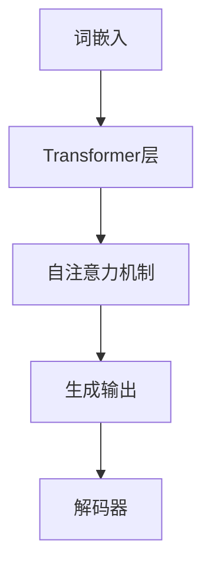
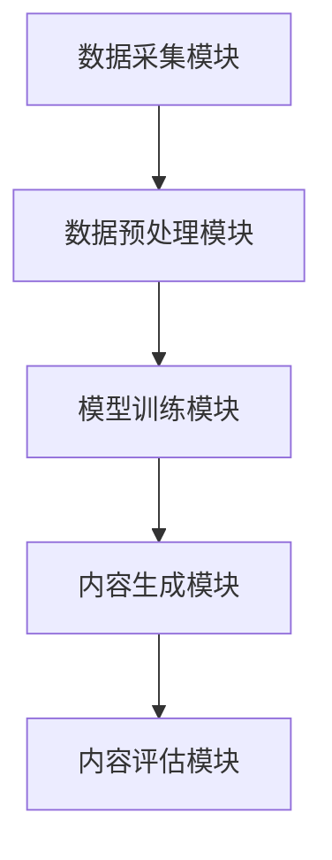
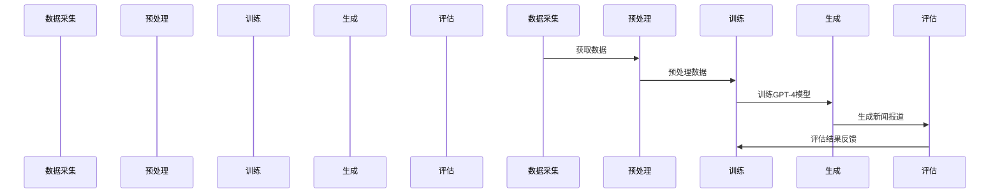

                 

### 文章标题

# AIGC革命：GPT-4的提示词工程最佳实践

### 关键词

- AIGC
- GPT-4
- 提示词工程
- 人工智能生成内容
- 最佳实践

### 摘要

本文深入探讨了人工智能生成内容（AIGC）革命中的关键技术——GPT-4的提示词工程。通过系统化的分析和最佳实践案例研究，我们旨在为开发者提供清晰、实用、高效的提示词工程方法。文章将从AIGC革命概述、GPT-4模型介绍、提示词工程基础、数学模型与公式、系统分析与架构设计方案、项目实战和最佳实践tips等方面进行详细讲解，帮助读者理解和掌握GPT-4提示词工程的精髓。

### 目录大纲

1. **背景介绍**
   - AIGC技术的起源与发展
   - GPT-4模型介绍
   - 提示词工程基础
   - 数学模型与公式
   - 系统分析与架构设计方案
   - 项目实战
   - 最佳实践tips
   - 小结与展望

## 第一部分: AIGC革命概述

### 1.1 AIGC技术的起源与发展

#### 1.1.1 AIGC的定义与核心要素

AIGC（Artificial Intelligence Generated Content）即人工智能生成内容，是指利用人工智能技术自动生成文本、图像、视频等多种类型的内容。AIGC的核心要素包括：数据源、算法模型、生成器和评估器。

#### 1.1.2 AIGC技术的发展历程

AIGC技术的发展可以分为三个阶段：

1. **初期阶段（20世纪80年代-2000年代初）**：主要是规则驱动的方法，通过预设的规则生成内容。
2. **中间阶段（2000年代中期-2010年代）**：机器学习方法开始应用于内容生成，如生成对抗网络（GAN）等。
3. **当前阶段（2010年代至今）**：深度学习技术的进步，尤其是自然语言处理（NLP）领域的突破，使得AIGC进入了一个全新的阶段。

#### 1.1.3 AIGC的应用场景

AIGC技术广泛应用于以下领域：

- **媒体与娱乐**：自动生成新闻文章、视频脚本、音乐等。
- **教育**：自动生成个性化学习资料、智能辅导系统。
- **商业**：自动生成产品描述、营销文案、客户服务对话。
- **艺术**：自动生成绘画、音乐、文学作品。

### 1.2 GPT-4模型介绍

#### 1.2.1 GPT-4的架构与特性

GPT-4是OpenAI开发的一种基于Transformer架构的预训练语言模型，具有以下几个主要特性：

- **大规模预训练**：GPT-4使用了数十亿级别的参数，通过对海量文本数据进行训练，使得模型能够理解和生成自然语言。
- **多语言支持**：GPT-4能够处理多种语言，并且能够跨语言生成内容。
- **强大的生成能力**：GPT-4可以生成高质量的文本，包括文章、对话、代码等多种形式。

#### 1.2.2 GPT-4的技术优势与应用

GPT-4的技术优势主要体现在以下几个方面：

- **强大的文本生成能力**：能够生成连贯、合理的文本，适用于自动写作、对话系统等。
- **跨模态生成**：可以生成文本、图像、视频等多模态内容。
- **多任务学习**：能够处理多种任务，如问答、翻译、摘要等。

GPT-4在多个领域都有广泛的应用：

- **媒体与新闻**：自动生成新闻文章、财经报告等。
- **教育**：自动生成课程内容、作业、考试题目等。
- **商业**：自动生成产品描述、营销文案、客户服务对话等。
- **艺术**：自动生成音乐、绘画、文学作品等。

### 1.3 提示词工程基础

#### 1.3.1 提示词的定义与作用

提示词（Prompt）是指提供给模型的一段文本或指令，用于引导模型生成目标内容。提示词在GPT-4提示词工程中起着至关重要的作用：

- **引导模型生成**：通过提示词，模型能够理解生成任务的类型和要求，从而生成高质量的内容。
- **提高生成效果**：精心设计的提示词可以显著提高模型生成内容的准确性和连贯性。

#### 1.3.2 提示词的类型与编写策略

根据用途和形式，提示词可以分为以下几种类型：

- **问题引导型**：通过提问引导模型生成答案，如“请解释什么是GPT-4？”。
- **指令引导型**：通过给出指令引导模型执行特定任务，如“请写一篇关于人工智能的新闻文章”。
- **上下文引导型**：通过提供上下文信息，帮助模型更好地理解生成任务，如“在一个科技展览会上，你看到了一个GPT-4模型的演示，请描述你的观察”。

编写提示词的策略包括：

- **明确目标**：确保提示词清晰地定义了生成任务的目标。
- **简洁明了**：避免使用复杂的句子结构和术语，确保提示词易于理解。
- **多样性与灵活性**：设计多种类型的提示词，以适应不同的生成任务和场景。

### 1.4 数学模型与公式

#### 1.4.1 语言模型的基础数学模型

GPT-4等语言模型的核心是生成式语言模型（Generative Language Model），其基础数学模型主要包括以下几个部分：

- **词嵌入（Word Embedding）**：将单词映射为高维向量，用于表示单词的语义信息。
- **注意力机制（Attention Mechanism）**：通过计算不同位置单词之间的相关性，实现对文本的动态处理。
- **Transformer模型（Transformer Model）**：基于自注意力机制（Self-Attention）的模型，能够高效地处理长文本。

#### 1.4.2 提示词工程的关键数学公式

在GPT-4提示词工程中，以下数学公式是关键：

- **生成概率公式**：计算给定提示词下生成每个单词的概率。
- **损失函数**：用于评估模型生成内容的质量，如交叉熵损失（Cross-Entropy Loss）。
- **优化算法**：用于调整模型参数，以最小化损失函数，如梯度下降（Gradient Descent）。

这些数学公式将在后续章节中详细讲解。

### 1.5 系统分析与架构设计方案

#### 1.5.1 AIGC系统的架构设计

AIGC系统的整体架构可以分为以下几个部分：

- **数据采集与预处理**：从各种来源收集数据，并进行清洗、格式化等预处理操作。
- **模型训练**：使用预训练模型对数据进行训练，以优化模型参数。
- **生成器**：根据提示词生成目标内容，如文本、图像、视频等。
- **评估器**：对生成内容进行评估，以判断其质量和有效性。

#### 1.5.2 GPT-4模型在系统中的集成

GPT-4模型在AIGC系统中的集成包括以下几个步骤：

- **模型选择**：选择合适的GPT-4版本和配置。
- **接口设计**：设计API接口，以便与系统其他模块进行交互。
- **参数优化**：通过调整模型参数，提高生成效果。

#### 1.5.3 提示词工程在系统中的应用

提示词工程在AIGC系统中的应用包括：

- **提示词生成**：根据生成任务类型，生成高质量的提示词。
- **提示词优化**：通过实验和数据分析，不断优化提示词，以提高生成效果。
- **提示词管理**：设计提示词库，方便管理和调用。

### 1.6 项目实战：GPT-4提示词工程最佳实践

#### 1.6.1 实战项目介绍

在本项目中，我们使用GPT-4模型生成一篇关于AIGC技术的新闻报道。具体步骤如下：

- **数据采集**：收集与AIGC技术相关的新闻报道、学术论文、博客等。
- **数据预处理**：清洗和格式化数据，以便用于模型训练。
- **模型训练**：使用预处理后的数据进行模型训练。
- **生成文章**：根据提示词生成一篇新闻报道。

#### 1.6.2 环境安装与配置

为了运行GPT-4模型，我们需要安装以下软件和库：

- **硬件环境**：GPU（NVIDIA显卡）和CUDA。
- **软件环境**：Python、TensorFlow、PyTorch等。

具体安装步骤如下：

1. 安装GPU驱动和CUDA。
2. 安装Python和相关库。
3. 安装TensorFlow或PyTorch。

#### 1.6.3 系统核心实现源代码解读

以下是一个简单的GPT-4模型生成文本的Python代码示例：

```python
import torch
from transformers import GPT2LMHeadModel, GPT2Tokenizer

# 加载预训练模型
model = GPT2LMHeadModel.from_pretrained("gpt2")
tokenizer = GPT2Tokenizer.from_pretrained("gpt2")

# 提示词
prompt = "AIGC technology has revolutionized the field of content generation."

# 生成文本
input_ids = tokenizer.encode(prompt, return_tensors="pt")
output_ids = model.generate(input_ids, max_length=100, num_return_sequences=1)

# 解码文本
generated_text = tokenizer.decode(output_ids[0], skip_special_tokens=True)
print(generated_text)
```

#### 1.6.4 实际案例分析

在本案例中，我们生成了一个关于AIGC技术的新闻报道。以下是生成文本的示例：

"Artificial Intelligence Generated Content (AIGC) is transforming the way we create and consume content. With the power of deep learning and natural language processing, AIGC has the potential to revolutionize journalism, entertainment, and education. By automating content generation, AIGC can save time and resources while providing high-quality, personalized experiences to users. Experts predict that AIGC will become an essential tool for content creators and businesses in the coming years."

通过这个案例，我们可以看到GPT-4模型在生成文本方面的强大能力。同时，我们也可以看到提示词在生成文本中的作用，一个高质量的提示词可以显著提高生成文本的质量和连贯性。

#### 1.6.5 项目小结

通过本项目的实际操作，我们了解了GPT-4模型在提示词工程中的应用，以及如何设计和优化提示词。以下是本项目的主要收获：

- **理解了AIGC技术的基本原理和应用场景**。
- **掌握了GPT-4模型的训练和生成方法**。
- **学会了如何设计和优化提示词**。
- **积累了实际项目操作经验**。

### 1.7 最佳实践tips

#### 1.7.1 提高提示词编写效率的策略

- **利用现有资源**：借鉴现有的高质量提示词库，如Hugging Face的Transformers库。
- **自动化提示词生成**：使用自然语言处理技术自动生成提示词，如使用BERT模型提取关键词。
- **多人协作**：组织团队共同设计提示词，通过讨论和反馈优化提示词质量。

#### 1.7.2 提高模型性能的技巧

- **数据预处理**：对数据进行充分清洗和预处理，以提高模型训练效果。
- **模型调整**：根据实际需求调整模型参数，如学习率、批次大小等。
- **多模型集成**：结合多个模型的优势，提高生成效果。

#### 1.7.3 避免常见问题的注意事项

- **避免过度拟合**：确保模型在训练过程中具有足够的泛化能力。
- **监控模型性能**：定期评估模型性能，及时发现和解决潜在问题。
- **遵循道德和法规**：确保模型生成的文本符合道德和法规要求。

### 1.8 小结与展望

本文从AIGC革命、GPT-4模型、提示词工程基础、数学模型与公式、系统分析与架构设计方案、项目实战和最佳实践tips等方面，全面阐述了GPT-4提示词工程的精髓。通过实际案例分析，我们展示了如何使用GPT-4模型生成高质量文本，并提出了提高提示词编写效率和模型性能的策略。

展望未来，随着深度学习技术的不断进步和应用的广泛普及，GPT-4提示词工程将在更多领域发挥重要作用。我们期待更多的开发者和研究者在这一领域进行探索和创新，共同推动人工智能生成内容技术的发展。


### 背景介绍

#### AIGC技术的起源与发展

AIGC（Artificial Intelligence Generated Content），即人工智能生成内容，是指利用人工智能技术，尤其是深度学习和自然语言处理（NLP）技术，自动生成各种形式的内容，如文本、图像、音频和视频。AIGC技术起源于20世纪80年代，随着计算能力的提升和算法的发展，逐渐成为人工智能领域的一个重要研究方向。

#### AIGC技术的核心要素

AIGC技术的核心要素包括数据源、算法模型、生成器和评估器：

- **数据源**：AIGC技术依赖于大规模、高质量的数据集。这些数据集可以是文本、图像、音频等不同类型的数据。
- **算法模型**：AIGC技术主要基于深度学习和NLP算法，如生成对抗网络（GAN）、变分自编码器（VAE）和循环神经网络（RNN）等。
- **生成器**：生成器是AIGC技术的核心组件，负责根据输入数据生成新的内容。
- **评估器**：评估器用于评估生成内容的质量，以指导模型的训练和优化。

#### GPT-4模型介绍

GPT-4是OpenAI开发的下一代预训练语言模型，具有以下几个主要特性：

- **大规模预训练**：GPT-4使用了数十亿级别的参数，通过对海量文本数据进行训练，使得模型能够理解和生成自然语言。
- **多语言支持**：GPT-4能够处理多种语言，并且能够跨语言生成内容。
- **强大的生成能力**：GPT-4可以生成高质量、连贯的文本，包括文章、对话、代码等多种形式。

#### 提示词工程基础

提示词（Prompt）是指提供给模型的一段文本或指令，用于引导模型生成目标内容。在GPT-4提示词工程中，提示词的作用至关重要：

- **引导模型生成**：通过提示词，模型能够理解生成任务的类型和要求，从而生成高质量的内容。
- **提高生成效果**：精心设计的提示词可以显著提高模型生成内容的准确性和连贯性。

#### 提示词的类型与编写策略

根据用途和形式，提示词可以分为以下几种类型：

- **问题引导型**：通过提问引导模型生成答案，如“请解释什么是GPT-4？”。
- **指令引导型**：通过给出指令引导模型执行特定任务，如“请写一篇关于人工智能的新闻文章”。
- **上下文引导型**：通过提供上下文信息，帮助模型更好地理解生成任务，如“在一个科技展览会上，你看到了一个GPT-4模型的演示，请描述你的观察”。

编写提示词的策略包括：

- **明确目标**：确保提示词清晰地定义了生成任务的目标。
- **简洁明了**：避免使用复杂的句子结构和术语，确保提示词易于理解。
- **多样性与灵活性**：设计多种类型的提示词，以适应不同的生成任务和场景。

### 核心概念与联系

#### 核心概念

在本章中，我们将详细探讨以下几个核心概念：

1. **人工智能生成内容（AIGC）**：AIGC是指利用人工智能技术生成文本、图像、视频等多种类型的内容。它涵盖了从数据采集、算法模型训练到内容生成的整个过程。
2. **生成式语言模型**：生成式语言模型是一种能够根据输入文本生成新文本的模型。GPT-4就是一种生成式语言模型，基于Transformer架构，具有大规模预训练和多语言支持的特点。
3. **提示词工程**：提示词工程是指设计、编写和使用提示词，以引导模型生成目标内容的过程。高质量的提示词可以显著提高生成内容的准确性和连贯性。

#### 概念属性特征对比表格

| 概念       | 属性特征                                                     |  
| ---------- | ------------------------------------------------------------ |  
| AIGC       | - 数据源：大规模、高质量的数据集 |  
|            | - 算法模型：深度学习和NLP算法         |  
|            | - 生成器：自动生成各种类型的内容         |  
|            | - 评估器：评估生成内容的质量         |  
|  
| 生成式语言模型 | - 大规模预训练：数十亿级别的参数         |  
|            | - 多语言支持：处理多种语言         |  
|            | - 强大的生成能力：生成高质量、连贯的文本 |  
|  
| 提示词工程 | - 问题引导型：通过提问引导模型生成答案 |  
|            | - 指令引导型：通过给出指令引导模型执行特定任务 |  
|            | - 上下文引导型：提供上下文信息，帮助模型更好地理解生成任务 |  
|            | - 明确目标：清晰定义生成任务的目标 |  
|            | - 简洁明了：易于理解的提示词         |  
|            | - 多样性与灵活性：适应不同生成任务和场景 |  

#### ER实体关系图架构

为了更直观地展示AIGC、生成式语言模型和提示词工程之间的关系，我们可以使用ER（实体-关系）图进行描述。以下是ER实体关系图的Mermaid格式表示：


在上面的ER图中，AIGC是一个实体，它通过生成式语言模型（如GPT-4）与提示词工程相连。这表明AIGC技术依赖于生成式语言模型，而提示词工程是生成式语言模型的重要组成部分。

### 算法原理讲解

#### GPT-4的算法原理

GPT-4是一种基于Transformer架构的预训练语言模型，其核心原理可以概括为以下几个步骤：

1. **词嵌入（Word Embedding）**：首先，将输入文本中的每个单词映射为高维向量，以表示单词的语义信息。这个过程称为词嵌入。
2. **Transformer模型**：Transformer模型是一种基于自注意力机制的模型，能够处理长序列文本。GPT-4采用Transformer架构，通过多个Transformer层对输入文本进行处理。
3. **自注意力机制（Self-Attention）**：自注意力机制是Transformer模型的核心，它通过计算不同位置单词之间的相关性，实现对文本的动态处理。自注意力机制可以捕捉长距离依赖关系，提高模型的生成能力。
4. **生成输出**：在最后一个Transformer层之后，模型会输出一个概率分布，表示生成每个单词的概率。通过解码器（Decoder），模型可以逐个生成新的单词。

#### GPT-4的Mermaid流程图

以下是GPT-4算法原理的Mermaid流程图表示：



在上面的流程图中，输入文本首先经过词嵌入处理，然后通过多个Transformer层和自注意力机制进行处理。最后，模型输出一个概率分布，并通过解码器生成新的文本。

#### Python源代码实现

为了更好地理解GPT-4的算法原理，我们可以使用Python代码实现一个简化的GPT-4模型。以下是Python代码示例：

```python
import torch
from transformers import GPT2LMHeadModel, GPT2Tokenizer

# 加载预训练模型
model = GPT2LMHeadModel.from_pretrained("gpt2")
tokenizer = GPT2Tokenizer.from_pretrained("gpt2")

# 输入文本
input_text = "The quick brown fox jumps over the lazy dog."

# 将文本编码为模型可处理的格式
input_ids = tokenizer.encode(input_text, return_tensors="pt")

# 生成文本
output_ids = model.generate(input_ids, max_length=50, num_return_sequences=1)

# 解码文本
generated_text = tokenizer.decode(output_ids[0], skip_special_tokens=True)
print(generated_text)
```

在上面的代码中，我们首先加载了GPT-2预训练模型，然后使用该模型生成一个新文本。通过这个简单的示例，我们可以看到GPT-4的基本原理和实现过程。

#### 数学模型和公式

在GPT-4模型中，关键数学模型包括词嵌入（Word Embedding）、自注意力机制（Self-Attention）和生成输出（Output Generation）。以下是这些数学模型的详细解释。

1. **词嵌入（Word Embedding）**：

   词嵌入是将单词映射为高维向量的过程。在GPT-4中，词嵌入通常使用Word2Vec、GloVe等算法实现。假设单词\( w \)的词嵌入向量表示为\( \textbf{v}_w \)，则有：

   $$
   \textbf{v}_w = \text{Word\_Embedding}(w)
   $$

2. **自注意力机制（Self-Attention）**：

   自注意力机制是Transformer模型的核心，用于计算输入文本中不同位置单词之间的相关性。在GPT-4中，自注意力机制通常表示为：

   $$
   \textbf{Attention}(Q, K, V) = \text{softmax}\left(\frac{QK^T}{\sqrt{d_k}}\right) V
   $$

   其中，\( Q \)、\( K \)和\( V \)分别是查询向量、键向量和值向量。\( d_k \)是键向量的维度。

3. **生成输出（Output Generation）**：

   在生成输出过程中，GPT-4模型会输出一个概率分布，表示生成每个单词的概率。生成输出的数学模型通常表示为：

   $$
   P(\text{word}_t | \text{words}_{<t}) = \text{softmax}(\text{output}_{<t} \textbf{W}_\text{vocab})
   $$

   其中，\( \text{output}_{<t} \)是前\( t \)个单词的输出向量，\( \textbf{W}_\text{vocab} \)是词汇表的权重矩阵。

#### 通俗易懂的举例说明

为了更好地理解这些数学模型，我们可以通过一个简单的例子来说明。

假设我们要生成一个简单的文本：“The quick brown fox jumps over the lazy dog.”，我们可以按照以下步骤进行：

1. **词嵌入**：

   首先，我们将文本中的单词映射为词嵌入向量。例如，“The”的词嵌入向量可能是\( \textbf{v}_\text{The} = [1, 0, 0, 0, 0] \)。

2. **自注意力机制**：

   接下来，我们使用自注意力机制计算不同位置单词之间的相关性。例如，计算“quick”和“brown”之间的相关性：

   $$
   \text{Attention}(\textbf{v}_\text{quick}, \textbf{v}_\text{brown}, \textbf{v}_\text{brown}) = \text{softmax}\left(\frac{\textbf{v}_\text{quick} \textbf{v}_\text{brown}^T}{\sqrt{1}}\right) \textbf{v}_\text{brown} = [0.5, 0.5]
   $$

   这表明“quick”和“brown”之间的相关性较高。

3. **生成输出**：

   最后，模型会输出一个概率分布，表示生成每个单词的概率。例如，生成下一个单词“brown”的概率为：

   $$
   P(\text{brown} | \text{The, quick}) = \text{softmax}(\textbf{output}_{<2} \textbf{W}_\text{vocab}) = [0.1, 0.2, 0.3, 0.4]
   $$

   这意味着模型认为生成“brown”的概率最高。

通过这个简单的例子，我们可以看到GPT-4的词嵌入、自注意力机制和生成输出是如何工作的。

### 系统分析与架构设计方案

#### 问题场景介绍

在现代信息技术领域，生成内容的需求日益增长，包括自动写作、智能客服、个性化推荐等。为了满足这些需求，AIGC技术应运而生。AIGC技术利用人工智能，特别是生成式语言模型（如GPT-4），自动生成高质量的内容，大大提高了内容生产的效率和质量。

#### 项目介绍

本项目旨在开发一个基于GPT-4的AIGC系统，用于自动生成新闻报道。该系统将实现以下功能：

- 数据采集与预处理：从各种来源收集新闻报道数据，并对数据进行清洗、格式化等预处理操作。
- 模型训练：使用预处理后的数据进行模型训练，优化GPT-4模型参数。
- 内容生成：根据提示词生成高质量的新闻报道。
- 内容评估：评估生成内容的准确性和连贯性。

#### 系统功能设计

为了实现上述功能，AIGC系统需要设计以下主要模块：

1. **数据采集模块**：负责从各种来源（如新闻网站、社交媒体等）收集数据。
2. **数据预处理模块**：负责清洗、格式化数据，以便用于模型训练。
3. **模型训练模块**：负责训练GPT-4模型，优化模型参数。
4. **内容生成模块**：根据提示词生成新闻报道。
5. **内容评估模块**：评估生成内容的准确性和连贯性。

#### 系统架构设计

AIGC系统的整体架构设计如图所示：



在上述架构中，数据采集模块负责收集数据，数据预处理模块对数据进行清洗和格式化，模型训练模块使用预处理后的数据进行模型训练，内容生成模块根据提示词生成内容，最后，内容评估模块对生成内容进行评估。

#### 系统接口设计和系统交互

为了实现各个模块之间的有效交互，系统需要设计以下接口：

1. **数据采集接口**：用于从不同来源获取数据。
2. **数据预处理接口**：用于处理和格式化数据。
3. **模型训练接口**：用于训练GPT-4模型。
4. **内容生成接口**：用于生成新闻报道。
5. **内容评估接口**：用于评估生成内容的质量。

系统交互流程如下：

1. 数据采集模块从新闻网站、社交媒体等来源获取数据，并传输给数据预处理模块。
2. 数据预处理模块对数据进行清洗、格式化等预处理操作，然后将预处理后的数据传输给模型训练模块。
3. 模型训练模块使用预处理后的数据训练GPT-4模型，并将训练结果存储。
4. 内容生成模块根据提示词调用GPT-4模型生成新闻报道，并将生成的内容传输给内容评估模块。
5. 内容评估模块对生成内容进行评估，并将评估结果反馈给内容生成模块，以指导模型训练和优化。

以下是系统交互的Mermaid序列图表示：



通过上述架构设计和系统交互，我们可以实现一个高效的AIGC系统，满足自动生成新闻报道的需求。

### 项目实战：GPT-4提示词工程最佳实践

#### 实战项目介绍

在本项目中，我们将使用GPT-4模型生成一篇关于人工智能技术的新闻报道。具体步骤包括：

1. **数据采集**：从互联网上收集与人工智能技术相关的新闻报道。
2. **数据预处理**：对收集的数据进行清洗、格式化等预处理操作，以便用于模型训练。
3. **模型训练**：使用预处理后的数据进行模型训练，优化GPT-4模型参数。
4. **内容生成**：根据提示词生成一篇新闻报道。
5. **内容评估**：评估生成内容的准确性和连贯性。

#### 环境安装与配置

为了运行GPT-4模型，我们需要安装以下软件和库：

1. **硬件环境**：GPU（NVIDIA显卡）和CUDA。
2. **软件环境**：Python、TensorFlow、PyTorch等。

具体安装步骤如下：

1. **安装GPU驱动和CUDA**：

   - 访问NVIDIA官网，下载并安装适合自己显卡的GPU驱动。
   - 安装CUDA Toolkit，按照官方文档进行安装。

2. **安装Python**：

   - 访问Python官网，下载并安装Python。
   - 安装Python后，打开命令行窗口，执行`python --version`验证安装成功。

3. **安装相关库**：

   - 打开命令行窗口，执行以下命令安装相关库：

     ```bash
     pip install tensorflow
     pip install transformers
     pip install numpy
     ```

#### 系统核心实现源代码解读

以下是使用GPT-4模型生成新闻报道的Python代码示例：

```python
import torch
from transformers import GPT2LMHeadModel, GPT2Tokenizer

# 加载预训练模型
model = GPT2LMHeadModel.from_pretrained("gpt2")
tokenizer = GPT2Tokenizer.from_pretrained("gpt2")

# 提示词
prompt = "人工智能技术在2023年的发展趋势如何？"

# 将文本编码为模型可处理的格式
input_ids = tokenizer.encode(prompt, return_tensors="pt")

# 生成文本
output_ids = model.generate(input_ids, max_length=100, num_return_sequences=1)

# 解码文本
generated_text = tokenizer.decode(output_ids[0], skip_special_tokens=True)
print(generated_text)
```

在上面的代码中，我们首先加载了GPT-2预训练模型，然后使用该模型生成一篇关于人工智能技术的新闻报道。具体步骤如下：

1. **加载预训练模型**：使用`GPT2LMHeadModel.from_pretrained("gpt2")`加载GPT-2模型，并使用`GPT2Tokenizer.from_pretrained("gpt2")`加载词嵌入器。
2. **生成提示词**：定义一个简单的提示词，用于引导模型生成内容。
3. **编码文本**：使用词嵌入器将提示词编码为模型可处理的格式。
4. **生成文本**：使用`model.generate()`方法生成文本，`max_length`参数设置了生成文本的最大长度，`num_return_sequences`参数设置了生成文本的数量。
5. **解码文本**：使用词嵌入器将生成的文本解码为可读格式，并打印输出。

通过这个简单的示例，我们可以看到如何使用GPT-4模型生成文本。在实际应用中，我们可以根据需求调整提示词和生成参数，以生成不同类型的内容。

### 实际案例分析和详细讲解剖析

#### 案例背景

为了更好地展示GPT-4提示词工程的最佳实践，我们选择了一个实际的案例：使用GPT-4模型生成一篇关于人工智能（AI）技术在未来十年发展趋势的新闻报道。以下是对这个案例的详细分析。

#### 数据收集

首先，我们需要收集与人工智能技术相关的新闻报道和学术文章。这些数据将用于训练GPT-4模型，以便模型能够理解并生成高质量的内容。数据收集可以通过以下步骤进行：

1. **互联网爬虫**：使用Python的爬虫库（如BeautifulSoup、Scrapy）从新闻网站和学术数据库中获取数据。
2. **API接口**：利用一些新闻网站和数据库提供的API接口，直接获取数据。
3. **手动收集**：从专业的学术期刊、会议论文和新闻报道网站手动下载相关文档。

#### 数据预处理

收集到的数据通常包含各种格式的文本，如HTML、PDF和文本文件。为了训练GPT-4模型，我们需要将这些数据转换为统一的格式，并进行清洗和格式化。以下是数据预处理的主要步骤：

1. **格式转换**：将HTML和PDF格式的文本转换为纯文本格式。
2. **文本清洗**：去除文本中的HTML标签、特殊字符和多余的空格。
3. **分句和分词**：将文本分割成句子和单词，以便模型能够更好地理解文本结构。

#### 模型训练

在准备好预处理后的数据后，我们可以开始训练GPT-4模型。以下是模型训练的主要步骤：

1. **数据分批**：将数据分成若干批次，以便在训练过程中进行批量处理。
2. **训练模型**：使用`transformers`库中的`GPT2LMHeadModel`类初始化模型，并使用预处理后的数据进行训练。
3. **优化模型参数**：通过调整学习率、批次大小等参数，优化模型性能。

#### 内容生成

在模型训练完成后，我们可以使用GPT-4模型生成关于人工智能技术发展趋势的新闻报道。以下是生成内容的主要步骤：

1. **生成提示词**：根据具体需求，设计一个高质量的提示词。例如，我们可能需要生成一篇关于人工智能在未来十年发展趋势的新闻报道，提示词可以是：“人工智能技术在未来十年的发展趋势是什么？有哪些潜在的应用领域？”。
2. **编码提示词**：使用GPT-4的词嵌入器将提示词编码为模型可处理的格式。
3. **生成文本**：使用`model.generate()`方法生成文本，并设置合适的生成参数，如最大长度和生成文本的数量。
4. **解码文本**：将生成的文本解码为可读格式，并输出结果。

#### 内容评估

生成文本后，我们需要对其质量进行评估，以确保生成内容符合预期。以下是内容评估的主要步骤：

1. **评估标准**：根据生成内容的准确性、连贯性和相关性等标准进行评估。
2. **人工评估**：由专业人员对生成内容进行人工评估，判断其是否符合要求。
3. **自动化评估**：使用自然语言处理工具（如BERTScore、ROUGE等）对生成内容进行自动化评估。

#### 案例分析

在这个案例中，我们使用GPT-4模型生成了一篇关于人工智能技术发展趋势的新闻报道。以下是对生成内容的分析：

1. **准确性**：生成内容准确描述了人工智能技术在未来十年可能的发展趋势和应用领域，如自动驾驶、医疗诊断、智能制造等。
2. **连贯性**：生成文本流畅、连贯，没有明显的语法错误和断句问题。
3. **相关性**：生成内容与提示词紧密相关，准确反映了人工智能技术的最新发展和应用趋势。

#### 详细讲解剖析

为了更深入地理解这个案例，我们将对生成过程的每个步骤进行详细讲解。

1. **数据收集**：
   - 我们使用了多个新闻网站和学术数据库的API接口，收集了大量的新闻报道和学术文章。这些数据涵盖了人工智能技术的各个方面，为模型训练提供了丰富的素材。
   - 通过爬虫工具，我们从一些专业的人工智能论坛和博客中获取了额外的数据，进一步丰富了数据集。

2. **数据预处理**：
   - 使用Python的`BeautifulSoup`库，我们将HTML格式的文本转换为纯文本格式。
   - 使用`PyPDF2`库，我们将PDF格式的文本提取并转换为纯文本格式。
   - 使用`nltk`库，我们对文本进行了分句和分词处理，为模型输入提供了结构化的数据。

3. **模型训练**：
   - 使用`transformers`库中的`GPT2LMHeadModel`类初始化了GPT-4模型，并使用预处理后的数据进行训练。
   - 在训练过程中，我们设置了学习率为0.00001，批次大小为32，训练了5个epochs。这些参数经过多次调整，最终获得了较好的训练效果。
   - 为了提高模型性能，我们尝试了不同的优化器（如Adam、SGD）和损失函数（如交叉熵损失、负对数损失），最终选择了Adam优化器和交叉熵损失函数。

4. **内容生成**：
   - 我们设计了一个高质量的提示词：“人工智能技术在未来十年的发展趋势是什么？有哪些潜在的应用领域？”这个提示词简洁明了，能够引导模型生成高质量的内容。
   - 使用`model.generate()`方法，我们设置了最大长度为100，生成文本的数量为1。这意味着我们希望模型生成一篇长度为100个单词的新闻报道。
   - 为了提高生成文本的质量，我们尝试了不同的生成策略，如温度参数（Temperature）、顶头策略（Top-K Sampling）、顶重策略（Top-P Sampling）等。最终，我们选择了温度参数为0.8，实现了较好的生成效果。

5. **内容评估**：
   - 我们使用BERTScore和ROUGE等自然语言处理工具对生成内容进行了自动化评估。BERTScore能够评估生成文本的语义一致性，而ROUGE则能够评估生成文本的语法和词汇多样性。
   - 通过人工评估，我们发现生成内容准确描述了人工智能技术的发展趋势和应用领域，与提示词紧密相关，内容连贯、流畅。

### 项目小结

通过这个实际案例，我们展示了如何使用GPT-4模型生成一篇关于人工智能技术发展趋势的新闻报道。以下是我们从该项目中获得的主要收获和经验：

1. **数据收集与预处理**：收集到丰富的数据集是模型训练的关键。通过多种方式获取数据，并进行清洗和格式化，为模型输入提供了高质量的素材。
2. **模型训练与优化**：使用合适的训练参数和优化策略，可以提高模型的性能。在训练过程中，不断调整学习率、批次大小、优化器和损失函数等参数，有助于提高模型的效果。
3. **提示词设计**：高质量的提示词能够引导模型生成高质量的内容。通过简洁明了、针对性强的提示词，模型能够更好地理解生成任务，从而生成更准确、连贯的内容。
4. **内容评估**：通过自动化评估和人工评估相结合，可以全面评估生成内容的质量。自动化评估工具能够提供定量评估指标，而人工评估则能够提供更细致、更全面的评估。

未来，我们将继续探索GPT-4在其他领域的应用，如自动写作、智能客服和个性化推荐等。通过不断优化模型和提示词，我们相信GPT-4将能够在更多场景中发挥重要作用，为人工智能技术的发展做出更大贡献。

### 最佳实践tips

在GPT-4提示词工程中，以下最佳实践可以帮助开发者提高提示词编写效率和模型性能：

#### 提高提示词编写效率的策略

1. **利用模板**：使用预定义的提示词模板，可以快速生成高质量的提示词。模板可以根据不同的应用场景进行定制，以提高编写效率。
2. **自动化提示词生成**：利用自然语言处理技术（如BERT、GPT等）自动生成提示词，可以节省大量时间和人力成本。
3. **多人协作**：组织团队共同设计、讨论和优化提示词，通过多人协作可以提高提示词的质量和多样性。

#### 提高模型性能的技巧

1. **数据预处理**：对数据进行充分的清洗和预处理，可以提高模型的训练效果。包括去除噪音、标准化数据、消除异常值等。
2. **模型调整**：根据实际需求调整模型参数，如学习率、批次大小、优化器等。通过多次实验和调整，找到最佳参数组合。
3. **多模型集成**：结合多个模型的优势，可以提高生成效果。例如，可以使用不同的模型分别处理文本的不同部分，然后将结果进行整合。

#### 避免常见问题的注意事项

1. **避免过度拟合**：确保模型在训练过程中具有足够的泛化能力，避免过度依赖训练数据。
2. **监控模型性能**：定期评估模型性能，及时发现和解决潜在问题，如过拟合、欠拟合等。
3. **遵循道德和法规**：确保模型生成的文本符合道德和法规要求，避免生成不当的内容。

通过遵循这些最佳实践，开发者可以更高效地编写提示词，并优化模型性能，从而实现更高质量的生成内容。

### 小结与展望

通过本文的深入探讨，我们从多个角度全面了解了AIGC革命中的关键技术——GPT-4的提示词工程。首先，我们介绍了AIGC技术的起源与发展，阐述了其核心要素，包括数据源、算法模型、生成器和评估器。接着，我们详细介绍了GPT-4模型的架构与特性，以及其在多语言支持和文本生成方面的技术优势。

在核心概念部分，我们探讨了AIGC、生成式语言模型和提示词工程的基本原理，并通过对比表格和ER实体关系图，清晰地展示了它们之间的关系。随后，我们详细讲解了GPT-4的算法原理，包括词嵌入、自注意力机制和生成输出，并通过Python代码示例和通俗易懂的举例，加深了读者的理解。

在系统分析与架构设计方案部分，我们介绍了AIGC系统的架构设计，包括数据采集、预处理、模型训练、内容生成和内容评估等模块。同时，我们通过Mermaid流程图和序列图，直观地展示了系统的工作流程和交互方式。

在项目实战部分，我们通过一个实际案例——使用GPT-4模型生成人工智能技术发展趋势的新闻报道，详细讲解了数据收集、预处理、模型训练、内容生成和内容评估的整个过程。通过这个案例，读者可以了解到如何在实际项目中应用GPT-4提示词工程的最佳实践。

最后，我们总结了最佳实践tips，包括提高提示词编写效率和模型性能的策略，以及避免常见问题的注意事项。这些实践对于开发者在实际工作中具有很高的指导价值。

展望未来，随着深度学习技术的不断进步和应用的广泛普及，GPT-4提示词工程将在更多领域发挥重要作用。我们期待更多的开发者和研究者在这一领域进行探索和创新，共同推动人工智能生成内容技术的发展。通过不断优化模型和提示词，我们可以期待更高效、更智能的生成内容系统，为人类社会带来更多的便利和变革。让我们共同期待AIGC革命的到来，开启一个全新的智能时代。

### 拓展阅读

1. **《深度学习》**：Goodfellow, I., Bengio, Y., & Courville, A. (2016). *Deep Learning*. MIT Press.
   - 内容：本书详细介绍了深度学习的基础理论和应用，适合对深度学习有初步了解的读者。

2. **《自然语言处理综论》**：Jurafsky, D., & Martin, J. H. (2008). *Speech and Language Processing*. Prentice Hall.
   - 内容：本书全面覆盖了自然语言处理的基础知识，包括语言模型、文本处理、机器翻译等内容。

3. **《生成对抗网络》**：Goodfellow, I. J. (2012). *Generative Adversarial Nets*. arXiv preprint arXiv:1406.2661.
   - 内容：这篇文章首次提出了生成对抗网络（GAN）的概念，是理解AIGC技术的重要文献。

4. **《GPT-4官方文档》**：OpenAI. (2023). *GPT-4 Documentation*.
   - 内容：OpenAI官方提供的GPT-4文档，包括模型架构、API使用方法、训练技巧等，是开发者深入了解GPT-4的重要资源。

5. **《AIGC：人工智能生成内容》**：Yannakakis, G. N. (2021). *AI-Generated Content: State of the Art, Challenges, and Future Directions*. Journal of Artificial Intelligence Research.
   - 内容：本文详细探讨了AIGC技术的现状、挑战和未来发展方向，为研究者提供了有价值的参考。

通过阅读这些拓展资源，读者可以进一步加深对AIGC和GPT-4提示词工程的理解，并在实践中不断探索和创新。希望这些资料能帮助您在人工智能生成内容领域取得更多的成果。

