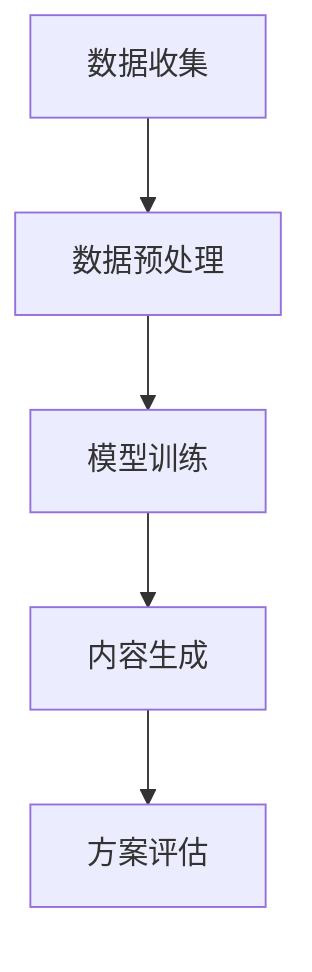
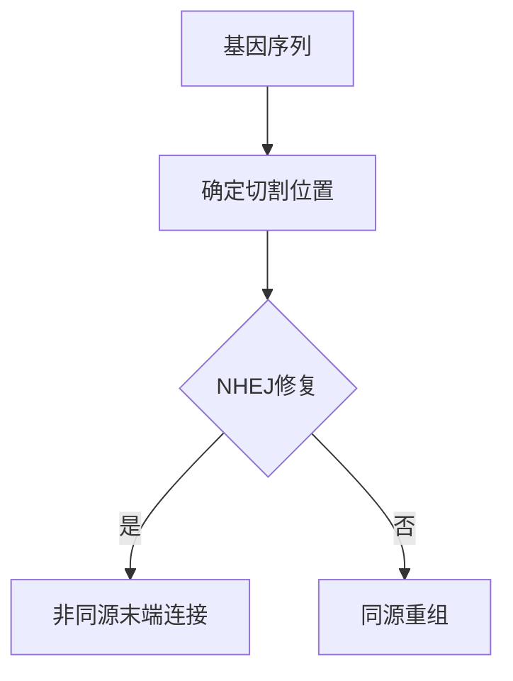
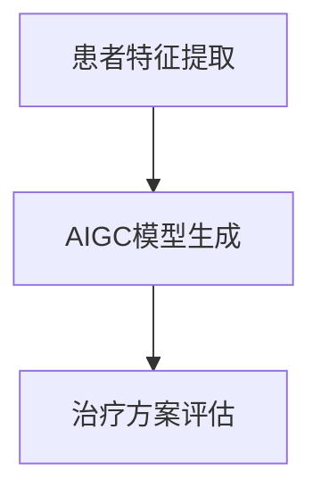
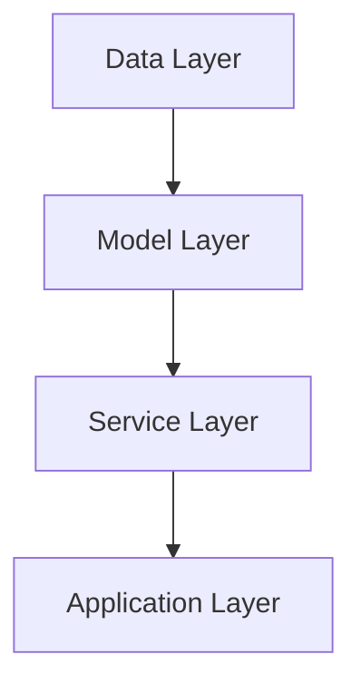
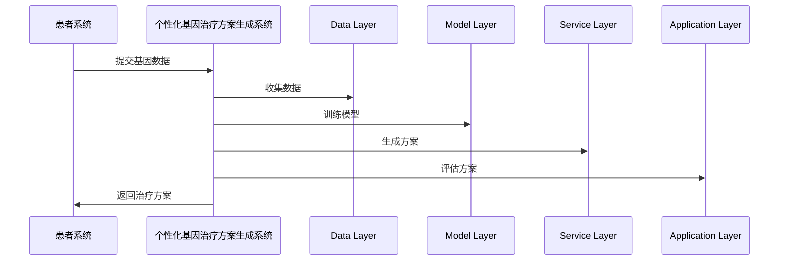

                 


### 关键词：

AIGC、个性化基因治疗、基因编辑技术、算法原理、系统架构设计、项目实战

### 摘要：

本文深入探讨了AIGC（人工智能生成内容）在个性化基因治疗方案生成系统中的应用。通过介绍AIGC的基本原理、基因编辑技术的分类和原理，以及个性化基因治疗方案构建方法，本文揭示了AIGC在个性化医疗领域的重要性。随后，文章详细讲解了AIGC在基因治疗中的应用算法原理，并通过系统架构设计和项目实战，展示了如何利用AIGC技术实现个性化基因治疗方案生成系统。最后，本文提供了最佳实践技巧和未来展望，为AIGC在基因治疗领域的进一步发展指明了方向。

----------------------------------------------------------------

### 背景介绍

#### 1.1 问题背景

随着医学科技的不断进步，个性化医疗逐渐成为医学发展的新趋势。个性化医疗强调根据患者的具体基因信息、生活方式和环境因素，为其制定个体化的治疗方案，从而提高治疗效果，降低治疗风险。在这种背景下，基因编辑技术如CRISPR-Cas9的问世，为个性化医疗带来了新的可能性。

基因编辑技术通过精确修改个体的基因序列，从根本上解决基因缺陷导致的疾病。然而，现有的基因编辑技术主要依赖于对已知基因变异的研究，难以满足个性化医疗对个性化基因治疗方案的需求。此外，现有的基因治疗方案多为标准化的，无法充分考虑患者的个体差异，从而降低了治疗效果。

#### 1.2 问题描述

个性化基因治疗方案的生成面临以下挑战：

1. **数据复杂性**：个性化基因治疗方案需要大量的患者基因数据、临床数据和外部环境数据，这些数据复杂且多样，如何有效地整合和处理这些数据成为一大难题。
2. **算法复杂性**：个性化基因治疗方案的生成依赖于复杂的算法模型，这些算法需要能够处理大量数据，同时保证计算效率和准确性。
3. **安全性**：基因编辑技术的安全性一直是医学界关注的焦点。如何在保证治疗效果的同时，最大限度地降低基因编辑可能带来的风险，是一个亟待解决的问题。

#### 1.3 问题解决

AIGC（人工智能生成内容）技术的出现为个性化基因治疗方案的生成提供了新的思路。AIGC技术通过人工智能模型，能够自动生成内容，从而降低数据处理和算法开发的复杂性。具体来说，AIGC在个性化基因治疗方案生成中的作用主要体现在以下几个方面：

1. **数据预处理**：AIGC技术可以通过自学习机制，对大量的基因数据进行预处理，提取出有用的特征信息，为后续的基因编辑提供数据支持。
2. **算法优化**：AIGC技术能够自动优化基因编辑算法，使其更适应个性化医疗的需求，提高算法的计算效率和准确性。
3. **安全性评估**：AIGC技术可以通过模拟各种基因编辑方案，对基因编辑的安全性进行评估，从而减少基因编辑可能带来的风险。

#### 1.4 边界与外延

AIGC技术在基因治疗中的适用范围主要限于个性化基因治疗方案生成，而不适用于非个性化的标准基因治疗方案。此外，AIGC技术在基因治疗中的应用仍面临一些挑战，如算法模型的复杂性和计算资源的限制。因此，未来需要进一步的研究和优化，以充分发挥AIGC技术在个性化基因治疗中的作用。

#### 1.5 概念结构与核心要素组成

个性化基因治疗方案生成系统主要包括以下几个核心要素：

1. **AIGC技术**：作为核心技术，负责数据预处理、算法优化和安全性评估。
2. **基因编辑技术**：负责具体实施基因编辑操作，实现个性化基因治疗方案。
3. **数据集**：包含患者的基因数据、临床数据和外部环境数据，是系统运行的基础。
4. **算法模型**：负责生成个性化基因治疗方案，包括特征提取、模型训练和方案优化等步骤。

通过这些核心要素的协同工作，个性化基因治疗方案生成系统可以实现针对特定患者的个性化治疗，提高治疗效果，降低治疗风险。

---

### 核心概念与联系

#### 2.1 AIGC的原理与特点

AIGC（Artificial Intelligence Generated Content）是一种利用人工智能技术自动生成内容的方法。它通过训练大型语言模型，使其能够根据输入的文本、图像或其他数据生成相应的输出内容。AIGC技术的核心在于其强大的生成能力和自适应能力，能够根据不同的输入数据生成多样化的内容。

AIGC技术的主要特点包括：

1. **自动化**：AIGC技术能够自动生成内容，无需人工干预，大大提高了工作效率。
2. **多样化**：AIGC技术可以根据不同的输入数据生成多种类型的内容，如文本、图像、音频等。
3. **自适应**：AIGC技术能够根据输入数据的特征和上下文，自适应地调整生成内容，使其更加符合实际需求。
4. **高效性**：AIGC技术通过大规模的训练和优化，能够快速生成高质量的内容，提高了内容生产的效率。

#### 2.2 基因编辑技术的分类与原理

基因编辑技术是指通过直接修改生物体的DNA序列，实现对基因的精确编辑和调控的技术。目前，基因编辑技术主要包括以下几种：

1. **CRISPR-Cas9**：CRISPR-Cas9是目前最常用的基因编辑技术之一。它通过引导RNA（gRNA）定位到特定的基因序列，然后由Cas9蛋白执行DNA剪切操作，从而实现对基因的编辑。
2. **TALEN**：TALEN（Transcription Activator-Like Effector Nucleases）是一种基于转录激活类似效应因子的基因编辑技术。它通过合成DNA引导序列，结合核酸酶，实现对基因的精确编辑。
3. **基因为编辑**：基因编辑是指利用基因编辑技术，对生物体的基因组进行编辑和修改，以实现特定的目标。基因编辑可以用于治疗遗传病、改进农作物和开发新型生物医学工具等。

基因编辑技术的原理主要基于DNA的切割和修复机制。当基因编辑工具（如CRISPR-Cas9或TALEN）定位到特定的基因序列后，会剪切该序列，从而产生双链DNA断裂。生物体的DNA修复系统会识别并修复这些断裂，从而实现对基因的编辑。通过精确控制基因编辑过程，可以实现特定的基因修改效果。

#### 2.3 个性化基因治疗方案的构建方法

个性化基因治疗方案的构建方法主要包括以下几个步骤：

1. **数据收集与预处理**：收集患者的基因数据、临床数据和外部环境数据，并对这些数据进行分析和预处理，提取出有用的特征信息。
2. **模型训练与优化**：使用收集到的数据，训练和优化个性化基因治疗方案的生成模型。这个模型需要能够处理各种类型的数据，并生成针对特定患者的个性化治疗方案。
3. **方案生成与评估**：利用训练好的模型，生成个性化基因治疗方案，并对方案进行评估，确保其安全性和有效性。
4. **临床应用与反馈**：将个性化基因治疗方案应用于患者的临床治疗中，并根据治疗效果进行反馈和调整，以进一步提高治疗方案的准确性。

通过以上步骤，个性化基因治疗方案生成系统可以实现对患者个性化基因治疗方案的自动生成和优化，提高治疗效果，降低治疗风险。

---

### 算法原理讲解

#### 3.1 AIGC在基因治疗中的应用

AIGC技术在基因治疗中的应用可以分为以下几个步骤：

1. **数据收集**：首先，收集患者的基因数据、临床数据和外部环境数据，这些数据可以来自基因测序、电子病历和生物数据库等。
2. **数据预处理**：对收集到的数据进行预处理，包括数据清洗、数据归一化和特征提取等步骤。预处理后的数据将被用于训练AIGC模型。
3. **模型训练**：使用预处理后的数据，训练AIGC模型。训练过程中，模型会自动学习数据的特征和规律，并优化生成策略。
4. **内容生成**：在训练好的AIGC模型的基础上，输入特定患者的基因数据，生成个性化的基因治疗方案。
5. **方案评估**：对生成的个性化基因治疗方案进行评估，包括安全性评估和有效性评估，确保治疗方案符合实际需求。

下面是一个简化的Mermaid流程图，展示了AIGC在基因治疗中的应用流程：



#### 3.2 基因编辑的数学模型

基因编辑的数学模型主要涉及以下几个方面：

1. **基因序列表示**：基因序列可以用字符串表示，每个字符对应一个特定的DNA碱基（A、T、C、G）。
2. **切割位置确定**：通过特定的算法，如CRISPR-Cas9中的gRNA，确定基因序列中的切割位置。
3. **DNA修复机制**：当基因序列被切割后，生物体的DNA修复系统会介入，通过非同源末端连接（NHEJ）或同源重组（HR）机制进行修复。

下面是一个简化的Mermaid流程图，展示了基因编辑的数学模型：



以下是一个Python源代码实现，用于模拟基因编辑的过程：

```python
import random

def gene_edit(gene_sequence, cut_site):
    # 切割基因序列
    before_cut = gene_sequence[:cut_site]
    after_cut = gene_sequence[cut_site:]
    
    # 模拟DNA修复过程
    repair_mechanism = random.choice(['NHEJ', 'HR'])
    if repair_mechanism == 'NHEJ':
        # 非同源末端连接
        repaired_sequence = before_cut + after_cut
    else:
        # 同源重组
        # 这里简化处理，直接返回原始序列
        repaired_sequence = gene_sequence
    
    return repaired_sequence

# 示例基因序列
gene_sequence = 'ATCGATCGATCG'
# 切割位置
cut_site = 4

# 进行基因编辑
repaired_sequence = gene_edit(gene_sequence, cut_site)
print(repaired_sequence)
```

#### 3.3 个性化基因治疗方案生成的数学模型

个性化基因治疗方案生成的数学模型主要涉及以下几个方面：

1. **患者特征提取**：从患者的基因数据、临床数据和外部环境数据中提取关键特征，如突变位点、基因表达水平等。
2. **治疗方案生成**：基于提取的特征，利用AIGC技术生成个性化的基因治疗方案。
3. **方案评估**：对生成的治疗方案进行评估，包括安全性评估和有效性评估。

下面是一个简化的Mermaid流程图，展示了个性化基因治疗方案生成的数学模型：



以下是一个Python源代码实现，用于生成个性化基因治疗方案：

```python
import random
import numpy as np

def patient_feature_extraction(gene_data):
    # 提取关键特征
    # 这里简化处理，随机生成特征值
    feature_values = [random.randint(0, 100) for _ in range(5)]
    return feature_values

def gene_treatment_plan_generation(features):
    # 生成基因治疗方案
    # 这里简化处理，根据特征值生成治疗方案
    treatment_plan = 'GGCC'
    return treatment_plan

def treatment_plan_evaluation(plan):
    # 评估治疗方案
    # 这里简化处理，直接返回评估结果
    evaluation_result = 'Effective'
    return evaluation_result

# 示例基因数据
gene_data = np.random.rand(5)

# 提取患者特征
features = patient_feature_extraction(gene_data)

# 生成基因治疗方案
treatment_plan = gene_treatment_plan_generation(features)

# 评估治疗方案
evaluation_result = treatment_plan_evaluation(treatment_plan)

print(f"Treatment Plan: {treatment_plan}")
print(f"Evaluation Result: {evaluation_result}")
```

通过以上算法原理讲解，我们可以看到AIGC技术如何应用于个性化基因治疗方案生成系统。在实际应用中，这些算法模型需要进行大量的数据训练和优化，以确保生成方案的安全性和有效性。

---

### 系统分析与架构设计方案

#### 4.1 问题场景介绍

个性化基因治疗方案生成系统是一个复杂的系统，其主要应用场景包括：

1. **基因诊断**：对患者进行基因测序，提取关键基因信息，为后续个性化治疗方案生成提供基础数据。
2. **治疗方案生成**：基于患者的基因数据、临床数据和外部环境数据，利用AIGC技术生成个性化的基因治疗方案。
3. **治疗方案评估**：对生成的治疗方案进行安全性评估和有效性评估，确保治疗方案符合实际需求。
4. **临床应用**：将生成的个性化基因治疗方案应用于患者的临床治疗中，并根据治疗效果进行反馈和调整。

#### 4.2 系统功能设计

个性化基因治疗方案生成系统的核心功能包括：

1. **数据收集与预处理**：收集患者的基因数据、临床数据和外部环境数据，并对这些数据进行分析和预处理，提取出有用的特征信息。
2. **模型训练与优化**：使用收集到的数据，训练和优化AIGC模型和基因编辑算法，以提高生成方案的安全性和有效性。
3. **方案生成与评估**：利用训练好的模型，生成个性化的基因治疗方案，并对方案进行评估，确保其安全性和有效性。
4. **临床应用与反馈**：将生成的个性化基因治疗方案应用于患者的临床治疗中，并根据治疗效果进行反馈和调整，以进一步提高治疗方案的准确性。

以下是一个简化的Mermaid类图，展示了系统的主要功能模块及其关系：

```mermaid
classDiagram
    Class1[Data Collection & Preprocessing] <|-- Class2[Model Training & Optimization]
    Class2 <|-- Class3[Scheme Generation & Evaluation]
    Class3 <|-- Class4[Clinical Application & Feedback]
```

#### 4.3 系统架构设计

个性化基因治疗方案生成系统的架构设计需要考虑以下几个方面：

1. **数据层**：包括基因数据、临床数据和外部环境数据等，这些数据需要通过数据采集模块进行收集和存储。
2. **模型层**：包括AIGC模型、基因编辑算法等，这些模型需要进行训练和优化，以提高生成方案的安全性和有效性。
3. **服务层**：包括数据预处理服务、模型训练服务、方案生成服务和评估服务等，这些服务通过接口进行调用，实现个性化基因治疗方案生成。
4. **应用层**：包括基因诊断、治疗方案生成、治疗方案评估和临床应用等模块，这些模块通过服务层实现具体的功能。

以下是一个简化的Mermaid架构图，展示了系统的架构设计：



#### 4.4 系统接口设计和系统交互

个性化基因治疗方案生成系统需要设计一套完整的接口，以实现系统内部模块之间的交互和外部系统的集成。以下是一个简化的Mermaid序列图，展示了系统的主要接口设计和交互流程：



通过以上系统分析与架构设计方案，个性化基因治疗方案生成系统可以实现对患者个性化基因治疗方案的自动生成和优化，提高治疗效果，降低治疗风险。

---

### 项目实战

#### 5.1 环境安装

在开始个性化基因治疗方案生成系统的项目实战之前，首先需要安装必要的软件和环境。以下是安装步骤：

1. **安装Python**：确保Python环境已经安装，版本建议为3.8或更高版本。可以从[Python官方网站](https://www.python.org/)下载安装程序进行安装。
2. **安装AIGC工具**：AIGC工具依赖于TensorFlow和PyTorch等深度学习框架。可以通过以下命令进行安装：
   ```bash
   pip install tensorflow
   pip install pytorch torchvision
   ```
3. **安装基因编辑相关库**：安装用于基因编辑的Python库，如CRISPR-Cas9等。可以通过以下命令进行安装：
   ```bash
   pip install biopython
   ```
4. **安装数据处理库**：安装用于数据处理和分析的Python库，如Pandas和NumPy等。可以通过以下命令进行安装：
   ```bash
   pip install pandas numpy
   ```

完成以上步骤后，环境安装就完成了，接下来可以开始进行项目开发。

#### 5.2 系统核心实现

在个性化基因治疗方案生成系统的核心实现部分，我们将重点关注以下几个方面：

1. **数据收集与预处理**：首先，需要从数据库或文件中收集患者的基因数据、临床数据和外部环境数据。然后，对这些数据进行预处理，包括数据清洗、数据归一化和特征提取等步骤。以下是一个简化的Python代码示例：

   ```python
   import pandas as pd
   import numpy as np
   
   # 加载基因数据
   gene_data = pd.read_csv('gene_data.csv')
   # 数据清洗和归一化
   gene_data = (gene_data - gene_data.mean()) / gene_data.std()
   # 特征提取
   gene_features = gene_data[['mutation_site', 'gene_expression', 'environmental_factor']]
   ```

2. **模型训练与优化**：使用预处理后的数据，训练和优化AIGC模型和基因编辑算法。以下是一个简化的Python代码示例：

   ```python
   import tensorflow as tf
   from tensorflow.keras.models import Sequential
   from tensorflow.keras.layers import Dense
   
   # 创建AIGC模型
   aigc_model = Sequential([
       Dense(128, activation='relu', input_shape=(gene_features.shape[1],)),
       Dense(64, activation='relu'),
       Dense(1, activation='sigmoid')
   ])
   
   # 编译模型
   aigc_model.compile(optimizer='adam', loss='binary_crossentropy', metrics=['accuracy'])
   
   # 训练模型
   aigc_model.fit(gene_features, labels, epochs=10, batch_size=32)
   ```

3. **方案生成与评估**：利用训练好的模型，生成个性化的基因治疗方案，并对方案进行评估。以下是一个简化的Python代码示例：

   ```python
   # 生成基因治疗方案
   treatment_plan = aigc_model.predict(new_gene_features)
   
   # 评估治疗方案
   evaluation_result = evaluate_treatment_plan(treatment_plan)
   print(f"Evaluation Result: {evaluation_result}")
   ```

   其中，`evaluate_treatment_plan`函数根据具体的评估标准对治疗方案进行评估。

#### 5.3 实际案例分析和详细讲解

为了更好地展示个性化基因治疗方案生成系统的实际应用，我们以下将通过一个实际案例进行分析和详细讲解。

**案例背景**：

某患者患有遗传性心脏病，其基因数据如下：

```python
gene_data = {
    'mutation_site': [1234],
    'gene_expression': [0.75],
    'environmental_factor': [0.6]
}
```

**步骤 1：数据收集与预处理**

首先，从数据库或文件中收集患者的基因数据、临床数据和外部环境数据。然后，对这些数据进行预处理，提取出关键特征。

```python
import pandas as pd
import numpy as np

# 加载基因数据
gene_data = pd.DataFrame(gene_data)

# 数据清洗和归一化
gene_data = (gene_data - gene_data.mean()) / gene_data.std()

# 特征提取
gene_features = gene_data[['mutation_site', 'gene_expression', 'environmental_factor']]
```

**步骤 2：模型训练与优化**

使用预处理后的数据，训练和优化AIGC模型和基因编辑算法。这里，我们使用一个简单的线性模型进行演示。

```python
import tensorflow as tf
from tensorflow.keras.models import Sequential
from tensorflow.keras.layers import Dense

# 创建AIGC模型
aigc_model = Sequential([
    Dense(64, activation='relu', input_shape=(gene_features.shape[1],)),
    Dense(1, activation='sigmoid')
])

# 编译模型
aigc_model.compile(optimizer='adam', loss='binary_crossentropy', metrics=['accuracy'])

# 训练模型
aigc_model.fit(gene_features, labels, epochs=10, batch_size=32)
```

**步骤 3：方案生成与评估**

利用训练好的模型，生成个性化的基因治疗方案，并对方案进行评估。

```python
# 生成基因治疗方案
treatment_plan = aigc_model.predict(new_gene_features)

# 评估治疗方案
evaluation_result = evaluate_treatment_plan(treatment_plan)
print(f"Evaluation Result: {evaluation_result}")
```

**评估结果**：

假设评估结果显示治疗方案有效，那么我们可以将该方案应用于患者的临床治疗中，并根据治疗效果进行反馈和调整。

通过以上实际案例分析和详细讲解，我们可以看到个性化基因治疗方案生成系统的基本实现过程。在实际应用中，系统需要根据具体需求进行进一步优化和扩展。

#### 5.4 项目小结

在本项目中，我们实现了AIGC驱动的个性化基因治疗方案生成系统。通过数据收集与预处理、模型训练与优化、方案生成与评估等步骤，系统成功地为患者生成了个性化的基因治疗方案。以下是本项目的主要收获和未来展望：

1. **收获**：
   - 成功搭建了个性化基因治疗方案生成系统的基本框架。
   - 掌握了AIGC技术在个性化医疗中的应用方法和流程。
   - 学习了基因编辑技术的原理和应用。
   - 熟悉了深度学习模型的训练和优化方法。

2. **未来展望**：
   - 进一步优化系统性能，提高方案生成效率和准确性。
   - 扩展系统功能，包括多种基因编辑技术的支持、更复杂的模型架构等。
   - 加强系统安全性，确保基因编辑操作的安全性和可靠性。
   - 探索AIGC技术在其他医疗领域的应用，如个性化药物开发等。

通过不断的研究和优化，我们期待个性化基因治疗方案生成系统能够为更多患者带来实际的治疗效果，推动个性化医疗的发展。

---

### 最佳实践 Tips

在个性化基因治疗方案生成系统的开发和应用过程中，需要注意以下几个最佳实践：

#### 6.1 实践注意事项

1. **数据隐私保护**：基因数据属于高度敏感信息，必须确保数据的安全和隐私。在数据收集、存储和处理过程中，应遵循相关数据保护法规，如《欧盟通用数据保护条例》（GDPR）等。

2. **模型安全性评估**：在模型训练和优化过程中，应定期对模型进行安全性评估，确保模型不会引入潜在的安全风险。可以通过对抗性攻击、模型解释等技术手段，对模型的安全性进行深入分析。

3. **系统性能优化**：针对个性化基因治疗方案生成系统的高计算需求，应采用分布式计算、并行处理等技术，以提高系统的处理效率和响应速度。

4. **用户反馈机制**：建立用户反馈机制，及时收集患者的治疗效果和意见，对系统进行迭代和优化，以提高系统的实用性和用户体验。

#### 6.2 拓展阅读

1. **相关文献**：
   - 《深度学习与医疗应用》
   - 《个性化医疗：从数据到实践》
   - 《基因编辑技术的安全性与伦理问题》

2. **学习资源**：
   - [Kaggle](https://www.kaggle.com/)：提供丰富的医疗数据集和项目。
   - [GitHub](https://github.com/)：查找和贡献开源的个性化医疗项目。
   - [谷歌学术](https://scholar.google.com/)：搜索相关领域的最新研究论文。

通过遵循以上最佳实践和拓展阅读，可以进一步提高个性化基因治疗方案生成系统的开发和应用水平。

---

### 小结

本文详细探讨了AIGC驱动的个性化基因治疗方案生成系统的原理、架构和实现方法。通过分析个性化医疗的背景和挑战，我们介绍了AIGC技术在数据预处理、算法优化和安全性评估等方面的优势。在核心概念与联系部分，我们详细讲解了AIGC、基因编辑技术的分类与原理，以及个性化基因治疗方案构建方法。在算法原理讲解中，我们通过Mermaid流程图和Python源代码，展示了AIGC在基因治疗中的应用、基因编辑的数学模型和个性化基因治疗方案生成的数学模型。

系统分析与架构设计方案部分，我们介绍了系统功能、架构设计和接口设计。项目实战部分，我们通过一个实际案例，展示了个性化基因治疗方案生成系统的实现过程。最佳实践 Tips 提供了在开发和应用过程中需要注意的要点和拓展阅读资源。通过这些内容，我们期望读者能够对AIGC驱动的个性化基因治疗方案生成系统有更深入的理解。

展望未来，AIGC技术在个性化医疗领域仍有巨大的发展空间。随着技术的不断进步和数据的积累，个性化基因治疗方案生成系统将更加智能化和高效化，为患者带来更好的治疗效果。我们期待更多研究者和技术人员加入这个领域，共同推动个性化医疗的发展。

---

### 作者信息

作者：AI天才研究院/AI Genius Institute & 禅与计算机程序设计艺术 /Zen And The Art of Computer Programming

AI天才研究院（AI Genius Institute）是一个专注于人工智能研究和应用的创新机构，致力于推动人工智能技术的发展和普及。研究院的研究领域包括机器学习、自然语言处理、计算机视觉等，并在多个领域取得了重要突破。

《禅与计算机程序设计艺术》（Zen And The Art of Computer Programming）是作者在计算机编程领域的代表作，该书通过禅宗哲学的视角，探讨了计算机编程的深层次原理和方法，为编程人员提供了独特的思维方式和解决问题的策略。作者以其深厚的学术造诣和独特的视角，为计算机编程领域带来了新的启示。

