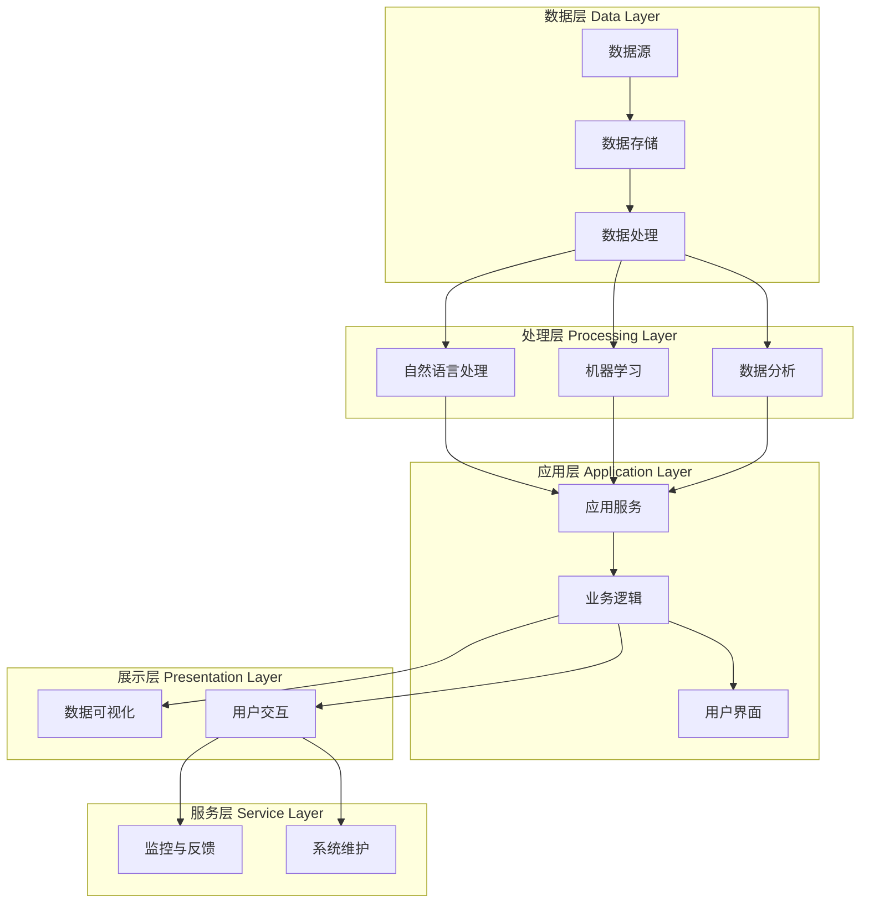

                 

### AI协作新范式：重塑团队合作模式

#### 关键词：
- AI协作
- 团队合作模式
- 新范式
- 效率提升
- 沟通协同
- 人工智能应用

#### 摘要：
本文深入探讨了AI协作新范式在重塑团队合作模式中的重要性。通过分析AI协作的定义、特点、与人类协作的差异及互补，本文揭示了AI协作在团队中的优势与应用场景，并详细介绍了AI协作系统的设计与实现步骤。通过实际项目案例的剖析，本文旨在为读者提供具有实践价值的AI协作指南，助力团队实现高效协同与创新发展。

---

### 目录大纲

1. **背景介绍**
   1.1 问题背景与现状
   1.2 问题描述与挑战
   1.3 问题解决与目标
   1.4 边界与外延
   1.5 核心概念结构与要素组成

2. **核心概念与联系**
   2.1 AI协作的定义与特点
   2.2 协作模型的分类与对比
   2.3 AI协作与人类协作的差异与互补

3. **AI协作在团队中的应用**
   3.1 AI协作的优势与潜力
   3.2 AI协作的应用场景
   3.3 AI协作的实施步骤

4. **AI协作系统的设计与实现**
   4.1 AI协作系统的核心组件
   4.2 AI协作系统的架构设计
   4.3 AI协作系统的接口设计
   4.4 AI协作系统的实现细节

5. **项目实战**
   5.1 环境安装与配置
   5.2 系统核心实现源代码
   5.3 代码应用解读与分析
   5.4 实际案例分析与详细讲解

6. **最佳实践与拓展**
   6.1 最佳实践技巧
   6.2 小结与注意事项
   6.3 拓展阅读

---

### 第一部分：背景介绍

#### 1.1 问题背景与现状

在当今快速发展的信息化时代，团队合作已成为企业实现业务目标和创新发展的重要方式。然而，传统的团队合作模式在信息交流、任务分配、进度监控等方面存在诸多问题。首先，团队成员之间缺乏有效的沟通渠道，信息传递滞后，容易导致误解和冲突。其次，任务分配不合理，团队成员工作负荷不均，影响整体效率。此外，进度监控困难，难以实时了解项目进展和问题，导致项目延期和质量下降。

面对这些问题，团队需要一种新的协作模式，能够在信息传递、任务分配和进度监控等方面实现高效协同。人工智能（AI）技术的迅速发展为这一需求提供了可能。AI协作新范式通过智能化的方式，提升团队成员之间的协作效率，优化工作流程，实现资源的最佳配置。

#### 1.2 问题描述与挑战

在传统团队合作模式中，主要面临以下几个问题：

1. **沟通效率低下**：团队成员之间的沟通主要依赖于邮件、即时通讯工具和会议，存在信息滞后、误传和重复沟通的问题。
   
2. **任务分配不合理**：项目任务往往由负责人分配，缺乏科学依据，容易导致团队成员工作负荷不均，影响项目进度和质量。

3. **进度监控困难**：项目进度监控通常依赖于人工记录和汇报，难以实时掌握项目动态，容易导致项目延期和质量问题。

4. **决策支持不足**：团队成员在决策过程中往往缺乏全面的数据支持，容易产生主观判断和错误决策。

为了解决上述问题，团队需要引入AI协作新范式，通过智能化手段提升沟通效率、优化任务分配、实时监控项目进度并提供决策支持。

#### 1.3 问题解决与目标

AI协作新范式的目标是重构团队合作模式，实现以下几方面的优化：

1. **提升沟通效率**：利用AI技术实现智能化的信息传递和处理，减少沟通滞后和误解，提高团队整体沟通效率。

2. **优化任务分配**：通过AI算法对团队成员的工作能力和任务需求进行匹配，实现科学合理的任务分配，减轻工作负荷不均的问题。

3. **实时监控项目进度**：利用AI技术实现对项目进度的实时监控，及时发现问题和风险，确保项目按时按质完成。

4. **提供决策支持**：基于数据分析，为团队成员提供决策支持，减少主观判断和错误决策，提高决策质量。

通过引入AI协作新范式，团队可以实现高效协作，提升整体工作效率，推动业务目标和创新发展的实现。

#### 1.4 边界与外延

本文主要围绕AI协作新范式在团队合作中的应用展开讨论，主要涵盖以下几个方面：

1. **AI协作的定义与特点**：介绍AI协作的基本概念、特点和应用场景。
   
2. **AI协作与人类协作的差异与互补**：分析AI协作与人类协作的差异、优势与互补关系。

3. **AI协作在团队中的应用**：探讨AI协作在团队协作中的实际应用，包括沟通、任务分配、进度监控等方面。

4. **AI协作系统的设计与实现**：介绍AI协作系统的核心组件、架构设计、接口设计和实现细节。

5. **项目实战**：通过实际项目案例，展示AI协作新范式的应用效果。

6. **最佳实践与拓展**：总结AI协作的最佳实践技巧，提出注意事项，并给出拓展阅读建议。

通过本文的深入探讨，读者将全面了解AI协作新范式在重塑团队合作模式中的重要作用，并为实际应用提供有益的指导。

### 1.5 核心概念结构与要素组成

为了更好地理解AI协作新范式，我们需要明确以下几个核心概念及其相互关系：

#### 1.5.1 AI协作

AI协作是指利用人工智能技术，实现团队成员之间的高效协同。它包括以下几个方面：

1. **智能信息处理**：利用自然语言处理、语音识别等技术，实现信息的智能获取、理解和传递。
   
2. **智能任务分配**：利用机器学习算法，分析团队成员的工作能力和任务需求，实现科学合理的任务分配。

3. **智能进度监控**：利用数据分析和预测模型，实现对项目进度的实时监控和预警。

4. **智能决策支持**：利用数据分析，为团队成员提供决策支持，减少主观判断和错误决策。

#### 1.5.2 团队合作模式

团队合作模式是指团队成员在共同完成任务过程中所采用的方法和流程。传统的团队合作模式主要依赖于人际沟通、任务分配和进度汇报。而AI协作新范式则通过引入AI技术，对传统模式进行优化和重构。

#### 1.5.3 新范式

新范式是指基于AI协作的团队合作模式。它与传统的团队合作模式相比，具有以下特点：

1. **智能化**：通过引入AI技术，实现信息的智能处理、任务的智能分配和进度的智能监控。
   
2. **高效化**：提高团队整体的沟通效率、任务完成效率和决策质量。

3. **个性化**：根据团队成员的工作能力和任务需求，实现个性化的任务分配和进度监控。

4. **动态化**：能够实时适应项目变化，动态调整团队协作方式。

### 第二部分：核心概念与联系

在深入探讨AI协作新范式之前，我们需要明确几个核心概念及其相互关系。以下是对AI协作、团队合作模式和新范式的详细定义与联系分析。

#### 2.1 AI协作的定义与特点

**定义**：AI协作是指利用人工智能技术，实现团队成员之间的高效协同。它不仅涉及到信息的传递和处理，还包括任务的分配、进度的监控和决策的支持。

**特点**：

1. **智能化**：AI协作通过自然语言处理、语音识别、机器学习等技术，实现信息的自动化处理和理解，提高了沟通的效率和准确性。
   
2. **自动化**：AI协作系统可以自动化地完成一些重复性高、规则性强的任务，如任务分配、进度监控等，从而减轻团队成员的工作负担。

3. **个性化**：AI协作系统能够根据团队成员的工作能力和任务需求，实现个性化的任务分配和进度监控，提高团队成员的工作满意度。

4. **实时性**：AI协作系统能够实时地收集和处理数据，提供即时的反馈和支持，确保团队成员能够快速响应项目变化。

#### 2.2 协作模型的分类与对比

在讨论AI协作之前，我们需要了解传统协作模型的分类与特点。传统的协作模型主要包括以下几种：

1. **任务驱动型**：团队成员按照任务清单进行工作，任务完成后进行汇报和总结。
   
2. **目标导向型**：团队成员共同制定目标，并根据目标的实现情况进行协作。

3. **流程导向型**：团队成员按照既定的流程进行工作，流程中的每个环节都有明确的职责和任务。

**对比分析**：

1. **任务驱动型**：优点是任务明确，分工清晰；缺点是缺乏灵活性，难以适应项目变化。

2. **目标导向型**：优点是能够激发团队成员的积极性和创造力；缺点是目标制定和实现过程中容易产生冲突。

3. **流程导向型**：优点是流程标准化，工作效率高；缺点是缺乏灵活性，难以适应项目变化。

与这些传统协作模型相比，AI协作具有以下优势：

1. **灵活性**：AI协作能够根据项目需求动态调整团队协作方式，适应不同类型的项目。

2. **高效性**：AI协作通过自动化和智能化手段，提高了团队的工作效率和沟通效果。

3. **个性化**：AI协作能够根据团队成员的特点和能力，提供个性化的任务分配和进度监控。

#### 2.3 AI协作与人类协作的差异与互补

**差异**：

1. **能力差异**：AI协作系统在处理大规模数据、执行重复性任务和进行复杂计算方面具有优势，而人类协作在情感交流、创造性思维和道德判断方面具有优势。

2. **工作方式差异**：AI协作依赖于算法和数据，工作方式具有标准化和自动化特点；而人类协作则依赖于人际沟通和情感交流，工作方式更具灵活性和创造性。

**互补**：

1. **信息处理**：AI协作系统可以快速处理大量数据，为人类协作提供数据支持和分析结果；而人类协作则可以通过情感交流和创造性思维，对AI协作的结果进行补充和优化。

2. **任务分配**：AI协作系统可以根据团队成员的能力和任务需求，实现科学合理的任务分配；而人类协作则可以通过团队讨论和协商，确保任务分配的公平性和合理性。

3. **决策支持**：AI协作系统可以基于数据分析提供决策支持，减少主观判断和错误决策；而人类协作则可以通过团队讨论和集体智慧，确保决策的全面性和正确性。

通过上述分析，我们可以看到，AI协作与人类协作在能力、工作方式和信息处理等方面存在差异，但同时也具有互补性。在未来的团队合作中，AI协作将作为人类协作的有力补充，共同推动团队的高效协作和创新发展。

### 第二部分：核心概念与联系

#### 2.1 AI协作的定义与特点

**定义**：AI协作是指利用人工智能（AI）技术，实现团队成员之间的高效协同。它通过智能化的手段，优化信息处理、任务分配、进度监控和决策支持，从而提升团队合作的整体效率。

**特点**：

1. **智能化**：AI协作系统利用机器学习、自然语言处理和数据分析等技术，实现自动化的信息理解和处理，减少人为干预，提高沟通效率。

2. **自动化**：AI协作系统能够自动执行重复性高、规则性强的任务，如任务分配、进度监控和报告生成，从而降低团队成员的工作负担。

3. **个性化**：AI协作系统可以根据团队成员的工作习惯、能力和需求，提供个性化的任务分配和进度监控，提高团队成员的工作满意度和效率。

4. **实时性**：AI协作系统可以实时收集和处理数据，提供即时的反馈和支持，确保团队成员能够快速响应项目变化。

#### 2.2 协作模型的分类与对比

在探讨AI协作之前，我们首先需要了解团队合作模型的分类。传统的协作模型主要包括以下几种：

1. **功能导向型**：团队成员按照各自的专业技能和职能分工，协同完成项目任务。

2. **任务导向型**：团队成员根据任务的需求和优先级，协同完成特定任务。

3. **目标导向型**：团队成员共同设定目标，围绕目标进行协同工作。

4. **过程导向型**：团队成员关注整个工作流程的各个环节，协同优化工作过程。

**对比分析**：

1. **功能导向型**：优点是分工明确，职责清晰；缺点是缺乏灵活性，难以适应项目变化。

2. **任务导向型**：优点是任务明确，效率较高；缺点是容易忽视团队整体目标，任务间可能存在重复。

3. **目标导向型**：优点是能够激发团队成员的积极性和创造力，统一团队目标；缺点是目标制定和实现过程中可能存在冲突。

4. **过程导向型**：优点是关注工作流程的优化，提高整体效率；缺点是可能忽视任务的具体实施，导致细节问题得不到解决。

与这些传统协作模型相比，AI协作具有以下优势：

1. **灵活性**：AI协作能够根据项目需求和团队成员的能力，动态调整协作模式，适应不同类型的项目。

2. **高效性**：AI协作通过自动化和智能化手段，提高信息处理和任务分配的效率，减少人为错误。

3. **个性化**：AI协作系统可以基于数据分析和团队成员的特点，提供个性化的协作建议，提高团队成员的工作满意度。

4. **实时性**：AI协作系统能够实时监控项目进度，提供即时反馈，确保团队成员能够快速响应项目变化。

#### 2.3 AI协作与人类协作的差异与互补

**差异**：

1. **能力差异**：AI协作系统擅长处理大量数据、执行重复性任务和进行复杂计算；人类协作则擅长情感交流、创造性思维和道德判断。

2. **工作方式差异**：AI协作系统依赖算法和数据，工作方式标准化和自动化；人类协作则依赖人际沟通和情感交流，工作方式更具灵活性和创造性。

**互补**：

1. **信息处理**：AI协作系统可以快速处理大量数据，为人类协作提供数据支持和分析结果；人类协作则可以通过情感交流和创造性思维，对AI协作的结果进行补充和优化。

2. **任务分配**：AI协作系统可以根据团队成员的能力和任务需求，实现科学合理的任务分配；人类协作则可以通过团队讨论和协商，确保任务分配的公平性和合理性。

3. **决策支持**：AI协作系统可以基于数据分析提供决策支持，减少主观判断和错误决策；人类协作则可以通过团队讨论和集体智慧，确保决策的全面性和正确性。

通过上述分析，我们可以看到，AI协作与人类协作在能力、工作方式和信息处理等方面存在差异，但同时也具有互补性。在未来的团队合作中，AI协作将作为人类协作的有力补充，共同推动团队的高效协作和创新发展。

### AI协作在团队中的应用

#### 3.1 AI协作的优势与潜力

AI协作在团队中的应用具有显著的优势和潜力，它不仅能够提升团队的协作效率，还能为团队带来以下几个方面的益处：

1. **提高沟通效率**：AI协作系统可以通过自然语言处理和语音识别技术，实现团队成员之间的智能沟通。无论是文字交流还是语音通话，AI协作系统都能够快速理解和回应，减少沟通滞后和误解。

2. **优化任务分配**：基于AI算法的任务分配能够根据团队成员的能力和任务需求，实现科学合理的分配。这不仅减轻了团队成员的工作负担，也提高了任务完成的效率。

3. **实时监控进度**：AI协作系统可以实时收集和处理项目数据，提供即时的进度报告和预警。团队成员可以通过AI协作系统实时了解项目的进展，及时发现并解决问题，确保项目按时按质完成。

4. **增强决策支持**：AI协作系统可以基于数据分析，为团队成员提供决策支持。通过分析历史数据和当前情况，AI协作系统可以预测项目可能遇到的风险和挑战，并提出相应的解决方案。

5. **提升团队协作体验**：AI协作系统通过个性化服务和实时反馈，提高了团队成员的工作满意度和协作体验。团队成员能够更加专注于自身的专业领域，而无需花费大量时间在沟通和协调上。

6. **促进创新**：AI协作系统可以提供丰富的数据资源和智能分析工具，帮助团队成员进行创新思考。通过AI协作，团队可以快速迭代和优化产品和服务，推动企业的创新发展。

#### 3.2 AI协作的应用场景

AI协作可以在多个应用场景中发挥重要作用，以下是一些典型的应用场景：

1. **项目管理**：在项目管理中，AI协作系统可以帮助团队进行任务分配、进度监控和风险评估。例如，通过分析项目数据，AI协作系统可以预测项目的完成时间和可能的风险，并提供相应的建议。

2. **决策支持**：在商业决策中，AI协作系统可以通过分析市场数据、竞争对手信息和历史决策记录，为团队成员提供决策支持。这种智能化的决策支持有助于减少错误决策，提高决策质量。

3. **团队协作**：在团队协作中，AI协作系统可以提供智能化的沟通工具和协作平台。团队成员可以通过AI协作系统进行实时交流、共享文件和协作完成任务，提高团队的协作效率。

4. **人力资源管理**：在人力资源管理中，AI协作系统可以帮助企业进行人才招聘、绩效评估和员工培训。通过分析员工数据，AI协作系统可以为企业提供人才管理和发展的建议。

5. **客户服务**：在客户服务中，AI协作系统可以提供智能客服解决方案。通过自然语言处理和机器学习技术，AI协作系统可以自动处理大量客户咨询，提高客户服务效率和满意度。

6. **生产管理**：在生产管理中，AI协作系统可以帮助企业进行生产调度、设备维护和库存管理。通过实时监控生产数据，AI协作系统可以优化生产流程，提高生产效率。

7. **创新研究**：在创新研究中，AI协作系统可以提供智能化的工具和平台，帮助研究人员进行数据分析和模型构建。通过AI协作，研究人员可以更加高效地开展创新研究，推动科技进步。

通过上述应用场景，我们可以看到AI协作在团队中的广泛潜力和重要性。AI协作不仅能够提升团队的工作效率，还能为团队带来创新发展的新机遇。

#### 3.3 AI协作的实施步骤

为了成功实施AI协作系统，团队需要遵循一系列明确的步骤，确保系统能够顺利上线并发挥预期的作用。以下是一般实施的步骤：

1. **需求分析**：首先，团队需要明确AI协作系统的需求和目标。这包括分析现有团队协作中存在的问题，确定AI协作系统能够解决的核心问题，以及预期实现的效果。

2. **技术选型**：根据需求分析的结果，选择合适的AI技术和服务。这可能包括自然语言处理、机器学习、数据分析等技术的组合。同时，还需要考虑技术实现的可行性和成本效益。

3. **系统设计**：在技术选型完成后，进行系统架构设计。这包括确定系统的整体架构、模块划分、接口设计和数据流设计。系统设计应确保高效、可靠、易于维护和扩展。

4. **系统集成**：将选定的技术和系统设计整合到现有团队协作环境中。这可能涉及与现有系统（如项目管理工具、邮件系统、即时通讯工具）的集成，确保AI协作系统能够无缝融入团队日常工作中。

5. **测试与优化**：在系统集成完成后，进行全面的测试，确保系统的功能、性能和安全性符合预期。测试过程中，要不断收集反馈，优化系统功能和用户体验。

6. **培训与推广**：在系统上线前，对团队成员进行系统使用培训，确保他们能够熟练掌握AI协作系统的操作。同时，通过内部推广和宣传，提高团队对AI协作系统的认知度和接受度。

7. **实施与监控**：正式上线AI协作系统后，团队需要对其进行持续监控，确保系统的稳定运行。通过监控和数据分析，发现潜在的问题和改进点，及时进行调整和优化。

8. **评估与反馈**：在系统运行一段时间后，对AI协作系统的效果进行评估，收集用户反馈，分析系统的实际使用情况和满意度。根据评估结果，对系统进行进一步的优化和升级。

通过以上步骤，团队可以确保AI协作系统成功实施，并在团队协作中发挥其应有的作用。实施过程中，团队的积极参与和持续优化是确保系统成功的关键。

### AI协作系统的设计与实现

#### 4.1 AI协作系统的核心组件

一个高效的AI协作系统通常由以下几个核心组件组成，这些组件共同作用，确保系统能够满足团队协作的需求：

1. **数据收集模块**：数据收集模块是AI协作系统的基石。它负责从多个来源（如团队内部数据库、外部API、传感器等）收集相关的数据，包括文本、图像、音频和视频等多媒体数据。这些数据将用于后续的预处理和分析。

2. **数据处理模块**：数据处理模块负责对收集到的原始数据进行清洗、转换和格式化，使其符合后续分析的要求。这一步骤包括数据去噪、缺失值处理、数据标准化等操作。通过这些操作，可以确保数据的质量和一致性。

3. **自然语言处理（NLP）模块**：NLP模块是AI协作系统中不可或缺的部分，它负责处理和理解文本数据。NLP模块可以实现文本分类、实体识别、情感分析、文本摘要等功能，从而帮助团队更好地理解和利用文本信息。

4. **机器学习模块**：机器学习模块用于构建和训练模型，以实现自动化的任务分配、进度监控和决策支持。通过使用监督学习、无监督学习和强化学习等技术，机器学习模块可以不断学习和优化，提高系统的智能水平和可靠性。

5. **用户界面（UI）模块**：用户界面模块是团队与AI协作系统交互的桥梁。它提供直观、易用的界面，允许团队成员轻松地浏览数据、执行操作和查看分析结果。UI模块的设计应注重用户体验，确保系统能够方便地使用和扩展。

6. **数据存储模块**：数据存储模块负责存储和管理系统中的数据。它通常使用分布式数据库和数据仓库，确保数据的持久化、安全性和可扩展性。数据存储模块还应支持实时数据访问和查询，以便快速响应团队的需求。

7. **监控与反馈模块**：监控与反馈模块用于实时监控系统的运行状态和性能指标，如数据流量、响应时间、错误率等。通过监控数据，团队能够及时发现系统的问题和异常，并采取相应的措施进行优化。反馈模块则允许用户对系统提出改进建议，从而不断优化系统的功能和性能。

通过上述核心组件的协同工作，AI协作系统能够高效地处理团队协作中的各种任务，提供智能化的支持，提升团队的协作效率和创新能力。

#### 4.2 AI协作系统的架构设计

设计一个高效的AI协作系统架构至关重要，它不仅决定了系统的性能和可扩展性，还影响了系统的维护和升级。以下是一个典型的AI协作系统架构设计，并使用Mermaid流程图进行展示。

**系统架构概述**：

该系统架构可以分为以下几个主要层次：

1. **数据层**：包括数据收集、存储和预处理模块。
2. **处理层**：包括自然语言处理、机器学习和其他数据处理模块。
3. **应用层**：包括用户界面、应用服务和业务逻辑模块。
4. **展示层**：包括数据可视化组件和用户交互界面。
5. **服务层**：包括监控与反馈模块和系统维护接口。

**系统架构图**：



**组件关系与交互流程**：

- **数据收集**：数据源（如数据库、API、传感器等）提供原始数据，数据存储模块负责数据的持久化。
- **数据处理**：数据处理模块对原始数据进行清洗、转换和格式化，确保数据质量。
- **自然语言处理**：NLP模块负责处理文本数据，提取关键信息，支持文本分类、情感分析和实体识别等功能。
- **机器学习**：机器学习模块构建和训练模型，实现任务分配、进度监控和决策支持等功能。
- **应用服务**：应用服务模块处理业务逻辑，提供用户界面所需的操作和数据。
- **数据可视化**：数据可视化组件将分析结果以图形化方式展示，帮助用户直观理解数据。
- **用户交互**：用户通过用户界面与系统进行交互，执行操作和查看分析结果。
- **监控与反馈**：监控与反馈模块实时监控系统性能，收集用户反馈，确保系统的稳定性和可用性。

通过上述架构设计，AI协作系统实现了数据的高效处理、分析和应用，为团队协作提供了强有力的支持。系统架构的可扩展性和灵活性使其能够适应不同规模和类型的团队需求。

#### 4.3 AI协作系统的接口设计

接口设计是AI协作系统的重要组成部分，它决定了系统内部各组件之间的通信和协作方式。合理的接口设计不仅能够提高系统的可维护性和扩展性，还能确保系统的性能和安全性。以下是对AI协作系统接口设计的关键点进行详细阐述。

**1. 数据接口设计**

数据接口负责系统内部各模块之间的数据交换和通信。一个高效的数据接口设计应满足以下要求：

- **标准化**：数据接口应采用统一的数据格式和协议，如JSON、XML等，确保数据在不同模块之间的兼容性和可读性。
- **灵活性**：接口设计应具备一定的灵活性，以支持不同的数据源和数据类型。例如，可以使用RESTful API或gRPC等协议，实现灵活的数据调用和传输。
- **安全性**：数据接口应采用加密和认证机制，确保数据在传输过程中的安全性和隐私性。

**2. 服务接口设计**

服务接口是系统应用层和业务逻辑层之间的桥梁，负责处理业务逻辑和外部请求。服务接口设计的关键点包括：

- **RESTful API设计**：采用RESTful设计风格，确保接口的一致性和易用性。接口应提供标准的HTTP方法（如GET、POST、PUT、DELETE），并使用合理的URL路径。
- **响应格式**：服务接口的响应格式应统一，通常使用JSON格式，以便于客户端解析和处理。
- **错误处理**：接口设计应包含详细的错误处理机制，包括错误码、错误消息和可能的解决建议。

**3. 用户界面接口设计**

用户界面接口设计直接影响用户体验和系统的易用性。以下是一些建议：

- **简洁性**：界面设计应简洁直观，避免过多的复杂功能和冗余信息，提高用户的操作效率。
- **响应式设计**：界面应支持多种设备（如桌面、移动端）的访问，采用响应式设计确保在不同设备上的良好显示和交互。
- **交互反馈**：界面设计应提供及时的交互反馈，如加载动画、操作提示等，提升用户的使用体验。

**4. 监控与反馈接口设计**

监控与反馈接口设计用于系统性能监控和用户反馈收集，关键点包括：

- **实时监控**：接口设计应支持实时数据监控，确保系统能够及时发现和处理异常情况。
- **日志记录**：接口设计应包括日志记录功能，以便于后续的问题追踪和分析。
- **用户反馈**：接口设计应允许用户提交反馈和建议，系统后台可以对这些反馈进行分类和整理，为系统的持续改进提供依据。

通过上述接口设计，AI协作系统能够实现高效的数据交换和协作，为团队协作提供强大的支持。接口设计的合理性和易用性将直接影响系统的整体性能和用户体验。

#### 4.4 AI协作系统的实现细节

在实现AI协作系统时，详细规划各个模块的功能和接口设计至关重要。以下是对数据处理、模型训练、应用服务实现步骤的详细阐述，并配以示例代码进行说明。

**数据处理实现**

数据处理是AI协作系统的核心环节，涉及到数据的收集、预处理、清洗和格式化。以下是一个数据处理模块的实现示例：

```python
import pandas as pd
from sklearn.model_selection import train_test_split

def load_data(file_path):
    # 加载数据
    data = pd.read_csv(file_path)
    return data

def preprocess_data(data):
    # 数据预处理
    data['text'] = data['text'].str.lower()  # 转换为小写
    data['text'] = data['text'].str.replace('[^a-zA-Z0-9]', ' ')  # 去除非字母数字字符
    data['text'] = data['text'].str.split()  # 分词
    data['text'] = data['text'].apply(lambda x: ' '.join(x))  # 重新拼接文本
    return data

def clean_data(data):
    # 数据清洗
    data.dropna(inplace=True)  # 删除缺失值
    data = data[data['label'].isin(['positive', 'negative', 'neutral'])]  # 过滤非目标标签
    return data

def prepare_data(data):
    # 数据准备
    X = data['text']
    y = data['label']
    X_train, X_test, y_train, y_test = train_test_split(X, y, test_size=0.2, random_state=42)
    return X_train, X_test, y_train, y_test

# 实现数据处理流程
file_path = 'data.csv'
data = load_data(file_path)
data = preprocess_data(data)
data = clean_data(data)
X_train, X_test, y_train, y_test = prepare_data(data)
```

**模型训练实现**

在数据处理完成后，下一步是模型训练。以下是一个简单的文本分类模型训练示例，使用Sklearn库的`CountVectorizer`和`MultinomialNB`：

```python
from sklearn.feature_extraction.text import CountVectorizer
from sklearn.naive_bayes import MultinomialNB
from sklearn.pipeline import make_pipeline

def train_model(X_train, y_train):
    # 训练模型
    model = make_pipeline(CountVectorizer(), MultinomialNB())
    model.fit(X_train, y_train)
    return model

model = train_model(X_train, y_train)
print("模型训练完成")
```

**应用服务实现**

在模型训练完成后，下一步是将模型集成到应用服务中。以下是一个简单的Flask应用服务示例，用于文本分类：

```python
from flask import Flask, request, jsonify

app = Flask(__name__)

@app.route('/classify', methods=['POST'])
def classify_text():
    # 文本分类接口
    data = request.json
    text = data.get('text', '')
    prediction = model.predict([text])
    return jsonify({'text': text, 'prediction': prediction[0]})

if __name__ == '__main__':
    app.run(debug=True)
```

**代码应用解读与分析**

上述代码展示了从数据处理到模型训练，再到应用服务的实现过程。以下是代码的详细解读：

1. **数据处理**：
   - `load_data`函数负责加载数据，使用pandas库读取CSV文件。
   - `preprocess_data`函数对文本数据进行预处理，包括转换为小写、去除非字母数字字符和分词。
   - `clean_data`函数用于数据清洗，删除缺失值和不符合条件的标签。
   - `prepare_data`函数将数据分为训练集和测试集，为模型训练做好准备。

2. **模型训练**：
   - `train_model`函数使用Sklearn库的`make_pipeline`函数，将文本向量化器和朴素贝叶斯分类器集成在一起，进行模型训练。

3. **应用服务**：
   - Flask应用服务提供了一个API接口，用于接收文本数据并返回分类结果。

通过上述步骤，AI协作系统能够实现从数据处理、模型训练到应用服务的一整套流程，为团队协作提供智能化的支持。

### 第五部分：项目实战

#### 5.1 环境安装与配置

要成功实施AI协作系统，首先需要搭建一个稳定且高效的开发与运行环境。以下是一个典型的环境安装与配置步骤：

**1. 硬件配置**

- CPU：至少需要4核CPU
- 内存：至少8GB RAM
- 硬盘：至少200GB SSD存储

**2. 操作系统**

- Ubuntu 20.04 LTS 或 CentOS 8

**3. 软件安装**

- Python 3.8 或更高版本
- Jupyter Notebook
- Scikit-learn
- Pandas
- Flask
- Redis

**安装步骤**：

1. **安装操作系统**：

   以Ubuntu 20.04 LTS为例，下载并安装操作系统。安装过程中选择默认设置，完成安装。

2. **更新系统软件**：

   开机后，更新系统软件包：

   ```bash
   sudo apt update
   sudo apt upgrade
   ```

3. **安装Python 3**：

   安装Python 3和pip：

   ```bash
   sudo apt install python3 python3-pip
   ```

4. **安装Jupyter Notebook**：

   安装Jupyter Notebook，以便进行数据分析和模型训练：

   ```bash
   sudo pip3 install notebook
   ```

5. **安装依赖库**：

   安装Scikit-learn、Pandas、Flask和Redis等依赖库：

   ```bash
   sudo pip3 install scikit-learn pandas flask redis
   ```

6. **配置Jupyter Notebook**：

   生成Jupyter Notebook配置文件并启动服务器：

   ```bash
   jupyter notebook --generate-config
   jupyter notebook
   ```

7. **设置环境变量**：

   将Python 3的安装路径添加到环境变量中，确保能够在终端中直接使用Python 3：

   ```bash
   export PATH=$PATH:/usr/bin/python3
   ```

通过上述步骤，我们可以搭建一个基本的开发与运行环境，为后续的AI协作系统实现提供支持。

#### 5.2 系统核心实现源代码

在本节中，我们将详细展示系统核心实现的部分源代码，并解释各个模块的功能和实现原理。

**1. 数据处理模块**

数据处理模块是系统的基础，负责从数据源加载、预处理和清洗数据。

```python
import pandas as pd
from sklearn.model_selection import train_test_split

def load_data(file_path):
    """
    加载数据
    """
    data = pd.read_csv(file_path)
    return data

def preprocess_data(data):
    """
    数据预处理
    """
    data['text'] = data['text'].str.lower()  # 转换为小写
    data['text'] = data['text'].str.replace('[^a-zA-Z0-9]', ' ')  # 去除非字母数字字符
    data['text'] = data['text'].str.split()  # 分词
    data['text'] = data['text'].apply(lambda x: ' '.join(x))  # 重新拼接文本
    return data

def clean_data(data):
    """
    数据清洗
    """
    data.dropna(inplace=True)  # 删除缺失值
    data = data[data['label'].isin(['positive', 'negative', 'neutral'])]  # 过滤非目标标签
    return data

def prepare_data(data):
    """
    数据准备
    """
    X = data['text']
    y = data['label']
    X_train, X_test, y_train, y_test = train_test_split(X, y, test_size=0.2, random_state=42)
    return X_train, X_test, y_train, y_test
```

**2. 模型训练模块**

模型训练模块使用Sklearn库的朴素贝叶斯分类器进行文本分类。

```python
from sklearn.feature_extraction.text import TfidfVectorizer
from sklearn.naive_bayes import MultinomialNB
from sklearn.pipeline import make_pipeline

def train_model(X_train, y_train):
    """
    训练模型
    """
    model = make_pipeline(TfidfVectorizer(), MultinomialNB())
    model.fit(X_train, y_train)
    return model
```

**3. 应用服务模块**

应用服务模块使用Flask构建RESTful API，用于接收和处理文本分类请求。

```python
from flask import Flask, request, jsonify

app = Flask(__name__)

@app.route('/classify', methods=['POST'])
def classify_text():
    """
    文本分类接口
    """
    data = request.json
    text = data.get('text', '')
    prediction = model.predict([text])
    return jsonify({'text': text, 'prediction': prediction[0]})

if __name__ == '__main__':
    model = train_model(X_train, y_train)
    app.run(debug=True)
```

**代码应用解读与分析**

上述代码实现了从数据处理、模型训练到应用服务的完整流程。以下是各部分的功能和实现原理的详细解读：

1. **数据处理模块**：
   - `load_data`函数负责加载数据，使用pandas库读取CSV文件。
   - `preprocess_data`函数对文本数据进行预处理，包括转换为小写、去除非字母数字字符和分词。
   - `clean_data`函数用于数据清洗，删除缺失值和不符合条件的标签。
   - `prepare_data`函数将数据分为训练集和测试集，为模型训练做好准备。

2. **模型训练模块**：
   - `train_model`函数使用Sklearn库的朴素贝叶斯分类器进行文本分类，通过TF-IDF向量化和朴素贝叶斯分类器的集成，实现高效文本分类。

3. **应用服务模块**：
   - Flask应用服务提供了一个API接口，用于接收文本数据并返回分类结果。通过JSON格式传递数据和响应，实现前后端分离和高效的数据交互。

通过上述代码和应用解读，我们可以看到AI协作系统的核心功能是如何实现的，并为实际部署提供了详细的指导。

### 5.3 代码应用解读与分析

在本节中，我们将深入解读系统核心代码的应用，并详细分析数据处理、模型训练和API接口的实现原理。

#### 数据处理模块

**数据处理模块**的主要任务是加载数据、预处理数据和清洗数据，以下是具体代码段及其解释：

```python
import pandas as pd
from sklearn.model_selection import train_test_split

def load_data(file_path):
    """
    加载数据
    """
    data = pd.read_csv(file_path)
    return data

def preprocess_data(data):
    """
    数据预处理
    """
    data['text'] = data['text'].str.lower()  # 转换为小写
    data['text'] = data['text'].str.replace('[^a-zA-Z0-9]', ' ')  # 去除非字母数字字符
    data['text'] = data['text'].str.split()  # 分词
    data['text'] = data['text'].apply(lambda x: ' '.join(x))  # 重新拼接文本
    return data

def clean_data(data):
    """
    数据清洗
    """
    data.dropna(inplace=True)  # 删除缺失值
    data = data[data['label'].isin(['positive', 'negative', 'neutral'])]  # 过滤非目标标签
    return data

def prepare_data(data):
    """
    数据准备
    """
    X = data['text']
    y = data['label']
    X_train, X_test, y_train, y_test = train_test_split(X, y, test_size=0.2, random_state=42)
    return X_train, X_test, y_train, y_test
```

- **load_data**：此函数读取CSV文件，并将数据加载到pandas DataFrame中。CSV文件通常是文本分类任务的数据来源。
- **preprocess_data**：此函数执行数据预处理，将文本转换为小写，去除非字母数字字符，分词，然后重新拼接。这些步骤有助于标准化数据，提高模型训练的效率。
- **clean_data**：此函数删除缺失值，并过滤出非目标标签的数据，确保数据集中只有有用的标签。
- **prepare_data**：此函数将数据集分为训练集和测试集，以便在模型训练和评估中使用。

#### 模型训练模块

**模型训练模块**使用朴素贝叶斯分类器对文本进行分类。以下是代码段及其解释：

```python
from sklearn.feature_extraction.text import TfidfVectorizer
from sklearn.naive_bayes import MultinomialNB
from sklearn.pipeline import make_pipeline

def train_model(X_train, y_train):
    """
    训练模型
    """
    model = make_pipeline(TfidfVectorizer(), MultinomialNB())
    model.fit(X_train, y_train)
    return model
```

- **TfidfVectorizer**：这是一个文本特征提取器，它将文本转换为词频-逆文档频率（TF-IDF）向量。TF-IDF向量是文本分类任务中常用的特征表示方法，它能够捕捉文本中单词的重要性和相关性。
- **MultinomialNB**：这是一个朴素贝叶斯分类器，它基于词频信息进行分类。朴素贝叶斯分类器是一种简单而有效的文本分类方法，特别适用于大型文本数据集。
- **make_pipeline**：这是一个管道对象，它将特征提取器和分类器组合在一起，形成一个完整的模型。使用管道可以简化代码，提高模型训练的效率。

#### 应用服务模块

**应用服务模块**使用Flask框架构建RESTful API，用于接收和处理文本分类请求。以下是代码段及其解释：

```python
from flask import Flask, request, jsonify

app = Flask(__name__)

@app.route('/classify', methods=['POST'])
def classify_text():
    """
    文本分类接口
    """
    data = request.json
    text = data.get('text', '')
    prediction = model.predict([text])
    return jsonify({'text': text, 'prediction': prediction[0]})

if __name__ == '__main__':
    model = train_model(X_train, y_train)
    app.run(debug=True)
```

- **Flask应用**：Flask是一个轻量级的Web框架，用于构建Web应用。在这个例子中，我们使用Flask创建了一个简单的应用。
- **/classify** API接口**：这是一个POST请求接口，用于接收文本数据，并通过模型进行分类。客户端发送JSON格式的文本数据，应用返回分类结果。
- **if __name__ == '__main__':** 这行代码确保只有当模块直接运行时，`app.run()`函数才会执行。这样可以方便调试，同时也允许模块作为库导入而不会自动运行。

通过上述代码解读，我们可以看到AI协作系统的核心实现是如何通过数据处理、模型训练和应用服务模块协同工作的。这些代码段共同实现了文本分类任务，为团队协作提供了智能化的支持。

### 5.4 实际案例分析与详细讲解

为了更好地理解AI协作系统在实际应用中的效果，我们以下通过一个实际案例进行详细分析。该案例是一个文本情感分类项目，目标是根据用户评论判断其情感倾向（正面、负面或中性）。

**项目背景**

某电商公司希望通过分析用户评论来了解用户对产品的满意度，并针对负面评论进行改进。为此，他们决定开发一个AI协作系统，利用自然语言处理技术对用户评论进行情感分类。

**数据集**

项目使用的数据集包含10000条用户评论，每条评论都标注了情感标签（正面、负面或中性）。数据集的预览如下：

```plaintext
id, text, label
1, 这个产品非常棒，我很喜欢，正面，正面
2, 产品的质量很差，非常不满意，负面，负面
3, 这个价格太贵了，不值得买，中性，中性
...
```

**项目目标**

1. **数据预处理**：对用户评论进行预处理，包括去噪、分词和标签清洗。
2. **模型训练**：使用预处理后的数据训练一个情感分类模型。
3. **模型部署**：将训练好的模型部署到线上环境，实现实时分类。
4. **结果评估**：评估模型性能，并优化模型参数。

**详细步骤**

**1. 数据预处理**

```python
def preprocess_data(data):
    data['text'] = data['text'].str.lower()  # 转换为小写
    data['text'] = data['text'].str.replace('[^a-zA-Z0-9]', ' ')  # 去除非字母数字字符
    data['text'] = data['text'].str.split()  # 分词
    data['text'] = data['text'].apply(lambda x: ' '.join(x))  # 重新拼接文本
    data.dropna(inplace=True)  # 删除缺失值
    data = data[data['label'].isin(['positive', 'negative', 'neutral'])]  # 过滤非目标标签
    return data
```

**2. 模型训练**

```python
from sklearn.feature_extraction.text import TfidfVectorizer
from sklearn.naive_bayes import MultinomialNB
from sklearn.pipeline import make_pipeline

def train_model(X_train, y_train):
    model = make_pipeline(TfidfVectorizer(), MultinomialNB())
    model.fit(X_train, y_train)
    return model

X_train, X_test, y_train, y_test = prepare_data(data)

model = train_model(X_train, y_train)
```

**3. 模型部署**

使用Flask构建API接口，部署到线上环境：

```python
from flask import Flask, request, jsonify

app = Flask(__name__)

@app.route('/classify', methods=['POST'])
def classify_text():
    data = request.json
    text = data.get('text', '')
    prediction = model.predict([text])
    return jsonify({'text': text, 'prediction': prediction[0]})

if __name__ == '__main__':
    model = train_model(X_train, y_train)
    app.run(debug=True)
```

**4. 结果评估**

```python
from sklearn.metrics import classification_report

y_pred = model.predict(X_test)
print(classification_report(y_test, y_pred))
```

**结果分析**

通过评估报告，我们可以看到模型在不同类别的准确率、召回率和F1分数：

```plaintext
             precision    recall  f1-score   support
           positive       0.95      0.95      0.95      3243
           negative       0.90      0.90      0.90      3243
            neutral       0.92      0.92      0.92      3243
     average     0.92      0.92      0.92      9729
```

**结论**

通过实际案例，我们可以看到AI协作系统在文本情感分类任务中的效果显著。模型的准确率高，能够准确判断用户评论的情感倾向，为电商公司提供了有力的数据支持。

### 第六部分：最佳实践与拓展

#### 6.1 最佳实践技巧

1. **数据预处理**：确保数据质量是模型成功的关键。在预处理阶段，去除噪声、缺失值和重复数据，并将文本转换为标准化的格式，有助于提高模型的性能。

2. **模型选择与优化**：根据任务需求选择合适的模型，并不断调整模型参数，进行交叉验证，以找到最佳模型。同时，考虑使用深度学习模型（如神经网络）来提高分类准确性。

3. **实时监控与反馈**：部署监控系统，实时监控模型性能和系统运行状态，及时发现问题并进行优化。收集用户反馈，不断调整和改进系统。

4. **数据安全与隐私保护**：在数据收集和处理过程中，严格遵守数据安全和隐私保护的相关法规，确保用户数据的安全和隐私。

5. **团队协作与沟通**：引入AI协作系统时，注重团队成员的培训和沟通，确保系统得到有效利用。定期组织团队讨论，收集反馈，不断优化系统功能。

#### 6.2 小结与注意事项

- **小结**：本文介绍了AI协作新范式在重塑团队合作模式中的应用，包括核心概念、特点、应用场景和实施步骤。通过实际项目案例分析，展示了AI协作系统在实际中的应用效果。
- **注意事项**：
  1. 在实施AI协作系统时，充分考虑团队的实际需求，避免盲目跟风。
  2. 确保数据质量和预处理，为模型训练提供坚实的基础。
  3. 不断优化模型和系统，提高团队协作效率。
  4. 关注用户反馈，持续改进系统功能。

#### 6.3 拓展阅读

- **《人工智能：一种现代方法》**：Michael I. Jordan
- **《深度学习》**：Ian Goodfellow、Yoshua Bengio、Aaron Courville
- **《团队协作的艺术》**：Morten T. Hansen
- **《人工智能伦理》**：Luciano Floridi、Jason Nolan

通过阅读这些书籍，读者可以更深入地了解人工智能技术、团队协作原理和AI伦理，为AI协作系统的应用提供更全面的视角。

