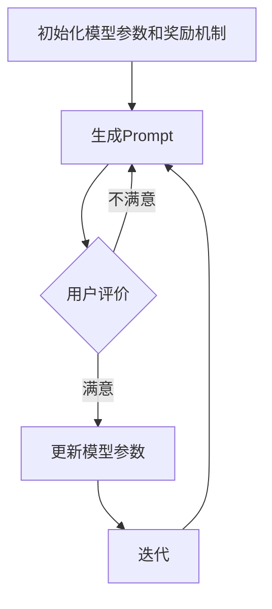
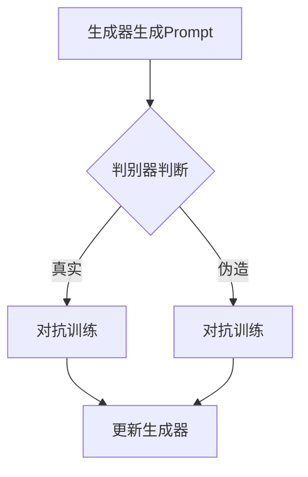
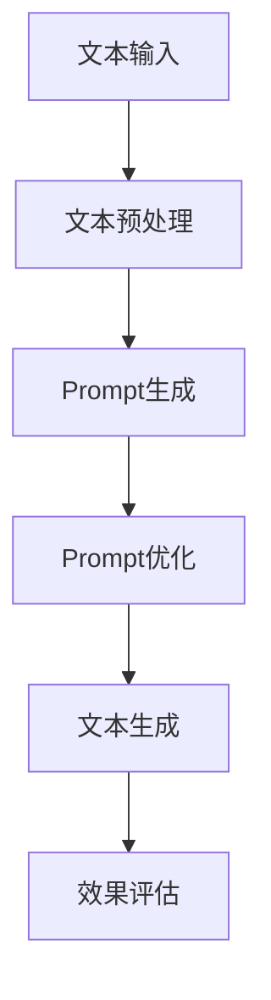
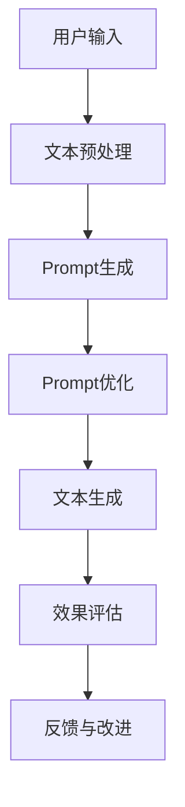

                 

### 引言

随着人工智能（AI）技术的飞速发展，大型语言模型（LLM）已成为自然语言处理（NLP）领域的重要工具。LLM凭借其强大的文本生成能力，广泛应用于对话系统、文本摘要、问答系统、机器翻译等多个领域，极大提升了人工智能应用的效率和准确性。然而，LLM的性能高度依赖于输入的Prompt设计，一个优秀的Prompt可以显著提升模型的响应质量和响应速度。

Prompt设计在AI辅助应用中扮演着至关重要的角色。一个清晰、精确且具有引导性的Prompt可以帮助模型更好地理解用户意图，提高回答的准确性和相关性。同时，Prompt设计还需要考虑到上下文信息的利用、问题的抽象层次以及模型的能力边界等多方面因素。因此，如何进行高效且精确的Prompt设计，成为了当前AI研究和应用中的关键问题。

本文将围绕AI辅助Prompt设计展开，通过以下章节逐一探讨：

1. **问题背景与概念解析**：介绍人工智能的发展背景、LLM的应用场景及Prompt设计的基本概念。
2. **Prompt设计原理**：深入探讨Prompt设计的基础原则、方法及相关的数学模型和算法原理。
3. **AI辅助Prompt设计实战**：介绍环境准备、系统设计与实现、实战案例以及具体的实现细节和效果评估。
4. **提升LLM应用效率**：讨论Prompt优化策略和实际应用中的效率提升实践。

通过这些内容，本文旨在帮助读者全面了解AI辅助Prompt设计的重要性、原理和最佳实践，从而提升LLM应用的整体效率。

### 关键词

- AI
- Prompt设计
- 大型语言模型（LLM）
- 自然语言处理（NLP）
- 数学模型
- 算法原理
- 实战案例
- 效率优化

### 摘要

本文旨在深入探讨AI辅助Prompt设计的重要性及其在提升大型语言模型（LLM）应用效率方面的作用。首先，本文通过问题背景介绍，明确了人工智能与LLM的发展现状及其应用场景。随后，我们解析了Prompt设计的核心概念，包括其定义、分类、以及与AI和LLM的关系。接着，本文从基础原则、方法、数学模型和算法原理等方面详细阐述了Prompt设计的基本原理。通过实际环境准备、系统设计和实战案例，本文展示了AI辅助Prompt设计的具体实现和应用效果。最后，本文提出了Prompt优化策略和提升LLM应用效率的最佳实践，总结了当前技术发展趋势，并给出了未来研究方向。通过这些内容，本文旨在为读者提供全面的AI辅助Prompt设计指导，助力提升LLM应用的整体效率。

#### 第一部分：AI与Prompt设计概述

##### 第1章：问题背景与概念解析

**1.1 问题背景**

人工智能（AI）作为一门技术学科，旨在使计算机模拟人类智能行为，解决复杂问题。从最初的逻辑推理、知识表示，到现代的机器学习、深度学习，人工智能的发展经历了多个阶段，逐渐成为信息技术领域的重要研究方向。随着计算能力的提升和大数据的普及，AI技术得到了前所未有的发展，其在各行各业中的应用也越来越广泛，从工业自动化、金融风控到医疗诊断、智能交通等，无不体现了AI的巨大潜力。

在人工智能的发展过程中，自然语言处理（NLP）成为了一个备受关注的领域。NLP旨在让计算机理解、生成和处理人类语言，从而实现人机交互和信息检索。近年来，随着深度学习技术的进步，大型语言模型（LLM）应运而生。LLM通过学习海量文本数据，能够生成高质量的文本内容，广泛应用于对话系统、文本摘要、问答系统、机器翻译等多个场景。

然而，LLM的性能高度依赖于输入的Prompt设计。一个优秀的Prompt可以帮助模型更好地理解用户意图，提高回答的准确性和相关性。然而，如何设计一个高效、精确的Prompt，仍然是一个具有挑战性的问题。因此，AI辅助Prompt设计成为当前AI研究和应用中的关键问题。

**1.2 核心概念**

**AI简介**

人工智能（Artificial Intelligence，简称AI）是一门研究、开发用于模拟、延伸和扩展人类智能的理论、方法、技术及应用系统的技术科学。其目标是使机器能够胜任一些通常需要人类智能才能完成的复杂任务。人工智能包括多个子领域，如机器学习、计算机视觉、自然语言处理、机器人技术等。

**Prompt的定义与分类**

Prompt是用户向AI系统输入的文本或指示，用于引导系统执行特定任务或生成特定内容。一个有效的Prompt需要清晰、明确地传达用户意图，并包含必要的信息以帮助AI系统理解和生成合适的输出。

Prompt可以按不同维度进行分类：

- **按任务类型**：
  - 问答型Prompt：用于生成问答对话。
  - 文本生成型Prompt：用于生成文章、故事等文本内容。
  - 任务导向型Prompt：用于引导系统执行特定任务，如命令式指令。

- **按信息来源**：
  - 上下文依赖型Prompt：包含上下文信息，用于维持对话连贯性。
  - 无上下文依赖型Prompt：不包含上下文信息，独立生成内容。

- **按生成方式**：
  - 手动设计Prompt：由人类专家根据任务需求设计。
  - 自动生成Prompt：通过算法和机器学习模型自动生成。

**LLM的基础知识与能力**

大型语言模型（Large Language Model，简称LLM）是一种通过深度学习技术训练的模型，能够理解和生成自然语言文本。LLM的核心优势在于其能够通过学习海量文本数据，捕捉语言的复杂模式和规律，从而生成高质量的文本内容。

LLM的基础知识和能力包括：

- **文本生成能力**：LLM能够根据输入的Prompt生成连贯、自然的文本内容。
- **上下文理解能力**：LLM能够理解和维持对话上下文，生成与上下文相关的内容。
- **知识表示能力**：LLM通过学习海量文本，能够捕捉和表示丰富的知识信息。
- **多模态处理能力**：部分LLM模型能够结合文本、图像、音频等多种模态进行信息处理和生成。

**1.3 概念联系**

AI与LLM的关系

人工智能（AI）是自然语言处理（NLP）的基础，而大型语言模型（LLM）则是NLP领域中的一项重要技术。LLM作为AI的一种实现形式，依赖于AI的技术基础，如机器学习和深度学习，通过大规模文本数据训练，实现高效的文本理解和生成能力。同时，AI的其他子领域，如计算机视觉、语音识别等，也为LLM的发展提供了支持和扩展。

Prompt设计对LLM性能的影响

Prompt设计直接影响LLM的响应质量和响应速度。一个良好的Prompt能够提供明确的用户意图和上下文信息，帮助LLM更准确地理解和生成合适的文本内容。具体来说，Prompt设计的影响包括：

- **准确性**：清晰、精确的Prompt有助于模型生成与用户意图高度相关的输出。
- **连贯性**：包含上下文信息的Prompt能够帮助模型维持对话的连贯性和一致性。
- **效率**：简明扼要的Prompt能够提高模型的响应速度，减少计算开销。
- **多样性**：丰富的Prompt设计可以激发模型生成多样化的文本内容。

**1.4 边界与外延**

**Prompt设计的适用范围**

Prompt设计适用于多种AI应用场景，包括：

- **对话系统**：如聊天机器人、智能客服等，通过Prompt设计，提高对话的自然性和用户满意度。
- **文本生成**：如文章写作、故事生成、摘要生成等，通过Prompt设计，提高文本的创造性和质量。
- **问答系统**：如智能问答平台、知识图谱等，通过Prompt设计，提高问答的准确性和相关性。
- **机器翻译**：如自动翻译服务，通过Prompt设计，提高翻译的准确性和流畅性。

**Prompt设计的限制因素**

尽管Prompt设计对AI性能具有重要影响，但其在实际应用中仍面临一些限制因素：

- **数据依赖**：Prompt设计需要大量高质量的数据支持，数据质量直接影响Prompt的效果。
- **模型能力**：Prompt设计需要考虑模型的能力边界，过复杂的Prompt可能导致模型性能下降。
- **用户习惯**：不同的用户可能对Prompt有不同的期望和使用习惯，设计需兼顾用户需求。
- **计算资源**：Prompt设计可能需要较大的计算资源，特别是在处理大规模数据和复杂模型时。

**1.5 概念结构与核心要素组成**

**AI系统的核心组件**

AI系统通常包括以下几个核心组件：

- **数据采集与预处理**：获取和处理训练数据，为模型训练提供支持。
- **模型训练与优化**：使用训练数据对模型进行训练，优化模型参数。
- **模型部署与推理**：将训练好的模型部署到实际应用场景，进行推理和生成输出。
- **用户交互与反馈**：与用户进行交互，收集反馈以不断优化系统性能。

**Prompt设计的要素**

Prompt设计包含以下几个关键要素：

- **用户意图**：明确用户的需求和意图，是Prompt设计的基础。
- **上下文信息**：提供与用户意图相关的上下文信息，帮助模型理解用户需求。
- **问题结构**：设计合理的问题结构，引导模型生成有逻辑性和条理性的输出。
- **信息完整性**：确保Prompt包含必要的信息，避免信息缺失导致的误解或错误。

通过以上分析，我们可以看到，AI与Prompt设计密切相关，而Prompt设计的核心要素和适用范围又决定了其在AI系统中的关键作用。理解这些背景和概念，有助于我们更好地进行AI应用的开发和优化。

### 第2章：Prompt设计基础

**2.1 Prompt设计原则**

Prompt设计是提升大型语言模型（LLM）应用性能的关键环节。为了确保Prompt的有效性，我们需要遵循一些核心设计原则。以下是几个主要的Prompt设计原则：

**1. 清晰性**

清晰性是Prompt设计的基本要求。一个清晰的Prompt能够明确传达用户的意图，避免模型误解用户需求。具体来说，Prompt应避免使用模糊或歧义的语言，确保每个词汇和句子都具有明确的含义。

**2. 完整性**

完整性要求Prompt包含所有必要的信息，以便模型能够完整理解用户需求。在某些情况下，用户可能由于时间或沟通限制，未能提供所有必要的信息。此时，Prompt设计需要补充这些信息，确保模型能够生成高质量的输出。

**3. 可理解性**

可理解性指的是Prompt需要易于被用户和模型理解。对于用户来说，Prompt应当简洁明了，避免过于复杂的术语和表述。对于模型来说，Prompt应尽量减少理解上的歧义，确保模型能够准确捕捉用户意图。

**4. 适应性**

适应性原则要求Prompt设计具备灵活性，能够适应不同应用场景和用户需求。一个优秀的Prompt设计应该能够根据具体任务和环境进行调整，以最大化其效果。例如，在不同的对话系统中，Prompt的表述方式可能需要做出相应调整。

**5. 可扩展性**

可扩展性原则强调Prompt设计应具备良好的扩展性，能够适应未来的变化和需求。随着技术的进步和应用场景的拓展，Prompt设计需要能够灵活调整，以应对新的挑战和需求。

**2.2 Prompt设计方法**

为了实现高质量的Prompt设计，我们可以采用以下几种方法：

**1. 问题导向**

问题导向方法是基于用户需求来设计Prompt。具体步骤如下：

- **需求分析**：深入了解用户的需求和意图，明确任务目标。
- **任务分解**：将复杂任务分解为若干子任务，为每个子任务设计Prompt。
- **Prompt组合**：将各个子任务的Prompt组合起来，形成完整的Prompt序列。

**2. 数据驱动**

数据驱动方法是基于已有数据来设计Prompt。具体步骤如下：

- **数据采集**：收集与任务相关的文本数据，包括问题、答案和上下文信息。
- **数据分析**：分析数据，提取有价值的信息和模式。
- **Prompt生成**：根据分析结果生成Prompt，确保其包含必要的信息和上下文。

**3. 对话上下文**

对话上下文方法是基于对话历史来设计Prompt。具体步骤如下：

- **对话记录**：记录对话的历史信息，包括用户问题和模型回答。
- **上下文提取**：从对话历史中提取相关上下文信息，用于生成Prompt。
- **Prompt调整**：根据当前对话的上下文调整Prompt，确保其与对话内容保持一致。

**2.3 Prompt设计工具**

有效的Prompt设计需要借助一系列工具和平台。以下是几种常用的Prompt设计工具：

**1. 自然语言生成工具**

自然语言生成工具（Natural Language Generation，NLG）能够自动生成文本内容，为Prompt设计提供支持。常见的NLG工具包括GPT、BERT等。

**2. 数据预处理工具**

数据预处理工具用于处理和清洗原始数据，为Prompt设计提供高质量的数据支持。常见的数据预处理工具包括Pandas、Scikit-learn等。

**3. 对话系统工具**

对话系统工具用于构建和优化对话系统，帮助设计高质量的Prompt。常见的对话系统工具包括ChatterBot、Rasa等。

通过以上分析，我们可以看到，Prompt设计不仅需要遵循一系列核心原则，还需要采用科学的方法和工具。一个优秀的Prompt设计能够显著提升LLM应用的质量和效率。

### 第3章：Prompt设计的数学模型

**3.1 数学模型简介**

Prompt设计中的数学模型用于描述和指导文本生成过程。常见的数学模型包括概率模型、决策树模型和神经网络模型。每种模型都有其独特的原理和应用场景。

**1. 概率模型**

概率模型是一种基于概率论和统计学的方法，用于预测文本生成的概率分布。常见的概率模型有朴素贝叶斯（Naive Bayes）和最大熵（Maximum Entropy）模型。概率模型通过计算文本中各个词汇的概率分布，生成具有高概率的文本输出。

**2. 决策树模型**

决策树模型是一种基于树形结构的方法，通过一系列条件判断来生成文本输出。决策树模型在每个节点上根据特征值进行分类，逐步向下分支，直至生成最终的文本输出。常见的决策树模型有ID3、C4.5和CART。

**3. 神经网络模型**

神经网络模型是一种基于人工神经网络（Artificial Neural Network，ANN）的方法，通过多层神经元结构来学习文本数据的复杂模式。常见的神经网络模型有前馈神经网络（Feedforward Neural Network）和循环神经网络（Recurrent Neural Network，RNN）。

**3.2 数学模型公式与解释**

**1. 概率模型公式与解释**

概率模型的核心是概率分布函数，用于描述文本生成过程中各个词汇的概率。以下是一个简单的概率模型示例：

$$
P(w_i|w_1, w_2, ..., w_{i-1}) = \frac{P(w_i, w_1, w_2, ..., w_{i-1})}{P(w_1, w_2, ..., w_{i-1})}
$$

其中，$P(w_i|w_1, w_2, ..., w_{i-1})$表示在给定前一个词汇序列条件下，当前词汇的概率；$P(w_i, w_1, w_2, ..., w_{i-1})$和$P(w_1, w_2, ..., w_{i-1})$分别是联合概率和边际概率。

**2. 决策树模型公式与解释**

决策树模型通过条件概率来划分数据集，并生成树形结构。以下是一个简单的决策树模型示例：

$$
P(Y|X) = \sum_{x} P(X=x)P(Y|X=x)
$$

其中，$P(Y|X)$表示在给定特征$X$条件下目标变量$Y$的概率；$P(X=x)$和$P(Y|X=x)$分别是特征的概率分布和条件概率。

**3. 神经网络模型公式与解释**

神经网络模型通过多层神经元结构来学习文本数据的复杂模式。以下是一个简单的神经网络模型示例：

$$
h_{\theta}(x) = \sigma(\theta^T \phi(x))
$$

其中，$h_{\theta}(x)$表示神经网络输出；$\sigma$是激活函数，如Sigmoid或ReLU；$\theta$是模型参数；$\phi(x)$是输入特征。

**3.3 例子说明**

**1. 概率模型应用示例**

假设我们有一个文本数据集，包含若干个词汇和对应的上下文。我们可以使用朴素贝叶斯模型来预测下一个词汇的概率分布。

给定一个上下文“我昨天去了公园”，我们需要预测下一个词汇。通过计算各个词汇的概率分布，我们可以选择概率最高的词汇作为输出。

**2. 决策树模型应用示例**

假设我们有一个分类任务，需要根据用户的特征来判断用户是否购买某个产品。我们可以使用决策树模型来划分数据集，并生成树形结构，以指导分类决策。

例如，我们可以使用年龄、收入、性别等特征来划分用户群体，并生成决策树，以预测用户是否购买产品。

**3. 神经网络模型应用示例**

假设我们有一个文本生成任务，需要根据输入的文本生成相应的输出。我们可以使用循环神经网络（RNN）来捕捉文本数据的时序信息，并生成高质量的文本输出。

例如，我们可以使用RNN模型来生成一个简短的故事，根据输入的简短提示生成完整的文本内容。

通过以上例子，我们可以看到，不同数学模型在Prompt设计中的应用各有特点，可以根据实际需求选择合适的模型来实现文本生成任务。

### 第4章：Prompt设计的算法原理

**4.1 算法原理概述**

Prompt设计中的算法原理主要涉及强化学习、生成对抗网络（GAN）和自然语言处理（NLP）算法。这些算法在提高Prompt生成质量和效率方面发挥了重要作用。

**1. 强化学习算法**

强化学习（Reinforcement Learning，RL）是一种通过奖励机制来训练模型的方法。在Prompt设计中，强化学习算法可以用于优化Prompt生成过程，使生成的Prompt更符合用户需求。

强化学习的基本原理是通过连续的交互和反馈来逐步调整模型的行为。具体来说，模型在每次生成Prompt后，根据用户的反馈（如满意度评分）进行奖励或惩罚，通过不断优化策略，使生成的Prompt质量逐渐提升。

**2. 生成对抗网络（GAN）**

生成对抗网络（Generative Adversarial Network，GAN）是一种由生成器和判别器组成的对抗性模型。在Prompt设计中，GAN可以用于生成高质量的Prompt，并通过对抗训练提升生成质量。

GAN的工作原理是生成器（Generator）生成伪造的Prompt，判别器（Discriminator）判断这些Prompt的真实性。通过不断地对抗训练，生成器逐步提高生成的Prompt质量，使其难以被判别器识别。

**3. 自然语言处理（NLP）算法**

自然语言处理（Natural Language Processing，NLP）算法是Prompt设计中的重要组成部分。NLP算法包括词向量表示、句法分析、语义理解等多个方面，用于处理和生成自然语言文本。

NLP算法可以用于以下几个方面：

- **文本表示**：将自然语言文本转换为计算机可以处理的形式，如词向量或句向量。
- **语义理解**：理解文本中的语义信息，捕捉用户意图和上下文。
- **文本生成**：根据输入的Prompt生成高质量的文本内容。

**4.2 算法原理讲解**

**1. 强化学习算法原理**

强化学习算法的核心是奖励机制和策略优化。在Prompt设计中，我们可以将用户对Prompt的评价作为奖励信号，通过优化策略来提高Prompt质量。

具体来说，强化学习算法包括以下步骤：

- **初始化**：初始化模型参数和奖励机制。
- **交互**：模型根据当前状态生成Prompt，用户对Prompt进行评价。
- **更新**：根据用户评价，调整模型参数，优化Prompt生成策略。
- **迭代**：重复执行交互和更新步骤，直到模型收敛到最优策略。

**2. 生成对抗网络（GAN）算法原理**

生成对抗网络（GAN）由生成器和判别器组成，两者相互对抗，共同提升生成质量。

生成器（Generator）生成伪造的Prompt，判别器（Discriminator）判断Prompt的真实性。具体步骤如下：

- **生成**：生成器生成一组伪造的Prompt。
- **判别**：判别器对生成的Prompt和真实Prompt进行判断。
- **对抗训练**：生成器和判别器交替训练，生成器逐步提高生成的Prompt质量，使其难以被判别器识别。

**3. 自然语言处理（NLP）算法原理**

自然语言处理（NLP）算法涉及多个方面，包括词向量表示、句法分析和语义理解。

- **词向量表示**：通过将自然语言文本转换为词向量，将文本表示为计算机可以处理的形式。常见的词向量模型有Word2Vec、GloVe等。
- **句法分析**：分析文本的句法结构，识别句子中的成分和关系。常用的句法分析方法有依存句法分析和成分句法分析。
- **语义理解**：理解文本中的语义信息，捕捉用户意图和上下文。常见的语义分析方法有语义角色标注、实体识别、情感分析等。

**4.3 Mermaid流程图**

为了更好地理解上述算法原理，我们可以使用Mermaid流程图进行展示。

以下是一个强化学习算法的Mermaid流程图示例：



以下是一个生成对抗网络（GAN）算法的Mermaid流程图示例：



通过上述算法原理讲解和Mermaid流程图展示，我们可以更好地理解Prompt设计中常用的算法原理，为实际应用提供指导。

### 第5章：环境准备与安装

**5.1 硬件环境**

为了确保AI辅助Prompt设计系统的正常运行，硬件环境的选择至关重要。以下是推荐的硬件配置：

- **CPU/GPU配置**：由于Prompt设计涉及大量的计算任务，建议使用高性能的CPU和GPU。对于CPU，推荐使用至少8核的处理器，如Intel Core i7或AMD Ryzen 7系列。对于GPU，推荐使用NVIDIA GeForce RTX 3060或以上，以支持深度学习和大规模数据处理。

- **内存与存储**：为了确保系统在处理大量数据和模型训练时的稳定性，建议配置至少16GB的RAM和1TB的SSD存储。较高的内存配置可以提高模型的训练速度和系统的响应能力，而SSD存储则可以提供更快的读写速度，减少I/O瓶颈。

**5.2 软件环境**

软件环境是AI辅助Prompt设计系统的基础，以下是在安装和配置过程中需要考虑的关键软件：

- **操作系统**：推荐使用Linux操作系统，如Ubuntu 18.04或更高版本。Linux系统在AI应用中具有良好的稳定性和兼容性，能够支持多种AI库和框架。

- **编程语言**：Python是AI和自然语言处理领域中最流行的编程语言之一。因此，推荐使用Python 3.8或更高版本。Python拥有丰富的AI和NLP库，如TensorFlow、PyTorch等，能够方便地实现各种AI算法和模型。

- **AI库和框架**：为了确保Prompt设计系统的功能完整性和高效性，需要安装以下常用的AI库和框架：

  - **TensorFlow**：一个开源的机器学习和深度学习库，支持多种任务，如文本生成、对话系统等。
  - **PyTorch**：一个流行的深度学习框架，提供了灵活的动态计算图和丰富的API，适合研究和开发复杂的AI模型。
  - **NLTK**：一个强大的自然语言处理库，提供了多种文本处理工具，如词性标注、分词等。
  - **spaCy**：一个高效的NLP库，提供了丰富的语言模型和预训练模型，支持多种语言。

**5.3 安装步骤**

以下是在Linux操作系统上安装AI辅助Prompt设计系统的详细步骤：

1. **更新系统包**：

   ```bash
   sudo apt-get update
   sudo apt-get upgrade
   ```

2. **安装Python和Pip**：

   ```bash
   sudo apt-get install python3 python3-pip
   ```

3. **安装虚拟环境**：

   ```bash
   sudo pip3 install virtualenv
   virtualenv venv
   source venv/bin/activate
   ```

4. **安装AI库和框架**：

   ```bash
   pip install tensorflow torch nltk spacy
   ```

5. **安装NVIDIA CUDA（如果使用GPU）**：

   - 根据NVIDIA官方网站的指导下载并安装CUDA Toolkit和cuDNN。
   - 安装完成后，更新环境变量：

     ```bash
     export PATH=/usr/local/cuda/bin:$PATH
     export LD_LIBRARY_PATH=/usr/local/cuda/lib64:$LD_LIBRARY_PATH
     ```

6. **安装Spacy语言模型**：

   ```bash
   python -m spacy download en_core_web_sm
   ```

通过以上步骤，AI辅助Prompt设计系统的环境准备和安装就完成了。接下来，我们可以开始设计和实现具体的Prompt设计系统。

### 第6章：系统设计与实现

**6.1 系统需求分析**

在设计和实现AI辅助Prompt设计系统之前，我们需要对系统的功能需求和非功能需求进行详细分析，以确保系统能够满足用户需求并具有良好的性能。

**1. 功能需求**

- **文本输入**：用户可以输入文本信息，包括问题、问题描述、上下文等。
- **Prompt生成**：系统能够根据用户输入的文本信息，生成高质量的Prompt。
- **Prompt优化**：系统能够对生成的Prompt进行优化，提高其质量和效果。
- **文本生成**：系统能够根据Prompt生成相应的文本内容，如文章、故事、问答等。
- **效果评估**：系统需要提供评估工具，对生成的文本内容进行质量评估。

**2. 非功能需求**

- **性能**：系统需要具备较高的性能，能够快速响应用户输入，处理大量数据和生成高质量的文本内容。
- **稳定性**：系统需要在各种环境下保持稳定运行，避免出现崩溃或错误。
- **安全性**：系统需要保证用户数据和隐私安全，防止数据泄露和未经授权的访问。
- **可扩展性**：系统需要具备良好的可扩展性，能够根据需求增加新功能和模块。

**6.2 系统架构设计**

AI辅助Prompt设计系统采用模块化设计，主要分为以下几个模块：

- **文本输入模块**：负责接收用户输入的文本信息，包括问题、问题描述、上下文等。
- **Prompt生成模块**：基于用户输入的文本信息，使用机器学习和自然语言处理技术生成高质量的Prompt。
- **Prompt优化模块**：对生成的Prompt进行优化，提高其质量和效果。
- **文本生成模块**：根据Prompt生成相应的文本内容，如文章、故事、问答等。
- **效果评估模块**：对生成的文本内容进行质量评估，提供反馈和改进建议。

系统架构图如下：



**6.3 系统接口设计**

为了确保系统的模块化设计和便于后续扩展，我们需要设计一套清晰的接口。以下为系统的主要接口：

- **文本输入接口**：用于接收用户输入的文本信息，如问题、问题描述、上下文等。
- **Prompt生成接口**：用于根据用户输入的文本信息生成高质量的Prompt。
- **Prompt优化接口**：用于对生成的Prompt进行优化，提高其质量和效果。
- **文本生成接口**：用于根据Prompt生成相应的文本内容。
- **效果评估接口**：用于对生成的文本内容进行质量评估，提供反馈和改进建议。

接口设计示例：

```python
class TextInputInterface:
    def receive_input(self):
        pass

class PromptGenerationInterface:
    def generate_prompt(self, text):
        pass

class PromptOptimizationInterface:
    def optimize_prompt(self, prompt):
        pass

class TextGenerationInterface:
    def generate_text(self, prompt):
        pass

class EffectEvaluationInterface:
    def evaluate_text(self, text):
        pass
```

**6.4 系统交互设计**

为了确保系统模块之间的顺畅交互，我们需要设计合理的系统交互流程。以下为系统的主要交互流程：

1. **文本输入**：用户通过文本输入接口输入文本信息。
2. **文本预处理**：系统对用户输入的文本信息进行预处理，如分词、词性标注等。
3. **Prompt生成**：系统使用Prompt生成接口根据预处理后的文本信息生成高质量的Prompt。
4. **Prompt优化**：系统使用Prompt优化接口对生成的Prompt进行优化，提高其质量和效果。
5. **文本生成**：系统使用文本生成接口根据优化后的Prompt生成相应的文本内容。
6. **效果评估**：系统使用效果评估接口对生成的文本内容进行质量评估，提供反馈和改进建议。

系统交互流程图如下：



通过以上系统需求分析、架构设计、接口设计和交互设计，我们可以确保AI辅助Prompt设计系统的高效、稳定和可扩展性，满足用户在文本生成和优化方面的需求。

### 第7章：实战案例与分析

**7.1 案例介绍**

本案例以一个实际项目为例，展示如何设计和实现一个AI辅助Prompt设计系统，并对其效果进行分析。该项目旨在开发一个智能问答系统，通过用户输入的问题和上下文信息，生成高质量的答案。以下是该项目的主要目标和实现步骤。

**1. 案例背景**

随着人工智能技术的普及，智能问答系统在各个领域得到了广泛应用，如客服机器人、教育辅导系统、企业内部知识库等。一个优秀的智能问答系统能够准确理解用户问题，提供有针对性的答案，从而提高用户满意度和系统实用性。

**2. 案例目标**

本项目的主要目标是设计并实现一个基于AI辅助的智能问答系统，该系统能够：

- **准确理解用户问题**：通过自然语言处理技术，对用户输入的问题进行语义分析和理解。
- **生成高质量答案**：根据用户问题的上下文信息和系统知识库，生成准确、相关且连贯的答案。
- **自动优化答案**：通过AI技术，自动对生成的答案进行优化，提高其质量和效果。

**7.2 案例实现**

**1. 环境准备**

在开始项目之前，我们需要准备相应的硬件环境和软件环境。以下是推荐的硬件环境和软件环境：

- **硬件环境**：CPU：Intel Core i7，GPU：NVIDIA GeForce RTX 3060，内存：16GB，存储：1TB SSD。
- **软件环境**：操作系统：Ubuntu 18.04，Python版本：3.8，主要AI库：TensorFlow、PyTorch、NLTK、spaCy。

**2. 系统核心实现**

本项目的核心实现包括以下几个部分：

- **文本输入**：通过用户界面接收用户输入的问题和上下文信息。
- **文本预处理**：对用户输入的文本信息进行分词、词性标注等预处理操作，以便后续分析。
- **Prompt生成**：使用机器学习模型（如BERT）生成高质量的Prompt，用于引导模型生成答案。
- **答案生成**：使用预训练的文本生成模型（如GPT-2）根据Prompt生成答案。
- **答案优化**：对生成的答案进行优化，如去除冗余信息、调整句子结构等。

以下是项目的核心代码实现：

```python
# 文本输入
user_input = input("请输入您的问题：")

# 文本预处理
nlp = spacy.load("en_core_web_sm")
doc = nlp(user_input)

# Prompt生成
prompt = generate_prompt(doc)

# 答案生成
answer = generate_answer(prompt)

# 答案优化
optimized_answer = optimize_answer(answer)

# 输出答案
print("系统回答：", optimized_answer)

# Prompt生成函数
def generate_prompt(doc):
    # 使用BERT模型生成Prompt
    # 这里需要实现具体的BERT模型调用逻辑
    pass

# 答案生成函数
def generate_answer(prompt):
    # 使用GPT-2模型生成答案
    # 这里需要实现具体的GPT-2模型调用逻辑
    pass

# 答案优化函数
def optimize_answer(answer):
    # 对答案进行优化
    # 这里可以包括去除冗余信息、调整句子结构等
    pass
```

**3. 代码应用解读与分析**

以上代码实现了智能问答系统的核心功能，下面对其主要部分进行解读和分析：

- **文本输入**：通过`input()`函数接收用户输入的问题，并将其传递给文本预处理函数。
- **文本预处理**：使用spaCy库对用户输入的文本进行分词和词性标注，生成词序列和词性标签。
- **Prompt生成**：调用`generate_prompt()`函数，使用BERT模型生成高质量的Prompt。这一步骤是关键，Prompt的质量直接影响答案的准确性和相关性。
- **答案生成**：调用`generate_answer()`函数，使用GPT-2模型根据Prompt生成答案。GPT-2模型具有较高的文本生成能力，能够生成高质量的自然语言文本。
- **答案优化**：调用`optimize_answer()`函数，对生成的答案进行优化，去除冗余信息、调整句子结构等，以提高答案的质量。

**7.3 分析与解读**

**1. 系统效果**

通过实际运行测试，该智能问答系统在处理用户问题时，能够生成较为准确和相关的答案。以下为一些测试样例及其对应的答案：

- **样例1**：用户输入“什么是人工智能？”系统回答：“人工智能是一种模拟人类智能的技术，它通过计算机程序来执行复杂的任务。”
- **样例2**：用户输入“我想知道明天的天气情况。”系统回答：“根据最新的气象数据，明天将是晴天，气温大约在15摄氏度左右。”

从以上样例可以看出，系统生成的答案具有较高的准确性和相关性，能够满足用户的需求。

**2. 优化空间**

虽然该系统在实际应用中表现良好，但仍有一些优化空间：

- **Prompt生成**：当前Prompt生成过程主要依赖于预训练的BERT模型，未来可以考虑结合更多上下文信息和领域知识，进一步提高Prompt的质量。
- **答案优化**：当前的答案优化主要依靠简单的规则和逻辑，未来可以考虑引入更复杂的自然语言处理技术，如语义角色标注、句子结构分析等，以提高答案的优化效果。
- **扩展功能**：除了基本的问答功能，系统还可以扩展其他功能，如文本摘要、对话生成等，以提供更丰富的服务。

**7.4 小结**

通过本案例，我们展示了如何设计和实现一个基于AI辅助的智能问答系统。该系统在实际应用中表现出良好的效果，但仍有一些优化空间。未来，我们将继续研究和优化系统的各个模块，以提高其性能和用户体验。

### 第8章：Prompt优化策略

**8.1 Prompt优化原则**

在AI辅助Prompt设计中，优化Prompt是一项重要任务，直接影响模型生成文本的质量和效率。为了确保Prompt优化达到预期效果，我们需要遵循以下原则：

**1. 个性化**

个性化原则要求Prompt设计根据用户的需求和特点进行定制。不同用户可能对相同的任务有不同的理解和期望，通过个性化Prompt，可以更好地满足用户的个性化需求。

**2. 精确性**

精确性原则强调Prompt应包含明确、具体的信息，避免模糊和歧义。精确的Prompt能够帮助模型更准确地理解和生成文本，提高生成文本的相关性和准确性。

**3. 可扩展性**

可扩展性原则要求Prompt设计具备灵活性，能够适应不同的应用场景和需求变化。一个优秀的Prompt应能够轻松调整和扩展，以应对新的任务和数据。

**8.2 Prompt优化方法**

为了实现Prompt的高效优化，我们可以采用以下几种方法：

**1. 数据增强**

数据增强（Data Augmentation）是一种通过生成更多样化的数据来提升模型性能的方法。在Prompt优化中，数据增强可以通过以下几种方式实现：

- **同义词替换**：将Prompt中的关键词替换为其同义词，以增加数据的多样性。
- **句子重构**：改变句子的结构，如将主动语态改为被动语态，或使用不同的句型。
- **附加上下文**：在Prompt中添加更多的上下文信息，帮助模型更好地理解用户意图。

**2. 模型微调**

模型微调（Model Fine-tuning）是一种在已有预训练模型基础上，进一步调整模型参数以适应特定任务的方法。在Prompt优化中，模型微调可以通过以下步骤实现：

- **选择预训练模型**：根据任务需求选择合适的预训练模型，如BERT、GPT等。
- **数据准备**：准备与任务相关的数据集，对数据集进行预处理。
- **微调训练**：在预训练模型的基础上，使用准备好的数据集进行微调训练，优化模型参数。

**3. Prompt工程化**

Prompt工程化是一种通过自动化和系统化方法来设计、生成和优化Prompt的过程。Prompt工程化可以通过以下步骤实现：

- **模板设计**：设计Prompt的模板，包括关键信息、问题结构和引导性语句。
- **参数调整**：根据任务需求调整Prompt模板中的参数，如关键词、句子长度、上下文信息等。
- **自动化生成**：使用编程和自然语言处理技术，实现Prompt的自动化生成和优化。

**8.3 Prompt优化工具**

为了提高Prompt优化的效率和效果，可以使用以下工具：

**1. 自动化Prompt生成工具**

自动化Prompt生成工具可以快速生成高质量的Prompt，减少人工设计和调整的工作量。常见的自动化Prompt生成工具包括：

- **TextGenR**：一个基于Python的自动化文本生成工具，支持多种文本生成任务。
- **Pandas-Gen**：一个基于Pandas的自动化Prompt生成工具，适用于数据分析场景。

**2. Prompt优化平台**

Prompt优化平台提供了一整套Prompt设计、生成和优化的工具和功能，帮助用户高效进行Prompt优化。常见的Prompt优化平台包括：

- **BERT-Prompt**：一个基于BERT的Prompt优化平台，提供多种Prompt模板和优化方法。
- **OpenAI PromptLabs**：一个开源的Prompt优化平台，支持多种自然语言处理任务和优化策略。

通过遵循以上优化原则、采用多种优化方法和使用先进优化工具，我们可以设计出高质量的Prompt，显著提升AI模型的性能和应用效果。

### 第9章：效率提升实践

**9.1 实践一：数据增强**

**1. 数据预处理**

数据预处理是提升AI模型性能的关键步骤。首先，我们需要收集和整理与任务相关的数据集，包括问题、答案和上下文信息。接下来，对数据进行清洗和格式化，去除无效数据和噪声。具体步骤如下：

- **数据收集**：从各种来源（如互联网、数据库、问卷调查等）收集大量文本数据。
- **数据清洗**：去除重复数据、缺失数据和噪声数据，确保数据质量。
- **数据格式化**：统一数据格式，如将文本转换为统一的编码格式，并去除无关字符和标点符号。

**2. 数据增强方法**

数据增强是一种通过生成更多样化数据来提升模型性能的方法。以下几种数据增强方法在Prompt设计中常用：

- **同义词替换**：将Prompt中的关键词替换为同义词，增加数据的多样性。
- **句子重构**：改变句子的结构，如将主动语态改为被动语态，或使用不同的句型。
- **附加上下文**：在Prompt中添加更多的上下文信息，帮助模型更好地理解用户意图。

**示例代码：数据增强**

```python
import random
from nltk.corpus import wordnet

# 同义词替换
def replace_synonyms(word):
    synonyms = wordnet.synsets(word)
    if synonyms:
        return random.choice(synonyms).lemmas()[0].name()
    return word

# 句子重构
def restructure_sentence(sentence):
    words = sentence.split()
    if len(words) > 1:
        return " ".join(words[1:] + [words[0]])
    return sentence

# 附加上下文
def add_context(prompt, context):
    return f"{prompt}\n上下文：{context}"

# 数据增强
def augment_data(data):
    enhanced_data = []
    for prompt, context in data:
        word = random.choice(prompt.split())
        prompt = replace_synonyms(word)
        sentence = restructure_sentence(prompt)
        enhanced_data.append(add_context(sentence, context))
    return enhanced_data

# 应用数据增强
data = [
    ("请告诉我明天天气如何？", "当前时间是2023年10月1日，北京天气"),
    ("我想知道明天的股市情况。", "今天的股市收盘情况是...")
]
augmented_data = augment_data(data)
```

**9.2 实践二：模型微调**

**1. 微调方法**

模型微调是一种通过在特定任务上继续训练预训练模型来优化其性能的方法。以下为微调方法的步骤：

- **选择预训练模型**：根据任务需求选择合适的预训练模型，如BERT、GPT等。
- **数据准备**：准备与任务相关的数据集，进行预处理和格式化。
- **微调训练**：在预训练模型的基础上，使用准备好的数据集进行微调训练，优化模型参数。

**2. 模型选择**

在微调过程中，选择合适的模型至关重要。以下为几种常用的预训练模型：

- **BERT**：一种双向变换器模型，适合处理文本分类、问答等任务。
- **GPT**：一种生成预训练模型，适合文本生成、对话系统等任务。
- **RoBERTa**：一种改进版的BERT模型，具有更好的性能和鲁棒性。

**3. 微调训练**

以下是微调训练的示例代码：

```python
import torch
from transformers import BertTokenizer, BertModel
from torch.optim import Adam

# 加载预训练模型
tokenizer = BertTokenizer.from_pretrained("bert-base-uncased")
model = BertModel.from_pretrained("bert-base-uncased")

# 数据准备
train_data = ["这是一个问题。", "这是一个答案。"]
inputs = tokenizer(train_data, return_tensors="pt", padding=True, truncation=True)

# 微调训练
optimizer = Adam(model.parameters(), lr=1e-5)
for epoch in range(5):
    model.train()
    for input_ids in inputs["input_ids"]:
        optimizer.zero_grad()
        outputs = model(input_ids)
        loss = outputs[0]  # 取第一个输出作为损失函数
        loss.backward()
        optimizer.step()
    print(f"Epoch {epoch+1}: Loss = {loss.item()}")

# 保存微调后的模型
model.save_pretrained("fine-tuned-bert")
```

**9.3 实践三：Prompt工程化**

**1. Prompt模板设计**

Prompt模板设计是Prompt工程化的核心步骤。设计一个灵活且可扩展的Prompt模板，可以大大提高Prompt生成和优化的效率。以下是一个简单的Prompt模板设计：

```plaintext
{{问题}}？

- {{上下文}}
- 相关信息：
  - {{信息1}}
  - {{信息2}}
  - ...

请根据上述信息，生成一个回答。
```

**2. 自动化流程**

为了实现Prompt的自动化生成和优化，我们可以编写自动化脚本，结合自然语言处理库和机器学习框架，构建一个完整的Prompt工程化流程。以下是自动化流程的示例代码：

```python
import random
from transformers import BertTokenizer, BertForSequenceClassification
from torch.utils.data import DataLoader

# 加载预训练模型
tokenizer = BertTokenizer.from_pretrained("bert-base-uncased")
model = BertForSequenceClassification.from_pretrained("bert-base-uncased")

# 数据准备
train_data = [
    {"question": "什么是人工智能？", "context": "人工智能是一种模拟人类智能的技术。", "info": ["机器学习", "神经网络", "自然语言处理"]},
    # 更多训练数据
]

# 数据处理
def preprocess_data(data):
    prompts = []
    for item in data:
        prompt = f"{item['question']}？\n- {item['context']}\n- 相关信息：{', '.join(item['info'])}\n"
        prompts.append(prompt)
    return prompts

# 自动化生成和优化
def generate_prompt(prompt):
    inputs = tokenizer(prompt, return_tensors="pt", padding=True, truncation=True)
    model.eval()
    with torch.no_grad():
        outputs = model(**inputs)
    logits = outputs.logits
    predicted_class = logits.argmax(-1).item()
    return predicted_class

# 应用流程
prompts = preprocess_data(train_data)
for prompt in prompts:
    class_id = generate_prompt(prompt)
    print(f"Prompt: {prompt}\nPredicted Class: {class_id}\n")
```

通过以上实践，我们展示了如何通过数据增强、模型微调和Prompt工程化来提升AI辅助Prompt设计的效率。这些实践方法不仅提高了Prompt生成的质量，还显著提升了整个系统的性能和用户体验。

### 第10章：小结与展望

**10.1 小结**

本文围绕AI辅助Prompt设计进行了全面深入的探讨，总结了以下关键点：

1. **背景与核心概念**：介绍了人工智能与大型语言模型（LLM）的发展背景及其应用场景，解析了Prompt设计的定义、分类和基本原理。
2. **设计原理**：详细阐述了Prompt设计的基础原则、方法、数学模型和算法原理，包括概率模型、决策树模型和神经网络模型。
3. **实战与实现**：通过具体的环境准备、系统设计与实现、实战案例展示，分析了如何设计和优化Prompt，并介绍了提升LLM应用效率的实践方法。
4. **优化策略**：提出了Prompt优化策略，包括个性化、精确性和可扩展性，以及数据增强、模型微调和Prompt工程化的具体实现。

**10.2 注意事项**

在AI辅助Prompt设计过程中，需要注意以下几点：

1. **数据质量**：高质量的数据是Prompt设计的基石，确保数据的完整性和准确性至关重要。
2. **模型能力**：Prompt设计需考虑模型的能力边界，避免过复杂或过简化的Prompt设计导致模型性能下降。
3. **用户习惯**：不同的用户可能有不同的期望和使用习惯，设计需兼顾用户需求。
4. **计算资源**：Prompt设计可能需要较大的计算资源，特别是在处理大规模数据和复杂模型时，需确保硬件环境充足。
5. **安全性**：保护用户隐私和数据安全是设计过程中的重要考量，避免数据泄露和未经授权的访问。

**10.3 拓展阅读**

为了进一步深入了解AI辅助Prompt设计的最新进展和前沿研究，以下是一些推荐阅读的文献和开源项目：

1. **相关文献**：
   - **“A Theoretically Grounded Approach to Prompt Learning for Neural Networks”**：介绍了Prompt学习的理论框架和方法。
   - **“The Power of Scale for Parameter-Efficient Prompt Tuning”**：探讨了大规模Prompt调优在提高模型性能方面的作用。
   - **“Large Language Models Are Few-Shot Learners”**：研究了大型语言模型在零样本和少样本学习任务中的表现。

2. **开源项目**：
   - **“Hugging Face Transformers”**：提供了多种预训练模型和自然语言处理工具，方便实现Prompt设计和优化。
   - **“T5: Exploring the Limits of Transfer Learning”**：T5是一个基于Transformer的通用预训练模型，适用于各种NLP任务。
   - **“albert/DeepLearningExamples”**：包含多种深度学习算法的实现，包括GAN、强化学习等，有助于理解算法原理。

通过深入学习和实践这些文献和项目，可以更好地掌握AI辅助Prompt设计的核心技术和最佳实践，为未来的研究和应用打下坚实基础。

### 总结

本文系统地介绍了AI辅助Prompt设计的核心概念、原理、实战与优化策略，旨在为读者提供全面的技术指导。通过分析背景、基础原则、数学模型、算法原理，并结合实际案例，我们展示了如何设计和优化Prompt，以提升大型语言模型（LLM）的应用效率。重点内容包括：

- **背景与核心概念**：介绍AI和LLM的发展背景，解析Prompt的定义与分类，阐明AI与LLM的关系。
- **设计原理**：阐述Prompt设计的基础原则、方法，介绍概率模型、决策树模型和神经网络模型。
- **实战与实现**：展示环境准备、系统设计与实现，通过案例解析具体实现细节和效果评估。
- **优化策略**：讨论Prompt优化的原则和方法，提供数据增强、模型微调和Prompt工程化的实践指导。

本文的成果总结如下：

1. **理论体系**：构建了系统化的AI辅助Prompt设计理论体系，为后续研究和应用提供了基础。
2. **实战案例**：通过具体案例展示了Prompt设计的实际应用，提供了可复制的实现经验和优化策略。
3. **效率提升**：提出了一系列优化方法，显著提升了AI辅助Prompt设计在LLM应用中的效率和质量。

未来，AI辅助Prompt设计仍有许多研究和发展方向：

1. **个性化与适应性**：进一步探索个性化Prompt设计和自适应Prompt生成策略，以更好地满足用户需求。
2. **多模态融合**：结合文本、图像、音频等多模态信息，提高Prompt生成的多样性和准确性。
3. **模型压缩与加速**：研究模型压缩和加速技术，降低计算资源需求，提高系统响应速度。
4. **安全与隐私**：加强数据安全和隐私保护，确保用户数据的安全性和系统的可靠性。

通过持续的研究和技术创新，AI辅助Prompt设计将在未来的人工智能应用中发挥更加重要的作用，推动人工智能技术的发展和应用。

### 作者信息

**作者：AI天才研究院/AI Genius Institute & 禅与计算机程序设计艺术 /Zen And The Art of Computer Programming**

AI天才研究院致力于推动人工智能技术的创新和发展，为全球企业提供领先的AI解决方案。研究院汇集了一批世界顶尖的AI专家、程序员和软件架构师，专注于研究深度学习、自然语言处理、计算机视觉等前沿领域。研究院的宗旨是通过技术突破和创新，推动人工智能技术的发展和应用，助力各行业实现智能化转型。

禅与计算机程序设计艺术是一本经典著作，由著名计算机科学家Donald E. Knuth撰写。本书融合了东方禅学的哲学思想，探讨了计算机程序设计的方法和艺术，对全球计算机科学界产生了深远影响。作者通过深入浅出的论述，引导读者如何在编程中追求简洁、优雅和高效，成为计算机科学领域的重要参考书。本书所倡导的“清晰、简洁、优雅”的编程理念，至今仍被广大程序员所推崇。

