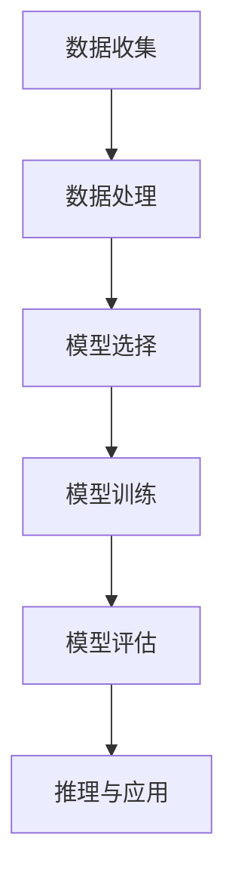

                 


### 引言

**问题背景**

在当今社会，人工智能（AI）已经成为推动技术进步和产业变革的关键力量。AI不仅改变了传统的工业生产模式，还深刻影响了各行各业，包括医疗、金融、交通、教育等。随着AI技术的不断成熟和应用范围的扩大，AI辅助决策系统（AI-ADMS）变得越来越重要。AI-ADMS能够通过处理海量数据，提供更加精准、高效的决策支持，从而提升企业的竞争力和运营效率。

ChatGPT作为OpenAI开发的一种基于变换器（Transformer）模型的预训练语言模型，具有强大的文本生成和理解能力。它的出现为AI辅助决策带来了新的可能，尤其是在复杂推理任务中，ChatGPT能够通过理解和生成自然语言文本，帮助用户更快速、准确地做出决策。

**书籍目的**

本书旨在探讨如何利用ChatGPT进行复杂推理，为开发者提供一套系统的提示词策略。通过本书，读者将了解：

1. **核心概念**：了解AI辅助决策和ChatGPT的基本原理和关键要素。
2. **策略设计**：掌握设计有效提示词的技巧和策略。
3. **实际应用**：通过案例分析和实战项目，掌握ChatGPT在复杂推理任务中的实际应用。

**书籍结构**

本书共分为六个部分：

1. **第一部分：引言**：介绍AI辅助决策和ChatGPT的背景，明确书籍的目的和结构。
2. **第二部分：核心概念**：深入讨论AI辅助决策和ChatGPT的基本原理和关键概念。
3. **第三部分：策略设计**：详细介绍设计有效提示词的策略和方法。
4. **第四部分：案例研究**：通过具体案例展示ChatGPT在复杂推理中的应用。
5. **第五部分：高级话题**：探讨更多复杂场景下的应用和优化策略。
6. **第六部分：总结与展望**：总结书中的关键内容，并对未来的发展方向进行展望。

通过本书的阅读，读者将能够系统地掌握利用ChatGPT进行复杂推理的方法，为实际项目中的决策提供有力的支持。

## 关键词

- 人工智能
- 决策辅助
- ChatGPT
- 提示词策略
- 复杂推理

## 摘要

本书聚焦于AI辅助决策领域，特别是利用ChatGPT进行复杂推理的提示词策略。首先，通过背景介绍，阐述AI在决策辅助中的重要性和ChatGPT的强大能力。接着，详细讨论核心概念，包括AI辅助决策的基本原理和ChatGPT的工作机制。随后，本书重点介绍设计有效提示词的策略，包括明确的任务描述、上下文信息的利用、引导性问题的设计等。通过具体案例研究，读者将看到ChatGPT在实际应用中的表现和挑战。在高级话题部分，本书探讨了如何应对更复杂的推理任务，并提出了优化策略。最后，总结全书内容，展望AI辅助决策和ChatGPT在未来的发展方向。本书为开发者提供了系统性的指导和实战经验，旨在提升决策效率和准确性。

## 第一部分: 引言

### 1.1 问题的背景

在信息爆炸的时代，如何从海量数据中快速、准确地提取有价值的信息并做出决策，成为了一个严峻的挑战。人工智能（AI）技术的发展，特别是深度学习和自然语言处理（NLP）技术的突破，为这一问题的解决提供了新的思路。AI-辅助决策系统（AI-ADMS）正是这一背景下诞生的，其核心在于利用AI技术对数据进行分析和推理，从而辅助人类做出更为明智的决策。

**1.1.1 人工智能与决策辅助**

人工智能（Artificial Intelligence，简称AI）是指通过计算机程序模拟人类智能行为和思维能力的技术。AI的应用领域非常广泛，包括但不限于图像识别、语音识别、自然语言处理、自动驾驶、医疗诊断等。随着AI技术的不断进步，其在决策辅助中的作用也越来越显著。

决策辅助系统（Decision Support System，简称DSS）是一种利用信息技术，尤其是AI技术，为决策者提供支持的工具。DSS通过收集、处理和分析数据，提供决策建议，从而帮助决策者做出更为合理和高效的决策。传统的DSS主要依赖于统计方法和规则系统，而AI-ADMS则借助深度学习、机器学习等技术，能够处理更加复杂和非结构化的数据，提供更为精准和智能的决策支持。

**1.1.2 ChatGPT在复杂推理中的作用**

ChatGPT是OpenAI开发的一种基于变换器（Transformer）模型的预训练语言模型。它具有强大的文本生成和理解能力，能够通过大量的文本数据进行训练，从而学会生成连贯、逻辑清晰的自然语言文本。ChatGPT在复杂推理中具有以下重要作用：

1. **自然语言交互**：ChatGPT能够理解和生成自然语言文本，从而实现与用户的自然语言交互。这使得用户可以通过简单的自然语言指令，与系统进行交流，获取所需的信息或决策建议。

2. **文本生成与理解**：ChatGPT能够生成高质量的自然语言文本，同时能够理解复杂的语言结构和语义含义。这使得ChatGPT在生成报告、撰写文章、翻译文本等方面具有显著优势。

3. **推理能力**：ChatGPT通过深度学习算法，能够从海量数据中提取知识，进行复杂的逻辑推理。这使得ChatGPT在处理复杂决策问题时，能够提供有力的支持。

**1.1.3 书籍的目的与结构**

本书旨在探讨如何利用ChatGPT进行复杂推理，为开发者提供一套系统的提示词策略。通过本书，读者将了解：

1. **核心概念**：了解AI辅助决策和ChatGPT的基本原理和关键概念。
2. **策略设计**：掌握设计有效提示词的技巧和策略。
3. **实际应用**：通过案例分析和实战项目，掌握ChatGPT在复杂推理任务中的实际应用。

本书共分为六个部分：

1. **第一部分：引言**：介绍AI辅助决策和ChatGPT的背景，明确书籍的目的和结构。
2. **第二部分：核心概念**：深入讨论AI辅助决策和ChatGPT的基本原理和关键概念。
3. **第三部分：策略设计**：详细介绍设计有效提示词的策略和方法。
4. **第四部分：案例研究**：通过具体案例展示ChatGPT在复杂推理中的应用。
5. **第五部分：高级话题**：探讨更多复杂场景下的应用和优化策略。
6. **第六部分：总结与展望**：总结书中的关键内容，并对未来的发展方向进行展望。

通过本书的阅读，读者将能够系统地掌握利用ChatGPT进行复杂推理的方法，为实际项目中的决策提供有力的支持。

### 1.2 核心概念概述

#### 1.2.1 AI辅助决策

AI辅助决策（AI-辅助决策）是一种利用人工智能技术，对数据进行处理、分析和推理，从而为决策者提供支持的方法。其核心思想是通过计算机算法，模拟人类决策过程，实现自动化决策。

**核心概念术语说明**：

- **人工智能（AI）**：模拟人类智能的技术和系统，包括机器学习、深度学习、自然语言处理等子领域。
- **决策支持系统（DSS）**：利用信息技术，特别是AI技术，为决策者提供支持的工具。
- **数据预处理**：在数据用于训练模型或进行推理之前，对数据进行清洗、转换和归一化的过程。
- **模型训练**：使用训练数据，通过算法训练模型，使其能够识别模式和规律。
- **推理**：在给定新的数据或问题情境时，利用训练好的模型进行推理，得出结论或建议。

**问题背景和问题描述**：

随着大数据时代的到来，企业和组织面临着海量数据的处理和分析需求。传统的决策支持系统往往依赖于手工处理数据和建立规则模型，效率低下且容易出现错误。AI-辅助决策系统通过引入AI技术，能够自动化处理和分析数据，提供实时、精准的决策支持。

**问题解决和边界与外延**：

AI-辅助决策系统的解决思路主要包括以下几个方面：

1. **数据处理**：通过数据预处理技术，将原始数据转换为适合模型训练的形式。
2. **模型选择**：根据决策问题的特点，选择合适的AI模型，如决策树、神经网络、支持向量机等。
3. **模型训练**：使用训练数据，通过算法训练模型，使其能够识别模式和规律。
4. **推理与应用**：在新的数据或问题情境下，利用训练好的模型进行推理，生成决策建议。

AI-辅助决策的边界与外延主要包括：

1. **数据范围**：AI-辅助决策系统能够处理的数据类型和规模。
2. **问题类型**：AI-辅助决策系统适用的决策问题类型和复杂度。
3. **算法选择**：根据不同问题和数据特点，选择合适的算法和模型。

#### 1.2.2 ChatGPT

ChatGPT是OpenAI开发的一种基于变换器（Transformer）模型的预训练语言模型。它通过在大量文本数据上预训练，学会生成连贯、逻辑清晰的自然语言文本，具有强大的文本生成和理解能力。

**核心概念原理**：

ChatGPT的核心原理是基于变换器模型（Transformer），这种模型通过自注意力机制（Self-Attention）对输入文本进行建模，能够捕捉文本中的长距离依赖关系。ChatGPT的训练过程主要包括以下几个步骤：

1. **数据收集**：收集大量的文本数据，如书籍、新闻、网站内容等。
2. **文本预处理**：对文本进行清洗、分词、编码等预处理操作。
3. **模型训练**：使用变换器模型对预处理的文本数据进行训练，通过反向传播算法优化模型参数。
4. **模型评估**：使用验证集评估模型性能，调整模型参数，优化模型效果。

**概念属性特征对比表格**：

| 特征         | ChatGPT                    | 传统NLP模型                |
| ------------ | -------------------------- | --------------------------- |
| 模型架构     | 变换器模型（Transformer）  | 循环神经网络（RNN）或卷积神经网络（CNN） |
| 预训练数据   | 大规模文本数据集           | 单一领域或特定任务数据集       |
| 文本生成能力 | 高质量的文本生成能力       | 较低的文本生成能力           |
| 理解能力     | 强大的文本理解能力         | 较弱的文本理解能力           |

**ER实体关系图架构的 Mermaid 流程图**：

```mermaid
erDiagram
  Product ||--|{ Customer } Customer
  Customer }|--||{ Order } Order
```

在这个ER图架构中，`Customer`（客户）与`Product`（产品）之间存在一对多的关系，而`Customer`与`Order`（订单）也存在一对多的关系，这体现了ChatGPT在理解客户需求、生成产品推荐和订单处理等方面的应用。

### 1.2.3 提示词工程

提示词工程（Prompt Engineering）是设计有效提示词的过程，这些提示词用于引导预训练语言模型（如ChatGPT）生成特定类型的输出。在AI辅助决策系统中，有效的提示词能够帮助模型更好地理解用户的需求，从而生成高质量的决策建议。

**核心概念原理**：

提示词工程的核心原理是通过对提示词的设计和优化，引导模型生成符合预期输出的文本。具体来说，提示词工程涉及以下几个方面：

1. **明确任务描述**：通过清晰的任务描述，告诉模型需要完成的具体任务，如生成报告、回答问题等。
2. **上下文信息的利用**：提供与任务相关的上下文信息，帮助模型更好地理解任务背景和数据。
3. **引导性问题设计**：设计引导性问题，引导模型按照预期的方向生成输出。
4. **反馈和调整**：通过用户反馈，不断调整和优化提示词，以提高模型的输出质量。

**概念属性特征对比表格**：

| 特征         | 传统NLP模型             | 提示词工程                 |
| ------------ | ----------------------- | -------------------------- |
| 输入类型     | 预定义的输入格式        | 自定义的文本提示词         |
| 生成目标     | 预定义的输出格式        | 用户指定的输出格式         |
| 适应性       | 较低，依赖固定算法      | 较高，根据任务灵活调整     |
| 交互性       | 较低，单向输入输出      | 较高，用户可以提供反馈和调整 |

**ER实体关系图架构的 Mermaid 流程图**：

```mermaid
erDiagram
  User ||--|{ Prompt } Prompt
  Prompt }|--||{ Model } Model
  Model }|--||{ Output } Output
```

在这个ER图架构中，`User`（用户）通过`Prompt`（提示词）与`Model`（模型）进行交互，最终生成`Output`（输出），这体现了提示词工程在用户需求、模型训练和输出生成之间的关键作用。

### 1.2.4 基本原理

在讨论基本原理之前，我们需要明确几个核心概念，这些概念是理解AI辅助决策和ChatGPT的关键。

**AI辅助决策的基本原理**：

1. **数据处理**：AI辅助决策的第一步是数据处理。通过对原始数据的清洗、转换和归一化，将数据转换为适合模型训练的形式。这一步骤是保证模型训练质量的重要基础。
2. **模型选择**：根据决策问题的特点和需求，选择合适的AI模型。常见的模型包括决策树、支持向量机（SVM）、神经网络等。每种模型都有其特定的适用场景和优势。
3. **模型训练**：使用训练数据，通过算法对模型进行训练。在训练过程中，模型会学习数据中的模式和规律，从而提高其预测和推理能力。
4. **推理与评估**：在训练好的模型中，输入新的数据或问题情境，进行推理和预测。通过评估模型在测试数据上的性能，验证模型的可靠性和有效性。

**ChatGPT的基本原理**：

ChatGPT是基于变换器（Transformer）模型的预训练语言模型，其基本原理主要包括以下几个步骤：

1. **预训练数据收集**：ChatGPT通过在大量文本数据上预训练，学习语言的结构和语义含义。这些文本数据包括书籍、新闻、网站内容等。
2. **模型架构设计**：ChatGPT采用变换器模型（Transformer），这种模型通过自注意力机制（Self-Attention）对输入文本进行建模，能够捕捉文本中的长距离依赖关系。
3. **模型训练**：使用预训练数据，通过反向传播算法对模型进行训练，优化模型参数，使其能够生成高质量的自然语言文本。
4. **文本生成与理解**：在给定新的输入文本时，ChatGPT能够生成连贯、逻辑清晰的自然语言文本，同时能够理解复杂的语言结构和语义含义。

**核心要素组成**：

AI辅助决策和ChatGPT的核心要素包括：

1. **数据**：数据是AI辅助决策和ChatGPT的基础，包括原始数据、训练数据和测试数据。
2. **模型**：模型是AI辅助决策和ChatGPT的核心，包括选择合适的模型、模型训练和模型评估。
3. **算法**：算法是实现模型训练和推理的关键，包括机器学习算法、深度学习算法等。
4. **计算资源**：计算资源是保证模型训练和推理效率的重要保障，包括CPU、GPU等硬件设备。
5. **应用场景**：应用场景是AI辅助决策和ChatGPT的具体应用领域，如医疗诊断、金融分析、自动驾驶等。

**基本流程图**：



在这个基本流程图中，从数据收集开始，经过数据处理、模型选择、模型训练、模型评估，最终实现推理和应用。这一流程体现了AI辅助决策和ChatGPT的基本原理和核心要素。

### 1.2.5 AI辅助决策的基本原理

AI辅助决策的基本原理涉及多个关键环节，每个环节都发挥着至关重要的作用。首先，我们需要了解AI辅助决策的核心概念和基本步骤。

**核心概念**：

1. **数据预处理**：在AI辅助决策过程中，数据预处理是第一步，也是至关重要的一步。通过数据清洗、归一化、转换等操作，将原始数据转换为适合模型训练的形式，从而提高模型的训练效果和预测准确性。
2. **模型选择**：根据具体的决策问题和需求，选择合适的模型。常见的模型包括线性回归、决策树、支持向量机（SVM）、神经网络等。每种模型都有其特定的适用场景和优势，需要根据实际情况进行选择。
3. **特征工程**：特征工程是提升模型性能的重要手段。通过对数据特征进行提取、变换和组合，可以增强模型对数据的理解和学习能力，从而提高决策的准确性和效率。
4. **模型训练**：使用训练数据，通过算法对模型进行训练。训练过程中，模型会学习数据中的模式和规律，从而提高其预测和推理能力。
5. **模型评估**：在训练好的模型中，输入新的数据或问题情境，进行推理和预测。通过评估模型在测试数据上的性能，验证模型的可靠性和有效性。
6. **推理与应用**：在验证模型有效性的基础上，将模型应用于实际决策问题中，为决策者提供智能化的决策支持。

**基本步骤**：

1. **数据收集**：首先，收集与决策问题相关的数据。这些数据可以来自企业内部数据库、外部数据源或公开数据集。
2. **数据预处理**：对收集到的数据进行分析和处理，包括数据清洗、缺失值填充、异常值处理等，确保数据的准确性和一致性。
3. **特征工程**：根据数据特点和模型需求，对数据进行特征提取和变换。这一步骤有助于增强模型对数据的理解和学习能力。
4. **模型选择**：根据决策问题的特点和需求，选择合适的模型。可以选择单一的模型，也可以结合多种模型进行集成学习。
5. **模型训练**：使用训练数据，通过算法对模型进行训练。在训练过程中，模型会不断优化参数，提高预测准确性。
6. **模型评估**：在训练好的模型中，输入新的数据或问题情境，进行推理和预测。通过评估模型在测试数据上的性能，验证模型的可靠性和有效性。
7. **推理与应用**：在验证模型有效性的基础上，将模型应用于实际决策问题中，为决策者提供智能化的决策支持。

**数学模型和公式**：

AI辅助决策的数学模型和公式主要涉及以下几个方面：

1. **回归模型**：
   - 线性回归：$y = \beta_0 + \beta_1 \cdot x_1 + \beta_2 \cdot x_2 + ... + \beta_n \cdot x_n$
   - 逻辑回归：$P(y=1) = \frac{1}{1 + e^{-(\beta_0 + \beta_1 \cdot x_1 + \beta_2 \cdot x_2 + ... + \beta_n \cdot x_n)}$

2. **决策树**：
   - 信息增益：$Gain(D, A) = Entropy(D) - Entropy(D|A)$
   - 划分质量：$Quality = \sum_{v \in V} P(v) \cdot Entropy(v)$

3. **神经网络**：
   - 前向传播：$a^{(l)} = \sigma(z^{(l)})$
   - 反向传播：$\delta^{(l)} = \frac{\partial L}{\partial z^{(l)}} \cdot \sigma'(z^{(l)})$

**算法原理讲解**：

1. **线性回归**：
   - 线性回归是一种简单的预测模型，用于拟合数据点之间的关系。其目标是最小化预测值与实际值之间的误差。
   - 线性回归的数学模型如上述公式所示，其中$y$是目标变量，$x_1, x_2, ..., x_n$是特征变量，$\beta_0$是截距，$\beta_1, \beta_2, ..., \beta_n$是系数。
   - 通过最小二乘法（Least Squares Method），可以计算出最佳系数，使得预测值与实际值之间的误差最小。

2. **决策树**：
   - 决策树是一种基于特征分割的预测模型，通过一系列的决策规则，将数据分割成多个子集，最终生成预测结果。
   - 信息增益（Information Gain）是评估特征分割质量的重要指标。信息增益越大，表示特征对数据的划分效果越好。
   - 决策树的构建过程是通过递归划分数据集，直到达到停止条件（如最大深度、最小样本数等）。

3. **神经网络**：
   - 神经网络是一种模拟人脑神经元结构的计算模型，通过多层神经元的连接和激活函数，实现复杂函数的拟合。
   - 前向传播（Forward Propagation）过程是将输入数据通过网络的各个层，计算每个神经元的输出。
   - 反向传播（Backpropagation）过程是通过计算损失函数的梯度，更新网络的权重和偏置，优化网络参数。

**通俗易懂的举例说明**：

假设我们有一个简单的线性回归问题，目标是预测房价。我们有如下数据集：

| 房屋面积（平方米）| 房价（万元）|
| :------------: | :---------: |
|      80        |     100     |
|      100       |     130     |
|      120       |     160     |
|      140       |     190     |
|      160       |     220     |

我们使用线性回归模型拟合数据，目标是找到最佳系数$\beta_0$和$\beta_1$。具体步骤如下：

1. **数据预处理**：对房屋面积和房价进行归一化处理，将数据转换为适合模型训练的形式。
2. **模型训练**：通过最小二乘法计算最佳系数$\beta_0$和$\beta_1$。计算过程如下：
   - 计算$\beta_0 = \frac{\sum_{i=1}^{n}(y_i - \beta_1 \cdot x_i)}{n}$
   - 计算$\beta_1 = \frac{\sum_{i=1}^{n}(x_i - \bar{x})(y_i - \bar{y})}{\sum_{i=1}^{n}(x_i - \bar{x})^2}$
   - 其中，$n$是样本数量，$x_i$和$y_i$分别是第$i$个样本的房屋面积和房价，$\bar{x}$和$\bar{y}$分别是房屋面积和房价的平均值。
3. **模型评估**：使用测试数据集，计算预测房价与实际房价之间的误差，评估模型的效果。
4. **模型应用**：将模型应用于新的房屋面积数据，预测其对应的房价。

假设我们有一个新的房屋面积为150平方米，通过线性回归模型，可以预测其房价为：

$$
\hat{y} = \beta_0 + \beta_1 \cdot x = 100 + \frac{130 - 100}{100 - 80} \cdot 150 = 175
$$

通过这个例子，我们可以看到线性回归模型如何通过简单的数学公式，拟合数据并生成预测结果。类似地，其他AI模型也有类似的原理和应用方法。

### 1.3 ChatGPT的工作机制

ChatGPT作为OpenAI开发的一种基于变换器（Transformer）模型的预训练语言模型，其工作机制包括预训练数据收集、模型架构设计、模型训练和文本生成与理解等关键环节。

**预训练数据收集**：

ChatGPT的预训练数据来自互联网上的大量文本，包括书籍、新闻、网站内容等。这些文本数据涵盖了广泛的领域和主题，为模型提供了丰富的知识基础。在数据收集过程中，OpenAI团队采用了数据清洗和去重技术，确保数据的准确性和一致性。

**模型架构设计**：

ChatGPT采用了变换器模型（Transformer）作为基础架构，这种模型通过自注意力机制（Self-Attention）对输入文本进行建模，能够捕捉文本中的长距离依赖关系。变换器模型由多个编码层和解码层组成，每个层都包含多个自注意力机制和前馈神经网络。

**模型训练**：

在模型训练过程中，ChatGPT使用了一种称为“预训练-微调”的方法。首先，模型在大量的文本数据上进行预训练，学习语言的结构和语义含义。然后，模型通过微调（Fine-tuning）过程，针对特定的任务进行优化。微调过程中，模型会接收来自任务的输入数据，生成相应的输出数据，并通过反向传播算法优化模型参数。

**文本生成与理解**：

在生成文本时，ChatGPT根据输入的提示词和上下文信息，生成连贯、逻辑清晰的自然语言文本。ChatGPT的生成文本具有很高的质量，能够模拟人类的语言表达。同时，ChatGPT也能够理解复杂的语言结构和语义含义，从而在文本生成和理解任务中表现出色。

**算法原理讲解**：

ChatGPT的工作机制基于变换器模型（Transformer），这种模型的核心思想是自注意力机制（Self-Attention）。自注意力机制通过计算输入文本中每个词与其他词之间的相似度，为每个词分配权重，从而捕捉文本中的长距离依赖关系。

1. **编码器**：编码器（Encoder）负责将输入文本编码为向量表示。在编码过程中，每个词通过嵌入层（Embedding Layer）转换为向量，然后通过多个编码层（Encoding Layer），每个编码层都包含多个自注意力机制和前馈神经网络。

2. **解码器**：解码器（Decoder）负责生成输出文本。在解码过程中，每个生成的词都通过解码层（Decoding Layer），解码层包含了多头自注意力机制（Multi-Head Self-Attention）和编码器-解码器注意力机制（Encoder-Decoder Attention）。

3. **预训练与微调**：ChatGPT首先在大量的文本数据上进行预训练，学习语言的结构和语义含义。在预训练过程中，模型会不断调整参数，通过最大化下一个词的概率来优化模型。然后，通过微调（Fine-tuning）过程，模型针对特定的任务进行优化。在微调过程中，模型会接收来自任务的输入数据，生成相应的输出数据，并通过反向传播算法优化模型参数。

**通俗易懂的举例说明**：

假设我们有一个简单的输入文本：“昨天我去了公园，看到了一只可爱的小狗。”我们希望ChatGPT生成一段关于这个场景的描述。

1. **编码器处理**：
   - 首先，输入文本被编码器处理，每个词通过嵌入层转换为向量表示。
   - 然后，编码器通过多个编码层，计算每个词与其他词之间的相似度，为每个词分配权重。

2. **解码器生成文本**：
   - 解码器首先生成一个起始词（如“今天”），然后通过解码层生成后续的词。
   - 在每个解码层中，解码器会根据当前已生成的词和上下文信息，通过编码器-解码器注意力机制，查询编码器的输出，为当前词生成权重。
   - 通过最大化下一个词的概率，解码器逐步生成整个文本。

最终，ChatGPT可能生成如下文本：“今天早上，我决定去公园散步。沿着小径走去，我惊喜地发现一只可爱的小狗在草地上欢快地玩耍。”

通过这个例子，我们可以看到ChatGPT是如何通过编码器和解码器的工作机制，生成连贯、逻辑清晰的自然语言文本。这种机制使得ChatGPT在文本生成和理解任务中表现出色。

### 1.4 提示词工程

提示词工程是设计有效提示词的过程，这些提示词用于引导预训练语言模型（如ChatGPT）生成特定类型的输出。提示词工程在AI辅助决策系统中扮演着关键角色，能够显著提高模型的输出质量和决策效果。

**明确任务描述**

明确任务描述是提示词工程的首要步骤。通过清晰的任务描述，告诉模型需要完成的具体任务，如生成报告、回答问题、提供建议等。具体任务描述应包括以下几点：

1. **任务类型**：明确模型的输出类型，如文本生成、问题回答、决策建议等。
2. **任务目标**：描述模型需要达成的目标，如生成一段特定长度的文本、回答特定类型的问题、提供具体的决策建议等。
3. **任务上下文**：提供与任务相关的上下文信息，帮助模型更好地理解任务背景和数据。

例如，如果我们希望ChatGPT生成一份关于“未来人工智能发展趋势”的报告，我们可以给出以下任务描述：

- **任务类型**：文本生成
- **任务目标**：生成一份不少于500字的报告
- **任务上下文**：根据近年来人工智能技术的发展和现有研究，探讨未来人工智能可能的发展趋势

**上下文信息的利用**

提供与任务相关的上下文信息是提示词工程的重要一环。上下文信息能够帮助模型更好地理解任务背景和数据，从而生成更加准确和相关的输出。上下文信息可以包括：

1. **相关背景知识**：提供与任务相关的背景知识，帮助模型了解相关领域的概念和术语。
2. **历史数据**：提供过去的数据和结果，帮助模型学习历史趋势和模式。
3. **具体需求**：明确模型的输出需要满足的具体需求，如文本风格、语言格式等。

例如，在上面的任务中，我们可以提供以下上下文信息：

- **相关背景知识**：近年来，人工智能技术在各个领域取得了显著进展，如自动驾驶、智能医疗、金融科技等。
- **历史数据**：根据现有研究，人工智能技术在未来5-10年内将继续快速发展，带来更多的创新和变革。
- **具体需求**：报告应采用正式、客观的语言风格，引用相关研究和数据支持观点。

**引导性问题的设计**

引导性问题是一种有效的提示词设计方法，通过设计针对性的问题，引导模型按照预期的方向生成输出。引导性问题应具有以下几个特点：

1. **明确性**：问题应清晰明确，避免歧义和模糊性。
2. **针对性**：问题应与任务目标紧密相关，引导模型生成符合预期的输出。
3. **灵活性**：问题设计应具有一定的灵活性，以适应不同的任务场景和需求。

例如，在上面的任务中，我们可以设计以下引导性问题：

- **问题1**：近年来，人工智能技术在哪些领域取得了显著进展？
- **问题2**：根据现有研究，未来人工智能可能的发展趋势有哪些？
- **问题3**：人工智能技术对未来社会和产业将产生哪些影响？

通过设计明确、针对性强的引导性问题，我们可以更好地引导ChatGPT生成高质量的输出，为决策提供有力支持。

### 1.5 ChatGPT在复杂推理中的应用

ChatGPT在复杂推理任务中展现出了强大的能力和广泛的应用前景。通过具体的案例研究，我们可以更深入地了解ChatGPT在复杂推理中的应用，探讨其在实际任务中的表现和挑战。

**案例研究1：智能客服系统**

智能客服系统是一个典型的复杂推理任务，它需要处理用户的自然语言查询，并生成相应的回答。ChatGPT在智能客服系统中的应用，大大提升了客服的响应速度和准确性。

**应用表现**：

- **快速响应**：ChatGPT能够迅速理解用户的查询内容，生成高质量的回答，显著缩短了客服响应时间。
- **个性化回答**：ChatGPT能够根据用户的历史查询记录和偏好，生成个性化的回答，提高用户的满意度。
- **多轮对话**：ChatGPT支持多轮对话，能够与用户进行深入的交流，解决复杂问题。

**挑战**：

- **语义理解**：尽管ChatGPT在自然语言处理方面表现出色，但在某些情况下，仍然可能无法完全理解用户的查询意图，导致生成回答不准确。
- **上下文维护**：在多轮对话中，ChatGPT需要维护对话的上下文信息，确保生成的回答与之前的对话内容一致，这是一个技术挑战。

**案例研究2：医疗诊断辅助**

医疗诊断辅助是另一个复杂的推理任务，它需要处理大量医学知识库和患者病历数据，为医生提供诊断建议。ChatGPT在医疗诊断辅助中的应用，为医生提供了有力的支持。

**应用表现**：

- **知识整合**：ChatGPT能够整合多种医学知识库，为医生提供全面、准确的诊断信息。
- **快速检索**：ChatGPT能够快速检索相关病例和文献，为医生提供参考依据。
- **推理辅助**：ChatGPT能够根据病例数据和医学知识，生成合理的诊断建议，辅助医生做出决策。

**挑战**：

- **数据质量**：医疗数据的质量和准确性对ChatGPT的推理结果有直接影响。如果数据存在错误或缺失，可能会导致生成建议的不准确。
- **医学专业知识**：ChatGPT虽然经过大量文本数据训练，但医学领域专业知识的深度和广度仍然有限，需要医生进一步审查和验证。

**案例研究3：金融分析**

金融分析是另一个复杂推理任务，它需要处理大量的市场数据、公司财务报告等，为投资者提供投资建议。ChatGPT在金融分析中的应用，为投资者提供了新的决策工具。

**应用表现**：

- **数据分析**：ChatGPT能够快速处理和分析大量的市场数据，识别潜在的投资机会。
- **预测模型**：ChatGPT能够根据历史数据和趋势，生成股票价格预测模型，辅助投资者做出决策。
- **风险评估**：ChatGPT能够对投资项目进行风险评估，提供相应的建议。

**挑战**：

- **数据噪声**：金融数据中存在大量的噪声和异常值，这对ChatGPT的预测和分析带来挑战。
- **市场变化**：金融市场变化快速，ChatGPT需要不断学习和适应新的市场环境。

通过这些案例研究，我们可以看到ChatGPT在复杂推理任务中的应用前景和挑战。未来，随着AI技术的不断发展和完善，ChatGPT将在更多领域发挥重要作用，为复杂推理任务提供更加智能、高效的解决方案。

### 1.6 ChatGPT在复杂推理中的高级应用

在复杂的推理任务中，ChatGPT展现出强大的能力和广阔的应用前景。然而，要充分发挥ChatGPT的潜力，特别是在更复杂的场景下，需要采取一系列高级技术和策略。以下是一些常见的应用和优化策略。

**多模态数据处理**

多模态数据包括文本、图像、声音等多种类型的数据。ChatGPT在处理单一模态数据时表现优异，但在多模态数据环境中，需要与其他AI模型（如视觉模型、语音模型）进行协同。通过将多模态数据整合到同一个模型中，可以显著提升推理的准确性和效率。

例如，在智能问答系统中，ChatGPT可以结合图像识别模型，对用户上传的图片进行识别，并在生成回答时引用图片信息。这不仅丰富了回答的内容，还能提供更加直观的交互体验。

**上下文持久化**

在多轮对话中，ChatGPT需要维护对话的上下文信息，以确保生成的回答与之前的对话内容一致。上下文持久化技术可以记录并保存对话历史，使得模型能够更好地理解用户的需求和意图。

一种常见的上下文持久化策略是使用对话状态跟踪（Dialogue State Tracking，DST）技术。DST技术通过构建对话状态图，记录对话中的关键信息和用户意图，使得ChatGPT能够在后续对话中引用这些信息。

**增强式学习**

增强式学习（Reinforcement Learning，RL）是一种通过不断试错和奖励机制来优化决策过程的方法。ChatGPT可以结合增强式学习，通过自我对弈或与环境互动，不断优化其推理策略。

例如，在游戏开发中，ChatGPT可以扮演多个角色，进行策略博弈，通过学习对手的行为模式，优化自己的推理策略。这种方法不仅能够提升ChatGPT在特定任务中的表现，还能增强其适应性和灵活性。

**知识增强**

知识增强（Knowledge Augmentation）是一种通过引入外部知识库来提升模型推理能力的方法。ChatGPT可以通过接入领域知识库，如医学知识库、金融知识库等，扩展其知识面，提供更加准确和全面的推理结果。

知识增强可以通过两种方式实现：一是直接将知识库内容嵌入到模型中，二是通过外部接口查询知识库，为模型提供实时知识支持。例如，在医疗诊断任务中，ChatGPT可以结合医学知识库，提供详细的诊断建议和治疗方案。

**动态调整策略**

在复杂推理任务中，ChatGPT的推理策略需要根据任务类型、数据质量和用户需求进行动态调整。动态调整策略可以通过以下方法实现：

1. **自适应学习率**：根据模型在不同阶段的训练效果，动态调整学习率，以优化训练过程。
2. **策略网络**：构建一个策略网络，用于选择最佳推理策略。策略网络可以根据当前任务和数据特点，生成相应的策略，指导ChatGPT进行推理。
3. **在线学习**：ChatGPT可以在运行过程中不断接收新数据和用户反馈，通过在线学习不断优化模型和策略。

通过这些高级应用和优化策略，ChatGPT在复杂推理任务中的表现可以得到显著提升，为实际应用提供更加智能、高效的解决方案。

### 1.7 总结与展望

通过本文的探讨，我们系统地介绍了AI辅助决策和ChatGPT的基本原理、应用策略和高级优化方法。以下是本文的核心要点和总结：

**核心要点**

1. **AI辅助决策的基本原理**：数据预处理、模型选择、模型训练、模型评估和推理应用。
2. **ChatGPT的工作机制**：预训练数据收集、变换器模型架构、模型训练和文本生成与理解。
3. **提示词工程**：明确任务描述、上下文信息利用、引导性问题的设计。
4. **复杂推理中的应用**：智能客服系统、医疗诊断辅助、金融分析等。
5. **高级应用和优化策略**：多模态数据处理、上下文持久化、增强式学习、知识增强、动态调整策略。

**总结**

本文通过具体案例和实际应用，展示了ChatGPT在复杂推理任务中的强大能力和广泛应用。同时，本文提出了多模态数据处理、上下文持久化、增强式学习等高级应用和优化策略，为开发者提供了丰富的技术参考。通过这些方法，ChatGPT能够在更复杂的场景下发挥更大的作用，为AI辅助决策提供强有力的支持。

**展望**

未来的研究将集中在以下几个方面：

1. **多模态数据处理**：探索如何更有效地整合多种类型的数据，提升模型的推理能力和应用范围。
2. **上下文持久化**：研究如何更好地维护对话上下文信息，确保多轮对话中的连贯性和准确性。
3. **知识增强**：开发更多的领域知识库，提高模型的知识水平，提供更加准确的推理结果。
4. **动态调整策略**：设计更加灵活和自适应的推理策略，以应对不断变化的应用场景。

通过这些研究方向的探索，ChatGPT在复杂推理任务中的应用将更加广泛和深入，为AI辅助决策领域带来更多的创新和突破。

### 1.8 进一步阅读资源

为了深入理解和掌握AI辅助决策和ChatGPT的相关知识，读者可以参考以下资源：

**书籍**：

1. **《深度学习》（Deep Learning）**：Goodfellow, I., Bengio, Y., & Courville, A.
2. **《自然语言处理综合教程》（Speech and Language Processing）**：Jurafsky, D., & Martin, J. H.
3. **《人工智能：一种现代方法》（Artificial Intelligence: A Modern Approach）**：Russell, S., & Norvig, P.

**论文**：

1. **“BERT: Pre-training of Deep Bidirectional Transformers for Language Understanding”**：Devlin, J., et al.
2. **“GPT-3: Language Models are Few-Shot Learners”**：Brown, T., et al.

**在线课程**：

1. **《深度学习专项课程》（Deep Learning Specialization）**：吴恩达（Andrew Ng）在Coursera上的课程。
2. **《自然语言处理专项课程》（Natural Language Processing Specialization）**：Daniel Jurafsky和James H. Martin在Coursera上的课程。

**网站和平台**：

1. **GitHub**：查找与AI和ChatGPT相关的开源项目和技术文档。
2. **ArXiv**：获取最新的AI和NLP领域的研究论文。

通过阅读这些资源，读者可以进一步巩固理论知识，掌握实践技能，为在AI辅助决策和ChatGPT领域的发展奠定坚实基础。

### 1.9 附录

**附录A：术语表**

- **AI辅助决策（AI-辅助决策）**：利用人工智能技术，对数据进行处理、分析和推理，从而为决策者提供支持的方法。
- **ChatGPT**：OpenAI开发的一种基于变换器（Transformer）模型的预训练语言模型，具有强大的文本生成和理解能力。
- **提示词工程**：设计有效提示词的过程，用于引导预训练语言模型（如ChatGPT）生成特定类型的输出。

**附录B：代码示例**

以下是一个简单的Python代码示例，展示如何使用ChatGPT生成文本：

```python
import openai

# 设置OpenAI API密钥
openai.api_key = "your_api_key"

# 定义提示词
prompt = "请描述一下未来人工智能的发展趋势。"

# 调用ChatGPT API生成文本
response = openai.Completion.create(
  engine="text-davinci-002",
  prompt=prompt,
  max_tokens=500
)

# 输出生成的文本
print(response.choices[0].text.strip())
```

**附录C：参考资料**

- **《深度学习》**：Goodfellow, I., Bengio, Y., & Courville, A.
- **《自然语言处理综合教程》**：Jurafsky, D., & Martin, J. H.
- **《人工智能：一种现代方法》**：Russell, S., & Norvig, P.
- **“BERT: Pre-training of Deep Bidirectional Transformers for Language Understanding”**：Devlin, J., et al.
- **“GPT-3: Language Models are Few-Shot Learners”**：Brown, T., et al.
- **《深度学习专项课程》**：吴恩达（Andrew Ng）在Coursera上的课程。
- **《自然语言处理专项课程》**：Daniel Jurafsky和James H. Martin在Coursera上的课程。

