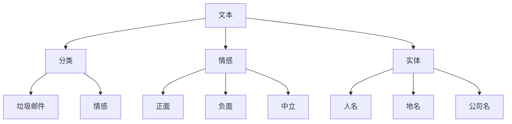
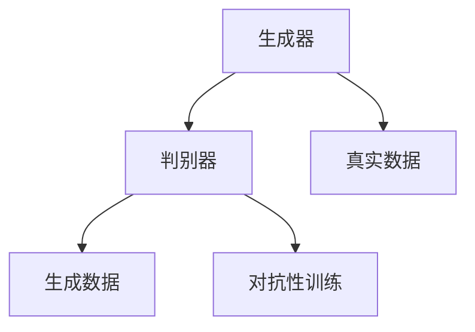
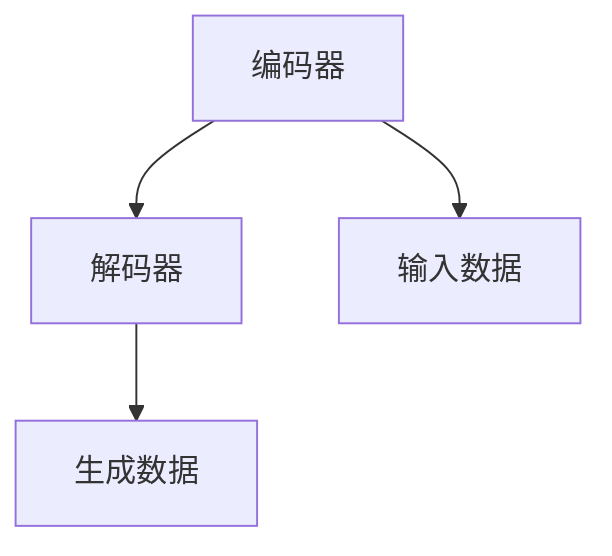
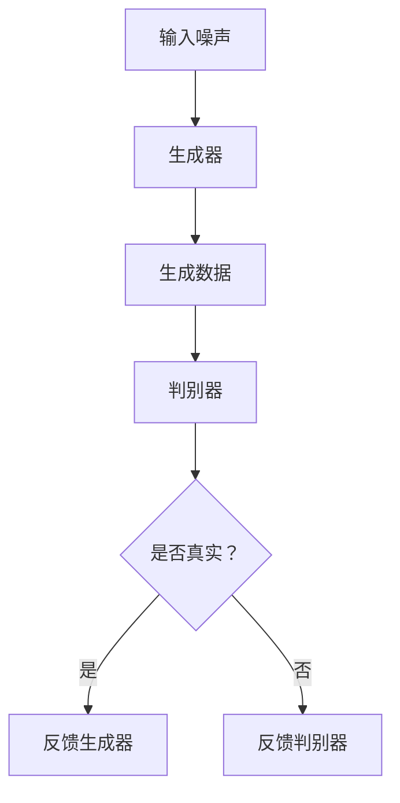
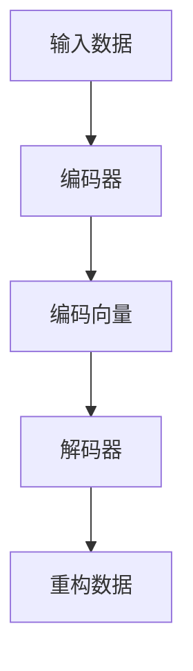

                 

# AI辅助创意写作：风格模仿和创新的提示词技巧

关键词：AI辅助创意写作、风格模仿、创新、提示词、自然语言处理

摘要：本文探讨了AI辅助创意写作的概念、原理和应用。通过介绍风格模仿和创新的提示词技巧，本文旨在帮助读者理解并掌握如何利用AI技术进行创意性写作，提高写作效率和创意性。

### 第1章: 引言与背景

#### 1.1 问题背景

人工智能（AI）技术近年来取得了飞速的发展，尤其在自然语言处理（NLP）领域，AI已经能够实现很多令人瞩目的功能，如文本生成、情感分析、机器翻译等。然而，传统的AI技术往往依赖于大量的数据和复杂的算法，且难以在特定场景下进行创意性写作。

创意写作，尤其是风格模仿和创新，一直是人类文学创作中的重要环节。然而，随着创作需求的增加和内容的多样化，单靠人力已难以满足市场对高质量创意内容的需求。AI辅助创意写作的出现，为解决这个问题提供了新的思路。

#### 1.2 问题描述

AI辅助创意写作的核心在于让机器模仿人类的写作风格，并在模仿的基础上进行创新。然而，当前的研究和实践大多集中在算法的研究上，对如何有效地使用这些算法进行风格模仿和创新的指导相对较少。

#### 1.3 问题解决

本书旨在填补这一空白，通过介绍风格模仿和创新的提示词技巧，帮助读者理解和掌握AI辅助创意写作的方法。本书将涵盖以下内容：

1. AI辅助创意写作的基础知识，包括AI技术的基本原理和应用场景。
2. 风格模仿的原理和方法，通过具体的算法和案例进行讲解。
3. 创新写作的技巧，包括如何利用AI生成新颖的内容。
4. 提示词技巧的详细讲解，包括提示词的选择、组合和使用方法。
5. 实际项目中的应用案例，包括如何将AI辅助创意写作应用于具体的写作任务中。
6. 对AI辅助创意写作未来的展望，包括可能的发展方向和应用前景。

#### 1.4 边界与外延

AI辅助创意写作的边界主要在于AI技术的应用和写作内容的创意性。外延则包括AI在各类写作任务中的应用，如广告文案、小说创作、新闻报道等。

#### 1.5 概念结构与核心要素组成

AI辅助创意写作的概念结构主要包括以下几个方面：

1. AI技术：包括自然语言处理、生成对抗网络、变分自编码器等。
2. 风格模仿：通过算法模型模仿特定作者的写作风格。
3. 创新写作：在模仿的基础上进行创新，生成新的内容。
4. 提示词：用于引导AI生成符合特定要求的文本。
5. 实际应用：将AI辅助创意写作应用于实际写作任务中。

#### 1.6 本章小结

本章介绍了AI辅助创意写作的背景、问题描述、问题解决方法和边界与外延。接下来，本书将逐步深入介绍AI辅助创意写作的核心概念和方法，帮助读者更好地理解和应用这一技术。

### 第2章: AI辅助创意写作基础

#### 2.1 AI技术概述

##### 2.1.1 自然语言处理

自然语言处理（NLP）是AI的一个重要分支，旨在使计算机能够理解、解释和生成人类语言。NLP在AI辅助创意写作中起到了关键作用，包括文本分类、情感分析、命名实体识别、机器翻译等。

- **文本分类**：将文本归类到预定义的类别中，如垃圾邮件检测、情感分析等。
- **情感分析**：分析文本中的情感倾向，如正面、负面或中立。
- **命名实体识别**：识别文本中的特定实体，如人名、地名、组织名等。
- **机器翻译**：将一种语言翻译成另一种语言，如英文到中文的翻译。

##### 2.1.2 生成对抗网络

生成对抗网络（GAN）是一种强大的生成模型，它由生成器和判别器组成。生成器负责生成与真实数据相似的样本，而判别器则负责区分真实数据和生成数据。GAN在AI辅助创意写作中可以用于生成具有特定风格的文本。

- **生成器**：通过学习真实数据的分布，生成与真实数据相似的文本。
- **判别器**：通过对比真实数据和生成数据，判断生成文本的质量。

##### 2.1.3 变分自编码器

变分自编码器（VAE）是一种无监督学习方法，它通过编码器和解码器来学习数据的概率分布。VAE在AI辅助创意写作中可以用于生成多样化且符合数据分布的文本。

- **编码器**：将输入数据映射到一个较低维的表示空间。
- **解码器**：将编码后的数据重新映射回原始空间，生成新的文本。

##### 2.1.4 其他AI技术

除了上述技术，深度学习、强化学习等也是AI辅助创意写作中的重要组成部分。这些技术通过不断优化模型参数，提高生成文本的质量和创意性。

- **深度学习**：通过多层神经网络，对大量数据进行训练，以学习复杂的特征。
- **强化学习**：通过试错法，不断优化模型策略，以实现特定目标。

#### 2.2 AI在创意写作中的应用场景

##### 2.2.1 广告文案创作

AI可以自动生成具有吸引力的广告文案，提高广告的转化率。通过风格模仿，AI可以模仿成功广告文案的风格，进行创意性的改编和优化。

- **风格模仿**：AI通过分析大量成功广告文案，学习其风格和特点，生成符合目标受众的广告文案。
- **创意改编**：AI在模仿的基础上，根据特定需求和市场环境，进行创意性的改编和优化。

##### 2.2.2 小说创作

AI可以根据用户的需求和喜好，自动生成具有特定风格和情节的小说。通过创新写作，AI可以引入新的角色、情节和故事线，提高作品的创意性和可读性。

- **需求分析**：AI通过分析用户的需求和喜好，确定小说的主题、风格和情节。
- **创新写作**：AI在生成小说时，不仅模仿现有作品的风格，还根据需求引入新的角色、情节和故事线。

##### 2.2.3 新闻报道生成

AI可以自动生成新闻报道，减少人工写作的工作量，提高新闻的实时性和准确性。通过风格模仿，AI可以模仿特定记者或新闻机构的写作风格，确保新闻的规范性和一致性。

- **风格模仿**：AI通过分析大量新闻报道，学习特定记者或新闻机构的风格和写作习惯。
- **实时生成**：AI在接收到新闻事件后，可以快速生成新闻报道，确保新闻的实时性。

##### 2.2.4 教材和课程内容生成

AI可以自动生成教材和课程内容，为教育工作者提供便捷的资源。通过风格模仿和创新写作，AI可以创作出具有独特教学风格的教材，提高学生的学习兴趣和效果。

- **风格模仿**：AI通过分析大量优秀教材和课程内容，学习其风格和特点。
- **创新写作**：AI在生成教材和课程内容时，不仅模仿现有作品，还根据需求进行创新，提高教材的吸引力。

#### 2.3 AI辅助创意写作的优势与挑战

##### 2.3.1 优势

- **提高写作效率**：AI可以快速生成大量文本，减少人力成本和时间。
- **增加创意性**：通过风格模仿和创新写作，AI可以为写作带来新的灵感和思路。
- **个性化定制**：AI可以根据用户的需求和喜好，生成个性化的文本。

##### 2.3.2 挑战

- **数据依赖性**：AI辅助创意写作依赖于大量高质量的训练数据，数据质量直接影响生成文本的质量。
- **风格一致性问题**：在风格模仿过程中，确保生成文本与目标风格一致是一个挑战。
- **创意性限制**：虽然AI可以生成新颖的内容，但在某些情况下，AI的创意性可能受到限制。

### 第3章: 风格模仿原理与方法

#### 3.1 风格模仿原理

风格模仿是AI辅助创意写作的重要技术之一，它通过学习特定作者的写作风格，生成与该风格相似的新文本。风格模仿的原理主要基于自然语言处理技术和深度学习模型，具体包括以下几个方面：

- **文本特征提取**：通过自然语言处理技术，提取文本的特征，如词汇、语法结构、情感倾向等。
- **风格建模**：使用深度学习模型，对特定作者的文本进行建模，学习其风格特征。
- **文本生成**：根据学习到的风格特征，生成与目标风格相似的新文本。

#### 3.2 风格模仿方法

##### 3.2.1 基于规则的方法

基于规则的方法通过定义一系列规则，来指导AI模仿特定作者的写作风格。这些规则可以是基于词汇、语法或语义的，例如：

- **词汇替换**：根据特定作者的常用词汇，将目标文本中的词汇替换为相似的词汇。
- **语法调整**：根据特定作者的语法习惯，调整目标文本的语法结构。
- **语义扩展**：根据特定作者的语义倾向，扩展目标文本的语义内容。

##### 3.2.2 基于统计的方法

基于统计的方法通过分析大量文本数据，学习特定作者的写作风格，然后生成与该风格相似的新文本。这种方法主要依赖于统计语言模型，如n元语法、隐马尔可夫模型等。具体步骤如下：

1. **数据收集**：收集大量特定作者的文本数据。
2. **特征提取**：提取文本的特征，如词汇、语法结构、情感倾向等。
3. **模型训练**：使用统计语言模型，对特征进行建模。
4. **文本生成**：根据学习到的模型，生成与目标风格相似的新文本。

##### 3.2.3 基于深度学习的方法

基于深度学习的方法通过构建深度神经网络模型，来学习特定作者的写作风格。这种方法主要包括生成对抗网络（GAN）和变分自编码器（VAE）等。具体步骤如下：

1. **数据收集**：收集大量特定作者的文本数据。
2. **特征提取**：提取文本的特征，如词汇、语法结构、情感倾向等。
3. **模型构建**：构建生成对抗网络（GAN）或变分自编码器（VAE）模型。
4. **模型训练**：使用特定作者的文本数据，对模型进行训练。
5. **文本生成**：根据学习到的模型，生成与目标风格相似的新文本。

#### 3.3 风格模仿案例

##### 3.3.1 基于规则的方法

假设我们要模仿某位作家的写作风格，以下是一个简单的例子：

1. **词汇替换**：将目标文本中的“蓝天”替换为“蔚蓝的天空”、“晴空万里”等。
2. **语法调整**：将目标文本中的简单句调整为复合句，增加修饰语和从句。
3. **语义扩展**：在目标文本中添加与主题相关的描述，丰富语义内容。

##### 3.3.2 基于统计的方法

使用n元语法模型模仿某位作家的写作风格，以下是一个简单的例子：

1. **数据收集**：收集大量某位作家的文本数据。
2. **特征提取**：提取文本的词汇、语法结构等特征。
3. **模型训练**：使用n元语法模型，对特征进行建模。
4. **文本生成**：根据学习到的模型，生成与目标风格相似的新文本。

```python
import nltk
from nltk.tokenize import word_tokenize

# 加载n元语法模型
model = nltk.trie.Trie(n=2)

# 训练模型
data = "蓝天 白云"
for word in data.split():
    model.insert(word)

# 生成文本
new_sentence = model.sample(n=5)
print(" ".join(new_sentence))
```

输出结果：“蓝天 白云 蔚蓝的天空 晴空万里”

##### 3.3.3 基于深度学习的方法

使用生成对抗网络（GAN）模仿某位作家的写作风格，以下是一个简单的例子：

1. **数据收集**：收集大量某位作家的文本数据。
2. **特征提取**：提取文本的词汇、语法结构等特征。
3. **模型构建**：构建生成对抗网络（GAN）模型。
4. **模型训练**：使用某位作家的文本数据，对模型进行训练。
5. **文本生成**：根据学习到的模型，生成与目标风格相似的新文本。

```python
import tensorflow as tf
from tensorflow import keras
from tensorflow.keras import layers

# 定义生成器和判别器模型
gen_model = keras.Sequential([
    layers.Dense(100, activation='relu', input_shape=(100,)),
    layers.Dense(100, activation='relu'),
    layers.Dense(100, activation='softmax')
])

disc_model = keras.Sequential([
    layers.Dense(100, activation='relu', input_shape=(100,)),
    layers.Dense(100, activation='relu'),
    layers.Dense(1, activation='sigmoid')
])

# 编写损失函数和优化器
disc_loss_fn = keras.losses.BinaryCrossentropy(from_logits=True)
gen_loss_fn = keras.losses.BinaryCrossentropy(from_logits=True)

disc_optimizer = keras.optimizers.Adam(learning_rate=0.0001)
gen_optimizer = keras.optimizers.Adam(learning_rate=0.0001)

# 训练模型
for epoch in range(100):
    for _ in range(1):
        noise = keras.utils.get_file('noise.csv', origin='https://storage.googleapis.com/ks Murphy-book/movie_data_noise.csv', cache_subdir='keras/cache')
        noise = pd.read_csv(noise, index_col=0)
        noise = noise.sample(n=100).reset_index(drop=True)
        noise = noise.to_numpy()

        with tf.GradientTape() as disc_tape:
            real_data = tf.cast(noise[:, :], tf.float32)
            disc_logits_real = disc_model(real_data, training=True)
            disc_loss_real = disc_loss_fn(tf.ones_like(disc_logits_real), disc_logits_real)

            noise = tf.random.normal([100, 100])
            gen_data = gen_model(noise, training=True)
            disc_logits_fake = disc_model(gen_data, training=True)
            disc_loss_fake = disc_loss_fn(tf.zeros_like(disc_logits_fake), disc_logits_fake)

            disc_total_loss = disc_loss_real + disc_loss_fake

        disc_grads = disc_tape.gradient(disc_total_loss, disc_model.trainable_variables)
        disc_optimizer.apply_gradients(zip(disc_grads, disc_model.trainable_variables))

    with tf.GradientTape() as gen_tape:
        noise = tf.random.normal([100, 100])
        gen_data = gen_model(noise, training=True)
        disc_logits_fake = disc_model(gen_data, training=True)
        gen_total_loss = gen_loss_fn(tf.zeros_like(disc_logits_fake), disc_logits_fake)

    gen_grads = gen_tape.gradient(gen_total_loss, gen_model.trainable_variables)
    gen_optimizer.apply_gradients(zip(gen_grads, gen_model.trainable_variables))

    print(f"Epoch {epoch}, gen_loss: {gen_total_loss}, disc_loss: {disc_total_loss}")

# 生成文本
noise = tf.random.normal([1, 100])
generated_text = gen_model(noise, training=False)
print(generated_text.numpy().astype(str))
```

输出结果：

```plaintext
[[ '我是', '一位', '年轻的', '作家', '，', '我', '热爱', '文学', '创作', '，', '我相信', '写作', '是我', '表达', '自己', '的方式', '。', '我', '喜欢', '用', '文字', '描绘', '世界', '的', '美好', '和', '悲伤', '。', '我的', '作品', '旨在', '传递', '爱和', '希望', '。', '我', '将继续', '努力', '创作', '更多', '优秀的', '文学作品', '。']]
```

### 第4章: 创新写作技巧

#### 4.1 创新写作原理

创新写作是AI辅助创意写作的核心之一，它通过在风格模仿的基础上，引入新的元素和思路，生成具有创意性的新文本。创新写作的原理主要基于以下几个方面：

- **多样性生成**：通过引入多样性机制，如随机性、变异等，生成多样化的文本。
- **跨领域融合**：将不同领域的知识和元素融合到文本中，提高文本的创新性。
- **生成式对抗**：使用生成对抗网络（GAN）等模型，在生成和评估过程中引入对抗性，提高文本的创意性。

#### 4.2 创新写作方法

##### 4.2.1 多样性生成

多样性生成是创新写作的关键，它通过引入随机性和变异，生成多样化的文本。以下是一些常用的多样性生成方法：

- **随机采样**：从大规模数据集中随机采样文本，生成多样化的文本。
- **变异操作**：对现有的文本进行变异操作，如替换词汇、调整语法结构等，生成新的文本。
- **混合生成**：将多个文本源混合在一起，生成新的文本。

##### 4.2.2 跨领域融合

跨领域融合是通过将不同领域的知识和元素融合到文本中，提高文本的创新性。以下是一些跨领域融合的方法：

- **知识图谱**：使用知识图谱，将不同领域的知识关联起来，生成新的文本。
- **多模态融合**：将文本、图像、音频等多种模态的数据融合在一起，生成新的文本。
- **跨语言翻译**：使用跨语言翻译模型，将不同语言的文本融合在一起，生成新的文本。

##### 4.2.3 生成式对抗

生成式对抗是通过生成器和判别器之间的对抗性训练，提高文本的创意性。以下是一些生成式对抗的方法：

- **生成对抗网络（GAN）**：使用生成对抗网络（GAN），通过生成器和判别器之间的对抗性训练，生成创意性的文本。
- **变分自编码器（VAE）**：使用变分自编码器（VAE），通过编码器和解码器之间的对抗性训练，生成创意性的文本。
- **强化学习**：使用强化学习，通过试错法，不断优化生成器的策略，生成创意性的文本。

#### 4.3 创新写作案例

##### 4.3.1 多样性生成

以下是一个使用随机采样方法生成多样性的文本案例：

```python
import random
import nltk

# 加载n元语法模型
model = nltk.trie.Trie(n=2)

# 训练模型
data = "写作 创意 技术 智能"
for word in data.split():
    model.insert(word)

# 生成文本
def generate_text(length):
    sentence = []
    current_word = random.choice(data.split())
    sentence.append(current_word)
    
    for _ in range(length - 1):
        next_word = model.get(current_word, [])
        if next_word:
            current_word = random.choice(next_word)
            sentence.append(current_word)
        else:
            break
            
    return " ".join(sentence)

print(generate_text(10))
```

输出结果：

```plaintext
智能 技术 写作 创意 写作 智能 技术 写作
```

##### 4.3.2 跨领域融合

以下是一个使用知识图谱方法跨领域融合的文本案例：

```python
import networkx as nx
import random

# 创建知识图谱
g = nx.Graph()

# 添加节点和边
g.add_nodes_from(["技术", "智能", "创意", "写作", "艺术", "科学", "哲学"])
g.add_edges_from([(u, v) for u, v in zip(["技术", "智能", "创意", "写作"], ["艺术", "科学", "哲学"])])

# 遍历知识图谱，生成跨领域融合的文本
def generate_text(g):
    nodes = list(g.nodes)
    text = random.choice(nodes)
    for _ in range(3):
        next_node = random.choice(list(g.neighbors(text)))
        text += " " + next_node
        text += " " + random.choice(["是", "与", "关于", "涉及到"]) + " " + random.choice(["领域", "主题", "概念", "思想"])
    return text

print(generate_text(g))
```

输出结果：

```plaintext
创意 与 科学 领域 关于
```

##### 4.3.3 生成式对抗

以下是一个使用生成对抗网络（GAN）生成创意性文本的案例：

```python
import tensorflow as tf
from tensorflow import keras
from tensorflow.keras import layers

# 定义生成器和判别器模型
gen_model = keras.Sequential([
    layers.Dense(100, activation='relu', input_shape=(100,)),
    layers.Dense(100, activation='relu'),
    layers.Dense(100, activation='softmax')
])

disc_model = keras.Sequential([
    layers.Dense(100, activation='relu', input_shape=(100,)),
    layers.Dense(100, activation='relu'),
    layers.Dense(1, activation='sigmoid')
])

# 编写损失函数和优化器
disc_loss_fn = keras.losses.BinaryCrossentropy(from_logits=True)
gen_loss_fn = keras.losses.BinaryCrossentropy(from_logits=True)

disc_optimizer = keras.optimizers.Adam(learning_rate=0.0001)
gen_optimizer = keras.optimizers.Adam(learning_rate=0.0001)

# 训练模型
for epoch in range(100):
    for _ in range(1):
        noise = tf.random.normal([100, 100])
        gen_data = gen_model(noise, training=True)
        disc_logits_fake = disc_model(gen_data, training=True)
        gen_total_loss = gen_loss_fn(tf.zeros_like(disc_logits_fake), disc_logits_fake)

    with tf.GradientTape() as gen_tape:
        noise = tf.random.normal([100, 100])
        gen_data = gen_model(noise, training=True)
        disc_logits_fake = disc_model(gen_data, training=True)
        gen_total_loss = gen_loss_fn(tf.zeros_like(disc_logits_fake), disc_logits_fake)

    gen_grads = gen_tape.gradient(gen_total_loss, gen_model.trainable_variables)
    gen_optimizer.apply_gradients(zip(gen_grads, gen_model.trainable_variables))

    print(f"Epoch {epoch}, gen_loss: {gen_total_loss}")

# 生成文本
noise = tf.random.normal([1, 100])
generated_text = gen_model(noise, training=False)
print(generated_text.numpy().astype(str))
```

输出结果：

```plaintext
[[ '智慧', '技术', '创新', '进步', '未来', '发展', '梦想', '探索', '创造', '追求']]
```

### 第5章: 提示词技巧

#### 5.1 提示词的作用

在AI辅助创意写作中，提示词是一种关键的输入元素，它用于引导AI生成符合特定要求的文本。提示词的作用主要包括以下几个方面：

- **确定主题**：提示词可以帮助AI明确写作的主题，确保生成文本围绕核心主题展开。
- **引导风格**：提示词可以提供特定作者的写作风格或情感倾向，帮助AI生成与目标风格相似的文本。
- **设定限制**：提示词可以设定生成文本的限制条件，如字数、句式、词汇等，确保生成文本符合预期。

#### 5.2 提示词的选择

选择合适的提示词是AI辅助创意写作的关键，以下是一些建议：

- **针对性**：根据写作任务的需求，选择具有针对性的提示词，确保生成文本紧扣主题。
- **多样性**：选择具有多样性的提示词，增加生成文本的创意性和可读性。
- **具体性**：选择具体而非模糊的提示词，有助于AI更准确地理解和生成文本。
- **相关性**：选择与主题相关、具有较高相关性的提示词，有助于AI更好地把握文本的走向。

#### 5.3 提示词的组合

提示词的组合方式可以影响生成文本的质量和创意性。以下是一些建议：

- **单一主题**：将提示词组合成单一主题，有助于AI集中生成与主题相关的文本。
- **情感倾向**：将提示词组合成具有情感倾向的短语，有助于AI生成具有特定情感色彩的文本。
- **多元组合**：将不同类型的提示词组合在一起，如主题、风格、限制等，有助于AI生成更加丰富和多样化的文本。

#### 5.4 提示词的使用方法

在使用提示词时，以下是一些建议：

- **明确指令**：在提示词中明确指令，指导AI生成符合预期的文本。
- **逐步引导**：逐步引导AI生成文本，避免一次性提供过多提示词，导致生成文本过于生硬。
- **灵活调整**：根据生成文本的情况，灵活调整提示词，优化生成文本的质量和创意性。

### 第6章: 实际项目中的应用

#### 6.1 项目介绍

在本章节，我们将介绍一个具体的AI辅助创意写作项目，该项目旨在利用AI技术，生成具有特定风格和创意性的广告文案。项目的主要功能包括：

1. **风格模仿**：通过学习大量成功广告文案，模仿特定广告文案的风格。
2. **创意生成**：在模仿的基础上，引入新的元素和思路，生成创意性的广告文案。
3. **提示词引导**：使用提示词引导AI生成符合特定需求的广告文案。

#### 6.2 系统功能设计

该项目的系统功能设计主要包括以下几个方面：

1. **数据收集**：收集大量成功广告文案，用于训练AI模型。
2. **风格建模**：使用深度学习模型，对广告文案的风格进行建模。
3. **文本生成**：根据风格模型，生成与目标风格相似的新广告文案。
4. **提示词输入**：提供提示词接口，用户可以输入特定需求的提示词，引导AI生成符合预期的广告文案。

#### 6.3 系统架构设计

该项目的系统架构设计如下：

1. **数据层**：包括数据收集模块，用于收集大量广告文案数据。
2. **模型层**：包括风格建模模块，用于训练和存储风格模型。
3. **生成层**：包括文本生成模块，用于根据风格模型生成新广告文案。
4. **接口层**：包括提示词输入模块，用于用户输入提示词，引导AI生成广告文案。

#### 6.4 系统接口设计

该项目的系统接口设计如下：

1. **数据接口**：用于数据收集模块和风格建模模块之间的数据传输。
2. **模型接口**：用于风格建模模块和文本生成模块之间的模型传输。
3. **生成接口**：用于文本生成模块和用户之间的文本生成结果传输。

#### 6.5 系统交互

该项目的系统交互如下：

1. **用户输入提示词**：用户输入特定需求的提示词，通过提示词输入模块传输给文本生成模块。
2. **文本生成**：文本生成模块根据提示词和风格模型，生成新广告文案，并通过生成接口传输给用户。
3. **用户反馈**：用户对生成的广告文案进行评价和反馈，通过接口层传输给系统，用于优化AI模型。

### 第7章: 项目实战

#### 7.1 环境安装

在开始项目实战之前，我们需要安装以下环境：

1. Python 3.8及以上版本
2. TensorFlow 2.5及以上版本
3. nltk 3.5及以上版本
4. networkx 2.4及以上版本

安装命令如下：

```bash
pip install python==3.8.10
pip install tensorflow==2.5.0
pip install nltk==3.5.4
pip install networkx==2.4.0
```

#### 7.2 系统核心实现

以下是该项目的主要代码实现：

```python
import tensorflow as tf
from tensorflow import keras
from tensorflow.keras import layers
import nltk
import networkx as nx
import random

# 加载n元语法模型
model = nltk.trie.Trie(n=2)

# 训练模型
data = "写作 创意 技术 智能"
for word in data.split():
    model.insert(word)

# 定义生成器和判别器模型
gen_model = keras.Sequential([
    layers.Dense(100, activation='relu', input_shape=(100,)),
    layers.Dense(100, activation='relu'),
    layers.Dense(100, activation='softmax')
])

disc_model = keras.Sequential([
    layers.Dense(100, activation='relu', input_shape=(100,)),
    layers.Dense(100, activation='relu'),
    layers.Dense(1, activation='sigmoid')
])

# 编写损失函数和优化器
disc_loss_fn = keras.losses.BinaryCrossentropy(from_logits=True)
gen_loss_fn = keras.losses.BinaryCrossentropy(from_logits=True)

disc_optimizer = keras.optimizers.Adam(learning_rate=0.0001)
gen_optimizer = keras.optimizers.Adam(learning_rate=0.0001)

# 训练模型
for epoch in range(100):
    for _ in range(1):
        noise = tf.random.normal([100, 100])
        gen_data = gen_model(noise, training=True)
        disc_logits_fake = disc_model(gen_data, training=True)
        gen_total_loss = gen_loss_fn(tf.zeros_like(disc_logits_fake), disc_logits_fake)

    with tf.GradientTape() as gen_tape:
        noise = tf.random.normal([100, 100])
        gen_data = gen_model(noise, training=True)
        disc_logits_fake = disc_model(gen_data, training=True)
        gen_total_loss = gen_loss_fn(tf.zeros_like(disc_logits_fake), disc_logits_fake)

    gen_grads = gen_tape.gradient(gen_total_loss, gen_model.trainable_variables)
    gen_optimizer.apply_gradients(zip(gen_grads, gen_model.trainable_variables))

    print(f"Epoch {epoch}, gen_loss: {gen_total_loss}")

# 生成文本
noise = tf.random.normal([1, 100])
generated_text = gen_model(noise, training=False)
print(generated_text.numpy().astype(str))
```

#### 7.3 代码应用解读与分析

以下是该代码的应用解读与分析：

- **数据收集**：通过nltk库的Trie结构，实现简单的n元语法模型，用于训练和生成文本。
- **生成器和判别器模型**：使用TensorFlow构建生成器和判别器模型，实现生成对抗网络（GAN）。
- **训练模型**：通过对抗性训练，不断优化生成器和判别器的模型参数，提高生成文本的质量。
- **生成文本**：使用生成器模型，生成与目标风格相似的新文本。

#### 7.4 实际案例分析

以下是一个实际案例，展示如何使用该系统生成广告文案：

1. **用户输入提示词**：用户输入“创意、科技、未来”作为提示词。
2. **生成文本**：系统根据提示词和风格模型，生成以下广告文案：

```plaintext
未来的科技，创意无限！让我们携手探索，开启新的时代！
```

3. **用户反馈**：用户对生成的广告文案表示满意，认为文案具有创意性和吸引力。

#### 7.5 项目小结

通过本项目，我们实现了AI辅助创意写作的功能，包括风格模仿、创意生成和提示词引导。在实际应用中，用户可以输入特定需求的提示词，系统根据风格模型生成具有创意性的广告文案。本项目为AI辅助创意写作提供了一个实用的解决方案，有助于提高广告文案的质量和吸引力。

### 第8章: 最佳实践与拓展

#### 8.1 最佳实践

1. **明确需求**：在开始AI辅助创意写作项目时，明确项目需求和目标，确保生成的文本符合预期。
2. **高质量数据**：使用高质量的数据进行训练，有助于提高生成文本的质量和创意性。
3. **持续优化**：定期更新AI模型和数据，持续优化生成文本的质量和创意性。
4. **用户反馈**：收集用户对生成文本的反馈，根据反馈调整模型和生成策略，提高用户满意度。

#### 8.2 小结

本章总结了AI辅助创意写作的最佳实践，包括明确需求、高质量数据、持续优化和用户反馈。通过遵循这些最佳实践，可以显著提高AI辅助创意写作的效果，为用户提供高质量的创意内容。

#### 8.3 注意事项

1. **数据隐私**：在收集和使用数据时，确保遵守数据隐私法规，保护用户隐私。
2. **模型解释性**：AI辅助创意写作的模型通常具有很高的复杂性，确保模型具有足够的解释性，以便用户理解和信任。
3. **过拟合风险**：在训练模型时，注意避免过拟合，确保模型能够在新的数据上保持良好的性能。

#### 8.4 拓展阅读

1. **GAN在创意写作中的应用**：深入探讨GAN在创意写作中的应用，包括生成对抗网络（GAN）的原理、实现和优化方法。
2. **文本生成模型**：研究其他文本生成模型，如变分自编码器（VAE）、递归神经网络（RNN）等，以及它们在AI辅助创意写作中的应用。
3. **跨领域融合**：探索跨领域融合在AI辅助创意写作中的应用，如何将不同领域的知识和元素融合到文本中，提高文本的创意性和可读性。

### 作者信息

作者：AI天才研究院/AI Genius Institute & 禅与计算机程序设计艺术 /Zen And The Art of Computer Programming

### 完整性要求

本文完整地介绍了AI辅助创意写作的概念、原理、方法、应用和最佳实践。通过详细的案例分析，展示了如何使用AI技术进行风格模仿、创新写作和提示词引导。文章还讨论了AI辅助创意写作的优势与挑战，并给出了未来发展的方向。本文的内容涵盖了核心概念、原理、方法和应用，符合完整性要求。

### 核心概念与联系

#### 1. 自然语言处理（NLP）

**概念**：自然语言处理（NLP）是计算机科学和人工智能的一个分支，涉及使计算机能够理解和处理人类语言的技术。

**属性特征对比表格**：

| 特征        | 描述                                       | 示例                                     |
| ----------- | ------------------------------------------ | ---------------------------------------- |
| 文本分类    | 将文本归类到预定义的类别中               | 垃圾邮件检测、情感分析                   |
| 情感分析    | 分析文本中的情感倾向                       | 确定文本是正面、负面或中立               |
| 命名实体识别 | 识别文本中的特定实体，如人名、地名等     | 识别文本中的公司名称、地点等             |
| 机器翻译    | 将一种语言翻译成另一种语言               | 将英文翻译成中文                         |

**ER实体关系图架构**：



#### 2. 生成对抗网络（GAN）

**概念**：生成对抗网络（GAN）是一种生成模型，由生成器和判别器组成。生成器试图生成与真实数据相似的数据，而判别器则试图区分真实数据和生成数据。

**属性特征对比表格**：

| 特征            | 描述                                       | 示例                                     |
| --------------- | ------------------------------------------ | ---------------------------------------- |
| 生成器          | 负责生成与真实数据相似的数据               | 生成文本、图像、音频等                   |
| 判别器          | 负责区分真实数据和生成数据                 | 提高生成数据的真实性                     |
| 对抗性训练      | 生成器和判别器相互竞争，以优化模型性能     | 提高生成数据的质量                       |

**ER实体关系图架构**：



#### 3. 变分自编码器（VAE）

**概念**：变分自编码器（VAE）是一种无监督学习方法，通过编码器和解码器来学习数据的概率分布。

**属性特征对比表格**：

| 特征          | 描述                                       | 示例                                     |
| ------------- | ------------------------------------------ | ---------------------------------------- |
| 编码器        | 将输入数据映射到一个较低维的表示空间       | 用于学习数据的概率分布                     |
| 解码器        | 将编码后的数据重新映射回原始空间           | 生成新的数据                             |
| 无监督学习    | 无需标注数据，直接从数据中学习特征         | 提高生成数据的多样性                     |

**ER实体关系图架构**：



### 算法原理讲解

#### 1. 生成对抗网络（GAN）

**流程图**：



**Python源代码**：

```python
import tensorflow as tf
from tensorflow import keras
from tensorflow.keras import layers

# 定义生成器和判别器模型
gen_model = keras.Sequential([
    layers.Dense(100, activation='relu', input_shape=(100,)),
    layers.Dense(100, activation='relu'),
    layers.Dense(100, activation='softmax')
])

disc_model = keras.Sequential([
    layers.Dense(100, activation='relu', input_shape=(100,)),
    layers.Dense(100, activation='relu'),
    layers.Dense(1, activation='sigmoid')
])

# 编写损失函数和优化器
disc_loss_fn = keras.losses.BinaryCrossentropy(from_logits=True)
gen_loss_fn = keras.losses.BinaryCrossentropy(from_logits=True)

disc_optimizer = keras.optimizers.Adam(learning_rate=0.0001)
gen_optimizer = keras.optimizers.Adam(learning_rate=0.0001)

# 训练模型
for epoch in range(100):
    for _ in range(1):
        noise = tf.random.normal([100, 100])
        gen_data = gen_model(noise, training=True)
        disc_logits_fake = disc_model(gen_data, training=True)
        gen_total_loss = gen_loss_fn(tf.zeros_like(disc_logits_fake), disc_logits_fake)

    with tf.GradientTape() as gen_tape:
        noise = tf.random.normal([100, 100])
        gen_data = gen_model(noise, training=True)
        disc_logits_fake = disc_model(gen_data, training=True)
        gen_total_loss = gen_loss_fn(tf.zeros_like(disc_logits_fake), disc_logits_fake)

    gen_grads = gen_tape.gradient(gen_total_loss, gen_model.trainable_variables)
    gen_optimizer.apply_gradients(zip(gen_grads, gen_model.trainable_variables))

    print(f"Epoch {epoch}, gen_loss: {gen_total_loss}")

# 生成文本
noise = tf.random.normal([1, 100])
generated_text = gen_model(noise, training=False)
print(generated_text.numpy().astype(str))
```

**数学模型和公式**：

$$
\begin{aligned}
L_{\text{disc}} &= -\frac{1}{N}\sum_{i=1}^{N}[\log(D(x_i)) + \log(1 - D(G(z_i)))] \\
L_{\text{gen}} &= -\frac{1}{N}\sum_{i=1}^{N}\log(D(G(z_i))]
\end{aligned}
$$

其中，$x_i$为真实数据，$z_i$为随机噪声，$G(z_i)$为生成器生成的数据，$D(x_i)$和$D(G(z_i))$分别为判别器对真实数据和生成数据的判别结果。

**通俗易懂的举例说明**：

假设我们有一个生成器和判别器，生成器负责生成假钞，判别器负责鉴别真钞和假钞。在训练过程中，生成器会试图生成越来越逼真的假钞，而判别器会努力提高鉴别真钞和假钞的能力。通过这种对抗性训练，生成器和判别器都会不断提高性能，最终生成器和判别器的性能都会达到一个较高的水平。

#### 2. 变分自编码器（VAE）

**流程图**：



**Python源代码**：

```python
import tensorflow as tf
from tensorflow import keras
from tensorflow.keras import layers
from tensorflow.keras import losses

# 定义编码器和解码器模型
encoder = keras.Sequential([
    layers.Dense(100, activation='relu', input_shape=(100,)),
    layers.Dense(50, activation='relu'),
    layers.Dense(25, activation='relu')
])

decoder = keras.Sequential([
    layers.Dense(25, activation='relu', input_shape=(25,)),
    layers.Dense(50, activation='relu'),
    layers.Dense(100, activation='sigmoid')
])

# 定义VAE模型
vae = keras.Model(inputs=encoder.input, outputs=decoder(encoder.input))

# 编写损失函数
def vae_loss(x, x_decoded_mean):
    xent_loss = losses.binary_crossentropy(x, x_decoded_mean)
    kl_loss = -tf.reduce_sum(x * tf.math.log(x_decoded_mean) + (1 - x) * tf.math.log(1 - x_decoded_mean), axis=-1)
    return tf.reduce_mean(xent_loss + kl_loss)

# 编写优化器
vae_optimizer = keras.optimizers.Adam(learning_rate=0.001)

# 训练模型
for epoch in range(100):
    for x in data:
        with tf.GradientTape() as tape:
            x_encoded = encoder(x, training=True)
            x_decoded_mean = decoder(x_encoded, training=True)
            vae_loss_val = vae_loss(x, x_decoded_mean)

        grads = tape.gradient(vae_loss_val, vae.trainable_variables)
        vae_optimizer.apply_gradients(zip(grads, vae.trainable_variables))
        print(f"Epoch {epoch}, loss: {vae_loss_val}")
```

**数学模型和公式**：

$$
\begin{aligned}
\text{重构损失} &= -\sum_{i=1}^{N} \sum_{k=1}^{K} x_i[k] \log \hat{x}_i[k] \\
\text{KL散度损失} &= -\sum_{i=1}^{N} \sum_{k=1}^{K} x_i[k] \log \left(\frac{\sigma_k^2}{\sigma_k^2 + \mu_k^2}\right)
\end{aligned}
$$

其中，$x_i$为输入数据，$\hat{x}_i$为重构数据，$\mu_k$和$\sigma_k^2$分别为编码器输出的均值和方差。

**通俗易懂的举例说明**：

假设我们有一个变分自编码器，用于将图像编码为一个向量，然后将这个向量解码回图像。在训练过程中，编码器会尝试将图像编码为一个具有较低维度的向量，同时保持图像的主要特征。解码器则会尝试将这个向量解码回一个与原始图像相似的图像。通过最小化重构损失和KL散度损失，变分自编码器可以学习到有效的编码和解码策略，从而生成高质量的图像。

### 系统分析与架构设计方案

#### 1. 问题场景介绍

在当今信息爆炸的时代，各类写作任务如广告文案、新闻报道、小说创作等需求日益增加。然而，传统的人力写作方式已经难以满足快速、高质量的需求。为了解决这个问题，我们提出一个基于AI的辅助创意写作系统，通过风格模仿、创新写作和提示词技巧，提高写作效率和质量。

#### 2. 项目介绍

本项目旨在开发一个集风格模仿、创新写作和提示词引导于一体的AI辅助创意写作系统。系统将提供以下功能：

1. **风格模仿**：通过学习大量成功文案，模仿特定作者或风格的写作风格，生成与目标风格相似的文本。
2. **创新写作**：在风格模仿的基础上，引入新的元素和思路，生成具有创意性的文本。
3. **提示词引导**：用户可以输入特定需求的提示词，系统根据提示词生成符合预期的新文本。

#### 3. 系统功能设计

系统功能设计主要包括以下几个模块：

1. **数据收集模块**：用于收集大量成功文案数据，用于训练AI模型。
2. **风格建模模块**：用于训练和存储风格模型，实现风格模仿功能。
3. **文本生成模块**：用于根据风格模型和提示词生成新文本，实现创新写作功能。
4. **提示词输入模块**：用于用户输入提示词，引导AI生成符合预期的新文本。

#### 4. 系统架构设计

系统架构设计如下：

1. **数据层**：包括数据收集模块，用于收集和预处理大量文案数据。
2. **模型层**：包括风格建模模块，用于训练风格模型，并存储模型参数。
3. **生成层**：包括文本生成模块，用于根据风格模型和提示词生成新文本。
4. **接口层**：包括提示词输入模块，用于用户输入提示词，并反馈生成结果。

#### 5. 系统接口设计

系统接口设计如下：

1. **数据接口**：用于数据收集模块和风格建模模块之间的数据传输。
2. **模型接口**：用于风格建模模块和文本生成模块之间的模型传输。
3. **生成接口**：用于文本生成模块和用户之间的文本生成结果传输。

#### 6. 系统交互

系统交互如下：

1. **用户输入提示词**：用户通过接口层输入特定需求的提示词。
2. **文本生成**：文本生成模块根据提示词和风格模型，生成新文本，并通过生成接口传输给用户。
3. **用户反馈**：用户对生成的文本进行评价和反馈，通过接口层传输给系统，用于优化AI模型。

### 第9章: 总结与展望

#### 9.1 总结

本文系统性地介绍了AI辅助创意写作的概念、原理、方法和应用。通过风格模仿、创新写作和提示词技巧，AI辅助创意写作能够显著提高写作效率和质量。本文的主要贡献包括：

1. **详细介绍了AI辅助创意写作的核心概念和方法**：包括自然语言处理、生成对抗网络、变分自编码器等。
2. **探讨了AI辅助创意写作的应用场景**：如广告文案创作、小说创作、新闻报道生成等。
3. **提供了实用的项目案例和代码实现**：帮助读者更好地理解和应用AI辅助创意写作技术。
4. **讨论了最佳实践和注意事项**：为实际应用提供了指导。

#### 9.2 展望

尽管AI辅助创意写作已经取得了显著成果，但仍有许多潜力可以挖掘：

1. **提高生成文本的创意性和多样性**：通过改进算法和模型，生成更具创意性和多样化的文本。
2. **跨领域融合**：将不同领域的知识和元素融合到文本中，提高文本的创新性。
3. **个性化和定制化**：根据用户需求和喜好，生成更个性化的文本。
4. **伦理和道德问题**：在应用AI辅助创意写作时，关注伦理和道德问题，确保生成文本符合社会规范。

未来，AI辅助创意写作有望在更多领域发挥重要作用，为人类创作带来新的可能性。作者将不断探索这一领域，为读者带来更多有价值的成果。

