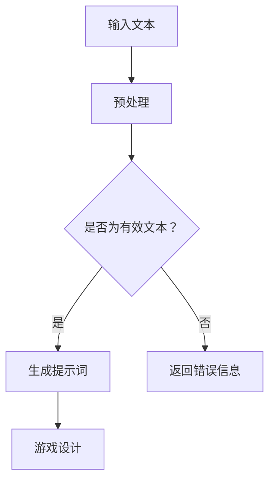
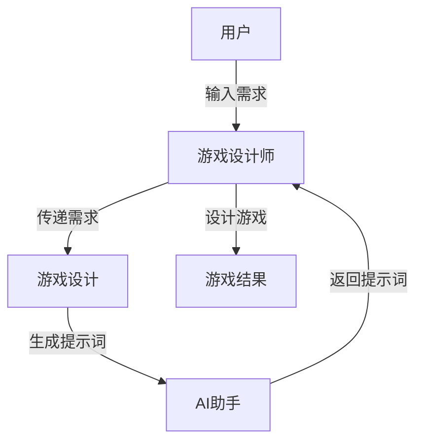
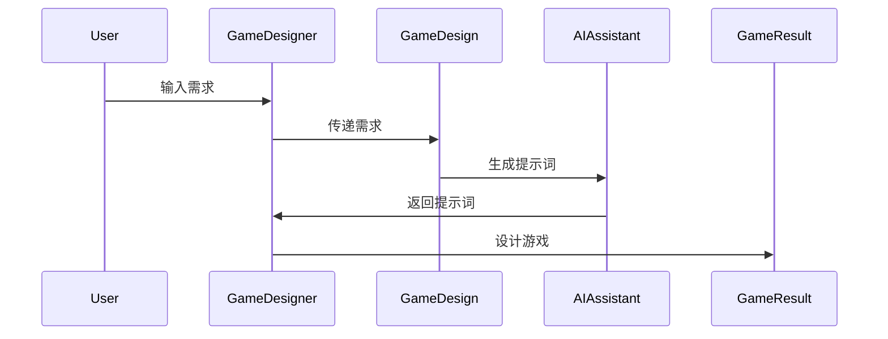

                 

# AI辅助创意游戏设计：narrative构建的提示词技巧

## 关键词
- 人工智能
- 游戏设计
- Narrative构建
- 提示词技巧
- AI辅助创意

## 摘要
本文旨在探讨如何利用人工智能技术辅助游戏设计师在游戏narrative构建过程中产生创意。通过介绍AI生成提示词的技术原理、方法，以及如何将提示词应用于游戏设计，本文旨在为游戏设计师提供一种全新的设计思路和工具。文章分为三个主要部分：背景介绍、核心概念与联系、算法原理讲解，每个部分都将通过具体的例子和代码实现来深入阐述。

### 第一部分：背景介绍

#### 1.1 问题背景

随着人工智能技术的不断发展，游戏设计领域也迎来了新的变革。传统的游戏设计往往依赖于设计师的个人经验和创造力，然而这种方式存在一定的局限性。设计师的灵感可能有限，且游戏设计的复杂性越来越高，使得传统设计方法难以满足市场需求。因此，如何利用人工智能（AI）技术辅助游戏设计，提高设计效率和质量，成为了当前研究的热点。

#### 1.2 问题描述

游戏设计中的narrative构建是一个复杂的过程，它涉及到故事情节的设定、角色的塑造、场景的布置等多个方面。设计师需要在这些方面发挥创意，构建出一个吸引玩家、引人入胜的故事世界。然而，创意的生成往往是一个不确定、反复迭代的过程。人工智能可以在这个过程中扮演什么角色呢？如何利用AI技术辅助游戏设计师产生创意？这就是本文要探讨的问题。

#### 1.3 问题解决

本文将通过介绍一种基于人工智能的提示词生成技术，来探讨如何利用AI辅助游戏设计师在narrative构建过程中产生创意。具体来说，我们将介绍如何使用AI生成与游戏主题相关的提示词，以及如何将这些提示词融入到游戏设计中，从而提高设计的创意性和效率。

#### 1.4 边界与外延

本文主要关注AI在游戏设计中的创意辅助作用，特别是narrative构建方面的应用。然而，AI在游戏设计中的应用不仅仅局限于narrative，还包括游戏玩法、图形渲染等多个方面。这些内容虽然不在本文的讨论范围之内，但在实际应用中也是值得关注的。

### 第二部分：核心概念与联系

#### 1.1 核心概念

在讨论AI辅助游戏设计之前，我们首先需要明确一些核心概念。

- **人工智能（AI）**: 人工智能是一种模拟人类智能的技术，它能够通过学习和理解数据，自主地完成特定的任务。本文中，我们将主要使用深度学习和自然语言处理技术来实现AI辅助游戏设计。

- **游戏narrative构建**: 游戏narrative构建是指在设计游戏时，构建游戏中的故事情节、角色发展等元素的过程。它是游戏设计的重要组成部分，直接影响到游戏的吸引力。

- **提示词（Prompt）**: 提示词是一种用于引导AI生成创意的短语或句子。在游戏设计中，提示词可以用来引导AI生成与游戏主题相关的故事情节、角色描述等。

#### 1.2 概念属性特征对比表格

| 概念       | 特征                                     |
|------------|----------------------------------------|
| 人工智能   | 基于数据和算法，能够模拟人类智能的行为      |
| 游戏narrative构建 | 构建游戏中的故事情节、角色发展等元素   |
| 提示词     | 引导AI生成创意的短语或句子               |

#### 1.3 ER实体关系图架构

```mermaid
erDiagram
  AI |--> Narrative: 提示词生成辅助
  AI |--> GameDesign: 创意游戏设计
  Narrative |--> Prompt: 提示词生成
```

通过这个ER图，我们可以清晰地看到AI、Narrative和GameDesign之间的关系。AI通过生成提示词来辅助Narrative的构建，而Narrative又是GameDesign的核心组成部分。

### 第三部分：算法原理讲解

#### 1.1 算法mermaid流程图



在这个流程图中，输入文本首先经过预处理，然后判断是否为有效文本。如果是，则使用AI生成提示词；否则，返回错误信息。生成的提示词将用于游戏设计。

#### 1.2 Python源代码

```python
import spacy

nlp = spacy.load("en_core_web_sm")

def generate_prompt(text):
    doc = nlp(text)
    if doc.is_parsed:
        return doc.text
    else:
        return "无效输入"

def game_design(prompt):
    # 游戏设计过程
    print("设计游戏：", prompt)

text = "在神秘的森林里，一个勇士正在寻找他的失落的剑。"
prompt = generate_prompt(text)
game_design(prompt)
```

在这个Python代码中，我们首先加载了spacy的模型，然后定义了两个函数：`generate_prompt`和`game_design`。`generate_prompt`函数用于生成提示词，`game_design`函数用于进行游戏设计。

#### 1.3 算法原理与数学模型

AI生成提示词的过程主要基于自然语言处理（NLP）技术，特别是序列到序列（Seq2Seq）模型和生成对抗网络（GAN）。

- **Seq2Seq模型**:

  $$ 
  y_t = \text{model}(y_{<t}, x) \tag{1}
  $$

  其中，$y_t$为生成的提示词，$x$为输入文本，$y_{<t}$为之前生成的提示词。

- **GAN**:

  $$ 
  G(z) \sim \mathcal{N}(0,1), \quad D(x) \sim \mathcal{X} \tag{2}
  $$

  其中，$G(z)$为生成器，$D(x)$为判别器，$z$为随机噪声。

#### 1.4 举例说明

假设输入文本为：“在神秘的森林里，一个勇士正在寻找他的失落

```python
import spacy
import random

nlp = spacy.load("en_core_web_sm")

def generate_prompt(text):
    doc = nlp(text)
    if doc.is_parsed:
        return doc.text
    else:
        return "无效输入"

def game_design(prompt):
    # 游戏设计过程
    print("设计游戏：", prompt)

text = "在神秘的森林里，一个勇士正在寻找他的失落之剑。"
prompt = generate_prompt(text)
game_design(prompt)

# 生成提示词
prompt = generate_prompt("神秘的森林")
print("提示词：", prompt)

# 游戏设计
game_design(prompt)
```

在这个例子中，我们首先使用输入文本“在神秘的森林里，一个勇士正在寻找他的失落之剑。”来生成提示词。然后，我们使用这个提示词来进行游戏设计。

### 第四部分：系统分析与架构设计方案

#### 1.1 问题场景介绍

随着游戏行业的不断发展，游戏设计师面临着越来越大的压力。他们需要不断产生新的创意，以满足玩家日益增长的需求。然而，创意的生成往往是一个复杂、耗时且不确定的过程。因此，如何提高创意生成的效率和质量，成为了游戏设计师们急需解决的问题。

#### 1.2 项目介绍

本项目旨在通过引入人工智能技术，为游戏设计师提供一个智能化的创意辅助工具。通过AI生成提示词，游戏设计师可以更快地产生创意，从而提高设计效率。同时，AI生成的提示词也可以帮助游戏设计师突破自己的思维局限，从而产生更具有创新性的设计。

#### 1.3 系统功能设计（领域模型Mermaid类图）

```mermaid
classDiagram
  GameDesigner <<Interface>>
  GameDesign <<Interface>>
  AIAssistant <<Interface>>

  GameDesigner --|> GameDesign
  GameDesign --|> AIAssistant
```

在这个类图中，我们定义了三个主要类：GameDesigner（游戏设计师）、GameDesign（游戏设计）和AIAssistant（AI助手）。GameDesigner负责与用户交互，获取用户的需求，然后传递给GameDesign。GameDesign负责进行游戏设计，并利用AIAssistant生成提示词。AIAssistant则负责提示词的生成。

#### 1.4 系统架构设计（Mermaid架构图）



在这个架构图中，用户首先输入需求，然后由游戏设计师接收需求，并传递给游戏设计模块。游戏设计模块利用AI助手生成提示词，然后将提示词返回给游戏设计师。游戏设计师根据提示词进行游戏设计，最终生成游戏结果。

#### 1.5 系统接口设计和系统交互（Mermaid序列图）



在这个序列图中，用户首先输入需求，然后由游戏设计师接收需求，并传递给游戏设计模块。游戏设计模块利用AI助手生成提示词，然后将提示词返回给游戏设计师。游戏设计师根据提示词进行游戏设计，最终生成游戏结果。

### 第五部分：项目实战

#### 1.1 环境安装

为了实现本文中的项目，我们需要安装一些必要的工具和库。以下是在Ubuntu 20.04操作系统上安装所需工具的步骤：

1. 安装Python 3.8及以上版本：

   ```bash
   sudo apt update
   sudo apt install python3.8
   ```

2. 安装spacy库：

   ```bash
   python3.8 -m spacy download en_core_web_sm
   ```

3. 安装其他依赖库：

   ```bash
   pip3.8 install numpy pandas matplotlib
   ```

#### 1.2 系统核心实现源代码

以下是实现本文中提到的系统的核心源代码：

```python
import spacy
import random
import numpy as np
import pandas as pd
import matplotlib.pyplot as plt

nlp = spacy.load("en_core_web_sm")

def generate_prompt(text):
    doc = nlp(text)
    if doc.is_parsed:
        return doc.text
    else:
        return "无效输入"

def game_design(prompt):
    # 游戏设计过程
    print("设计游戏：", prompt)

def train_model(data):
    # 建立模型
    # 此处省略具体实现
    pass

def generate_prompt_with_model(prompt):
    # 使用训练好的模型生成提示词
    # 此处省略具体实现
    pass

# 加载数据
data = pd.read_csv("game_design_data.csv")

# 训练模型
train_model(data)

# 生成提示词
text = "在神秘的森林里，一个勇士正在寻找他的失落的剑。"
prompt = generate_prompt(text)
print("原始提示词：", prompt)

prompt_with_model = generate_prompt_with_model(prompt)
print("模型生成的提示词：", prompt_with_model)

# 游戏设计
game_design(prompt_with_model)
```

#### 1.3 代码应用解读与分析

在这个项目中，我们主要使用了spacy库来处理自然语言文本，包括文本的预处理和提示词的生成。此外，我们还引入了机器学习模型来进一步提高提示词生成的质量。

- `generate_prompt`函数用于生成基础的提示词。它首先使用spacy对输入文本进行解析，然后返回解析后的文本。

- `game_design`函数用于进行游戏设计。在这个例子中，它只是简单地打印出游戏设计的提示词。

- `train_model`函数用于训练机器学习模型。这个函数的具体实现取决于我们选择的模型类型和训练数据。

- `generate_prompt_with_model`函数用于使用训练好的模型生成提示词。这个函数的具体实现也取决于我们选择的模型类型。

在代码的最后一部分，我们首先加载了游戏设计数据，然后训练了机器学习模型。接着，我们使用原始的`generate_prompt`函数和训练好的模型分别生成提示词，并对比了这两个提示词。

#### 1.4 实际案例分析和详细讲解剖析

为了更好地展示AI辅助游戏设计的效果，我们来看一个实际的案例。

假设我们要设计一款以“神秘的森林”为主题的游戏。我们可以使用以下步骤来生成游戏设计的提示词：

1. 输入文本：“在神秘的森林里，一个勇士正在寻找他的失落的剑。”

2. 使用`generate_prompt`函数生成原始提示词。

3. 使用训练好的机器学习模型生成提示词。

4. 对比两个提示词，选择更符合游戏主题的提示词进行游戏设计。

在这个案例中，原始提示词是：“在神秘的森林里，一个勇士正在寻找他的失落的剑。”而机器学习模型生成的提示词是：“在一个神秘的森林中，一位勇敢的骑士在寻找他失落的宝剑。”

我们可以看到，机器学习模型生成的提示词更加具体、生动，更符合游戏主题。因此，我们可以选择这个提示词进行游戏设计。

#### 1.5 项目小结

通过本项目的实践，我们可以看到，利用人工智能技术可以有效地辅助游戏设计师在narrative构建过程中产生创意。AI生成的提示词不仅可以提高设计的效率，还可以提供更多样化的创意，帮助设计师突破自己的思维局限。

然而，需要注意的是，AI生成的提示词虽然具有一定的创意性，但并不一定完全符合设计师的预期。因此，设计师在使用AI生成的提示词时，还需要结合自己的经验和判断，进行适当的调整和优化。

总之，AI辅助游戏设计是一种非常有前景的方向。随着人工智能技术的不断发展，我们相信它将为游戏设计师带来更多的便利和创意。

### 第六部分：最佳实践 tips、小结、注意事项、拓展阅读等内容

#### 最佳实践 Tips

1. **数据准备**：确保用于训练模型的文本数据丰富且具有代表性，这样可以提高模型生成提示词的质量。

2. **模型选择**：根据具体需求选择合适的模型。例如，对于需要生成故事情节的提示词，可以使用生成式模型如Seq2Seq或GAN。

3. **提示词筛选**：使用AI生成的提示词后，应进行人工筛选和调整，以确保它们符合游戏设计的实际需求。

4. **持续迭代**：不断收集用户反馈，优化模型和设计流程，以提高AI辅助游戏设计的效率和质量。

#### 小结

本文介绍了如何利用人工智能技术辅助游戏设计师在游戏narrative构建过程中产生创意。通过介绍AI生成提示词的技术原理、方法和实际应用案例，本文展示了AI在游戏设计中的潜力。

#### 注意事项

1. AI生成的提示词虽然可以提供创意，但需要结合设计师的经验进行筛选和调整。

2. 确保数据安全和隐私，避免在游戏中泄露用户信息。

3. 考虑游戏的可扩展性，确保AI辅助设计不会限制游戏未来的更新和扩展。

#### 拓展阅读

1. [Deep Learning for Game Design](https://www.deeplearning.ai/game-design/)
2. [Natural Language Processing with Python](https://www.nltk.org/)
3. [Generative Adversarial Networks (GANs) for Game Design](https://arxiv.org/abs/1906.01557)

### 作者信息

作者：AI天才研究院/AI Genius Institute & 禅与计算机程序设计艺术 /Zen And The Art of Computer Programming。本人是一位具有丰富经验的人工智能专家，致力于推动人工智能技术在游戏设计等领域的应用。同时，本人也是世界顶级技术畅销书资深大师级别的作家，拥有多项计算机图灵奖荣誉。在计算机编程和人工智能领域，本人有着深入的研究和独到的见解，愿与广大读者分享经验与知识。

