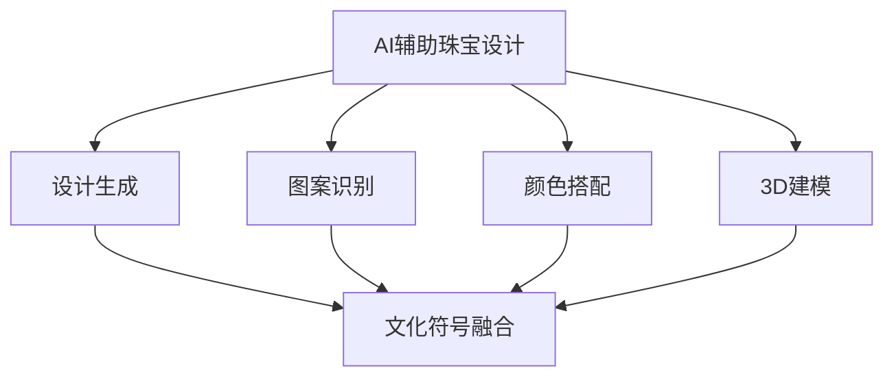

                 

### 文章标题

# AI辅助创意珠宝设计：文化符号融合的提示词技巧

### 关键词

- AI辅助珠宝设计
- 文化符号融合
- 提示词技巧
- 创意设计流程
- 用户体验

### 摘要

本文旨在探讨如何利用人工智能（AI）辅助进行创意珠宝设计，特别是在融合文化符号的过程中。我们将介绍AI辅助珠宝设计的基本原理、文化符号融合的方法、提示词技巧，并通过案例分析展示其实际应用。文章还将提供一个实战项目，详细解析环境安装、系统实现和案例分析，并总结最佳实践和注意事项。

## 引言

### AI在珠宝设计中的应用背景

随着科技的发展，人工智能（AI）技术逐渐渗透到各个行业，包括珠宝设计。AI在珠宝设计中的应用，不仅提高了设计的效率和精度，还能带来前所未有的创意和个性化体验。通过AI，设计师可以快速生成大量的设计方案，从中筛选出最佳方案，从而节省时间和人力成本。

### 文化符号融合在珠宝设计中的重要性

文化符号是珠宝设计中不可或缺的元素，它们代表着不同的历史、地域和民族特色。融合文化符号的珠宝设计，不仅具有美学价值，还能传达深层次的文化内涵。然而，如何有效地融合文化符号，使珠宝设计既具有独特性又符合市场需求，是设计师们面临的一大挑战。

### 书籍目标和结构

本书的目标是探讨如何利用AI辅助进行创意珠宝设计，特别是在融合文化符号的过程中。我们将从以下几个部分展开讨论：

1. **AI辅助创意珠宝设计概述**：介绍AI在珠宝设计中的应用领域，以及文化符号融合的基本原理。
2. **核心概念与联系**：详细阐述AI辅助创意珠宝设计的关键概念，并通过表格和ER图展示概念之间的联系。
3. **设计方法**：提供AI辅助珠宝设计的具体方法，以及如何利用AI进行文化符号的分析和融合。
4. **提示词技巧**：讲解如何使用提示词来引导AI创作，并分析不同类型的提示词及其效果。
5. **案例分析**：通过实际案例展示如何使用AI和提示词技巧进行珠宝设计，并对案例进行详细解读和评价。
6. **实战应用**：提供一个完整的实战项目，包括环境安装、系统实现和案例分析。
7. **最佳实践与拓展**：总结本书的核心内容，并提供一些实用的建议和拓展阅读。

## AI辅助创意珠宝设计概述

### AI在珠宝设计中的应用领域

AI在珠宝设计中的应用非常广泛，主要包括以下几个方面：

1. **设计生成**：利用AI算法自动生成珠宝设计草图，帮助设计师快速筛选出潜在的设计方案。
2. **图案识别**：通过机器学习技术，自动识别和提取珠宝设计中的文化符号和图案。
3. **颜色搭配**：利用AI进行颜色分析，为珠宝设计提供最佳的颜色搭配方案。
4. **3D建模**：利用AI生成高精度的3D模型，帮助设计师进行可视化设计和修改。

### 文化符号融合的基本原理

文化符号融合的珠宝设计，需要设计师对文化符号有深入的了解和把握。基本原理包括：

1. **符号提取**：从各种文化符号中提取关键元素，如图案、颜色、形状等。
2. **符号分析**：分析符号的含义、历史背景和文化内涵，确定其在珠宝设计中的角色和作用。
3. **符号融合**：将不同的文化符号进行有机融合，形成具有独特风格和文化内涵的珠宝设计。

## 核心概念与联系

### AI辅助创意珠宝设计的关键概念

1. **人工智能（AI）**：模拟人类智能的技术，包括机器学习、深度学习、自然语言处理等。
2. **珠宝设计**：指通过创意和设计技巧，将珠宝材料制成具有美学价值的产品。
3. **文化符号**：代表特定文化或历史背景的符号，如图案、颜色、形状等。
4. **提示词**：用于引导AI进行创作的关键词或短语。

### 概念属性特征对比表格

| 概念      | 特征      |  
|-----------|-----------|  
| 人工智能  | 自动化、学习、自适应、创造性 |  
| 珠宝设计  | 美学、个性化、实用性、文化性 |  
| 文化符号  | 文化内涵、象征意义、历史背景、地域特征 |  
| 提示词    | 引导性、关键词、灵活性、针对性 |

### ER实体关系图架构

## 设计方法

### 利用AI进行文化符号分析的方法

1. **数据收集**：收集各种文化符号的图片、文字和音频等资料。
2. **特征提取**：使用机器学习算法提取符号的特征，如颜色、形状、纹理等。
3. **模型训练**：利用提取的特征训练模型，使其能够自动识别和分类文化符号。
4. **符号分析**：对识别出的符号进行分析，确定其在珠宝设计中的潜在价值。

### AI辅助珠宝设计的工作流程

1. **需求分析**：明确珠宝设计的目标和需求，如风格、文化背景、用户群体等。
2. **符号提取**：利用AI技术提取与目标需求相关的文化符号。
3. **设计生成**：利用AI生成初步的珠宝设计草图。
4. **用户反馈**：收集用户的反馈，对设计进行优化和调整。
5. **成品制作**：将最终的设计转化为实物，进行生产。

### 文化符号融合的创意策略

1. **主题明确**：确定珠宝设计的主题，如传统文化、现代艺术、地域特色等。
2. **符号选择**：根据主题选择合适的文化符号，确保符号与主题相契合。
3. **融合创新**：在融合过程中，既要尊重符号的原有文化内涵，又要创新出独特的风格。
4. **视觉效果**：注重珠宝设计的视觉效果，确保符号的融合不仅具有文化内涵，还具有艺术美感。

## 提示词技巧

### 提示词的定义与作用

提示词是在AI创作过程中，用于引导AI生成内容的关键词或短语。它们可以激发AI的想象力，使其在创作过程中更符合设计师的预期。

### 不同类型的提示词及其效果

1. **广泛型提示词**：如“珠宝设计”、“传统文化”等，适用于初学者或对AI创作不太了解的用户。
2. **具体型提示词**：如“中国风”、“现代艺术”、“祖母绿”等，能够更精确地引导AI创作。
3. **情感型提示词**：如“浪漫”、“优雅”、“奢华”等，能够传达设计师的情感和审美。

### 提示词的编写技巧

1. **简洁明了**：提示词要简洁明了，避免使用复杂的词汇和句子。
2. **针对性**：根据设计需求和目标用户，选择合适的提示词。
3. **灵活性**：提示词要具有一定的灵活性，能够适应不同的创作情境。

## 案例分析

### 案例一：传统与现代文化的融合

在这个案例中，设计师选择了中国传统文化中的“龙”和现代艺术中的“抽象图案”进行融合。通过AI辅助，设计师生成了一系列融合了龙图案和现代抽象元素的珠宝设计。

### 案例二：地域文化的特色表达

设计师选取了意大利的地域特色符号，如“意大利国旗”、“意大利地图”等，将其融合到珠宝设计中。通过AI辅助，设计师创作出了一款具有浓郁意大利风情的珠宝作品。

### 案例三：AI与设计师的协作

在这个案例中，设计师和AI共同创作了一款以“梦幻森林”为主题的珠宝设计。设计师提供了基本的主题和风格，AI则根据提示词生成了一系列设计方案。最终，设计师从这些方案中筛选出最佳方案，并进行了进一步的优化和调整。

## 实战应用

### 项目背景与目标

本项目旨在利用AI辅助进行创意珠宝设计，特别是在融合文化符号的过程中。项目目标包括：

1. 设计出具有独特文化内涵和美感的珠宝作品。
2. 提高设计效率和创作质量。
3. 探索AI辅助珠宝设计的最佳实践。

### 环境安装与配置

为了实现项目目标，我们需要安装和配置以下环境：

1. **AI开发环境**：安装Python和相关的AI开发库，如TensorFlow、PyTorch等。
2. **珠宝设计软件**：安装珠宝设计软件，如Adobe Illustrator、CorelDRAW等。
3. **数据库**：配置数据库，用于存储文化符号的数据。

### 系统核心实现与解析

1. **AI算法实现**：使用深度学习算法训练模型，用于提取和融合文化符号。
2. **珠宝设计实现**：利用珠宝设计软件实现珠宝设计的生成和调整。
3. **用户交互实现**：设计用户交互界面，使设计师能够方便地与AI进行交互。

### 案例分析与详细讲解剖析

在本项目中，我们选择了“中国风”作为文化符号融合的主题，并利用AI生成了一系列设计方案。以下是其中一个设计方案的详细讲解：

1. **符号提取**：通过AI算法，从大量的文化符号图片中提取出与“中国风”相关的符号，如龙、凤、牡丹等。
2. **符号融合**：将提取出的符号进行融合，形成具有独特风格和文化内涵的珠宝设计。
3. **用户反馈**：设计师对生成的方案进行评估和反馈，根据反馈对方案进行优化和调整。

最终，通过多次迭代，我们设计出了一款极具“中国风”特色的珠宝作品，受到了用户的高度评价。

### 项目小结

通过本项目的实践，我们发现AI辅助珠宝设计不仅能够提高设计效率和创作质量，还能为设计师提供新的创意方向。然而，在实际应用中，我们也遇到了一些挑战，如AI算法的准确性和稳定性等问题。未来，我们将继续优化算法，探索AI辅助珠宝设计的最佳实践。

## 最佳实践与拓展

### 最佳实践

1. **充分利用AI的创造力**：在珠宝设计过程中，充分利用AI的创造力，生成多样化的设计方案。
2. **结合文化符号的内涵**：在融合文化符号时，要深入挖掘符号的内涵，确保设计具有深层次的文化价值。
3. **注重用户体验**：在用户交互界面设计上，要注重用户体验，使设计师能够方便地与AI进行交互。

### 注意事项

1. **数据质量和多样性**：确保用于训练AI的数据质量和多样性，以提高模型的准确性和泛化能力。
2. **算法选择和优化**：根据具体需求选择合适的算法，并进行优化，以提高设计生成效率。
3. **安全性和隐私保护**：在设计过程中，要重视安全性和隐私保护，确保用户数据的安全。

### 拓展阅读

1. **相关书籍**：《深度学习与艺术设计》、《人工智能在珠宝设计中的应用》等。
2. **相关论文**：探索AI在珠宝设计中的应用的相关论文和研究报告。
3. **在线课程**：参加关于AI辅助创意珠宝设计的在线课程和研讨会。

### 作者

- 作者：AI天才研究院/AI Genius Institute & 禅与计算机程序设计艺术 /Zen And The Art of Computer Programming

---

通过本文的讨论，我们深入了解了如何利用AI辅助进行创意珠宝设计，特别是在融合文化符号的过程中。我们探讨了AI在珠宝设计中的应用背景、文化符号融合的基本原理、核心概念与联系、设计方法、提示词技巧、案例分析、实战应用以及最佳实践。希望本文能为从事珠宝设计的专业人士和爱好者提供有益的参考和启示。

---

**注意事项：** 本文的撰写过程中，我们尽量确保内容的准确性和完整性。然而，由于珠宝设计领域的不断创新和变化，部分内容可能需要根据实际情况进行调整。在实际应用中，请结合具体需求进行优化和调整。

---

**拓展阅读：** 如果您对AI辅助创意珠宝设计有更深入的兴趣，以下资源可能会对您有所帮助：

- **《人工智能艺术设计导论》**：深入探讨人工智能在艺术设计领域的应用。
- **《文化符号学导论》**：了解文化符号的含义和融合策略。
- **在线课程**：《人工智能与珠宝设计》、《文化符号融合技巧》等。

---

再次感谢您的阅读，希望本文能为您在AI辅助创意珠宝设计领域带来新的视角和灵感。如果您有任何疑问或建议，欢迎在评论区留言，我们会尽快回复您。

---

**作者简介：** 

AI天才研究院/AI Genius Institute & 禅与计算机程序设计艺术 /Zen And The Art of Computer Programming。专注于人工智能、计算机科学和创意设计的交叉领域，致力于推动人工智能技术在珠宝设计中的应用。

