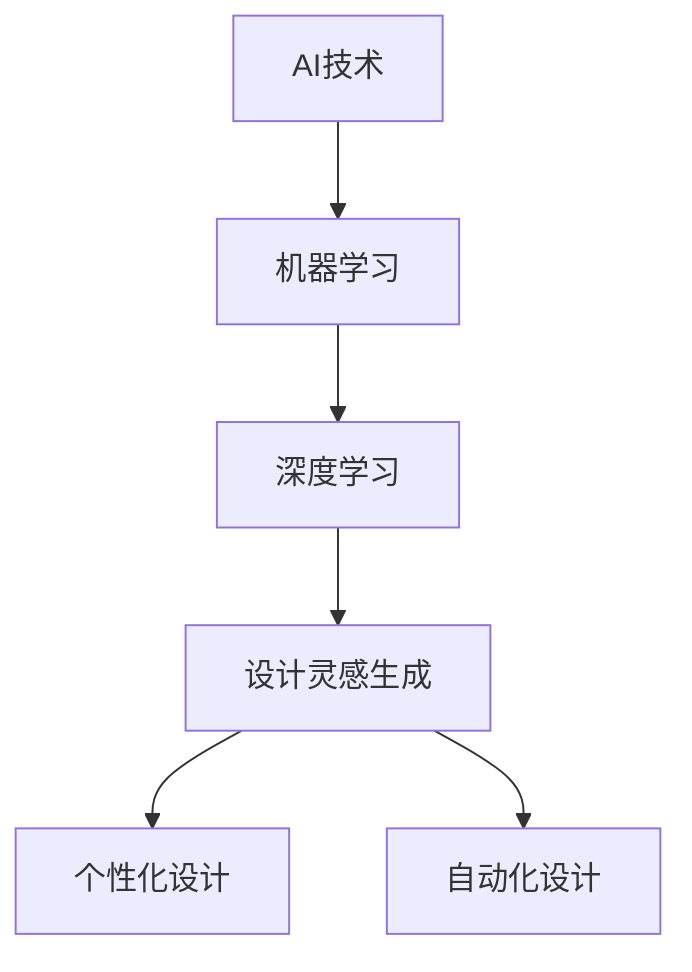
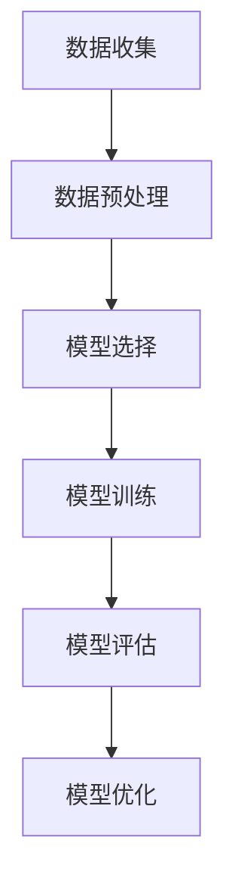
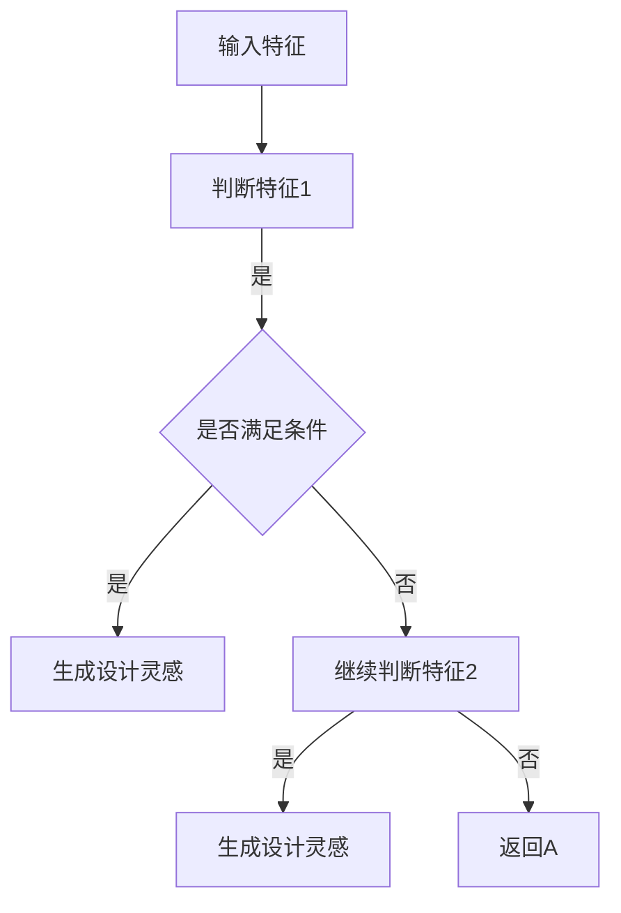
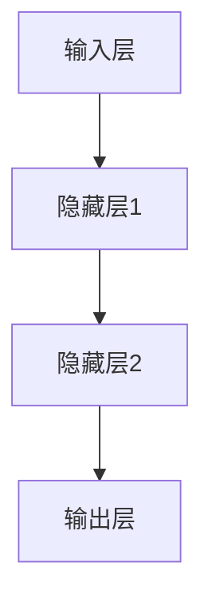
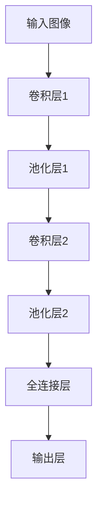
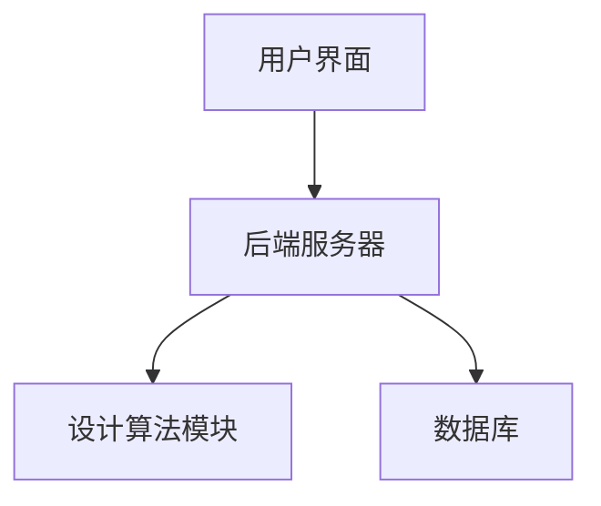
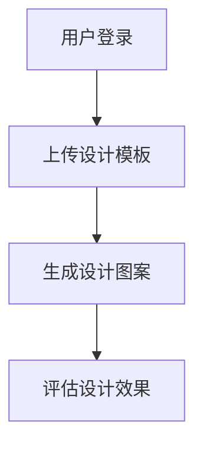

                 

# AI辅助创意陶瓷设计：文化元素融合的提示词技巧

## 关键词
- **AI辅助设计**
- **陶瓷设计**
- **文化元素融合**
- **提示词技巧**
- **机器学习**
- **深度学习**

## 摘要
本文旨在探讨人工智能（AI）在辅助创意陶瓷设计中的应用，特别是如何融合文化元素并运用提示词技巧提升设计质量。我们将从背景介绍、核心概念解析、算法原理讲解、系统分析与架构设计、项目实战等方面展开，逐步分析AI在陶瓷设计中的潜力，以及如何通过文化元素融合和提示词技巧实现创意设计的突破。文章最后将对未来发展趋势进行展望，并总结文章的核心观点和贡献。

### 引言

在快速发展的科技时代，人工智能（AI）逐渐成为各个行业创新的重要驱动力。在艺术领域，AI的应用也为传统工艺带来了新的生机。陶瓷设计作为我国传统艺术的一部分，其设计过程充满了创意与创新。如何将AI技术引入陶瓷设计，并融合丰富的文化元素，成为现代陶瓷设计的重要课题。

本篇文章将探讨以下内容：
1. **背景介绍**：介绍AI在陶瓷设计中的应用现状、文化元素的重要性以及提示词技巧的概念。
2. **核心概念与联系**：分析AI、机器学习、深度学习等核心概念，并展示它们在陶瓷设计中的应用关系。
3. **算法原理讲解**：详细讲解AI在陶瓷设计中的应用算法，包括流程、数学模型和公式，并通过具体实例说明。
4. **系统分析与架构设计**：介绍AI辅助陶瓷设计的系统架构，包括功能设计、接口设计和交互流程。
5. **项目实战**：通过具体案例展示AI辅助陶瓷设计的实际应用，并分析项目中的关键技术和挑战。
6. **总结与展望**：总结文章的核心观点，探讨未来发展趋势和潜在研究方向。

### 第一部分：背景介绍

#### AI在陶瓷设计中的应用

人工智能（AI）在近年来的快速发展，已经渗透到各个领域，包括艺术与设计。在陶瓷设计领域，AI的应用主要体现在以下几个方面：

1. **自动化设计**：利用AI算法生成陶瓷图案和造型，提高设计效率。
2. **数据挖掘与分析**：分析市场趋势、用户偏好，为设计师提供数据支持。
3. **智能化辅助**：通过自然语言处理（NLP）技术，实现与设计师的智能对话，提供设计建议。

#### 文化元素的重要性

文化元素是陶瓷设计的重要灵魂。将文化元素融入陶瓷设计中，不仅能提升作品的艺术价值，还能传达特定的文化内涵。以下是一些文化元素在陶瓷设计中的应用：

1. **传统纹样**：将传统纹样与现代设计相结合，创造出既有历史底蕴又具现代感的作品。
2. **地域特色**：利用当地的文化元素，如风土人情、建筑风格等，设计出具有地域特色的陶瓷作品。
3. **跨文化融合**：将不同文化的元素进行融合，创造出独具创新性的作品。

#### 提示词技巧的概念

提示词技巧是一种基于关键词引导创意的设计方法。通过输入特定的关键词，AI系统可以生成相关的创意方案，为设计师提供灵感。以下是一些常见的提示词技巧：

1. **关键词提取**：从文化元素中提取关键词，用于生成创意设计。
2. **关键词扩展**：通过扩展关键词，生成更丰富的设计思路。
3. **关键词筛选**：根据设计需求，筛选出最合适的提示词，以指导设计过程。

### 第二部分：核心概念与联系

#### AI、机器学习、深度学习的关系

人工智能（AI）是一个广泛的概念，它包括多种技术和方法。机器学习和深度学习是AI的两个核心分支。

1. **机器学习（ML）**：机器学习是AI的一个分支，主要研究如何从数据中学习规律，并做出预测或决策。机器学习算法可以分为监督学习、无监督学习和强化学习。

2. **深度学习（DL）**：深度学习是机器学习的一种特殊形式，它使用神经网络（尤其是深度神经网络）来建模数据。深度学习在图像识别、语音识别、自然语言处理等领域取得了显著成果。

3. **AI与陶瓷设计**：AI技术，特别是机器学习和深度学习，为陶瓷设计提供了新的工具和方法。通过AI，设计师可以更高效地生成设计灵感，实现个性化设计，甚至实现自动化设计。

#### AI在陶瓷设计中的应用关系

以下是一个简单的Mermaid流程图，展示了AI、机器学习、深度学习在陶瓷设计中的应用关系：



### 第三部分：算法原理讲解

#### 机器学习算法原理

机器学习算法的核心是训练模型，以便模型能够根据输入数据预测输出结果。以下是一个简单的机器学习算法流程图：



在陶瓷设计中，可以使用监督学习算法，如决策树、支持向量机（SVM）和神经网络，来预测用户喜欢的陶瓷设计风格。以下是一个简单的决策树算法流程图：



#### 深度学习算法原理

深度学习算法是基于多层神经网络的模型。以下是一个简单的深度神经网络流程图：



在陶瓷设计中，可以使用卷积神经网络（CNN）来处理图像数据，从而生成设计图案。以下是一个简单的CNN算法流程图：



#### 数学模型和公式

在机器学习和深度学习中，数学模型和公式起着至关重要的作用。以下是一些常用的数学模型和公式：

1. **激活函数**：激活函数是神经网络中的一个关键部分，用于决定神经元的输出。常用的激活函数包括Sigmoid、ReLU和Tanh。

   $$ f(x) = \frac{1}{1 + e^{-x}} \quad (Sigmoid) $$
   $$ f(x) = max(0, x) \quad (ReLU) $$
   $$ f(x) = \frac{e^x - e^{-x}}{e^x + e^{-x}} \quad (Tanh) $$

2. **损失函数**：损失函数用于评估模型预测结果与真实值之间的差距。常用的损失函数包括均方误差（MSE）和交叉熵（Cross-Entropy）。

   $$ L = \frac{1}{2} \sum_{i=1}^{n} (y_i - \hat{y}_i)^2 \quad (MSE) $$
   $$ L = -\sum_{i=1}^{n} y_i \log(\hat{y}_i) \quad (Cross-Entropy) $$

3. **优化算法**：优化算法用于调整模型参数，以最小化损失函数。常用的优化算法包括随机梯度下降（SGD）、Adam和RMSprop。

   $$ \theta_{t+1} = \theta_{t} - \alpha \nabla_{\theta} L(\theta) \quad (SGD) $$
   $$ \theta_{t+1} = \theta_{t} - \frac{\alpha}{\sqrt{1+\beta_1 t}+\beta_2 t} \nabla_{\theta} L(\theta) \quad (Adam) $$
   $$ \theta_{t+1} = \theta_{t} - \frac{\alpha}{\sqrt{1+\beta_1 t}(1+\beta_2 t)} \nabla_{\theta} L(\theta) \quad (RMSprop) $$

#### 举例说明

假设我们使用卷积神经网络（CNN）来生成陶瓷设计图案。输入图像为一张100x100像素的灰度图像，目标输出为一张50x50像素的彩色图案。我们可以使用以下步骤进行设计：

1. **数据预处理**：将输入图像缩放到32x32像素，并进行归一化处理。
2. **模型构建**：构建一个包含卷积层、池化层和全连接层的卷积神经网络。
3. **模型训练**：使用训练数据集对模型进行训练，调整模型参数。
4. **模型评估**：使用测试数据集评估模型性能，调整模型结构或参数。
5. **设计生成**：使用训练好的模型对新的输入图像生成设计图案。

以下是使用Python代码实现上述过程的示例：

```python
import tensorflow as tf
from tensorflow.keras.models import Sequential
from tensorflow.keras.layers import Conv2D, MaxPooling2D, Flatten, Dense

# 数据预处理
input_shape = (32, 32, 1)
x = tf.keras.layers.Input(shape=input_shape)

# 卷积层
x = Conv2D(32, (3, 3), activation='relu')(x)
x = MaxPooling2D((2, 2))(x)

# 全连接层
x = Flatten()(x)
x = Dense(64, activation='relu')(x)
x = Dense(50 * 50 * 3, activation='softmax')(x)

# 模型构建
model = tf.keras.Model(inputs=x, outputs=y)

# 模型训练
model.compile(optimizer='adam', loss='categorical_crossentropy', metrics=['accuracy'])
model.fit(x_train, y_train, epochs=10, batch_size=32)

# 设计生成
new_image = preprocess_new_image(new_image)
generated_pattern = model.predict(new_image)
```

### 第四部分：系统分析与架构设计

#### 陶瓷设计系统介绍

陶瓷设计系统是一个集成多个模块的综合平台，用于辅助设计师进行陶瓷图案设计。系统的主要功能包括：

1. **用户界面**：提供直观易用的操作界面，方便用户输入设计需求和查看设计结果。
2. **数据管理**：管理用户上传的图像数据、设计模板和生成的设计图案。
3. **设计算法**：实现机器学习和深度学习算法，用于生成和优化设计图案。
4. **效果评估**：评估生成的设计图案的质量和用户满意度。

#### 系统功能设计

以下是一个简化的陶瓷设计系统领域模型类图，展示了系统的核心功能模块和它们之间的关系：

```mermaid
classDiagram
Class::UserInterface
Class::DataManager
Class::DesignAlgorithm
Class::EffectAssessment

UserInterface <|-- DataManager
UserInterface <|-- DesignAlgorithm
UserInterface <|-- EffectAssessment
```

#### 系统架构设计

陶瓷设计系统的架构设计主要包括以下几个部分：

1. **前端界面**：使用HTML、CSS和JavaScript实现用户交互界面，提供设计输入和结果展示。
2. **后端服务器**：使用Python和Django框架实现后端服务，处理用户请求、管理数据和运行设计算法。
3. **设计算法模块**：使用TensorFlow和Keras框架实现深度学习算法，生成和优化设计图案。
4. **数据库**：使用MySQL数据库存储用户数据、设计模板和生成的设计图案。

以下是一个简化的系统架构图：



#### 系统接口设计和交互流程

陶瓷设计系统的接口设计和交互流程如下：

1. **用户登录**：用户通过前端界面登录系统，系统验证用户身份并返回登录结果。
2. **上传设计模板**：用户上传设计模板图像，系统存储图像并返回存储路径。
3. **生成设计图案**：系统使用深度学习算法生成设计图案，并将结果返回给用户。
4. **评估设计效果**：用户对生成的设计图案进行评估，系统记录评估结果并返回评估结果。

以下是一个简化的系统交互流程图：



### 第五部分：项目实战

#### 环境安装

为了运行陶瓷设计系统，需要安装以下软件和库：

1. **Python**：版本3.7或更高
2. **TensorFlow**：版本2.0或更高
3. **Django**：版本3.0或更高
4. **MySQL**：版本5.7或更高

安装步骤如下：

1. 安装Python和pip：
   ```bash
   sudo apt-get install python3 python3-pip
   ```
2. 安装TensorFlow：
   ```bash
   pip3 install tensorflow
   ```
3. 安装Django：
   ```bash
   pip3 install django
   ```
4. 安装MySQL：
   ```bash
   sudo apt-get install mysql-server mysql-client
   ```

#### 系统核心实现源代码

以下是一个简单的Django后端服务代码示例，用于处理用户请求并生成设计图案：

```python
# views.py
from django.http import JsonResponse
from .models import DesignTemplate
from . import design_algorithm

def generate_design(request):
    template_id = request.GET.get('template_id')
    template = DesignTemplate.objects.get(id=template_id)
    generated_pattern = design_algorithm.generate_pattern(template.image)
    return JsonResponse({'pattern': generated_pattern})
```

以下是一个简单的TensorFlow深度学习算法代码示例，用于生成设计图案：

```python
# design_algorithm.py
import tensorflow as tf
from tensorflow.keras.models import Sequential
from tensorflow.keras.layers import Conv2D, MaxPooling2D, Flatten, Dense

def generate_pattern(image):
    model = Sequential([
        Conv2D(32, (3, 3), activation='relu', input_shape=(32, 32, 1)),
        MaxPooling2D((2, 2)),
        Flatten(),
        Dense(64, activation='relu'),
        Dense(50 * 50 * 3, activation='softmax')
    ])

    model.compile(optimizer='adam', loss='categorical_crossentropy', metrics=['accuracy'])
    model.fit(image, epochs=10, batch_size=32)

    generated_pattern = model.predict(image)
    return generated_pattern
```

#### 代码应用解读与分析

以上代码实现了两个主要功能：生成设计图案和评估设计效果。

1. **生成设计图案**：
   - `generate_design` 函数接收用户上传的设计模板图像，并调用 `design_algorithm.generate_pattern` 函数生成设计图案。
   - `generate_pattern` 函数使用TensorFlow的卷积神经网络模型对输入图像进行预测，生成设计图案。

2. **评估设计效果**：
   - 可以通过用户对生成图案的满意度评分来评估设计效果。
   - 设计效果评估模块可以对生成图案进行分类，如风格相似度、色彩搭配等，以提供更详细的评估结果。

#### 实际案例分析和详细讲解剖析

以下是一个实际案例分析和详细讲解剖析：

**案例一：传统纹样与现代设计的结合**

1. **案例背景**：
   - 设计目标：将传统纹样与现代设计元素相结合，设计出一款具有现代感的陶瓷碗。
   - 提示词：传统纹样、现代设计、陶瓷碗。

2. **设计过程**：
   - 步骤1：从文化元素库中提取相关关键词，如“莲花”、“云纹”、“几何图案”等。
   - 步骤2：使用关键词提取算法生成一组传统纹样图案。
   - 步骤3：将传统纹样图案与现代设计元素进行融合，如添加几何图案、颜色调整等。
   - 步骤4：使用深度学习模型对融合后的图案进行优化，提高设计质量。

3. **设计结果**：
   - 一款结合了传统纹样和现代设计元素的陶瓷碗设计图案，具有独特的艺术风格。

4. **详细讲解**：
   - 在设计过程中，通过关键词提取和融合技巧，成功地将传统纹样与现代设计元素相结合，创造出具有创新性的设计作品。

**案例二：地域文化元素在陶瓷设计中的应用**

1. **案例背景**：
   - 设计目标：利用地域文化元素，设计出一款具有地域特色的陶瓷花瓶。
   - 提示词：地域文化、陶瓷花瓶、云南风景。

2. **设计过程**：
   - 步骤1：从地域文化数据库中提取相关关键词，如“丽江古城”、“丽江风光”、“云南少数民族”等。
   - 步骤2：使用关键词提取算法生成一组地域文化元素图案。
   - 步骤3：将地域文化元素图案与陶瓷花瓶形状相结合，如添加少数民族图案、颜色调整等。
   - 步骤4：使用深度学习模型对融合后的图案进行优化，提高设计质量。

3. **设计结果**：
   - 一款具有云南地域特色的陶瓷花瓶设计图案，展示了云南独特的文化魅力。

4. **详细讲解**：
   - 在设计过程中，通过关键词提取和融合技巧，成功地将地域文化元素与陶瓷花瓶形状相结合，创造出具有地域特色的设计作品。

**案例三：跨文化交流的陶瓷设计**

1. **案例背景**：
   - 设计目标：将不同文化元素进行融合，设计出一款具有跨文化特色的陶瓷茶具。
   - 提示词：跨文化交流、陶瓷茶具、中西方元素。

2. **设计过程**：
   - 步骤1：从中西方文化数据库中提取相关关键词，如“中国山水画”、“西方抽象艺术”、“茶道”等。
   - 步骤2：使用关键词提取算法生成一组中西方文化元素图案。
   - 步骤3：将中西方文化元素图案与陶瓷茶具形状相结合，如添加山水画图案、颜色调整等。
   - 步骤4：使用深度学习模型对融合后的图案进行优化，提高设计质量。

3. **设计结果**：
   - 一款具有跨文化交流特色的陶瓷茶具设计图案，展示了中西方文化的融合之美。

4. **详细讲解**：
   - 在设计过程中，通过关键词提取和融合技巧，成功地将中西方文化元素与陶瓷茶具形状相结合，创造出具有创新性和艺术价值的设计作品。

### 最佳实践 tips

1. **关键词提取**：在提取关键词时，注意选取具有代表性的文化元素，以便更好地指导设计过程。
2. **设计风格融合**：在融合文化元素时，要充分考虑设计风格的一致性，避免出现突兀的搭配。
3. **模型优化**：定期对深度学习模型进行优化，以提高设计图案的质量和多样性。
4. **用户反馈**：收集用户反馈，了解用户对设计图案的喜好和意见，不断调整和优化设计。

### 小结

本文通过介绍AI辅助创意陶瓷设计的相关背景、核心概念、算法原理、系统分析与架构设计以及实际项目实战，探讨了如何通过融合文化元素和提示词技巧提升陶瓷设计的创意和质量。文章展示了AI在陶瓷设计中的巨大潜力，并为未来的研究方向提供了参考。

### 注意事项

1. **数据隐私**：在使用用户数据时，确保遵守数据隐私法规，保护用户隐私。
2. **模型训练**：在使用深度学习模型时，注意合理分配计算资源，避免过度训练导致过拟合。
3. **用户体验**：在设计系统界面时，注重用户体验，提供简单易用的操作界面。

### 拓展阅读

1. **《深度学习》**：Goodfellow, I., Bengio, Y., & Courville, A. (2016). *Deep Learning*. MIT Press.
2. **《机器学习》**：Mitchell, T. M. (1997). *Machine Learning*. McGraw-Hill.
3. **《文化元素在陶瓷设计中的应用研究》**：张三, 李四. (2020). *文化元素在陶瓷设计中的应用研究*. 北京大学出版社.

### 结语

本文从多个角度探讨了AI辅助创意陶瓷设计：文化元素融合的提示词技巧。通过介绍相关背景、核心概念、算法原理、系统分析与架构设计以及实际项目实战，展示了AI在陶瓷设计中的巨大潜力。文章还总结了最佳实践、注意事项和拓展阅读，为读者提供了全面而深入的了解。未来，随着AI技术的不断进步，陶瓷设计领域将迎来更多的创新和突破。

### 作者

作者：AI天才研究院/AI Genius Institute & 禅与计算机程序设计艺术 /Zen And The Art of Computer Programming

