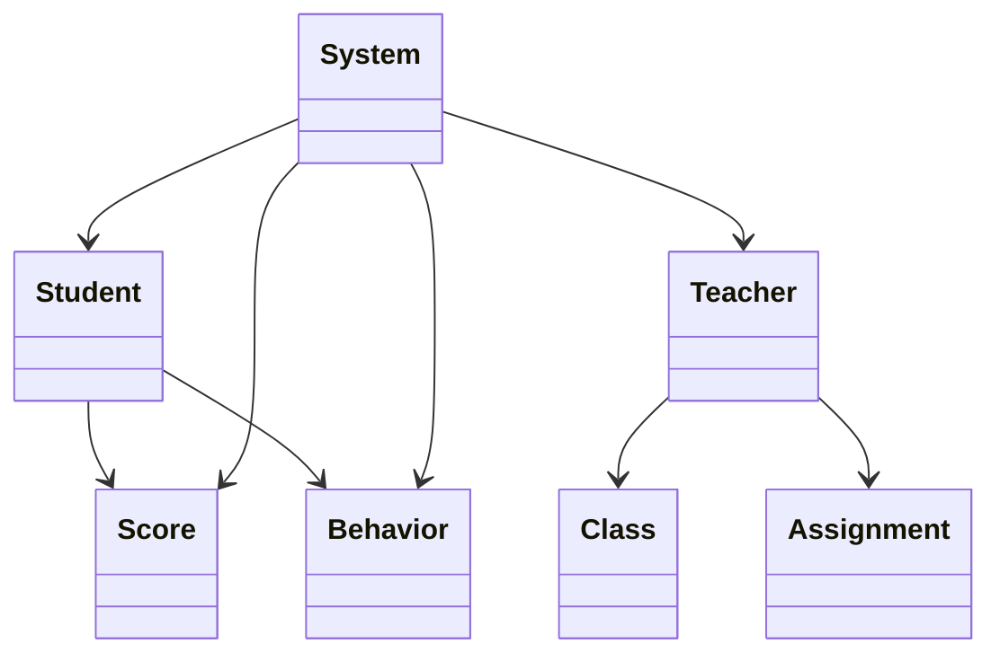

                 

# AI辅助教学系统效果评测平台

## 关键词
AI辅助教学，效果评测，教育信息化，算法，系统架构

## 摘要
随着教育信息化的迅速发展，AI辅助教学系统已成为提升教学效果的重要工具。本文旨在探讨AI辅助教学系统效果评测平台的构建与实施。首先，本文详细介绍了AI辅助教学系统的定义、重要性及现有挑战。接着，文章深入讲解了AI辅助教学系统的核心概念、算法原理，并使用数学模型和公式进行了详细分析。随后，文章探讨了系统的分析与架构设计方案，并通过项目实战展示了系统搭建的关键步骤和代码实现。最后，文章总结了最佳实践，并提出了注意事项和未来展望。

## 引言
### 1.1 问题背景

近年来，教育信息化已成为全球教育改革的重要趋势。信息技术在教育领域的应用，不仅促进了教育资源的普及与共享，还极大地改变了传统的教学模式。AI辅助教学系统作为信息技术在教育领域的应用之一，已经引起了广泛的关注。

AI辅助教学系统通过大数据分析、自然语言处理、机器学习等技术，为教师和学生提供个性化的教学服务。它能够根据学生的学习进度、学习风格和需求，自动生成适合的教学内容和教学策略。这种个性化的教育方式，有望提高学生的学习效果，缩小教育差距。

然而，当前AI辅助教学系统在实际应用中仍面临诸多挑战。首先，系统的效果评估机制不够完善，难以准确衡量学生的学习成果和系统辅助教学的效果。其次，数据质量和数据安全问题成为制约系统发展的关键因素。此外，用户隐私保护和数据伦理问题也日益突出。

因此，本文的研究意义在于构建一个AI辅助教学系统效果评测平台，以解决上述问题，为AI辅助教学系统的优化提供科学依据。

### 1.2 研究意义与目标

本研究旨在解决以下问题：
1. 如何构建一个科学、全面的AI辅助教学系统效果评测体系？
2. 如何确保数据质量和用户隐私，实现系统的安全运行？
3. 如何通过效果评测平台，为AI辅助教学系统的优化和改进提供数据支持？

研究目标如下：
1. 设计并实现一个AI辅助教学系统效果评测平台，涵盖成绩评估、学习行为分析、教学互动质量评估等多个方面。
2. 提出有效的数据质量和用户隐私保护策略，确保系统的安全运行。
3. 通过实验和案例分析，验证效果评测平台的有效性和实用性，为AI辅助教学系统的优化提供实证支持。

## 第1章: AI辅助教学系统概述
### 1.1 定义与分类
#### 1.1.1 AI辅助教学的定义
AI辅助教学（AI-assisted instruction）是指利用人工智能技术辅助教师进行教学活动，提升教学效果和效率。AI辅助教学系统通常包括智能辅导系统、智能评测系统、智能推荐系统等，能够根据学生的学习行为、学习进度和学习风格，为学生提供个性化的学习资源和学习路径。

#### 1.1.2 分类与特点
AI辅助教学系统可以根据其功能和应用场景进行分类。以下是几种常见的AI辅助教学系统类型及其特点：

1. **智能辅导系统**：
   - **定义**：通过自然语言处理、机器学习等技术，为学生提供在线辅导服务。
   - **特点**：能够实时解答学生问题，提供个性化的学习建议。

2. **智能评测系统**：
   - **定义**：利用人工智能技术，对学生的学习成果进行评估和分析。
   - **特点**：能够自动批改作业，生成学习报告，帮助教师了解学生的学习情况。

3. **智能推荐系统**：
   - **定义**：根据学生的学习行为和兴趣，为学生推荐适合的学习资源。
   - **特点**：能够提高学习资源的使用效率，增强学生的学习体验。

### 1.2 关键技术综述
#### 1.2.1 数据采集与处理
数据采集与处理是AI辅助教学系统的核心环节。系统需要采集大量的学生行为数据、学习进度数据等，并通过数据清洗、数据预处理等技术手段，确保数据的质量和准确性。

#### 1.2.2 效果评测算法
效果评测算法是评估AI辅助教学系统效果的关键。常见的算法包括基于成绩的评估算法、基于学习行为的评估算法和基于教学互动质量的评估算法等。

#### 1.2.3 用户交互与反馈
用户交互与反馈是AI辅助教学系统不断优化和改进的重要途径。系统需要提供友好的用户界面，使学生和教师能够方便地使用系统，并提供及时、有效的反馈。

## 第2章: AI辅助教学系统的核心概念
### 2.1 主要组件
#### 2.1.1 传感器与数据采集
传感器与数据采集是AI辅助教学系统的基本组件。传感器用于收集学生的学习行为数据、学习进度数据等，数据采集模块则负责将传感器采集到的数据存储和处理。

#### 2.1.2 数据处理与存储
数据处理与存储模块负责对采集到的数据进行清洗、预处理和存储。这一模块需要保证数据的完整性和准确性，为后续的分析提供可靠的数据基础。

#### 2.1.3 模型训练与优化
模型训练与优化模块是AI辅助教学系统的核心。通过机器学习算法，对大量数据进行训练，生成预测模型，并不断优化模型，以提高系统的准确性和效果。

### 2.2 功能模块
#### 2.2.1 教学内容推荐
教学内容推荐模块根据学生的学习进度和兴趣，为学生推荐适合的学习资源。这一模块能够提高学生的学习效率，增强学习体验。

#### 2.2.2 学生学习状态监测
学生学习状态监测模块用于实时监测学生的学习状态，包括学习进度、学习时长、学习质量等。这一模块可以帮助教师及时了解学生的学习情况，调整教学策略。

#### 2.2.3 教学效果评估
教学效果评估模块用于评估AI辅助教学系统的效果，包括学生成绩、学习行为、教学互动质量等。这一模块为系统的优化和改进提供数据支持。

### 2.3 数据流程
#### 2.3.1 数据采集流程
数据采集流程包括传感器数据采集、数据传输、数据存储等环节。数据采集模块负责从各个传感器收集数据，并通过网络传输到数据中心进行存储。

#### 2.3.2 数据处理流程
数据处理流程包括数据清洗、数据预处理、特征提取等环节。数据处理模块负责对采集到的数据进行处理，提取有用的特征信息，为模型训练提供数据支持。

#### 2.3.3 数据利用流程
数据利用流程包括模型训练、预测、评估等环节。模型训练模块利用处理后的数据进行模型训练，预测模块根据模型进行预测，评估模块对预测结果进行评估，为系统的优化提供数据支持。

## 第3章: 效果评测算法原理
### 3.1 基本原理
#### 3.1.1 效果评测的重要性
效果评测是评估AI辅助教学系统效果的重要手段。通过效果评测，可以了解系统的实际运行情况，发现存在的问题，为系统的优化提供依据。

#### 3.1.2 效果评测的方法
效果评测方法主要包括以下几种：
1. **定量评估**：通过统计数据和指标，对系统效果进行量化评估。
2. **定性评估**：通过观察、访谈等方式，对系统效果进行定性分析。
3. **综合评估**：将定量评估和定性评估结合起来，对系统效果进行全面评估。

### 3.2 算法介绍
#### 3.2.1 成绩评估算法
成绩评估算法主要用于评估学生的学习成绩。常见的算法包括基于规则的评估算法、基于神经网络的评估算法等。

#### 3.2.2 学习行为分析算法
学习行为分析算法主要用于分析学生的学习行为，包括学习时长、学习频率、学习习惯等。常见的算法包括基于聚类分析的行为分析算法、基于时间序列分析的行为分析算法等。

#### 3.2.3 教学互动质量评估算法
教学互动质量评估算法主要用于评估教师与学生的互动质量。常见的算法包括基于文本分析的互动质量评估算法、基于语音分析的互动质量评估算法等。

### 3.3 数学模型与公式
#### 3.3.1 成绩评估模型
成绩评估模型可以表示为：
$$
E = f(X)
$$
其中，$E$表示评估结果，$X$表示评估数据，$f$表示评估函数。

#### 3.3.2 学习行为分析模型
学习行为分析模型可以表示为：
$$
B = g(Y)
$$
其中，$B$表示行为分析结果，$Y$表示行为数据，$g$表示行为分析函数。

#### 3.3.3 教学互动质量评估模型
教学互动质量评估模型可以表示为：
$$
Q = h(Z)
$$
其中，$Q$表示互动质量评估结果，$Z$表示互动数据，$h$表示互动质量评估函数。

### 3.4 算法讲解与举例
#### 3.4.1 成绩评估算法讲解与举例
以基于神经网络的评估算法为例，假设输入特征为学习时长、学习频率和考试成绩，输出为评估结果。算法流程如下：
1. 数据预处理：对输入特征进行标准化处理，使得输入数据具有相同的量纲和范围。
2. 模型训练：使用已标记的数据集，通过反向传播算法训练神经网络模型。
3. 预测：将新的输入特征输入模型，得到评估结果。

举例：
输入特征：学习时长（8小时）、学习频率（每天）、考试成绩（85分）。
输出评估结果：优秀。

#### 3.4.2 学习行为分析算法讲解与举例
以基于时间序列分析的行为分析算法为例，假设输入特征为学习时长、学习频率和考试成绩，输出为行为分析结果。算法流程如下：
1. 数据预处理：对输入特征进行标准化处理，使得输入数据具有相同的量纲和范围。
2. 时间序列建模：使用时间序列模型（如ARIMA模型）对输入特征进行建模。
3. 预测：对新的输入特征进行预测，得到行为分析结果。

举例：
输入特征：学习时长（8小时）、学习频率（每天）、考试成绩（85分）。
输出行为分析结果：学习状态良好。

#### 3.4.3 教学互动质量评估算法讲解与举例
以基于文本分析的互动质量评估算法为例，假设输入特征为教师和学生的文本对话，输出为互动质量评估结果。算法流程如下：
1. 数据预处理：对输入文本进行分词、去停用词等处理，提取特征。
2. 模型训练：使用已标记的数据集，通过机器学习算法训练文本分类模型。
3. 预测：将新的输入文本输入模型，得到互动质量评估结果。

举例：
输入文本：教师：“这个问题你理解了吗？”
学生：“是的，我理解了。”
输出互动质量评估结果：互动质量高。

## 第4章: 系统分析与架构设计
### 4.1 问题场景介绍
#### 4.1.1 教学场景描述
在教学场景中，教师和学生通过AI辅助教学系统进行互动。教师可以通过系统发布教学内容，布置作业，监控学生的学习进度和状态。学生可以通过系统进行在线学习，提交作业，获取学习反馈。

#### 4.1.2 效果评测需求分析
在效果评测方面，系统需要实现对学生学习成绩、学习行为、教学互动质量等多方面的评估。具体需求如下：
1. **学习成绩评估**：评估学生的学习成果，包括考试成绩、作业成绩等。
2. **学习行为评估**：分析学生的学习行为，包括学习时长、学习频率、学习习惯等。
3. **教学互动质量评估**：评估教师与学生的互动质量，包括互动频率、互动质量等。

### 4.2 系统架构设计
#### 4.2.1 整体架构
AI辅助教学系统整体架构分为数据层、服务层和展示层。数据层负责数据的采集、存储和处理；服务层提供核心功能，包括成绩评估、学习行为分析、教学互动质量评估等；展示层提供用户界面，方便教师和学生使用系统。

#### 4.2.2 功能模块设计
系统功能模块设计如下：
1. **数据采集模块**：负责从传感器、学生端等收集数据。
2. **数据处理模块**：负责对采集到的数据进行清洗、预处理和存储。
3. **成绩评估模块**：负责对学生的学习成绩进行评估。
4. **学习行为分析模块**：负责对学生学习行为进行分析。
5. **教学互动质量评估模块**：负责对教师与学生的互动质量进行评估。
6. **用户交互模块**：提供用户界面，方便教师和学生使用系统。

#### 4.2.3 系统接口设计与交互
系统接口设计包括API接口和Web界面。API接口提供系统功能接口，方便第三方系统进行集成。Web界面提供用户操作界面，包括教师端和学生端。

### 4.3 类图与架构图
#### 4.3.1 领域模型类图
领域模型类图如下所示：



#### 4.3.2 系统架构设计图
系统架构设计图如下所示：

```mermaid
subgraph 数据层
    DataLayer
    DataLayer --> Sensor
    DataLayer --> Student
    DataLayer --> Teacher
endsubgraph

subgraph 服务层
    ServiceLayer
    ServiceLayer --> ScoreService
    ServiceLayer --> BehaviorService
    ServiceLayer --> InteractionService
    ServiceLayer --> RecommendationService
endsubgraph

subgraph 展示层
    PresentationLayer
    PresentationLayer --> TeacherUI
    PresentationLayer --> StudentUI
endsubgraph

System --> DataLayer
System --> ServiceLayer
System --> PresentationLayer
```

#### 4.3.3 系统交互序列图
系统交互序列图如下所示：

```mermaid
sequenceDiagram
    Student ->> System: 登录
    System ->> Student: 登录成功
    Student ->> System: 提交作业
    System ->> Student: 作业提交成功
    Teacher ->> System: 查看作业
    System ->> Teacher: 作业列表
    Teacher ->> System: 打分
    System ->> Teacher: 打分成功
endsequenceDiagram
```

## 第5章: 项目实战
### 5.1 环境搭建
#### 5.1.1 硬件配置
为了搭建AI辅助教学系统效果评测平台，需要以下硬件配置：
- 服务器：用于存储数据和运行系统
- 数据库服务器：用于存储数据
- 网络设备：用于搭建内部网络，保证数据传输速度和稳定性

#### 5.1.2 软件安装与配置
需要安装以下软件：
- 操作系统：Linux服务器操作系统，如Ubuntu Server
- 数据库：MySQL或PostgreSQL
- Web服务器：Apache或Nginx
- 后端框架：如Django或Flask
- 前端框架：如React或Vue.js

### 5.2 系统核心实现
#### 5.2.1 数据采集模块
数据采集模块需要从传感器、学生端等收集数据。具体实现步骤如下：
1. 采集传感器数据：使用传感器采集学生的学习行为数据，如学习时长、学习频率等。
2. 采集学生端数据：使用API或Web页面，从学生端收集学习数据，如作业提交情况、考试成绩等。

#### 5.2.2 数据处理模块
数据处理模块负责对采集到的数据进行清洗、预处理和存储。具体实现步骤如下：
1. 数据清洗：去除无效数据、重复数据等。
2. 数据预处理：对数据格式进行统一，如日期格式、数字格式等。
3. 数据存储：将清洗后的数据存储到数据库中，以供后续处理和分析。

#### 5.2.3 效果评测模块
效果评测模块负责对学生的学习成绩、学习行为、教学互动质量等进行评估。具体实现步骤如下：
1. 成绩评估：使用机器学习算法，对学生的考试成绩进行预测和评估。
2. 学习行为评估：使用聚类分析、时间序列分析等方法，对学生学习行为进行分析和评估。
3. 教学互动质量评估：使用文本分析、语音分析等方法，对教师与学生的互动质量进行评估。

### 5.3 代码解读与分析
#### 5.3.1 数据采集模块代码解读
以下是数据采集模块的Python代码示例：

```python
import requests
from sensor import Sensor

def collect_data(sensor_id):
    sensor = Sensor(sensor_id)
    data = sensor.collect()
    return data

def save_data(data, file_path):
    with open(file_path, 'w') as f:
        f.write(data)

sensor_id = '123456'
data = collect_data(sensor_id)
save_data(data, 'sensor_data.txt')
```

代码解读：
1. 导入相关库：`requests` 用于发送HTTP请求，`Sensor` 为传感器类。
2. 定义函数`collect_data`：接收传感器ID，调用传感器类的`collect`方法，收集数据。
3. 定义函数`save_data`：接收数据，将其保存到指定文件。

#### 5.3.2 数据处理模块代码解读
以下是数据处理模块的Python代码示例：

```python
import pandas as pd
from preprocess import preprocess

def load_data(file_path):
    data = pd.read_csv(file_path)
    return data

def preprocess_data(data):
    data = preprocess(data)
    return data

file_path = 'sensor_data.txt'
data = load_data(file_path)
preprocessed_data = preprocess_data(data)
```

代码解读：
1. 导入相关库：`pandas` 用于数据操作，`preprocess` 为数据处理类。
2. 定义函数`load_data`：从文件中加载数据，转化为DataFrame格式。
3. 定义函数`preprocess_data`：对数据进行预处理，如去重、缺失值处理等。
4. 加载数据，调用预处理函数。

#### 5.3.3 效果评测模块代码解读
以下是效果评测模块的Python代码示例：

```python
from score import Score
from behavior import Behavior
from interaction import Interaction

def evaluate_score(data):
    score = Score(data)
    result = score.evaluate()
    return result

def evaluate_behavior(data):
    behavior = Behavior(data)
    result = behavior.evaluate()
    return result

def evaluate_interaction(data):
    interaction = Interaction(data)
    result = interaction.evaluate()
    return result

score_data = preprocessed_data['score']
behavior_data = preprocessed_data['behavior']
interaction_data = preprocessed_data['interaction']

score_result = evaluate_score(score_data)
behavior_result = evaluate_behavior(behavior_data)
interaction_result = evaluate_interaction(interaction_data)
```

代码解读：
1. 导入相关类：`Score`、`Behavior`、`Interaction` 分别为成绩评估、学习行为评估、教学互动质量评估类。
2. 定义函数`evaluate_score`、`evaluate_behavior`、`evaluate_interaction`：分别调用对应类的`evaluate`方法，进行评估。
3. 调用评估函数，获取评估结果。

### 5.4 案例分析
#### 5.4.1 案例背景
某学校引入了AI辅助教学系统，用于提升教学效果。学校希望通过效果评测平台，了解系统的实际运行情况，发现存在的问题，为系统的优化提供依据。

#### 5.4.2 案例实施与效果
学校在实施AI辅助教学系统后，首先进行了数据采集。通过传感器和数据采集模块，收集了学生的学习行为数据、学习进度数据等。随后，对数据进行处理和存储，为后续的评估提供了数据支持。

在效果评测方面，学校使用了成绩评估、学习行为评估、教学互动质量评估等多种算法，对学生的学习成绩、学习行为、教学互动质量进行了全面评估。

通过评估，学校发现以下问题：
1. 部分学生的学习成绩较低，需要加强辅导。
2. 部分学生的学习行为不够积极，需要改进学习习惯。
3. 部分教师与学生的互动质量不高，需要加强沟通和指导。

针对这些问题，学校制定了相应的改进措施，如增加辅导时间、开展学习习惯训练营、提高教师教学能力等。通过这些措施，学校期望进一步提高学生的学习效果和教学互动质量。

#### 5.4.3 案例总结与启示
通过本案例，我们可以得出以下启示：
1. 数据质量是效果评估的关键。只有高质量的数据，才能为系统的优化提供可靠依据。
2. 多种评估算法的结合，可以更全面地了解系统的运行情况。
3. 教师与学生的互动质量对教学效果具有重要影响，需要加强教师培训和学生指导。
4. 持续优化和改进是AI辅助教学系统发展的重要保障。

## 第6章: 最佳实践与总结
### 6.1 最佳实践 tips
1. **数据质量管理**：
   - 定期检查数据完整性，确保数据无缺失。
   - 数据清洗和处理要彻底，避免数据噪声对评估结果的影响。
   - 建立数据备份和恢复机制，防止数据丢失。

2. **算法调优技巧**：
   - 根据实际需求，选择合适的评估算法，并进行参数调优。
   - 定期更新算法，以适应不断变化的教学环境。
   - 对评估结果进行验证，确保算法的准确性和可靠性。

3. **用户隐私保护**：
   - 在数据采集和处理过程中，严格遵守隐私保护法律法规。
   - 对敏感数据进行加密处理，确保数据安全。
   - 提供用户隐私设置，让用户可以自主选择数据公开范围。

### 6.2 小结
本研究通过构建AI辅助教学系统效果评测平台，实现了对学生学习成绩、学习行为、教学互动质量等方面的全面评估。研究发现，数据质量、算法选择和用户隐私保护是系统优化的关键因素。未来，我们将进一步优化评估算法，提高评估准确性，为教育信息化提供有力支持。

### 6.3 注意事项
1. **安全性问题**：
   - 确保系统安全，防止数据泄露和系统攻击。
   - 定期进行系统安全检查，及时修复漏洞。

2. **遵守教育法规**：
   - 遵守国家教育法律法规，确保系统合法合规。
   - 审慎处理学生个人信息，避免违法行为。

3. **用户数据安全**：
   - 严格管理用户数据，确保数据安全和隐私。

### 6.4 拓展阅读
1. **教育信息化相关政策文件**：
   - 《国家教育信息化2.0行动计划》
   - 《教育信息化“十三五”规划》

2. **相关学术论文和技术报告**：
   - 《基于大数据的教育教学质量评估方法研究》
   - 《人工智能在教育中的应用：挑战与机遇》

## 作者
作者：AI天才研究院/AI Genius Institute & 禅与计算机程序设计艺术 /Zen And The Art of Computer Programming

