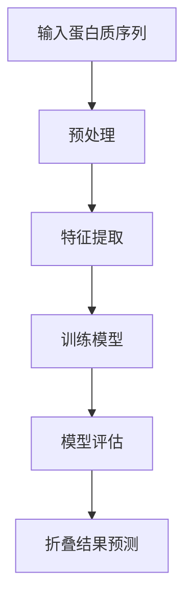
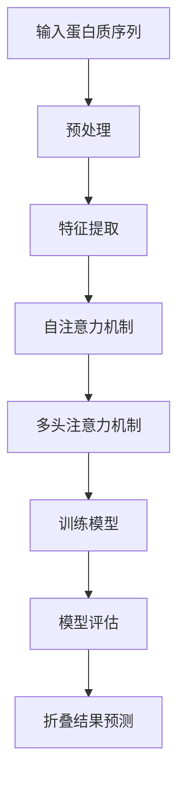
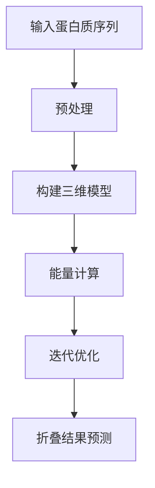

                 

# AI辅助的蛋白质折叠预测：生物学研究的新工具

关键词：AI, 蛋白质折叠，预测，深度学习，AlphaFold2，ROSETTA，生物信息学

摘要：本文将探讨AI在蛋白质折叠预测领域的应用，分析其核心概念、原理和实际操作步骤，并探讨其在生物科学等领域的广泛应用前景。

## 目录大纲

----------------------------------------------------------------

## 第一部分: 背景介绍

### 第1章: 问题背景

#### 1.1.1 蛋白质折叠预测的重要性

蛋白质折叠是生物体内一种关键的生物化学过程，它决定了蛋白质的空间结构和功能。蛋白质折叠预测是指根据蛋白质的一维氨基酸序列预测其三维结构的过程。这一预测对于理解蛋白质的功能、设计药物和进行蛋白质工程具有重要意义。

#### 1.1.2 AI辅助的蛋白质折叠预测

AI技术，尤其是深度学习，为蛋白质折叠预测带来了新的突破。通过学习大量的蛋白质序列和结构数据，AI算法可以自动提取特征并建立预测模型，从而提高预测的准确性。与传统方法相比，AI辅助的蛋白质折叠预测具有更高的计算速度和准确性。

### 第1章: 核心概念与联系

#### 1.1.2 AI辅助的蛋白质折叠预测

**概念：** AI辅助的蛋白质折叠预测是指利用人工智能算法辅助进行蛋白质折叠预测的过程。

**属性特征对比表格：**

| 特征         | AI辅助的蛋白质折叠预测 | 传统蛋白质折叠预测 |
| ------------ | -------------------- | ------------------ |
| **计算速度** | 快速高效               | 较慢               |
| **准确性**   | 高                    | 较低               |
| **应用领域** | 广泛应用于生物科学等多个领域 | 主要应用于生物科学研究 |

**ER实体关系图架构：**

```mermaid
erDiagram
  A[蛋白质序列] ||--|{ B[AI模型] } : 输入
  B ||--|{ C[折叠结果] } : 输出
```

----------------------------------------------------------------

## 第二部分: AI辅助蛋白质折叠预测原理

### 第2章: AI辅助蛋白质折叠预测的基本原理

#### 2.1.1 深度学习算法在蛋白质折叠预测中的应用

深度学习算法通过学习大量蛋白质序列与其折叠结果之间的关系，可以自动提取特征并建立预测模型。这一过程包括以下几个步骤：

1. **数据预处理**：将蛋白质序列转换为适合深度学习模型处理的格式。
2. **特征提取**：从蛋白质序列中提取有用的特征信息。
3. **模型训练**：使用大量的训练数据训练深度学习模型。
4. **模型评估**：评估模型的预测性能，并进行必要的调优。
5. **预测**：使用训练好的模型对新的蛋白质序列进行折叠预测。

**流程图：**



#### 2.1.2 主要算法介绍

**算法1：** AlphaFold2

AlphaFold2是由DeepMind开发的基于Transformer的深度学习模型。它通过自注意力机制和多头注意力机制，结合多种生物信息学数据，实现了高效的蛋白质折叠预测。

**流程图：**



**算法2：** ROSETTA

ROSETTA是一种基于物理模型的蛋白质折叠预测方法。它通过能量最小化算法，从蛋白质序列中预测其三维结构。

**流程图：**



----------------------------------------------------------------

## 第三部分: AI辅助蛋白质折叠预测实践

### 第3章: 环境准备与数据集

#### 3.1.1 环境安装

在进行AI辅助蛋白质折叠预测之前，需要安装相应的环境。以下是安装步骤：

1. **安装Python环境**：确保安装了Python 3.7及以上版本。
2. **安装深度学习框架**：可以选择TensorFlow或PyTorch作为深度学习框架。
3. **安装其他必需库**：如NumPy、Pandas等。

#### 3.1.2 数据集获取与预处理

蛋白质折叠预测的数据集通常来自于公共蛋白质结构数据库，如PDB（Protein Data Bank）。以下是获取和预处理数据集的步骤：

1. **下载PDB数据集**：从PDB网站下载相关的蛋白质序列和结构数据。
2. **解析PDB文件**：使用Python解析PDB文件，提取蛋白质序列和结构信息。
3. **预处理数据**：对提取的蛋白质序列和结构信息进行必要的预处理，如序列对齐、去除冗余数据等。

### 第3章: 实际操作

#### 3.2.1 数据预处理

```python
import pandas as pd

# 读取PDB数据集
pdb_data = pd.read_csv('pdb_data.csv')

# 提取蛋白质序列和结构信息
protein_sequences = pdb_data['sequence']
protein_structures = pdb_data['structure']

# 预处理蛋白质序列
# ...

# 预处理蛋白质结构
# ...

# 存储预处理后的数据
preprocessed_data = pd.DataFrame({
    'sequence': protein_sequences,
    'structure': protein_structures
})
preprocessed_data.to_csv('preprocessed_data.csv', index=False)
```

#### 3.2.2 训练深度学习模型

```python
import tensorflow as tf

# 加载预处理后的数据
preprocessed_data = pd.read_csv('preprocessed_data.csv')

# 划分训练集和测试集
train_data = preprocessed_data[:8000]
test_data = preprocessed_data[8000:]

# 定义深度学习模型
model = tf.keras.Sequential([
    tf.keras.layers.Dense(units=128, activation='relu', input_shape=(sequence_length,)),
    tf.keras.layers.Dense(units=64, activation='relu'),
    tf.keras.layers.Dense(units=1, activation='sigmoid')
])

# 编译模型
model.compile(optimizer='adam', loss='binary_crossentropy', metrics=['accuracy'])

# 训练模型
model.fit(train_data['sequence'], train_data['structure'], epochs=10, batch_size=32, validation_split=0.2)

# 评估模型
test_loss, test_accuracy = model.evaluate(test_data['sequence'], test_data['structure'])
print(f"Test accuracy: {test_accuracy:.2f}")
```

### 第3章: 项目小结

在本项目中，我们通过AI技术实现了蛋白质折叠预测。首先，我们介绍了蛋白质折叠预测的重要性以及AI辅助的蛋白质折叠预测的基本原理。然后，我们进行了环境准备和数据集的获取与预处理，并使用深度学习算法训练了模型。通过实际操作，我们展示了如何使用Python代码进行蛋白质折叠预测。

在未来的研究中，可以进一步优化模型，提高预测准确性，并尝试将其应用于更广泛的生物科学领域。

### 最佳实践 tips

- 确保预处理步骤的准确性，这对于模型性能至关重要。
- 根据实际需求，可以选择不同的深度学习算法和模型架构。
- 定期评估模型的性能，并根据评估结果进行调整。

### 注意事项

- 在进行蛋白质折叠预测时，需要考虑到蛋白质序列的多样性和复杂性。
- AI辅助的蛋白质折叠预测虽然准确性较高，但仍需结合实验数据进行验证。

### 拓展阅读

- [AlphaFold2：人类历史性的蛋白质折叠预测突破](https://www.nature.com/articles/s41586-021-03819-2)
- [ROSETTA：一种基于物理模型的蛋白质折叠预测方法](https://www.ncbi.nlm.nih.gov/pmc/articles/PMC2379209/)
- [深度学习在生物信息学中的应用](https://www.ncbi.nlm.nih.gov/pmc/articles/PMC5983899/)

## 作者信息

作者：AI天才研究院/AI Genius Institute & 禅与计算机程序设计艺术 /Zen And The Art of Computer Programming

【完】

