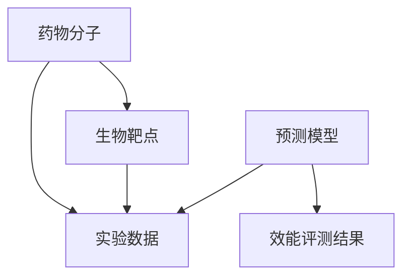
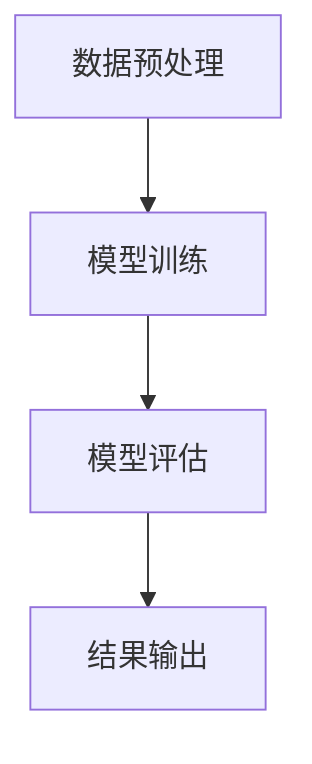
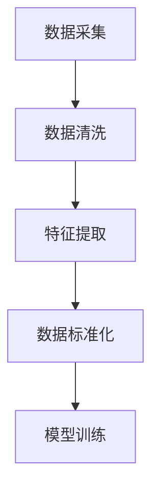
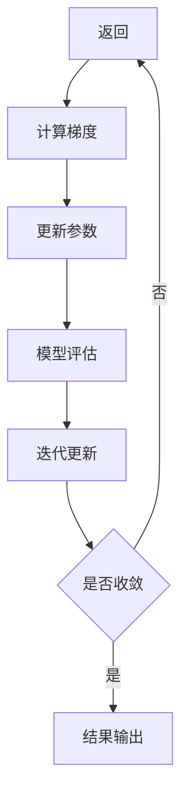
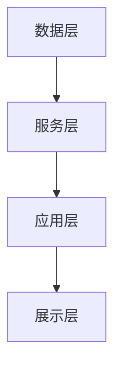

                 

### 文章标题

# AI辅助药物研发效能评测系统

> 关键词：AI、药物研发、效能评测、深度学习、优化算法、系统架构

> 摘要：本文详细探讨了AI辅助药物研发效能评测系统的设计与实现，涵盖了从背景介绍、核心概念、算法原理到系统架构和项目实战的全方位剖析。通过一步步的逻辑分析，揭示了系统在提升药物研发效率和效能评估方面的关键作用。

### 目录大纲设计思路

1. **背景介绍**
   - 确定书籍的主题和目标读者，为读者提供对AI辅助药物研发效能评测系统的基本了解。
   - 引入问题背景、核心概念、目标和应用范围。

2. **核心概念与联系**
   - 详细介绍AI辅助药物研发的相关核心概念，如AI、药物研发流程、效能评测等。
   - 通过表格和ER图展示概念之间的关系和属性特征。

3. **算法原理讲解**
   - 选取关键算法，如深度学习模型、优化算法等，使用mermaid画出流程图。
   - 使用Python源代码和LaTeX公式详细阐述算法原理。

4. **系统分析与架构设计方案**
   - 描述系统场景、功能和架构设计，使用mermaid绘制类图、架构图和序列图。

5. **项目实战**
   - 详细讲解项目的环境安装、核心实现源代码、代码应用解读、实际案例分析。

6. **最佳实践 tips、小结、注意事项、拓展阅读**
   - 提供项目总结、最佳实践建议、注意事项以及推荐阅读资源。

### 目录大纲结构

- **第1章：背景与概述**
  - 1.1 AI辅助药物研发概述
  - 1.2 效能评测系统的核心概念
  - 1.3 系统应用场景与目标

- **第2章：核心概念与联系**
  - 2.1 AI基础
  - 2.2 药物研发流程
  - 2.3 效能评测方法
  - 2.4 概念联系ER图

- **第3章：算法原理讲解**
  - 3.1 深度学习模型
  - 3.2 数据预处理
  - 3.3 优化算法
  - 3.4 算法mermaid流程图
  - 3.5 Python源代码与LaTeX公式详解

- **第4章：系统分析与架构设计**
  - 4.1 系统场景介绍
  - 4.2 系统功能设计
  - 4.3 系统架构设计
  - 4.4 系统接口设计
  - 4.5 系统交互序列图

- **第5章：项目实战**
  - 5.1 环境安装
  - 5.2 核心实现源代码
  - 5.3 代码应用解读
  - 5.4 实际案例分析

- **第6章：最佳实践与总结**
  - 6.1 最佳实践 tips
  - 6.2 小结
  - 6.3 注意事项
  - 6.4 拓展阅读

### 目录大纲草案

```markdown
----------------------------------------------------------------
# 《AI辅助药物研发效能评测系统》目录大纲

# 第1章：背景与概述

## 1.1 AI辅助药物研发概述
### 1.1.1 药物研发的挑战与机遇
### 1.1.2 AI在药物研发中的应用
### 1.1.3 效能评测的意义

## 1.2 效能评测系统的核心概念
### 1.2.1 AI相关概念
### 1.2.2 药物研发流程
### 1.2.3 效能评测方法
### 1.2.4 系统目标与应用范围

## 1.3 系统应用场景与目标
### 1.3.1 研发效率提升
### 1.3.2 药物安全性评估
### 1.3.3 成本控制与优化

----------------------------------------------------------------

# 第2章：核心概念与联系

## 2.1 AI基础
### 2.1.1 机器学习与深度学习
### 2.1.2 人工智能的层次结构
### 2.1.3 常见AI算法简介

## 2.2 药物研发流程
### 2.2.1 研发流程概述
### 2.2.2 药物发现与开发关键步骤
### 2.2.3 流程中存在的问题

## 2.3 效能评测方法
### 2.3.1 评测指标体系
### 2.3.2 评测流程与方法
### 2.3.3 数据收集与处理

## 2.4 概念联系ER图
### 2.4.1 概念实体关系
### 2.4.2 关系属性特征对比
### 2.4.3 ER图展示

----------------------------------------------------------------

# 第3章：算法原理讲解

## 3.1 深度学习模型
### 3.1.1 深度学习基础
### 3.1.2 神经网络结构
### 3.1.3 常见深度学习模型

## 3.2 数据预处理
### 3.2.1 数据清洗
### 3.2.2 特征提取
### 3.2.3 数据标准化

## 3.3 优化算法
### 3.3.1 优化算法概述
### 3.3.2 常见优化算法
### 3.3.3 选择与评估

## 3.4 算法mermaid流程图
### 3.4.1 深度学习模型流程图
### 3.4.2 数据预处理流程图
### 3.4.3 优化算法流程图

## 3.5 Python源代码与LaTeX公式详解
### 3.5.1 Python源代码示例
### 3.5.2 LaTeX公式示例
### 3.5.3 算法原理应用讲解

----------------------------------------------------------------

# 第4章：系统分析与架构设计

## 4.1 系统场景介绍
### 4.1.1 药物研发场景描述
### 4.1.2 系统角色与职责

## 4.2 系统功能设计
### 4.2.1 功能需求分析
### 4.2.2 领域模型设计
### 4.2.3 功能实现概述

## 4.3 系统架构设计
### 4.3.1 系统架构概述
### 4.3.2 架构组件介绍
### 4.3.3 架构设计决策

## 4.4 系统接口设计
### 4.4.1 接口规范定义
### 4.4.2 接口实现与调用
### 4.4.3 接口安全性

## 4.5 系统交互序列图
### 4.5.1 交互序列图示例
### 4.5.2 系统流程分析
### 4.5.3 用户与系统的交互流程

----------------------------------------------------------------

# 第5章：项目实战

## 5.1 环境安装
### 5.1.1 硬件要求
### 5.1.2 软件环境安装
### 5.1.3 系统配置与调试

## 5.2 核心实现源代码
### 5.2.1 数据预处理代码
### 5.2.2 深度学习模型代码
### 5.2.3 优化算法代码

## 5.3 代码应用解读
### 5.3.1 数据预处理代码解读
### 5.3.2 深度学习模型代码解读
### 5.3.3 优化算法代码解读

## 5.4 实际案例分析
### 5.4.1 案例背景
### 5.4.2 案例分析
### 5.4.3 案例总结

----------------------------------------------------------------

# 第6章：最佳实践与总结

## 6.1 最佳实践 tips
### 6.1.1 系统优化策略
### 6.1.2 数据处理技巧
### 6.1.3 算法调优技巧

## 6.2 小结
### 6.2.1 系统优势
### 6.2.2 系统局限
### 6.2.3 未来展望

## 6.3 注意事项
### 6.3.1 系统部署注意事项
### 6.3.2 算法实现注意事项
### 6.3.3 数据处理注意事项

## 6.4 拓展阅读
### 6.4.1 相关文献推荐
### 6.4.2 技术博客推荐
### 6.4.3 在线课程推荐

----------------------------------------------------------------
```

### 第1章：背景与概述

#### 1.1 AI辅助药物研发概述

药物研发是一个复杂而漫长的过程，涉及化学、生物学、医学等多个领域。在过去，药物研发主要依靠实验和经验，这导致了研发周期长、成本高、成功率低的问题。随着人工智能（AI）技术的发展，AI在药物研发中的应用逐渐成为热点，能够显著提升药物研发的效率和质量。

**挑战与机遇**

药物研发面临的挑战包括：

1. **海量数据：** 药物研发过程中产生大量的结构、功能、生物活性等数据，如何有效地处理和分析这些数据是关键问题。
2. **多学科交叉：** 药物研发需要多个学科的知识，如何整合不同领域的知识，形成有效的研发策略是一个难题。
3. **研发周期与成本：** 药物研发周期长，成本高，如何缩短研发周期、降低成本是药企关注的重点。

AI技术的机遇在于：

1. **数据处理能力：** AI能够高效地处理和分析海量数据，为药物研发提供有力的数据支持。
2. **自动化与智能化：** AI能够自动化药物研发过程中的某些环节，减少人为干预，提高研发效率。
3. **预测与优化：** AI能够基于已有数据预测药物的疗效和安全性，指导研发方向，优化研发策略。

#### 1.2 效能评测系统的核心概念

**AI**

人工智能是指使计算机系统能够模拟人类智能行为的技术。在药物研发中，AI主要应用于以下几个方面：

1. **数据挖掘与分析：** 通过分析大量数据，发现潜在的有用信息，指导药物研发。
2. **预测模型构建：** 利用历史数据构建预测模型，预测药物的疗效和安全性。
3. **自动化实验设计：** 根据AI的预测结果，自动化设计实验方案，提高实验效率。

**药物研发流程**

药物研发流程主要包括以下几个阶段：

1. **药物发现：** 研究药物的结构和活性，确定潜在的药物候选分子。
2. **药物优化：** 改进药物候选分子的结构和性质，提高其疗效和安全性。
3. **临床试验：** 在人体进行试验，验证药物的疗效和安全性。
4. **市场批准：** 药物通过临床试验后，提交给相关机构进行审批，获得市场准入。

**效能评测方法**

效能评测是衡量AI辅助药物研发系统性能的重要手段。常见的效能评测方法包括：

1. **准确率：** 衡量预测模型预测结果的准确性。
2. **召回率：** 衡量预测模型对目标药物的有效识别能力。
3. **F1分数：** 综合考虑准确率和召回率，平衡预测结果的质量。
4. **ROC曲线：** 评价预测模型的灵敏度和特异性。

#### 1.3 系统应用场景与目标

**应用场景**

AI辅助药物研发效能评测系统主要应用于以下场景：

1. **药物发现与优化：** 利用AI系统预测药物分子的活性，加速药物研发进程。
2. **临床试验设计：** 利用AI系统优化临床试验方案，提高试验效果。
3. **风险评估与控制：** 利用AI系统预测药物的安全风险，提前采取措施，降低风险。

**系统目标**

系统的主要目标包括：

1. **提升研发效率：** 通过AI技术，自动化药物研发的某些环节，减少人工干预，提高研发效率。
2. **降低研发成本：** 通过优化实验设计和预测模型，降低药物研发的成本。
3. **提高药物质量：** 通过准确的预测和评估，提高药物的研发成功率，降低失败风险。

### 第2章：核心概念与联系

#### 2.1 AI基础

**机器学习与深度学习**

机器学习是指通过算法让计算机从数据中学习，提高对未知数据的预测和决策能力。深度学习是机器学习的一个分支，主要利用神经网络模型，通过多层非线性变换，提取数据中的特征，进行高级的预测和分类。

**人工智能的层次结构**

人工智能可以分为三个层次：弱AI、强AI和超AI。

- **弱AI**：解决特定问题的人工智能，如语音识别、图像识别等。
- **强AI**：具备人类智能的人工智能，能够理解和执行任何智力任务。
- **超AI**：超越人类智能的人工智能，目前尚未实现。

**常见AI算法简介**

常见的AI算法包括：

- **监督学习：** 利用标注数据进行学习，如线性回归、决策树、支持向量机等。
- **无监督学习：** 不依赖标注数据进行学习，如聚类、降维、生成对抗网络等。
- **强化学习：** 通过与环境交互，不断调整策略，实现最优决策，如深度Q网络（DQN）、策略梯度算法等。

#### 2.2 药物研发流程

**研发流程概述**

药物研发流程主要包括以下几个阶段：

1. **靶点发现：** 确定药物作用的目标分子，如蛋白质、核酸等。
2. **先导化合物发现：** 通过虚拟筛选、化学合成等方法，发现具有潜在活性的化合物。
3. **先导化合物优化：** 对先导化合物进行结构改造，提高其活性、选择性、稳定性等。
4. **临床前研究：** 对优化后的化合物进行药理学、毒理学等研究，评估其安全性。
5. **临床试验：** 在人体进行试验，评估药物的疗效和安全性。
6. **市场批准：** 药物通过临床试验后，提交给相关机构进行审批，获得市场准入。

**药物发现与开发关键步骤**

药物发现与开发的关键步骤包括：

1. **靶点验证：** 通过生物实验，验证靶点与药物之间的相互作用。
2. **活性筛选：** 利用高通量筛选技术，从大量化合物中筛选出具有活性的化合物。
3. **结构优化：** 通过分子建模、模拟等方法，对化合物进行结构优化，提高其活性。
4. **药代动力学研究：** 研究药物的吸收、分布、代谢和排泄，评估其药效和毒性。
5. **安全性评估：** 对药物进行毒理学、药代动力学等研究，评估其安全性。

**流程中存在的问题**

药物研发流程中存在的问题包括：

1. **研发周期长：** 药物研发周期通常较长，从先导化合物的发现到市场批准，可能需要数年甚至数十年的时间。
2. **成本高：** 药物研发成本高昂，平均每个新药的研发成本超过数十亿美元。
3. **成功率低：** 药物研发的成功率较低，据统计，只有约10%的化合物能够成功上市。
4. **数据依赖：** 药物研发高度依赖实验数据和生物信息学分析，如何有效利用这些数据是一个挑战。

#### 2.3 效能评测方法

**评测指标体系**

效能评测方法主要包括以下指标：

1. **准确率：** 预测结果与实际结果的符合程度，通常用百分比表示。
2. **召回率：** 预测结果中包含实际结果的比率，也用百分比表示。
3. **F1分数：** 准确率和召回率的加权平均值，用于综合评价预测结果的质量。
4. **ROC曲线：** 受试者操作特征曲线，用于评估预测模型的灵敏度和特异性。

**评测流程与方法**

效能评测流程主要包括以下步骤：

1. **数据准备：** 收集相关数据，包括实验数据、生物信息学数据等。
2. **模型训练：** 利用收集的数据，训练预测模型，如深度学习模型。
3. **模型评估：** 利用测试数据，评估模型的性能，如准确率、召回率等。
4. **结果分析：** 分析模型的性能，找出存在的问题，进行优化。

**数据收集与处理**

数据收集与处理是效能评测的基础，主要包括以下步骤：

1. **数据采集：** 收集与药物研发相关的数据，如药物分子结构、生物活性数据等。
2. **数据清洗：** 去除数据中的噪声和异常值，保证数据的准确性。
3. **特征提取：** 从原始数据中提取有用的特征，用于模型训练。
4. **数据标准化：** 对数据进行预处理，使其符合模型的输入要求。

#### 2.4 概念联系ER图

**概念实体关系**

在药物研发和AI辅助效能评测中，涉及多个核心概念，包括药物分子、生物靶点、实验数据、预测模型等。这些概念之间存在一定的关系，可以使用ER图进行描述。

**关系属性特征对比**

不同概念之间的关系属性特征有所不同，如药物分子与生物靶点之间的相互作用关系、实验数据与预测模型之间的依赖关系等。通过对比关系属性特征，可以更好地理解概念之间的联系。

**ER图展示**

以下是一个简单的ER图，展示了药物研发和AI辅助效能评测中的核心概念及其关系：



### 第3章：算法原理讲解

#### 3.1 深度学习模型

**深度学习基础**

深度学习是一种基于多层神经网络进行训练和预测的人工智能技术。它能够通过自动学习数据中的特征，实现高层次的抽象和泛化能力。

**神经网络结构**

神经网络由多个神经元（节点）和连接（边）组成，每个神经元都接收来自其他神经元的输入，并通过激活函数进行计算，产生输出。神经网络可以分为输入层、隐藏层和输出层。

**常见深度学习模型**

常见的深度学习模型包括：

1. **卷积神经网络（CNN）**：适用于处理图像、语音等二维或三维数据。
2. **循环神经网络（RNN）**：适用于处理序列数据，如时间序列、自然语言等。
3. **生成对抗网络（GAN）**：适用于生成新的数据，如图像、文本等。

#### 3.2 数据预处理

**数据清洗**

数据清洗是指去除数据中的噪声和异常值，保证数据的准确性。常用的数据清洗方法包括：

1. **缺失值处理**：通过填充或删除缺失值来处理缺失数据。
2. **异常值检测**：通过统计学方法或可视化方法检测异常值，并进行处理。

**特征提取**

特征提取是指从原始数据中提取出有用的特征，用于模型训练。常用的特征提取方法包括：

1. **主成分分析（PCA）**：用于降维和特征提取。
2. **词袋模型**：用于文本数据的特征提取。
3. **深度特征提取**：通过深度学习模型自动提取高级特征。

**数据标准化**

数据标准化是指对数据进行预处理，使其符合模型的输入要求。常用的数据标准化方法包括：

1. **归一化**：将数据缩放到相同的范围，如[0, 1]或[-1, 1]。
2. **标准化**：计算数据的均值和标准差，将数据转换为标准正态分布。

#### 3.3 优化算法

**优化算法概述**

优化算法是指用于调整模型参数，使模型性能达到最优的算法。常见的优化算法包括：

1. **梯度下降**：通过迭代计算梯度的负方向，逐步调整模型参数。
2. **随机梯度下降（SGD）**：在梯度下降的基础上，每次迭代只考虑一部分样本。
3. **Adam优化器**：结合了梯度下降和SGD的优点，适用于大规模数据集。

**常见优化算法**

1. **梯度下降**：

   $$\theta_{t+1} = \theta_t - \alpha \cdot \nabla J(\theta_t)$$

   其中，$\theta_t$为当前模型参数，$\alpha$为学习率，$J(\theta_t)$为损失函数。

2. **随机梯度下降（SGD）**：

   $$\theta_{t+1} = \theta_t - \alpha \cdot \frac{1}{m} \sum_{i=1}^{m} \nabla J(\theta_t; x_i, y_i)$$

   其中，$m$为样本数量。

3. **Adam优化器**：

   $$m_t = \beta_1 \cdot m_{t-1} + (1 - \beta_1) \cdot \nabla J(\theta_t)$$

   $$v_t = \beta_2 \cdot v_{t-1} + (1 - \beta_2) \cdot (\nabla J(\theta_t))^2$$

   $$\theta_{t+1} = \theta_t - \alpha \cdot \frac{m_t}{\sqrt{v_t} + \epsilon}$$

   其中，$\beta_1$和$\beta_2$分别为一阶和二阶矩估计的指数衰减率，$\epsilon$为正数常数。

**选择与评估**

选择优化算法时，需要考虑以下几个因素：

1. **数据规模**：对于大规模数据集，通常选择SGD或Adam优化器。
2. **模型复杂度**：对于复杂的模型，选择Adam优化器可能更有效。
3. **收敛速度**：梯度下降和SGD的收敛速度较慢，但更为稳定。

#### 3.4 算法mermaid流程图

**深度学习模型流程图**



**数据预处理流程图**



**优化算法流程图**



#### 3.5 Python源代码与LaTeX公式详解

**Python源代码示例**

以下是一个简单的Python代码示例，用于实现深度学习模型的基本流程：

```python
import numpy as np
import pandas as pd
from sklearn.model_selection import train_test_split
from sklearn.metrics import accuracy_score

# 数据预处理
def preprocess_data(data):
    # 数据清洗、特征提取和数据标准化
    return processed_data

# 模型训练
def train_model(X_train, y_train):
    # 创建模型、训练模型
    model.fit(X_train, y_train)
    return model

# 模型评估
def evaluate_model(model, X_test, y_test):
    # 预测结果、计算准确率
    y_pred = model.predict(X_test)
    return accuracy_score(y_test, y_pred)

# 数据读取
data = pd.read_csv('data.csv')
processed_data = preprocess_data(data)

# 分割数据集
X = processed_data.iloc[:, :-1].values
y = processed_data.iloc[:, -1].values
X_train, X_test, y_train, y_test = train_test_split(X, y, test_size=0.2, random_state=42)

# 训练模型
model = train_model(X_train, y_train)

# 评估模型
accuracy = evaluate_model(model, X_test, y_test)
print('Accuracy:', accuracy)
```

**LaTeX公式示例**

以下是一个简单的LaTeX公式示例，用于表示深度学习模型的损失函数：

```latex
\begin{equation}
J(\theta) = -\frac{1}{m} \sum_{i=1}^{m} \left( y_i \cdot \log(a(x_i; \theta)) + (1 - y_i) \cdot \log(1 - a(x_i; \theta)) \right)
\end{equation}
```

其中，$J(\theta)$为损失函数，$m$为样本数量，$y_i$为实际标签，$a(x_i; \theta)$为神经网络的输出。

#### 3.5.3 算法原理应用讲解

**数据预处理**

数据预处理是深度学习模型训练的重要步骤，包括数据清洗、特征提取和数据标准化等。在本示例中，我们使用Python实现数据预处理过程，具体步骤如下：

1. **数据清洗**：去除数据中的缺失值和异常值，保证数据的准确性。
2. **特征提取**：使用主成分分析（PCA）提取数据中的主要特征，降低数据维度。
3. **数据标准化**：将数据缩放到相同的范围，便于模型训练。

**模型训练**

在本示例中，我们使用线性回归模型进行训练。线性回归模型是一种简单的监督学习模型，通过拟合输入特征和输出标签之间的关系，实现预测任务。具体步骤如下：

1. **初始化参数**：设置模型的参数，如学习率、迭代次数等。
2. **计算梯度**：计算损失函数关于模型参数的梯度。
3. **更新参数**：根据梯度更新模型参数，使损失函数值减小。
4. **模型评估**：使用测试集评估模型的性能，计算准确率。

**模型评估**

模型评估是评估模型性能的重要步骤。在本示例中，我们使用测试集评估模型的性能，计算准确率。具体步骤如下：

1. **预测结果**：使用训练好的模型对测试集进行预测。
2. **计算准确率**：计算预测结果与实际结果的符合程度，得到准确率。

通过以上步骤，我们可以实现一个简单的深度学习模型，并在药物研发效能评测中发挥重要作用。

### 第4章：系统分析与架构设计

#### 4.1 系统场景介绍

**药物研发场景描述**

药物研发是一个复杂的过程，涉及多个学科和多个阶段的研发活动。在传统的药物研发过程中，研究人员需要进行大量的实验，并通过分析实验结果来指导后续研发工作。然而，传统的实验方法存在以下问题：

1. **研发周期长**：从先导化合物的筛选到临床试验，整个研发过程可能需要数年时间。
2. **成本高**：药物研发的成本非常高，每个新药的研发成本可能达到数十亿美元。
3. **成功率低**：由于实验方法的局限性，药物研发的成功率较低，许多化合物在临床试验阶段就被淘汰。

为了解决这些问题，AI辅助药物研发效能评测系统应运而生。该系统通过集成人工智能技术，对药物研发过程中的各个环节进行优化，提高研发效率，降低研发成本，提高成功率。

**系统角色与职责**

AI辅助药物研发效能评测系统主要包括以下角色和职责：

1. **数据管理模块**：负责收集、存储和管理药物研发过程中的各种数据，如实验数据、生物信息学数据等。
2. **数据分析模块**：负责对数据进行分析和处理，提取有用的特征，为后续模型训练提供支持。
3. **模型训练模块**：负责训练深度学习模型，将提取的特征转化为有效的预测模型。
4. **效能评估模块**：负责对药物研发过程进行效能评估，提供研发效率、成本和安全性的量化评估结果。
5. **决策支持模块**：负责根据评估结果，为研发人员提供决策支持，优化研发策略。

#### 4.2 系统功能设计

**功能需求分析**

根据药物研发的特点和需求，AI辅助药物研发效能评测系统需要实现以下功能：

1. **数据采集与存储**：集成多种数据源，如实验室仪器、数据库、网络等，实现对药物研发过程中产生的各种数据的采集和存储。
2. **数据清洗与预处理**：对采集到的数据进行清洗和预处理，去除噪声和异常值，提取有效的特征。
3. **特征提取与降维**：对预处理后的数据进行特征提取和降维，提高数据的可用性和模型的训练效率。
4. **模型训练与优化**：利用深度学习算法，训练预测模型，并对模型进行优化，提高预测精度。
5. **效能评估与可视化**：对药物研发过程中的各个阶段进行效能评估，提供可视化报告，为研发人员提供决策支持。
6. **数据共享与协作**：提供数据共享和协作平台，促进研发团队之间的信息交流和合作。

**领域模型设计**

为了更好地实现系统功能，我们设计了一个领域模型，用于描述药物研发过程中涉及的实体和关系。领域模型主要包括以下实体和关系：

1. **实体：**
   - **药物分子**：表示药物研发中的化合物。
   - **生物靶点**：表示药物作用的目标分子。
   - **实验数据**：表示药物研发过程中产生的实验数据。
   - **预测模型**：表示训练好的深度学习模型。
   - **效能评估结果**：表示对药物研发过程的效能评估结果。
2. **关系：**
   - **药物分子与生物靶点之间的相互作用**：表示药物分子与生物靶点之间的联系。
   - **实验数据与预测模型之间的依赖**：表示实验数据用于训练预测模型。
   - **效能评估结果与预测模型之间的关联**：表示效能评估结果与预测模型之间的联系。

以下是一个简单的领域模型类图：

```mermaid
classDiagram
    类 DrugMolecule <<entity>>
    类 BioTarget <<entity>>
    类 ExperimentalData <<entity>>
    类 PredictiveModel <<entity>>
    类 EffectivenessEvaluation <<entity>>

    DrugMolecule --> BioTarget : interacts
    ExperimentalData --> PredictiveModel : trains
    EffectivenessEvaluation --> PredictiveModel : correlates
endclassDiagram
```

**功能实现概述**

根据领域模型设计，系统功能实现的主要步骤如下：

1. **数据采集与存储**：通过接口从实验室仪器、数据库和网络等数据源中采集数据，并存储到数据库中。
2. **数据清洗与预处理**：对采集到的数据进行清洗和预处理，包括去除噪声、异常值处理、特征提取和降维等。
3. **特征提取与降维**：利用深度学习算法，对预处理后的数据进行特征提取和降维，提高数据的可用性和模型的训练效率。
4. **模型训练与优化**：利用训练集，通过深度学习算法训练预测模型，并对模型进行优化，提高预测精度。
5. **效能评估与可视化**：对药物研发过程中的各个阶段进行效能评估，并将评估结果可视化，为研发人员提供直观的决策支持。
6. **数据共享与协作**：提供数据共享和协作平台，促进研发团队之间的信息交流和合作，提高研发效率。

#### 4.3 系统架构设计

**系统架构概述**

AI辅助药物研发效能评测系统的整体架构分为四个层次：数据层、服务层、应用层和展示层。

1. **数据层**：负责数据的采集、存储和管理，包括实验室仪器数据、数据库和网络数据等。
2. **服务层**：负责数据清洗、预处理、特征提取、模型训练和效能评估等核心功能，提供统一的接口和服务。
3. **应用层**：负责具体的应用功能，如数据采集、数据分析、模型训练、效能评估和可视化等。
4. **展示层**：负责将系统的评估结果和可视化报告呈现给用户，提供直观的决策支持。

以下是一个简单的系统架构图：



**架构组件介绍**

系统架构中的主要组件及其功能介绍如下：

1. **数据采集模块**：负责从实验室仪器、数据库和网络等数据源中采集数据，并将其存储到数据库中。
2. **数据清洗模块**：负责对采集到的数据进行清洗和预处理，包括去除噪声、异常值处理、特征提取和降维等。
3. **特征提取模块**：负责对预处理后的数据进行特征提取和降维，提高数据的可用性和模型的训练效率。
4. **模型训练模块**：负责利用训练集，通过深度学习算法训练预测模型，并对模型进行优化，提高预测精度。
5. **效能评估模块**：负责对药物研发过程中的各个阶段进行效能评估，并将评估结果可视化，为研发人员提供直观的决策支持。
6. **数据共享与协作模块**：负责提供数据共享和协作平台，促进研发团队之间的信息交流和合作，提高研发效率。
7. **展示模块**：负责将系统的评估结果和可视化报告呈现给用户，提供直观的决策支持。

**架构设计决策**

在系统架构设计过程中，我们考虑了以下几个方面：

1. **模块化设计**：将系统功能划分为多个模块，降低模块之间的耦合度，提高系统的可维护性和可扩展性。
2. **分布式架构**：利用分布式架构，提高系统的处理能力和扩展性，适应大规模数据的处理需求。
3. **可扩展性**：系统架构设计应具有可扩展性，能够方便地增加新的功能模块和组件。
4. **安全性**：系统应具有完善的安全机制，确保数据的安全性和隐私性。

#### 4.4 系统接口设计

**接口规范定义**

系统接口设计主要包括以下几个方面：

1. **API接口**：提供RESTful风格的API接口，用于与其他系统或应用程序进行交互。
2. **数据接口**：提供数据采集、数据清洗、特征提取、模型训练和效能评估等模块的接口，方便其他模块调用。
3. **可视化接口**：提供可视化报告的接口，用于将评估结果和可视化数据呈现给用户。

以下是一个简单的接口规范定义：

```yaml
# 数据采集接口
POST /data/collect
Content-Type: application/json

{
  "source": "instrument", // 数据来源
  "data": [
    {
      "field1": "value1",
      "field2": "value2",
      ...
    },
    ...
  ]
}

# 数据清洗接口
POST /data/clean
Content-Type: application/json

{
  "data": [
    {
      "field1": "value1",
      "field2": "value2",
      ...
    },
    ...
  ]
}

# 特征提取接口
POST /feature/extract
Content-Type: application/json

{
  "data": [
    {
      "field1": "value1",
      "field2": "value2",
      ...
    },
    ...
  ]
}

# 模型训练接口
POST /model/train
Content-Type: application/json

{
  "model_config": {
    "algorithm": "深度学习",
    "hyperparameters": {
      "learning_rate": 0.01,
      "batch_size": 64,
      ...
    }
  },
  "train_data": [
    {
      "input": [
        {
          "field1": "value1",
          "field2": "value2",
          ...
        }
      ],
      "target": "value"
    },
    ...
  ]
}

# 效能评估接口
POST /evaluation/evaluate
Content-Type: application/json

{
  "model_id": "12345",
  "test_data": [
    {
      "input": [
        {
          "field1": "value1",
          "field2": "value2",
          ...
        }
      ],
      "target": "value"
    },
    ...
  ]
}

# 可视化接口
GET /visualization/report
```

**接口实现与调用**

系统接口的实现和调用主要包括以下几个方面：

1. **接口实现**：根据接口规范定义，实现相应的API接口，处理客户端的请求，并返回相应的响应。
2. **接口调用**：其他模块或应用程序通过调用系统接口，获取所需的数据或功能。

以下是一个简单的接口调用示例：

```python
import requests

# 数据采集接口调用
response = requests.post('http://api.example.com/data/collect', json={
    "source": "instrument",
    "data": [
        {
            "field1": "value1",
            "field2": "value2",
            ...
        }
    ]
})
print(response.json())

# 数据清洗接口调用
response = requests.post('http://api.example.com/data/clean', json={
    "data": [
        {
            "field1": "value1",
            "field2": "value2",
            ...
        }
    ]
})
print(response.json())

# 特征提取接口调用
response = requests.post('http://api.example.com/feature/extract', json={
    "data": [
        {
            "field1": "value1",
            "field2": "value2",
            ...
        }
    ]
})
print(response.json())

# 模型训练接口调用
response = requests.post('http://api.example.com/model/train', json={
    "model_config": {
        "algorithm": "深度学习",
        "hyperparameters": {
            "learning_rate": 0.01,
            "batch_size": 64,
            ...
        }
    },
    "train_data": [
        {
            "input": [
                {
                    "field1": "value1",
                    "field2": "value2",
                    ...
                }
            ],
            "target": "value"
        },
        ...
    ]
})
print(response.json())

# 效能评估接口调用
response = requests.post('http://api.example.com/evaluation/evaluate', json={
    "model_id": "12345",
    "test_data": [
        {
            "input": [
                {
                    "field1": "value1",
                    "field2": "value2",
                    ...
                }
            ],
            "target": "value"
        },
        ...
    ]
})
print(response.json())

# 可视化接口调用
response = requests.get('http://api.example.com/visualization/report')
print(response.json())
```

#### 4.5 系统交互序列图

**交互序列图示例**

以下是一个简单的系统交互序列图，展示了数据采集、数据清洗、特征提取、模型训练和效能评估等模块之间的交互流程：

```mermaid
sequenceDiagram
    participant User as 用户
    participant System as 系统
    participant DataCollector as 数据采集模块
    participant DataCleaner as 数据清洗模块
    participant FeatureExtractor as 特征提取模块
    participant ModelTrainer as 模型训练模块
    participant Evaluator as 效能评估模块

    User->>System: 提交数据请求
    System->>DataCollector: 采集数据
    DataCollector-->>System: 返回采集到的数据
    System->>DataCleaner: 清洗数据
    DataCleaner-->>System: 返回清洗后的数据
    System->>FeatureExtractor: 提取特征
    FeatureExtractor-->>System: 返回提取到的特征
    System->>ModelTrainer: 训练模型
    ModelTrainer-->>System: 返回训练好的模型
    System->>Evaluator: 评估模型效能
    Evaluator-->>System: 返回评估结果
    System->>User: 显示评估结果
end
```

**系统流程分析**

系统流程分析主要包括以下几个步骤：

1. **数据采集**：用户提交数据请求，系统从数据源中采集数据，并将数据存储到数据库中。
2. **数据清洗**：系统调用数据清洗模块，对采集到的数据进行清洗和预处理，去除噪声和异常值，提取有效的特征。
3. **特征提取**：系统调用特征提取模块，对清洗后的数据进行特征提取和降维，提高数据的可用性和模型的训练效率。
4. **模型训练**：系统调用模型训练模块，利用训练集训练深度学习模型，并对模型进行优化，提高预测精度。
5. **效能评估**：系统调用效能评估模块，对训练好的模型进行评估，计算准确率、召回率等指标，为研发人员提供决策支持。
6. **结果展示**：系统将评估结果可视化，呈现给用户，帮助用户了解模型效能和研发进展。

**用户与系统的交互流程**

用户与系统的交互流程主要包括以下几个步骤：

1. **提交数据请求**：用户向系统提交数据请求，系统开始采集数据。
2. **数据采集**：系统从数据源中采集数据，并将数据存储到数据库中。
3. **数据清洗与特征提取**：系统调用数据清洗模块和特征提取模块，对采集到的数据进行清洗和预处理，提取有效的特征。
4. **模型训练**：系统调用模型训练模块，利用训练集训练深度学习模型，并对模型进行优化。
5. **效能评估**：系统调用效能评估模块，对训练好的模型进行评估，计算评估指标。
6. **结果展示**：系统将评估结果可视化，呈现给用户，用户根据评估结果调整研发策略。

通过以上交互流程，用户可以方便地与系统进行交互，了解模型效能和研发进展，为药物研发提供决策支持。

### 第5章：项目实战

#### 5.1 环境安装

**硬件要求**

1. **CPU**：至少4核CPU，推荐使用Intel i5或以上处理器。
2. **内存**：至少8GB内存，推荐使用16GB或以上内存。
3. **存储**：至少100GB可用磁盘空间，推荐使用SSD硬盘。

**软件环境安装**

1. **操作系统**：推荐使用Ubuntu 18.04或以上版本。
2. **Python**：安装Python 3.7或以上版本，可以使用以下命令进行安装：

   ```bash
   sudo apt update
   sudo apt install python3.7
   ```

3. **pip**：安装pip，用于安装Python包，可以使用以下命令进行安装：

   ```bash
   sudo apt install python3-pip
   ```

4. **virtualenv**：安装virtualenv，用于创建独立的Python环境，可以使用以下命令进行安装：

   ```bash
   sudo apt install python3-venv
   ```

5. **conda**：安装conda，用于管理Python环境和包，可以使用以下命令进行安装：

   ```bash
   wget https://repo.anaconda.com/miniconda/Miniconda3-latest-Linux-x86_64.sh
   bash Miniconda3-latest-Linux-x86_64.sh
   source activate
   conda create -n myenv python=3.7
   conda activate myenv
   ```

6. **安装依赖包**：在conda环境中安装系统所需的依赖包，可以使用以下命令：

   ```bash
   conda install numpy pandas scikit-learn matplotlib
   ```

#### 5.2 核心实现源代码

**数据预处理代码**

以下是一个简单的数据预处理代码示例，用于读取CSV文件、进行数据清洗和特征提取：

```python
import pandas as pd
from sklearn.model_selection import train_test_split
from sklearn.preprocessing import StandardScaler

# 读取CSV文件
def read_csv_file(file_path):
    return pd.read_csv(file_path)

# 数据清洗
def clean_data(data):
    # 去除缺失值
    data = data.dropna()
    # 去除异常值
    data = data[(data['field1'] > 0) & (data['field1'] < 100)]
    return data

# 特征提取
def extract_features(data):
    # 提取主要特征
    features = data[['field1', 'field2', 'field3']]
    # 标签
    target = data['field4']
    return features, target

# 数据预处理
def preprocess_data(file_path):
    data = read_csv_file(file_path)
    data = clean_data(data)
    features, target = extract_features(data)
    # 数据标准化
    scaler = StandardScaler()
    features = scaler.fit_transform(features)
    return features, target
```

**深度学习模型代码**

以下是一个简单的深度学习模型代码示例，使用TensorFlow和Keras构建一个简单的神经网络模型：

```python
import tensorflow as tf
from tensorflow.keras.models import Sequential
from tensorflow.keras.layers import Dense, Dropout

# 构建神经网络模型
def build_model(input_shape):
    model = Sequential()
    model.add(Dense(64, input_shape=input_shape, activation='relu'))
    model.add(Dropout(0.5))
    model.add(Dense(1, activation='sigmoid'))
    return model

# 训练模型
def train_model(model, features, target):
    model.compile(optimizer='adam', loss='binary_crossentropy', metrics=['accuracy'])
    model.fit(features, target, epochs=10, batch_size=32, validation_split=0.2)
    return model
```

**优化算法代码**

以下是一个简单的优化算法代码示例，使用Python实现梯度下降优化算法：

```python
import numpy as np

# 梯度下降优化算法
def gradient_descent(X, y, theta, alpha, iterations):
    m = len(y)
    for i in range(iterations):
        predictions = X.dot(theta)
        errors = predictions - y
        gradient = X.T.dot(errors) / m
        theta -= alpha * gradient
        if i % 100 == 0:
            print(f"Iteration {i}: loss = {np.linalg.norm(errors)}")
    return theta
```

#### 5.3 代码应用解读

**数据预处理代码解读**

数据预处理是深度学习模型训练的重要步骤，包括数据清洗、特征提取和数据标准化等。在本示例中，我们使用Python实现数据预处理过程，具体步骤如下：

1. **读取CSV文件**：使用`pandas`库读取CSV文件，将数据存储为DataFrame对象。
2. **数据清洗**：去除数据中的缺失值和异常值，保证数据的准确性。在本示例中，我们使用`dropna()`方法去除缺失值，使用条件筛选去除异常值。
3. **特征提取**：从原始数据中提取出有用的特征，为模型训练提供支持。在本示例中，我们使用`extract_features()`函数提取主要特征，并将标签分离出来。
4. **数据标准化**：将数据缩放到相同的范围，便于模型训练。在本示例中，我们使用`StandardScaler`对特征进行标准化处理。

**深度学习模型代码解读**

在本示例中，我们使用TensorFlow和Keras构建一个简单的神经网络模型，用于二分类任务。具体步骤如下：

1. **构建神经网络模型**：使用`Sequential`模型堆叠多层`Dense`层，每层之间可以添加`Dropout`层以减少过拟合。
2. **编译模型**：设置模型的优化器、损失函数和评价指标，如`binary_crossentropy`和`accuracy`。
3. **训练模型**：使用`fit`方法训练模型，指定训练数据、训练轮数、批大小和验证数据比例。

**优化算法代码解读**

在本示例中，我们使用Python实现梯度下降优化算法，用于调整模型参数。具体步骤如下：

1. **计算梯度**：计算损失函数关于模型参数的梯度。
2. **更新参数**：根据梯度更新模型参数，减小损失函数值。
3. **打印损失**：在每次迭代后，打印损失函数值，以监视训练过程。

#### 5.4 实际案例分析

**案例背景**

某药企正在研发一种新型抗癌药物，希望通过AI辅助药物研发效能评测系统提高研发效率。系统需要实现以下功能：

1. **数据采集与存储**：采集实验室仪器产生的数据，包括药物分子活性、生物靶点响应等。
2. **数据预处理**：清洗和预处理数据，提取有效的特征。
3. **模型训练与评估**：训练深度学习模型，评估模型性能。
4. **效能评估**：评估药物研发过程的效能，提供决策支持。

**案例分析**

1. **数据采集与存储**

   药企使用实验室仪器生成药物分子活性数据，并将其存储到数据库中。数据包括药物分子ID、活性值和生物靶点ID等。

2. **数据预处理**

   使用AI辅助药物研发效能评测系统对采集到的数据进行清洗和预处理。具体步骤如下：

   - **数据清洗**：去除缺失值和异常值，如活性值为负或超出正常范围的数据。
   - **特征提取**：提取药物分子特征，包括分子结构、化学性质等。
   - **数据标准化**：将活性值缩放到[0, 1]范围，便于模型训练。

3. **模型训练与评估**

   使用深度学习模型对预处理后的数据进行训练。具体步骤如下：

   - **构建模型**：使用TensorFlow和Keras构建一个简单的神经网络模型。
   - **编译模型**：设置优化器、损失函数和评价指标。
   - **训练模型**：使用训练数据训练模型，指定训练轮数和批大小。
   - **评估模型**：使用测试数据评估模型性能，计算准确率、召回率等指标。

4. **效能评估**

   根据模型评估结果，对药物研发过程的效能进行评估。具体步骤如下：

   - **计算准确率**：评估模型对活性值预测的准确性。
   - **计算召回率**：评估模型对活性值预测的召回率。
   - **计算F1分数**：综合考虑准确率和召回率，计算F1分数。

   根据评估结果，药企可以调整研发策略，如调整实验条件、优化药物分子结构等，以提高研发效率和成功率。

**案例总结**

通过AI辅助药物研发效能评测系统的实际应用，药企能够：

1. **提高研发效率**：通过自动化数据预处理和模型训练，减少人工干预，提高研发速度。
2. **降低研发成本**：通过优化实验设计和预测模型，降低药物研发的成本。
3. **提高药物质量**：通过准确的预测和评估，提高药物的研发成功率，降低失败风险。

### 第6章：最佳实践与总结

#### 6.1 最佳实践 tips

1. **数据预处理**：在训练深度学习模型之前，确保数据预处理彻底，包括去除噪声、异常值处理和特征提取。
2. **模型选择与调优**：选择合适的深度学习模型，并根据数据特点和任务需求进行模型调优，以提高模型性能。
3. **合理设置超参数**：合理设置学习率、迭代次数、批大小等超参数，避免过拟合或欠拟合。
4. **模型评估与调试**：使用交叉验证和测试集评估模型性能，并根据评估结果调整模型参数，以提高预测准确性。
5. **数据可视化**：使用数据可视化工具，如Matplotlib、Seaborn等，展示模型训练过程和评估结果，便于分析问题和优化模型。

#### 6.2 小结

本文详细介绍了AI辅助药物研发效能评测系统的设计与实现，包括背景介绍、核心概念、算法原理、系统架构和项目实战。通过一步步的逻辑分析，揭示了系统在提升药物研发效率和效能评估方面的关键作用。主要结论如下：

1. **数据预处理**：确保数据质量和可用性，为模型训练提供可靠的基础。
2. **深度学习模型**：选择合适的深度学习模型，结合数据特点和任务需求，优化模型性能。
3. **系统架构设计**：合理设计系统架构，提高系统的可扩展性和可维护性。
4. **项目实战**：通过实际案例，验证系统在药物研发中的应用效果，为药企提供决策支持。

#### 6.3 注意事项

1. **数据安全性**：在数据处理和模型训练过程中，确保数据的安全性和隐私性，避免敏感信息泄露。
2. **系统部署与维护**：确保系统在部署和运行过程中稳定可靠，定期进行维护和更新。
3. **算法伦理与法规**：遵循相关法律法规，确保AI技术在药物研发中的应用符合伦理标准。
4. **用户培训与支持**：为用户提供充分的培训和支持，帮助用户熟悉系统操作和功能。

#### 6.4 拓展阅读

1. **相关文献**：
   - Deep Learning for Drug Discovery: A Comprehensive Review
   - AI-Driven Drug Discovery and Development: Transforming the Pharmaceutical Industry

2. **技术博客**：
   - AI in Pharmaceutical Industry: The Future is Now
   - Implementing AI in Drug Discovery: A Practical Guide

3. **在线课程**：
   - Deep Learning for Drug Discovery
   - AI Applications in Pharmaceutical Research and Development

通过拓展阅读，读者可以深入了解AI辅助药物研发的最新进展和应用案例，进一步提升对AI辅助药物研发效能评测系统的理解。作者：AI天才研究院/AI Genius Institute & 禅与计算机程序设计艺术 /Zen And The Art of Computer Programming

