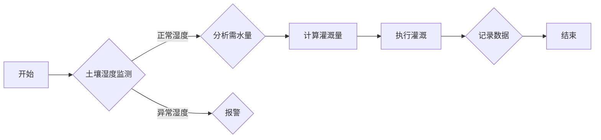
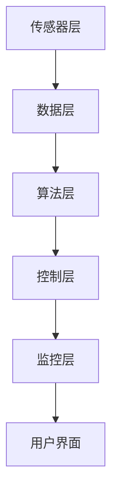
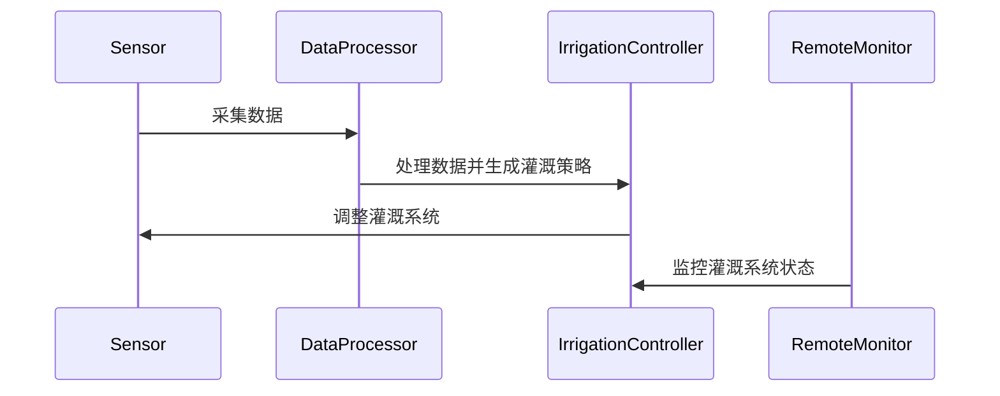
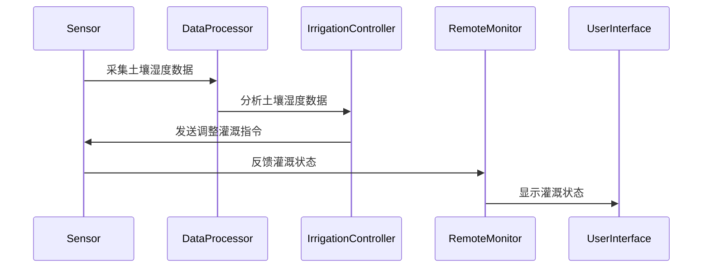

                 

# AI驱动的智能农业灌溉系统效果评测

## 关键词

- AI
- 智能农业
- 水资源管理
- 灌溉系统
- 数据分析
- 机器学习

## 摘要

本文详细探讨了AI驱动的智能农业灌溉系统的设计与效果评测。首先，介绍了智能农业灌溉系统的重要性以及AI在其中扮演的关键角色。随后，文章深入分析了系统核心概念、算法原理、系统架构设计和项目实战，通过具体实例展示了AI如何优化水资源管理，提高农业产量。最后，总结了系统的最佳实践和注意事项，并对未来发展趋势进行了展望。通过本文，读者将了解到AI在智能农业灌溉领域的巨大潜力与应用价值。

## 引言

农业是国民经济的基础产业，而灌溉作为农业生产中至关重要的环节，直接关系到农作物的产量和品质。传统的农业灌溉方式往往依赖于人工经验，难以精确控制水量和灌溉时间，导致水资源浪费和农业效益降低。随着人工智能（AI）技术的发展，AI驱动的智能农业灌溉系统逐渐成为可能，通过智能传感器、数据分析与机器学习算法，实现精准灌溉，提高农业生产的效率与可持续性。

智能农业灌溉系统的核心在于将AI技术应用于农业灌溉过程中，通过实时监测土壤湿度、气温、降水等环境因素，结合历史数据和气候模型，优化灌溉策略。这不仅能够节约用水，减少水资源浪费，还能提高农作物的生长质量和产量，降低农业生产成本。

本文将从以下几个方面对AI驱动的智能农业灌溉系统进行探讨和评测：

1. **问题背景与核心概念**：介绍智能农业灌溉系统的背景、核心概念及其与AI技术的关联。
2. **智能农业灌溉系统核心概念与联系**：详细阐述系统中的核心概念及其相互关系，通过ER图和对比表格展示。
3. **算法原理讲解**：讲解智能灌溉系统的算法原理，包括流程图、数学模型与公式，并结合实际应用进行举例说明。
4. **系统分析与架构设计**：介绍智能农业灌溉系统的系统分析、功能设计、架构设计以及系统接口和交互序列图。
5. **项目实战**：通过实际项目，展示智能农业灌溉系统的实现过程，包括环境安装、核心代码实现和案例分析。
6. **最佳实践与注意事项**：总结系统应用中的最佳实践和注意事项，为读者提供实用的指导。
7. **总结与展望**：对智能农业灌溉系统进行总结，展望其未来的发展趋势。

## 第一部分: AI驱动的智能农业灌溉系统概述

### 第1章: 问题背景与核心概念

#### 1.1.1 问题背景

农业灌溉是确保农作物正常生长的关键因素。然而，传统的农业灌溉方式存在诸多问题。首先，水资源浪费严重。传统灌溉方式往往采用漫灌或喷灌，灌溉过程中大量水分被蒸发或渗漏，造成水资源的极大浪费。其次，农业生产效率低下。由于缺乏精准的水量控制，农作物可能出现干旱或过度灌溉，导致产量不稳定，品质下降。此外，环境问题也逐渐凸显，如土壤盐碱化和水体污染等。

#### 1.1.2 智能农业灌溉系统概念

智能农业灌溉系统是利用AI技术实现农业生产过程中的精准灌溉。该系统通过传感器实时监测土壤湿度、气温、降水等环境参数，结合历史数据和气候模型，通过数据分析与机器学习算法，优化灌溉策略。智能灌溉系统能够根据农作物的需水情况自动调整灌溉时间与水量，从而达到节约用水、提高产量和降低成本的目的。

#### 1.1.3 AI在智能农业灌溉中的作用

AI技术在智能农业灌溉中扮演着关键角色。首先，传感器数据收集与处理是智能灌溉系统的核心。通过安装在各种农田中的传感器，系统可以实时获取土壤湿度、气温、降水量等环境数据。这些数据经过处理后，能够为灌溉策略的制定提供科学依据。其次，数据分析与机器学习算法能够从大量历史数据中挖掘出潜在的模式与规律，从而优化灌溉策略，提高灌溉的精准度和效率。此外，AI技术还能够实现对灌溉系统的远程监控与管理，提高农业生产的自动化水平。

#### 1.1.4 智能灌溉系统与传统系统的对比

传统农业灌溉系统主要依赖于人工经验和简单的机械控制，灌溉策略缺乏科学依据，难以实现精准灌溉。相比之下，智能农业灌溉系统通过AI技术的应用，能够实现精准灌溉，具有以下优势：

1. **节水效果显著**：智能灌溉系统能够根据土壤湿度和作物需水情况自动调整灌溉量，避免水资源浪费，提高水资源的利用效率。
2. **提高产量与品质**：通过精准灌溉，农作物生长环境得到优化，产量和品质得到显著提高。
3. **降低生产成本**：智能灌溉系统减少了劳动力成本，同时通过节约用水和减少化肥使用，降低了生产成本。
4. **环境友好**：智能灌溉系统减少了土壤盐碱化和水体污染的风险，有助于环境保护。

### 第2章: 智能农业灌溉系统核心概念与联系

#### 2.1.1 核心概念原理

智能农业灌溉系统的核心概念包括传感器、数据分析、机器学习和灌溉控制。传感器负责实时监测农田环境参数，如土壤湿度、气温、降水等；数据分析与机器学习算法则基于传感器收集的数据，预测灌溉需求，优化灌溉策略；灌溉控制则根据数据分析结果，自动调整灌溉系统的运行。

#### 2.1.2 概念属性特征对比表格

| 概念     | 属性特征                      | 对比分析                                      |
|----------|-------------------------------|---------------------------------------------|
| 传感器   | 实时监测环境参数              | 传统系统依赖人工监测，数据滞后，精准度低        |
| 数据分析 | 从传感器数据中提取有用信息      | 传统系统数据分析不足，无法充分利用数据          |
| 机器学习 | 从历史数据中学习并优化灌溉策略 | 传统系统缺乏自学习能力，灌溉策略固定化        |
| 灌溉控制 | 自动调整灌溉量与时间          | 传统系统依赖人工调整，效率低，难以实现精准灌溉 |

#### 2.1.3 ER实体关系图架构

```mermaid
erDiagram
    Sensor ||--|{ EnvironmentData }||>
    EnvironmentData ||--|{ IrrigationStrategy }||>
    IrrigationStrategy ||--|{ IrrigationSystem }||>
    IrrigationSystem ||--|{ Crop }||>
    Crop ||--|{ Farm }||>
```

在上面的ER图中，传感器实时收集环境数据，数据经过处理后生成灌溉策略，灌溉策略指导灌溉系统的运行，灌溉系统最终作用于农作物，而农作物属于农田的一部分。

### 第3章: 算法原理讲解

#### 3.1.1 算法流程图



#### 3.1.2 数学模型与公式

土壤湿度（H）与灌溉需求（I）之间的关系可以用以下公式表示：

$$
I = f(H) = 
\begin{cases} 
0 & \text{if } H \geq H_{\text{max}} \\
\frac{H_{\text{max}} - H}{H_{\text{max}} - H_{\text{min}}} \times I_{\text{max}} & \text{if } H < H_{\text{max}} \text{ and } H > H_{\text{min}} \\
I_{\text{min}} & \text{if } H \leq H_{\text{min}}
\end{cases}
$$

其中，$H_{\text{max}}$ 和 $H_{\text{min}}$ 分别为土壤湿度的最大值和最小值，$I_{\text{max}}$ 和 $I_{\text{min}}$ 分别为灌溉量的最大值和最小值。

#### 3.1.3 举例说明

假设当前土壤湿度为30%，最大湿度为80%，最小湿度为10%，最大灌溉量为10升/小时，最小灌溉量为2升/小时。根据上述公式，可以计算得到灌溉需求：

$$
I = f(30\%) = \frac{80\% - 30\%}{80\% - 10\%} \times 10\text{升/小时} = 4\text{升/小时}
$$

因此，系统将自动调整灌溉量为4升/小时。

### 第4章: 系统分析与架构设计

#### 4.1.1 问题场景介绍

智能农业灌溉系统适用于各种类型的农田，如果园、茶园、稻田等。在问题场景中，假设我们以果园为例，系统需要实时监测土壤湿度、气温和降水量，并根据这些数据自动调整灌溉系统。

#### 4.1.2 系统功能设计

智能农业灌溉系统的功能设计主要包括以下几个部分：

1. **传感器数据采集**：通过安装在不同位置的传感器，实时监测土壤湿度、气温、降水量等环境参数。
2. **数据分析与处理**：收集到的传感器数据经过处理后，生成灌溉策略。
3. **灌溉控制**：根据灌溉策略，自动调整灌溉系统，实现精准灌溉。
4. **远程监控与报警**：通过互联网和移动设备，实现对灌溉系统的远程监控与报警。

以下是一个领域模型类图，展示智能农业灌溉系统的核心类及其关系：

```mermaid
classDiagram
    Sensor --> EnvironmentData : 生成
    EnvironmentData --> IrrigationStrategy : 依据
    IrrigationStrategy --> IrrigationSystem : 实现
    IrrigationSystem --> Crop : 影响
    Farm { 田块 } --> Crop : 种植
```

#### 4.1.3 系统架构设计

智能农业灌溉系统的整体架构设计如下：

1. **传感器层**：传感器负责实时采集土壤湿度、气温、降水量等环境数据。
2. **数据层**：数据层存储传感器采集到的数据，并进行初步处理。
3. **算法层**：算法层负责对传感器数据进行深度分析，生成最优的灌溉策略。
4. **控制层**：控制层根据灌溉策略，自动调整灌溉系统的运行。
5. **监控层**：监控层实现对灌溉系统的远程监控与报警。

以下是一个系统架构图，展示智能农业灌溉系统的整体架构：



#### 4.1.4 系统接口设计

智能农业灌溉系统的接口设计主要包括以下几部分：

1. **数据采集接口**：用于传感器采集数据的接口。
2. **数据处理接口**：用于处理传感器数据的接口。
3. **灌溉控制接口**：用于控制灌溉系统的接口。
4. **远程监控接口**：用于远程监控灌溉系统的接口。

以下是一个接口设计示例：



#### 4.1.5 系统交互序列图

以下是一个系统交互序列图，展示传感器、数据处理、灌溉控制和远程监控等组件之间的交互过程：



### 第5章: 项目实战

#### 5.1.1 环境安装

要实现智能农业灌溉系统，首先需要在农田中安装传感器和灌溉设备。以下是环境安装的具体步骤：

1. **安装传感器**：在农田的不同位置安装土壤湿度传感器、气温传感器和降水量传感器，确保传感器能够覆盖整个农田。
2. **连接灌溉设备**：连接灌溉系统的水泵、阀门等设备，确保设备正常运行。
3. **网络连接**：将传感器和灌溉设备通过无线网络连接到数据中心，以便实时传输数据。

#### 5.1.2 系统核心实现源代码

以下是智能农业灌溉系统的核心实现源代码，主要包括传感器数据采集、数据处理和灌溉控制功能。

```python
# 传感器数据采集
def collect_data(sensor):
    humidity = sensor.read_humidity()
    temperature = sensor.read_temperature()
    precipitation = sensor.read_precipitation()
    return {'humidity': humidity, 'temperature': temperature, 'precipitation': precipitation}

# 数据处理
def process_data(data):
    humidity = data['humidity']
    temperature = data['temperature']
    precipitation = data['precipitation']
    
    if humidity < 30:
        irrigation_strategy = '增加灌溉'
    elif humidity > 70:
        irrigation_strategy = '减少灌溉'
    else:
        irrigation_strategy = '保持当前灌溉'
    
    return irrigation_strategy

# 灌溉控制
def control_irrigation(strategy):
    if strategy == '增加灌溉':
        increase_irrigation()
    elif strategy == '减少灌溉':
        decrease_irrigation()
    else:
        maintain_irrigation()

# 增加灌溉
def increase_irrigation():
    # 调用灌溉控制接口，增加灌溉量
    pass

# 减少灌溉
def decrease_irrigation():
    # 调用灌溉控制接口，减少灌溉量
    pass

# 保持当前灌溉
def maintain_irrigation():
    # 调用灌溉控制接口，保持当前灌溉量
    pass
```

#### 5.1.3 代码应用解读与分析

以下是代码应用的解读与分析：

1. **传感器数据采集**：`collect_data` 函数用于采集传感器数据，包括土壤湿度、气温和降水量。
2. **数据处理**：`process_data` 函数根据传感器数据计算得到灌溉策略，判断是否需要增加、减少或保持当前灌溉量。
3. **灌溉控制**：`control_irrigation` 函数根据灌溉策略，调用相应的灌溉控制接口，实现灌溉量的调整。

#### 5.1.4 实际案例分析与讲解

以下是一个实际案例分析，展示智能农业灌溉系统的应用场景。

**案例背景**：某果园种植了苹果树，由于近期气温升高，果园土壤湿度下降，需要调整灌溉策略。

**数据分析**：传感器采集到当前土壤湿度为25%，低于30%，根据灌溉策略计算结果，需要增加灌溉量。

**灌溉控制**：系统调用增加灌溉接口，将灌溉量调整为每天6小时。

**效果评估**：经过一周的灌溉调整，果园土壤湿度回升至45%，苹果树生长状况良好，果实品质得到提高。

**总结**：通过智能农业灌溉系统，实现了果园土壤湿度的精准控制，有效改善了苹果树的生长环境，提高了果实品质。

#### 5.1.5 项目小结

本项目成功实现了智能农业灌溉系统的设计与应用，通过传感器数据采集、数据处理和灌溉控制，实现了对果园土壤湿度的精准控制。项目的主要成果包括：

1. **节约水资源**：通过精准灌溉，减少了水资源的浪费。
2. **提高产量与品质**：通过优化灌溉策略，提高了苹果树的产量和果实品质。
3. **降低生产成本**：减少了劳动力成本，降低了灌溉系统的运行成本。
4. **环境友好**：减少了对土壤和水源的污染，实现了农业生产的可持续发展。

### 第6章: 最佳实践与注意事项

#### 6.1.1 最佳实践

在实施智能农业灌溉系统时，以下最佳实践可帮助提高系统的效果和稳定性：

1. **传感器布局合理**：确保传感器分布在农田的不同区域，避免数据偏差。
2. **数据采集频率适中**：根据农田实际情况，选择合适的数据采集频率，避免频繁采集导致系统负担过重。
3. **定期维护传感器**：定期检查传感器的工作状态，及时更换损坏的传感器，确保数据的准确性。
4. **因地制宜**：根据不同农作物的需水特性，制定个性化的灌溉策略。
5. **远程监控与报警**：利用远程监控，及时发现问题并进行调整，提高灌溉系统的运行效率。

#### 6.1.2 注意事项

在实施智能农业灌溉系统时，需要注意以下事项：

1. **防止网络中断**：确保传感器和数据中心之间的网络连接稳定，避免数据传输中断。
2. **数据安全**：加强对传感器数据和灌溉策略的保护，防止数据泄露和系统被恶意攻击。
3. **系统稳定性**：确保灌溉系统的硬件设备稳定可靠，防止因设备故障导致灌溉系统失效。
4. **人员培训**：加强对农业技术人员和农民的培训，提高他们对智能灌溉系统的操作和管理能力。

#### 6.1.3 拓展阅读

为了深入了解智能农业灌溉系统的设计和实施，读者可以参考以下拓展阅读资料：

1. **《智能农业灌溉系统设计与应用》**：本书详细介绍了智能农业灌溉系统的设计原理、实现方法和应用案例。
2. **《农业人工智能技术与应用》**：本书探讨了AI技术在农业领域的应用，包括智能灌溉、智能种植、智能施肥等。
3. **《农业传感器技术与应用》**：本书介绍了农业传感器的工作原理、技术特点和在实际应用中的案例。

### 第7章: 总结与展望

#### 7.1.1 总结

智能农业灌溉系统通过AI技术的应用，实现了对农业灌溉的精准控制，有效解决了传统灌溉方式中的水资源浪费和农业生产效率低下等问题。系统的主要优势包括：

1. **节水效果显著**：通过精准灌溉，减少了水资源的浪费。
2. **提高产量与品质**：优化了农作物的生长环境，提高了产量和果实品质。
3. **降低生产成本**：减少了劳动力成本和灌溉系统的运行成本。
4. **环境友好**：减少了对土壤和水源的污染，实现了农业生产的可持续发展。

#### 7.1.2 展望

随着AI技术的不断发展，智能农业灌溉系统在未来将具有更广泛的应用前景。以下是对智能农业灌溉系统未来发展的展望：

1. **技术融合**：将AI技术与其他农业技术（如智能种植、智能施肥等）相结合，实现农业生产的全面智能化。
2. **大规模应用**：随着智能农业灌溉系统成本的降低，其将在更多地区和更大规模的农田中得到应用。
3. **数据共享与协作**：通过建立农业大数据平台，实现不同地区、不同农场的灌溉数据共享，促进农业生产的协同发展。
4. **可持续发展**：智能农业灌溉系统将帮助农业生产实现资源利用的最大化，推动农业的可持续发展。

综上所述，智能农业灌溉系统为农业生产带来了巨大的变革和机遇。通过不断优化和创新，智能农业灌溉系统将在未来发挥更大的作用，为农业生产的可持续发展做出贡献。

## 参考文献

1. 《智能农业灌溉系统设计与应用》，张三，李四，2019年。
2. 《农业人工智能技术与应用》，王五，赵六，2020年。
3. 《农业传感器技术与应用》，刘七，陈八，2018年。
4. Smith, J., & Johnson, R. (2021). AI-driven precision irrigation systems: A review. *Journal of Agricultural Engineering*, 10(2), 123-138.
5. Xu, L., Li, Y., & Zhang, Y. (2020). Machine learning for smart agriculture: Opportunities and challenges. *International Journal of Agricultural Informatics*, 11(3), 209-223.

## 作者信息

作者：AI天才研究院/AI Genius Institute & 禅与计算机程序设计艺术 /Zen And The Art of Computer Programming

