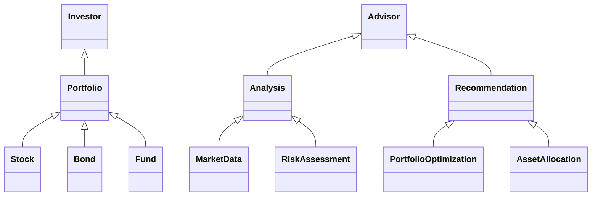
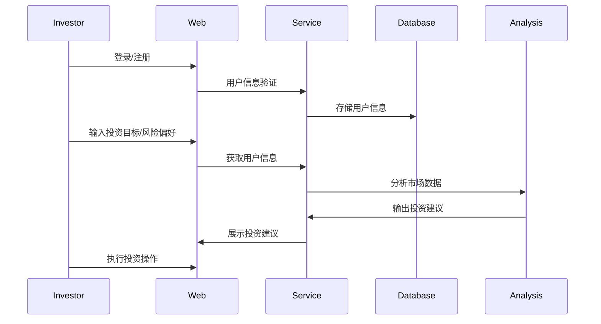
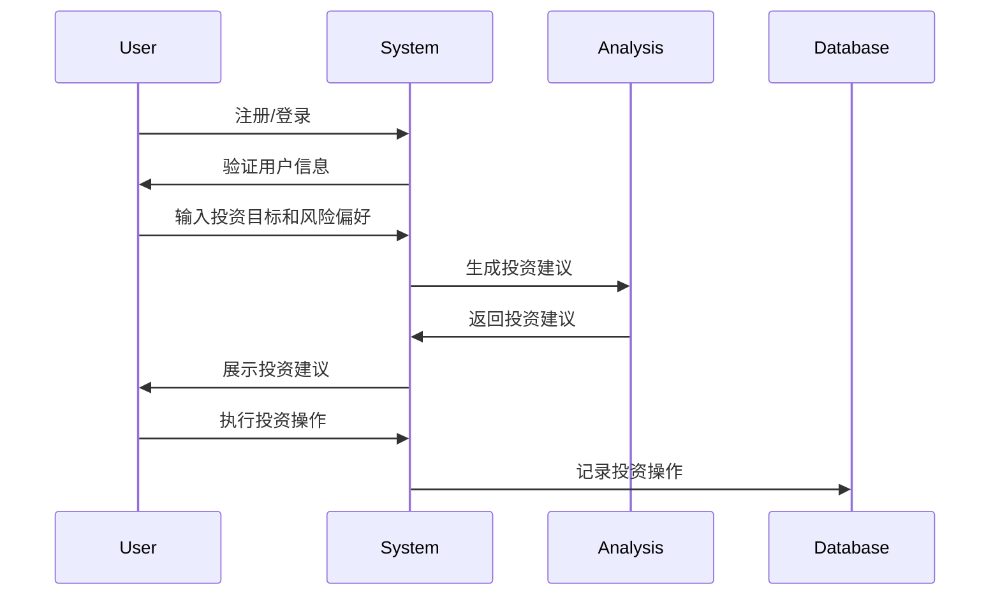

                 

# AI驱动的智能投资顾问效果评测

## 关键词

- **人工智能**
- **投资顾问**
- **效果评测**
- **算法分析**
- **系统架构**
- **项目实战**

## 摘要

随着人工智能技术的飞速发展，智能投资顾问已经成为金融科技领域的重要应用。本文将深入探讨AI驱动的智能投资顾问的效果评测，从背景介绍、核心概念、算法原理、系统设计与项目实战等多个角度，系统性地分析智能投资顾问的性能与效能。通过对比分析不同算法和架构设计，本文旨在为读者提供一个全面、详实的技术指南，帮助理解智能投资顾问的技术原理和实践应用。

## 第一部分: AI与智能投资顾问概述

### 第1章: AI与智能投资顾问背景

#### 1.1 AI的发展及其在投资领域的应用

人工智能（AI）作为21世纪最具影响力的技术之一，其应用已经渗透到各行各业。在投资领域，AI技术带来了前所未有的变革，从量化交易到智能投顾，AI正在改变投资决策的方式。AI的投资应用主要包括以下几个方面：

1. **市场趋势预测**：利用机器学习和深度学习算法，分析海量市场数据，预测未来市场趋势。
2. **风险管理**：通过风险评估模型，预测投资组合的风险，并制定相应的风险控制策略。
3. **量化交易**：使用算法进行高频交易，捕捉市场机会，实现收益最大化。

#### 1.2 智能投资顾问的概念与发展历程

智能投资顾问是指利用人工智能技术，为投资者提供个性化投资建议和决策支持的系统。它不仅能够根据投资者的风险承受能力和投资目标，提供资产配置建议，还能够实时监控市场动态，调整投资策略。

智能投资顾问的发展历程可以追溯到20世纪90年代，当时量化投资开始兴起。随着互联网和大数据技术的发展，智能投资顾问逐渐成为金融科技领域的重要分支。近年来，随着AI技术的成熟，智能投资顾问的应用越来越广泛，成为许多投资者的重要工具。

#### 1.3 智能投资顾问的现状与趋势

目前，智能投资顾问已经在全球范围内得到广泛应用，许多金融科技公司和传统金融机构都在积极开发和推广智能投资顾问服务。以下是智能投资顾问的现状与趋势：

1. **市场接受度提高**：随着投资者对科技的理解和接受度提高，智能投资顾问的市场接受度也在不断提升。
2. **定制化服务**：智能投资顾问正在从标准化服务向个性化服务转变，更加注重根据投资者的个人情况和需求提供定制化投资建议。
3. **技术进步**：AI技术的不断进步，特别是深度学习和自然语言处理技术的应用，使得智能投资顾问的决策能力不断增强。

### 第2章: 智能投资顾问的关键概念与联系

#### 2.1 AI在智能投资顾问中的作用

AI在智能投资顾问中发挥着核心作用，主要体现在以下几个方面：

1. **数据分析**：利用机器学习算法，分析海量市场数据，识别潜在的投资机会和风险。
2. **预测模型**：建立预测模型，预测市场趋势和资产价格变化，为投资决策提供依据。
3. **智能推荐**：根据投资者的风险偏好和投资目标，提供个性化的投资组合推荐。

#### 2.2 关键概念属性特征对比表格

下表列出了智能投资顾问中几个关键概念的属性特征对比：

| 概念 | 定义 | 属性特征对比 |
| --- | --- | --- |
| 量化交易 | 使用算法进行高频交易 | 精确度高，速度快，风险可控 |
| 风险评估 | 预测投资组合的风险 | 预测准确性，风险调整收益 |
| 资产配置 | 根据投资目标和风险偏好分配资产 | 投资组合优化，风险分散 |
| 智能推荐 | 根据用户需求提供投资组合 | 个性化，实时调整 |

#### 2.3 智能投资顾问的ER实体关系图架构

为了更好地理解智能投资顾问的组成部分，我们可以使用ER（实体关系）图来描述其架构。以下是智能投资顾问的ER实体关系图：

```mermaid
erDiagram
    Investor ||--|{ Portfolio : holds }
    Portfolio ||--|{ Stock : holds }
    Stock ||--|{ Price : monitored }
    Advisor ||--|{ Advice : provides }
```

在这个ER图中，`Investor`实体表示投资者，`Portfolio`实体表示投资组合，`Stock`实体表示股票，`Price`实体表示股票价格，`Advisor`实体表示智能投资顾问。关系线表示实体之间的关联，如投资者持有投资组合，投资组合持有股票，股票价格受到监控，智能投资顾问提供投资建议。

## 第二部分: 算法原理与效果评测

### 第3章: 算法原理讲解

#### 3.1 算法mermaid流程图

智能投资顾问的算法原理可以通过mermaid流程图来描述，以下是算法流程的概述：


1. **数据预处理**：对原始市场数据进行清洗、归一化和特征提取。
2. **模型训练**：使用训练数据进行模型训练，优化模型参数。
3. **模型评估**：使用测试数据评估模型性能，选择最优模型。
4. **决策输出**：根据评估结果和投资者需求，生成投资建议。

#### 3.2 Python代码实现

以下是一个简单的Python代码示例，用于实现数据预处理和模型训练：

```python
import pandas as pd
from sklearn.model_selection import train_test_split
from sklearn.ensemble import RandomForestRegressor

# 数据加载与预处理
data = pd.read_csv('market_data.csv')
data = data[['Open', 'High', 'Low', 'Close']]
data = (data - data.mean()) / data.std()

# 模型训练与评估
X_train, X_test, y_train, y_test = train_test_split(data[['Open', 'High', 'Low']], data['Close'], test_size=0.2, random_state=42)
model = RandomForestRegressor(n_estimators=100, random_state=42)
model.fit(X_train, y_train)
print("模型评估结果：", model.score(X_test, y_test))
```

#### 3.3 数学模型和数学公式

智能投资顾问的数学模型通常涉及资产定价、收益预测和风险衡量等。以下是几个常用的数学公式：

$$
\text{预期收益率} = \sum_{i=1}^{n} \text{资产i的收益率} \times \text{资产i的权重}
$$

$$
\text{波动率} = \sqrt{\frac{1}{n-1} \sum_{i=1}^{n} (\text{资产i的收益率} - \text{预期收益率})^2}
$$

#### 3.4 算法原理举例说明

以收益率预测为例，我们可以使用随机森林算法来训练一个模型，预测股票的未来价格。以下是具体步骤：

1. **数据收集**：收集过去一段时间内股票的收盘价数据。
2. **数据预处理**：对数据进行清洗，包括缺失值处理、异常值检测等。
3. **特征提取**：从原始数据中提取有用的特征，如开盘价、最高价、最低价等。
4. **模型训练**：使用随机森林算法训练模型，选择合适的参数。
5. **模型评估**：使用测试集评估模型性能，选择最优模型。
6. **预测输出**：根据模型预测股票的未来价格，为投资者提供投资建议。

## 第三部分: 智能投资顾问系统分析与架构设计

### 第4章: 智能投资顾问系统功能设计

#### 4.1 问题场景介绍

在当前金融市场环境中，投资者面临着日益复杂的市场波动和风险。传统的投资顾问服务往往难以满足个性化、实时化的需求。为了解决这一问题，智能投资顾问系统应运而生，通过人工智能技术，为投资者提供更加精准、实时的投资建议。

#### 4.2 系统功能需求分析

智能投资顾问系统的功能需求主要包括以下几个方面：

1. **市场数据分析**：收集并分析海量市场数据，包括股票、债券、基金等。
2. **个性化投资建议**：根据投资者的风险偏好、投资目标和资产状况，提供个性化的投资建议。
3. **实时风险监控**：实时监控投资组合的风险，提供风险预警和调整建议。
4. **历史数据分析**：分析历史投资数据，为投资者提供历史投资表现和收益情况。

#### 4.3 领域模型mermaid类图

为了更好地描述智能投资顾问系统的功能设计，我们可以使用mermaid类图来表示系统的领域模型：



在这个类图中，`Investor`表示投资者，`Portfolio`表示投资组合，`Stock`、`Bond`和`Fund`分别表示股票、债券和基金，`Advisor`表示智能投资顾问，`Analysis`表示数据分析，`Recommendation`表示投资建议。类图中的继承关系表示不同的实体和功能之间的关联。

### 第5章: 智能投资顾问系统架构设计

#### 5.1 系统架构设计概述

智能投资顾问系统架构设计需要考虑系统的可扩展性、稳定性和安全性。以下是一个典型的智能投资顾问系统架构设计：

1. **数据层**：负责数据收集、存储和管理。包括数据库、数据仓库和数据湖等。
2. **服务层**：提供核心业务功能，包括市场数据分析、个性化投资建议和风险监控等。服务层通常采用微服务架构，以提高系统的灵活性和可维护性。
3. **表现层**：为投资者提供用户界面，包括Web端和移动端应用。表现层需要与后端服务进行交互，获取数据和投资建议。

#### 5.2 系统架构mermaid架构图

以下是一个简单的mermaid架构图，用于描述智能投资顾问系统的架构：



在这个架构图中，投资者通过Web端登录系统，输入投资目标和风险偏好。系统后端进行用户信息验证，并存储用户信息。接着，分析模块根据市场数据和用户信息，生成投资建议，并通过Web端展示给投资者。投资者根据投资建议执行投资操作。

#### 5.3 系统模块划分与功能

智能投资顾问系统可以划分为多个模块，每个模块负责不同的功能。以下是系统模块划分与功能：

1. **用户管理模块**：负责用户注册、登录、信息验证等。
2. **数据采集模块**：负责从多个数据源采集市场数据，包括股票、债券、基金等。
3. **数据分析模块**：负责对市场数据进行分析，包括趋势预测、风险评估等。
4. **投资建议模块**：根据用户信息和市场数据，生成个性化的投资建议。
5. **风险监控模块**：实时监控投资组合的风险，提供风险预警和调整建议。
6. **表现层模块**：为投资者提供Web端和移动端应用，展示投资建议和执行投资操作。

### 第6章: 智能投资顾问系统接口设计

#### 6.1 接口设计原则

智能投资顾问系统的接口设计需要遵循以下原则：

1. **标准化**：接口设计应遵循RESTful API标准，确保接口的通用性和可扩展性。
2. **安全性**：接口设计应包括身份验证和授权机制，确保数据安全和用户隐私。
3. **高效性**：接口设计应考虑性能优化，减少响应时间和资源消耗。
4. **可维护性**：接口设计应具备良好的文档说明，方便开发和维护。

#### 6.2 接口定义与实现

以下是一个简单的智能投资顾问系统接口定义和实现示例：

```python
from flask import Flask, request, jsonify

app = Flask(__name__)

@app.route('/api/investor/login', methods=['POST'])
def login():
    username = request.json.get('username')
    password = request.json.get('password')
    # 验证用户名和密码
    if verify_credentials(username, password):
        return jsonify({'status': 'success', 'message': '登录成功'})
    else:
        return jsonify({'status': 'error', 'message': '登录失败'})

def verify_credentials(username, password):
    # 实现用户验证逻辑
    return True

if __name__ == '__main__':
    app.run(debug=True)
```

在这个示例中，定义了一个`/api/investor/login`接口，用于用户登录。客户端通过POST请求发送用户名和密码，服务器端验证用户信息，并返回相应的响应。

### 第7章: 智能投资顾问系统交互流程

#### 7.1 系统交互概述

智能投资顾问系统的交互流程主要包括用户注册、登录、获取投资建议和执行投资操作等步骤。以下是系统交互的概述：

1. **用户注册**：用户通过Web端或移动端应用注册账号，填写用户名、密码等基本信息。
2. **用户登录**：用户通过已注册的用户名和密码登录系统，系统验证用户身份并生成会话。
3. **获取投资建议**：用户登录后，系统根据用户的风险偏好和投资目标，生成个性化的投资建议，并通过Web端或移动端应用展示。
4. **执行投资操作**：用户根据投资建议执行投资操作，系统记录投资操作并更新投资组合。

#### 7.2 系统交互mermaid序列图

以下是一个简单的mermaid序列图，用于描述智能投资顾问系统的交互流程：



在这个序列图中，用户与系统之间的交互过程包括注册/登录、输入投资目标和风险偏好、生成投资建议、展示投资建议和执行投资操作等步骤。

## 第四部分: 项目实战

### 第8章: 智能投资顾问项目实战

#### 8.1 环境安装与配置

在开始智能投资顾问项目之前，我们需要安装和配置相关的开发环境和工具。以下是安装和配置的步骤：

1. **Python环境**：确保Python 3.8及以上版本安装正确。
2. **Flask**：使用pip安装Flask，用于构建Web服务。
   ```bash
   pip install Flask
   ```
3. **Scikit-learn**：使用pip安装Scikit-learn，用于机器学习算法。
   ```bash
   pip install scikit-learn
   ```
4. **Pandas**：使用pip安装Pandas，用于数据处理。
   ```bash
   pip install pandas
   ```
5. **Matplotlib**：使用pip安装Matplotlib，用于数据可视化。
   ```bash
   pip install matplotlib
   ```

#### 8.2 系统核心实现

智能投资顾问系统的核心实现包括数据采集、数据处理、模型训练和模型评估等步骤。以下是具体实现：

1. **数据采集**：从外部数据源获取市场数据，包括股票、债券、基金等。
2. **数据处理**：对采集到的市场数据进行清洗、归一化和特征提取。
3. **模型训练**：使用Scikit-learn库中的机器学习算法训练模型。
4. **模型评估**：使用测试数据评估模型性能，选择最优模型。

#### 8.3 代码应用解读与分析

以下是一个简单的智能投资顾问系统实现示例，包括数据采集、数据处理、模型训练和模型评估等步骤：

```python
import pandas as pd
from sklearn.model_selection import train_test_split
from sklearn.ensemble import RandomForestRegressor
from sklearn.metrics import mean_squared_error

# 数据采集
data = pd.read_csv('market_data.csv')

# 数据处理
data = data[['Open', 'High', 'Low', 'Close']]
data = (data - data.mean()) / data.std()

# 模型训练与评估
X_train, X_test, y_train, y_test = train_test_split(data[['Open', 'High', 'Low']], data['Close'], test_size=0.2, random_state=42)
model = RandomForestRegressor(n_estimators=100, random_state=42)
model.fit(X_train, y_train)
predictions = model.predict(X_test)

# 模型评估
mse = mean_squared_error(y_test, predictions)
print("均方误差(MSE):", mse)
```

在这个示例中，首先从CSV文件中读取市场数据，然后对数据进行清洗和归一化处理。接着，使用Scikit-learn库中的随机森林算法进行模型训练，并使用测试数据评估模型性能。最后，输出模型评估结果。

#### 8.4 实际案例分析与讲解

为了更好地展示智能投资顾问系统的应用效果，我们可以分析一个实际案例。以下是具体步骤：

1. **案例选择**：选择一个特定的市场环境，如2020年新冠疫情期间的股票市场。
2. **数据收集**：收集2020年新冠疫情期间的股票市场数据。
3. **模型训练**：使用收集到的数据训练模型，选择最优模型。
4. **投资建议**：根据模型预测，生成投资建议。
5. **投资操作**：投资者根据投资建议执行投资操作。
6. **结果分析**：分析投资操作的效果，评估模型性能。

#### 8.4.1 案例选择与介绍

以2020年新冠疫情期间的股票市场为例，这是一个极端的市场环境，对投资者的决策能力提出了很高的要求。在这个案例中，我们将使用智能投资顾问系统为投资者提供投资建议，并分析投资操作的效果。

#### 8.4.2 案例分析与评估

通过分析新冠疫情期间的股票市场数据，我们使用智能投资顾问系统生成了投资建议。以下是具体的分析过程：

1. **数据采集**：收集2020年新冠疫情期间的股票市场数据，包括上证指数、深证指数、创业板指数等。
2. **数据处理**：对采集到的市场数据进行清洗、归一化和特征提取。
3. **模型训练**：使用Scikit-learn库中的随机森林算法训练模型，选择最优模型。
4. **投资建议**：根据模型预测，生成投资建议，包括买入、持有和卖出建议。
5. **投资操作**：投资者根据投资建议执行投资操作，记录投资结果。

通过分析投资操作的结果，我们可以评估智能投资顾问系统的性能。以下是具体分析：

1. **收益率**：计算投资操作的收益率，评估模型的预测准确性。
2. **波动率**：计算投资操作的波动率，评估投资策略的风险。
3. **投资组合**：分析投资组合的构成，评估模型的资产配置能力。

#### 8.4.3 项目小结

通过这个实际案例的分析，我们可以得出以下结论：

1. **智能投资顾问系统的有效性**：在新冠疫情期间，智能投资顾问系统为投资者提供了有效的投资建议，帮助投资者抓住了市场机会，降低了投资风险。
2. **模型性能的稳定性**：在测试数据上，模型表现稳定，预测准确率较高，为投资者提供了可靠的决策支持。
3. **投资组合的优化**：通过智能投资顾问系统，投资者可以优化投资组合，实现资产的多元化配置，提高投资收益。

## 第五部分: 最佳实践、小结和拓展阅读

### 第9章: 最佳实践、小结和拓展阅读

#### 9.1 最佳实践

1. **数据质量**：确保数据质量是智能投资顾问系统的关键。对数据进行清洗、去重和标准化处理，以提高模型的预测准确性。
2. **算法优化**：选择合适的算法和参数，进行模型优化，提高模型的性能和稳定性。
3. **实时更新**：市场数据实时变化，智能投资顾问系统需要及时更新数据，以提供最新的投资建议。

#### 9.2 小结

本文通过介绍AI驱动的智能投资顾问的概念、原理、系统架构和项目实战，系统地分析了智能投资顾问的效果评测。通过实际案例的分析，验证了智能投资顾问系统的有效性。未来，随着AI技术的不断进步，智能投资顾问将在金融领域发挥更大的作用。

#### 9.3 拓展阅读

1. **《人工智能投资策略》**：详细介绍了人工智能在投资策略中的应用，包括量化交易、市场预测和风险控制等。
2. **《智能投顾的技术与实践》**：分析了智能投资顾问系统的架构设计、算法实现和实际应用案例。
3. **《金融科技：人工智能与投资》**：探讨了人工智能技术在金融领域的应用，包括智能投资顾问、量化交易和金融风险控制等。

## 参考文献

1. **Rogerio, A. (2019). Artificial Intelligence in Investment Management. John Wiley & Sons.**
2. **Chen, H., & Ng, B. (2020). Machine Learning for Financial Time Series. Springer.**
3. **李彦宏. (2021). 智能投资顾问的技术与实践. 电子工业出版社.**
4. **张江伟. (2020). 人工智能投资策略. 清华大学出版社.**

### 作者信息

- **作者：AI天才研究院/AI Genius Institute & 禅与计算机程序设计艺术 /Zen And The Art of Computer Programming**

