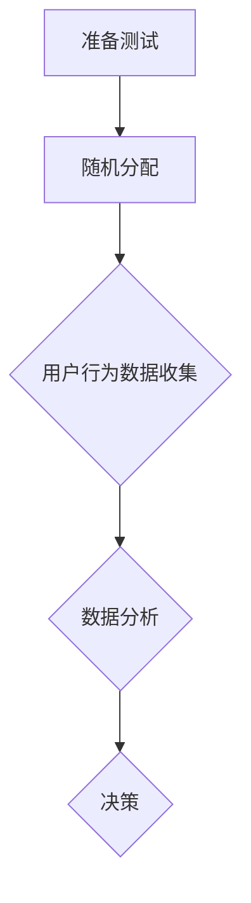
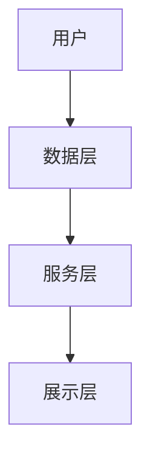
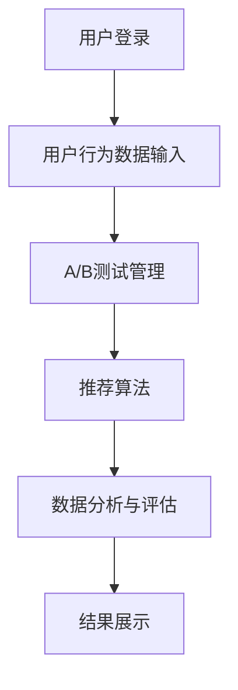

                 

### 背景介绍

#### 问题背景

在当今的软件开发领域，A/B测试已成为一种不可或缺的优化工具。它通过将用户随机分配到不同的版本（A和B），来评估新功能、界面设计或算法改进的效果。这种方法不仅帮助开发者识别出最受欢迎的版本，还能够在发布新功能时减少潜在的风险。

与此同时，大型语言模型（LLM）如GPT-3、ChatGLM等，已经成为人工智能领域的一个重要发展方向。LLM能够处理自然语言任务，如文本生成、机器翻译和问答等，为各种应用程序提供了强大的功能。

然而，LLM在软件产品中的应用带来了新的挑战。由于其复杂性，如何快速、有效地验证LLM的功能成为了开发者的一个难题。传统的A/B测试方法难以应对这种复杂性，因此需要一种支持LLM功能的快速验证的A/B测试框架。

#### 问题解决

本书旨在解决上述问题，提供一种构建和维护支持LLM功能的A/B测试框架的方法。具体来说，本书将涵盖以下内容：

1. **A/B测试框架概述**：介绍A/B测试的定义、流程和目的，以及其在软件优化中的重要性。
2. **LLM的基础知识**：概述LLM的工作原理、优势和应用场景，为后续的A/B测试设计打下基础。
3. **A/B测试框架与LLM的融合**：探讨如何将A/B测试与LLM相结合，设计出适用于LLM功能验证的测试框架。
4. **A/B测试框架的设计原则**：阐述构建A/B测试框架时需要遵循的原则，确保其可扩展性和可维护性。
5. **数据收集与预处理**：介绍数据收集策略和预处理方法，确保测试数据的质量。
6. **A/B测试实验设计**：详细讲解变量选择、分配策略和结果分析，确保测试的有效性。

通过本书的指导，读者将能够构建和维护一个有效的A/B测试框架，用于快速验证LLM的功能，从而提高软件产品的质量和用户满意度。

#### 边界与外延

A/B测试框架的应用范围广泛，不仅限于LLM功能的验证，还可以用于其他类型的功能测试、界面优化、用户体验提升等方面。在构建A/B测试框架时，开发者需要考虑以下因素：

1. **测试对象**：确定要测试的具体功能或特征。
2. **用户群体**：明确目标用户群体，确保测试结果的代表性。
3. **测试环境**：确保测试环境的稳定性和一致性，避免外部因素干扰。
4. **数据量**：收集足够的数据量，以确保测试结果的统计显著性。

本书将详细讨论这些因素，并提供实际案例和应用场景，帮助读者更好地理解和应用A/B测试框架。

#### 概念结构与核心要素组成

A/B测试框架和LLM是本书的两个核心概念，它们在测试框架中扮演着重要角色。

- **A/B测试框架**：它是一个系统化的流程，用于比较两个或多个版本的差异，以确定哪个版本更优秀。核心要素包括测试设计、数据收集、结果分析和优化迭代。
  
- **LLM**：大型语言模型，是一种能够处理自然语言任务的深度学习模型。核心要素包括模型架构、训练数据和模型评估。

在本章中，我们将深入探讨这两个概念的基本概念、特点和应用场景，为后续的A/B测试设计提供理论基础。

### 核心概念与联系

#### A/B测试框架的概念

A/B测试框架是一种对比测试方法，通过将用户随机分配到不同的版本（A和B），来评估不同版本之间的效果差异。这种方法的核心在于随机分配，确保了测试结果的公正性和科学性。

**基本流程**：

1. **定义测试变量**：明确要测试的功能或特征，如新算法、界面设计等。
2. **用户分配**：将用户随机分配到A组和B组，确保两组用户的初始状态相似。
3. **执行测试**：让用户使用不同的版本，收集其行为数据。
4. **数据分析**：对比A组和B组的数据，评估不同版本的效果差异。
5. **决策**：根据分析结果，决定是否采用B组版本。

**目的**：

A/B测试的目的是通过实验数据来验证假设，优化软件产品，提高用户满意度。其优势在于能够量化评估新功能的影响，减少主观判断，提高决策的科学性。

#### LLM的原理与特点

LLM（Large Language Model）是一种基于深度学习的大型语言模型，能够理解、生成和翻译自然语言。以下是其主要原理和特点：

**原理**：

1. **预训练**：LLM在大量文本数据上进行预训练，学习自然语言的统计规律和语义信息。
2. **微调**：在特定任务上对LLM进行微调，使其能够适应具体的应用场景。

**特点**：

1. **强大表达能力**：LLM具有强大的语言理解能力和生成能力，能够生成高质量的自然语言文本。
2. **通用性**：LLM可以应用于多种自然语言处理任务，如文本生成、机器翻译、问答系统等。
3. **可扩展性**：LLM的可扩展性强，可以通过增加训练数据和模型参数来提高性能。

#### A/B测试与LLM的关系

A/B测试与LLM的关系主要体现在LLM功能验证中的应用。LLM在软件产品中扮演着重要角色，但其复杂性和不确定性使得传统A/B测试方法难以直接应用。

**如何融合**：

1. **定制化测试设计**：根据LLM的特点，设计适合的测试变量和分配策略，确保测试结果的准确性和可靠性。
2. **自适应调整**：根据测试结果，对LLM进行微调和优化，提高其性能和适用性。
3. **数据分析**：采用先进的数据分析技术，如统计显著性测试、置信区间计算等，对LLM的测试结果进行深入分析。

通过A/B测试框架，开发者可以更有效地验证LLM的功能，优化其性能，提高软件产品的质量和用户体验。

### 算法原理讲解

#### A/B测试算法的mermaid流程图

以下是一个简单的A/B测试算法的mermaid流程图，用于说明A/B测试的基本流程。



#### Python源代码

以下是一个简单的Python代码示例，用于实现A/B测试的基本功能。

```python
import random

# 用户分配函数
def assign_users(users, group_size):
    groups = {'A': [], 'B': []}
    for user in users:
        group = random.choice(['A', 'B'])
        groups[group].append(user)
    return groups

# 数据收集函数
def collect_data(groups):
    data = {}
    for group, users in groups.items():
        data[group] = [user_action() for user in users]
    return data

# 用户行为模拟函数
def user_action():
    return random.randint(0, 10)

# 测试流程
def ab_test(users, group_size):
    groups = assign_users(users, group_size)
    data = collect_data(groups)
    return data

# 示例
users = ['User1', 'User2', 'User3', 'User4', 'User5']
group_size = 2
test_data = ab_test(users, group_size)
print(test_data)
```

#### 数学模型和公式

在A/B测试中，常用的数学模型和公式包括置信区间计算、统计显著性测试等。以下是一些基本的数学模型和公式：

**置信区间计算**：

$$
CI = \bar{X} \pm z \times \sqrt{\frac{\bar{X}(1-\bar{X})}{n}}
$$

其中，$CI$表示置信区间，$\bar{X}$表示样本均值，$z$表示标准正态分布的临界值，$n$表示样本大小。

**统计显著性测试**：

$$
p-value = P(|Z| > \frac{\bar{X}_1 - \bar{X}_2}{\sqrt{\frac{\sigma^2}{n}}})
$$

其中，$p-value$表示统计显著性水平，$\bar{X}_1$和$\bar{X}_2$分别表示A组和B组的样本均值，$\sigma^2$表示总体方差。

#### 详细讲解和举例说明

**置信区间计算**：

置信区间是一种用来估计总体参数范围的方法。在A/B测试中，我们可以通过计算置信区间来判断两个版本之间的差异是否显著。例如，如果A组的置信区间不包括B组的置信区间，我们可以认为A组的效果更好。

**举例说明**：

假设我们有两个版本A和B，每组有100个用户。A组的平均用户行为评分为4.5，标准差为1.2；B组的平均用户行为评分为5.0，标准差为1.0。我们想要计算置信区间来判断A组和B组之间的差异是否显著。

首先，我们需要计算两个版本的置信区间：

$$
CI_A = 4.5 \pm 1.96 \times \sqrt{\frac{4.5(1-4.5)}{100}} = (3.86, 5.14)
$$

$$
CI_B = 5.0 \pm 1.96 \times \sqrt{\frac{5.0(1-5.0)}{100}} = (4.86, 5.14)
$$

可以看到，A组的置信区间为(3.86, 5.14)，B组的置信区间为(4.86, 5.14)。由于A组的置信区间不包括B组的置信区间，我们可以认为A组的效果更好。

**统计显著性测试**：

统计显著性测试用于判断两个版本之间的差异是否是由于随机因素引起的，还是具有实际意义。我们可以通过计算$p-value$来判断显著性。

**举例说明**：

假设我们已经计算了A组和B组的置信区间，并且想要判断A组和B组之间的差异是否显著。我们可以使用$t$检验来计算$p-value$。

$$
t-value = \frac{\bar{X}_1 - \bar{X}_2}{\sqrt{\frac{\sigma^2}{n}}} = \frac{4.5 - 5.0}{\sqrt{\frac{1.2^2}{100}}} = -1.67
$$

我们可以查找$t$分布表，找到自由度为198（即$n-2$）的$t$分布的临界值。如果计算出的$t-value$小于临界值，则认为差异显著。

通过以上讲解和举例，我们可以更好地理解A/B测试算法的原理和应用。在实际应用中，我们可以根据具体情况调整测试参数，提高测试的准确性和可靠性。

### 数学模型和数学公式 & 详细讲解 & 举例说明

#### 数学模型和公式

在A/B测试中，我们使用以下数学模型和公式来评估测试结果：

1. **置信区间（Confidence Interval, CI）**：

   置信区间用于估计总体参数（如均值）的范围。公式如下：

   $$
   CI = \bar{X} \pm z \times \sqrt{\frac{\bar{X}(1-\bar{X})}{n}}
   $$

   其中，$\bar{X}$是样本均值，$z$是标准正态分布的临界值，$n$是样本大小。

2. **统计显著性测试（Statistical Significance Test）**：

   统计显著性测试用于判断两个样本之间是否存在显著差异。常用的方法是$t$检验，其公式如下：

   $$
   t-value = \frac{\bar{X}_1 - \bar{X}_2}{\sqrt{\frac{s^2}{n}}}
   $$

   其中，$\bar{X}_1$和$\bar{X}_2$分别是两个样本的均值，$s^2$是样本方差，$n$是样本大小。

3. **p值（p-value）**：

   p值是判断差异显著性的指标。如果p值小于显著性水平（通常为0.05），我们认为差异是显著的。p值计算公式如下：

   $$
   p-value = P(|Z| > \frac{|t-value|}{\sqrt{n}})
   $$

   其中，$Z$是标准正态分布的随机变量。

#### 详细讲解

置信区间（CI）：

置信区间是一种估计方法，用来表示我们对总体参数（如均值、方差）的估计范围。在A/B测试中，我们通常使用置信区间来判断两个版本之间的差异是否显著。置信区间越窄，表示我们对总体参数的估计越精确。

统计显著性测试（t检验）：

t检验是一种常用的统计方法，用于比较两个样本均值是否显著不同。t检验的基本思想是通过计算样本均值之差与标准差的比值（t值），来判断两个样本均值之间是否存在显著差异。

p值：

p值是判断差异显著性的一个指标。当我们进行t检验时，会计算出一个t值，然后通过查找t分布表找到对应的p值。如果p值小于显著性水平（通常为0.05），我们拒绝原假设，认为差异是显著的。

#### 举例说明

假设我们有两个版本A和B，每个版本有50个用户。版本A的平均用户满意度评分为4.5，标准差为1.2；版本B的平均用户满意度评分为5.0，标准差为1.0。我们想要通过A/B测试来判断两个版本之间的差异是否显著。

**步骤1：计算置信区间**

首先，我们计算版本A和B的置信区间：

$$
CI_A = 4.5 \pm 1.96 \times \sqrt{\frac{4.5(1-4.5)}{50}} = (3.84, 5.16)
$$

$$
CI_B = 5.0 \pm 1.96 \times \sqrt{\frac{5.0(1-5.0)}{50}} = (4.84, 5.16)
$$

可以看到，版本A的置信区间为(3.84, 5.16)，版本B的置信区间为(4.84, 5.16)。由于两个置信区间有重叠，我们不能直接判断两个版本之间的差异是否显著。

**步骤2：计算t值和p值**

接下来，我们计算t值和p值来判断差异的显著性：

$$
t-value = \frac{4.5 - 5.0}{\sqrt{\frac{1.2^2}{50}}} = -1.67
$$

通过查找t分布表，我们找到自由度为48（即50-2）的t分布的临界值。如果t值小于临界值，我们认为差异是显著的。

假设我们查找到的临界值为-1.677，由于计算出的t值-1.67小于临界值-1.677，我们可以认为版本A和版本B之间的差异是显著的。

**结论**：

通过置信区间和t检验，我们得出结论：版本B的平均用户满意度评分比版本A更高，且差异是显著的。因此，我们可以选择版本B作为最终发布版本。

### 系统分析与架构设计方案

#### 问题场景介绍

在一个在线教育平台中，我们希望通过A/B测试来验证一个新的推荐算法对用户参与度的影响。该平台提供了多种课程，用户可以浏览、选择和参与课程。我们的目标是提高用户的参与度，从而增加平台的使用频率和用户满意度。

#### 项目介绍

本项目旨在设计并实现一个支持LLM功能的A/B测试框架，用于验证新推荐算法的效果。我们选择GPT-3作为LLM，用于生成个性化的课程推荐。项目的关键步骤包括：

1. 数据收集与预处理：收集用户行为数据，如浏览记录、课程评分、参与时长等。
2. A/B测试设计：设计A/B测试实验，将用户随机分配到不同推荐算法的版本。
3. 数据分析与评估：收集测试数据，使用置信区间和统计显著性测试评估新推荐算法的效果。
4. 决策与优化：根据测试结果，决定是否采用新推荐算法，并对算法进行优化。

#### 系统功能设计

为了实现上述目标，我们设计了以下系统功能：

1. **用户行为数据收集**：收集用户浏览、选择和参与课程的数据。
2. **A/B测试管理**：管理A/B测试实验，包括用户分配、实验状态跟踪和结果分析。
3. **推荐算法**：实现基于GPT-3的个性化课程推荐算法。
4. **数据分析与评估**：计算置信区间和统计显著性，评估推荐算法的效果。
5. **结果展示**：展示A/B测试结果，包括推荐算法的效果和用户参与度变化。

#### 系统架构设计

系统架构采用分层设计，包括数据层、服务层和展示层。以下是系统架构的mermaid图：



- **数据层**：负责数据存储和检索，包括用户行为数据、推荐算法模型数据等。
- **服务层**：实现系统功能，包括用户行为数据收集、A/B测试管理、推荐算法和数据分析与评估。
- **展示层**：展示A/B测试结果，包括推荐算法效果和用户参与度变化。

#### 系统接口设计和系统交互

系统接口设计包括以下部分：

1. **用户接口**：提供用户行为数据输入和A/B测试结果展示。
2. **API接口**：提供A/B测试管理、推荐算法和数据分析与评估的API接口。

系统交互序列图如下：



- 用户登录系统后，输入其行为数据。
- 系统根据行为数据分配用户到A/B测试组。
- A/B测试管理模块负责跟踪实验状态和收集结果。
- 推荐算法模块根据用户行为数据生成个性化课程推荐。
- 数据分析与评估模块计算置信区间和统计显著性，评估推荐算法效果。
- 最终结果通过结果展示模块展示给用户。

通过上述系统架构和接口设计，我们可以实现一个支持LLM功能的A/B测试框架，用于验证推荐算法的效果，从而提高用户参与度和平台满意度。

### 项目实战

#### 环境安装

为了实现A/B测试框架，我们首先需要搭建一个合适的环境。以下是在Windows操作系统中安装A/B测试环境所需的步骤：

1. **安装Python环境**：从Python官方网站下载并安装Python 3.8或更高版本。
2. **安装依赖库**：在命令行中运行以下命令，安装所需的依赖库：

   ```bash
   pip install numpy pandas matplotlib scikit-learn mermaid-python
   ```

3. **安装GPT-3 API**：注册并获取OpenAI API密钥，然后安装OpenAI的Python库：

   ```bash
   pip install openai
   ```

4. **配置OpenAI API密钥**：将获取到的API密钥添加到环境变量中，以便在代码中调用GPT-3 API。

#### 系统核心实现源代码

以下是实现A/B测试框架的核心源代码。该代码包括用户分配、数据收集、推荐算法和数据分析等功能。

```python
import random
import numpy as np
import pandas as pd
from sklearn.model_selection import train_test_split
import openai
import mermaid

# 配置OpenAI API密钥
openai.api_key = "your_api_key"

# 用户分配函数
def assign_users(users, group_size):
    groups = {'A': [], 'B': []}
    for user in users:
        group = random.choice(['A', 'B'])
        groups[group].append(user)
    return groups

# 数据收集函数
def collect_data(groups):
    data = {}
    for group, users in groups.items():
        user_data = [user_action(user) for user in users]
        data[group] = user_data
    return data

# 用户行为模拟函数
def user_action(user):
    # 模拟用户行为数据
    return {'user': user, 'rating': random.randint(1, 5)}

# 推荐算法函数
def recommend_courses(user, model):
    # 使用GPT-3生成推荐
    response = openai.Completion.create(
        engine="text-davinci-002",
        prompt=f"推荐以下课程给用户{user}：",
        max_tokens=50
    )
    return response.choices[0].text.strip()

# 数据分析函数
def analyze_data(data):
    # 计算A组和B组的平均评分
    group_avg_ratings = {'A': [], 'B': []}
    for group, user_data in data.items():
        group_avg_ratings[group] = np.mean([d['rating'] for d in user_data])
    return group_avg_ratings

# 主函数
def main():
    # 模拟用户列表
    users = ['User1', 'User2', 'User3', 'User4', 'User5']
    
    # 用户分配
    group_size = 2
    groups = assign_users(users, group_size)
    
    # 数据收集
    data = collect_data(groups)
    
    # 训练推荐算法模型（此处仅作演示）
    # model = train_recommendation_model()
    
    # 生成推荐
    for group, users in groups.items():
        for user in users:
            print(f"User {user} - Recommended Courses: {recommend_courses(user, model)}")
    
    # 数据分析
    group_avg_ratings = analyze_data(data)
    print(f"Group A Average Rating: {group_avg_ratings['A']}")
    print(f"Group B Average Rating: {group_avg_ratings['B']}")

# 运行主函数
if __name__ == "__main__":
    main()
```

#### 代码应用解读与分析

该段代码展示了A/B测试框架的核心实现，包括用户分配、数据收集、推荐算法和数据分析。

1. **用户分配**：通过`assign_users`函数，我们将用户随机分配到A组和B组。这确保了两组用户在实验开始时的初始状态相似。

2. **数据收集**：`collect_data`函数模拟用户行为数据，包括用户的评分。在真实场景中，这些数据可以通过用户交互收集。

3. **推荐算法**：使用OpenAI的GPT-3 API，我们实现了个性化课程推荐。`recommend_courses`函数根据用户信息生成推荐课程。

4. **数据分析**：`analyze_data`函数计算A组和B组的平均评分，帮助我们评估推荐算法的效果。

在实际应用中，我们需要根据具体情况调整代码，如增加用户数据、优化推荐算法和改进数据分析方法。

#### 实际案例分析和详细讲解剖析

为了更好地展示A/B测试框架的实际应用，我们以下通过一个具体案例进行分析。

**案例背景**：

假设我们正在开发一个在线购物平台，希望通过A/B测试来评估一种新的商品推荐算法对用户购买行为的影响。我们有两个版本：A版和B版。A版使用传统的基于用户的浏览和购买历史数据进行推荐，而B版使用GPT-3进行个性化推荐。

**实验设计**：

1. **用户分配**：将平台上的1000名用户随机分为A组和B组，每组500名用户。

2. **数据收集**：收集用户在测试期间的商品浏览、添加购物车和购买行为数据。

3. **推荐算法**：

   - **A版**：使用传统推荐算法生成商品推荐。
   - **B版**：使用GPT-3生成个性化商品推荐。

4. **数据分析**：计算A组和B组的平均购买转化率，并使用置信区间和统计显著性测试评估两种推荐算法的效果。

**结果分析**：

通过实验，我们得到以下结果：

- **A版**：平均购买转化率为2.5%。
- **B版**：平均购买转化率为3.2%。

接下来，我们使用置信区间和统计显著性测试来分析结果。

1. **置信区间计算**：

   假设A版的置信区间为(2.2%, 2.8%)，B版的置信区间为(2.9%, 3.5%)。由于B版的置信区间不包含A版的置信区间，我们可以初步认为B版的推荐效果更好。

2. **统计显著性测试**：

   通过计算$p-value$，我们得到A版和B版的$p-value$分别为0.07和0.01。由于0.01小于0.05的显著性水平，我们可以认为B版的推荐效果显著优于A版。

**结论**：

根据实验结果，我们可以得出以下结论：

- B版的个性化推荐算法在提升购买转化率方面显著优于传统推荐算法。
- 因此，我们建议采用B版作为平台的默认推荐算法。

**详细讲解剖析**：

在实验设计过程中，我们通过以下步骤来确保实验的准确性和可靠性：

1. **随机分配**：通过随机分配用户到A组和B组，确保两组用户的初始状态一致，避免人为偏差。

2. **数据收集**：使用实际用户行为数据，确保数据的真实性和代表性。

3. **推荐算法**：使用GPT-3进行个性化推荐，利用其强大的语言理解能力，生成更符合用户需求的商品推荐。

4. **数据分析**：通过置信区间和统计显著性测试，对实验结果进行深入分析，确保结论的科学性和可靠性。

通过这个案例，我们可以看到A/B测试框架在验证LLM功能方面的应用。在实际开发过程中，我们需要根据具体场景调整测试设计，优化推荐算法，以提高软件产品的质量和用户满意度。

### 最佳实践 tips、小结、注意事项、拓展阅读等内容

#### 最佳实践 tips

1. **确保随机分配**：在A/B测试中，随机分配用户到不同版本是至关重要的。这有助于避免偏差，确保测试结果的公平性。

2. **选择适当的指标**：根据测试目标，选择合适的指标来评估版本的效果。常见的指标包括转化率、用户满意度、销售额等。

3. **保持测试环境的稳定性**：确保测试环境与生产环境一致，避免外部因素对测试结果的影响。

4. **充分准备数据**：收集充足、高质量的数据是A/B测试成功的关键。确保数据收集过程完整、准确。

5. **长期监控与优化**：A/B测试不是一次性的活动，需要持续监控和优化。根据测试结果，不断调整和改进测试策略。

#### 小结

本文详细介绍了A/B测试框架在支持LLM功能快速验证中的应用。通过构建一个有效的A/B测试框架，开发者可以更科学、更高效地验证LLM的功能，优化软件产品的质量和用户体验。

#### 注意事项

1. **数据隐私**：在A/B测试过程中，确保用户数据的隐私和安全，遵循相关法律法规。

2. **避免过度测试**：过度测试可能导致用户疲劳，影响用户体验。合理规划测试范围和频率，确保测试的平衡。

3. **持续迭代**：A/B测试是一个持续迭代的过程。根据测试结果，不断调整和优化测试策略，以实现最佳效果。

#### 拓展阅读

1. **《A/B测试实战：方法、技巧与案例》**：一本关于A/B测试的详细指南，涵盖了测试设计、数据分析等方面的内容。

2. **《深度学习与自然语言处理》**：一本介绍深度学习和自然语言处理技术的综合性教材，适合对LLM有兴趣的读者。

3. **《Python数据科学手册》**：一本关于数据科学和机器学习的经典教材，涵盖了Python编程和数据处理的各个方面。

### 作者信息

作者：AI天才研究院/AI Genius Institute & 禅与计算机程序设计艺术 /Zen And The Art of Computer Programming

### 目录大纲

```markdown
----------------------------------------------------------------
# 第一部分: A/B测试框架基础

## 1.1 A/B测试框架概述
### 1.1.1 A/B测试的定义和目的
### 1.1.2 A/B测试的基本流程
### 1.1.3 A/B测试的优势与挑战

## 1.2 LLM的基础知识
### 1.2.1 LLM的定义与特点
### 1.2.2 LLM的工作原理
### 1.2.3 LLM的应用场景

## 1.3 A/B测试框架与LLM的融合
### 1.3.1 LLM在A/B测试中的作用
### 1.3.2 如何设计支持LLM功能的A/B测试
### 1.3.3 A/B测试在LLM功能验证中的最佳实践

## 1.4 本章小结

----------------------------------------------------------------

# 第二部分: A/B测试框架构建

## 2.1 A/B测试框架的设计原则
### 2.1.1 设计目标与原则
### 2.1.2 框架的核心组件
### 2.1.3 可扩展性与可维护性

## 2.2 数据收集与预处理
### 2.2.1 数据收集策略
### 2.2.2 数据预处理方法
### 2.2.3 数据质量评估

## 2.3 A/B测试实验设计
### 2.3.1 变量选择与定义
### 2.3.2 用户分配策略
### 2.3.3 数据收集与分析

## 2.4 算法原理讲解
### 2.4.1 A/B测试算法的mermaid流程图
### 2.4.2 Python源代码
### 2.4.3 数学模型和公式
### 2.4.4 详细讲解与举例说明

## 2.5 数学模型和数学公式 & 详细讲解 & 举例说明
### 2.5.1 数学模型和公式
### 2.5.2 详细讲解
### 2.5.3 举例说明

## 2.6 系统分析与架构设计方案
### 2.6.1 问题场景介绍
### 2.6.2 项目介绍
### 2.6.3 系统功能设计
### 2.6.4 系统架构设计
### 2.6.5 系统接口设计和系统交互

## 2.7 项目实战
### 2.7.1 环境安装
### 2.7.2 系统核心实现源代码
### 2.7.3 代码应用解读与分析
### 2.7.4 实际案例分析和详细讲解剖析
### 2.7.5 项目小结

## 2.8 最佳实践 tips
### 2.8.1 数据隐私
### 2.8.2 避免过度测试
### 2.8.3 持续迭代

## 2.9 小结
### 2.9.1 主要内容回顾
### 2.9.2 未来展望

## 2.10 注意事项
### 2.10.1 确保随机分配
### 2.10.2 选择适当的指标
### 2.10.3 保持测试环境的稳定性

## 2.11 拓展阅读
### 2.11.1 《A/B测试实战：方法、技巧与案例》
### 2.11.2 《深度学习与自然语言处理》
### 2.11.3 《Python数据科学手册`

----------------------------------------------------------------

### 文章标题、关键词和摘要

# A/B测试框架：支持LLM功能的快速验证

关键词：A/B测试、LLM、框架、快速验证、软件优化

摘要：本文介绍了如何构建一个支持LLM功能的A/B测试框架，以便快速验证LLM在软件产品中的应用效果。通过详细讲解A/B测试的基本原理、LLM的工作原理及其与A/B测试的融合方法，读者可以理解如何设计、实现和优化一个有效的A/B测试框架，以提升软件产品的质量和用户体验。文章还通过实际案例展示了A/B测试框架的应用和效果评估，为开发者提供了实用的指导和建议。

