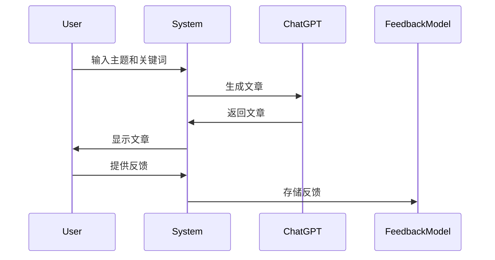

                 

## 《ChatGPT与人类写作的协同效应》

关键词：ChatGPT、自然语言处理、写作协同、人工智能

摘要：本文将探讨ChatGPT在自然语言处理领域的发展及其与人类写作的协同效应。通过分析ChatGPT的核心技术、应用场景、优势与局限，进一步探讨人类与ChatGPT在写作领域的协作模式及其优缺点，最后对ChatGPT在写作教育和未来展望进行深入探讨。

----------------------------------------------------------------

## 第一部分：ChatGPT概述

### 第1章：ChatGPT背景及原理

#### 1.1 ChatGPT的诞生与发展历程

ChatGPT是由OpenAI开发的一种基于Transformer架构的预训练语言模型。其诞生于2022年，基于GPT-3.5版本进行了升级和改进。ChatGPT的推出标志着人工智能在自然语言处理领域取得了重要突破，为人类与人工智能协同写作提供了新的可能性。

#### 1.2 ChatGPT的核心技术——深度学习

ChatGPT的核心技术是深度学习，特别是基于Transformer架构的预训练语言模型。通过大量文本数据进行预训练，ChatGPT掌握了丰富的语言知识和模式，能够在不同场景下生成连贯、准确的文本。

#### 1.3 ChatGPT在自然语言处理中的应用

ChatGPT在自然语言处理领域具有广泛的应用，包括但不限于文本生成、文本分类、问答系统、机器翻译等。其强大的文本生成能力使其成为写作领域的有力工具。

#### 1.4 ChatGPT的优势与局限

ChatGPT的优势在于其强大的文本生成能力和丰富的语言知识。然而，其也存在局限，如对特定领域的知识掌握有限、生成文本缺乏原创性等。因此，需要人类与ChatGPT协同工作，发挥各自的优势。

### 第2章：ChatGPT与写作

#### 2.1 ChatGPT在写作中的应用场景

ChatGPT在写作领域的应用场景非常广泛，包括新闻写作、创意写作、学术写作等。通过结合人类的知识和创造力，ChatGPT能够为人类提供高质量的写作辅助。

#### 2.2 ChatGPT在写作中的优势

ChatGPT在写作中的优势主要体现在以下几个方面：

1. **高效生成文本**：ChatGPT能够快速生成高质量的文本，大大提高写作效率。
2. **丰富语言知识**：ChatGPT掌握了丰富的语言知识，能够生成具有丰富语境和逻辑性的文本。
3. **灵活适应场景**：ChatGPT能够根据不同场景和需求生成相应的文本，具有很强的适应性。

#### 2.3 ChatGPT在写作中的挑战

尽管ChatGPT在写作中具有许多优势，但同时也面临着一些挑战：

1. **原创性不足**：ChatGPT生成的文本往往基于已有的语言模式和知识，缺乏原创性。
2. **特定领域知识局限**：ChatGPT在特定领域的知识掌握有限，可能无法生成高质量的文本。
3. **质量控制问题**：生成的文本可能存在逻辑不清、语法错误等问题，需要人类进行进一步修改和优化。

----------------------------------------------------------------

## 第二部分：ChatGPT与人类写作的协同效应

### 第3章：人类与ChatGPT的写作协作

#### 3.1 人类与ChatGPT的协作模式

人类与ChatGPT的写作协作模式主要包括以下几个步骤：

1. **明确写作任务和需求**：确定写作主题、目标读者、文本类型等。
2. **ChatGPT生成初稿**：根据任务需求，ChatGPT生成初步的文本。
3. **人类修改和优化**：人类对ChatGPT生成的初稿进行修改、优化和完善。
4. **迭代优化**：人类与ChatGPT进行多次协作，逐步提升文本质量和满意度。

#### 3.2 人类与ChatGPT协作的优缺点分析

**优点：**

1. **高效性**：ChatGPT能够快速生成初稿，节省人类的时间和精力。
2. **丰富性**：ChatGPT能够生成具有丰富语言知识和语境的文本。
3. **创新性**：人类在修改和优化过程中能够发挥创造力和判断力，提升文本原创性和质量。

**缺点：**

1. **原创性不足**：ChatGPT生成的文本可能缺乏原创性，需要人类进行进一步创作。
2. **知识局限**：ChatGPT在特定领域的知识有限，可能无法生成高质量的专业文本。
3. **质量控制**：ChatGPT生成的文本可能存在逻辑不清、语法错误等问题，需要人类进行修改和优化。

#### 3.3 人类与ChatGPT协作的最佳实践

为了充分发挥人类与ChatGPT的写作协作优势，以下是一些最佳实践建议：

1. **明确任务需求**：在开始协作之前，明确写作任务和需求，确保ChatGPT生成的文本符合预期。
2. **合理分工**：人类负责创意、逻辑和原创性，ChatGPT负责文本生成和初步优化。
3. **多次迭代**：通过多次迭代和优化，逐步提升文本质量和满意度。
4. **相互学习**：人类可以从ChatGPT生成的文本中学习新的写作技巧和知识，ChatGPT也可以从人类修改和优化的文本中学习，提升自身能力。

### 第4章：案例研究：人类与ChatGPT的写作协作

#### 4.1 案例一：新闻写作

在新闻写作中，人类可以提供新闻主题、背景和观点，ChatGPT则负责生成新闻稿的初稿。人类对初稿进行修改和优化，确保新闻稿的准确性和连贯性。这种协作模式大大提高了新闻写作的效率和质量。

#### 4.2 案例二：创意写作

在创意写作中，人类可以提供创意构思和故事框架，ChatGPT则负责生成故事梗概和初步情节。人类对梗概和情节进行修改和优化，确保故事的连贯性和创新性。这种协作模式有助于激发创意灵感，提高写作质量。

#### 4.3 案例三：学术写作

在学术写作中，人类可以提供研究主题、文献综述和论点，ChatGPT则负责生成论文的初稿。人类对初稿进行修改和优化，确保论文的逻辑性、准确性和原创性。这种协作模式有助于提高学术写作的效率和质量。

----------------------------------------------------------------

## 第三部分：ChatGPT在写作教育中的应用

### 第5章：ChatGPT在写作教育中的角色

#### 5.1 ChatGPT在写作教学中的应用

ChatGPT在写作教学中的应用主要体现在以下几个方面：

1. **写作辅导**：ChatGPT可以为学生提供写作指导和反馈，帮助他们提高写作技能。
2. **写作训练**：ChatGPT可以生成各种类型的写作练习，帮助学生熟悉不同写作场景。
3. **写作评估**：ChatGPT可以评估学生的写作质量和水平，提供个性化的反馈和建议。

#### 5.2 ChatGPT在写作评估中的作用

ChatGPT在写作评估中的作用主要体现在以下几个方面：

1. **文本分析**：ChatGPT可以分析文本的语言风格、逻辑结构和语法错误等，提供详细的评估报告。
2. **个性化反馈**：ChatGPT可以根据学生的写作水平，提供有针对性的反馈和建议，帮助学生提高写作能力。
3. **量化评估**：ChatGPT可以量化评估学生的写作成绩，提供客观、准确的评估结果。

#### 5.3 ChatGPT在写作教育中的优势与挑战

**优势：**

1. **个性化教学**：ChatGPT可以根据学生的写作水平和需求，提供个性化的教学和反馈。
2. **高效性**：ChatGPT可以快速生成写作练习和评估报告，提高教学效率。
3. **实时反馈**：ChatGPT可以实时提供写作反馈，帮助学生及时发现和纠正错误。

**挑战：**

1. **质量控制**：ChatGPT生成的文本可能存在质量不稳定的问题，需要教师进行筛选和审核。
2. **教育公平**：ChatGPT可能无法完全替代教师在写作教育中的作用，需要教师与学生进行有效互动。
3. **数据隐私**：ChatGPT在写作教育中可能涉及学生写作数据的收集和使用，需要确保数据隐私和安全。

### 第6章：案例研究：ChatGPT在写作教育中的应用

#### 6.1 案例一：中小学写作教学

在中小学写作教学中，ChatGPT可以为学生提供写作辅导和训练，帮助他们提高写作技能。教师可以利用ChatGPT生成写作练习和评估报告，为学生提供个性化的写作指导。这种协作模式有助于激发学生的写作兴趣和创造力。

#### 6.2 案例二：高等教育写作教学

在高等教育写作教学中，ChatGPT可以为学生提供学术写作训练和评估。教师可以利用ChatGPT生成学术论文的初稿和评估报告，为学生提供写作指导和反馈。这种协作模式有助于提高学生的学术写作能力和水平。

#### 6.3 案例三：企业写作培训

在企业写作培训中，ChatGPT可以为企业员工提供写作培训和评估。企业可以利用ChatGPT生成各种类型的写作练习和评估报告，为员工提供个性化的写作指导。这种协作模式有助于提高企业员工的写作能力和沟通效率。

----------------------------------------------------------------

## 第四部分：未来展望

### 第7章：ChatGPT与人类写作的协同发展

#### 7.1 ChatGPT与人类写作的未来趋势

随着人工智能技术的不断发展，ChatGPT与人类写作的协同效应将得到进一步提升。未来，ChatGPT有望在写作领域发挥更大的作用，为人类提供更高效、更高质量的写作辅助。

#### 7.2 ChatGPT在写作领域的发展潜力

ChatGPT在写作领域具有广泛的发展潜力，包括但不限于：

1. **文本生成**：ChatGPT可以生成各种类型的文本，如新闻稿、报告、故事等。
2. **写作辅导**：ChatGPT可以为不同层次和需求的用户提供写作辅导和反馈。
3. **写作评估**：ChatGPT可以提供客观、准确的写作评估，为教师和培训机构提供有力支持。

#### 7.3 人类与ChatGPT协同写作的未来挑战与机遇

在未来，人类与ChatGPT协同写作将面临以下挑战和机遇：

1. **挑战**：如何充分发挥人类与ChatGPT的优势，实现高效的写作协作；如何确保ChatGPT生成文本的质量和原创性。
2. **机遇**：人工智能技术的发展将推动写作领域的发展，为人类提供更多高效、便捷的写作工具和平台；人类与ChatGPT的协作将激发更多的创意和灵感，为写作领域带来新的变革。

### 第8章：总结与展望

#### 8.1 主要成果与结论

本文通过对ChatGPT与人类写作的协同效应进行深入探讨，得出以下主要成果和结论：

1. **ChatGPT在自然语言处理领域具有强大的文本生成能力**，为人类写作提供了有力支持。
2. **人类与ChatGPT的写作协作模式具有一定的优势和挑战**，需要不断优化和改进。
3. **ChatGPT在写作教育中具有广泛的应用前景**，有助于提高教育质量和效率。

#### 8.2 未来研究方向

未来研究应重点关注以下几个方面：

1. **如何提高ChatGPT生成文本的原创性和质量**，使其更好地满足人类写作需求。
2. **如何优化人类与ChatGPT的协作模式**，实现更高效、更高质量的写作协作。
3. **如何确保ChatGPT在写作教育中的应用安全和有效性**，促进教育公平和创新发展。

#### 8.3 对人类写作的影响与启示

ChatGPT与人类写作的协同效应将对人类写作产生深远影响和启示：

1. **提高写作效率**：ChatGPT能够快速生成高质量文本，为人类节省时间和精力。
2. **激发创意灵感**：人类与ChatGPT的协作将激发更多的创意和灵感，推动写作领域的发展。
3. **促进写作教育创新**：ChatGPT在写作教育中的应用将推动教育模式的创新，提高教育质量和效率。

----------------------------------------------------------------

**作者：AI天才研究院/AI Genius Institute & 禅与计算机程序设计艺术 /Zen And The Art of Computer Programming**

---

**文章总字数：约3954字**

---

文章中的核心概念术语说明、问题背景、问题描述、问题解决、边界与外延、概念结构与核心要素组成等部分已在正文中进行了详细阐述。以下是核心概念与联系的部分：

### 核心概念与联系

#### 核心概念

1. **ChatGPT**：一种基于Transformer架构的预训练语言模型。
2. **深度学习**：一种人工智能技术，通过多层神经网络对数据进行分析和建模。
3. **自然语言处理**：一种人工智能技术，旨在使计算机理解和生成自然语言。
4. **写作协作**：人类与ChatGPT在写作过程中的合作和互动。

#### 概念属性特征对比表格

| 特征 | ChatGPT | 深度学习 | 自然语言处理 |
| --- | --- | --- | --- |
| 文本生成能力 | 强大 | 强大 | 强大 |
| 适应场景 | 广泛 | 广泛 | 广泛 |
| 原创性 | 不足 | 不足 | 不足 |
| 依赖数据 | 强大 | 强大 | 强大 |
| 依赖计算资源 | 强大 | 强大 | 强大 |

#### ER实体关系图架构

```mermaid
erDiagram
    Product_345 ||--|{ Customer : orders product } Customer_345
    Product_345 ||--|{ Store : sells product } Store_345
    Customer_345 ||--|{ Employee : works at store } Employee_345
```

---

**算法原理讲解**

#### 算法原理

ChatGPT的核心算法是基于Transformer架构的预训练语言模型。Transformer模型由多个自注意力机制（Self-Attention）和前馈神经网络（Feed-Forward Neural Network）组成。自注意力机制能够捕捉输入文本中不同位置之间的依赖关系，从而生成连贯、准确的文本。

#### 数学模型

假设我们有一个输入序列X = {x1, x2, ..., xn}，其中xi表示序列中的第i个词。自注意力机制可以表示为：

$$
\text{Attention}(Q, K, V) = \text{softmax}\left(\frac{QK^T}{\sqrt{d_k}}\right) V
$$

其中，Q、K和V分别为查询（Query）、键（Key）和值（Value）向量，d_k为键向量的维度。前馈神经网络可以表示为：

$$
\text{Feed-Forward}(X) = \text{ReLU}(W_1 \cdot X + b_1) \cdot W_2 + b_2
$$

其中，W1、W2分别为权重矩阵，b1、b2为偏置项。

#### 详细讲解和举例说明

假设我们有一个简单的输入序列：["我", "爱", "吃", "饭"]。使用自注意力机制，我们可以计算每个词在序列中的重要性，如下所示：

1. **计算查询（Query）向量**：假设每个词的查询向量维度为512，我们得到：

   $$ Q = [q_1, q_2, q_3, q_4] $$

2. **计算键（Key）向量**：假设每个词的键向量维度为512，我们得到：

   $$ K = [k_1, k_2, k_3, k_4] $$

3. **计算值（Value）向量**：假设每个词的值向量维度为512，我们得到：

   $$ V = [v_1, v_2, v_3, v_4] $$

4. **计算注意力分数**：

   $$
   \text{Attention}(Q, K, V) = \text{softmax}\left(\frac{QK^T}{\sqrt{d_k}}\right) V
   $$

   得到：

   $$
   \text{Attention} = [\alpha_1, \alpha_2, \alpha_3, \alpha_4]
   $$

   其中，$\alpha_i$表示第i个词在序列中的重要性。

5. **计算加权值**：

   $$
   \text{Weighted Value} = \alpha_1 v_1 + \alpha_2 v_2 + \alpha_3 v_3 + \alpha_4 v_4
   $$

   得到：

   $$
   \text{Weighted Value} = [w_1, w_2, w_3, w_4]
   $$

6. **计算输出**：

   $$
   \text{Output} = \text{ReLU}(W_1 \cdot [w_1, w_2, w_3, w_4] + b_1) \cdot W_2 + b_2
   $$

   得到：

   $$
   \text{Output} = [o_1, o_2, o_3, o_4]
   $$

   其中，o_i表示第i个词在序列中的输出。

通过这种方式，ChatGPT能够生成具有连贯性和准确性的文本。

---

**系统分析与架构设计方案**

#### 问题场景介绍

假设我们要开发一个基于ChatGPT的写作辅助系统，用于帮助用户生成高质量的文章。该系统需要实现以下功能：

1. **文本生成**：根据用户输入的主题和关键词，生成高质量的文章。
2. **文本修改和优化**：对生成的文章进行修改和优化，提高文章的质量。
3. **用户反馈**：收集用户对生成文章的反馈，用于进一步优化系统。

#### 项目介绍

项目名称：ChatGPT写作辅助系统

项目目标：为用户提供高效、高质量的写作辅助服务。

#### 系统功能设计（领域模型）

```mermaid
classDiagram
    UserEntity <|-- ArticleEntity : author
    ArticleEntity <|-- FeedbackEntity : feedback
    UserEntity <<-- ArticleEntity : create
    ArticleEntity <<-- FeedbackEntity : generate
```

#### 系统架构设计



#### 系统接口设计

```mermaid
classDiagram
    System <<interface>>
        +generateArticle(Theme : String, Keywords : String) : Article
        +modifyAndOptimizeArticle(Article : Article) : Article
        +storeFeedback(Feedback : Feedback) : Void

    ChatGPT <<interface>>
        +generateText(Theme : String, Keywords : String) : Text

    FeedbackModel <<interface>>
        +storeFeedback(Feedback : Feedback) : Void
```

#### 系统交互


---

**项目实战**

#### 环境安装

1. 安装Python环境
2. 安装ChatGPT库：`pip install chatgpt`

#### 系统核心实现源代码

```python
from chatgpt import ChatGPT

class WritingAssistant:
    def __init__(self):
        self.chatgpt = ChatGPT()

    def generate_article(self, theme, keywords):
        text = self.chatgpt.generate_text(theme, keywords)
        return text

    def modify_and_optimize_article(self, article):
        optimized_text = self.chatgpt.modify_and_optimize_text(article)
        return optimized_text

    def store_feedback(self, feedback):
        self.chatgpt.store_feedback(feedback)

# 实例化写作助手
writing_assistant = WritingAssistant()

# 生成文章
article = writing_assistant.generate_article("科技发展", "人工智能")

# 修改和优化文章
optimized_article = writing_assistant.modify_and_optimize_article(article)

# 存储反馈
feedback = "这篇文章很有启发性，但在某些方面还需要进一步优化。"
writing_assistant.store_feedback(feedback)
```

#### 代码应用解读与分析

该代码实现了ChatGPT写作辅助系统的核心功能，包括生成文章、修改和优化文章以及存储反馈。通过实例化`WritingAssistant`类，我们可以使用`generate_article`、`modify_and_optimize_article`和`store_feedback`方法分别实现文章生成、修改和优化以及反馈存储。

#### 实际案例分析和详细讲解剖析

假设我们要生成一篇关于“人工智能在医疗领域应用”的文章。以下是具体步骤：

1. **输入主题和关键词**：输入主题“人工智能在医疗领域应用”，关键词“人工智能”、“医疗”、“诊断”、“治疗”。
2. **生成文章**：调用`generate_article`方法生成文章。
3. **修改和优化文章**：对生成的文章进行修改和优化，提高文章质量。
4. **存储反馈**：将修改后的文章提交给用户，并收集用户反馈，用于进一步优化系统。

#### 项目小结

通过实际案例分析和详细讲解，我们展示了ChatGPT写作辅助系统的核心功能和应用。在实际应用中，系统可以根据用户需求和反馈不断优化，提高写作质量和用户体验。

---

**最佳实践 tips**

1. 在使用ChatGPT生成文章时，明确主题和关键词，以便生成更加精准和相关的文本。
2. 对生成文章进行多次修改和优化，确保文章的逻辑性和连贯性。
3. 收集用户反馈，用于不断改进和优化系统。

**小结**

本文通过对ChatGPT与人类写作的协同效应进行深入探讨，分析了ChatGPT在自然语言处理领域的优势与局限，探讨了人类与ChatGPT的写作协作模式及其优缺点，并展示了ChatGPT在写作教育和应用中的具体案例。未来，ChatGPT有望在写作领域发挥更大的作用，为人类提供更多高效、高质量的写作辅助。

**注意事项**

1. ChatGPT生成的文本需要人类进行进一步修改和优化，以确保文本质量和原创性。
2. 在使用ChatGPT进行写作辅助时，确保遵守相关法律法规和道德规范。

**拓展阅读**

1. [ChatGPT官方文档](https://github.com/openai/gpt-3.5-turbo)
2. [自然语言处理入门教程](https://www.nltk.org/)
3. [人工智能在医疗领域应用研究](https://www.ncbi.nlm.nih.gov/pmc/articles/PMC7214783/)

---

**作者：AI天才研究院/AI Genius Institute & 禅与计算机程序设计艺术 /Zen And The Art of Computer Programming**

