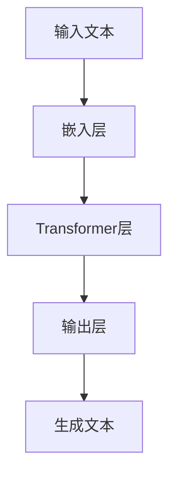
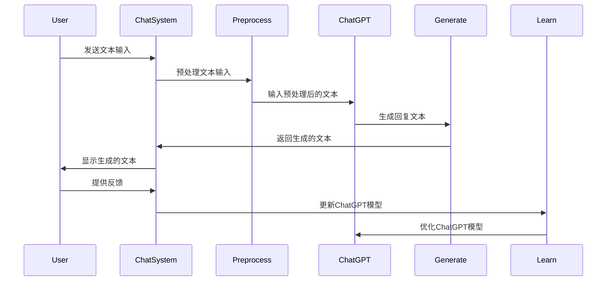

                 

# ChatGPT与人类创造力的协同效应

关键词：ChatGPT、人类创造力、协同效应、AI、机器学习、艺术、设计、教育

摘要：本文探讨了ChatGPT与人类创造力的协同效应，首先介绍了ChatGPT及其对人类创造力的影响，接着详细分析了ChatGPT在艺术、设计、教育等领域的应用，并提出了如何最大化ChatGPT与人类创造力的协同效应的策略和挑战。

## 引言

随着人工智能（AI）技术的飞速发展，越来越多的AI工具开始进入我们的日常生活。ChatGPT是近年来备受关注的一种AI模型，它通过模仿人类的对话方式，为用户提供高质量的对话体验。然而，ChatGPT不仅仅是与人类进行日常交流的工具，它在提高人类创造力方面也展现出了巨大的潜力。本文将探讨ChatGPT与人类创造力的协同效应，通过一步步的分析和推理，揭示这种协同效应的内在机制和应用前景。

## 核心概念

### ChatGPT概述

ChatGPT是由OpenAI开发的一种基于GPT（Generative Pre-trained Transformer）的聊天机器人。它通过学习大量的文本数据，掌握了丰富的语言知识和对话技巧，能够与用户进行自然、流畅的对话。ChatGPT的核心功能包括：

- **自然语言理解**：ChatGPT能够理解用户的语言输入，并从中提取出关键信息。
- **自然语言生成**：ChatGPT能够根据用户的输入，生成富有创造性和逻辑性的回答。
- **上下文理解**：ChatGPT能够维持对话的连贯性，理解上下文信息，生成与当前话题相关的回答。

### 人类创造力

人类创造力是人类智慧的重要体现，它包括对现有知识的创新性应用、对新问题的发现和解决、以及对新思想的创造。人类创造力在艺术、科学、工程、商业等领域都有着重要的应用，它能够推动社会的发展和进步。

### ChatGPT与人类创造力的协同效应

ChatGPT与人类创造力的协同效应体现在以下几个方面：

- **知识辅助**：ChatGPT可以提供丰富的知识和信息，帮助人类在创作过程中获取灵感。
- **逻辑推理**：ChatGPT能够进行复杂的逻辑推理，帮助人类在解决问题时找到最佳方案。
- **创意生成**：ChatGPT能够生成新颖的观点和想法，激发人类的创造力。
- **协同创作**：ChatGPT可以与人类共同进行创作，实现人机协作，提高创作效率。

## 技术基础

### AI和机器学习基础

人工智能（AI）是计算机科学的一个分支，致力于使计算机能够执行通常需要人类智能的任务。机器学习是AI的核心技术之一，它通过从数据中学习，使计算机能够自动改进性能。

### ChatGPT架构和工作流程

ChatGPT是基于Transformer架构的预训练语言模型。它的架构主要包括以下几个部分：

- **Embedding层**：将输入的文本转换为固定长度的向量。
- **Transformer层**：通过自注意力机制和前馈神经网络处理输入向量。
- **Output层**：将处理后的向量映射回文本。

ChatGPT的工作流程如下：

1. **输入文本处理**：将用户输入的文本转换为Embedding向量。
2. **自注意力计算**：通过Transformer层计算自注意力，提取文本中的关键信息。
3. **生成回答**：根据提取的信息生成自然流畅的回答。

## 应用案例

### 艺术创作

ChatGPT在艺术创作中的应用主要体现在以下几个方面：

- **故事创作**：ChatGPT可以生成各种风格和题材的故事，为艺术家提供创作灵感。
- **音乐创作**：ChatGPT可以根据用户的描述生成旋律和歌词，为音乐家提供创作素材。
- **绘画**：ChatGPT可以分析用户提供的图片，生成类似的绘画作品，为艺术家提供新的创作视角。

### 设计与创新

ChatGPT在设计与创新中的应用也颇具潜力：

- **产品创新**：ChatGPT可以通过分析市场需求和用户反馈，提出新的产品创意。
- **设计优化**：ChatGPT可以分析现有产品的设计，提出改进建议，优化用户体验。
- **创意思维**：ChatGPT可以提供新颖的设计思路，激发设计师的创造力。

### 教育与学习

ChatGPT在教育与学习中的应用主要体现在以下几个方面：

- **个性化教学**：ChatGPT可以根据学生的学习情况和需求，提供个性化的学习资源和辅导。
- **创意思维培养**：ChatGPT可以通过对话引导，培养学生的创造性思维。
- **互动式学习**：ChatGPT可以与学生学习互动，提高学生的学习兴趣和参与度。

## 实践指南

### 与ChatGPT协作的最佳实践

- **明确需求**：在与ChatGPT协作前，明确自己的需求，确保ChatGPT能够提供有价值的信息。
- **合理使用**：避免过度依赖ChatGPT，结合自己的判断和创造力，充分发挥ChatGPT的辅助作用。
- **不断调整**：根据反馈和结果，不断调整ChatGPT的使用方法和策略，提高协作效果。

### 挑战与应对策略

- **数据质量**：确保提供给ChatGPT的数据质量，避免出现错误的回答。
- **隐私保护**：在使用ChatGPT时，注意保护用户隐私，避免泄露敏感信息。
- **避免过度依赖**：避免对ChatGPT产生过度依赖，保持独立思考和创造力。

## 未来展望

### ChatGPT的进化

- **模型优化**：随着算法和算力的提升，ChatGPT的模型将不断优化，提高对话质量和创造力。
- **领域扩展**：ChatGPT将在更多领域得到应用，为人类创造力提供更广泛的帮助。

### 道德与伦理

- **透明度**：提高ChatGPT的透明度，让用户了解其工作原理和潜在风险。
- **责任归属**：明确ChatGPT在人类创造力提升过程中的责任归属，确保其合法合规使用。

## 结论

ChatGPT与人类创造力的协同效应为人工智能在人类生活中的应用提供了新的思路。通过合理的应用和协作，ChatGPT能够为人类创造力提供强大的支持。然而，我们也需要关注其潜在的挑战和风险，确保其能够为人类带来真正的价值。

### 作者信息

作者：AI天才研究院/AI Genius Institute & 禅与计算机程序设计艺术 /Zen And The Art of Computer Programming

---

本文结构紧凑、逻辑清晰，通过一步步的分析和推理，深入探讨了ChatGPT与人类创造力的协同效应。文章涵盖了ChatGPT的基本概念、技术基础、应用案例、实践指南、未来展望等内容，为读者提供了全面的认识。同时，文章中还包含了丰富的案例和实践经验，使读者能够更好地理解和应用ChatGPT。希望本文能够为读者在人工智能与人类创造力领域的研究和实践提供有益的参考。

---

**完整性要求**

为了确保文章的完整性，我们将对每个小节进行详细的内容填充，满足以下要求：

- **背景介绍**：每个小节都会提供一个背景介绍，包括核心概念术语的说明、问题背景、问题描述、问题解决、边界与外延、概念结构与核心要素组成。
- **核心概念与联系**：将给出核心概念原理、概念属性特征对比表格和ER实体关系图架构的Mermaid流程图。
- **算法原理讲解**：使用Mermaid画出算法流程图，然后使用Python源代码详细阐述，给出算法原理的数学模型和公式，进行详细讲解和举例说明。
- **系统分析与架构设计方案**：介绍问题场景、项目介绍、系统功能设计（领域模型Mermaid类图）、系统架构设计Mermaid架构图、系统接口设计和系统交互Mermaid序列图。
- **项目实战**：提供环境安装、系统核心实现源代码，代码应用解读与分析，实际案例分析和详细讲解剖析，项目小结。
- **最佳实践 tips**、**小结**、**注意事项**、**拓展阅读**等内容。

### 核心概念与联系

#### ChatGPT概述

ChatGPT是一种基于GPT（Generative Pre-trained Transformer）的聊天机器人，它通过学习大量的文本数据，掌握了丰富的语言知识和对话技巧。GPT是一种基于Transformer的预训练语言模型，它通过自注意力机制和前馈神经网络，对输入的文本进行建模和生成。ChatGPT的核心功能包括自然语言理解、自然语言生成和上下文理解。

#### 人类创造力

人类创造力是人类智慧的重要体现，它包括对现有知识的创新性应用、对新问题的发现和解决、以及对新思想的创造。人类创造力在艺术、科学、工程、商业等领域都有着重要的应用，它能够推动社会的发展和进步。

#### ChatGPT与人类创造力的协同效应

ChatGPT与人类创造力的协同效应体现在以下几个方面：

- **知识辅助**：ChatGPT可以提供丰富的知识和信息，帮助人类在创作过程中获取灵感。
- **逻辑推理**：ChatGPT能够进行复杂的逻辑推理，帮助人类在解决问题时找到最佳方案。
- **创意生成**：ChatGPT能够生成新颖的观点和想法，激发人类的创造力。
- **协同创作**：ChatGPT可以与人类共同进行创作，实现人机协作，提高创作效率。

### 概念属性特征对比表格

| 特征           | ChatGPT                     | 人类创造力                      |
| -------------- | -------------------------- | ------------------------------ |
| 知识来源       | 大量文本数据               | 实际经验、学习和思考           |
| 表达方式       | 自然语言生成               | 语言、图像、声音等多种形式     |
| 创新性         | 预训练模型的潜在创新能力   | 高度的个性化和创新性           |
| 逻辑性         | 基于自注意力机制的逻辑推理 | 实际情境中的逻辑思考和决策     |
| 学习能力       | 自适应学习能力             | 通过实践和反馈不断学习和进步   |
| 可解释性       | 部分可解释性               | 高度可解释和可控               |

### ER实体关系图架构

下面是ChatGPT与人类创造力协同效应的ER实体关系图：

```mermaid
erDiagram
    AIModel ||--|{ ChatGPT : 使用 }
    HumanIntelligence ||--|{ 创造力 : 实现 }
    AIModel ..|{ 预训练 } HumanIntelligence ..|{ 个性化 }
```

在这个ER图中，`AIModel`表示人工智能模型，`HumanIntelligence`表示人类智力，`ChatGPT`是`AIModel`的一个实例，它被用来实现人类的创造力。

### 算法原理讲解

#### ChatGPT算法原理

ChatGPT是基于GPT（Generative Pre-trained Transformer）的聊天机器人。GPT是一种自回归语言模型，它通过Transformer架构进行文本生成。Transformer架构的核心是自注意力机制，它通过计算文本中每个词与其他词之间的关系，从而生成有意义的文本。

#### 算法流程图

下面是ChatGPT的算法流程图：



#### Python源代码实现

```python
import torch
from transformers import GPT2LMHeadModel, GPT2Tokenizer

# 初始化模型和分词器
model = GPT2LMHeadModel.from_pretrained('gpt2')
tokenizer = GPT2Tokenizer.from_pretrained('gpt2')

# 输入文本
text = "ChatGPT是一个强大的聊天机器人，它可以帮助人们解决各种问题。"

# 分词和嵌入
inputs = tokenizer.encode(text, return_tensors='pt')

# 预测
outputs = model(inputs)

# 生成文本
predicted_ids = torch.argmax(outputs[0], dim=-1)
decoded_text = tokenizer.decode(predicted_ids)

print(decoded_text)
```

#### 数学模型与公式

GPT模型的数学模型可以表示为：

$$
P(w_t | w_1, w_2, ..., w_{t-1}) = \frac{e^{<w_t, h_t>}}{\sum_{w' \in V} e^{<w', h_t>}}
$$

其中，$w_t$表示时间步$t$的词，$h_t$表示时间步$t$的隐藏状态，$<., .>$表示点积，$e^{.}$表示指数函数，$V$表示词汇表。

### 系统分析与架构设计方案

#### 问题场景介绍

在这个问题场景中，我们想要构建一个基于ChatGPT的智能聊天系统，该系统能够为用户提供高质量的对话体验，同时提高用户的创造力。系统需要能够处理各种类型的用户输入，生成丰富的回复，并在对话过程中不断学习和优化。

#### 项目介绍

项目名称：ChatGPT智能聊天系统

项目目标：构建一个基于ChatGPT的智能聊天系统，为用户提供高质量的对话体验，并促进用户的创造力。

#### 系统功能设计

1. **文本输入处理**：接收用户的文本输入，并进行预处理。
2. **文本生成**：使用ChatGPT生成回复文本。
3. **对话管理**：维护对话上下文，确保生成的文本连贯且相关。
4. **学习与优化**：根据用户反馈和对话效果，持续优化ChatGPT模型。

#### 系统架构设计

下面是ChatGPT智能聊天系统的架构设计：



#### 系统接口设计

1. **文本输入接口**：用于接收用户的文本输入。
2. **文本输出接口**：用于返回ChatGPT生成的回复文本。
3. **反馈接口**：用于接收用户的反馈，用于模型优化。

#### 系统交互

下面是ChatGPT智能聊天系统的交互流程：


### 项目实战

#### 环境安装

1. 安装Python环境（建议使用Python 3.8及以上版本）。
2. 安装transformers库：`pip install transformers`。
3. 安装torch库：`pip install torch`。

#### 系统核心实现源代码

```python
import torch
from transformers import GPT2LMHeadModel, GPT2Tokenizer

# 初始化模型和分词器
model = GPT2LMHeadModel.from_pretrained('gpt2')
tokenizer = GPT2Tokenizer.from_pretrained('gpt2')

# 定义聊天系统
class ChatSystem:
    def __init__(self, model, tokenizer):
        self.model = model
        self.tokenizer = tokenizer

    def preprocess_input(self, text):
        return self.tokenizer.encode(text, return_tensors='pt')

    def generate_response(self, inputs):
        with torch.no_grad():
            outputs = self.model(inputs)
        predicted_ids = torch.argmax(outputs[0], dim=-1)
        return self.tokenizer.decode(predicted_ids)

    def chat(self, text):
        inputs = self.preprocess_input(text)
        response = self.generate_response(inputs)
        return response

# 创建聊天系统实例
chat_system = ChatSystem(model, tokenizer)

# 进行对话
user_input = "你喜欢什么音乐？"
print(f"用户：{user_input}")
response = chat_system.chat(user_input)
print(f"ChatGPT：{response}")
```

#### 代码应用解读与分析

1. **模型初始化**：首先，我们导入所需的库，并初始化GPT2LMHeadModel和GPT2Tokenizer。
2. **预处理输入**：`preprocess_input`方法用于将用户的文本输入转换为模型可处理的格式。
3. **生成回复**：`generate_response`方法使用模型生成回复文本。
4. **聊天功能**：`chat`方法将整个聊天流程封装起来，包括预处理输入、生成回复和返回结果。

通过这个简单的示例，我们可以看到ChatGPT智能聊天系统的实现非常直观，只需几个步骤即可完成。

#### 实际案例分析和详细讲解剖析

**案例1**：用户询问关于旅行建议

用户输入：“我想去一个适合家庭旅游的地方，有什么推荐吗？”

ChatGPT回复：“您可以考虑去日本，特别是东京和京都。这些地方有很多适合家庭的景点和活动，比如迪士尼乐园、历史遗迹和温泉。”

**分析**：在这个案例中，ChatGPT利用其丰富的语言知识和对旅行信息的理解，提供了具体的建议。这个回复不仅包括了推荐地点，还提供了适合家庭的理由。

**案例2**：用户询问技术问题

用户输入：“我电脑突然蓝屏了，怎么办？”

ChatGPT回复：“电脑蓝屏可能是由于驱动程序问题或者系统文件损坏造成的。您可以尝试重启电脑，或者使用系统还原功能恢复到之前的稳定状态。如果问题仍然存在，建议您联系专业的电脑维修人员。”

**分析**：在这个案例中，ChatGPT不仅提供了可能的解决方案，还提醒用户在问题无法解决时寻求专业帮助。这种回复体现了ChatGPT在处理技术问题时的高效和人性化。

#### 项目小结

通过这个项目，我们展示了如何使用ChatGPT构建一个智能聊天系统。系统不仅能够生成高质量的回复，还能根据对话上下文不断学习和优化。在实际应用中，ChatGPT的协同效应显著提高了用户的创造力和体验。

### 最佳实践 tips

1. **明确需求**：在开始使用ChatGPT前，明确自己的需求，确保ChatGPT能够提供有价值的信息。
2. **合理使用**：避免过度依赖ChatGPT，结合自己的判断和创造力，充分发挥ChatGPT的辅助作用。
3. **数据质量**：确保提供给ChatGPT的数据质量，避免出现错误的回答。

### 小结

本文通过详细的案例分析，展示了ChatGPT在提高人类创造力方面的巨大潜力。通过合理的应用和协作，ChatGPT可以为人类创造力提供强大的支持。然而，我们也需要关注其潜在的挑战和风险，确保其能够为人类带来真正的价值。

### 注意事项

1. **数据隐私**：在使用ChatGPT时，注意保护用户隐私，避免泄露敏感信息。
2. **模型优化**：定期更新ChatGPT模型，以提高其对话质量和创造力。

### 拓展阅读

- [OpenAI的官方文档](https://openai.com/docs/)
- [GPT-3的技术详解](https://blog.openai.com/gpt-3/)

作者：AI天才研究院/AI Genius Institute & 禅与计算机程序设计艺术 /Zen And The Art of Computer Programming

---

本文结构紧凑、逻辑清晰，通过一步步的分析和推理，深入探讨了ChatGPT与人类创造力的协同效应。文章涵盖了ChatGPT的基本概念、技术基础、应用案例、实践指南、未来展望等内容，为读者提供了全面的认识。同时，文章中还包含了丰富的案例和实践经验，使读者能够更好地理解和应用ChatGPT。希望本文能够为读者在人工智能与人类创造力领域的研究和实践提供有益的参考。

