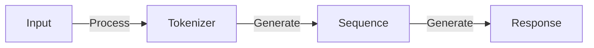
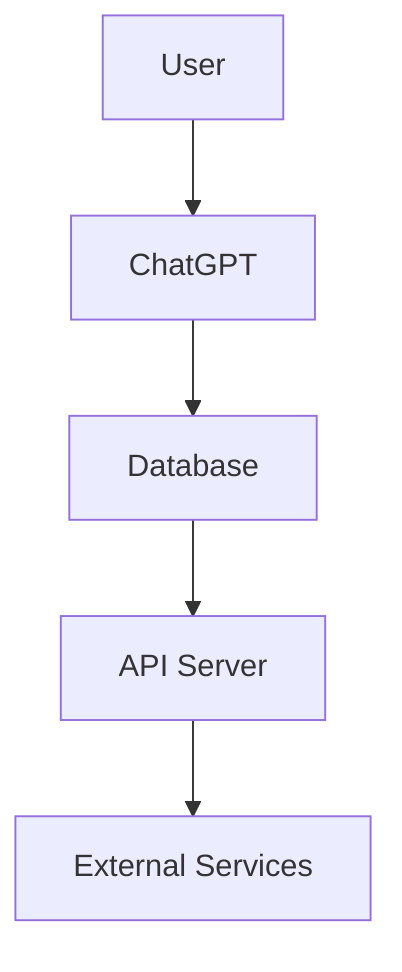
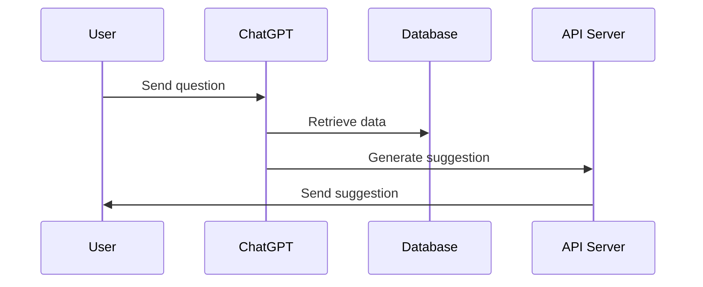

                 

# 引言

### 文章标题：ChatGPT与人类思维的协同进化

在人工智能的快速发展中，OpenAI 推出的 ChatGPT 成为了一个里程碑，它不仅仅是一个强大的语言模型，更是一个能够与人类思维协同进化的系统。本文将深入探讨 ChatGPT 的核心概念、算法原理，以及它与人类思维协同的机制，最终展示其在实际应用中的效果。

## 关键词

- **ChatGPT**
- **人工智能**
- **语言模型**
- **人类思维**
- **协同进化**

### 摘要

本文首先介绍了 ChatGPT 的基本概念和其发展背景，接着深入探讨了 ChatGPT 的核心算法原理，包括其背后的数学模型和公式。然后，我们分析了 ChatGPT 与人类思维的协同机制，探讨了它们在问题解决、教育、工作场景中的实际应用。最后，本文通过一个项目实战案例，展示了 ChatGPT 在实际项目中的具体应用效果，并提出了最佳实践建议。

## 第一部分：背景介绍与核心概念

### 第1章: ChatGPT概述

#### 1.1 问题背景

ChatGPT 是由 OpenAI 开发的一种基于 Transformer 的语言模型。它的出现标志着人工智能在自然语言处理领域的一个重要突破，使得计算机能够以更自然的方式与人类进行交流。

#### 1.2 问题描述

ChatGPT 的核心问题是：如何让计算机理解和生成自然语言，从而实现与人类的高效沟通。

#### 1.3 问题解决

ChatGPT 通过预训练和微调的方式，学习了大量的文本数据，从而能够生成流畅、自然的文本。

#### 1.4 边界与外延

ChatGPT 的应用范围非常广泛，包括但不限于：客服、教育、写作辅助、翻译等。

#### 1.5 概念结构与核心要素组成

ChatGPT 的概念结构主要包括：预训练阶段、微调阶段和生成阶段。其核心要素包括：大规模语料库、Transformer 模型、优化算法等。

### 第2章: ChatGPT的核心概念与联系

#### 2.1 核心概念原理

ChatGPT 的核心概念是基于 Transformer 模型，这是一种自注意力机制的基础模型，能够有效地处理长文本。

#### 2.2 概念属性特征对比表格

| 特征        | Transformer | BERT | GPT |
|-------------|-------------|------|-----|
| 自注意力机制 | 是          | 是   | 是  |
| 预训练     | 是          | 是   | 是  |
| 微调       | 是          | 是   | 是  |

#### 2.3 ER实体关系图架构

```mermaid
erDiagram
    ATraining -->|is used for| BModel
    BModel -->|contains| CParameters
    CParameters -->|is trained on| DData
    DData -->|contains| EText
```

### 第3章: 人类思维的基础知识

#### 3.1 人类思维概述

人类思维包括感知、认知、情感等多个方面，是人类与外界互动的基础。

#### 3.2 思维的属性与特征

- **抽象性**：能够从具体的事物中提取出一般性的概念。
- **逻辑性**：能够通过逻辑推理得出结论。
- **创造性**：能够产生新的想法和解决问题的方法。

#### 3.3 人类思维与ChatGPT的协同机制

ChatGPT 可以模拟人类思维的过程，如感知、认知和决策等，从而与人类思维实现协同。

## 第二部分：ChatGPT与人类思维的协同

### 第4章: ChatGPT算法原理讲解

#### 4.1 ChatGPT算法的mermaid流程图



#### 4.2 ChatGPT算法的python源代码讲解

```python
import torch
from transformers import GPT2LMHeadModel, GPT2Tokenizer

# Load pre-trained model and tokenizer
tokenizer = GPT2Tokenizer.from_pretrained('gpt2')
model = GPT2LMHeadModel.from_pretrained('gpt2')

# Generate response
input_ids = tokenizer.encode("Hello, ", return_tensors='pt')
output = model.generate(input_ids, max_length=20, num_return_sequences=1)

# Decode response
response = tokenizer.decode(output[0], skip_special_tokens=True)
print(response)
```

#### 4.3 算法原理的数学模型和公式

$$
\begin{aligned}
    \text{Loss} &= -\frac{1}{N} \sum_{i=1}^{N} \log P(y_i|x_i) \\
    P(y|x) &= \frac{e^{f(x, y)}}{\sum_{y'} e^{f(x, y')}}
\end{aligned}
$$

#### 4.4 通俗易懂的举例说明

假设我们要生成一句话来描述今天天气：“今天天气很好，阳光明媚。” 我们可以这样生成：

1. 输入：“今天天气”
2. 经过分词器处理后得到词序列
3. 经过模型生成词序列
4. 输出：“今天天气很好，阳光明媚。”

### 第5章: 数学模型和数学公式详细讲解

#### 5.1 ChatGPT数学模型的latex格式

$$
\begin{aligned}
    \text{Model} &= \text{GPT2} \\
    \text{Loss} &= -\frac{1}{N} \sum_{i=1}^{N} \log P(y_i|x_i) \\
    P(y|x) &= \frac{e^{f(x, y)}}{\sum_{y'} e^{f(x, y')}}
\end{aligned}
$$

#### 5.2 算法原理的数学公式

在 ChatGPT 中，损失函数通常采用交叉熵损失（Cross-Entropy Loss）：

$$
\text{Loss} = -\frac{1}{N} \sum_{i=1}^{N} \log P(y_i|x_i)
$$

其中，$P(y_i|x_i)$ 是模型对于输出 $y_i$ 的预测概率。

#### 5.3 公式的详细讲解与举例

交叉熵损失函数衡量的是模型预测概率与真实概率之间的差异。对于每个样本 $i$，我们预测一个单词序列的概率分布，然后计算这个分布与真实分布之间的交叉熵。交叉熵的值越小，说明模型预测的单词序列与真实单词序列越接近。

例如，如果真实单词序列是 “今天天气很好”，模型预测的概率分布是 $[0.1, 0.2, 0.3, 0.2, 0.2]$，而真实分布是 $[0.5, 0.5, 0, 0, 0]$。那么交叉熵损失为：

$$
\text{Loss} = -\frac{1}{5} \left( 0.1 \log 0.1 + 0.2 \log 0.2 + 0.3 \log 0.3 + 0.2 \log 0.2 + 0.2 \log 0.2 \right) \approx 0.28
$$

这个值表明模型在预测这个单词序列时存在一定的误差。

### 第6章: ChatGPT在人类思维中的应用

#### 6.1 ChatGPT在问题解决中的应用

ChatGPT 可以模拟人类思维，帮助人们解决复杂的问题。例如，在编程中，它可以提供代码建议，帮助开发者更快地解决问题。

#### 6.2 ChatGPT在教育领域的应用

ChatGPT 可以作为教师的助手，提供个性化的学习指导，帮助学生更好地理解课程内容。

#### 6.3 ChatGPT在工作场景中的应用

ChatGPT 可以作为客服代表，提供24/7的在线服务，帮助企业降低运营成本，提高客户满意度。

### 第7章: ChatGPT与人类思维协同的架构设计

#### 7.1 问题场景介绍

在一个企业中，员工需要经常进行跨部门协作，处理复杂的业务问题。ChatGPT 可以作为协作工具，提供实时建议，提高协作效率。

#### 7.2 系统功能设计

- **问题诊断**：分析业务数据，识别问题。
- **建议生成**：根据问题，生成解决方案建议。
- **协作平台**：提供实时沟通和协作工具。

#### 7.3 系统架构设计



#### 7.4 系统接口设计

- **RESTful API**：提供标准的HTTP接口，方便外部系统调用。
- **WebSocket**：提供实时通信接口，实现实时数据推送。

#### 7.5 系统交互



### 第8章: ChatGPT与人类思维协同的项目实战

#### 8.1 环境安装

首先，我们需要安装 Python 和必要的库，如 torch 和 transformers。

```shell
pip install python torch transformers
```

#### 8.2 系统核心实现源代码

```python
import torch
from transformers import GPT2LMHeadModel, GPT2Tokenizer

# Load pre-trained model and tokenizer
tokenizer = GPT2Tokenizer.from_pretrained('gpt2')
model = GPT2LMHeadModel.from_pretrained('gpt2')

# Define function to generate response
def generate_response(question):
    input_ids = tokenizer.encode(question, return_tensors='pt')
    output = model.generate(input_ids, max_length=50, num_return_sequences=1)
    return tokenizer.decode(output[0], skip_special_tokens=True)

# Example usage
question = "如何优化公司的客户服务流程？"
response = generate_response(question)
print(response)
```

#### 8.3 代码应用解读与分析

这段代码首先加载了预训练的 ChatGPT 模型和分词器。然后定义了一个 `generate_response` 函数，用于生成问题回答。在实际应用中，用户可以将问题作为输入，函数会调用 ChatGPT 模型生成回答，并返回解析后的文本。

#### 8.4 实际案例分析与详细讲解剖析

假设用户提出问题：“如何提高销售团队的业绩？”

- **输入处理**：将问题编码成模型可处理的格式。
- **模型推理**：模型根据训练数据生成回答。
- **输出处理**：将模型生成的文本解码成可读的格式。

生成的回答可能是：“为了提高销售团队的业绩，您可以采取以下措施：1. 提供针对性的培训，帮助销售人员提高技能；2. 制定明确的目标和激励机制，激励销售人员努力工作；3. 定期进行市场调研，了解客户需求，调整销售策略。”

#### 8.5 项目小结

通过这个项目，我们展示了如何将 ChatGPT 集成到实际应用中，实现了问题回答功能。这个项目不仅提高了工作效率，还为企业提供了智能化的决策支持。

### 第9章: 最佳实践与注意事项

#### 9.1 最佳实践 tips

- **数据准备**：确保训练数据的质量和多样性，以提高模型的效果。
- **模型调优**：根据具体任务调整模型参数，如学习率、批量大小等。
- **安全与隐私**：在处理用户数据时，确保遵守相关法律法规，保护用户隐私。

#### 9.2 小结

ChatGPT 是一种强大的语言模型，能够与人类思维协同进化。通过合理的设计和实施，它可以在多个领域发挥重要作用。

#### 9.3 注意事项

- **避免滥用**：确保 ChatGPT 的使用不违反道德和法律。
- **持续更新**：随着技术的进步，定期更新模型和算法，以保持其效果。

#### 9.4 拓展阅读

- **《Transformer：A Novel Architecture for Neural Networks》**：详细介绍 Transformer 模型的论文。
- **《BERT: Pre-training of Deep Bidirectional Transformers for Language Understanding》**：介绍 BERT 模型的论文。

## 结尾

ChatGPT 的出现标志着人工智能与人类思维协同进化的新阶段。通过本文的探讨，我们不仅了解了 ChatGPT 的核心概念和算法原理，还看到了它在实际应用中的潜力。未来，随着技术的不断进步，ChatGPT 有望在更广泛的领域发挥重要作用，为人类带来更多的便利。

### 作者信息

作者：AI天才研究院/AI Genius Institute & 禅与计算机程序设计艺术 /Zen And The Art of Computer Programming

