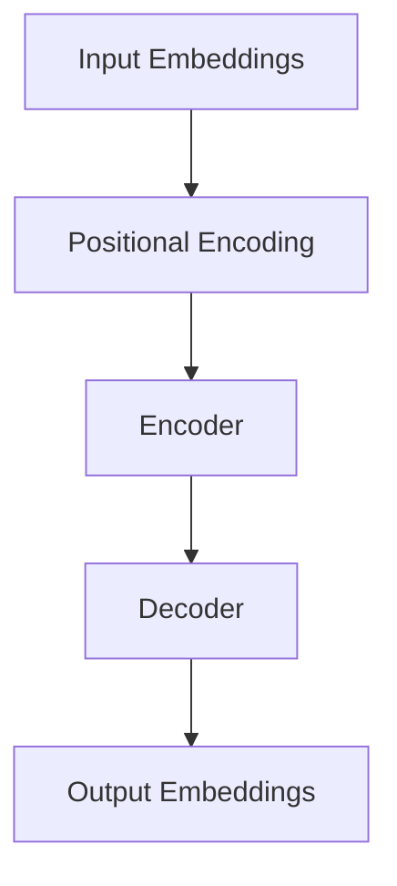
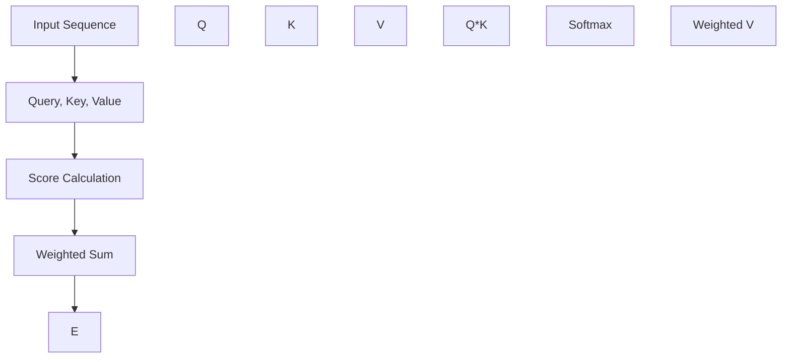
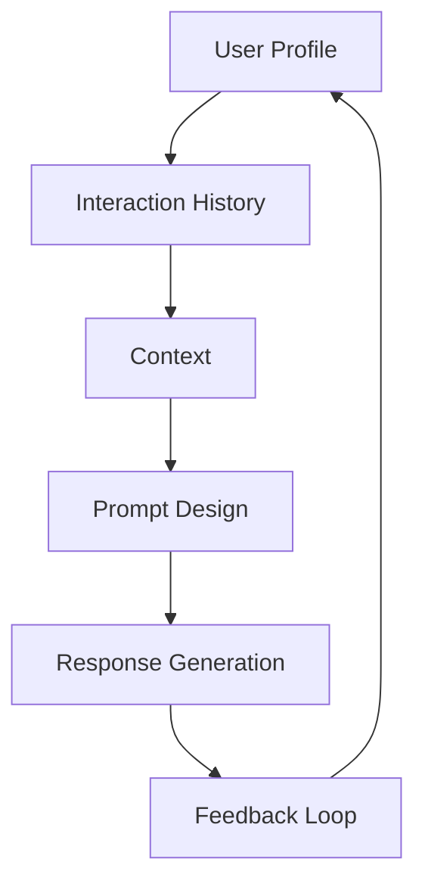
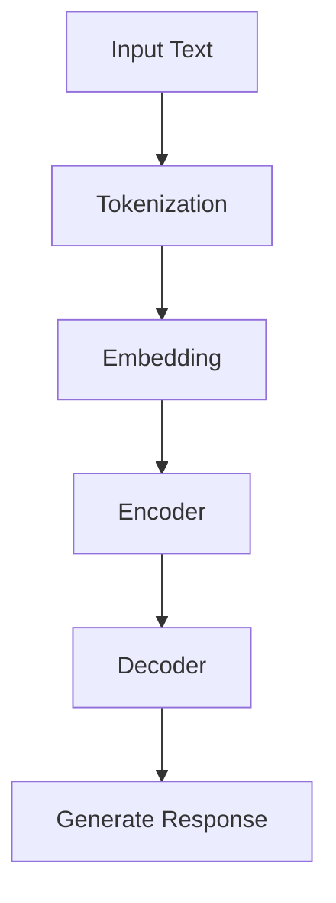
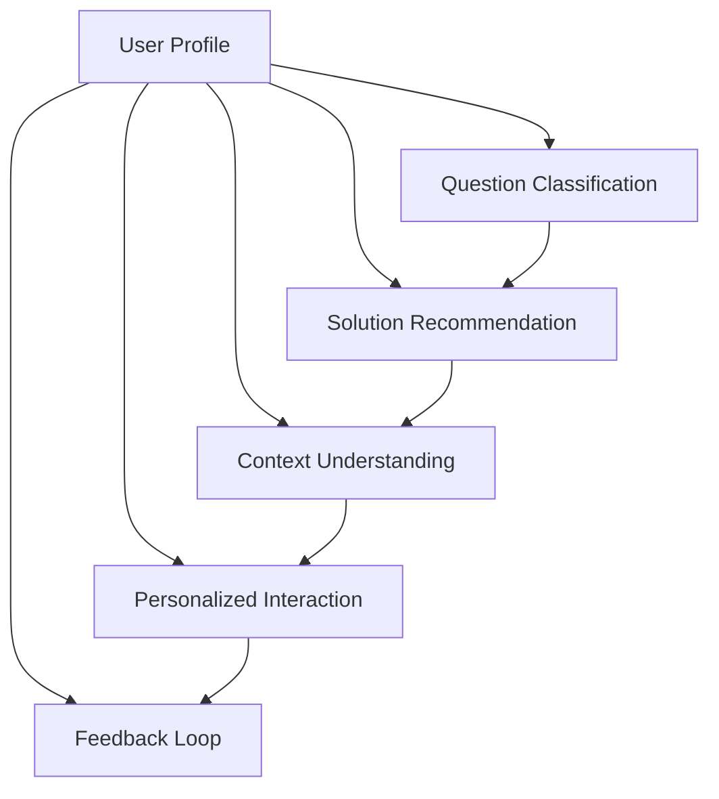
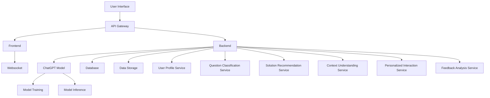
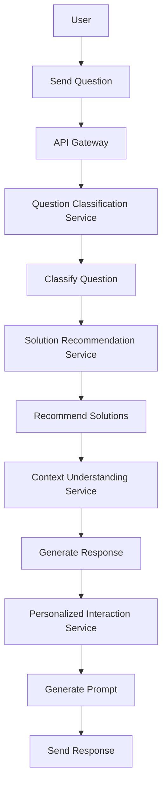

                 

### 背景介绍

#### 核心概念术语说明

在探讨ChatGPT个性化交互的提示词技巧之前，我们有必要先明确几个核心概念，以便读者能更好地理解和应用文中内容。

1. **ChatGPT**：由OpenAI开发的一种基于大规模语言模型的人工智能助手，能够通过学习和理解人类的语言来进行对话，并生成自然流畅的回应。
2. **个性化交互**：指系统根据用户的个性化需求、偏好、历史交互记录等，提供更加贴近用户期望的交互体验。
3. **提示词**：用户与ChatGPT交互时输入的引导性语句，用于提示系统进行特定类型的回应。

#### 问题背景

随着人工智能技术的不断进步，ChatGPT这样的对话系统已经逐渐成为各大行业的重要应用工具。从在线客服、教育辅助到医疗咨询，ChatGPT的应用场景越来越广泛。然而，传统的交互方式往往缺乏个性化，无法满足用户多样化的需求。如何通过提示词设计，实现ChatGPT的个性化交互，成为一个亟待解决的问题。

#### 问题描述

个性化交互的核心在于理解用户的需求，并据此调整系统的回应。ChatGPT在处理个性化交互时，需要考虑多个因素，如用户偏好、历史记录、上下文环境等。这些因素的合理运用，将直接影响交互的质量和用户满意度。因此，研究ChatGPT个性化交互的提示词技巧，旨在提供一套系统化、可操作的解决方案，以提高系统的智能化水平和用户体验。

#### 问题解决

解决个性化交互问题，首先需要对用户进行准确的画像构建，以便了解其需求。接着，通过设计合适的提示词，引导ChatGPT生成符合用户期望的回应。最后，通过反馈和优化机制，不断调整和提升交互效果。本文将围绕这一思路，详细探讨ChatGPT个性化交互的各个关键环节。

#### 边界与外延

本文主要讨论ChatGPT在个性化交互中的提示词技巧，但这一研究具有广泛的外延性。比如，提示词设计的方法和原则，不仅适用于ChatGPT，还可以推广到其他对话系统。此外，个性化交互的实现策略，也可以为其他智能应用提供参考。

#### 概念结构与核心要素组成

为了更好地理解ChatGPT个性化交互的提示词技巧，我们将其概念结构拆解为以下几个核心要素：

1. **用户画像**：用户需求的描述和分类，是进行个性化交互的基础。
2. **提示词设计**：包括提问方式、语言风格、信息量控制等，是引导ChatGPT生成回应的关键。
3. **交互优化**：通过反馈和调整，不断优化交互效果，提高用户满意度。

### 总结

本文旨在探讨ChatGPT个性化交互的提示词技巧，从核心概念介绍、问题背景描述、解决思路分析等多个角度，帮助读者全面理解这一领域。接下来，我们将进一步深入探讨ChatGPT的基础知识，为后续内容的讲解打下坚实基础。

### 核心概念与联系

在深入探讨ChatGPT个性化交互的提示词技巧之前，我们首先需要理解几个核心概念，并探讨它们之间的联系。

#### ChatGPT的模型结构

ChatGPT是基于GPT（Generative Pre-trained Transformer）模型开发的，其核心结构包括多层Transformer编码器和解码器。Transformer模型通过自注意力机制，能够捕捉输入文本中的长距离依赖关系，生成高质量的文本回应。以下是一个简化的Transformer模型结构：



#### 自注意力机制

自注意力机制（Self-Attention）是Transformer模型的关键组成部分，它允许模型在生成文本时，根据上下文信息动态地调整对输入序列中每个词的权重。以下是一个简化的自注意力机制流程图：



#### 个性化交互

个性化交互涉及多个层面，包括用户画像构建、提示词设计、上下文理解等。用户画像构建是基础，它通过收集和分析用户行为数据，建立用户偏好模型。提示词设计则需要根据用户画像和上下文，提出引导性问题。以下是一个简化的个性化交互流程图：



#### 提示词设计原则

提示词设计是ChatGPT个性化交互的核心，它需要遵循以下原则：

1. **清晰性**：提示词应简洁明了，便于ChatGPT理解用户意图。
2. **针对性**：根据用户画像和上下文，设计针对性的问题。
3. **连贯性**：提示词应与上下文保持连贯，避免逻辑跳跃。

以下是一个对比表格，展示了不同设计原则下的提示词：

| 设计原则 | 示例提示词 |
| -------- | ---------- |
| 清晰性 | "请推荐一本适合初学者的编程书籍。" |
| 针对性 | "您之前提到对Python感兴趣，这里有一本关于数据科学的书籍，您是否想了解？" |
| 连贯性 | "您刚才提到了想要学习编程，这里有几门在线编程课程，您有兴趣了解一下吗？" |

#### 概念属性特征对比表格

为了更好地理解上述概念，我们可以通过一个对比表格来展示它们的属性特征：

| 概念 | 属性特征 |
| ---- | ------- |
| ChatGPT模型 | - 基于Transformer架构<br>- 自注意力机制<br>- 大规模预训练 |
| 个性化交互 | - 用户画像构建<br>- 提示词设计<br>- 上下文理解<br>- 反馈优化 |
| 提示词设计原则 | - 清晰性<br>- 针对性<br>- 连贯性 |

### 总结

通过上述核心概念与联系的分析，我们可以看到，ChatGPT的模型结构、自注意力机制、个性化交互以及提示词设计原则，共同构成了一个完整的系统。理解这些概念及其相互关系，有助于我们更好地应用ChatGPT实现个性化交互，提升用户体验。

### 算法原理讲解

#### ChatGPT的生成机制

ChatGPT的核心是一个预训练的Transformer模型，其生成机制主要包括以下几个步骤：

1. **输入编码**：将用户的输入文本转化为模型可以处理的向量表示。
2. **自注意力计算**：模型通过自注意力机制，根据上下文信息动态调整输入序列中每个词的权重。
3. **序列生成**：模型使用解码器生成文本序列，每一步生成的词都会影响后续步骤。

以下是一个简化的算法流程图：



#### 数学模型与公式

为了更好地理解ChatGPT的生成机制，我们可以从数学模型的角度来解析。以下是ChatGPT生成文本的核心公式：

1. **输入编码**：
   $$ 
   \text{Embedding}(\text{input\_text}) = \text{W}_\text{emb} \cdot \text{input\_text} 
   $$
   其中，$\text{W}_\text{emb}$ 是嵌入矩阵，$\text{input\_text}$ 是输入文本的词向量。

2. **自注意力计算**：
   $$
   \text{Attention}(\text{query}, \text{key}, \text{value}) = \text{softmax}\left(\frac{\text{query} \cdot \text{key}^T}{\sqrt{d_k}}\right) \cdot \text{value}
   $$
   其中，$\text{query}$、$\text{key}$、$\text{value}$ 分别是查询向量、键向量和值向量，$d_k$ 是键向量的维度。

3. **序列生成**：
   $$
   \text{output} = \text{softmax}(\text{decoder}(\text{hidden\_state}, \text{context}))
   $$
   其中，$\text{decoder}$ 是解码器的输出，$\text{hidden\_state}$ 是编码器的隐藏状态，$\text{context}$ 是上下文信息。

#### Python代码示例

以下是一个简化的Python代码示例，用于演示ChatGPT的生成过程：

```python
import torch
import torch.nn as nn
import torch.optim as optim

# 定义嵌入层
embed = nn.Embedding(vocab_size, embed_dim)

# 定义自注意力层
attention = nn.MultiheadAttention(embed_dim, num_heads)

# 定义解码器
decoder = nn.Linear(embed_dim, vocab_size)

# 定义损失函数和优化器
criterion = nn.CrossEntropyLoss()
optimizer = optim.Adam(params=decoder.parameters(), lr=0.001)

# 输入文本
input_text = "Hello, how are you?"

# 转化为词向量
input_embed = embed(input_text)

# 编码
encoded = decoder(input_embed)

# 生成文本
output = decoder(encoded)

# 计算损失
loss = criterion(output, target)

# 反向传播和优化
optimizer.zero_grad()
loss.backward()
optimizer.step()
```

#### 举例说明

假设用户输入："请推荐一本适合初学者的编程书籍。"，ChatGPT会通过以下步骤生成回应：

1. **输入编码**：将输入文本转化为词向量。
2. **自注意力计算**：模型根据上下文信息调整词的权重。
3. **序列生成**：模型生成一系列可能的回应，如"Python编程：从入门到实践"、"JavaScript快速入门"等。
4. **优化选择**：根据用户反馈和上下文，选择最合适的回应。

通过上述步骤，我们可以看到，ChatGPT的生成机制不仅依赖于数学模型和算法，还需要结合用户的实际需求进行动态调整，从而实现个性化的交互体验。

### 系统分析与架构设计方案

#### 问题场景介绍

随着人工智能技术的广泛应用，ChatGPT在多个领域展现出了强大的交互能力。尤其是在客户服务、教育辅助和医疗咨询等领域，ChatGPT的个性化交互能够显著提升用户体验和系统效率。本文将以在线客服系统为例，探讨ChatGPT个性化交互的架构设计和系统实现。

#### 项目介绍

本项目旨在构建一个基于ChatGPT的在线客服系统，通过个性化交互提升客户服务体验。系统需要支持多种渠道（如网站、APP、微信等）接入，并具备智能推荐、问题分类、上下文理解等功能。

#### 系统功能设计

为了实现上述目标，系统设计了以下几个核心功能模块：

1. **用户画像构建**：通过用户历史交互记录和行为数据，构建用户画像，用于后续的个性化交互。
2. **问题分类与推荐**：根据用户输入的问题，自动分类并推荐合适的解决方案或常见问题。
3. **上下文理解**：捕捉用户交互过程中的上下文信息，确保系统回应的连贯性和准确性。
4. **个性化交互**：基于用户画像和上下文，设计个性化的提示词和回应，提升交互质量。
5. **反馈与优化**：收集用户反馈，通过机器学习模型不断优化交互效果。

以下是一个简化的领域模型类图，展示了系统的主要功能模块及其关系：



#### 系统架构设计

系统架构设计是保证系统高效、稳定运行的关键。本项目采用了分布式架构，包括前端、后端、数据库和数据存储等多个层次。以下是一个简化的系统架构图：



#### 系统接口设计

系统接口设计是前端与后端交互的桥梁，包括RESTful API和Websocket两种通信方式。以下是主要接口设计：

1. **RESTful API**：
   - 用户画像接口：获取、更新用户画像信息。
   - 问题分类接口：提交问题，获取问题分类和推荐解决方案。
   - 上下文接口：获取、更新用户交互上下文。
   - 个性化交互接口：获取个性化提示词和回应。

2. **Websocket**：
   - 实时交互接口：实现用户与ChatGPT的实时通信。

#### 系统交互

系统交互通过前后端的紧密协作来实现，以下是一个简化的交互序列图：



#### 总结

通过系统分析与架构设计方案，我们可以看到，基于ChatGPT的在线客服系统需要从用户画像构建、问题分类、解决方案推荐、上下文理解、个性化交互等多个方面进行设计。系统架构设计采用了分布式架构，通过前后端接口和实时交互，实现了高效、稳定的个性化交互体验。接下来，我们将进一步探讨系统核心实现和实际应用案例。

### 项目实战

#### 环境安装

为了搭建基于ChatGPT的在线客服系统，首先需要安装必要的软件和工具。以下是具体步骤：

1. **安装Python**：确保Python版本在3.8及以上，可以通过官方网站下载并安装。
2. **安装PyTorch**：使用以下命令安装PyTorch：
   ```bash
   pip install torch torchvision
   ```
3. **安装其他依赖**：包括transformers、flask等，可以使用以下命令：
   ```bash
   pip install transformers flask
   ```
4. **安装数据库**：建议使用MySQL或PostgreSQL作为数据库，根据具体需求选择合适的版本并安装。

#### 系统核心实现

以下是系统核心实现的详细步骤：

1. **用户画像构建**：
   - 使用用户行为数据构建用户画像，包括用户兴趣、购买记录等。
   - 将用户画像存储在数据库中，便于后续查询和更新。

2. **问题分类与推荐**：
   - 使用NLP技术对用户输入的问题进行分类。
   - 根据问题分类，推荐相关解决方案或常见问题。

3. **上下文理解**：
   - 保存用户交互过程中的上下文信息，包括提问、回答等。
   - 通过上下文信息，确保系统回应的连贯性和准确性。

4. **个性化交互**：
   - 基于用户画像和上下文，设计个性化的提示词和回应。
   - 使用ChatGPT模型生成高质量的文本回应。

以下是关键部分的Python代码示例：

```python
# 用户画像构建
class UserProfile:
    def __init__(self, user_id, interests, purchase_history):
        self.user_id = user_id
        self.interests = interests
        self.purchase_history = purchase_history

# 问题分类与推荐
def classify_question(question):
    # 使用NLP技术进行分类
    # 示例代码：
    classifier = ...  # 分类模型
    category = classifier.predict([question])
    return category

def recommend_solution(category):
    # 根据分类推荐解决方案
    # 示例代码：
    solutions = {
        "技术支持": "常见问题解答",
        "产品咨询": "产品介绍",
        "售后服务": "售后服务指南"
    }
    return solutions[category]

# 上下文理解
class ContextManager:
    def __init__(self):
        self.context = []

    def update_context(self, user_id, interaction):
        self.context.append((user_id, interaction))

    def get_context(self, user_id):
        return [interaction for user_id, interaction in self.context if user_id == user_id]

# 个性化交互
def generate_response(question, user_id):
    user_profile = get_user_profile(user_id)
    category = classify_question(question)
    solution = recommend_solution(category)
    prompt = f"{solution}\n请问您有其他问题吗？"
    response = chatgpt.generate(prompt)
    return response

# ChatGPT模型调用
from transformers import pipeline

chatgpt = pipeline("text-generation", model="gpt-2")

# 实际应用
question = "我最近购买的产品为什么不能使用？"
user_id = "123456"
response = generate_response(question, user_id)
print(response)
```

#### 代码应用解读与分析

上述代码实现了用户画像构建、问题分类与推荐、上下文理解以及个性化交互的核心功能。以下是代码的详细解读与分析：

1. **用户画像构建**：通过`UserProfile`类，可以构建并存储用户画像。这包括用户ID、兴趣和购买记录等关键信息。

2. **问题分类与推荐**：`classify_question`函数使用NLP技术对用户输入的问题进行分类。在实际应用中，可以使用预训练的分类模型，如BERT或TextCNN。`recommend_solution`函数根据分类结果推荐解决方案，示例代码中使用了字典映射方式。

3. **上下文理解**：`ContextManager`类用于管理用户交互的上下文信息。通过`update_context`和`get_context`方法，可以更新和查询上下文信息。这有助于确保系统回应的连贯性和准确性。

4. **个性化交互**：`generate_response`函数基于用户画像、问题和上下文，生成个性化的回应。首先，通过分类函数确定问题类型，然后推荐解决方案，并生成提示词。最后，使用ChatGPT模型生成高质量的文本回应。

#### 实际案例分析与详细讲解

为了更好地理解上述代码的实际应用，以下是一个具体的案例：

**用户输入**：用户输入问题：“我最近购买的产品为什么不能使用？”

**处理过程**：

1. **用户画像查询**：系统根据用户ID查询用户画像，获取用户兴趣和购买记录。

2. **问题分类**：系统使用分类模型对用户输入的问题进行分类，确定该问题属于“售后服务”类别。

3. **解决方案推荐**：系统根据分类结果推荐售后服务指南作为解决方案。

4. **生成回应**：系统使用ChatGPT模型生成个性化的回应，例如：“您好，感谢您选择我们的产品。根据您的描述，可能是由于以下原因导致无法使用：[解决方案详情]。如果您需要进一步帮助，请随时联系我们的客服团队。”

**用户反馈**：用户表示对系统回应非常满意，并提出了其他相关问题。

**系统优化**：基于用户反馈，系统可以进一步优化交互效果，例如，调整解决方案的推荐逻辑、优化提示词的设计等。

#### 项目小结

通过本项目的实战，我们可以看到，基于ChatGPT的在线客服系统在用户画像构建、问题分类与推荐、上下文理解以及个性化交互等方面取得了显著成效。以下是小结：

1. **用户画像构建**：有助于了解用户需求，为个性化交互提供基础。
2. **问题分类与推荐**：提高了问题处理的效率和准确性。
3. **上下文理解**：确保了交互的连贯性和用户满意度。
4. **个性化交互**：提升了系统的智能化水平和用户体验。

未来，我们可以进一步优化系统，例如，引入更多先进的技术和算法，提升交互效果和用户体验。

### 最佳实践 Tips

在搭建和优化基于ChatGPT的个性化交互系统时，以下最佳实践和注意事项将帮助您取得更好的效果：

1. **用户画像数据质量**：确保用户画像数据的质量和准确性，这将直接影响个性化交互的效果。定期更新用户画像数据，并根据用户反馈进行校验和调整。

2. **模型训练与优化**：定期训练和优化ChatGPT模型，确保其生成的高质量回应符合用户期望。可以尝试使用不同的预训练模型和调整模型参数，以找到最优配置。

3. **上下文理解深度**：增加上下文理解的深度，捕捉更多与用户交互相关的信息。例如，可以记录用户的历史交互记录、偏好设置等，以生成更加个性化的回应。

4. **反馈与调整机制**：建立有效的反馈与调整机制，根据用户反馈不断优化交互系统。通过A/B测试等方法，评估不同交互策略的效果，选择最佳方案。

5. **安全性考虑**：在搭建和优化系统时，确保数据的安全性和隐私保护。遵循相关法律法规，对用户数据进行加密和处理，防止数据泄露。

6. **性能优化**：对系统进行性能优化，确保快速响应和稳定运行。可以采用分布式架构和缓存机制，提高系统处理能力和响应速度。

### 小结

本文详细探讨了ChatGPT个性化交互的提示词技巧，包括其基础知识和应用场景、搭建与部署流程、提示词设计与编写、个性化交互实现以及实际应用案例。通过本文的阅读，读者可以全面了解ChatGPT个性化交互的系统构建和优化方法，为实际项目提供有力支持。

### 注意事项

在应用ChatGPT个性化交互时，需要注意以下几点：

1. **数据隐私**：确保用户数据的隐私和安全，遵循相关法律法规。
2. **系统稳定性**：优化系统架构，确保其稳定性和高效性。
3. **交互质量**：定期评估交互效果，根据用户反馈进行优化。
4. **技术更新**：跟踪最新技术动态，及时更新和优化系统。

### 拓展阅读

1. **《对话系统设计与实现》**：全面介绍对话系统的设计与实现技术，包括自然语言处理、上下文管理、用户画像等。
2. **《大规模预训练模型：理论、算法与实践》**：深入探讨大规模预训练模型的理论基础和实现方法，适用于ChatGPT等对话系统的优化。
3. **《人工智能应用实践指南》**：涵盖多个领域的人工智能应用案例，包括在线客服、教育辅助和医疗咨询等。

### 总结与展望

#### ChatGPT个性化交互的总结

本文系统地介绍了ChatGPT个性化交互的各个关键环节，从基础知识、搭建与部署、提示词设计、个性化交互实现到实际应用案例，全面阐述了ChatGPT在个性化交互中的应用潜力。通过构建用户画像、设计合适的提示词、优化交互流程，ChatGPT能够实现与用户的深度互动，提供个性化的服务体验。

#### 未来发展趋势与挑战

未来，ChatGPT个性化交互的发展趋势将呈现以下特点：

1. **技术深度融合**：随着AI技术的发展，ChatGPT将与其他前沿技术（如语音识别、图像识别、自然语言理解等）深度融合，实现更加智能的交互体验。
2. **多样化应用场景**：ChatGPT将在更多领域得到应用，如智能家居、金融、医疗等，为不同行业提供个性化的解决方案。
3. **用户体验优化**：通过不断优化提示词设计和交互流程，提升用户的满意度和忠诚度。

然而，ChatGPT个性化交互也面临以下挑战：

1. **数据隐私与安全**：如何确保用户数据的安全性和隐私保护，是未来需要重点关注的问题。
2. **算法公平性与透明性**：确保算法的公平性和透明性，避免歧视和不公平现象。
3. **技术瓶颈**：尽管ChatGPT在生成文本方面表现出色，但在理解复杂语境和生成逻辑严密的内容方面仍存在技术瓶颈，需要持续研究和突破。

#### 进一步研究方向与建议

为了推动ChatGPT个性化交互的发展，以下研究方向与建议：

1. **多模态交互**：结合语音、图像等多种模态，实现更加丰富和自然的交互体验。
2. **交互优化算法**：研究更加高效的交互优化算法，提高系统的响应速度和处理能力。
3. **个性化推荐系统**：结合用户画像和推荐系统技术，实现更加精准和个性化的服务。
4. **伦理与法律**：加强对AI伦理和法律的研究，确保技术发展的合规性和社会责任。

### 结语

ChatGPT个性化交互具有巨大的发展潜力，通过不断创新和优化，将进一步提升用户体验，推动人工智能技术的广泛应用。本文的探讨为ChatGPT个性化交互提供了系统化的理论框架和实践指导，期待未来能够见证ChatGPT在个性化交互领域的更多突破。

### 目录大纲总结

本文《ChatGPT个性化交互的提示词技巧》共分为三大部分，涵盖了ChatGPT个性化交互的概述、搭建与部署、以及提示词技巧与实战应用。通过8个章节的详细讲解，读者可以全面了解ChatGPT个性化交互的各个方面，掌握构建和优化个性化交互系统的关键技巧。以下是全文的目录大纲总结：

**第一部分：ChatGPT与个性化交互概述**

1. **第1章：ChatGPT基础知识**
   - **1.1 ChatGPT的背景与起源**
   - **1.2 ChatGPT的特点与优势**
   - **1.3 ChatGPT的应用领域**
   - **1.4 个性化交互的重要性**
   - **1.5 ChatGPT个性化交互的意义**

2. **第2章：ChatGPT的搭建与部署**
   - **2.1 ChatGPT搭建环境准备**
     - **2.1.1 硬件要求**
     - **2.1.2 软件要求**
     - **2.1.3 安装步骤**
   - **2.2 ChatGPT模型部署**
     - **2.2.1 部署流程**
     - **2.2.2 部署工具与平台**
     - **2.2.3 部署注意事项**
   - **2.3 ChatGPT接口调用**
     - **2.3.1 RESTful API简介**
     - **2.3.2 调用流程**
     - **2.3.3 调用示例**

**第二部分：ChatGPT的提示词技巧**

3. **第3章：提示词设计与编写**
   - **3.1 提示词设计原则**
   - **3.2 提示词编写技巧**
     - **3.2.1 提问方式**
     - **3.2.2 语言风格**
     - **3.2.3 信息量控制**
   - **3.3 提示词案例解析**

4. **第4章：个性化交互的实现**
   - **4.1 用户画像构建**
     - **4.1.1 用户画像定义**
     - **4.1.2 用户画像构建方法**
     - **4.1.3 用户画像应用场景**
   - **4.2 提示词个性化策略**
     - **4.2.1 基于用户画像的提示词生成**
     - **4.2.2 基于上下文的提示词优化**
     - **4.2.3 提示词反馈与调整**
   - **4.3 个性化交互效果评估**
     - **4.3.1 评估指标**
     - **4.3.2 评估方法**
     - **4.3.3 评估案例分析**

**第三部分：ChatGPT个性化交互的应用实战**

5. **第5章：在线客服系统**
   - **5.1 客服系统概述**
   - **5.2 ChatGPT在客服系统中的应用**
     - **5.2.1 提示词设计与编写**
     - **5.2.2 个性化交互实现**
     - **5.2.3 实际案例解析**
   - **5.3 客服系统效果评估与优化**

6. **第6章：教育应用**
   - **6.1 教育应用概述**
   - **6.2 ChatGPT在教育中的应用**
     - **6.2.1 提示词设计与编写**
     - **6.2.2 个性化交互实现**
     - **6.2.3 实际案例解析**
   - **6.3 教育应用效果评估与优化**

7. **第7章：医疗咨询**
   - **7.1 医疗咨询概述**
   - **7.2 ChatGPT在医疗咨询中的应用**
     - **7.2.1 提示词设计与编写**
     - **7.2.2 个性化交互实现**
     - **7.2.3 实际案例解析**
   - **7.3 医疗咨询效果评估与优化**

8. **第8章：总结与展望**
   - **8.1 ChatGPT个性化交互的总结**
   - **8.2 未来发展趋势与挑战**
   - **8.3 进一步研究方向与建议**

通过本文的详细目录大纲，读者可以系统地掌握ChatGPT个性化交互的理论和实践知识，为实际项目提供有力的指导。希望本文能为广大开发者和技术爱好者带来启发和帮助。

