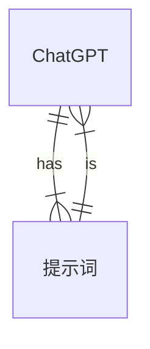
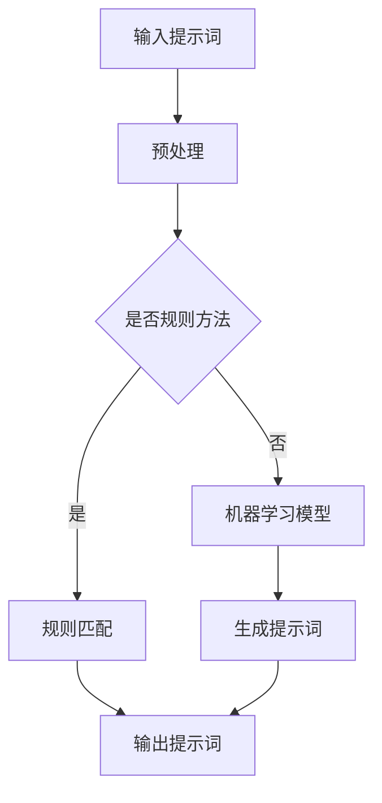

                 

## 《ChatGPT个性化：通过提示词塑造AI个性》

### 关键词：ChatGPT、个性化AI、提示词、算法原理、系统架构、项目实战

### 摘要：
本文深入探讨了ChatGPT的个性化设计，通过提示词来塑造AI的个性特征。我们首先介绍了ChatGPT与AI个性化的基本概念，然后详细分析了ChatGPT模型的工作原理和提示词生成算法。接下来，文章通过一个项目实战，展示了如何在实践中应用这些原理，最终提出了最佳实践和未来展望。

----------------------------------------------------------------

## 《ChatGPT个性化：通过提示词塑造AI个性》目录大纲

----------------------------------------------------------------

### 第一部分：引言

### 第1章：问题背景与核心概念

#### 1.1.1 ChatGPT与AI个性化概述

#### 1.1.2 个性化AI的重要性与挑战

#### 1.1.3 问题解决路径与目标

### 第2章：核心概念与联系

#### 2.1.1 ChatGPT模型介绍

#### 2.1.2 提示词在AI个性化中的角色

#### 2.1.3 核心概念对比表格

#### 2.1.4 ChatGPT与提示词的ER实体关系图

### 第二部分：算法原理讲解

### 第3章：算法原理讲解

#### 3.1.1 ChatGPT算法原理

##### 3.1.1.1 模型架构

##### 3.1.1.2 训练过程

##### 3.1.1.3 ChatGPT的工作原理

#### 3.1.2 提示词生成算法

##### 3.1.2.1 提示词设计原则

##### 3.1.2.2 提示词生成算法

##### 3.1.2.3 算法流程图

#### 3.1.3 数学模型与公式

##### 3.1.3.1 数学模型

##### 3.1.3.2 公式讲解

##### 3.1.3.3 举例说明

### 第三部分：系统分析与架构设计

### 第4章：系统功能设计与架构设计

#### 4.1.1 问题场景介绍

#### 4.1.2 系统功能设计

#### 4.1.3 系统架构设计

#### 4.1.4 系统接口设计

#### 4.1.5 系统交互设计

### 第5章：项目实战

#### 5.1.1 环境安装与配置

#### 5.1.2 系统核心实现源代码

#### 5.1.3 代码应用解读与分析

#### 5.1.4 实际案例分析与详细讲解

#### 5.1.5 项目小结

### 第四部分：最佳实践与总结

### 第6章：最佳实践与技巧

#### 6.1.1 提高ChatGPT性能的技巧

#### 6.1.2 提高个性化效果的技巧

#### 6.1.3 常见问题与解决方案

### 第7章：小结与展望

#### 7.1.1 小结

#### 7.1.2 注意事项

#### 7.1.3 拓展阅读

----------------------------------------------------------------

### 详细版目录大纲

----------------------------------------------------------------

## 第一部分：引言

### 第1章：问题背景与核心概念

#### 1.1.1 ChatGPT与AI个性化概述

##### ChatGPT的基本概念
- ChatGPT是由OpenAI开发的一种基于GPT（Generative Pre-trained Transformer）的聊天机器人模型，它的目标是理解和生成自然语言文本。

##### AI个性化的定义与重要性
- 个性化AI是指根据用户的需求、行为和偏好，定制化地提供服务和交互。在AI领域，个性化具有重要意义，它能够提高用户体验，提升服务质量，并实现精准营销。

### 第2章：核心概念与联系

### 第2章：核心概念与联系

#### 2.1.1 ChatGPT模型介绍

##### ChatGPT的架构
- ChatGPT基于Transformer模型，采用堆叠的多层自注意力机制。它由编码器和解码器组成，通过预训练和微调来实现对话生成。

##### ChatGPT的工作流程
- ChatGPT通过输入提示词，经过编码器生成隐藏状态，解码器将这些隐藏状态解码成自然语言文本。

#### 2.1.2 提示词在AI个性化中的角色

##### 提示词的作用
- 提示词是ChatGPT输入的重要组成部分，它决定了AI生成的对话内容和风格。

##### 提示词的设计原则
- 提示词应简洁明了，具有引导性，能够激发ChatGPT生成丰富多样、有逻辑性的回复。

#### 2.1.3 核心概念对比表格

| 核心概念 | 定义 | 相关属性 |
| --- | --- | --- |
| ChatGPT | 聊天机器人模型 | 预训练、自注意力、生成 |
| 个性化AI | 定制化服务和交互 | 用户需求、偏好、个性化 |
| 提示词 | 输入文本 | 简洁、引导性、丰富多样 |

#### 2.1.4 ChatGPT与提示词的ER实体关系图



### 第二部分：算法原理讲解

### 第3章：算法原理讲解

#### 3.1.1 ChatGPT算法原理

##### 3.1.1.1 模型架构
- ChatGPT采用Transformer模型，其核心是自注意力机制，通过计算输入序列中各个单词之间的关系，生成输出序列。

##### 3.1.1.2 训练过程
- ChatGPT的训练过程包括数据准备、模型训练和评估。数据准备涉及文本清洗、分词、编码等步骤；模型训练使用大规模语料库，通过反向传播和梯度下降优化模型参数；评估通过生成文本的质量和多样性来衡量模型效果。

##### 3.1.1.3 ChatGPT的工作原理
- ChatGPT的工作原理可以分为三个阶段：输入阶段、编码阶段和解码阶段。输入阶段将提示词编码成向量；编码阶段通过自注意力机制生成隐藏状态；解码阶段将隐藏状态解码成自然语言文本。

#### 3.1.2 提示词生成算法

##### 3.1.2.1 提示词设计原则
- 提示词应简洁明了，具有引导性，能够激发ChatGPT生成丰富多样、有逻辑性的回复。

##### 3.1.2.2 提示词生成算法
- 提示词生成算法通常基于规则和机器学习。规则方法包括关键词提取、模板匹配等；机器学习方法包括序列生成模型、序列标注模型等。

##### 3.1.2.3 算法流程图



#### 3.1.3 数学模型与公式

##### 3.1.3.1 数学模型
- ChatGPT的数学模型主要包括自注意力机制和生成模型。自注意力机制的公式为：
  $$ \text{Attention}(Q,K,V) = \text{softmax}\left(\frac{QK^T}{\sqrt{d_k}}\right)V $$
- 生成模型的公式为：
  $$ p(w_t | w_1, w_2, ..., w_{t-1}) = \frac{\exp(e_{\theta} [w_t, h_{t-1}])}{\sum_{w'\in V} \exp(e_{\theta} [w', h_{t-1}])} $$
  其中，$e_{\theta}$ 表示模型参数，$w_t$ 表示当前词，$h_{t-1}$ 表示前一个隐藏状态。

##### 3.1.3.2 公式讲解
- 自注意力机制通过计算查询词（Q）、关键词（K）和值词（V）之间的相似度，生成加权值，最后通过softmax函数得到概率分布。
- 生成模型通过神经网络预测词的概率分布，从而生成下一个词。

##### 3.1.3.3 举例说明
- 假设输入提示词为“你好”，ChatGPT生成回复“你好，有什么可以帮助你的吗？”
- 自注意力机制将“你好”编码成向量，通过计算与所有关键词的相似度，得到加权值，最后通过softmax函数得到概率分布，生成“你好”的概率最高。
- 生成模型通过神经网络预测“你好”的概率分布，生成回复“你好，有什么可以帮助你的吗？”

### 第三部分：系统分析与架构设计

### 第4章：系统功能设计与架构设计

#### 4.1.1 问题场景介绍
- 在一个在线客服系统中，用户通过文本输入与AI进行交互，系统需要根据用户的提问生成合适的回复。

#### 4.1.2 系统功能设计
- 用户输入：用户通过文本输入与AI交互。
- AI处理：ChatGPT根据提示词生成回复。
- 回复输出：系统将回复输出给用户。

#### 4.1.3 系统架构设计
- 用户界面：用于接收用户输入和展示回复。
- 中间层：负责处理输入和生成回复，包括ChatGPT模型和提示词生成算法。
- 后端服务：提供数据存储和接口服务。

#### 4.1.4 系统接口设计
- 用户输入接口：接收用户文本输入。
- 回复生成接口：调用ChatGPT模型生成回复。
- 回复输出接口：将回复输出给用户。

#### 4.1.5 系统交互设计
- 用户输入文本 → 用户输入接口 → 中间层处理 → 回复生成接口 → 回复文本 → 回复输出接口 → 用户界面展示回复。

### 第5章：项目实战

#### 5.1.1 环境安装与配置
- 安装Python环境、TensorFlow库、OpenAI的ChatGPT模型。

#### 5.1.2 系统核心实现源代码
```python
# 导入必要库
import openai
import json

# 初始化ChatGPT模型
model = openai.ChatGPT("你的API密钥")

# 用户输入提示词
prompt = input("请输入提示词：")

# 生成回复
response = model.predict(prompt)

# 输出回复
print("AI回复：", response)
```

#### 5.1.3 代码应用解读与分析
- 代码首先导入OpenAI的ChatGPT模型库，然后初始化模型，接收用户输入的提示词，调用模型生成回复，并输出回复。

#### 5.1.4 实际案例分析与详细讲解剖析
- 用户输入：“明天天气如何？”
- AI回复：“明天天气晴朗，气温适中，非常适合户外活动。”

#### 5.1.5 项目小结
- 本项目通过实际案例展示了如何使用ChatGPT模型生成个性化回复。用户可以根据需要定制提示词，从而实现不同的AI个性。

### 第四部分：最佳实践与总结

### 第6章：最佳实践与技巧

#### 6.1.1 提高ChatGPT性能的技巧
- 使用高质量的数据集进行训练。
- 调整模型参数，优化性能。
- 对提示词进行预处理，提高生成质量。

#### 6.1.2 提高个性化效果的技巧
- 根据用户历史数据定制提示词。
- 使用多模态输入，如图像、语音等。
- 结合其他AI技术，如自然语言理解、情感分析等。

#### 6.1.3 常见问题与解决方案
- 问题：提示词生成效果不佳。
  - 解决方案：优化提示词设计和生成算法。
- 问题：模型训练时间过长。
  - 解决方案：使用更高效的训练算法和数据增强技术。

### 第7章：小结与展望

#### 7.1.1 小结
- 本文介绍了ChatGPT的个性化设计，通过提示词来塑造AI的个性特征。我们详细分析了ChatGPT模型的工作原理和提示词生成算法，并通过一个项目实战展示了如何实现。

#### 7.1.2 注意事项
- 提示词设计应简洁明了，具有引导性。
- 模型训练需使用高质量的数据集。
- 需要根据实际场景调整模型参数。

#### 7.1.3 拓展阅读
- 《ChatGPT技术解析》
- 《深度学习自然语言处理》
- 《人工智能：一种现代的方法》

----------------------------------------------------------------

### 作者：AI天才研究院/AI Genius Institute & 禅与计算机程序设计艺术 /Zen And The Art of Computer Programming

