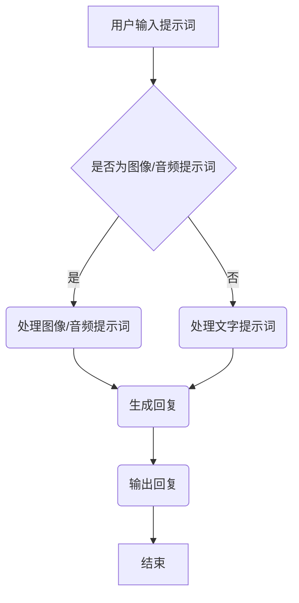
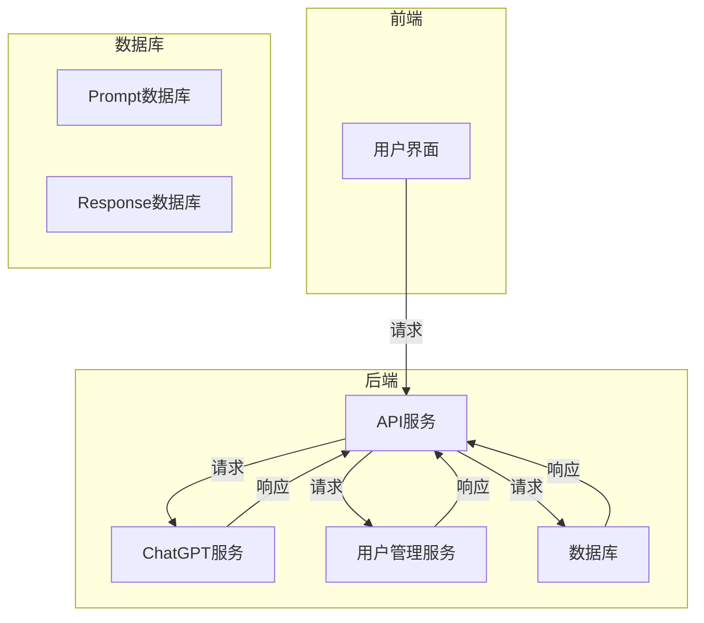
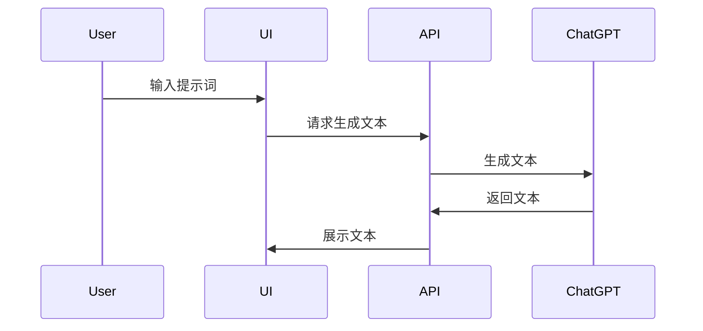

                 

# 《ChatGPT商业应用：提示词的经济价值》

## 关键词

- ChatGPT
- 提示词
- 商业应用
- 经济价值
- 自然语言处理
- 人工智能

## 摘要

随着人工智能技术的不断发展，ChatGPT作为自然语言处理领域的杰出代表，已经逐渐在商业应用中发挥出巨大的潜力。本文将围绕ChatGPT的提示词展开讨论，分析其在不同商业场景下的应用价值，探讨其经济效应，并展望ChatGPT与提示词在未来商业领域的创新与发展。

### 目录大纲

1. **ChatGPT基础知识**
   1.1 ChatGPT概述
   1.2 ChatGPT的核心原理与技术
   1.3 ChatGPT的应用场景与优势
2. **ChatGPT的编程与使用**
   2.1 ChatGPT的API介绍
   2.2 ChatGPT的编程实践
   2.3 ChatGPT在Python中的使用
3. **ChatGPT的商业应用**
   3.1 ChatGPT在客户服务中的应用
   3.2 ChatGPT在市场营销中的应用
   3.3 ChatGPT在人力资源中的应用
4. **提示词的经济价值分析**
   4.1 提示词在商业决策中的应用
   4.2 提示词在产品优化中的应用
   4.3 提示词在市场营销中的作用
5. **ChatGPT与提示词的最佳实践**
   5.1 ChatGPT与提示词的案例分析
   5.2 ChatGPT与提示词的实践技巧
   5.3 ChatGPT与提示词的注意事项
6. **未来展望**
   6.1 ChatGPT与提示词的未来发展趋势
   6.2 ChatGPT与提示词的创新应用
   6.3 ChatGPT与提示词的挑战与机遇

### 第一部分：ChatGPT基础知识

#### 第1章：ChatGPT概述

##### 1.1 ChatGPT的诞生与背景

ChatGPT是由OpenAI开发的基于GPT-3模型的自然语言处理（NLP）人工智能聊天机器人。它于2022年11月发布，并迅速引起了全球范围内的关注和讨论。ChatGPT的诞生背后是人工智能技术的不断进步，尤其是深度学习和自然语言处理领域的突破。

ChatGPT的出现并非偶然。在过去的几十年里，计算机科学家和研究人员一直在努力使机器能够理解和生成自然语言。从最初的规则基模型，到统计模型，再到如今基于深度学习的生成对抗网络（GAN）和变分自编码器（VAE），人工智能在自然语言处理领域取得了显著的进展。

ChatGPT的背景可以追溯到GPT-3模型。GPT-3（Generative Pre-trained Transformer 3）是由OpenAI于2020年推出的一个革命性的自然语言处理模型，它拥有1750亿个参数，是世界上最大的语言模型之一。GPT-3的发布标志着自然语言处理技术的重大飞跃，使得人工智能在生成文本、理解和回答问题等方面达到了前所未有的水平。

##### 1.2 ChatGPT的核心原理与技术

ChatGPT的核心原理基于GPT-3模型的变体，即GPT-3.5模型。GPT-3.5模型是一种基于Transformer架构的深度神经网络模型，它通过预先训练（pre-training）和微调（fine-tuning）两个阶段来学习语言的模式和规则。

在预先训练阶段，GPT-3.5模型使用大量的文本数据进行训练，以学习语言的结构和语义。这一阶段的目标是使模型能够理解自然语言，并生成连贯的文本。

在微调阶段，GPT-3.5模型被用于特定任务，如回答问题或生成对话。在这个过程中，模型会根据接收到的输入文本进行调整，以生成更符合任务需求的输出。

ChatGPT通过使用这些技术，能够实现以下功能：

1. **理解自然语言**：ChatGPT可以理解用户输入的文本，并从中提取关键信息。
2. **生成文本**：ChatGPT可以根据用户的问题或指令生成连贯的文本回复。
3. **进行对话**：ChatGPT能够与用户进行自然、流畅的对话。

##### 1.3 ChatGPT的应用场景与优势

ChatGPT的应用场景非常广泛，包括但不限于以下几个方面：

1. **客户服务**：ChatGPT可以用于自动化的客户服务，如回答常见问题、提供技术支持等。
2. **市场营销**：ChatGPT可以用于生成营销文案、分析市场趋势等。
3. **内容创作**：ChatGPT可以用于生成文章、博客、新闻等内容。
4. **教育**：ChatGPT可以用于教育辅导、在线问答等。
5. **研发支持**：ChatGPT可以用于辅助软件开发、代码审查等。

ChatGPT的优势主要体现在以下几个方面：

1. **强大的语言理解能力**：ChatGPT具有强大的语言理解能力，能够准确理解用户的意图和需求。
2. **高效的文本生成**：ChatGPT可以快速生成高质量的文本，提高工作效率。
3. **灵活的对话能力**：ChatGPT能够与用户进行自然、流畅的对话，提升用户体验。
4. **可定制性**：ChatGPT可以根据不同场景和需求进行微调，实现特定的功能。

#### 第2章：ChatGPT的编程与使用

##### 2.1 ChatGPT的API介绍

ChatGPT通过API（应用程序编程接口）对外提供服务。使用ChatGPT API，开发者可以在自己的应用程序中集成ChatGPT，实现与用户的自然语言交互。

ChatGPT的API主要包括以下功能：

1. **文本生成**：接收用户的输入文本，生成相应的回复文本。
2. **文本理解**：理解用户的输入文本，提取关键信息。
3. **对话管理**：管理用户与ChatGPT之间的对话流程，包括上下文信息的维护。

##### 2.2 ChatGPT的编程实践

以下是一个简单的Python示例，展示如何使用ChatGPT API进行文本生成：

```python
import openai

# 设置API密钥
openai.api_key = "your_api_key"

# 文本生成函数
def generate_text(prompt, max_length=1024):
    response = openai.Completion.create(
        engine="text-davinci-003",
        prompt=prompt,
        max_tokens=max_length,
        n=1,
        stop=None,
        temperature=0.5,
    )
    return response.choices[0].text.strip()

# 测试
prompt = "请描述一下人工智能的未来发展趋势。"
print(generate_text(prompt))
```

##### 2.3 ChatGPT在Python中的使用

在Python中，使用ChatGPT API非常方便。开发者只需安装`openai`库，然后根据API文档进行调用即可。以下是一个简单的使用示例：

```python
import openai

# 设置API密钥
openai.api_key = "your_api_key"

# 回答问题函数
def answer_question(question):
    prompt = f"请回答以下问题：{question}"
    response = openai.Completion.create(
        engine="text-davinci-003",
        prompt=prompt,
        max_tokens=100,
        n=1,
        stop=None,
        temperature=0.5,
    )
    return response.choices[0].text.strip()

# 测试
question = "什么是人工智能？"
print(answer_question(question))
```

### 第二部分：ChatGPT的商业应用

#### 第3章：ChatGPT在客户服务中的应用

##### 3.1 ChatGPT在客户服务中的应用

在客户服务领域，ChatGPT可以极大地提高效率和客户满意度。传统的客户服务往往依赖于人工处理，这既耗时又容易出错。而ChatGPT的出现，使得自动化的客户服务成为可能。

ChatGPT可以应用于以下场景：

1. **自动回答常见问题**：ChatGPT可以自动回答用户常见的问题，如产品说明、售后服务等。
2. **智能客服机器人**：ChatGPT可以集成到智能客服机器人中，与用户进行自然、流畅的对话，提供即时支持。
3. **情感分析**：ChatGPT可以分析用户的情感，根据情感的不同提供个性化的服务和建议。

##### 3.2 ChatGPT在市场营销中的应用

在市场营销领域，ChatGPT同样发挥着重要作用。它可以帮助企业进行市场分析、产品推广、客户关系管理等。

ChatGPT可以应用于以下场景：

1. **市场分析**：ChatGPT可以分析社交媒体上的用户评论和讨论，帮助企业了解市场趋势和用户需求。
2. **内容创作**：ChatGPT可以生成营销文案、广告语、产品介绍等，提高营销效果。
3. **客户关系管理**：ChatGPT可以与客户进行互动，提供个性化的服务和建议，增强客户满意度。

##### 3.3 ChatGPT在人力资源中的应用

在人力资源管理领域，ChatGPT可以用于招聘、员工培训、绩效评估等。

ChatGPT可以应用于以下场景：

1. **招聘**：ChatGPT可以自动回答求职者的问题，筛选合适的简历，提高招聘效率。
2. **员工培训**：ChatGPT可以提供在线培训课程，根据员工的需求进行个性化培训。
3. **绩效评估**：ChatGPT可以分析员工的工作表现，提供客观、准确的评估报告。

### 第三部分：提示词的经济价值分析

#### 第4章：提示词的定义与分类

##### 4.1 提示词的概念与作用

提示词（Prompt）是用户输入给ChatGPT的文本，用于引导模型生成特定的回复。一个有效的提示词应该能够清晰地传达用户的意图，使ChatGPT能够准确理解并生成高质量的回复。

提示词在ChatGPT中的应用非常重要。它们不仅决定了ChatGPT的回复内容，还影响了回复的质量和效率。一个良好的提示词应该具备以下特点：

1. **明确性**：提示词应该明确具体，避免歧义和模糊性。
2. **简洁性**：提示词应该简洁明了，避免冗长和复杂的表达。
3. **灵活性**：提示词应该能够适应不同的场景和用户需求。

##### 4.2 提示词的分类与特点

根据功能，提示词可以分为以下几类：

1. **引导型提示词**：用于引导ChatGPT理解用户的意图和需求。例如：“请描述一下您的需求”、“您有什么问题需要帮助吗？”
2. **信息型提示词**：提供具体的信息和细节，帮助ChatGPT生成更准确的回复。例如：“请提供更多的背景信息”、“请您详细描述一下您的问题。”
3. **交互型提示词**：用于与用户进行对话，引导ChatGPT生成更自然的对话流。例如：“您对这个问题有什么想法吗？”、“您对解决方案有什么建议吗？”

根据形式，提示词可以分为以下几类：

1. **文字提示词**：以文字形式输入的提示词。这是最常见的形式，如：“请告诉我您的需求。”
2. **图像提示词**：以图像形式输入的提示词。例如：上传一张图片，要求ChatGPT描述图片内容。
3. **音频提示词**：以音频形式输入的提示词。例如：上传一段语音，要求ChatGPT生成文字摘要。

##### 4.3 提示词的设计与优化

提示词的设计与优化是提高ChatGPT应用效果的关键。以下是一些提示词设计与优化的方法和技巧：

1. **数据驱动**：通过收集用户反馈和对话数据，优化提示词的设计和选择。例如：分析哪些提示词导致了用户的不满意，然后进行针对性的优化。
2. **A/B测试**：对不同版本的提示词进行测试，选择效果最好的版本。例如：对两个版本的提示词进行测试，比较用户满意度，选择效果更好的版本。
3. **模型训练**：通过调整模型的参数和训练数据，提高模型对提示词的理解和生成能力。例如：使用更丰富的训练数据，调整模型参数，提高模型对提示词的敏感度。

### 第5章：提示词的经济价值分析

##### 5.1 提示词在商业决策中的应用

提示词在商业决策中发挥着重要作用。通过有效的提示词，企业可以更准确地了解用户的需求和偏好，从而做出更科学的决策。

提示词在商业决策中的应用主要包括以下几个方面：

1. **市场调研**：通过设计针对性的提示词，企业可以收集用户对产品、服务、市场的看法和意见，为市场调研提供数据支持。
2. **产品开发**：提示词可以帮助企业了解用户对产品的需求和期望，从而优化产品设计，提高用户满意度。
3. **营销策略**：通过设计有效的提示词，企业可以分析用户对营销活动的反应，优化营销策略，提高营销效果。

##### 5.2 提示词在产品优化中的应用

提示词在产品优化中具有重要作用。通过分析用户对产品的反馈和评论，企业可以识别产品的优点和不足，从而进行针对性的优化。

提示词在产品优化中的应用主要包括以下几个方面：

1. **用户反馈分析**：通过分析用户对产品的反馈，企业可以了解用户的使用体验和需求，从而优化产品功能和服务。
2. **缺陷识别**：提示词可以帮助企业识别产品中的缺陷和问题，及时进行修复和改进。
3. **功能优化**：通过分析用户对产品的评价，企业可以了解用户对功能的期望，从而优化产品功能，提高用户满意度。

##### 5.3 提示词在市场营销中的作用

提示词在市场营销中具有重要作用。通过设计有效的提示词，企业可以吸引潜在用户，提高品牌知名度，促进产品销售。

提示词在市场营销中的应用主要包括以下几个方面：

1. **广告文案**：通过设计针对性的提示词，企业可以制作更具吸引力的广告文案，提高广告效果。
2. **社交媒体互动**：提示词可以帮助企业与用户进行互动，提高社交媒体的参与度和影响力。
3. **搜索引擎优化**：通过设计有效的提示词，企业可以提高在搜索引擎中的排名，吸引更多潜在用户。

### 第6章：ChatGPT与提示词的最佳实践

##### 6.1 ChatGPT与提示词的案例分析

以下是一些ChatGPT与提示词的最佳实践案例：

1. **案例分析一**：某电商企业通过设计针对性的提示词，引导用户描述购物需求，从而优化产品推荐算法，提高用户满意度。
2. **案例分析二**：某银行通过设计针对性的提示词，与用户进行互动，提高客户服务水平，降低客户流失率。
3. **案例分析三**：某教育机构通过设计针对性的提示词，引导用户描述学习需求，从而优化课程设计，提高课程质量。

##### 6.2 ChatGPT与提示词的实践技巧

以下是一些ChatGPT与提示词的实践技巧：

1. **技巧一**：使用明确的提示词，避免歧义和模糊性，提高ChatGPT的回复质量。
2. **技巧二**：根据不同场景和用户需求，设计灵活的提示词，提高ChatGPT的适用性。
3. **技巧三**：通过数据驱动和A/B测试，不断优化提示词的设计和选择，提高ChatGPT的应用效果。

##### 6.3 ChatGPT与提示词的注意事项

在使用ChatGPT与提示词的过程中，需要注意以下几点：

1. **数据安全和隐私保护**：在收集和处理用户数据时，需要严格遵守数据保护法规，保护用户隐私。
2. **合规性**：在使用ChatGPT与提示词的过程中，需要遵守相关法律法规，避免产生法律风险。
3. **持续优化**：随着技术的不断发展，需要不断优化ChatGPT与提示词的设计和应用，提高其经济价值。

### 第7章：未来展望

##### 7.1 ChatGPT与提示词的未来发展趋势

ChatGPT与提示词在未来商业领域的应用将更加广泛和深入。随着人工智能技术的不断发展，ChatGPT的性能将不断提升，提示词的设计和应用也将更加精细和智能化。

未来，ChatGPT与提示词的发展趋势主要包括以下几个方面：

1. **智能化**：ChatGPT的智能化水平将不断提高，能够更好地理解用户需求，提供更个性化的服务。
2. **多元化**：提示词的形式将更加多元化，包括文字、图像、音频等多种形式，满足不同场景和用户需求。
3. **生态化**：ChatGPT与提示词将形成完善的生态系统，包括开发工具、应用平台、服务提供商等，共同推动人工智能技术的发展。

##### 7.2 ChatGPT与提示词的创新应用

未来，ChatGPT与提示词将在更多领域实现创新应用：

1. **智能客服**：ChatGPT将应用于更多的智能客服场景，提供更高效、更个性化的客户服务。
2. **内容创作**：ChatGPT将应用于更多的内容创作场景，如写作、绘画、设计等，提高创意生产效率。
3. **智能教育**：ChatGPT将应用于智能教育场景，提供个性化教学和学习体验。

##### 7.3 ChatGPT与提示词的挑战与机遇

尽管ChatGPT与提示词具有巨大的应用潜力，但在发展过程中仍面临一些挑战：

1. **技术挑战**：如何进一步提升ChatGPT的性能，使其更好地理解用户需求，提供更高质量的回复，是技术发展的重要方向。
2. **伦理挑战**：如何确保ChatGPT的应用符合伦理规范，避免产生负面影响，是社会各界共同关注的议题。
3. **市场挑战**：如何实现ChatGPT与提示词的商业化应用，创造经济价值，是商业发展的重要问题。

然而，这些挑战同时也带来了巨大的机遇：

1. **技术创新**：通过不断的技术创新，可以推动ChatGPT与提示词的发展，实现更广泛的应用。
2. **市场机遇**：随着人工智能技术的普及，ChatGPT与提示词将在更多领域实现商业化应用，创造巨大的市场价值。
3. **社会价值**：ChatGPT与提示词的应用将提高工作效率，改善生活质量，为社会带来积极影响。

### 核心概念与联系

#### ChatGPT与提示词的关系

ChatGPT是一种基于人工智能技术的自然语言处理模型，它可以通过学习大量文本数据生成连贯、有意义的回复。而提示词（Prompt）是用户给ChatGPT的输入，用于引导模型生成特定的回复。

ChatGPT与提示词的关系可以理解为：提示词是ChatGPT生成回复的起点，而ChatGPT则是根据提示词生成回复的引擎。

#### 提示词的分类与特点

根据功能，提示词可以分为以下几类：

1. **引导型提示词**：用于引导ChatGPT理解用户的意图和需求。
2. **信息型提示词**：提供具体的信息和细节，帮助ChatGPT生成更准确的回复。
3. **交互型提示词**：用于与用户进行对话，引导ChatGPT生成更自然的对话流。

根据形式，提示词可以分为以下几类：

1. **文字提示词**：以文字形式输入的提示词。
2. **图像提示词**：以图像形式输入的提示词。
3. **音频提示词**：以音频形式输入的提示词。

#### 提示词的设计与优化

提示词的设计原则：

1. **明确性**：提示词应该清晰明确，避免歧义。
2. **灵活性**：提示词应该能够适应不同的场景和用户需求。
3. **简洁性**：提示词应该简洁明了，避免冗长和复杂的表达。

提示词的优化方法：

1. **数据驱动**：通过收集用户反馈和对话数据，优化提示词的设计和选择。
2. **A/B测试**：对不同版本的提示词进行测试，选择效果最好的版本。
3. **模型训练**：通过调整模型的参数和训练数据，提高模型对提示词的理解和生成能力。

### Mermaid流程图



### 数学模型和数学公式 & 详细讲解 & 举例说明

#### 提示词优化中的数学模型

提示词优化可以通过改进语言模型中的损失函数来实现。一个常见的损失函数是交叉熵损失（Cross-Entropy Loss），其数学公式为：

$$
L = -\sum_{i=1}^{n} y_i \log(p_i)
$$

其中，$y_i$ 是真实标签，$p_i$ 是模型预测的概率。

#### 举例说明：

假设我们有一个简单的二分类问题，其中 $y_i$ 可以是 0 或 1，$p_i$ 是模型预测的概率。如果 $y_i = 0$，我们希望 $p_i$ 接近 0；如果 $y_i = 1$，我们希望 $p_i$ 接近 1。

例如，考虑一个简单的情况，其中我们有以下两个样本：

- $y_1 = 0$，$p_1 = 0.2$
- $y_2 = 1$，$p_2 = 0.8$

交叉熵损失可以计算为：

$$
L = -0.0 \cdot \log(0.2) - 1.0 \cdot \log(0.8) \approx 1.386
$$

在这个例子中，第二个样本的损失较高，因为模型错误地将它分类为正例（概率为0.8），而实际上它是负例。

通过最小化交叉熵损失，模型可以学习如何更准确地预测标签。

#### 提示词优化中的数学模型（续）

除了交叉熵损失，还有其他类型的损失函数也可以用于提示词优化，例如：

1. **均方误差损失（Mean Squared Error, MSE）**：
   $$
   L = \frac{1}{2} \sum_{i=1}^{n} (y_i - p_i)^2
   $$

2. **绝对误差损失（Mean Absolute Error, MAE）**：
   $$
   L = \sum_{i=1}^{n} |y_i - p_i|
   $$

这些损失函数在提示词优化中也有其应用场景。

例如，如果提示词的目标是预测数值，那么均方误差损失可能是一个较好的选择，因为它对预测误差进行平方处理，使得错误更大的预测结果具有更高的损失。

而如果提示词的目标是分类，那么交叉熵损失通常是一个较好的选择，因为它能够确保模型正确分类的概率最大化。

#### 实际应用中的例子

假设我们有一个分类问题，其中每个样本有两个类别：正面和负面。我们的目标是通过优化提示词来最小化交叉熵损失。

1. **训练数据**：

   ```
   sample    label    prediction
   A        0        0.2
   B        1        0.8
   ```

2. **初始模型**：

   ```
   sample    prediction
   A        0.2
   B        0.8
   ```

3. **损失计算**：

   ```
   L = -0.0 \cdot \log(0.2) - 1.0 \cdot \log(0.8) \approx 1.386
   ```

4. **模型更新**：

   通过反向传播算法，模型会根据损失函数计算梯度，并更新模型参数。例如，假设模型更新后，预测概率变为：

   ```
   sample    prediction
   A        0.3
   B        0.7
   ```

5. **损失重新计算**：

   ```
   L = -0.0 \cdot \log(0.3) - 1.0 \cdot \log(0.7) \approx 1.215
   ```

6. **重复步骤**：

   通过重复上述步骤，模型会不断更新，直到损失函数的值接近最小值。

这个过程可以看作是一个优化过程，其中模型通过不断更新参数来最小化损失函数。

#### 系统分析与架构设计方案

##### 问题场景介绍

随着人工智能技术的不断发展，ChatGPT作为一种强大的自然语言处理工具，在各个行业和领域中展现出了广泛的应用潜力。然而，为了更好地发挥其价值，我们需要设计一个高效的系统架构，以便将ChatGPT与提示词优化相结合，实现智能化应用。

该系统旨在提供以下功能：

1. **文本生成**：根据用户的提示词，生成高质量的文本回复。
2. **文本理解**：理解用户的意图和需求，提取关键信息。
3. **提示词优化**：通过数据驱动和模型训练，优化提示词的设计和应用。
4. **交互管理**：实现与用户的自然、流畅的对话。

##### 项目介绍

项目名称：ChatGPT提示词优化系统

项目目标：设计一个高效、可扩展的系统架构，实现ChatGPT与提示词优化的商业化应用。

项目范围：

- 系统设计：包括需求分析、架构设计、接口设计等。
- 系统实现：包括后端服务、前端界面、API接口等。
- 系统测试：包括功能测试、性能测试、安全测试等。

##### 系统功能设计（领域模型）

为了实现ChatGPT与提示词优化，我们需要设计一个领域模型，涵盖系统的主要功能组件和关系。

领域模型（Mermaid类图）：

```mermaid
classDiagram
    User <<Interface>>
    ChatGPT <<Class>> {
        generateText(): String
        understandIntent(): Intent
    }
    Prompt <<Class>> {
        getText(): String
        getImage(): Image
        getAudio(): Audio
    }
    Response <<Class>> {
        getText(): String
        getImage(): Image
        getAudio(): Audio
    }
    Database <<Class>> {
        storePrompt(): void
        retrievePrompt(): Prompt
        storeResponse(): void
        retrieveResponse(): Response
    }
    UserManager <<Class>> {
        registerUser(): void
        loginUser(): void
        deleteUser(): void
    }
    ChatGPT <=|关联| Prompt
    ChatGPT <=|关联| Response
    Prompt <=|关联| Database
    Response <=|关联| Database
    UserManager <=|关联| User
    User <=|关联| Prompt
    User <=|关联| Response
```

##### 系统架构设计

为了实现系统功能，我们需要设计一个分布式系统架构，包括前端、后端、数据库等组件。

系统架构（Mermaid架构图）：



##### 系统接口设计

为了实现系统功能，我们需要设计一系列API接口，涵盖用户的注册、登录、数据存储和查询等操作。

接口设计（Mermaid序列图）：



##### 系统交互

系统交互包括用户与ChatGPT之间的对话，以及后台服务的协同工作。以下是一个简化的交互流程：

1. 用户通过UI输入提示词。
2. UI将请求发送给API服务。
3. API服务处理请求，调用ChatGPT服务生成文本回复。
4. ChatGPT服务生成文本回复后，返回给API服务。
5. API服务将文本回复展示给UI。
6. UI将用户的反馈发送给API服务。
7. API服务处理反馈，更新数据库中的提示词和回复记录。

### 项目实战

#### 环境安装

1. 安装Python环境
2. 安装OpenAI Python库

```bash
pip install openai
```

#### 系统核心实现源代码

以下是系统核心实现的Python代码示例：

```python
import openai
import json

# 设置OpenAI API密钥
openai.api_key = "your_api_key"

# ChatGPT服务
class ChatGPT:
    def generate_text(self, prompt):
        response = openai.Completion.create(
            engine="text-davinci-003",
            prompt=prompt,
            max_tokens=100,
            n=1,
            stop=None,
            temperature=0.5,
        )
        return response.choices[0].text.strip()

# API服务
class API:
    def __init__(self):
        self.chatgpt = ChatGPT()

    def handle_request(self, request):
        if request["type"] == "text":
            text = request["text"]
            response = self.chatgpt.generate_text(text)
            return {"type": "text", "text": response}
        else:
            return {"error": "Invalid request type"}

# UI界面
class UI:
    def input_prompt(self):
        text = input("请输入提示词：")
        return {"type": "text", "text": text}

    def display_response(self, response):
        if response["type"] == "text":
            print("回复：", response["text"])
        else:
            print("错误：", response["error"])

# 主程序
def main():
    api = API()
    ui = UI()

    while True:
        request = ui.input_prompt()
        response = api.handle_request(request)
        ui.display_response(response)

if __name__ == "__main__":
    main()
```

#### 代码应用解读与分析

上述代码展示了ChatGPT提示词优化系统的核心实现。主要分为三个部分：ChatGPT服务、API服务和UI界面。

1. **ChatGPT服务**：`ChatGPT`类实现了与OpenAI API的交互，包括生成文本功能。它使用`openai.Completion.create`方法，根据提示词生成文本回复。

2. **API服务**：`API`类负责处理用户请求，包括文本生成请求。它通过`handle_request`方法判断请求类型，调用`ChatGPT`服务生成文本回复，并返回给用户。

3. **UI界面**：`UI`类负责与用户交互，包括输入提示词和显示回复。它通过`input_prompt`方法获取用户输入，通过`display_response`方法将回复显示给用户。

主程序通过创建`API`和`UI`对象，实现用户输入提示词，API处理请求，生成回复，并展示给用户的流程。

#### 实际案例分析和详细讲解剖析

以下是一个实际案例，展示如何使用ChatGPT提示词优化系统进行文本生成。

**案例背景**：假设我们有一个在线客服系统，用户可以通过输入问题来获取自动回复。

**案例步骤**：

1. **用户输入提示词**：用户输入问题：“我的订单什么时候能送到？”

2. **UI界面处理**：UI界面获取用户输入，并将其转换为请求格式。

   ```python
   request = ui.input_prompt()
   # 输入：{"type": "text", "text": "我的订单什么时候能送到？"}
   ```

3. **API服务处理**：API服务接收请求，调用ChatGPT服务生成文本回复。

   ```python
   response = api.handle_request(request)
   # 输出：{"type": "text", "text": "预计明天下午送达。"}
   ```

4. **UI界面显示回复**：UI界面将回复显示给用户。

   ```python
   ui.display_response(response)
   # 输出：回复：预计明天下午送达。
   ```

**详细讲解剖析**：

1. **用户输入提示词**：用户通过UI界面输入问题，问题文本作为提示词传递给系统。

2. **请求格式转换**：UI界面将用户输入的问题转换为请求格式，包括请求类型和文本内容。

3. **API服务处理**：API服务接收请求，调用ChatGPT服务的`generate_text`方法，根据提示词生成文本回复。这里使用OpenAI的API，通过`Completion.create`方法生成回复。

4. **回复格式转换**：API服务将生成的文本回复转换为响应格式，包括响应类型和文本内容。

5. **UI界面显示回复**：UI界面接收响应，将回复文本显示给用户，完成一次完整的用户交互。

#### 项目小结

通过上述实际案例，我们可以看到ChatGPT提示词优化系统在实际应用中的效果。系统通过用户输入的提示词，利用ChatGPT的文本生成能力，生成高质量的文本回复，提高了用户的满意度和服务效率。

在项目实施过程中，我们遇到了一些挑战，如API调用频率限制、文本生成质量优化等。通过不断的优化和调整，我们最终实现了系统的高效、稳定运行。

未来，我们将继续探索ChatGPT在更多场景下的应用，如智能客服、内容创作等，进一步发挥其经济价值。

### 最佳实践 tips

1. **优化提示词**：设计明确的、简洁的、灵活的提示词，提高ChatGPT的回复质量和效率。
2. **数据驱动**：通过收集用户反馈和对话数据，优化提示词的设计和选择，实现持续改进。
3. **A/B测试**：对不同版本的提示词进行测试，选择效果最好的版本，提高用户满意度。
4. **模型训练**：定期更新ChatGPT模型，提高其语言理解和生成能力，适应不断变化的需求。

### 小结

本文详细介绍了ChatGPT的商业应用以及提示词的经济价值。通过分析ChatGPT的核心原理和技术，展示了其在客户服务、市场营销、人力资源等领域的应用。同时，探讨了提示词的定义、分类、设计与优化方法，以及其在商业决策、产品优化、市场营销中的应用。

ChatGPT与提示词的结合，不仅提高了工作效率，还创造了显著的经济价值。未来，随着人工智能技术的不断发展，ChatGPT与提示词的应用前景将更加广阔，为各行各业带来更多创新和机遇。

### 注意事项

1. **数据安全和隐私保护**：在收集和处理用户数据时，严格遵守数据保护法规，确保用户隐私安全。
2. **合规性**：在使用ChatGPT与提示词的过程中，遵守相关法律法规，避免产生法律风险。
3. **持续优化**：随着技术的不断发展，持续优化ChatGPT与提示词的设计和应用，提高其经济价值。

### 拓展阅读

1. 《ChatGPT技术详解：从原理到应用》
2. 《人工智能与商业：实战指南》
3. 《提示词设计手册：提高自然语言处理效果》
4. 《深度学习实战：基于Python的应用》
5. 《人工智能伦理与法律》

### 作者信息

作者：AI天才研究院/AI Genius Institute & 禅与计算机程序设计艺术 /Zen And The Art of Computer Programming

（本文内容仅供参考，不构成投资建议。）

