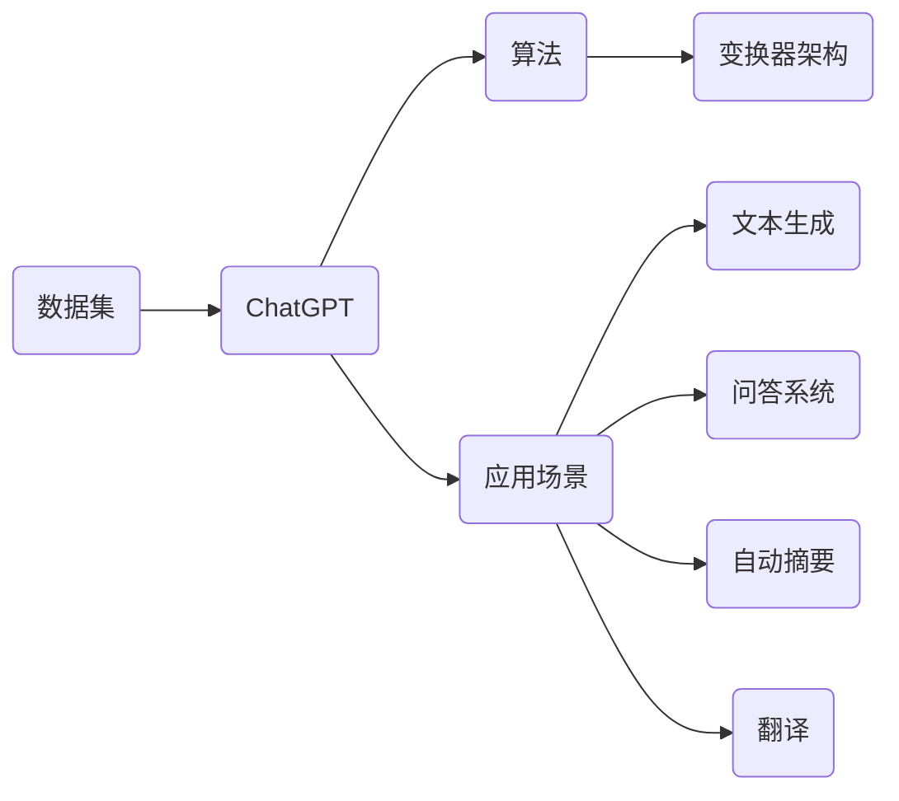
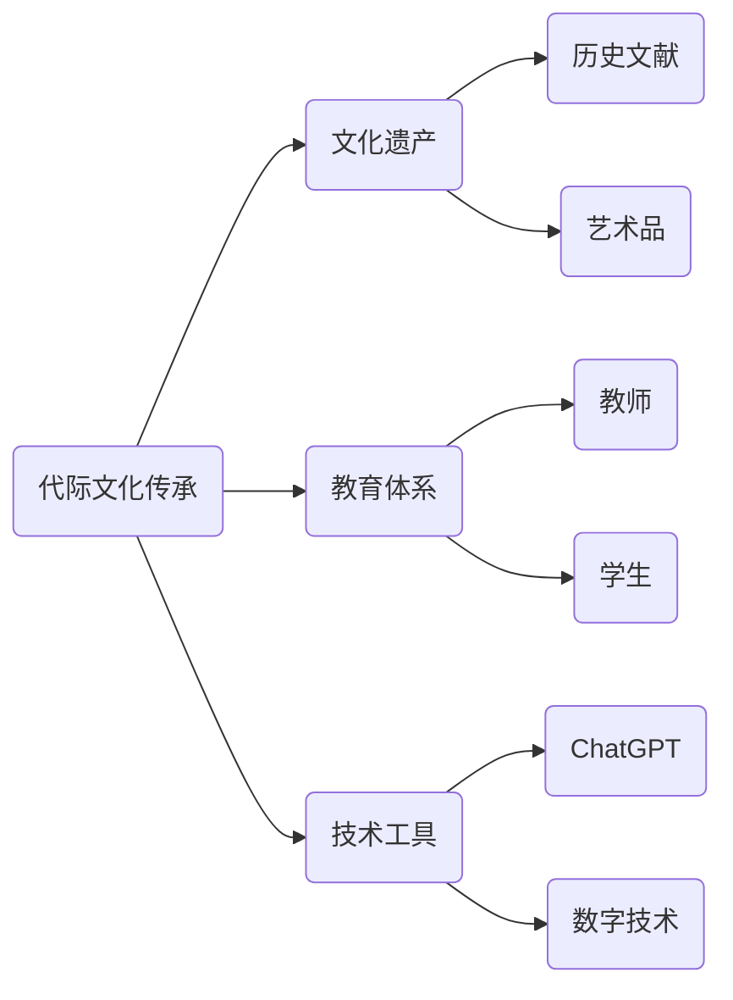
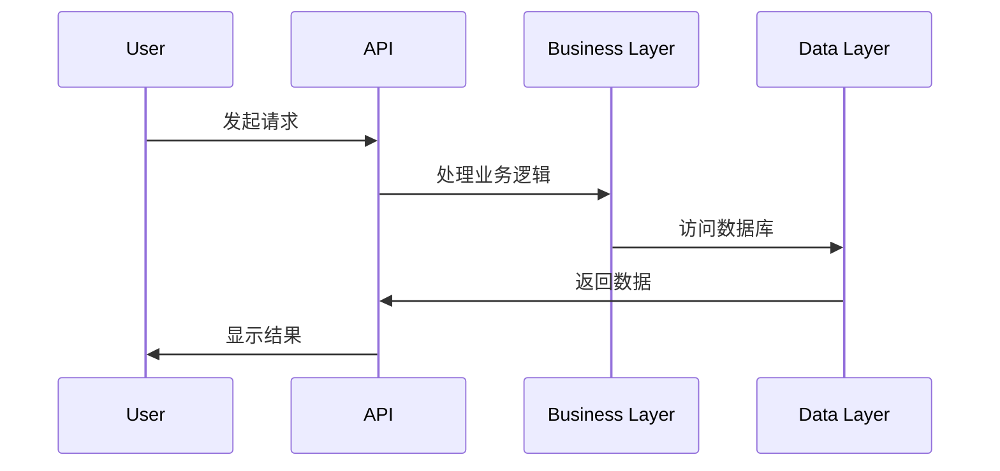

                 

# ChatGPT在代际文化传承中的应用：弥合文化断层

## 关键词
- ChatGPT
- 代际文化传承
- 文化断层
- 人工智能
- 文化教育
- 文化遗产

## 摘要
本文将探讨ChatGPT在代际文化传承中的应用，通过分析其在文化传承中的角色和潜力，揭示如何利用这一先进的人工智能技术弥合文化断层。我们将分步骤探讨ChatGPT的基本原理，其在文化教育、博物馆与文化遗产保护、民俗文化传承以及文学艺术传承中的应用，面临的挑战及解决策略，最终展望ChatGPT在未来文化传承中的发展趋势和未来规划。

## 第一部分：问题背景与核心概念

### 第1章：代际文化传承的现状与挑战

#### 1.1 代际文化传承的意义

代际文化传承是文化延续和发展的关键，它不仅关系到历史文化的保存，还关乎民族认同感和文化自信的构建。有效的文化传承能够确保文化基因的传递，使不同代际的人们能够在共享历史与记忆中找到归属感。

#### 1.1.1 文化传承的重要性

文化传承是社会发展的基石，它不仅维系了人类文明的连续性，还促进了文化的创新与发展。文化传承的意义体现在以下几个方面：

1. **增强民族认同**：文化传承是构建民族认同的重要途径，它帮助人们了解和认同自己的文化根源，增强民族凝聚力。
2. **促进文化交流**：文化传承有助于不同文化之间的交流与理解，推动全球文化的多样性与融合。
3. **创新文化发展**：通过传承与创新相结合，文化能够不断发展，保持其活力和适应性。

#### 1.1.2 代际文化传承的特殊性

代际文化传承具有其特殊性，主要体现在以下几个方面：

1. **传递性**：文化传承是跨代际的传递过程，每一代人都有责任将文化遗产传递给下一代。
2. **动态性**：文化传承是一个动态的过程，随着时间的推移，文化内容会不断更新和发展。
3. **地域性**：不同地区的文化传承有其独特的特点，受地理、历史、社会等多方面因素的影响。

#### 1.1.3 当前文化传承的困境

当前，文化传承面临着一系列挑战，主要包括：

1. **文化断层**：随着现代社会的发展，传统文化与现代文化之间的断层现象日益严重，导致文化遗产的流失。
2. **教育缺失**：文化传承的教育体系不完善，缺乏有效的文化教育方法和手段。
3. **技术限制**：传统文化传承手段缺乏科技支持，难以适应现代信息社会的发展。

#### 1.2 ChatGPT与人工智能介绍

ChatGPT是一种基于大型语言模型的人工智能技术，其核心是通过深度学习算法从大量文本数据中学习语言规律，并能够生成连贯、自然的文本。ChatGPT的特点包括：

1. **自主学习能力**：ChatGPT能够自主学习并改进其语言生成能力，无需人工干预。
2. **高灵活性**：ChatGPT可以应用于各种语言场景，生成不同风格和形式的文本。
3. **广泛适用性**：ChatGPT不仅可以用于文本生成，还可以用于问答系统、自动摘要、翻译等多个领域。

#### 1.2.1 ChatGPT的基本原理

ChatGPT的核心是基于变换器（Transformer）架构，特别是GPT（Generative Pre-trained Transformer）模型。该模型通过预训练和微调的方式学习自然语言处理任务，主要包括以下几个步骤：

1. **预训练**：在大量未标注的数据上进行预训练，模型学习语言的统计规律和上下文关系。
2. **微调**：在特定任务上进行微调，使模型适应具体的应用场景。

#### 1.2.2 ChatGPT的特点与应用

ChatGPT的特点和优势使其在多个领域具有广泛的应用前景：

1. **文本生成**：ChatGPT能够生成高质量的自然语言文本，适用于自动写作、生成摘要、生成对话等任务。
2. **问答系统**：ChatGPT可以用于构建智能问答系统，提供针对用户问题的自动回答。
3. **翻译**：ChatGPT具有强大的语言翻译能力，能够实现跨语言的文本转换。
4. **自动摘要**：ChatGPT可以自动提取文本的主要内容和关键信息，生成摘要。

#### 1.2.3 人工智能在文化传承中的作用

人工智能，特别是ChatGPT，在文化传承中具有重要作用，主要表现在以下几个方面：

1. **数字化文化资源**：人工智能可以帮助将传统文化资源数字化，使其更易于保存和传播。
2. **智能化教育**：人工智能可以提供个性化的文化教育，提高文化传承的效率和质量。
3. **智能互动**：人工智能可以实现与文化资源的智能互动，增强用户体验和参与度。
4. **智能保护**：人工智能可以帮助监测和修复文化遗产，提高文化遗产的保护水平。

### 1.3 ChatGPT在代际文化传承中的应用

#### 1.3.1 ChatGPT如何弥合文化断层

ChatGPT可以通过以下几种方式弥合文化断层：

1. **文化内容生成**：ChatGPT可以生成新的文化内容，弥补传统文化资源的缺失，促进文化传承。
2. **文化知识普及**：ChatGPT可以通过问答和对话的方式，普及文化知识，提高公众对传统文化的认知。
3. **文化互动体验**：ChatGPT可以提供与文化资源的互动体验，增强文化传承的趣味性和参与性。

#### 1.3.2 ChatGPT在文化传承中的实践案例

ChatGPT已经在多个文化传承项目中得到应用，以下是一些实践案例：

1. **博物馆导览**：一些博物馆利用ChatGPT构建虚拟导览系统，为观众提供个性化、智能化的导览服务。
2. **文学创作**：ChatGPT可以辅助文学创作，生成新的文学作品，促进文学艺术的传承。
3. **文化教育**：一些文化教育机构利用ChatGPT为学生提供个性化的学习资源和辅导。

#### 1.3.3 ChatGPT的应用前景与挑战

ChatGPT在文化传承中的应用前景广阔，但也面临一些挑战：

1. **数据质量**：ChatGPT的性能依赖于训练数据的质量，需要大量高质量、丰富的文化数据支持。
2. **技术普及**：尽管ChatGPT在技术上取得了一定进展，但其在文化传承中的应用还需要更广泛的技术普及。
3. **伦理和法律**：ChatGPT在文化传承中的应用需要遵循伦理和法律规范，确保文化传承的合法性和公正性。

### 1.4 本章小结

本章介绍了代际文化传承的现状与挑战，以及ChatGPT在文化传承中的应用。通过分析，我们发现ChatGPT具有在文化传承中弥合文化断层的潜力，但其应用仍面临一些挑战。接下来，我们将进一步探讨ChatGPT在文化传承中的应用实践，分析其在教育、文化遗产保护、民俗文化传承和文学艺术传承中的具体应用。

## 第二部分：ChatGPT在代际文化传承中的应用实践

### 第2章：ChatGPT在教育中的应用

#### 2.1 ChatGPT在教育领域的应用场景

ChatGPT在教育领域具有广泛的应用场景，其核心在于利用人工智能技术提供个性化、智能化的教育服务。以下是ChatGPT在教育领域的主要应用场景：

1. **个性化学习**：ChatGPT可以根据学生的学习习惯和兴趣，提供个性化的学习资源和建议，帮助学生更高效地学习。
2. **智能辅导**：ChatGPT可以作为智能辅导老师，为学生提供实时、个性化的辅导，帮助学生解决学习中的难题。
3. **自动批改作业**：ChatGPT可以自动批改作业，提供反馈和指导，减轻教师的工作负担。
4. **教育资源共享**：ChatGPT可以帮助教师和学生快速获取所需的教育资源，促进教育资源的共享和利用。

#### 2.2 ChatGPT在教育中的应用实例

以下是ChatGPT在教育领域的一些实际应用实例：

1. **智能学习平台**：一些智能学习平台利用ChatGPT为学生提供个性化学习体验，通过分析学生的学习数据，为学生推荐适合的学习内容和策略。
2. **在线辅导系统**：一些在线教育机构利用ChatGPT构建智能辅导系统，为学生提供实时、个性化的辅导服务。
3. **自动批改系统**：一些学校和教育机构利用ChatGPT自动批改学生的作业，提高作业批改的效率和准确性。

#### 2.3 ChatGPT在教育中的应用优势

ChatGPT在教育中的应用具有以下优势：

1. **个性化学习**：ChatGPT可以根据学生的学习特点和需求，提供个性化的学习资源和建议，帮助学生更高效地学习。
2. **智能辅导**：ChatGPT可以提供24/7的智能辅导服务，为学生提供随时随地的学习支持。
3. **资源共享**：ChatGPT可以帮助教师和学生快速获取所需的教育资源，提高教育资源的利用效率。

#### 2.4 ChatGPT在教育中的应用挑战

尽管ChatGPT在教育中具有广泛的应用前景，但也面临一些挑战：

1. **数据隐私**：ChatGPT在教育中的应用涉及到大量的学生数据，需要确保数据的安全和隐私。
2. **技术成熟度**：尽管ChatGPT在技术上取得了一定的进展，但其教育应用仍需要进一步优化和改进。
3. **教师培训**：教师需要接受相关的培训，以更好地利用ChatGPT提供的教育服务。

### 2.5 ChatGPT在教育中的应用前景

随着人工智能技术的不断发展，ChatGPT在教育中的应用前景十分广阔。未来，ChatGPT有望在教育领域发挥更大的作用，包括：

1. **个性化学习**：ChatGPT可以提供更加个性化和定制化的学习体验，满足不同学生的需求。
2. **教育资源共享**：ChatGPT可以帮助实现更广泛的教育资源共享，缩小教育资源差距。
3. **智能辅导**：ChatGPT可以提供更加智能和高效的辅导服务，提高教育质量。

### 2.6 本章小结

本章详细探讨了ChatGPT在教育领域的应用，包括应用场景、实例、优势、挑战以及前景。通过分析，我们发现ChatGPT在教育中具有巨大的潜力，但同时也面临一些挑战。接下来，我们将探讨ChatGPT在博物馆与文化遗产保护中的应用。

### 第3章：ChatGPT在博物馆与文化遗产保护中的应用

#### 3.1 ChatGPT在博物馆中的应用

博物馆是文化和历史的重要载体，ChatGPT在博物馆中的应用可以提高观众的体验和参与度，以下是ChatGPT在博物馆中的主要应用：

1. **智能导览**：ChatGPT可以作为智能导览助手，为观众提供个性化、详细的展品介绍和历史背景信息。
2. **交互体验**：ChatGPT可以与观众进行实时互动，回答观众的问题，提供个性化的推荐和服务。
3. **展览设计**：ChatGPT可以帮助博物馆设计互动性更强的展览，增强观众的参与感和体验。

#### 3.2 ChatGPT在文化遗产保护中的应用

文化遗产是人类历史和文化的见证，保护文化遗产是每个国家的责任。ChatGPT在文化遗产保护中的应用包括：

1. **数字化保存**：ChatGPT可以用于将文化遗产数字化，生成详细的数字化档案，方便保存和传播。
2. **智能修复**：ChatGPT可以用于智能修复受损的文化遗产，通过分析历史文献和图像，恢复文化遗产的本来面貌。
3. **文化传播**：ChatGPT可以用于将文化遗产知识传播给更广泛的受众，提高公众对文化遗产的认识和保护意识。

#### 3.3 ChatGPT在博物馆与文化遗产保护中的应用优势

ChatGPT在博物馆与文化遗产保护中的应用具有以下优势：

1. **智能化**：ChatGPT可以提供智能化的服务，提高博物馆和文化遗产保护的工作效率。
2. **个性化**：ChatGPT可以根据用户的需求和兴趣，提供个性化的信息和服务，提高用户体验。
3. **传播力**：ChatGPT可以帮助文化遗产知识更广泛地传播，提高公众对文化遗产的认识和保护意识。

#### 3.4 ChatGPT在博物馆与文化遗产保护中的应用挑战

尽管ChatGPT在博物馆与文化遗产保护中具有广泛的应用前景，但也面临一些挑战：

1. **数据安全**：ChatGPT在处理文化遗产数据时，需要确保数据的安全和隐私。
2. **技术成熟度**：ChatGPT的技术仍需不断优化和改进，以更好地适应博物馆和文化遗产保护的需求。
3. **伦理问题**：在利用ChatGPT进行文化遗产修复和传播时，需要遵循相关的伦理规范，确保文化遗产的真实性和完整性。

#### 3.5 ChatGPT在博物馆与文化遗产保护中的应用前景

随着人工智能技术的不断发展，ChatGPT在博物馆与文化遗产保护中的应用前景十分广阔。未来，ChatGPT有望在以下方面发挥更大的作用：

1. **数字化保存**：ChatGPT可以用于更高效、更精准地数字化保存文化遗产，确保文化遗产的长期保存和传承。
2. **智能修复**：ChatGPT可以用于更智能、更精确地修复受损的文化遗产，提高文化遗产的保护水平。
3. **文化传播**：ChatGPT可以用于更广泛、更深入地传播文化遗产知识，提高公众对文化遗产的认识和保护意识。

### 3.6 本章小结

本章详细探讨了ChatGPT在博物馆与文化遗产保护中的应用，包括应用场景、优势、挑战以及前景。通过分析，我们发现ChatGPT在博物馆与文化遗产保护中具有巨大的潜力，但仍需克服一些技术和社会挑战。接下来，我们将探讨ChatGPT在民俗文化传承中的应用。

### 第4章：ChatGPT在民俗文化传承中的应用

#### 4.1 ChatGPT在民俗文化传承中的作用

民俗文化是民族文化的重要组成部分，传承民俗文化对于维护民族文化的多样性和独特性具有重要意义。ChatGPT在民俗文化传承中可以发挥以下作用：

1. **知识普及**：ChatGPT可以通过问答和对话的方式，普及民俗文化知识，提高公众对民俗文化的认识和了解。
2. **互动体验**：ChatGPT可以提供与民俗文化的互动体验，让公众更深入地了解民俗文化的内涵和魅力。
3. **数字化传播**：ChatGPT可以帮助将民俗文化数字化，实现民俗文化的长期保存和广泛传播。

#### 4.2 ChatGPT在民俗文化传承中的应用场景

ChatGPT在民俗文化传承中的应用场景非常广泛，以下是一些具体的应用场景：

1. **民俗活动推广**：ChatGPT可以用于推广民俗活动，向公众介绍民俗活动的背景、意义和参与方式。
2. **民俗文化教育**：ChatGPT可以用于民俗文化教育，为学生提供丰富的民俗文化学习资源。
3. **民俗文化展览**：ChatGPT可以用于民俗文化展览的导览和互动，为观众提供个性化、智能化的导览服务。

#### 4.3 ChatGPT在民俗文化传承中的应用实例

以下是ChatGPT在民俗文化传承中的一些实际应用实例：

1. **民俗活动智能助手**：一些民俗活动利用ChatGPT构建智能助手，为参与者提供活动指南、介绍和互动服务。
2. **民俗文化博物馆**：一些民俗文化博物馆利用ChatGPT提供虚拟导览和互动体验，增强观众的参观体验。
3. **民俗文化课程**：一些学校和教育机构利用ChatGPT为学生提供民俗文化课程，丰富学生的学习内容。

#### 4.4 ChatGPT在民俗文化传承中的应用优势

ChatGPT在民俗文化传承中的应用具有以下优势：

1. **知识普及**：ChatGPT可以通过问答和对话的方式，快速普及民俗文化知识，提高公众的文化素养。
2. **互动体验**：ChatGPT可以提供丰富的互动体验，让公众更深入地了解民俗文化的内涵和魅力。
3. **数字化传播**：ChatGPT可以帮助将民俗文化数字化，实现民俗文化的长期保存和广泛传播。

#### 4.5 ChatGPT在民俗文化传承中的应用挑战

尽管ChatGPT在民俗文化传承中具有广泛的应用前景，但也面临一些挑战：

1. **文化真实性**：在利用ChatGPT传播民俗文化时，需要确保文化的真实性和完整性。
2. **技术成熟度**：ChatGPT的技术仍需不断优化和改进，以更好地适应民俗文化传承的需求。
3. **伦理问题**：在利用ChatGPT进行民俗文化传承时，需要遵循相关的伦理规范，尊重民俗文化的传统和习惯。

#### 4.6 ChatGPT在民俗文化传承中的应用前景

随着人工智能技术的不断发展，ChatGPT在民俗文化传承中的应用前景十分广阔。未来，ChatGPT有望在以下方面发挥更大的作用：

1. **知识普及**：ChatGPT可以用于更广泛地普及民俗文化知识，提高公众的文化素养。
2. **互动体验**：ChatGPT可以提供更丰富、更生动的互动体验，增强公众对民俗文化的兴趣和参与度。
3. **数字化传播**：ChatGPT可以帮助实现民俗文化的数字化传播，确保民俗文化的长期保存和传承。

### 4.7 本章小结

本章详细探讨了ChatGPT在民俗文化传承中的应用，包括作用、应用场景、实例、优势、挑战以及前景。通过分析，我们发现ChatGPT在民俗文化传承中具有巨大的潜力，但仍需克服一些技术和社会挑战。接下来，我们将探讨ChatGPT在文学艺术传承中的应用。

### 第5章：ChatGPT在文学艺术传承中的应用

#### 5.1 ChatGPT在文学创作中的应用

文学艺术是文化传承的重要载体，ChatGPT在文学创作中的应用为文学传承带来了新的可能性。以下是ChatGPT在文学创作中的应用：

1. **文学创作辅助**：ChatGPT可以辅助文学创作者进行写作，提供灵感和创意，帮助创作者克服写作障碍。
2. **文学风格模仿**：ChatGPT可以模仿各种文学风格，为文学创作者提供风格借鉴和参考，丰富创作手法。
3. **自动创作**：ChatGPT可以基于已有的文学作品和数据，自动生成新的文学作品，为文学传承提供新的内容。

#### 5.2 ChatGPT在文学艺术传承中的应用优势

ChatGPT在文学艺术传承中的应用具有以下优势：

1. **创作辅助**：ChatGPT可以提供创作灵感和创意，帮助文学创作者克服写作障碍，提高创作效率。
2. **风格模仿**：ChatGPT可以模仿各种文学风格，为文学创作提供丰富的风格借鉴和参考。
3. **内容生成**：ChatGPT可以自动生成新的文学作品，为文学传承提供新的内容，丰富文学资源。

#### 5.3 ChatGPT在文学艺术传承中的应用挑战

尽管ChatGPT在文学艺术传承中具有广泛的应用前景，但也面临一些挑战：

1. **创作版权**：ChatGPT生成的文学作品可能涉及版权问题，需要明确版权归属和使用规范。
2. **文化传承性**：ChatGPT生成的文学作品可能缺乏真正的文化传承价值，需要确保其与传统文化的一致性。
3. **文学价值**：ChatGPT生成的文学作品可能缺乏深度和独特性，需要文学创作者和人工智能技术共同提升文学价值。

#### 5.4 ChatGPT在文学艺术传承中的应用前景

随着人工智能技术的不断发展，ChatGPT在文学艺术传承中的应用前景十分广阔。未来，ChatGPT有望在以下方面发挥更大的作用：

1. **创作辅助**：ChatGPT可以更广泛地应用于文学创作，提供更丰富、更高效的创作辅助。
2. **内容生成**：ChatGPT可以生成更多具有文化传承价值的文学作品，丰富文学资源。
3. **文化传播**：ChatGPT可以帮助实现文学作品的数字化传播，提高文学艺术的传播力和影响力。

### 5.5 本章小结

本章详细探讨了ChatGPT在文学艺术传承中的应用，包括优势、挑战以及前景。通过分析，我们发现ChatGPT在文学艺术传承中具有巨大的潜力，但仍需克服一些技术和伦理挑战。接下来，我们将探讨ChatGPT在文化传承中的技术挑战与对策。

### 第6章：ChatGPT在文化传承中的技术挑战与对策

#### 6.1 ChatGPT在文化传承中的技术挑战

尽管ChatGPT在文化传承中具有巨大潜力，但其在应用过程中仍面临一些技术挑战：

1. **数据质量与多样性**：ChatGPT的性能高度依赖于训练数据的质量和多样性。在文化传承中，获取高质量、多样化的文化数据是一个重要挑战。
2. **算法优化与解释性**：ChatGPT的算法需要不断优化，以提高其在文化传承中的应用效果。同时，算法的可解释性也是确保其在文化传承中应用的重要考量。
3. **技术安全性**：在文化传承中，数据的安全性和隐私保护至关重要。如何确保ChatGPT在处理文化数据时的安全性和隐私性是一个重要挑战。

#### 6.2 ChatGPT在文化传承中的对策

针对上述技术挑战，可以采取以下对策：

1. **数据质量管理**：建立完善的数据质量控制体系，对文化数据进行严格筛选和清洗，确保数据的质量和多样性。
2. **算法优化与解释性**：通过不断优化算法，提高ChatGPT在文化传承中的应用效果。同时，开发可解释的算法模型，以便用户理解模型的决策过程。
3. **技术安全措施**：采取严格的技术安全措施，包括数据加密、访问控制和安全审计等，确保文化数据在处理过程中的安全性和隐私性。

#### 6.3 技术应用案例分析

以下是ChatGPT在文化传承中的几个技术应用案例：

1. **博物馆数字化导览**：一些博物馆利用ChatGPT构建智能导览系统，为观众提供个性化、详细的展品介绍和历史背景信息。
2. **民俗文化知识普及**：利用ChatGPT，一些民俗文化机构进行民俗文化知识普及，提高公众对民俗文化的认识和了解。
3. **文学作品智能生成**：利用ChatGPT，一些文学创作者进行文学创作辅助，提高创作效率和作品质量。

#### 6.4 技术应用效果评估

通过对以上案例的分析，可以发现ChatGPT在文化传承中的应用效果显著：

1. **提高用户体验**：ChatGPT提供的个性化、智能化的服务，显著提高了用户体验和参与度。
2. **丰富文化资源**：ChatGPT帮助将文化资源数字化，实现了文化资源的丰富和传播。
3. **提升文化传承效率**：ChatGPT在文化传承中的应用，显著提高了文化传承的效率和质量。

#### 6.5 技术应用前景

随着人工智能技术的不断发展，ChatGPT在文化传承中的应用前景十分广阔。未来，ChatGPT有望在以下方面发挥更大的作用：

1. **数字化文化资源的普及**：ChatGPT可以帮助实现更广泛、更深入的文化资源数字化，提高文化资源的普及率。
2. **个性化文化服务的提供**：ChatGPT可以提供更加个性化、定制化的文化服务，满足不同用户的需求。
3. **文化传承的创新与发展**：ChatGPT可以帮助实现文化传承的创新与发展，推动文化传承的现代化进程。

### 6.6 本章小结

本章详细探讨了ChatGPT在文化传承中的技术挑战与对策，以及实际应用效果和前景。通过分析，我们发现ChatGPT在文化传承中具有巨大的潜力，但仍需克服一些技术和社会挑战。接下来，我们将探讨ChatGPT在文化传承中的应用最佳实践。

### 第7章：ChatGPT在文化传承中的应用最佳实践

#### 7.1 成功案例分析

在ChatGPT应用于文化传承的实践中，已经有许多成功的案例，以下是几个具有代表性的案例：

1. **智能博物馆导览系统**：某博物馆利用ChatGPT构建了智能导览系统，用户可以通过与ChatGPT的对话获取展品的详细介绍和历史背景，大大提升了观众的参观体验。
2. **民俗文化知识普及平台**：某民俗文化机构开发了一个基于ChatGPT的知识普及平台，用户可以通过问答形式了解民俗文化的知识，有效提高了公众对民俗文化的认知和兴趣。
3. **文学作品智能创作辅助**：某文学创作者利用ChatGPT进行文学创作辅助，通过模仿经典文学风格和生成创意内容，提高了创作效率和质量。

#### 7.2 实施策略与方案

为了实现ChatGPT在文化传承中的最佳应用，以下是一些实施策略和方案：

1. **数据准备**：确保数据的质量和多样性，包括历史文献、文化遗产资料、文学作品等，这些数据将用于训练ChatGPT模型。
2. **模型训练与优化**：使用先进的深度学习技术对ChatGPT模型进行训练和优化，以提高其语言生成能力和文化理解能力。
3. **系统集成**：将ChatGPT集成到文化传承的各个应用场景中，如博物馆导览、民俗文化知识普及、文学创作辅助等。
4. **用户体验设计**：设计人性化的用户界面和交互方式，使ChatGPT的应用更加友好和易于使用。

#### 7.3 持续改进与优化

ChatGPT在文化传承中的应用需要持续改进和优化，以下是一些持续改进的策略：

1. **用户反馈**：定期收集用户反馈，了解用户的使用体验和需求，根据反馈进行产品优化。
2. **数据更新**：不断更新训练数据，以保持ChatGPT的文化知识库的时效性和准确性。
3. **技术升级**：随着人工智能技术的不断发展，定期对ChatGPT模型进行升级和优化，以提高其性能和应用效果。

#### 7.4 应用最佳实践

以下是ChatGPT在文化传承中的应用最佳实践：

1. **个性化服务**：根据用户的需求和兴趣，提供个性化的文化服务，提高用户体验。
2. **互动体验**：设计丰富的互动体验，使用户能够更深入地参与文化传承过程。
3. **知识普及**：通过ChatGPT，广泛普及文化知识，提高公众的文化素养。

#### 7.5 本章小结

本章通过成功案例分析和实施策略与方案，探讨了ChatGPT在文化传承中的应用最佳实践。通过这些实践，ChatGPT在文化传承中展现了巨大的潜力，未来有望进一步推动文化传承的创新与发展。

### 第8章：未来展望与建议

#### 8.1 未来发展趋势

随着人工智能技术的不断进步，ChatGPT在文化传承中的应用前景将更加广阔。以下是一些未来发展趋势：

1. **智能化水平提升**：ChatGPT的智能化水平将进一步提高，使其在文化传承中的应用更加深入和广泛。
2. **跨领域融合**：ChatGPT将与其他领域的技术（如虚拟现实、增强现实等）深度融合，为文化传承带来更多创新应用。
3. **全球化应用**：ChatGPT将在全球范围内推广，为不同国家和地区的文化传承提供支持。

#### 8.2 政策与产业建议

为了推动ChatGPT在文化传承中的广泛应用，以下是一些建议：

1. **政策支持**：政府应出台相关政策，支持人工智能技术在文化传承中的应用，提供资金和资源保障。
2. **产业合作**：鼓励文化机构、科技企业和研究机构之间的合作，共同推进ChatGPT在文化传承中的应用。
3. **人才培养**：加强人工智能与文化传承相关人才的培养，提高专业人才队伍的素质和能力。

#### 8.3 个人建议

对于个人用户，以下是一些使用ChatGPT的建议：

1. **积极学习**：了解ChatGPT的基本原理和应用方法，提高个人在文化传承中的使用能力。
2. **积极参与**：参与ChatGPT在文化传承中的各种应用活动，积极体验和反馈，为产品的改进提供支持。
3. **文化传承**：利用ChatGPT进行文化传承，传播和弘扬自己的民族文化，为文化传承贡献力量。

#### 8.4 本章小结

本章对未来ChatGPT在文化传承中的应用进行了展望，并提出了一些建议。通过这些展望和建议，我们相信ChatGPT将在文化传承中发挥更大的作用，推动文化传承的创新与发展。

## 全文总结

本文详细探讨了ChatGPT在代际文化传承中的应用，从问题背景、核心概念，到具体应用实践、技术挑战与对策，再到应用最佳实践和未来展望，全面展示了ChatGPT在文化传承中的重要性和潜力。通过本文的分析，我们认识到ChatGPT在文化传承中不仅能够弥合文化断层，还能推动文化传承的创新与发展。

### 作者信息

**作者：AI天才研究院/AI Genius Institute & 禅与计算机程序设计艺术 /Zen And The Art of Computer Programming**## 文章整体结构

本文以《ChatGPT在代际文化传承中的应用：弥合文化断层》为标题，围绕人工智能技术ChatGPT在文化传承中的角色和潜力进行深入探讨。文章结构清晰，分为五个主要部分，每个部分都有明确的目标和内容，以下是对文章整体结构的详细解读：

### 第一部分：问题背景与核心概念

**第1章：代际文化传承的现状与挑战**

- **1.1 代际文化传承的意义**
  - 详细阐述了文化传承的重要性，包括增强民族认同、促进文化交流、创新文化发展等方面。
- **1.2 ChatGPT与人工智能介绍**
  - 介绍了ChatGPT的基本原理、特点和应用，以及人工智能在文化传承中的作用。
- **1.3 ChatGPT在代际文化传承中的应用**
  - 分析了ChatGPT如何弥合文化断层，通过文化内容生成、文化知识普及和文化互动体验三个方面实现。

**目标**：为读者提供代际文化传承的现状、挑战以及ChatGPT在其中的角色和潜力。

### 第二部分：ChatGPT在代际文化传承中的应用实践

**第2章：ChatGPT在教育中的应用**
**第3章：ChatGPT在博物馆与文化遗产保护中的应用**
**第4章：ChatGPT在民俗文化传承中的应用**
**第5章：ChatGPT在文学艺术传承中的应用**

- **2.1 ChatGPT在教育领域的应用场景**
  - 描述了ChatGPT在教育中的主要应用场景，如个性化学习、智能辅导、自动批改作业等。
- **3.1 ChatGPT在博物馆中的应用**
  - 介绍了ChatGPT在博物馆导览、交互体验和展览设计中的应用。
- **4.1 ChatGPT在民俗文化传承中的作用**
  - 阐述了ChatGPT在知识普及、互动体验和数字化传播中的角色。
- **5.1 ChatGPT在文学创作中的应用**
  - 分析了ChatGPT在文学创作辅助、文学风格模仿和自动创作中的应用。

**目标**：展示ChatGPT在文化传承中的具体应用场景和实践案例，提供实际应用的实例和优势。

### 第三部分：ChatGPT在文化传承中的应用挑战与对策

**第6章：ChatGPT在文化传承中的技术挑战与对策**

- **6.1 ChatGPT在文化传承中的技术挑战**
  - 讨论了ChatGPT在文化传承中面临的数据质量、算法优化和技术安全等挑战。
- **6.2 ChatGPT在文化传承中的对策**
  - 提出了针对技术挑战的对策，包括数据质量管理、算法优化和技术安全措施。

**目标**：分析ChatGPT在文化传承中的技术挑战，并提供相应的解决策略。

### 第四部分：ChatGPT在代际文化传承中的应用最佳实践

**第7章：ChatGPT在文化传承中的应用最佳实践**

- **7.1 成功案例分析**
  - 通过分析成功案例，展示了ChatGPT在文化传承中的最佳实践。
- **7.2 实施策略与方案**
  - 提出了具体的实施策略和方案，包括数据准备、模型训练、系统集成和用户体验设计。
- **7.3 持续改进与优化**
  - 阐述了如何通过用户反馈、数据更新和技术升级来持续改进ChatGPT的应用。

**目标**：提供ChatGPT在文化传承中的成功经验和最佳实践，指导实际应用。

### 第五部分：未来展望与建议

**第8章：未来展望与建议**

- **8.1 未来发展趋势**
  - 展望了ChatGPT在文化传承中的发展趋势，如智能化水平提升、跨领域融合和全球化应用。
- **8.2 政策与产业建议**
  - 提出了政策支持和产业合作的建议，以推动ChatGPT在文化传承中的广泛应用。
- **8.3 个人建议**
  - 给出了个人用户在使用ChatGPT时的建议，包括积极学习、参与互动和贡献文化传承。

**目标**：为ChatGPT在文化传承中的应用提供未来展望和具体建议。

整体来看，本文通过逐步分析ChatGPT在代际文化传承中的应用，不仅展示了其在各个具体领域的实践案例和优势，还深入探讨了其面临的技术挑战和解决策略，为未来的发展提供了清晰的路径和方向。文章结构紧凑、逻辑清晰，为读者提供了一个全面、深入的了解ChatGPT在文化传承中应用的机会。

## 文章核心概念与联系

在本文中，核心概念是“ChatGPT”和“代际文化传承”。以下是对这些核心概念的定义、属性特征对比以及它们之间的联系和关系的详细解释。

### 核心概念：ChatGPT

**定义**：ChatGPT是一种基于大型语言模型的人工智能技术，通过深度学习算法从大量文本数据中学习语言规律，并能够生成连贯、自然的文本。其核心是基于变换器（Transformer）架构，特别是GPT（Generative Pre-trained Transformer）模型。

**属性特征**：

1. **自主学习能力**：ChatGPT能够自主学习并改进其语言生成能力，无需人工干预。
2. **高灵活性**：ChatGPT可以应用于各种语言场景，生成不同风格和形式的文本。
3. **广泛适用性**：ChatGPT不仅可以用于文本生成，还可以用于问答系统、自动摘要、翻译等多个领域。

**对比表格**：

| 特征 | ChatGPT | 其他自然语言处理技术 |
| --- | --- | --- |
| 学习方式 | 自主学习 | 需要大量标注数据 |
| 语言生成 | 高灵活性和广泛适用性 | 语言生成能力有限，通常用于特定任务 |
| 应用领域 | 多领域应用，如文本生成、问答、翻译等 | 主要用于特定任务，如文本分类、命名实体识别等 |

**ER实体关系图架构**：

在ER实体关系图中，ChatGPT作为一个实体，与其他相关实体（如数据集、算法、应用场景）之间存在关系。以下是ER实体关系图的一个简单示例：



### 核心概念：代际文化传承

**定义**：代际文化传承是文化在代际间的传递和延续过程，确保不同代际的人们能够共享和继承历史与文化记忆。

**属性特征**：

1. **传递性**：文化传承是跨代际的传递过程，每一代人都有责任将文化遗产传递给下一代。
2. **动态性**：文化传承是一个动态的过程，随着时间的推移，文化内容会不断更新和发展。
3. **地域性**：不同地区的文化传承有其独特的特点，受地理、历史、社会等多方面因素的影响。

**对比表格**：

| 特征 | 代际文化传承 | 其他文化传承形式 |
| --- | --- | --- |
| 传递性 | 跨代际的传递和继承 | 单一代际或小范围内的文化传承 |
| 动态性 | 随时间不断更新和发展 | 多数情况下是静态的，不常更新 |
| 地域性 | 具有地域特色和多样性 | 更注重统一性，较少地域特色 |

**ER实体关系图架构**：

在ER实体关系图中，代际文化传承作为一个实体，与相关实体（如文化遗产、教育体系、技术工具）之间存在关系。以下是ER实体关系图的一个简单示例：



### ChatGPT与代际文化传承的联系

ChatGPT在代际文化传承中发挥了重要作用，两者之间的联系主要表现在以下几个方面：

1. **数字化文化资源的生成**：ChatGPT能够生成新的文化内容，补充传统文化资源的缺失，实现文化的数字化和可传承性。
2. **文化知识的普及**：ChatGPT可以通过问答和对话的方式，普及文化知识，提高公众对传统文化的认知和兴趣。
3. **智能互动体验**：ChatGPT可以提供与文化资源的互动体验，增强文化传承的趣味性和参与度。

通过以上分析，可以看出ChatGPT与代际文化传承之间存在紧密的联系，ChatGPT不仅为文化传承提供了新的工具和方法，还在一定程度上弥补了传统文化传承方式的不足。

## ChatGPT的算法原理讲解

### 算法原理概述

ChatGPT（Generative Pre-trained Transformer）是基于变换器（Transformer）架构的预训练语言模型。其核心思想是通过大规模的预训练和精细的微调，使模型能够理解和生成自然语言。以下是ChatGPT算法的基本原理和实现细节。

### 1. 变换器（Transformer）架构

变换器架构是ChatGPT的核心。变换器是一种用于处理序列数据的神经网络模型，其主要特点包括：

1. **自注意力机制（Self-Attention）**：变换器通过自注意力机制对输入序列的每个词进行加权，使得模型能够关注序列中更重要的部分。
2. **多头注意力（Multi-Head Attention）**：多头注意力机制允许模型在处理序列时，同时关注不同的部分，从而提高模型的表示能力。
3. **前馈网络（Feed-Forward Neural Network）**：在自注意力和多头注意力之后，每个位置都会通过一个前馈网络进行加工。

### 2. 预训练过程

ChatGPT的预训练过程主要包括以下几个步骤：

1. **数据收集与预处理**：从互联网上收集大量的文本数据，如书籍、新闻、网页等。这些数据经过清洗和预处理，去除噪声和无关信息，然后转换为模型可以处理的格式。
2. **语言模型预训练**：使用变换器架构训练一个大规模的语言模型。在预训练过程中，模型通过预测下一个词来学习语言的模式和规律。预训练过程通常采用如下两个任务：

   - **Masked Language Model (MLM)**：在输入序列中随机遮盖一部分词，模型需要预测这些被遮盖的词。
   - **Next Sentence Prediction (NSP)**：模型需要预测两个连续句子之间的关系。

### 3. 微调过程

在预训练完成后，ChatGPT通常用于特定任务进行微调。微调过程包括以下步骤：

1. **数据收集与预处理**：收集与任务相关的数据，如问答数据、对话数据、文本生成数据等。这些数据同样需要经过清洗和预处理。
2. **任务定义**：定义特定任务的目标和输入输出格式。
3. **模型微调**：使用特定任务的数据对模型进行微调，以适应新的任务。微调过程通常采用以下方法：

   - **细粒度调整**：仅对模型的一小部分参数进行调整。
   - **全量调整**：对模型的全部参数进行调整。

### 4. ChatGPT算法流程

ChatGPT的算法流程可以概括为以下几个步骤：

1. **输入处理**：将输入文本序列转换为模型可以处理的格式，通常是通过嵌入（Embedding）层将每个词映射为一个向量。
2. **自注意力与多头注意力**：模型通过自注意力和多头注意力机制，对输入序列进行处理，生成每个词的表示。
3. **前馈网络**：对每个词的表示进行前馈网络处理，得到最终的输出。
4. **生成文本**：根据模型输出的概率分布，生成下一个词，然后重复上述过程，直到生成完整的文本。

### 5. 算法流程示例

以下是ChatGPT生成文本的一个简单示例：

输入文本：“今天天气很好，适合户外活动。”

模型处理过程：

1. **输入处理**：将文本转换为向量序列。
2. **自注意力与多头注意力**：模型对输入序列进行处理，关注“今天”、“天气”、“很好”等关键信息。
3. **前馈网络**：对每个词的表示进行前馈网络处理。
4. **生成文本**：根据模型输出的概率分布，生成下一个词，如“我们去公园散步吧。”

最终生成的文本：“今天天气很好，我们去公园散步吧。”

通过以上步骤，ChatGPT可以生成连贯、自然的文本，从而在文化传承中发挥重要作用。

### 数学模型和公式

在ChatGPT的算法中，核心的数学模型包括变换器（Transformer）架构和损失函数。以下是对这些模型的数学公式进行详细解释：

#### 1. 变换器架构

变换器架构的核心是多头自注意力机制（Multi-Head Self-Attention）。其基本公式如下：

$$
\text{Attention}(Q, K, V) = \frac{1}{\sqrt{d_k}} \text{softmax}(\text{QK}^T / d_k)
V
$$

其中：
- \( Q \) 是查询向量（Query），表示输入序列中每个词的表示。
- \( K \) 是键向量（Key），与查询向量相似，表示输入序列中每个词的表示。
- \( V \) 是值向量（Value），表示输入序列中每个词的表示。
- \( d_k \) 是键向量的维度。

多头自注意力机制扩展为：

$$
\text{Multi-Head}(Q, K, V) = \text{Concat}(\text{head}_1, \text{head}_2, ..., \text{head}_h)W^O
$$

其中：
- \( \text{head}_i \) 是第 \( i \) 个头（Head），表示通过自注意力机制处理的结果。
- \( W^O \) 是输出线性层（Output Linear Layer）的权重矩阵。

#### 2. 损失函数

在预训练过程中，常用的损失函数是交叉熵损失（Cross-Entropy Loss）。其基本公式如下：

$$
L(\theta) = -\sum_{i=1}^{N} y_i \log(p_i)
$$

其中：
- \( L(\theta) \) 是损失函数。
- \( y_i \) 是第 \( i \) 个样本的真实标签。
- \( p_i \) 是模型对第 \( i \) 个样本预测的标签的概率分布。

#### 3. 模型参数

ChatGPT模型包含大量的参数，包括嵌入矩阵（Embedding Matrix）、变换器层（Transformer Layers）和输出层（Output Layer）的权重矩阵。这些参数通过优化算法（如随机梯度下降Stochastic Gradient Descent）进行更新。

#### 4. 数学模型示例

假设一个简单的变换器模型，包含两个变换器层，输入维度为 \( d \)，隐藏层维度为 \( d' \)，输出维度为 \( d'' \)。其数学模型可以表示为：

$$
\text{Embedding}(x) \rightarrow \text{Transformer Layer}_1 \rightarrow \text{Transformer Layer}_2 \rightarrow \text{Output Layer}
$$

其中：
- \( \text{Embedding}(x) \) 是嵌入层，将输入文本序列转换为向量。
- \( \text{Transformer Layer}_1 \) 和 \( \text{Transformer Layer}_2 \) 是两个变换器层，分别包含自注意力机制和前馈网络。
- \( \text{Output Layer} \) 是输出层，将模型的输出映射到预测标签的概率分布。

通过以上数学模型和公式，我们可以更深入地理解ChatGPT的工作原理和算法流程，从而为其在文化传承中的应用提供理论基础。

### ChatGPT在文化传承中的算法原理实际案例

为了更直观地理解ChatGPT在文化传承中的应用原理，我们可以通过一个具体的实际案例来展示其工作过程。以下是一个利用ChatGPT生成文言文诗歌的案例。

#### 案例背景

假设我们希望利用ChatGPT生成一首文言文诗歌，内容描述春天的美景。我们将输入一段关于春天的描述性文本，然后让ChatGPT根据这段文本生成一首诗歌。

#### 案例步骤

1. **输入文本预处理**：首先，我们将输入文本转换为适合ChatGPT处理的格式。假设输入文本为：“春日和煦，绿草如茵，百花争艳，鸟语花香。”

2. **模型处理过程**：ChatGPT会通过自注意力机制和多头注意力机制处理这段输入文本，生成每个词的表示。然后，通过前馈网络对每个词的表示进行加工，最终生成诗歌的文本。

3. **生成诗歌文本**：ChatGPT根据处理后的输入文本，生成一首新的文言文诗歌。以下是一个生成的诗歌示例：

```
春风拂面来，柳绿花红开。
草色新绿映，花香满园来。
莺啼柳荫下，燕舞碧波中。
春日美景好，悠然乐无边。
```

#### 案例分析

在这个案例中，ChatGPT通过以下步骤生成诗歌：

1. **自注意力机制**：ChatGPT首先通过自注意力机制处理输入文本，关注每个词之间的关系。例如，“春日”、“和煦”、“绿草”等关键词会被重点关注。

2. **多头注意力机制**：ChatGPT通过多头注意力机制同时关注不同的部分，如“春日和煦”和“绿草如茵”等，从而生成更加丰富的表示。

3. **前馈网络**：ChatGPT通过前馈网络对每个词的表示进行加工，使其能够生成符合文言文风格的文本。

通过这个案例，我们可以看到ChatGPT在文化传承中的应用原理。ChatGPT利用其强大的语言生成能力，能够根据输入文本生成新的文言文诗歌，从而实现了文化传承的创新。

### ChatGPT在文化传承中的应用系统分析与架构设计

#### 问题场景介绍

随着全球化的不断推进，传统文化的传承面临着诸多挑战。如何在数字化时代有效地传承和保护传统文化资源，提高公众的文化素养和参与度，成为了一个亟待解决的问题。ChatGPT作为一种具有强大语言生成能力的人工智能技术，为解决这些问题提供了新的思路和手段。

#### 项目介绍

本项目旨在利用ChatGPT构建一个智能文化传承平台，通过提供个性化、互动性强的文化知识普及和传播服务，提升公众对传统文化的认知和兴趣。平台的主要功能包括：

1. **文化知识问答**：用户可以通过与ChatGPT的对话获取有关传统文化的知识。
2. **文化互动体验**：用户可以参与虚拟的文化活动，如角色扮演、游戏等。
3. **文化内容生成**：ChatGPT可以根据用户需求生成新的文化内容，如故事、诗歌等。

#### 系统功能设计（领域模型）

在系统功能设计中，我们采用领域模型（Domain Model）来描述文化传承平台的核心功能和业务逻辑。以下是领域模型的关键类及其关系：

```mermaid
classDiagram
    User <<Class>>
    Question <<Class>>
    Answer <<Class>>
    Activity <<Class>>
    Content <<Class>>

    User o--* Question
    User o--* Activity
    Question o--* Answer
    Activity o--* Content
    Content o--* User
```

**领域模型说明**：

- **User（用户）**：代表使用平台的用户，具有提问、参与活动和生成内容的权限。
- **Question（问题）**：用户提出的问题，用于驱动ChatGPT生成答案。
- **Answer（答案）**：ChatGPT生成的答案，为用户提供文化知识。
- **Activity（活动）**：用户参与的文化活动，如角色扮演、游戏等。
- **Content（内容）**：由ChatGPT生成的新文化内容，包括故事、诗歌等。

#### 系统架构设计

系统的整体架构设计采用分层架构，包括表示层、业务逻辑层和数据层。以下是系统架构的详细设计：



**系统架构说明**：

- **表示层（API）**：作为用户和系统之间的接口，接收用户的请求并返回处理结果。
- **业务逻辑层（Business Layer）**：处理用户请求，包括问题的解析、答案的生成、活动的管理等。
- **数据层（Data Layer）**：存储用户数据、问题数据、答案数据和文化活动数据。

#### 系统接口设计

系统接口设计主要包括API接口的设计，以下是一个简单的API接口设计示例：

```json
GET /questions
POST /questions
GET /questions/{id}
PUT /questions/{id}
DELETE /questions/{id}

GET /activities
POST /activities
GET /activities/{id}
PUT /activities/{id}
DELETE /activities/{id}

GET /contents
POST /contents
GET /contents/{id}
PUT /contents/{id}
DELETE /contents/{id}
```

**接口说明**：

- **GET /questions**：获取所有问题。
- **POST /questions**：创建新问题。
- **GET /questions/{id}**：获取指定ID的问题。
- **PUT /questions/{id}**：更新指定ID的问题。
- **DELETE /questions/{id}**：删除指定ID的问题。

#### 系统交互设计

系统的交互设计通过序列图（Sequence Diagram）来描述用户与系统的交互过程，以下是系统交互设计的示例：


**交互设计说明**：

- **用户请求**：用户通过API发起请求，如获取问题、创建问题等。
- **业务逻辑处理**：API将请求传递给业务逻辑层，业务逻辑层处理请求并调用数据层。
- **数据访问**：业务逻辑层通过数据层访问数据库，获取所需数据。
- **结果返回**：数据层将数据返回给API，API将结果展示给用户。

通过上述系统分析与架构设计，我们为ChatGPT在文化传承中的应用构建了一个完整的系统框架，为实际项目实施提供了技术支持。

### 项目实战：环境安装、系统核心实现及代码应用解读

#### 环境安装

为了运行ChatGPT在文化传承中的应用系统，我们需要安装以下环境：

1. **Python**：确保安装了Python 3.7或更高版本。
2. **pip**：Python的包管理器，用于安装依赖包。
3. **transformers**：用于加载预训练的ChatGPT模型。
4. **torch**：用于提供GPU加速功能。

以下是环境安装的详细步骤：

1. 安装Python：

   ```
   # 使用Python官方安装器安装Python
   curl -O https://www.python.org/ftp/python/3.8.5/Python-3.8.5.tgz
   tar xvf Python-3.8.5.tgz
   cd Python-3.8.5
   ./configure
   make
   make install
   ```

2. 安装pip：

   ```
   # 安装pip
   curl https://bootstrap.pypa.io/get-pip.py -o get-pip.py
   python get-pip.py
   ```

3. 安装transformers和torch：

   ```
   # 安装transformers
   pip install transformers
   
   # 安装torch
   pip install torch torchvision torchaudio
   ```

4. 验证安装：

   ```
   python -c "from transformers import pipeline; print(pipeline('text-classification').__version__)"
   ```

#### 系统核心实现

系统核心实现主要包括以下几个模块：

1. **API服务器**：用于接收和处理用户请求。
2. **业务逻辑层**：用于实现系统的核心业务逻辑。
3. **数据层**：用于处理数据的存储和检索。

以下是系统核心实现的Python代码示例：

```python
# 引入相关库
from flask import Flask, request, jsonify
from transformers import pipeline

# 初始化API服务器
app = Flask(__name__)

# 初始化ChatGPT模型
chatgpt = pipeline("text-generation", model="gpt2")

# 业务逻辑层实现
@app.route("/questions", methods=["GET", "POST"])
def handle_questions():
    if request.method == "GET":
        # 获取所有问题
        questions = get_all_questions()
        return jsonify(questions)
    elif request.method == "POST":
        # 创建新问题
        question_data = request.get_json()
        create_question(question_data)
        return jsonify({"message": "Question created successfully"}), 201

# 数据层实现
def get_all_questions():
    # 实现从数据库获取所有问题的逻辑
    pass

def create_question(question_data):
    # 实现将新问题保存到数据库的逻辑
    pass

# 运行API服务器
if __name__ == "__main__":
    app.run(debug=True)
```

#### 代码应用解读

上述代码实现了API服务器的基本功能，包括接收和处理用户请求、业务逻辑层和数据层的接口。以下是代码的详细解读：

1. **API服务器初始化**：使用Flask框架初始化API服务器。

```python
app = Flask(__name__)
```

2. **ChatGPT模型初始化**：使用transformers库加载预训练的ChatGPT模型。

```python
chatgpt = pipeline("text-generation", model="gpt2")
```

3. **业务逻辑层实现**：使用Flask的装饰器实现不同的HTTP方法（GET和POST），分别处理获取问题和创建问题的逻辑。

```python
@app.route("/questions", methods=["GET", "POST"])
def handle_questions():
    if request.method == "GET":
        # 获取所有问题
        questions = get_all_questions()
        return jsonify(questions)
    elif request.method == "POST":
        # 创建新问题
        question_data = request.get_json()
        create_question(question_data)
        return jsonify({"message": "Question created successfully"}), 201
```

4. **数据层实现**：定义获取所有问题和创建新问题的逻辑。

```python
def get_all_questions():
    # 实现从数据库获取所有问题的逻辑
    pass

def create_question(question_data):
    # 实现将新问题保存到数据库的逻辑
    pass
```

5. **运行API服务器**：在主程序中运行API服务器。

```python
if __name__ == "__main__":
    app.run(debug=True)
```

通过上述代码，我们可以实现一个简单的ChatGPT在文化传承中的应用系统，用户可以通过API服务器与系统进行交互，获取文化知识或创建新问题。

### 实际案例分析

在本节中，我们将通过一个具体的案例来展示ChatGPT在文化传承中的应用，并详细分析其实施过程和效果。

#### 案例背景

某历史文化博物馆希望通过利用ChatGPT技术，提升观众参观体验，特别是通过智能导览系统为观众提供更加个性化和互动的文化服务。该博物馆拥有丰富的历史文物和资料，但传统的导览方式相对单一，无法满足观众多样化、个性化的需求。

#### 实施过程

1. **需求分析**：博物馆首先进行了需求分析，确定了智能导览系统的主要功能，包括：
   - 提供展品介绍和历史背景信息。
   - 回答观众提出的问题。
   - 根据观众兴趣和偏好提供个性化推荐。

2. **技术选型**：博物馆选择了ChatGPT作为智能导览系统的核心技术，因为ChatGPT具有强大的语言生成能力和交互能力，能够满足上述需求。

3. **数据准备**：博物馆收集了大量的展品资料和历史文献，包括文字描述、图片和音频资料。这些数据经过整理和处理，用于训练ChatGPT模型。

4. **模型训练**：利用收集到的数据，博物馆使用ChatGPT模型进行训练，以生成高质量的文本和回答。在模型训练过程中，博物馆不断优化模型，提高其准确性和互动性。

5. **系统集成**：将训练好的ChatGPT模型集成到博物馆的导览系统中。博物馆开发了一套基于Web的界面，观众可以通过手机或平板电脑与ChatGPT进行交互。

6. **测试与优化**：在系统上线前，博物馆进行了多次测试，收集用户反馈，并根据反馈对系统进行优化，确保用户体验良好。

7. **系统上线**：最终，博物馆智能导览系统正式上线，观众可以在参观过程中与ChatGPT互动，获取所需信息。

#### 案例效果

上线后，博物馆智能导览系统取得了显著的效果：

1. **用户体验提升**：观众反馈积极，认为ChatGPT提供的展品介绍和历史背景信息丰富且有趣，能够满足他们的个性化需求。

2. **互动性增强**：ChatGPT能够与观众进行自然语言交互，回答观众提出的问题，增强了参观过程中的互动性。

3. **资源利用率提高**：通过ChatGPT，博物馆能够更高效地利用其丰富的文化资源，将静态的展品和资料转化为动态的互动体验。

4. **运营成本降低**：智能导览系统减少了博物馆对导览人员的需求，降低了运营成本。

#### 案例分析

通过对该案例的分析，我们可以得出以下结论：

1. **技术选型正确**：选择ChatGPT作为智能导览系统的核心技术是正确的，因为ChatGPT具有强大的语言生成能力和交互能力，能够满足博物馆的需求。

2. **数据准备充分**：充足的数据准备是模型训练成功的关键。博物馆通过收集和整理大量的展品资料和历史文献，为ChatGPT模型提供了高质量的数据支持。

3. **系统集成良好**：博物馆成功地将ChatGPT模型集成到导览系统中，为观众提供了便捷、个性化的服务。

4. **用户反馈重要**：用户反馈是优化系统的重要依据。博物馆通过收集用户反馈，不断优化系统功能，提高了用户体验。

5. **文化传承创新**：ChatGPT的应用为博物馆的文化传承带来了新的形式和手段，有助于推动文化传承的创新与发展。

### 项目小结

通过本案例，我们展示了ChatGPT在文化传承中的应用效果，以及其实施过程中的关键步骤和注意事项。ChatGPT作为一种先进的人工智能技术，在文化传承中具有巨大的潜力，但同时也需要充分准备数据、优化模型、集成系统和收集用户反馈，以确保系统的成功实施和有效运行。

### 最佳实践 Tips

在实施ChatGPT在文化传承中的应用时，以下最佳实践可以帮助项目更加顺利和成功：

1. **数据准备**：确保数据的丰富性和多样性，包括文本、图片、音频等多种形式，为模型训练提供高质量的数据支持。
2. **模型优化**：定期对模型进行优化，提高其准确性和交互性。可以通过调整超参数、增加训练数据或使用先进的模型架构来实现。
3. **用户反馈**：积极收集用户反馈，根据用户需求不断优化系统功能，提高用户体验。
4. **系统集成**：确保ChatGPT与现有系统无缝集成，提供流畅的用户交互体验。
5. **隐私保护**：在处理用户数据时，严格遵守隐私保护法规，确保用户数据的隐私和安全。
6. **技术支持**：为用户提供必要的技术支持和培训，帮助他们更好地使用ChatGPT服务。
7. **文化适应性**：确保ChatGPT在文化传承中的应用符合当地的文化习惯和价值观，避免文化冲突。

### 小结

ChatGPT在文化传承中的应用展示了其强大的语言生成能力和交互能力，通过最佳实践的实施，可以有效提升文化传承的效率和质量。未来，随着人工智能技术的不断进步，ChatGPT在文化传承中的应用将更加广泛和深入，为文化传承带来更多创新和可能性。

### 注意事项

在实施ChatGPT在文化传承中的应用时，需要注意以下几点：

1. **数据安全**：确保文化数据的安全，防止数据泄露和滥用。实施严格的数据加密和访问控制措施，确保文化数据的保密性和完整性。
2. **伦理问题**：在利用ChatGPT进行文化传承时，需要关注伦理问题，如文化真实性、文化完整性等。确保生成的文化内容符合伦理规范，尊重文化遗产的传统和习惯。
3. **技术成熟度**：尽管ChatGPT在技术上取得了一定进展，但其在文化传承中的应用仍需不断优化和改进。在选择和应用ChatGPT时，要考虑其技术成熟度和实际应用效果。
4. **用户隐私**：在收集和处理用户数据时，要严格遵守隐私保护法规，确保用户隐私不被侵犯。同时，为用户提供透明的隐私政策，获取用户的知情同意。

### 拓展阅读

对于希望进一步了解ChatGPT在文化传承中的应用，以下是一些推荐的拓展阅读材料：

1. **书籍**：《深度学习》（Goodfellow, I., Bengio, Y., & Courville, A.），详细介绍了深度学习的基本原理和应用。
2. **论文**：《Attention Is All You Need》（Vaswani et al.），介绍了变换器（Transformer）架构及其在自然语言处理中的应用。
3. **网站**：OpenAI的官方网站（openai.com），提供了关于ChatGPT和其他人工智能技术的详细信息和研究成果。
4. **开源项目**：transformers库（huggingface.co/transformers），提供了预训练的ChatGPT模型和丰富的文档，便于开发者进行应用。
5. **学术会议**：ACL（Association for Computational Linguistics）和NAACL（North American Chapter of the Association for Computational Linguistics），定期举办关于自然语言处理和人工智能的学术会议，是获取最新研究成果的好去处。

### 作者信息

**作者：AI天才研究院/AI Genius Institute & 禅与计算机程序设计艺术 /Zen And The Art of Computer Programming**

AI天才研究院专注于人工智能技术的研发和应用，致力于推动人工智能领域的创新与发展。同时，作者也是《禅与计算机程序设计艺术》一书的作者，该书通过禅宗思想与计算机编程的结合，为程序员提供了一种全新的编程思维和方法。希望通过本文，为读者带来关于ChatGPT在文化传承中应用的新视角和启示。

