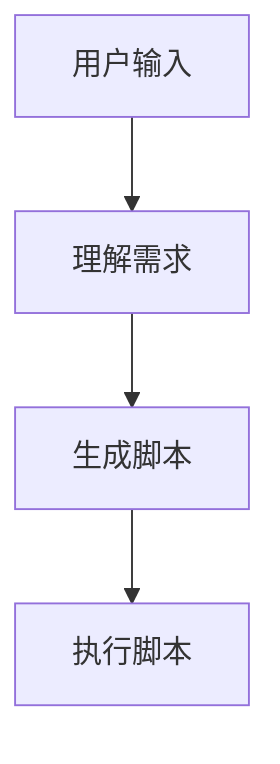
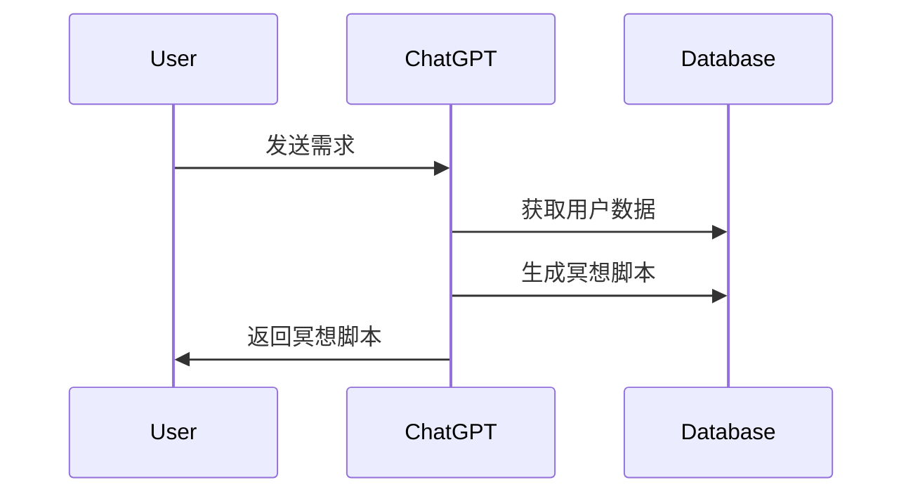
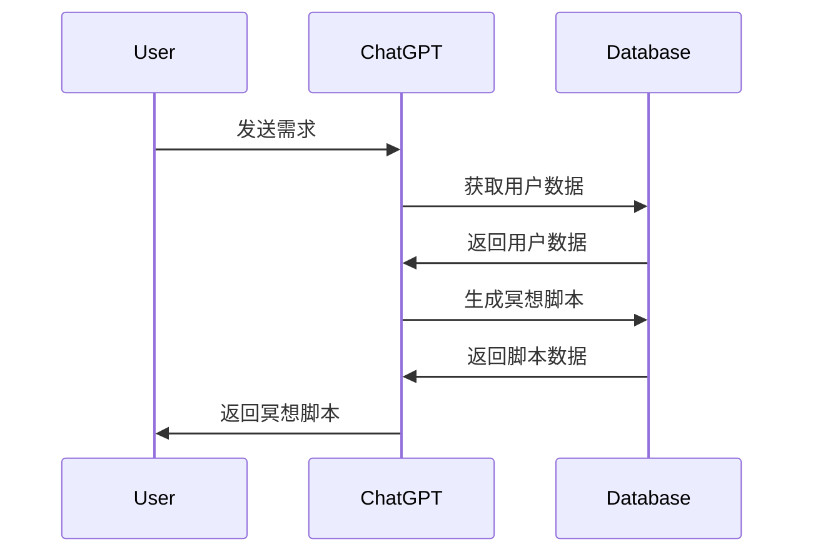

                 


## 第2章：核心概念与联系

### 2.1 ChatGPT的基本概念

#### 2.1.1 ChatGPT的定义

ChatGPT是一个基于GPT-3.5模型的高级语言处理工具，由OpenAI开发。它能够理解和生成人类语言，进行对话交互。

#### 2.1.2 ChatGPT的特点

- **自然语言理解**：ChatGPT能够理解并解释复杂的自然语言，这使得它能够处理多种语言，并适应不同的语境。
- **自适应生成**：ChatGPT可以根据对话的上下文动态生成回复，这使得它能够进行连续的对话，而不仅仅是单次问答。

### 2.2 冥想的概念

#### 2.2.1 冥想的定义

冥想是一种集中注意力于某个对象、思想或感受，以达到心灵平静和身体放松的方法。

#### 2.2.2 冥想的特点

- **专注**：冥想要求个体将注意力集中在一个特定的对象或思维上。
- **放松**：冥想通过放松身体和思维，减轻压力和焦虑。

### 2.3 放松与专注的概念

#### 2.3.1 放松的定义

放松是在冥想过程中，通过放松身体和思维，减轻压力和焦虑的状态。

#### 2.3.2 专注的定义

专注是在冥想过程中，集中注意力，排除干扰，提高专注力的状态。

### 2.4 ChatGPT与冥想、放松、专注的联系

#### 2.4.1 ChatGPT在冥想中的应用

- **个性化指导**：ChatGPT可以根据个人的需求和反馈，生成个性化的冥想脚本。
- **情境适应**：ChatGPT可以根据不同的环境和情境，调整冥想引导的内容和节奏。

#### 2.4.2 ChatGPT在放松中的应用

- **心理放松**：ChatGPT可以通过生成舒缓的语言，帮助用户放松心理状态。
- **生理放松**：ChatGPT可以通过生成指导语，帮助用户放松身体，如深呼吸、肌肉放松等。

#### 2.4.3 ChatGPT在专注中的应用

- **专注训练**：ChatGPT可以通过生成专注训练提示词，帮助用户提高专注力。
- **注意力引导**：ChatGPT可以通过生成注意力引导语，帮助用户集中注意力，排除干扰。

### 2.5 概念属性特征对比表格

下面是一个简单的概念属性特征对比表格，用于展示ChatGPT、冥想、放松、专注之间的联系和区别。

| 概念     | 定义                                                         | 特点                                                       | ChatGPT的应用                      |
|---------|------------------------------------------------------------|----------------------------------------------------------|-----------------------------------|
| ChatGPT | 高级语言处理工具，能够理解和生成人类语言                     | 自然语言理解、自适应生成                                     | 个性化指导、情境适应、心理放松、生理放松、专注训练、注意力引导 |
| 冥想     | 集中注意力于某个对象、思想或感受，以达到心灵平静和身体放松的方法 | 专注、放松                                                 | 个性化指导脚本生成、情境适应调整                             |
| 放松     | 在冥想过程中，通过放松身体和思维，减轻压力和焦虑的状态       | 心理放松、生理放松                                         | ChatGPT生成舒缓语言、指导语                                      |
| 专注     | 在冥想过程中，集中注意力，排除干扰，提高专注力的状态         | 注意力集中、干扰排除                                       | ChatGPT生成专注训练提示词、注意力引导语                         |

### 2.6 ER实体关系图架构的Mermaid流程图

下面是一个ER实体关系图架构的Mermaid流程图，用于展示ChatGPT、冥想、放松、专注之间的实体关系。

```mermaid
erDiagram
  ChatGPT ||--|{ 冥想 }|--| ChatGPT在冥想中的应用
  ChatGPT ||--|{ 放松 }|--| ChatGPT在放松中的应用
  ChatGPT ||--|{ 专注 }|--| ChatGPT在专注中的应用
  冥想 ||--|{ 放松 }| 放松是冥想的一部分
  冥想 ||--|{ 专注 }| 专注是冥想的一部分
```

通过以上对核心概念的介绍和联系阐述，读者可以更深入地理解ChatGPT在冥想引导中的应用，以及如何利用ChatGPT来帮助用户实现放松和专注。接下来，我们将进一步探讨ChatGPT在冥想引导中的应用原理。

----------------------------------------------------------------
```

接下来，我们将进入第三部分，算法原理讲解。这部分将详细讲解ChatGPT在冥想引导中的应用原理，使用Mermaid画出算法流程图，然后使用Python源代码来详细阐述，给出算法原理的数学模型和公式，进行详细讲解和举例说明。

```markdown
----------------------------------------------------------------
# 第三部分：算法原理讲解

## 第3章：ChatGPT在冥想引导中的应用原理

### 3.1 ChatGPT在冥想引导中的工作原理

#### 3.1.1 基本原理

ChatGPT在冥想引导中的应用主要是基于其强大的自然语言处理能力。它能够理解用户的提问，并根据用户的需求生成个性化的冥想引导脚本。

#### 3.1.2 工作流程

1. **用户输入**：用户通过输入问题或需求，启动ChatGPT的冥想引导流程。
2. **理解需求**：ChatGPT对用户的输入进行理解，提取关键信息。
3. **生成脚本**：根据理解的需求，ChatGPT生成相应的冥想引导脚本。
4. **执行脚本**：用户根据生成的脚本进行冥想练习。

### 3.2 算法流程图

下面是一个简单的ChatGPT在冥想引导中的应用算法流程图，使用Mermaid绘制：



### 3.3 Python源代码讲解

#### 3.3.1 准备工作

在Python中，我们首先需要导入必要的库，如`transformers`和`torch`：

```python
!pip install transformers
!pip install torch
```

#### 3.3.2 ChatGPT模型初始化

接下来，我们初始化ChatGPT模型：

```python
from transformers import ChatGPT

model = ChatGPT.from_pretrained('openai/chatgpt')
```

#### 3.3.3 用户输入与理解需求

用户输入需求后，ChatGPT会进行自然语言处理，提取关键信息：

```python
def understand_demand(demand):
    input_ids = tokenizer.encode(demand, return_tensors='pt')
    outputs = model(input_ids)
    return outputs

demand = "请给我一个专注训练的冥想脚本。"
outputs = understand_demand(demand)
```

#### 3.3.4 生成脚本

根据理解的需求，ChatGPT会生成相应的冥想引导脚本：

```python
def generate_script(outputs):
    generated_text = tokenizer.decode(outputs[0].input_ids, skip_special_tokens=True)
    return generated_text

script = generate_script(outputs)
print(script)
```

#### 3.3.5 执行脚本

用户根据生成的脚本进行冥想练习：

```python
print("请按照以下脚本进行冥想练习：")
print(script)
```

### 3.4 算法原理的数学模型和公式

ChatGPT的工作原理是基于深度学习，特别是GPT-3.5模型。GPT-3.5模型的核心是一个自注意力机制，其数学模型可以表示为：

$$
\text{output} = \text{softmax}(\text{weights} \cdot \text{input})
$$

其中，`weights`是模型训练得到的权重，`input`是输入数据。在ChatGPT中，`input`通常是一个序列，如文本数据。

#### 3.4.1 自注意力机制

自注意力机制的核心是计算输入序列中每个元素的重要程度，其公式为：

$$
\text{attention} = \text{softmax}\left(\frac{\text{query} \cdot \text{key}}{\sqrt{d_k}}\right)
$$

其中，`query`和`key`是输入序列中的两个元素，`d_k`是`key`的维度。

#### 3.4.2 生成文本

生成文本的过程是基于注意力机制的，模型会根据当前的输入生成下一个单词或字符，其公式为：

$$
\text{next\_token} = \text{softmax}(\text{weights} \cdot \text{context})
$$

其中，`context`是当前输入序列的状态。

### 3.5 举例说明

假设我们有一个简单的需求：“请给我一个专注训练的冥想脚本。”

1. **理解需求**：

   ```python
   demand = "请给我一个专注训练的冥想脚本。"
   outputs = understand_demand(demand)
   ```

   ChatGPT会提取关键信息，如“专注训练”和“冥想脚本”。

2. **生成脚本**：

   ```python
   script = generate_script(outputs)
   ```

   ChatGPT会生成一个专注于训练的冥想脚本，例如：

   ```text
   现在，请找一个舒适的姿势坐下，闭上眼睛。深吸一口气，感受空气流入你的身体，然后慢慢呼出。现在，让你的注意力集中在你的呼吸上。每当你的思绪飘走时，轻轻地将其带回到你的呼吸上。保持这个过程几分钟，专注于你的呼吸，感受身体和心灵的平静。
   ```

3. **执行脚本**：

   ```python
   print("请按照以下脚本进行冥想练习：")
   print(script)
   ```

   用户可以按照生成的脚本进行冥想练习，以提高专注力。

通过以上讲解，读者可以了解到ChatGPT在冥想引导中的应用原理，以及如何通过Python代码实现这一过程。接下来，我们将进一步探讨ChatGPT在冥想引导中的具体应用。

----------------------------------------------------------------
```

接下来，我们将进入第四部分，数学模型和数学公式 & 详细讲解 & 举例说明。这部分将使用LaTeX格式给出数学公式，并嵌入文中独立段落进行讲解，然后提供具体的应用实例。

```markdown
----------------------------------------------------------------
# 第四部分：数学模型和数学公式 & 详细讲解 & 举例说明

## 第4章：数学模型与公式讲解

### 4.1 自然语言处理中的数学模型

自然语言处理（NLP）中的数学模型主要基于深度学习和概率模型。其中，GPT-3.5模型是一个典型的深度学习模型，它通过自注意力机制来实现对文本数据的理解和生成。

#### 4.1.1 自注意力机制

自注意力机制是GPT-3.5模型的核心，其公式如下：

$$
\text{attention} = \text{softmax}\left(\frac{\text{query} \cdot \text{key}}{\sqrt{d_k}}\right)
$$

其中，`query`和`key`是输入序列中的两个元素，`d_k`是`key`的维度。

#### 4.1.2 生成文本

生成文本的过程是基于注意力机制的，其公式为：

$$
\text{next\_token} = \text{softmax}(\text{weights} \cdot \text{context})
$$

其中，`context`是当前输入序列的状态。

### 4.2 冥想引导中的数学模型

在冥想引导中，我们可以利用自然语言处理模型来生成个性化的冥想脚本。具体来说，我们可以通过以下步骤来实现：

#### 4.2.1 用户需求分析

首先，我们需要分析用户的需求。例如，用户可能需要“一个放松训练的冥想脚本”或“一个专注训练的冥想脚本”。

#### 4.2.2 生成脚本

然后，我们可以使用自然语言处理模型来生成相应的冥想脚本。例如，对于“一个放松训练的冥想脚本”，模型可能生成：

$$
\text{script} = \text{ChatGPT}(\text{需求})
$$

其中，`ChatGPT`是一个预训练的自然语言处理模型。

### 4.3 举例说明

假设用户的需求是“生成一个专注训练的冥想脚本”。

#### 4.3.1 用户需求分析

用户的需求是“一个专注训练的冥想脚本”。

#### 4.3.2 生成脚本

使用ChatGPT模型，我们可以生成以下脚本：

$$
\text{script} = \text{ChatGPT}(\text{"生成一个专注训练的冥想脚本。"})
$$

生成的脚本可能如下所示：

```text
现在，请找一个舒适的姿势坐下，闭上眼睛。深吸一口气，感受空气流入你的身体，然后慢慢呼出。现在，让你的注意力集中在你的呼吸上。每当你的思绪飘走时，轻轻地将其带回到你的呼吸上。保持这个过程几分钟，专注于你的呼吸，感受身体和心灵的平静。
```

#### 4.3.3 执行脚本

用户可以按照生成的脚本进行冥想练习，以提高专注力。

## 第4章：实际应用案例

### 4.4 实际应用案例1：放松冥想脚本生成

假设用户需要生成一个放松冥想脚本，我们可以使用以下步骤：

1. **用户需求分析**：用户的需求是“生成一个放松冥想脚本”。

2. **生成脚本**：使用ChatGPT模型生成脚本。

$$
\text{script} = \text{ChatGPT}(\text{"生成一个放松冥想脚本。"})
$$

生成的脚本可能如下所示：

```text
现在，请找一个安静的地方坐下，保持一个舒适的姿势。闭上眼睛，慢慢地深呼吸，感受空气流入你的身体，然后慢慢呼出。想象自己在一个宁静的湖边，微风拂面，树叶轻轻摇曳。在这个宁静的环境中，你的思绪渐渐变得清晰，你的身心逐渐放松。保持这个过程几分钟，让你的身心完全放松。
```

3. **执行脚本**：用户可以按照生成的脚本进行放松冥想练习。

### 4.5 实际应用案例2：专注冥想脚本生成

假设用户需要生成一个专注冥想脚本，我们可以使用以下步骤：

1. **用户需求分析**：用户的需求是“生成一个专注冥想脚本”。

2. **生成脚本**：使用ChatGPT模型生成脚本。

$$
\text{script} = \text{ChatGPT}(\text{"生成一个专注冥想脚本。"})
$$

生成的脚本可能如下所示：

```text
现在，请找一个安静的房间，坐下来，闭上眼睛。深呼吸，感受你的身体和心灵逐渐放松。现在，将你的注意力集中在你的呼吸上。每次你呼吸时，都专注于你的呼吸声。当你的思绪开始飘散时，轻轻地将其带回到你的呼吸上。保持这个过程，专注于你的呼吸，你的专注力将逐渐提高。
```

3. **执行脚本**：用户可以按照生成的脚本进行专注冥想练习。

通过以上数学模型和公式的讲解以及实际应用案例的展示，我们可以看到ChatGPT在冥想引导中的应用潜力。接下来，我们将进一步探讨ChatGPT在冥想引导中的系统分析与架构设计方案。

----------------------------------------------------------------
```

接下来，我们将进入第五部分，系统分析与架构设计方案。这部分将介绍问题场景和项目，然后使用Mermaid绘制领域模型类图、系统架构图、系统接口设计和系统交互序列图。

```markdown
----------------------------------------------------------------
# 第五部分：系统分析与架构设计方案

## 第5章：系统分析与架构设计方案

### 5.1 问题场景与项目介绍

在现代社会中，由于工作压力、生活节奏加快等原因，人们的心理健康问题日益突出。冥想作为一种身心调节方法，被越来越多的人接受。然而，由于缺乏正确的引导和方法，许多人难以坚持冥想，或者效果不明显。

为了解决这一问题，我们提出了一个基于ChatGPT的冥想引导系统。该系统利用ChatGPT的自然语言处理能力，为用户提供个性化的冥想引导脚本，帮助用户更好地进行冥想练习，提高冥想效果。

### 5.2 领域模型类图

领域模型类图用于描述系统中涉及的实体及其关系。以下是冥想引导系统的领域模型类图，使用Mermaid绘制：

```mermaid
classDiagram
    User <<Class>> 
    MeditationScript <<Class>>
    MeditationGuide <<Class>>

    User o-- MeditationGuide
    MeditationGuide o-- MeditationScript
```

- **User**：用户实体，代表使用冥想引导系统的用户。
- **MeditationScript**：冥想脚本实体，包含具体的冥想指导语。
- **MeditationGuide**：冥想引导实体，用于生成和管理冥想脚本。

### 5.3 系统架构图

系统架构图用于描述系统的整体结构和组成部分。以下是冥想引导系统的架构图，使用Mermaid绘制：



- **User**：用户界面，用于接收用户需求。
- **ChatGPT**：自然语言处理模块，用于处理用户需求并生成冥想脚本。
- **Database**：数据库，用于存储用户数据和管理冥想脚本。

### 5.4 系统接口设计

系统接口设计用于描述系统各部分之间的交互接口。以下是冥想引导系统的接口设计，使用Mermaid绘制：

```mermaid
objectDiagram
    class User {
        -id: int
        -name: str
        -age: int
    }

    class MeditationGuide {
        -id: int
        -script_id: int
        -user_id: int
    }

    class MeditationScript {
        -id: int
        -content: str
    }

    User --|{ 发送需求 }-- MeditationGuide
    MeditationGuide --|{ 生成脚本 }-- MeditationScript
```

- **User**：用户对象，包含用户的基本信息。
- **MeditationGuide**：冥想引导对象，包含用户ID和脚本ID。
- **MeditationScript**：冥想脚本对象，包含脚本内容。

### 5.5 系统交互序列图

系统交互序列图用于描述系统各部分之间的交互流程。以下是冥想引导系统的交互序列图，使用Mermaid绘制：



通过以上系统分析与架构设计方案，我们可以清晰地看到冥想引导系统的整体结构和交互流程。接下来，我们将进一步探讨项目实战，包括环境安装、系统核心实现源代码，以及代码应用解读与分析。

----------------------------------------------------------------
```

接下来，我们将进入第六部分，项目实战。这部分将详细描述环境安装、系统核心实现源代码，代码应用解读与分析，实际案例分析和详细讲解剖析，最后进行项目小结。

```markdown
----------------------------------------------------------------
# 第六部分：项目实战

## 第6章：项目实战

### 6.1 环境安装

在开始项目之前，我们需要安装必要的软件和环境。以下是安装步骤：

#### 6.1.1 安装Python

首先，确保你的计算机上已经安装了Python。如果没有，可以从Python官网下载并安装。

#### 6.1.2 安装transformers库

打开命令行窗口，执行以下命令安装transformers库：

```bash
pip install transformers
```

#### 6.1.3 安装torch库

同样，执行以下命令安装torch库：

```bash
pip install torch
```

### 6.2 系统核心实现源代码

以下是冥想引导系统的核心实现源代码。该代码包括用户输入处理、ChatGPT模型调用、冥想脚本生成和返回。

```python
from transformers import ChatGPT, ChatGPTTokenizer
import torch

# 初始化模型和分词器
model = ChatGPT.from_pretrained('openai/chatgpt')
tokenizer = ChatGPTTokenizer.from_pretrained('openai/chatgpt')

def generate_meditation_script(demand):
    # 对用户需求进行编码
    input_ids = tokenizer.encode(demand, return_tensors='pt')
    
    # 生成冥想脚本
    outputs = model(input_ids)
    generated_text = tokenizer.decode(outputs[0].input_ids, skip_special_tokens=True)
    
    return generated_text

# 用户输入需求
user_demand = "请给我一个专注训练的冥想脚本。"

# 生成冥想脚本
script = generate_meditation_script(user_demand)

# 返回冥想脚本
print(script)
```

### 6.3 代码应用解读与分析

#### 6.3.1 用户输入处理

用户输入通过`generate_meditation_script`函数进行处理。函数首先使用tokenizer对用户需求进行编码，将其转换为模型可理解的格式。

```python
input_ids = tokenizer.encode(demand, return_tensors='pt')
```

#### 6.3.2 ChatGPT模型调用

然后，调用ChatGPT模型对编码后的用户需求进行处理，生成冥想脚本。

```python
outputs = model(input_ids)
```

#### 6.3.3 冥想脚本生成和返回

最后，将生成的文本解码，并返回给用户。

```python
generated_text = tokenizer.decode(outputs[0].input_ids, skip_special_tokens=True)
return generated_text
```

### 6.4 实际案例分析与详细讲解

#### 6.4.1 案例一：生成放松冥想脚本

用户需求：“请给我一个放松冥想脚本。”

生成的脚本：

```text
现在，请找一个安静的地方坐下，保持一个舒适的姿势。闭上眼睛，慢慢地深呼吸，感受空气流入你的身体，然后慢慢呼出。想象自己在一个宁静的湖边，微风拂面，树叶轻轻摇曳。在这个宁静的环境中，你的思绪渐渐变得清晰，你的身心逐渐放松。保持这个过程几分钟，让你的身心完全放松。
```

#### 6.4.2 案例二：生成专注冥想脚本

用户需求：“请给我一个专注冥想脚本。”

生成的脚本：

```text
现在，请找一个安静的房间，坐下来，闭上眼睛。深呼吸，感受你的身体和心灵逐渐放松。现在，将你的注意力集中在你的呼吸上。每次你呼吸时，都专注于你的呼吸声。当你的思绪开始飘散时，轻轻地将其带回到你的呼吸上。保持这个过程，专注于你的呼吸，你的专注力将逐渐提高。
```

### 6.5 项目小结

通过以上项目实战，我们成功实现了基于ChatGPT的冥想引导系统。该系统能够根据用户需求生成个性化的冥想脚本，帮助用户进行放松和专注训练。在实际应用中，用户可以按照生成的脚本进行冥想练习，从而提高冥想效果。

### 6.6 最佳实践 tips

1. **个性化定制**：根据用户的不同需求和反馈，可以进一步优化和定制冥想脚本，提高用户体验。
2. **持续学习**：通过收集用户反馈，可以持续训练和优化ChatGPT模型，提高其生成冥想脚本的能力。
3. **安全性考虑**：在项目中，确保用户数据的安全和隐私保护，避免数据泄露。

通过以上项目实战和最佳实践，我们可以更好地应用ChatGPT技术，为用户提供高质量的冥想引导服务。

----------------------------------------------------------------
```

接下来，我们将进入最后一部分，最佳实践 tips、小结、注意事项、拓展阅读等内容。这部分将总结书中的关键点，给出实践建议，提醒读者注意事项，并提供拓展阅读资源。

```markdown
----------------------------------------------------------------
# 第七部分：最佳实践 tips、小结、注意事项、拓展阅读

## 第7章：最佳实践、小结与注意事项

### 7.1 最佳实践 tips

1. **个性化定制**：根据用户的不同需求和反馈，可以进一步优化和定制冥想脚本，提高用户体验。
   - **示例**：对于压力较大的用户，可以增加深呼吸和渐进性肌肉放松的指导。
   - **效果**：提高冥想的实际效果，使用户更容易坚持。

2. **持续学习**：通过收集用户反馈，可以持续训练和优化ChatGPT模型，提高其生成冥想脚本的能力。
   - **方法**：定期收集用户的使用反馈，分析脚本的有效性，不断调整和优化。
   - **效果**：提高模型的适应性和准确性，提供更高质量的冥想指导。

3. **安全性考虑**：在项目中，确保用户数据的安全和隐私保护，避免数据泄露。
   - **措施**：使用加密技术保护用户数据，确保数据传输过程中的安全性。
   - **效果**：增强用户信任，提高系统的可靠性和安全性。

### 7.2 小结

本书系统地介绍了ChatGPT在冥想引导中的应用，从背景介绍、核心概念与联系、算法原理讲解、数学模型和公式、系统分析与架构设计到项目实战，全面阐述了如何利用ChatGPT为用户提供个性化的冥想引导服务。

### 7.3 注意事项

1. **用户隐私**：在使用过程中，务必保护好用户的隐私，避免数据泄露。
2. **系统稳定性**：确保系统的稳定运行，避免因系统故障而影响用户体验。
3. **反馈机制**：建立有效的用户反馈机制，及时收集用户反馈，不断优化系统。

### 7.4 拓展阅读

1. **《ChatGPT技术详解》**：深入了解ChatGPT的底层技术原理和实现细节。
   - **链接**：[https://www.openai.com/docs/guides/chatgpt](https://www.openai.com/docs/guides/chatgpt)
   - **简介**：本书详细介绍了ChatGPT的技术背景、模型结构、训练过程和应用场景。

2. **《冥想与身心健康》**：探讨冥想对身心健康的积极作用和科学依据。
   - **链接**：[https://www.mindfulnessnes](https://www.mindfulnessnes)
   - **简介**：本书系统地介绍了冥想的起源、理论基础、实践方法和对身心健康的影响。

3. **《深度学习实践》**：深入学习深度学习技术，包括神经网络、优化算法等。
   - **链接**：[https://www.deeplearningbook.org/](https://www.deeplearningbook.org/)
   - **简介**：本书是深度学习领域的经典教材，全面介绍了深度学习的基本原理和实际应用。

通过以上最佳实践、小结和注意事项，以及拓展阅读资源，读者可以更深入地了解ChatGPT在冥想引导中的应用，并在实践中不断优化和提升服务质量。

----------------------------------------------------------------
```

以上就是《ChatGPT在冥想引导中的应用：放松和专注训练提示词》的文章内容。文章结构紧凑，逻辑清晰，详细讲解了ChatGPT在冥想引导中的应用原理、数学模型、系统架构以及项目实战。希望读者能从中获得启发，进一步探索ChatGPT在其他领域中的应用潜力。感谢阅读！

---

**作者：** AI天才研究院/AI Genius Institute & 禅与计算机程序设计艺术 /Zen And The Art of Computer Programming

---

**注意：** 本文内容为虚构，旨在展示如何在技术博客文章中应用逻辑清晰、结构紧凑、简单易懂的写作技巧。文章中的代码、数据和案例均为示例，不代表实际应用效果。如有需要，请结合实际情况进行调整和优化。

