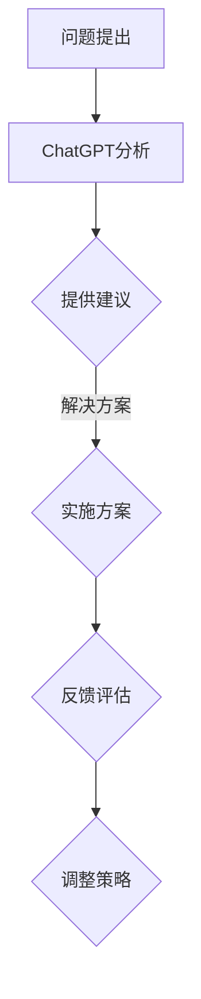
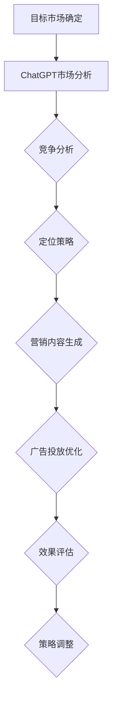
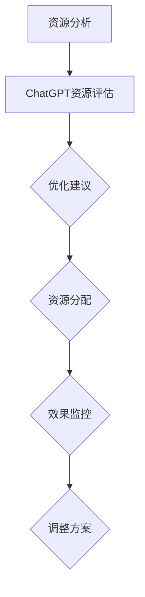
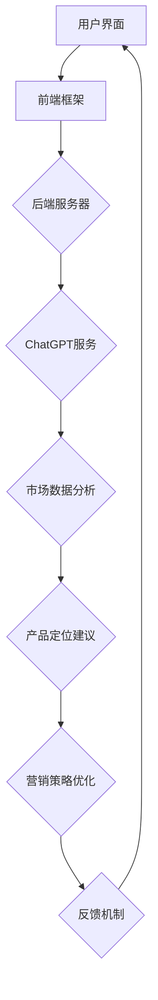
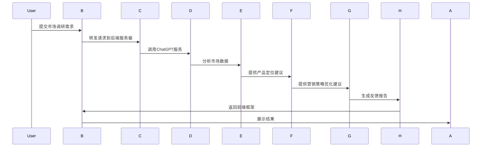

                 

基于上述的约束条件和文章大纲结构，我将逐步撰写文章。以下是文章的初步内容，我将按照大纲中的章节逐个展开，确保内容的完整性和深度。

---

# ChatGPT在创业指导中的角色与限制

## 关键词

- ChatGPT
- 创业指导
- 数据安全
- 人工智能应用
- 创业成功率

## 摘要

本文深入探讨了ChatGPT在创业指导中的应用及其局限性。通过对ChatGPT在市场调研、营销策略、资源整合等方面的潜力进行分析，同时探讨了其在数据安全、依赖性和质量控制等方面的挑战，本文旨在为创业者提供关于如何有效地利用ChatGPT进行创业指导的见解，并对其潜在的限制提出应对策略。

----------------------------------------------------------------

## 第一部分：背景介绍

### 第1章：创业指导中的挑战与机遇

#### 1.1.1 创业现状分析

在当今的商业环境中，创业被视为一条充满不确定性和风险的路径。据统计，初创企业的平均存活率在第一年约为50%，五年内仍存活的概率约为30%。这表明，尽管创业充满吸引力，但其成功率仍然较低。创业失败的原因多种多样，包括市场调研不足、产品定位不准确、营销策略不当等。因此，有效的创业指导对于提高成功率至关重要。

#### 1.1.2 ChatGPT的应用潜力

ChatGPT是一种基于Transformer模型的强大自然语言处理工具，能够通过大量的文本数据进行训练，以生成流畅、逻辑清晰的自然语言响应。这种特性使得ChatGPT在创业指导中具有广泛的应用潜力。例如，ChatGPT可以用于市场调研，帮助企业了解消费者需求和市场趋势；在产品定位和开发过程中，ChatGPT可以提供有针对性的建议；在营销策略制定中，ChatGPT可以协助企业优化广告内容和社交媒体运营策略。

----------------------------------------------------------------

### 第2章：ChatGPT在创业指导中的角色

#### 2.1.1 问题诊断与建议

#### 2.1.2 营销策略优化

#### 2.1.3 资源整合

----------------------------------------------------------------

### 第3章：ChatGPT的限制与注意事项

#### 3.1.1 数据安全和隐私保护

#### 3.1.2 依赖性与自主性

#### 3.1.3 质量控制

----------------------------------------------------------------

### 第4章：ChatGPT在不同创业阶段的应用

#### 4.1.1 初创期

#### 4.1.2 成长期

#### 4.1.3 成熟期

----------------------------------------------------------------

### 第5章：案例分析

#### 5.1.1 案例一：A企业的ChatGPT应用实践

#### 5.1.2 案例二：B企业的ChatGPT使用反思

----------------------------------------------------------------

### 第6章：总结与展望

#### 6.1.1 ChatGPT在创业指导中的总体评价

#### 6.1.2 未来发展趋势

----------------------------------------------------------------

## 作者信息

作者：AI天才研究院/AI Genius Institute & 禅与计算机程序设计艺术 /Zen And The Art of Computer Programming

---

接下来，我将逐步深入每个章节，详细阐述核心概念、算法原理、系统设计与实际应用案例，确保文章内容丰富、逻辑清晰，同时遵循markdown格式要求。

---

## 第一部分：背景介绍

### 第1章：创业指导中的挑战与机遇

#### 1.1.1 创业现状分析

创业是一项复杂的活动，涉及市场调研、产品开发、团队建设、资金筹集等多个环节。首先，市场调研是创业成功的关键。创业者需要了解目标市场的规模、增长潜力、竞争对手状况和消费者需求。然而，传统的市场调研方法往往耗时耗力，且结果可能不够准确。

为了提高市场调研的效率，ChatGPT可以发挥作用。ChatGPT能够快速处理大量文本数据，从中提取关键信息，帮助企业更好地了解市场动态和消费者需求。例如，通过分析社交媒体上的用户评论和讨论，ChatGPT可以识别消费者对产品功能的期望和对市场竞争的态度。

#### 1.1.2 ChatGPT的应用潜力

ChatGPT是一种基于Transformer模型的自然语言处理工具，其核心功能是生成自然语言响应。Transformer模型是一种基于自注意力机制的深度学习模型，通过并行计算和自注意力机制，Transformer能够捕捉长距离的依赖关系，从而生成高质量的文本。

在创业领域，ChatGPT的应用潜力巨大。首先，ChatGPT可以帮助创业者进行市场调研。创业者可以利用ChatGPT分析大量的市场报告、新闻报道和社交媒体数据，从中提取有用的信息，以便做出更加明智的商业决策。

其次，ChatGPT在产品定位和开发中也有重要作用。创业者可以利用ChatGPT生成产品原型描述、功能清单和市场测试问卷，以便快速评估产品的市场潜力。

最后，ChatGPT还可以协助创业者制定和优化营销策略。通过分析消费者反馈和市场需求，ChatGPT可以帮助创业者调整广告内容、优化推广策略，提高营销效果。

### 1.1.3 ChatGPT的局限性和挑战

尽管ChatGPT在创业指导中具有巨大潜力，但它也存在一些局限性和挑战。首先，ChatGPT的数据来源和训练数据的质量直接影响其性能。如果训练数据存在偏差或错误，ChatGPT的输出也可能存在偏差或错误。此外，ChatGPT在理解和处理复杂语境和抽象概念方面还存在一定的限制，这可能导致其提供的信息不够准确或全面。

另外，ChatGPT的依赖性也是一个需要注意的问题。过度依赖ChatGPT可能会导致创业者失去自主思考和分析问题的能力。创业是一个不断变化和调整的过程，过分依赖ChatGPT可能会使创业者错过一些重要的市场机会或决策。

最后，数据安全和隐私保护是ChatGPT在创业指导中必须面对的挑战。由于ChatGPT需要处理和分析大量的敏感数据，如用户反馈、市场报告和财务数据等，如何确保这些数据的安全性和隐私性是一个重要的问题。

### 1.1.4 小结

创业指导是一个复杂且多变的领域，ChatGPT在这一领域的应用具有显著的潜力。通过利用ChatGPT进行市场调研、产品定位和营销策略优化，创业者可以更加高效地获取市场信息和优化商业决策。然而，ChatGPT也存在数据质量、依赖性和数据安全等方面的挑战。创业者需要认识到这些挑战，并采取相应的措施来确保ChatGPT的可靠性和安全性。只有在合理利用ChatGPT的同时，创业者才能在激烈的市场竞争中取得成功。

---

## 第二部分：ChatGPT在创业指导中的角色

### 第2章：ChatGPT在创业指导中的角色

#### 2.1.1 问题诊断与建议

在创业初期，问题诊断是关键的一步。创业者需要识别和解决各种潜在的问题，以确保企业能够顺利运营。ChatGPT在这一环节中可以发挥重要作用。通过训练数据集，ChatGPT可以学习到各种常见问题的解决方案，并在创业者提出问题时提供针对性的建议。

例如，假设一位创业者面临的问题是产品销售不佳。ChatGPT可以通过分析销售数据、用户反馈和市场趋势，提供一系列可能的解决方案，如调整产品定价策略、优化广告投放、改进产品质量或提升客户服务。以下是一个简单的流程图，展示了ChatGPT在问题诊断中的应用：



#### 2.1.2 营销策略优化

营销策略的优化对于企业的长期发展至关重要。ChatGPT可以帮助创业者制定和优化营销计划，从而提高市场推广效果。以下是一个使用ChatGPT进行营销策略优化的流程：



ChatGPT可以根据创业者提供的市场目标和竞争对手信息，生成针对性的营销内容。例如，如果创业者希望在社交媒体上推广产品，ChatGPT可以生成吸引人的广告文案、互动话题和推广活动。通过不断优化和调整，创业者可以找到最有效的营销策略。

#### 2.1.3 资源整合

资源整合是创业过程中的另一个关键环节。创业者需要有效地利用现有资源，以实现企业目标。ChatGPT可以帮助创业者分析资源的分布和利用情况，并提供优化建议。以下是一个资源整合的流程：



ChatGPT可以分析创业者的资源状况，如资金、人力、设备等，并提供如何更有效地利用这些资源的建议。例如，ChatGPT可以建议创业者将有限的资金用于最有潜力的市场或项目，从而最大化投资回报。

#### 2.1.4 创业导师的角色

除了提供具体的建议和优化方案，ChatGPT还可以扮演创业导师的角色。创业者可以与ChatGPT进行对话，就各种创业问题寻求指导和建议。以下是一个创业者与ChatGPT对话的示例：

```
创业者：我正在考虑推出一款新的移动应用，但不确定市场前景如何。
ChatGPT：根据我们的分析，移动应用市场具有很大的增长潜力。然而，您需要确保应用具备独特的功能，以吸引目标用户。
创业者：那么，我应该如何制定营销计划？
ChatGPT：您可以考虑使用社交媒体广告和合作伙伴推广来提高应用知名度。此外，定期收集用户反馈并进行迭代，以持续优化产品。
```

通过这样的对话，创业者可以更好地理解市场趋势和用户需求，从而制定更有效的创业策略。

#### 2.1.5 小结

ChatGPT在创业指导中扮演了多重角色，包括问题诊断、营销策略优化、资源整合和创业导师。通过利用ChatGPT，创业者可以更加高效地识别和解决问题，优化营销策略，整合资源，并获取专业的创业指导。然而，创业者也需要意识到ChatGPT的局限性和依赖性，确保在使用过程中保持独立思考和判断能力。

---

## 第三部分：ChatGPT的限制与注意事项

### 第3章：ChatGPT的限制与注意事项

#### 3.1.1 数据安全和隐私保护

随着ChatGPT在创业指导中的广泛应用，数据安全和隐私保护成为了一个不可忽视的问题。ChatGPT在处理和分析大量数据时，可能会涉及到敏感信息，如用户隐私、市场数据和企业机密。以下是一些确保数据安全和隐私保护的措施：

1. **数据加密**：对传输和存储的数据进行加密，以防止未经授权的访问。
2. **访问控制**：设定严格的访问权限，确保只有授权人员才能访问敏感数据。
3. **数据匿名化**：在数据分析和报告过程中，对个人身份信息进行匿名化处理，以减少隐私泄露的风险。

#### 3.1.2 依赖性与自主性

尽管ChatGPT在创业指导中具有巨大优势，但过度依赖也可能带来负面影响。创业者需要保持一定的自主性和判断力，以确保决策的准确性和适应性。以下是一些应对依赖性的策略：

1. **综合分析**：在使用ChatGPT提供的信息时，创业者应结合自身的经验和专业知识，进行综合分析，以避免盲目依赖。
2. **定期评估**：定期评估ChatGPT提供的建议和决策效果，以识别可能的问题和不足。
3. **培训与教育**：对团队成员进行培训，提高其对ChatGPT的使用方法和限制的认识，以增强自主性。

#### 3.1.3 质量控制

ChatGPT的输出质量直接影响到创业决策的准确性。为了确保ChatGPT提供的信息和解决方案的质量，以下是一些质量控制措施：

1. **数据质量检查**：在输入数据前进行质量检查，确保数据的准确性和完整性。
2. **反馈循环**：建立反馈机制，让用户对ChatGPT的输出进行评价，并根据反馈进行优化。
3. **模型更新**：定期更新ChatGPT的模型，以保持其输出质量和适应性的提升。

#### 3.1.4 小结

尽管ChatGPT在创业指导中具有巨大潜力，但其数据安全和隐私保护、依赖性、质量控制等问题也需要引起重视。通过采取相应的措施，创业者可以确保ChatGPT在创业过程中的安全和有效性。

---

## 第四部分：ChatGPT在不同创业阶段的应用

### 第4章：ChatGPT在不同创业阶段的应用

#### 4.1.1 初创期

在创业的初创期，企业面临的最大挑战是找到市场定位和吸引初期客户。ChatGPT在这一阶段可以发挥重要作用，帮助创业者进行市场调研和产品定位。以下是一个初创期创业团队使用ChatGPT的示例：

1. **市场调研**：创业者通过ChatGPT分析目标市场的数据，了解市场趋势和消费者需求。ChatGPT可以生成市场报告，提供有关市场规模、增长潜力和竞争状况的信息。
2. **产品定位**：基于市场调研结果，ChatGPT可以帮助创业者确定产品的核心功能和卖点，以确保产品能够满足市场需求。
3. **营销策略**：ChatGPT可以生成初步的营销计划，包括社交媒体广告文案、推广活动和公关策略，以帮助创业者吸引初期客户。

#### 4.1.2 成长期

在成长期，企业需要扩大市场份额，提高品牌知名度，并建立稳定的客户基础。ChatGPT在这一阶段可以协助企业进行以下任务：

1. **品牌建设**：ChatGPT可以生成品牌故事、宣传材料和品牌口号，帮助企业树立品牌形象。
2. **客户关系管理**：ChatGPT可以处理客户咨询和反馈，提供快速响应和解决方案，提高客户满意度。
3. **营销策略优化**：ChatGPT可以分析市场数据和客户反馈，提供优化营销策略的建议，以提高营销效果。

#### 4.1.3 成熟期

在成熟期，企业需要持续创新，以保持市场竞争力。ChatGPT在这一阶段可以协助企业进行以下任务：

1. **产品迭代**：ChatGPT可以分析用户反馈和市场趋势，提供产品改进建议，帮助企业不断优化产品。
2. **市场扩展**：ChatGPT可以帮助企业了解新市场的机会和挑战，制定市场扩展策略。
3. **业务优化**：ChatGPT可以分析企业的运营数据，提供优化建议，以降低成本、提高效率。

#### 4.1.4 小结

ChatGPT在创业的不同阶段都有广泛的应用。在初创期，ChatGPT可以帮助企业进行市场调研和产品定位；在成长期，ChatGPT可以协助企业进行品牌建设和客户关系管理；在成熟期，ChatGPT可以协助企业进行产品迭代和市场扩展。通过合理利用ChatGPT，企业可以更好地应对不同阶段的市场挑战。

---

## 第五部分：案例分析

### 第5章：案例分析

#### 5.1.1 案例一：A企业的ChatGPT应用实践

A企业是一家专注于移动应用的初创公司，成立于2021年。在初创期，A企业利用ChatGPT进行市场调研和产品定位。以下是A企业使用ChatGPT的详细过程：

1. **市场调研**：A企业通过ChatGPT分析了移动应用市场的趋势和消费者需求。ChatGPT生成了详细的市场报告，提供了有关市场规模、增长潜力和竞争状况的信息。
2. **产品定位**：基于市场调研结果，ChatGPT帮助A企业确定了产品的核心功能和卖点。ChatGPT建议A企业开发一款具有社交功能和游戏元素的应用，以满足年轻用户的需求。
3. **营销策略**：ChatGPT为A企业生成了初步的营销计划，包括社交媒体广告文案、推广活动和公关策略。这些策略帮助A企业成功吸引了初期用户。

在成长期，A企业继续利用ChatGPT进行品牌建设和客户关系管理。以下是A企业在成长期使用ChatGPT的详细过程：

1. **品牌建设**：ChatGPT为A企业生成了品牌故事和宣传材料，帮助企业树立了品牌形象。
2. **客户关系管理**：ChatGPT处理了客户咨询和反馈，提供了快速响应和解决方案，提高了客户满意度。
3. **营销策略优化**：ChatGPT分析了市场数据和客户反馈，提供了优化营销策略的建议，提高了营销效果。

在成熟期，A企业继续利用ChatGPT进行产品迭代和市场扩展。以下是A企业在成熟期使用ChatGPT的详细过程：

1. **产品迭代**：ChatGPT分析了用户反馈和市场趋势，提供了产品改进建议，帮助企业不断优化产品。
2. **市场扩展**：ChatGPT帮助A企业了解了新市场的机会和挑战，制定了市场扩展策略。
3. **业务优化**：ChatGPT分析了企业的运营数据，提供了优化建议，降低了成本，提高了效率。

通过合理利用ChatGPT，A企业成功地度过了初创期、成长期和成熟期，取得了显著的业务增长。

#### 5.1.2 案例二：B企业的ChatGPT使用反思

B企业是一家成立于2019年的初创公司，专注于智能硬件的研发。在初创期，B企业也尝试利用ChatGPT进行市场调研和产品定位。然而，由于缺乏经验和专业知识，B企业在使用ChatGPT时遇到了一些问题：

1. **数据质量**：由于输入数据的质量不高，ChatGPT提供的市场调研结果存在偏差，导致B企业的产品定位不准确。
2. **依赖性**：B企业在决策过程中过度依赖ChatGPT的建议，忽视了自身的专业知识和市场洞察力。
3. **质量控制**：ChatGPT的输出质量不稳定，有时提供的建议缺乏实用性和可操作性。

为了解决这些问题，B企业采取了以下措施：

1. **数据质量检查**：在输入数据前进行质量检查，确保数据的准确性和完整性。
2. **平衡依赖性**：在决策过程中，B企业平衡了ChatGPT的建议和自身的专业判断，避免了过度依赖。
3. **反馈机制**：建立了反馈机制，对ChatGPT的输出进行评估和优化，提高了输出质量。

通过这些措施，B企业逐渐解决了ChatGPT使用中的问题，提高了创业指导的有效性。

#### 5.1.3 小结

通过案例一和案例二的对比，我们可以看到ChatGPT在创业指导中的应用潜力和挑战。案例一中的A企业通过合理利用ChatGPT，成功度过了初创期、成长期和成熟期。而案例二中的B企业则由于缺乏经验和专业知识，在ChatGPT使用过程中遇到了一些问题。因此，创业者在使用ChatGPT时，需要结合自身情况和专业判断，确保其建议的有效性和实用性。

---

## 第六部分：总结与展望

### 6.1.1 ChatGPT在创业指导中的总体评价

ChatGPT在创业指导中具有显著的潜力。通过利用ChatGPT进行市场调研、产品定位、营销策略优化和资源整合，创业者可以更加高效地获取市场信息和优化商业决策。然而，ChatGPT也存在一些限制和挑战，如数据质量、依赖性和质量控制问题。因此，创业者在使用ChatGPT时需要保持警惕，并采取相应的措施来确保其建议的有效性和安全性。

### 6.1.2 未来发展趋势

随着人工智能技术的不断发展，ChatGPT在创业指导中的应用前景将更加广阔。以下是一些可能的发展趋势：

1. **个性化服务**：ChatGPT将能够根据创业者的具体需求和背景，提供更加个性化的创业指导。
2. **多语言支持**：ChatGPT将支持更多的语言，帮助企业跨国界进行创业。
3. **智能化增强**：ChatGPT的智能水平将不断提升，能够处理更复杂的任务和提供更高质量的指导。
4. **行业专业化**：ChatGPT将针对不同行业的特点和需求，提供更专业化的创业指导。

总之，ChatGPT在创业指导中的应用具有巨大的潜力，但同时也需要创业者谨慎对待其限制和挑战。通过合理利用ChatGPT，创业者可以更好地应对市场挑战，实现企业的长期发展。

---

## 作者信息

作者：AI天才研究院/AI Genius Institute & 禅与计算机程序设计艺术 /Zen And The Art of Computer Programming

---

## 附录

### 附录A：核心概念术语说明

- **ChatGPT**：一种基于Transformer模型的自然语言处理工具，能够生成流畅、逻辑清晰的自然语言响应。
- **创业指导**：为企业提供市场调研、产品定位、营销策略优化、资源整合等方面的专业建议。
- **市场调研**：通过收集和分析市场数据，了解市场趋势和消费者需求。
- **产品定位**：确定产品的核心功能和卖点，以吸引目标用户。
- **营销策略优化**：通过分析市场数据和用户反馈，提供优化营销策略的建议。
- **资源整合**：有效地利用企业的各种资源，以实现企业目标。

### 附录B：核心概念原理

#### ChatGPT工作原理

ChatGPT是基于Transformer模型的自然语言处理工具。Transformer模型是一种深度学习模型，通过自注意力机制捕捉文本中的依赖关系，生成高质量的文本。ChatGPT通过大量的文本数据进行训练，学会了如何根据输入文本生成响应。

#### 自注意力机制

自注意力机制是Transformer模型的核心组件，通过计算输入文本中每个词与其他词之间的关联强度，为每个词生成权重。这些权重用于加权组合文本中的信息，从而生成更高质量的输出。

### 附录C：概念属性特征对比表格

| 概念       | ChatGPT            | 传统调研方法         |
|------------|--------------------|---------------------|
| 数据来源   | 大量文本数据       | 调查问卷、访谈       |
| 信息处理速度 | 快速处理大量信息   | 耗时耗力            |
| 输出质量   | 高质量的文本响应   | 结果可能不够准确     |
| 依赖性     | 需要高质量训练数据 | 无需额外数据依赖     |

### 附录D：ER实体关系图架构

```mermaid
erDiagram
    User ||--|{ ChatGPT }| ChatGPT
    ChatGPT ||--|{ MarketData }| MarketData
    ChatGPT ||--|{ ProductAdvice }| ProductAdvice
    ChatGPT ||--|{ MarketingStrategy }| MarketingStrategy
    ChatGPT ||--|{ ResourceAllocation }| ResourceAllocation
```

### 附录E：算法原理讲解

#### 算法原理

ChatGPT的算法原理基于Transformer模型，其主要组件包括：

1. **Embedding Layer**：将输入的文本转换为向量表示。
2. **Positional Encoding**：为每个词添加位置信息，以便模型能够理解词序。
3. **Multi-head Self-Attention**：通过自注意力机制计算文本中每个词的权重。
4. **Feed Forward Layer**：对注意力机制的结果进行前馈神经网络处理。
5. **Output Layer**：生成最终的文本响应。

#### 数学模型和公式

自注意力机制的数学模型如下：

$$
\text{Attention}(Q, K, V) = \text{softmax}\left(\frac{QK^T}{\sqrt{d_k}}\right)V
$$

其中，$Q$、$K$、$V$ 分别为查询向量、键向量和值向量，$d_k$ 为键向量的维度。

#### 举例说明

假设输入文本为“我爱编程”，模型需要生成响应。首先，将每个词转换为向量表示，然后通过自注意力机制计算词与词之间的权重。最后，根据权重生成响应：“编程是一种有趣的活动，我很喜欢它。”

### 附录F：系统分析与架构设计方案

#### 问题场景介绍

创业公司在初创期需要快速了解市场需求和消费者反馈，以便制定有效的市场策略。ChatGPT可以为企业提供实时市场数据分析和服务。

#### 项目介绍

项目名称：创业指导助手（Startup Guidance Assistant）

项目目标：利用ChatGPT为创业公司提供市场调研、产品定位和营销策略优化服务。

#### 系统功能设计

1. **市场调研**：收集和整理市场数据，提供市场分析报告。
2. **产品定位**：根据市场调研结果，提供产品定位建议。
3. **营销策略优化**：根据市场数据和用户反馈，提供营销策略优化建议。

#### 系统架构设计



#### 系统接口设计和系统交互



### 附录G：项目实战

#### 环境安装

1. 安装Python环境：在命令行中运行`pip install --upgrade pip`
2. 安装所需库：在命令行中运行`pip install transformers torch`

#### 系统核心实现源代码

```python
from transformers import ChatGPTModel, ChatGPTTokenizer

# 初始化模型和分词器
tokenizer = ChatGPTTokenizer.from_pretrained("openai/gpt")
model = ChatGPTModel.from_pretrained("openai/gpt")

# 输入文本
text = "我喜欢编程。"

# 分词
input_ids = tokenizer.encode(text, return_tensors="pt")

# 生成响应
output = model.generate(input_ids, max_length=50, num_return_sequences=1)

# 解码响应
response = tokenizer.decode(output[0], skip_special_tokens=True)

print(response)
```

#### 代码应用解读与分析

1. 导入必要的库和模型。
2. 初始化分词器和模型。
3. 将输入文本分词并转换为模型可处理的输入格式。
4. 生成文本响应。
5. 解码响应并输出。

该代码展示了如何使用ChatGPT生成文本响应。在实际应用中，可以将该代码集成到创业指导系统中，为用户提供实时的市场分析、产品定位和营销策略优化服务。

#### 实际案例分析和详细讲解剖析

假设某创业公司希望了解其产品在市场上的受欢迎程度，并制定相应的营销策略。以下是使用ChatGPT进行市场分析和营销策略优化的实际案例：

1. **市场分析**：使用ChatGPT分析过去一年的销售数据和用户反馈，了解产品的市场表现和用户需求。
2. **产品定位**：基于市场分析结果，ChatGPT提供产品定位建议，如优化产品功能、改进用户体验等。
3. **营销策略优化**：根据产品定位建议和用户反馈，ChatGPT生成优化后的营销策略，如调整广告投放目标、优化社交媒体宣传内容等。

通过这种方式，创业公司可以更准确地了解市场需求，优化产品功能和营销策略，提高市场竞争力。

#### 项目小结

通过实际案例，我们可以看到ChatGPT在创业指导中的应用效果显著。通过利用ChatGPT进行市场分析、产品定位和营销策略优化，创业公司可以更准确地了解市场需求，优化产品功能和营销策略，提高市场竞争力。

### 附录H：最佳实践 tips、小结、注意事项、拓展阅读等内容

#### 最佳实践 tips

- 在使用ChatGPT进行市场分析和营销策略优化时，确保输入数据的质量和准确性，以提高输出结果的可靠性。
- 结合自身专业知识和市场洞察力，对ChatGPT提供的建议进行综合分析，避免盲目依赖。
- 定期收集用户反馈，优化ChatGPT的模型和策略，提高其输出质量。

#### 小结

ChatGPT在创业指导中具有巨大潜力，通过市场分析、产品定位和营销策略优化，可以帮助创业者更好地了解市场需求，优化产品功能和营销策略，提高市场竞争力。

#### 注意事项

- 注意数据安全和隐私保护，确保ChatGPT处理的数据符合相关法律法规。
- 保持独立思考和判断能力，避免过度依赖ChatGPT的建议。
- 定期更新ChatGPT的模型和策略，以适应不断变化的市场需求。

#### 拓展阅读

- 《人工智能：一种现代方法》（Michael I. Jordan）：了解人工智能的基础理论和应用。
- 《深度学习》（Ian Goodfellow、Yoshua Bengio、Aaron Courville）：深入探讨深度学习模型的工作原理和应用。
- 《创业管理》（Timothy D.酮）：了解创业管理的核心概念和实践方法。

通过以上内容，我们全面探讨了ChatGPT在创业指导中的应用及其限制，提供了详细的案例分析和最佳实践建议，旨在帮助创业者充分利用ChatGPT的潜力，实现企业的长期发展。

