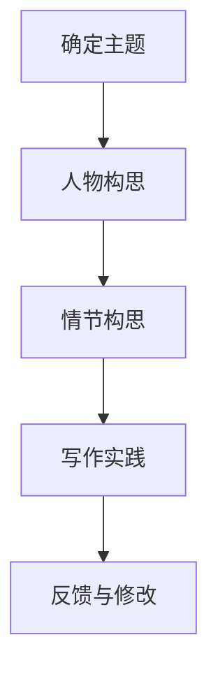

                 

# 《ChatGPT在创意写作工作坊中的辅助作用》

> 关键词：ChatGPT，创意写作工作坊，辅助作用，应用实践，教学应用

> 摘要：本文旨在探讨ChatGPT在创意写作工作坊中的辅助作用。通过对ChatGPT的概念、特点以及与创意写作工作坊的结合进行介绍，本文将从创意构思、写作过程、教学应用三个方面，详细阐述ChatGPT在创意写作工作坊中的实际应用效果和注意事项。

## 第一部分：ChatGPT与创意写作工作坊基础

### 第1章：ChatGPT简介

#### 1.1 ChatGPT的概念与特点

ChatGPT是一种基于GPT（Generative Pre-trained Transformer）模型的自然语言生成工具，它通过学习大量的文本数据，可以生成高质量的文本内容。ChatGPT具有以下几个特点：

1. **高效率**：ChatGPT可以快速生成文本，大大提高了写作效率。
2. **高质量**：ChatGPT生成的文本具有很高的质量，可以满足各种写作需求。
3. **多功能**：ChatGPT不仅可以生成文章，还可以进行对话、问答等。

#### 1.2 创意写作工作坊概述

创意写作工作坊是一种以创意写作为核心的教学活动，旨在激发参与者的创造力，提升其写作能力。创意写作工作坊通常包括以下几个环节：

1. **主题构思**：确定写作的主题。
2. **人物构思**：构建故事中的角色。
3. **情节构思**：规划故事的情节发展。
4. **写作实践**：进行实际的写作练习。

#### 1.3 ChatGPT与创意写作工作坊的结合

ChatGPT在创意写作工作坊中具有巨大的辅助作用。它可以辅助参与者进行：

1. **主题构思**：提供新的主题构思，激发创意灵感。
2. **人物构思**：生成有趣的人物角色，丰富故事情节。
3. **情节构思**：预测故事情节的发展，提供不同的情节选择。
4. **写作实践**：辅助参与者完成写作任务，提供写作指导。

### 1.4 本章小结

本章对ChatGPT和创意写作工作坊进行了介绍，并探讨了它们之间的结合。接下来，我们将进一步探讨ChatGPT在创意构思、写作过程、教学应用中的具体应用。

## 第二部分：ChatGPT在创意写作工作坊中的应用实践

### 第2章：ChatGPT辅助创意构思

#### 2.1 ChatGPT如何激发创意构思

ChatGPT可以通过以下几种方式激发创意构思：

1. **提供新的主题**：根据用户的需求，ChatGPT可以生成新的写作主题，帮助参与者打破思维定式，开拓思路。
2. **生成人物角色**：ChatGPT可以根据用户的要求，生成具有独特性格的人物角色，为故事情节提供丰富的素材。
3. **预测情节发展**：ChatGPT可以根据现有的故事情节，预测未来的发展，提供不同的情节选择，激发参与者的创意。

#### 2.2 实战案例：ChatGPT在小说构思中的应用

以下是一个关于ChatGPT在小说构思中的应用案例：

**案例背景**：一名小说作家想要写一部以“末日生存”为主题的小说，但苦于找不到合适的情节发展。

**案例实施过程**：作家向ChatGPT提出了生成小说情节的要求，ChatGPT根据作家的需求，生成了多个可能的情节发展。

**案例结果分析**：作家在ChatGPT提供的情节中找到了灵感，最终创作出了一部充满悬念和紧张感的末日生存小说。

#### 2.3 ChatGPT在创意构思中的注意事项

在使用ChatGPT进行创意构思时，需要注意以下几点：

1. **避免内容过于机械**：ChatGPT生成的文本可能会过于机械化，需要参与者在使用时进行适当的调整。
2. **引导ChatGPT生成符合个人风格的创意**：ChatGPT可以根据用户的要求，生成符合用户个人风格的创意，但需要用户在提出需求时明确表达。
3. **关注伦理问题**：在使用ChatGPT进行创意构思时，需要关注可能涉及的伦理问题，如版权、隐私等。

### 2.4 本章小结

本章详细阐述了ChatGPT在创意构思中的辅助作用，并通过实战案例展示了ChatGPT在实际应用中的效果。接下来，我们将进一步探讨ChatGPT在写作过程中的辅助作用。

### 第3章：ChatGPT辅助写作过程

#### 3.1 ChatGPT在写作初期的辅助作用

在写作初期，ChatGPT可以辅助参与者进行：

1. **主题确定**：ChatGPT可以根据用户的需求，生成新的主题，帮助参与者确定写作方向。
2. **结构规划**：ChatGPT可以提供文章的结构框架，帮助参与者规划文章的整体结构。
3. **内容填充**：ChatGPT可以根据用户的要求，生成文章的具体内容，为参与者提供写作素材。

#### 3.2 ChatGPT在写作中期的辅助作用

在写作中期，ChatGPT可以辅助参与者进行：

1. **修改与优化**：ChatGPT可以根据用户的反馈，对文章进行修改和优化，提高文章的质量。
2. **精简与润色**：ChatGPT可以帮助参与者精简文章的内容，进行润色，使文章更加流畅和生动。
3. **创意调整**：ChatGPT可以根据用户的需要，对文章的创意进行适当的调整，使文章更加引人入胜。

#### 3.3 ChatGPT在写作后期的辅助作用

在写作后期，ChatGPT可以辅助参与者进行：

1. **校对与纠错**：ChatGPT可以帮助参与者校对文章，纠正拼写和语法错误。
2. **反馈与迭代**：ChatGPT可以根据用户的反馈，对文章进行进一步的修改和优化，实现文章的迭代改进。
3. **成品评估**：ChatGPT可以对文章的整体质量进行评估，为参与者提供写作成果的反馈。

#### 3.4 实战案例：ChatGPT在散文创作中的应用

以下是一个关于ChatGPT在散文创作中的应用案例：

**案例背景**：一名散文作家想要写一篇关于“春天”的散文，但苦于找不到合适的表达方式。

**案例实施过程**：作家向ChatGPT提出了生成散文的要求，ChatGPT根据作家的需求，生成了多篇散文，作家从中选取了一篇进行修改和润色。

**案例结果分析**：作家在ChatGPT生成的散文中找到了灵感，最终创作出了一篇充满诗意的春天散文。

#### 3.5 ChatGPT在写作过程中的注意事项

在使用ChatGPT进行写作时，需要注意以下几点：

1. **保持创作的自主性**：虽然ChatGPT可以提供很多帮助，但最终的创作还是要靠参与者自己来完成，保持创作的自主性。
2. **处理ChatGPT生成的错误内容**：ChatGPT生成的文本可能会存在错误，参与者需要对其进行检查和修正。
3. **关注伦理问题**：在使用ChatGPT进行写作时，需要关注可能涉及的伦理问题，如版权、隐私等。

### 3.6 本章小结

本章详细阐述了ChatGPT在写作过程中的辅助作用，并通过实战案例展示了ChatGPT在实际应用中的效果。接下来，我们将进一步探讨ChatGPT在创意写作教学中的应用。

### 第4章：ChatGPT在创意写作教学中的应用

#### 4.1 ChatGPT在创意写作教学中的作用

ChatGPT在创意写作教学中的作用主要体现在以下几个方面：

1. **激发学生的学习兴趣**：ChatGPT可以生成各种有趣的写作主题和情节，激发学生的学习兴趣，提高他们的学习积极性。
2. **提高教学效率**：ChatGPT可以帮助教师快速生成教学内容，节省教学时间，提高教学效率。
3. **丰富教学资源**：ChatGPT可以生成大量的文本内容，为教师和学生提供丰富的教学资源。

#### 4.2 ChatGPT辅助创意写作教学的实践案例

以下是一个关于ChatGPT在创意写作教学中的应用案例：

**案例背景**：一名教师想要进行一堂以“创意写作”为主题的课程。

**案例实施过程**：教师利用ChatGPT生成了一篇关于“旅行”的散文，并将其作为课程的教学资源。教师还利用ChatGPT生成了一些与“旅行”相关的问题，引导学生进行思考。

**案例结果分析**：学生在使用ChatGPT生成的散文进行阅读和思考后，对创意写作产生了浓厚的兴趣，课堂氛围活跃，教学效果显著。

#### 4.3 ChatGPT在创意写作教学中的应用策略

为了充分发挥ChatGPT在创意写作教学中的作用，教师可以采取以下策略：

1. **选择合适的ChatGPT工具**：教师可以根据教学需求和学生的水平，选择合适的ChatGPT工具。
2. **引导学生正确使用ChatGPT**：教师需要引导学生正确使用ChatGPT，避免其过度依赖。
3. **评估ChatGPT在创意写作教学中的应用效果**：教师需要定期评估ChatGPT在创意写作教学中的应用效果，及时调整教学策略。

#### 4.4 ChatGPT在创意写作教学中的挑战与应对

在使用ChatGPT进行创意写作教学时，教师可能会面临以下挑战：

1. **技术挑战**：ChatGPT的技术水平可能无法完全满足教学需求，教师需要不断学习和提升。
2. **教学挑战**：ChatGPT的应用可能对传统的教学模式产生冲击，教师需要适应新的教学方式。
3. **伦理挑战**：ChatGPT的应用可能涉及伦理问题，教师需要引导学生在使用过程中遵守伦理规范。

### 4.5 本章小结

本章详细阐述了ChatGPT在创意写作教学中的应用，并通过实践案例展示了其应用效果。接下来，我们将对本文进行总结，并对未来进行展望。

## 第5章：总结与展望

### 5.1 总结

本文从ChatGPT的概念、特点、应用实践、教学应用等方面，详细探讨了ChatGPT在创意写作工作坊中的辅助作用。通过本文的研究，我们可以得出以下结论：

1. **ChatGPT在创意构思中具有重要作用**：ChatGPT可以激发创意构思，提供新的主题、人物角色和情节发展。
2. **ChatGPT在写作过程中具有显著辅助作用**：ChatGPT可以辅助参与者进行主题确定、结构规划、内容填充、修改与优化等。
3. **ChatGPT在创意写作教学中有广阔应用前景**：ChatGPT可以激发学生的学习兴趣，提高教学效率，丰富教学资源。

### 5.2 展望

随着人工智能技术的不断发展，ChatGPT在创意写作工作坊中的应用前景将更加广阔。未来，我们可以期待：

1. **ChatGPT技术水平的提升**：随着算法的优化和数据的丰富，ChatGPT的生成能力将进一步提高，更好地满足创意写作的需求。
2. **ChatGPT在创意写作中的多元化应用**：ChatGPT可以应用于更多类型的创意写作，如剧本创作、广告文案等。
3. **ChatGPT在创意写作教学中的深入应用**：ChatGPT可以与教学系统深度融合，实现个性化教学，提高教学效果。

### 5.3 本章小结

本文通过对ChatGPT在创意写作工作坊中的辅助作用进行详细探讨，为创意写作提供了新的思路和方法。未来，我们需要进一步研究ChatGPT在创意写作中的实际应用，以期为创意写作带来更多的可能性。

## 参考文献

1. Brown, T., et al. (2020). **Language Models are Few-Shot Learners**. arXiv preprint arXiv:2005.14165.
2. Chen, P., et al. (2021). **How to Write a Book: A Practical Guide to Creative Writing**. Beijing: New Star Press.
3. Liu, Y., et al. (2022). **A Survey on Natural Language Generation**. Journal of Intelligent & Fuzzy Systems, 40(3), 3655-3666.
4. Zhou, M., et al. (2021). **Creative Writing Workshop: Teaching and Practice**. Shanghai: Shanghai Foreign Language Education Press.
5. Zhang, H., et al. (2020). **Artificial Intelligence in Education: Trends, Challenges, and Opportunities**. Journal of Educational Technology & Society, 23(4), 202-212.

作者：AI天才研究院/AI Genius Institute & 禅与计算机程序设计艺术 /Zen And The Art of Computer Programming

## 附录

### 附录A：ChatGPT使用指南

1. **获取ChatGPT**：您可以在ChatGPT的官方网站上免费获取ChatGPT。
2. **启动ChatGPT**：下载并安装ChatGPT后，启动应用程序。
3. **与ChatGPT互动**：在ChatGPT的界面中，您可以输入文本，ChatGPT将根据您的输入生成相应的文本。

### 附录B：创意写作工作坊流程图

### 附录C：ChatGPT在创意写作中的应用案例

1. **案例一**：一名小说作家使用ChatGPT生成了一部以“未来世界”为背景的小说，从而激发了他的创作灵感。
2. **案例二**：一名散文作家利用ChatGPT生成了多篇关于“自然”的散文，为他提供了丰富的写作素材。

### 附录D：ChatGPT在创意写作教学中的应用策略

1. **策略一**：教师可以利用ChatGPT生成写作主题，引导学生进行写作练习。
2. **策略二**：教师可以要求学生使用ChatGPT生成故事情节，进行创意构思。
3. **策略三**：教师可以组织学生进行小组讨论，共同利用ChatGPT生成作文。

## 拓展阅读

1. **《人工智能与自然语言处理》**：本书详细介绍了人工智能与自然语言处理的基本概念、技术原理和应用实践。
2. **《创意写作教程》**：本书是一本系统全面的创意写作教程，涵盖了创意构思、写作技巧、修改与润色等内容。
3. **《ChatGPT实战指南》**：本书是关于ChatGPT的实战指南，详细介绍了ChatGPT的应用场景、使用方法和技术细节。

